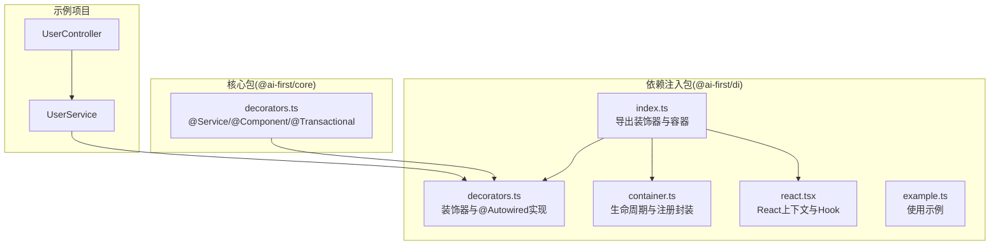
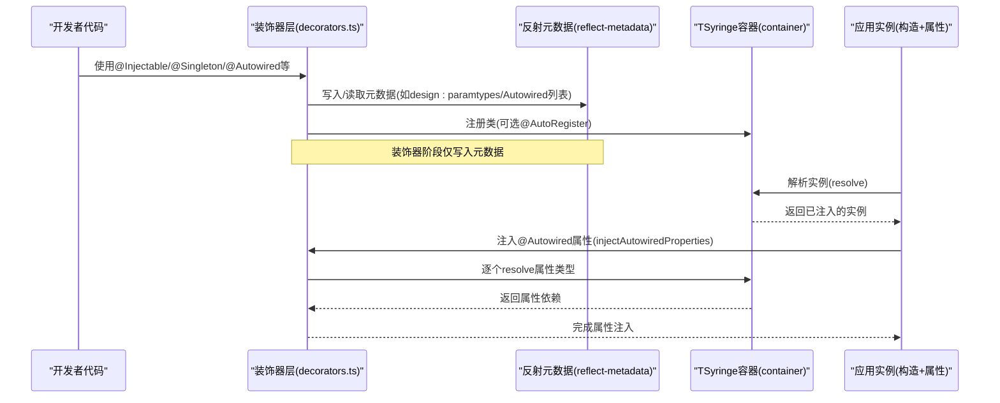
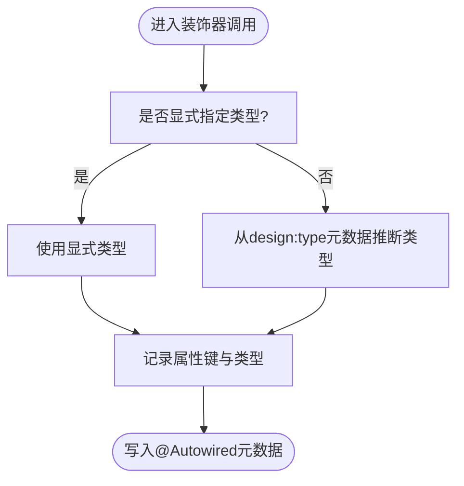
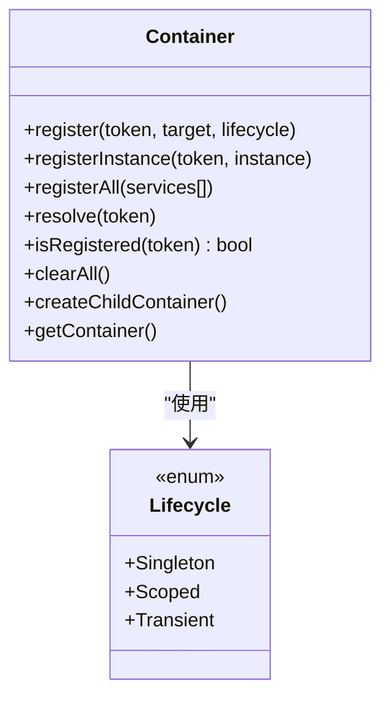
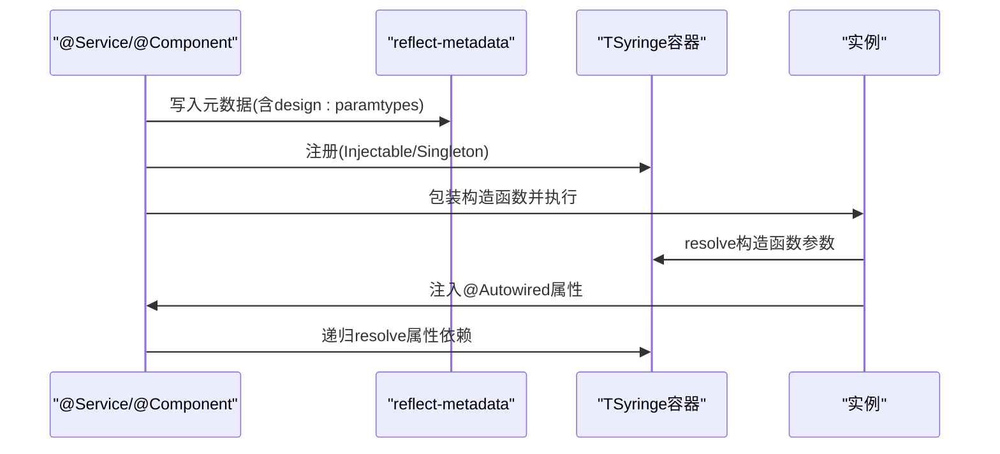
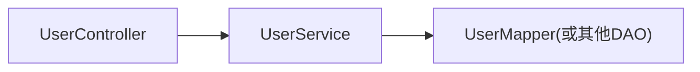
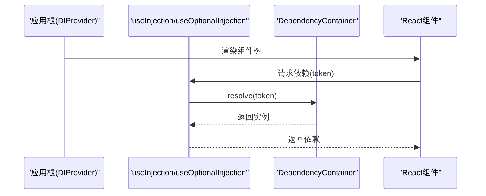
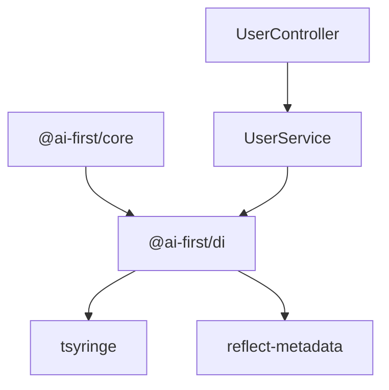

# 依赖注入装饰器

<cite>
**本文引用的文件**
- [packages/di/src/index.ts](file://packages/di/src/index.ts)
- [packages/di/src/decorators.ts](file://packages/di/src/decorators.ts)
- [packages/di/src/container.ts](file://packages/di/src/container.ts)
- [packages/di/src/react.tsx](file://packages/di/src/react.tsx)
- [packages/di/src/example.ts](file://packages/di/src/example.ts)
- [packages/di/package.json](file://packages/di/package.json)
- [packages/core/src/decorators.ts](file://packages/core/src/decorators.ts)
- [app/examples/user-crud/packages/api/src/controller/user.controller.ts](file://app/examples/user-crud/packages/api/src/controller/user.controller.ts)
- [app/examples/user-crud/packages/api/src/service/user.service.ts](file://app/examples/user-crud/packages/api/src/service/user.service.ts)
</cite>

## 目录
1. [简介](#简介)
2. [项目结构](#项目结构)
3. [核心组件](#核心组件)
4. [架构总览](#架构总览)
5. [详细组件分析](#详细组件分析)
6. [依赖关系分析](#依赖关系分析)
7. [性能考量](#性能考量)
8. [故障排查指南](#故障排查指南)
9. [结论](#结论)
10. [附录](#附录)

## 简介
本文件系统化阐述 @ai-first/di 的依赖注入装饰器体系，包括：
- 装饰器：@Injectable、@Singleton、@Autowired、@AutoRegister、@Inject
- 控制反转与组件生命周期管理
- 与 TypeScript 装饰器元数据系统的集成机制
- 在不同层（控制器、服务、数据访问）之间的注入实践
- 循环依赖处理、作用域管理与性能优化策略
- 在 React 组件中的特殊用法与集成方式

## 项目结构
- @ai-first/di 基于 TSyringe 提供容器能力，并扩展了 @Autowired、@AutoRegister 等装饰器，同时提供 React 集成工具。
- @ai-first/core 在领域层进一步封装了 @Service、@Component 等装饰器，自动完成构造函数注入与 @Autowired 属性注入。

图表来源
- [packages/di/src/index.ts](file://packages/di/src/index.ts#L1-L34)
- [packages/di/src/decorators.ts](file://packages/di/src/decorators.ts#L1-L110)
- [packages/di/src/container.ts](file://packages/di/src/container.ts#L1-L105)
- [packages/di/src/react.tsx](file://packages/di/src/react.tsx#L1-L59)
- [packages/core/src/decorators.ts](file://packages/core/src/decorators.ts#L1-L158)
- [app/examples/user-crud/packages/api/src/controller/user.controller.ts](file://app/examples/user-crud/packages/api/src/controller/user.controller.ts#L1-L53)
- [app/examples/user-crud/packages/api/src/service/user.service.ts](file://app/examples/user-crud/packages/api/src/service/user.service.ts#L1-L78)

章节来源
- [packages/di/src/index.ts](file://packages/di/src/index.ts#L1-L34)
- [packages/di/src/decorators.ts](file://packages/di/src/decorators.ts#L1-L110)
- [packages/di/src/container.ts](file://packages/di/src/container.ts#L1-L105)
- [packages/di/src/react.tsx](file://packages/di/src/react.tsx#L1-L59)
- [packages/core/src/decorators.ts](file://packages/core/src/decorators.ts#L1-L158)
- [app/examples/user-crud/packages/api/src/controller/user.controller.ts](file://app/examples/user-crud/packages/api/src/controller/user.controller.ts#L1-L53)
- [app/examples/user-crud/packages/api/src/service/user.service.ts](file://app/examples/user-crud/packages/api/src/service/user.service.ts#L1-L78)

## 核心组件
- 装饰器层
  - @Injectable：标记可注入类，由 TSyringe 执行容器注册与解析。
  - @Singleton：单例生命周期。
  - @Scoped：容器作用域生命周期。
  - @Inject：构造函数参数注入。
  - @Autowired：属性注入（Spring 风格），配合容器自动解析并注入。
  - @AutoRegister：自动注册装饰器，支持选择生命周期。
- 容器层
  - Container：对 TSyringe 的轻量封装，统一注册/解析/作用域/子容器等能力。
  - Lifecycle：枚举单例、作用域、瞬态三种生命周期。
- React 集成
  - DIProvider：向 React 树提供 DI 容器。
  - useContainer/useInjection/useOptionalInjection：在组件中解析依赖。

章节来源
- [packages/di/src/decorators.ts](file://packages/di/src/decorators.ts#L15-L21)
- [packages/di/src/decorators.ts](file://packages/di/src/decorators.ts#L42-L55)
- [packages/di/src/decorators.ts](file://packages/di/src/decorators.ts#L89-L107)
- [packages/di/src/container.ts](file://packages/di/src/container.ts#L10-L17)
- [packages/di/src/container.ts](file://packages/di/src/container.ts#L22-L104)
- [packages/di/src/react.tsx](file://packages/di/src/react.tsx#L16-L58)
- [packages/di/src/index.ts](file://packages/di/src/index.ts#L13-L33)

## 架构总览
下图展示了装饰器如何与 TSyringe 元数据系统协作，以及在运行时如何通过容器解析依赖并完成属性注入。

图表来源
- [packages/di/src/decorators.ts](file://packages/di/src/decorators.ts#L42-L84)
- [packages/di/src/container.ts](file://packages/di/src/container.ts#L73-L75)
- [packages/core/src/decorators.ts](file://packages/core/src/decorators.ts#L48-L52)

## 详细组件分析

### 装饰器：@Injectable、@Singleton、@Scoped、@Inject、@Autowired、@AutoRegister
- @Injectable 与 @Singleton/@Scoped
  - 直接复用 TSyringe 的 injectable/singleton/scoped，确保类可被容器管理与生命周期控制。
- @Inject
  - 用于构造函数参数注入，自动从容器解析对应类型的实例。
- @Autowired
  - 属性注入装饰器，记录属性键名与类型；运行时通过容器解析并注入；支持递归注入依赖对象。
- @AutoRegister
  - 自动注册装饰器，可按需选择生命周期（单例/作用域/瞬态）。

图表来源
- [packages/di/src/decorators.ts](file://packages/di/src/decorators.ts#L42-L55)

章节来源
- [packages/di/src/decorators.ts](file://packages/di/src/decorators.ts#L15-L21)
- [packages/di/src/decorators.ts](file://packages/di/src/decorators.ts#L42-L55)
- [packages/di/src/decorators.ts](file://packages/di/src/decorators.ts#L67-L84)
- [packages/di/src/decorators.ts](file://packages/di/src/decorators.ts#L89-L107)

### 生命周期与作用域管理
- 单例（Singleton）：整个应用生命周期内唯一实例。
- 作用域（Scoped）：容器作用域内共享，适合请求/会话级隔离。
- 瞬态（Transient）：每次解析都创建新实例。
- Container 封装了 register/registerInstance/registerAll/resolve/isRegistered/clearAll/createChildContainer/getContainer 等常用操作，便于测试与隔离。

图表来源
- [packages/di/src/container.ts](file://packages/di/src/container.ts#L22-L104)

章节来源
- [packages/di/src/container.ts](file://packages/di/src/container.ts#L10-L17)
- [packages/di/src/container.ts](file://packages/di/src/container.ts#L28-L46)
- [packages/di/src/container.ts](file://packages/di/src/container.ts#L58-L68)
- [packages/di/src/container.ts](file://packages/di/src/container.ts#L73-L82)
- [packages/di/src/container.ts](file://packages/di/src/container.ts#L94-L96)

### 控制反转与组件生命周期管理
- 构造函数注入：通过 TSyringe 的 design:paramtypes 元数据自动解析构造函数参数。
- 属性注入：通过 @Autowired 记录属性类型，在实例化后由 injectAutowiredProperties 递归解析并注入。
- @Service/@Component：在领域层自动应用 @Injectable/@Singleton，并包装构造函数以支持属性注入。

图表来源
- [packages/core/src/decorators.ts](file://packages/core/src/decorators.ts#L30-L66)
- [packages/core/src/decorators.ts](file://packages/core/src/decorators.ts#L81-L118)
- [packages/di/src/decorators.ts](file://packages/di/src/decorators.ts#L67-L84)

章节来源
- [packages/core/src/decorators.ts](file://packages/core/src/decorators.ts#L30-L66)
- [packages/core/src/decorators.ts](file://packages/core/src/decorators.ts#L81-L118)
- [packages/di/src/decorators.ts](file://packages/di/src/decorators.ts#L67-L84)

### 与 TypeScript 装饰器元数据系统的集成
- reflect-metadata：在模块顶部引入，使设计时类型信息（如 design:paramtypes、design:type）在运行时可用。
- @Autowired：在装饰阶段记录属性键与类型；运行阶段读取元数据并解析依赖。
- @Service/@Component：在装饰阶段读取 design:paramtypes 并对构造函数参数执行注入。

章节来源
- [packages/di/src/decorators.ts](file://packages/di/src/decorators.ts#L4-L13)
- [packages/di/src/decorators.ts](file://packages/di/src/decorators.ts#L42-L55)
- [packages/core/src/decorators.ts](file://packages/core/src/decorators.ts#L38-L41)
- [packages/core/src/decorators.ts](file://packages/core/src/decorators.ts#L89-L92)

### 在不同层之间的注入示例
- 控制器层：@RestController 中通过 @Autowired 注入服务层实例。
- 服务层：@Service 中通过 @Autowired 注入数据访问层实例。
- 数据访问层：通常由 ORM 或自定义类组成，配合 @Inject/@Injectable 使用。

图表来源
- [app/examples/user-crud/packages/api/src/controller/user.controller.ts](file://app/examples/user-crud/packages/api/src/controller/user.controller.ts#L19-L22)
- [app/examples/user-crud/packages/api/src/service/user.service.ts](file://app/examples/user-crud/packages/api/src/service/user.service.ts#L9-L12)

章节来源
- [app/examples/user-crud/packages/api/src/controller/user.controller.ts](file://app/examples/user-crud/packages/api/src/controller/user.controller.ts#L1-L53)
- [app/examples/user-crud/packages/api/src/service/user.service.ts](file://app/examples/user-crud/packages/api/src/service/user.service.ts#L1-L78)

### 循环依赖处理
- 当前实现采用“延迟注入”策略：在解析属性时递归调用容器 resolve，若出现循环依赖，TSyringe 的内部机制会通过代理/延迟构造避免无限递归。
- 建议
  - 尽量通过接口抽象与分层解耦，减少循环依赖。
  - 若必须存在循环，确保使用属性注入而非强耦合的构造函数注入。

章节来源
- [packages/di/src/decorators.ts](file://packages/di/src/decorators.ts#L67-L84)

### React 组件中的特殊用法与集成
- DIProvider：在应用根部提供 DI 容器，使子树可访问。
- useContainer：获取当前容器实例。
- useInjection/useOptionalInjection：在组件中解析依赖，支持可选依赖。

图表来源
- [packages/di/src/react.tsx](file://packages/di/src/react.tsx#L21-L58)

章节来源
- [packages/di/src/react.tsx](file://packages/di/src/react.tsx#L16-L58)

### 完整依赖注入示例（路径指引）
- 基础服务与单例服务示例：参见示例文件路径
  - [packages/di/src/example.ts](file://packages/di/src/example.ts#L10-L34)
  - [packages/di/src/example.ts](file://packages/di/src/example.ts#L38-L48)
  - [packages/di/src/example.ts](file://packages/di/src/example.ts#L52-L67)

章节来源
- [packages/di/src/example.ts](file://packages/di/src/example.ts#L1-L68)

## 依赖关系分析
- @ai-first/di 依赖 tsyringe 与 reflect-metadata。
- @ai-first/core 依赖 @ai-first/di，以复用装饰器与容器能力。
- 示例项目中的控制器与服务均通过 @Autowired 依赖上层组件。

图表来源
- [packages/di/package.json](file://packages/di/package.json#L27-L29)
- [packages/core/src/decorators.ts](file://packages/core/src/decorators.ts#L10)
- [app/examples/user-crud/packages/api/src/controller/user.controller.ts](file://app/examples/user-crud/packages/api/src/controller/user.controller.ts#L14-L16)
- [app/examples/user-crud/packages/api/src/service/user.service.ts](file://app/examples/user-crud/packages/api/src/service/user.service.ts#L2-L3)

章节来源
- [packages/di/package.json](file://packages/di/package.json#L27-L29)
- [packages/core/src/decorators.ts](file://packages/core/src/decorators.ts#L10)
- [app/examples/user-crud/packages/api/src/controller/user.controller.ts](file://app/examples/user-crud/packages/api/src/controller/user.controller.ts#L14-L16)
- [app/examples/user-crud/packages/api/src/service/user.service.ts](file://app/examples/user-crud/packages/api/src/service/user.service.ts#L2-L3)

## 性能考量
- 构造函数注入优于属性注入：构造函数注入在实例化时一次性解析，减少后续运行时查找成本。
- 合理使用作用域：请求/会话级作用域可提升隔离性，但会增加内存占用与解析次数。
- 避免深层递归注入：尽量保持依赖树扁平，减少嵌套层级。
- 测试隔离：利用 createChildContainer 与 clearAll 清理容器状态，避免跨用例污染。

## 故障排查指南
- 无法解析依赖
  - 检查是否正确注册类（Container.register/registerAll）或使用 @AutoRegister。
  - 确认装饰器顺序：先 @Injectable/@Singleton，再 @Autowired。
- 属性未注入
  - 确保类被 TSyringe 管理（已应用 @Injectable/@Singleton）。
  - 确认 @Autowired 装饰在目标属性上且类型可推断。
- 循环依赖报错
  - 将部分依赖改为属性注入，避免构造函数直接循环。
  - 使用作用域容器隔离循环链路。
- React 中使用异常
  - 确保在 DIProvider 下渲染组件。
  - 使用 useContainer/useInjection 前已提供容器。

章节来源
- [packages/di/src/decorators.ts](file://packages/di/src/decorators.ts#L67-L84)
- [packages/di/src/react.tsx](file://packages/di/src/react.tsx#L30-L36)

## 结论
@ai-first/di 通过在 TSyringe 基础上扩展 @Autowired、@AutoRegister 等装饰器，结合 reflect-metadata 元数据系统，实现了简洁而强大的控制反转与依赖注入能力。配合 @ai-first/core 的领域装饰器，可在控制器、服务、数据访问层之间自然地完成依赖注入。通过合理的生命周期与作用域管理、清晰的分层与接口抽象，以及 React 集成工具，可构建高内聚、低耦合且易于测试的 TypeScript 应用。

## 附录
- 关键 API 路径
  - 装饰器导出入口：[packages/di/src/index.ts](file://packages/di/src/index.ts#L13-L24)
  - 装饰器实现：[packages/di/src/decorators.ts](file://packages/di/src/decorators.ts#L15-L110)
  - 容器封装：[packages/di/src/container.ts](file://packages/di/src/container.ts#L22-L104)
  - React 集成：[packages/di/src/react.tsx](file://packages/di/src/react.tsx#L16-L58)
  - 示例用法：[packages/di/src/example.ts](file://packages/di/src/example.ts#L10-L67)
  - 领域装饰器（含属性注入）：[packages/core/src/decorators.ts](file://packages/core/src/decorators.ts#L30-L118)