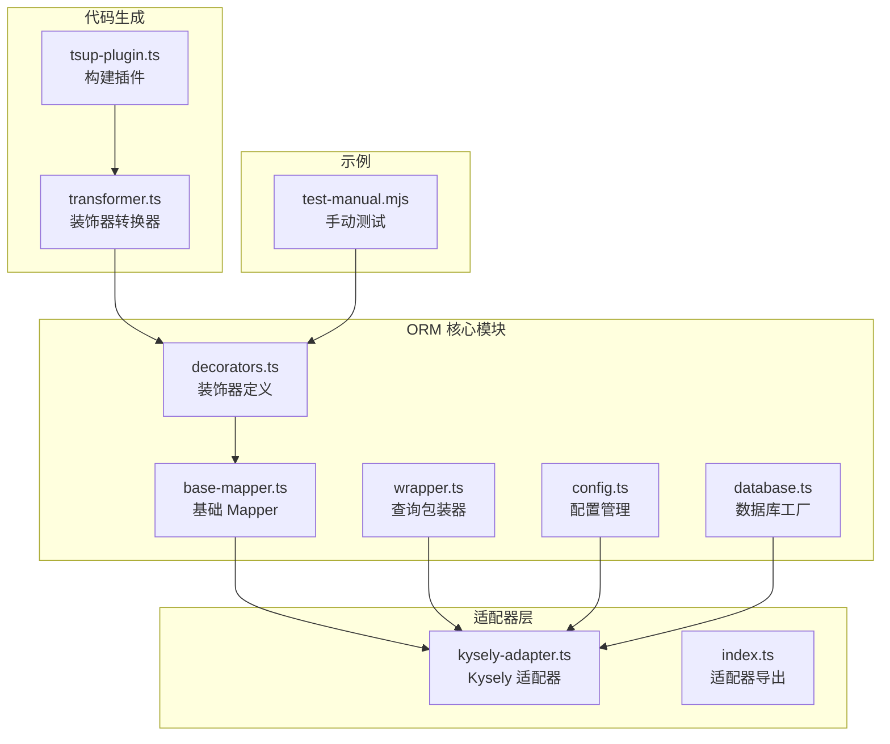
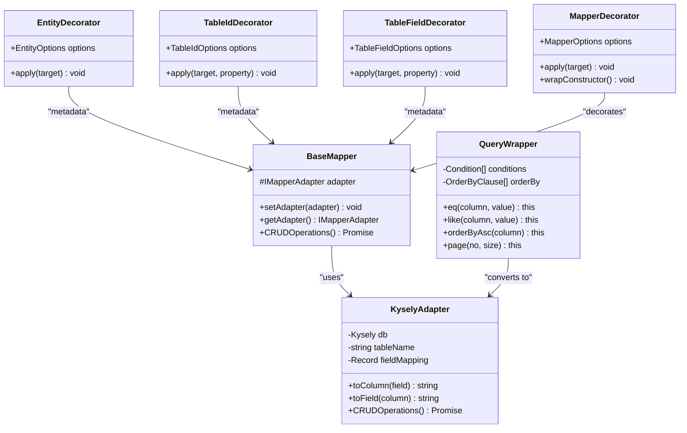
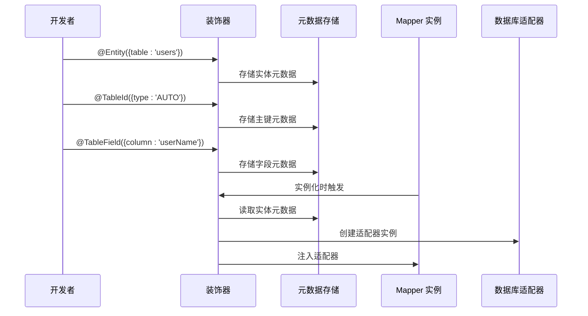
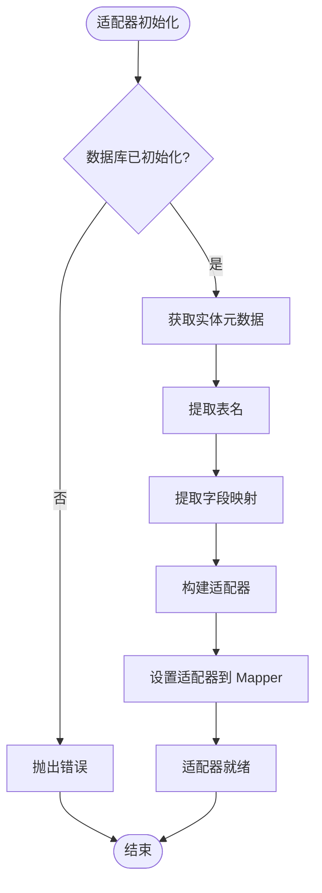
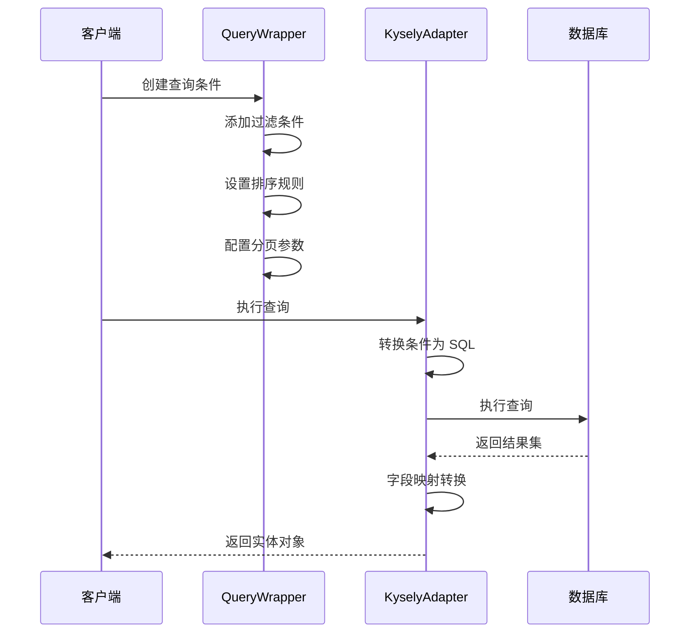
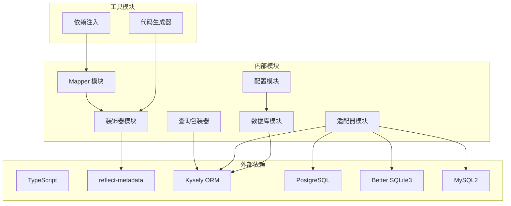

# 数据层装饰器

<cite>
**本文档引用的文件**
- [packages/orm/src/decorators.ts](file://packages/orm/src/decorators.ts)
- [packages/orm/src/base-mapper.ts](file://packages/orm/src/base-mapper.ts)
- [packages/orm/src/wrapper.ts](file://packages/orm/src/wrapper.ts)
- [packages/orm/src/config.ts](file://packages/orm/src/config.ts)
- [packages/orm/src/database.ts](file://packages/orm/src/database.ts)
- [packages/orm/src/adapters/kysely-adapter.ts](file://packages/orm/src/adapters/kysely-adapter.ts)
- [packages/orm/src/adapters/index.ts](file://packages/orm/src/adapters/index.ts)
- [packages/orm/src/index.ts](file://packages/orm/src/index.ts)
- [packages/codegen/src/transformer.ts](file://packages/codegen/src/transformer.ts)
- [packages/codegen/src/tsup-plugin.ts](file://packages/codegen/src/tsup-plugin.ts)
- [packages/orm/examples/test-manual.mjs](file://packages/orm/examples/test-manual.mjs)
</cite>

## 目录
1. [简介](#简介)
2. [项目结构](#项目结构)
3. [核心组件](#核心组件)
4. [架构概览](#架构概览)
5. [详细组件分析](#详细组件分析)
6. [依赖分析](#依赖分析)
7. [性能考虑](#性能考虑)
8. [故障排除指南](#故障排除指南)
9. [结论](#结论)
10. [附录](#附录)

## 简介

本文件详细介绍 @ai-first/orm 包中的数据层装饰器系统。该系统提供了与 MyBatis-Plus 风格兼容的装饰器，支持 TypeScript 运行时（通过 MikroORM）和转译为 Java MyBatis-Plus 代码。装饰器系统包括实体装饰器、字段装饰器、Mapper 装饰器和查询包装器，实现了完整的 ORM 映射和查询构建功能。

## 项目结构



**图表来源**
- [packages/orm/src/decorators.ts](file://packages/orm/src/decorators.ts#L1-L130)
- [packages/orm/src/base-mapper.ts](file://packages/orm/src/base-mapper.ts#L1-L332)
- [packages/orm/src/wrapper.ts](file://packages/orm/src/wrapper.ts#L1-L359)
- [packages/orm/src/config.ts](file://packages/orm/src/config.ts#L1-L77)
- [packages/orm/src/database.ts](file://packages/orm/src/database.ts#L1-L134)

## 核心组件

### 装饰器系统

装饰器系统基于反射元数据机制，提供以下核心装饰器：

#### 实体装饰器
- `@Entity` - 标记实体类，支持表名配置
- `@TableName` - `@Entity` 的别名

#### 字段装饰器
- `@TableId` - 标记主键字段，支持主键类型配置
- `@TableField` - 标记普通字段，支持列名映射
- `@Column` - `@TableField` 的别名

#### Mapper 装饰器
- `@Mapper` - 标记 Mapper 类，自动注入依赖和适配器

**章节来源**
- [packages/orm/src/decorators.ts](file://packages/orm/src/decorators.ts#L65-L130)
- [packages/orm/src/decorators.ts](file://packages/orm/src/decorators.ts#L132-L169)

### 基础 Mapper

BaseMapper 提供完整的 CRUD 操作接口，类似于 MyBatis-Plus 的 BaseMapper<T>：

- 查询操作：`selectById`, `selectList`, `selectPage`, `selectCount`
- 插入操作：`insert`, `insertBatch`
- 更新操作：`updateById`, `update`
- 删除操作：`deleteById`, `deleteBatchIds`, `delete`
- 查询包装器支持：`selectListByWrapper`, `selectOneByWrapper`

**章节来源**
- [packages/orm/src/base-mapper.ts](file://packages/orm/src/base-mapper.ts#L38-L301)

### 查询包装器

QueryWrapper 提供与 Java MyBatis-Plus 完全一致的 API：

- 比较条件：`eq`, `ne`, `gt`, `ge`, `lt`, `le`
- 模糊查询：`like`, `notLike`, `likeLeft`, `likeRight`
- 范围查询：`between`, `notBetween`, `in`, `notIn`
- NULL 判断：`isNull`, `isNotNull`
- 逻辑组合：`or`, `and`
- 排序：`orderByAsc`, `orderByDesc`, `orderBy`
- 分页：`limit`, `offset`, `page`
- 选择字段：`select`, `groupBy`

**章节来源**
- [packages/orm/src/wrapper.ts](file://packages/orm/src/wrapper.ts#L49-L359)

## 架构概览



**图表来源**
- [packages/orm/src/decorators.ts](file://packages/orm/src/decorators.ts#L65-L169)
- [packages/orm/src/base-mapper.ts](file://packages/orm/src/base-mapper.ts#L54-L331)
- [packages/orm/src/adapters/kysely-adapter.ts](file://packages/orm/src/adapters/kysely-adapter.ts#L24-L426)
- [packages/orm/src/wrapper.ts](file://packages/orm/src/wrapper.ts#L49-L359)

## 详细组件分析

### 装饰器实现模式

装饰器采用函数式装饰器模式，通过反射元数据存储实体信息：



**图表来源**
- [packages/orm/src/decorators.ts](file://packages/orm/src/decorators.ts#L68-L105)
- [packages/orm/src/decorators.ts](file://packages/orm/src/decorators.ts#L140-L169)

#### 实体装饰器分析

Entity 装饰器负责实体类的元数据存储：

- **表名推断**：如果未指定表名，自动使用类名小写加 's'
- **元数据结构**：存储 `tableName`, `className`, `description`, `schema`
- **别名支持**：`@TableName` 是 `@Entity` 的别名

**章节来源**
- [packages/orm/src/decorators.ts](file://packages/orm/src/decorators.ts#L65-L85)

#### 主键装饰器分析

TableId 装饰器标记实体的主键字段：

- **主键类型**：支持 `AUTO`, `INPUT`, `ASSIGN_ID`, `ASSIGN_UUID`
- **默认类型**：未指定时默认为 `AUTO`
- **列名映射**：支持自定义列名

**章节来源**
- [packages/orm/src/decorators.ts](file://packages/orm/src/decorators.ts#L89-L105)

#### 字段装饰器分析

TableField 装饰器标记实体的普通字段：

- **列名映射**：支持自定义数据库列名
- **存在性控制**：`exist` 属性控制字段是否存在于数据库
- **填充策略**：支持 `INSERT`, `UPDATE`, `INSERT_UPDATE`
- **选择性**：`select` 控制字段是否参与查询

**章节来源**
- [packages/orm/src/decorators.ts](file://packages/orm/src/decorators.ts#L108-L128)

#### Mapper 装饰器分析

Mapper 装饰器提供依赖注入和适配器自动配置：

- **DI 集成**：自动注册到依赖注入容器
- **适配器配置**：根据实体元数据自动创建数据库适配器
- **构造函数包装**：在实例化时自动设置适配器

**章节来源**
- [packages/orm/src/decorators.ts](file://packages/orm/src/decorators.ts#L132-L169)

### 数据库适配器系统



**图表来源**
- [packages/orm/src/config.ts](file://packages/orm/src/config.ts#L42-L76)
- [packages/orm/src/decorators.ts](file://packages/orm/src/decorators.ts#L158-L169)

#### KyselyAdapter 实现

KyselyAdapter 是主要的数据库适配器实现：

- **字段映射**：支持 TypeScript 字段名到数据库列名的双向映射
- **查询转换**：将 QueryWrapper 条件转换为 Kysely 查询
- **多数据库支持**：支持 PostgreSQL、SQLite、MySQL
- **事务处理**：利用 Kysely 的事务能力

**章节来源**
- [packages/orm/src/adapters/kysely-adapter.ts](file://packages/orm/src/adapters/kysely-adapter.ts#L24-L426)

### 查询包装器工作流程



**图表来源**
- [packages/orm/src/wrapper.ts](file://packages/orm/src/wrapper.ts#L49-L359)
- [packages/orm/src/adapters/kysely-adapter.ts](file://packages/orm/src/adapters/kysely-adapter.ts#L177-L200)

**章节来源**
- [packages/orm/src/wrapper.ts](file://packages/orm/src/wrapper.ts#L1-L359)

### 代码生成器集成

代码生成器提供装饰器泛型参数自动填充功能：

```mermaid
flowchart LR
Source[源代码] --> Transformer[装饰器转换器]
Transformer --> Check{检查装饰器}
Check --> |@Mapper()| ExtractType[提取泛型类型]
Check --> |其他| Skip[跳过处理]
ExtractType --> CreateCall[创建带参数调用]
CreateCall --> Output[输出转换后代码]
Skip --> Output
```

**图表来源**
- [packages/codegen/src/transformer.ts](file://packages/codegen/src/transformer.ts#L32-L129)
- [packages/codegen/src/tsup-plugin.ts](file://packages/codegen/src/tsup-plugin.ts#L28-L62)

**章节来源**
- [packages/codegen/src/transformer.ts](file://packages/codegen/src/transformer.ts#L1-L192)
- [packages/codegen/src/tsup-plugin.ts](file://packages/codegen/src/tsup-plugin.ts#L25-L64)

## 依赖分析



**图表来源**
- [packages/orm/src/index.ts](file://packages/orm/src/index.ts#L1-L72)
- [packages/orm/src/database.ts](file://packages/orm/src/database.ts#L7-L9)

**章节来源**
- [packages/orm/src/index.ts](file://packages/orm/src/index.ts#L1-L72)

## 性能考虑

### 查询优化

1. **字段映射缓存**：适配器内部维护字段映射的正向和反向映射表
2. **批量操作**：提供 `insertBatch` 和 `findByIds` 批量操作方法
3. **条件预编译**：QueryWrapper 将条件转换为预编译 SQL 语句

### 内存管理

1. **适配器复用**：建议在应用生命周期内复用适配器实例
2. **连接池管理**：数据库连接通过连接池管理，避免频繁创建销毁
3. **元数据缓存**：装饰器元数据在类级别缓存，减少反射开销

### 并发处理

1. **线程安全**：适配器设计为无状态，可在多线程环境下安全使用
2. **事务隔离**：支持数据库事务，确保数据一致性

## 故障排除指南

### 常见问题

#### 装饰器元数据未找到
**症状**：运行时抛出 "Mapper adapter not set" 错误
**解决方案**：
1. 确保在导入装饰器前引入 `reflect-metadata`
2. 检查装饰器应用顺序是否正确
3. 验证实体类是否正确标注

#### 数据库连接失败
**症状**：初始化数据库时报错
**解决方案**：
1. 检查数据库配置参数
2. 确认数据库服务正常运行
3. 验证网络连接和权限设置

#### 查询结果字段映射错误
**症状**：查询结果字段名不匹配
**解决方案**：
1. 检查 `@TableField` 的 `column` 属性配置
2. 验证数据库表结构与实体定义的一致性
3. 确认字段映射配置正确

**章节来源**
- [packages/orm/src/base-mapper.ts](file://packages/orm/src/base-mapper.ts#L67-L72)
- [packages/orm/src/database.ts](file://packages/orm/src/database.ts#L47-L95)

## 结论

@ai-first/orm 的数据层装饰器系统提供了完整的 ORM 解决方案，具有以下特点：

1. **强类型支持**：完全基于 TypeScript 类型系统
2. **装饰器驱动**：通过装饰器声明实体和字段映射
3. **查询包装器**：提供类型安全的查询构建器
4. **适配器模式**：支持多种数据库后端
5. **代码生成**：自动化装饰器参数填充

该系统既适合 TypeScript 运行时使用，也支持转译为 Java 代码，为跨语言项目提供了统一的数据访问抽象。

## 附录

### 实体定义示例

以下是一个完整的实体定义示例：

```typescript
@Entity({ table: 'sys_user' })
class User {
  @TableId({ type: 'AUTO' })
  id: number
  
  @TableField({ column: 'user_name' })
  name: string
  
  @TableField({ column: 'email_addr' })
  email: string
  
  @TableField({ fill: 'INSERT' })
  createdAt: Date
  
  @TableField({ fill: 'UPDATE' })
  updatedAt: Date
}

@Mapper({ entity: User })
class UserMapper extends BaseMapper<User> {}
```

### 配置选项参考

#### EntityOptions
- `table`: 自定义表名
- `tableName`: 表名别名
- `description`: 实体描述
- `schema`: 数据库 schema

#### TableIdOptions
- `type`: 主键类型 (`AUTO` | `INPUT` | `ASSIGN_ID` | `ASSIGN_UUID`)
- `column`: 自定义列名

#### TableFieldOptions
- `column`: 自定义列名
- `exist`: 字段是否存在数据库
- `fill`: 字段填充策略
- `select`: 是否参与查询
- `jdbcType`: JDBC 类型

**章节来源**
- [packages/orm/src/decorators.ts](file://packages/orm/src/decorators.ts#L24-L61)