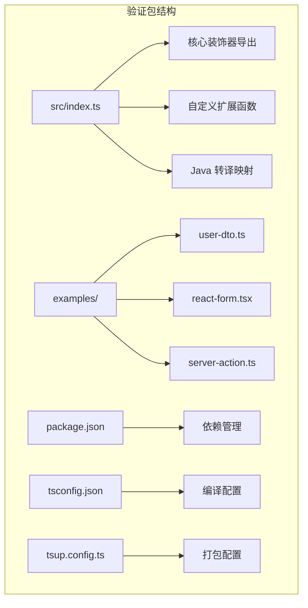
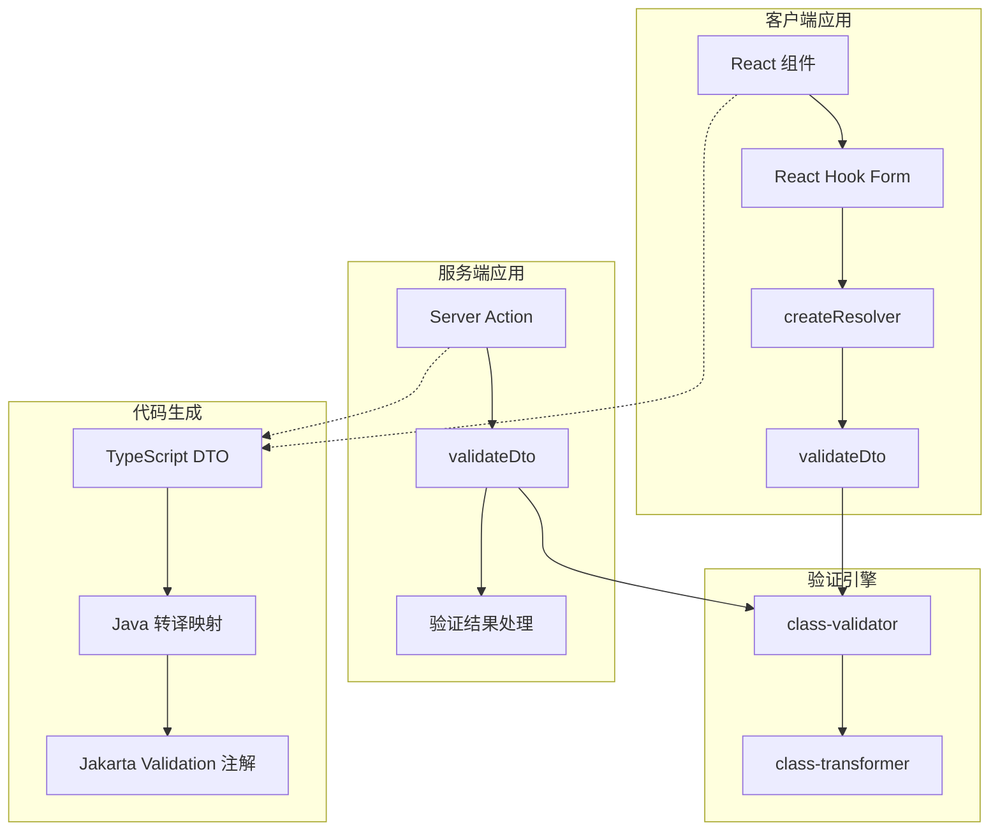
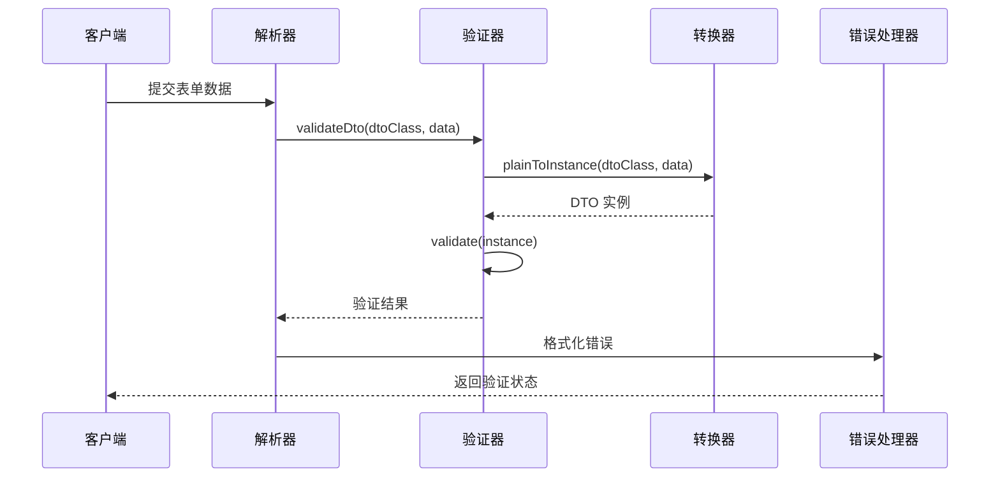
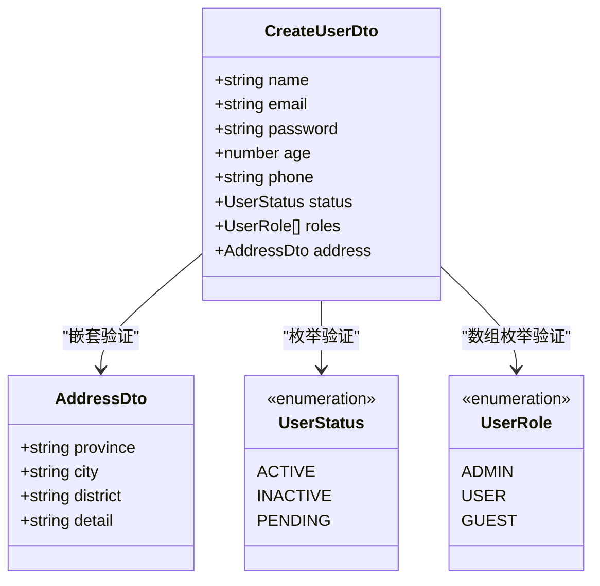
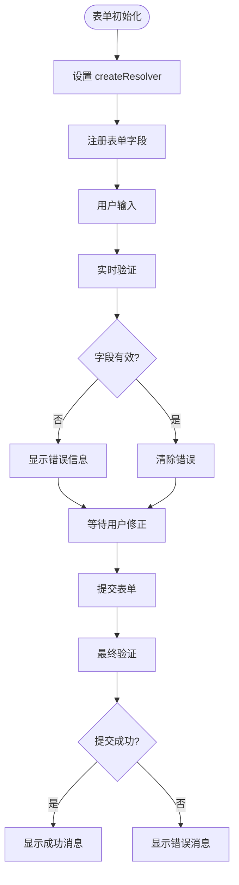
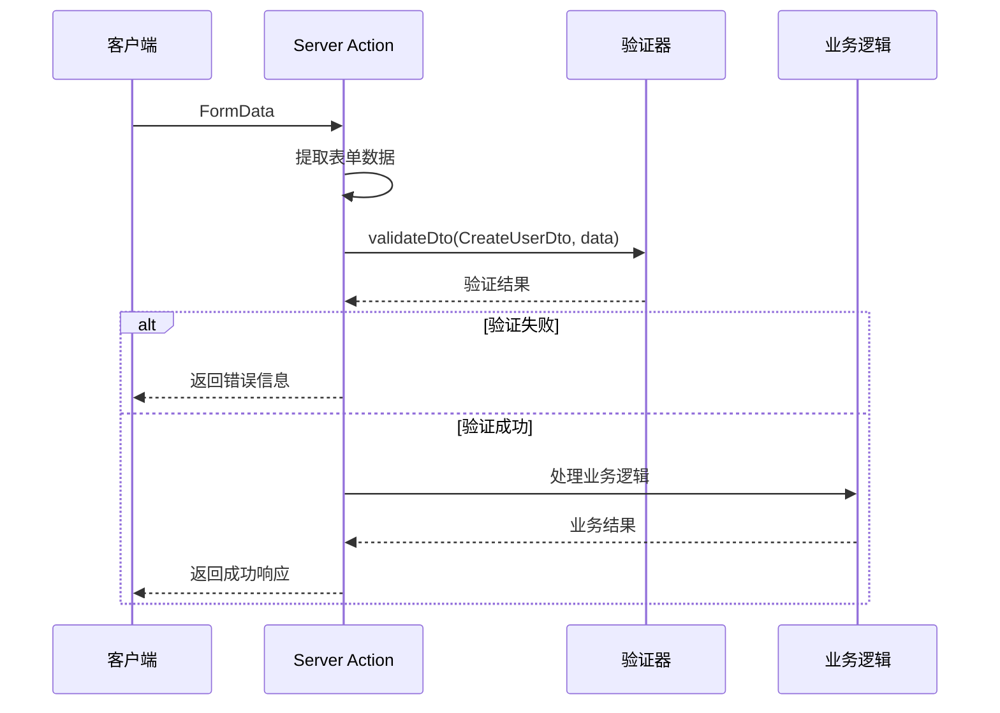

# 数据验证装饰器

<cite>
**本文档引用的文件**
- [packages/validation/src/index.ts](file://packages/validation/src/index.ts)
- [packages/validation/package.json](file://packages/validation/package.json)
- [packages/validation/examples/user-dto.ts](file://packages/validation/examples/user-dto.ts)
- [packages/validation/examples/react-form.tsx](file://packages/validation/examples/react-form.tsx)
- [packages/validation/examples/server-action.ts](file://packages/validation/examples/server-action.ts)
- [packages/validation/tsconfig.json](file://packages/validation/tsconfig.json)
- [packages/validation/tsup.config.ts](file://packages/validation/tsup.config.ts)
- [tsconfig.json](file://tsconfig.json)
</cite>

## 目录
1. [简介](#简介)
2. [项目结构](#项目结构)
3. [核心组件](#核心组件)
4. [架构概览](#架构概览)
5. [详细组件分析](#详细组件分析)
6. [依赖关系分析](#依赖关系分析)
7. [性能考虑](#性能考虑)
8. [故障排除指南](#故障排除指南)
9. [结论](#结论)
10. [附录](#附录)

## 简介

数据验证装饰器是 AI-First Framework 的核心组件之一，基于 class-validator 库构建，提供了强大的数据验证能力。该装饰器系统支持 TypeScript 类装饰器语法，能够进行输入验证、格式检查和业务规则验证，并与 Spring Boot Validation 进行 Java 转译兼容。

本系统的主要特点包括：
- 完全兼容 class-validator 的装饰器 API
- 支持前后端统一的数据验证规则
- 提供 React Hook Form 集成解决方案
- 支持 Java 代码生成转译映射
- 内置类型转换和验证结果格式化

## 项目结构

验证包采用模块化设计，主要包含以下核心文件：



**图表来源**
- [packages/validation/src/index.ts](file://packages/validation/src/index.ts#L1-L225)
- [packages/validation/package.json](file://packages/validation/package.json#L1-L40)

**章节来源**
- [packages/validation/src/index.ts](file://packages/validation/src/index.ts#L1-L25)
- [packages/validation/package.json](file://packages/validation/package.json#L1-L40)

## 核心组件

### 装饰器导出系统

验证包完全重导出了 class-validator 的所有装饰器，确保 API 兼容性：

| 装饰器类别 | 主要装饰器 | 功能描述 |
|-----------|-----------|----------|
| 存在性检查 | IsDefined, IsOptional | 验证字段是否定义或可选 |
| 类型验证 | IsString, IsNumber, IsBoolean, IsArray | 基础数据类型验证 |
| 字符串验证 | IsNotEmpty, Length, Matches, IsEmail | 字符串格式和内容验证 |
| 数字验证 | Min, Max, IsPositive, IsNegative | 数值范围和性质验证 |
| 日期验证 | MinDate, MaxDate | 日期范围验证 |
| 数组验证 | ArrayNotEmpty, ArrayMinSize, ArrayMaxSize | 数组内容验证 |
| 自定义验证 | Validate, ValidateIf, ValidateBy | 复杂业务规则验证 |

### 自定义扩展功能

系统提供了三个核心扩展功能：

1. **validateDto**: 异步验证函数，返回标准化的验证结果
2. **createResolver**: React Hook Form 解析器创建函数
3. **FieldError**: 标准化的错误格式接口

**章节来源**
- [packages/validation/src/index.ts](file://packages/validation/src/index.ts#L28-L98)
- [packages/validation/src/index.ts](file://packages/validation/src/index.ts#L112-L191)

## 架构概览

### 整体架构设计



**图表来源**
- [packages/validation/src/index.ts](file://packages/validation/src/index.ts#L115-L191)
- [packages/validation/src/index.ts](file://packages/validation/src/index.ts#L200-L224)

### 数据流处理流程



**图表来源**
- [packages/validation/src/index.ts](file://packages/validation/src/index.ts#L115-L137)
- [packages/validation/src/index.ts](file://packages/validation/src/index.ts#L173-L191)

## 详细组件分析

### 装饰器使用示例

#### 基础类型验证



**图表来源**
- [packages/validation/examples/user-dto.ts](file://packages/validation/examples/user-dto.ts#L23-L106)

#### 复杂对象验证

系统支持嵌套对象的深度验证，通过 `ValidateNested` 和 `Type` 装饰器实现：

**章节来源**
- [packages/validation/examples/user-dto.ts](file://packages/validation/examples/user-dto.ts#L37-L106)

### React 表单集成

#### 表单组件实现



**图表来源**
- [packages/validation/examples/react-form.tsx](file://packages/validation/examples/react-form.tsx#L14-L74)

**章节来源**
- [packages/validation/examples/react-form.tsx](file://packages/validation/examples/react-form.tsx#L1-L75)

### 服务器端验证

#### Server Action 集成



**图表来源**
- [packages/validation/examples/server-action.ts](file://packages/validation/examples/server-action.ts#L13-L43)

**章节来源**
- [packages/validation/examples/server-action.ts](file://packages/validation/examples/server-action.ts#L1-L69)

### Java 转译映射

系统提供了完整的 Java 代码生成支持，将 TypeScript 装饰器自动转译为 Jakarta Validation 注解：

| TypeScript 装饰器 | Java 注解 | 参数映射 |
|------------------|-----------|----------|
| IsNotEmpty | @NotBlank | 无参数 |
| IsEmail | @Email | 无参数 |
| Length | @Size | min/max 参数 |
| Min | @Min | 数值参数 |
| Max | @Max | 数值参数 |
| MinLength | @Size(min=参数) | min 参数 |
| MaxLength | @Size(max=参数) | max 参数 |
| Matches | @Pattern(regexp="参数") | 正则表达式 |
| IsUUID | @UUID | 无参数 |
| ValidateNested | @Valid | 嵌套验证 |

**章节来源**
- [packages/validation/src/index.ts](file://packages/validation/src/index.ts#L200-L224)

## 依赖关系分析

### 外部依赖管理

```mermaid
graph TB
subgraph "验证包依赖"
A[@ai-first/validation] --> B[class-validator ^0.14.1]
A --> C[class-transformer ^0.5.1]
A --> D[reflect-metadata ^0.2.1]
A --> E[react-hook-form >=7.0.0]
A --> F[@hookform/resolvers >=3.0.0]
end
subgraph "编译配置"
G[tsconfig.json] --> H[experimentalDecorators: true]
G --> I[emitDecoratorMetadata: true]
J[tsup.config.ts] --> K[ESM 格式输出]
end
B --> L[核心验证逻辑]
C --> M[类型转换]
D --> N[元数据反射]
```

**图表来源**
- [packages/validation/package.json](file://packages/validation/package.json#L21-L37)
- [packages/validation/tsconfig.json](file://packages/validation/tsconfig.json#L6-L7)
- [packages/validation/tsup.config.ts](file://packages/validation/tsup.config.ts#L3-L8)

### 内部模块依赖

验证包内部模块之间的依赖关系清晰明确：

**章节来源**
- [packages/validation/package.json](file://packages/validation/package.json#L1-L40)
- [packages/validation/tsconfig.json](file://packages/validation/tsconfig.json#L1-L12)

## 性能考虑

### 验证性能优化

1. **异步验证模式**: 使用 `validateDto` 函数进行异步验证，避免阻塞主线程
2. **按需导入**: 验证器和转换器采用动态导入，减少初始加载时间
3. **错误缓存**: React Hook Form 解析器会缓存验证结果，提高重复验证效率

### 内存管理

- 使用 `plainToInstance` 进行类型转换时，注意及时释放不需要的对象引用
- 在大量数据验证场景下，考虑分批处理验证请求

### 编译优化

- 启用装饰器元数据发射，确保运行时验证信息完整
- 使用 ESM 格式输出，支持 Tree Shaking 优化

## 故障排除指南

### 常见问题及解决方案

#### 装饰器不生效

**问题**: 装饰器语法正确但验证不执行

**原因分析**:
1. 缺少装饰器元数据配置
2. TypeScript 编译选项未启用装饰器支持

**解决方案**:
```json
// tsconfig.json 中确保配置正确
{
  "experimentalDecorators": true,
  "emitDecoratorMetadata": true
}
```

#### React Hook Form 集成问题

**问题**: 表单验证无法正常工作

**排查步骤**:
1. 确认已安装 `@hookform/resolvers` 依赖
2. 检查 `createResolver` 函数的使用方式
3. 验证 DTO 类的装饰器配置

#### Java 转译映射错误

**问题**: 生成的 Java 代码注解不正确

**检查清单**:
1. 确认装饰器名称与映射表一致
2. 验证参数格式是否符合 Java 注解要求
3. 检查特殊字符的转义处理

**章节来源**
- [packages/validation/tsconfig.json](file://packages/validation/tsconfig.json#L6-L7)
- [packages/validation/package.json](file://packages/validation/package.json#L30-L37)

## 结论

数据验证装饰器系统为 AI-First Framework 提供了强大而灵活的数据验证能力。通过与 class-validator 的深度集成，系统不仅支持丰富的验证规则，还提供了完整的前后端一体化解决方案。

### 主要优势

1. **API 兼容性**: 完全兼容 class-validator 的装饰器 API
2. **多平台支持**: 支持 TypeScript、JavaScript 和 Java 代码生成
3. **框架集成**: 与 React Hook Form 和 Next.js Server Actions 无缝集成
4. **类型安全**: 完整的 TypeScript 类型定义和编译时检查
5. **性能优化**: 异步验证和按需加载机制

### 适用场景

- **Web 应用开发**: React/Vue/Angular 表单验证
- **API 开发**: RESTful 服务端数据验证
- **代码生成**: TypeScript 到 Java 的双向代码生成
- **微服务架构**: 统一的数据验证规则管理

## 附录

### 配置选项参考

#### 装饰器配置参数

| 装饰器 | 参数 | 类型 | 描述 |
|--------|------|------|------|
| IsNotEmpty | message | string | 自定义错误消息 |
| Length | min, max, message | number, number, string | 字符串长度限制 |
| Min | value, message | number, string | 最小数值限制 |
| Max | value, message | number, string | 最大数值限制 |
| IsEmail | checkDNS, allow_utf8_local, message | boolean, boolean, string | 邮箱格式验证 |
| Matches | regExp, message | RegExp, string | 正则表达式匹配 |

#### 验证结果格式

```typescript
interface ValidationResult<T> {
  success: boolean;
  data?: T;
  errors?: FieldError[];
}

interface FieldError {
  field: string;
  message: string;
  constraints: Record<string, string>;
}
```

### 最佳实践

1. **统一验证规则**: 在 DTO 类中集中定义验证规则
2. **错误消息本地化**: 使用国际化框架处理多语言错误消息
3. **性能监控**: 对高频验证操作添加性能监控
4. **测试覆盖**: 为关键验证规则编写单元测试
5. **文档维护**: 保持验证规则文档与代码同步更新