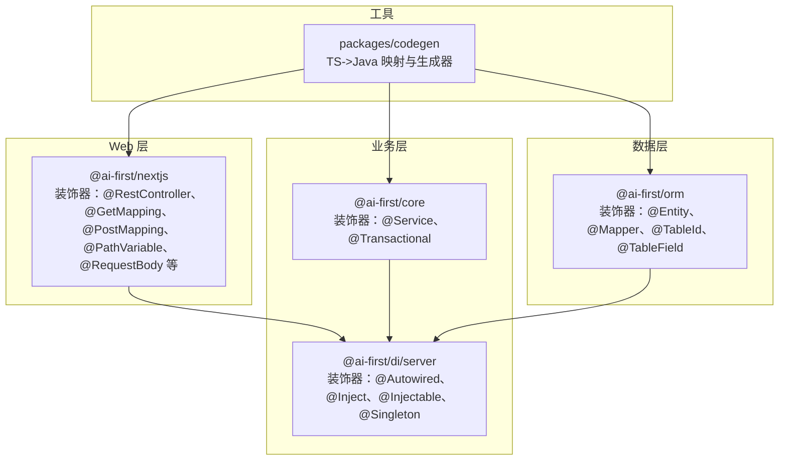
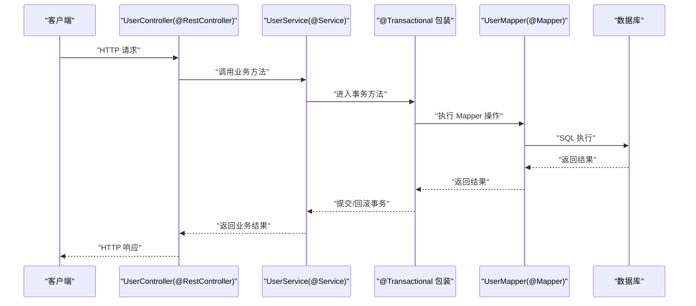
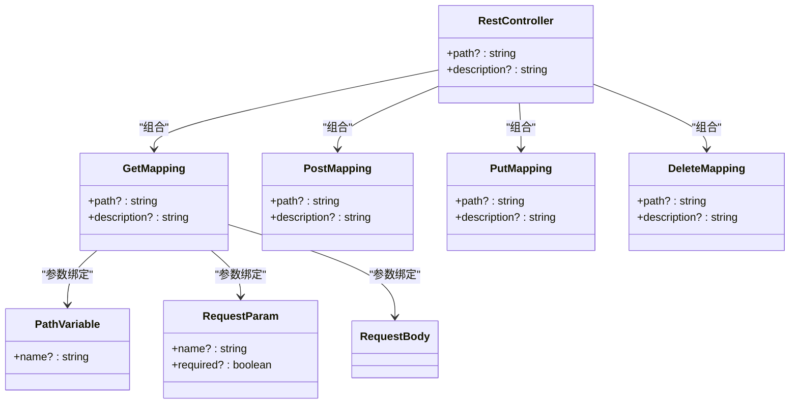
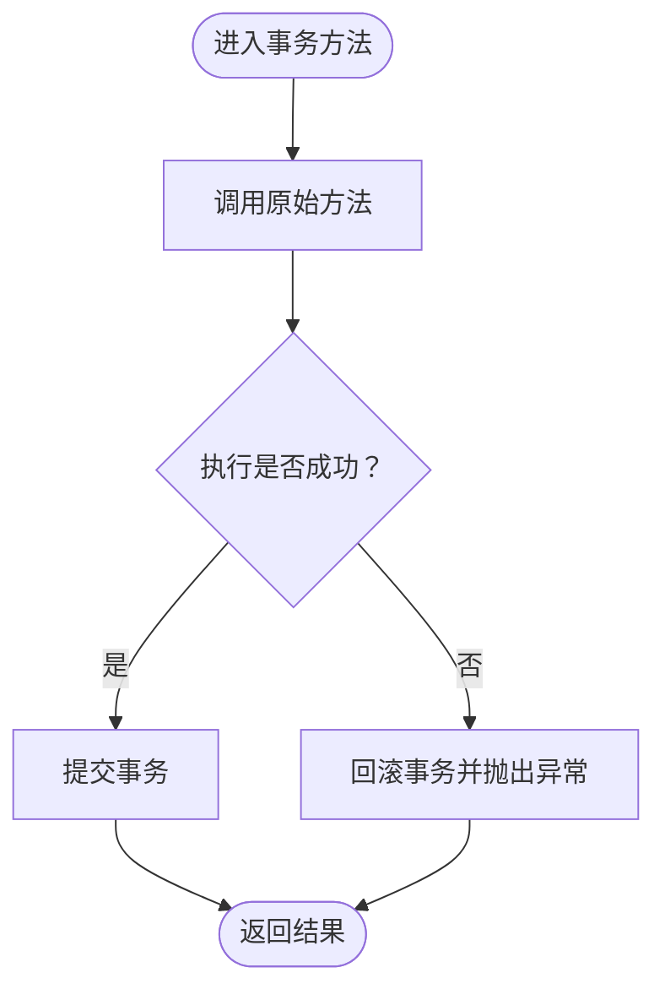
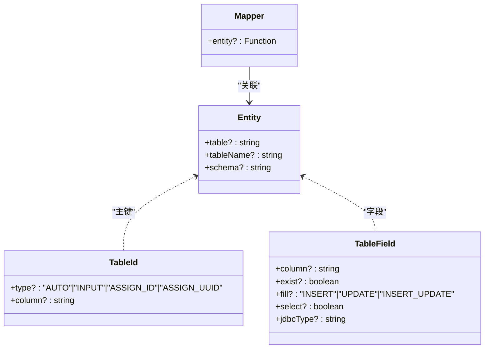
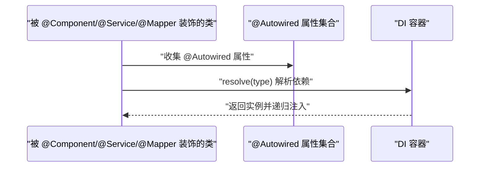
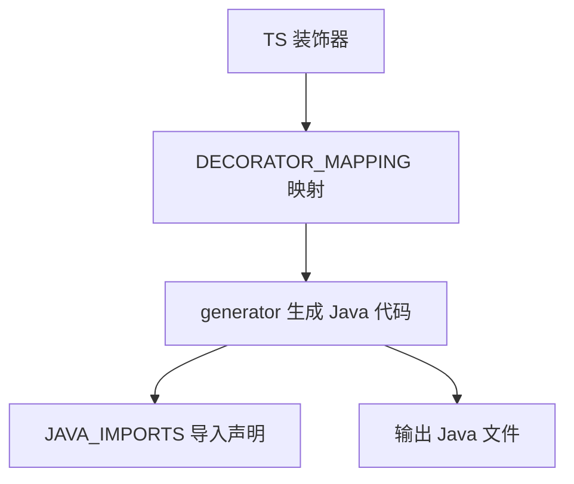
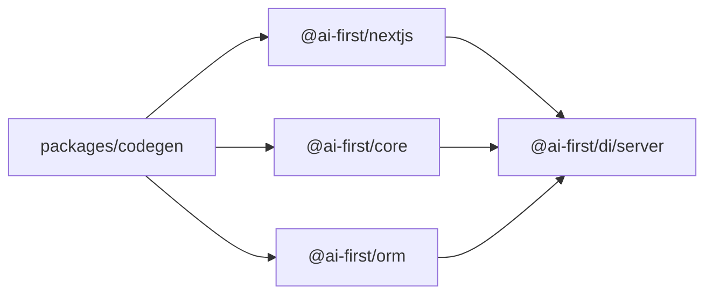

# 装饰器使用指南

<cite>
**本文引用的文件**
- [packages/codegen/src/types.ts](file://packages/codegen/src/types.ts)
- [packages/codegen/src/generator.ts](file://packages/codegen/src/generator.ts)
- [packages/core/src/decorators.ts](file://packages/core/src/decorators.ts)
- [packages/di/src/decorators.ts](file://packages/di/src/decorators.ts)
- [packages/orm/src/decorators.ts](file://packages/orm/src/decorators.ts)
- [packages/nextjs/src/decorators.ts](file://packages/nextjs/src/decorators.ts)
- [app/examples/user-crud/packages/api/src/controller/user.controller.ts](file://app/examples/user-crud/packages/api/src/controller/user.controller.ts)
- [app/examples/user-crud/packages/api/src/entity/user.entity.ts](file://app/examples/user-crud/packages/api/src/entity/user.entity.ts)
- [app/examples/user-crud/packages/api/src/service/user.service.ts](file://app/examples/user-crud/packages/api/src/service/user.service.ts)
- [app/examples/user-crud/packages/api/src/mapper/user.mapper.ts](file://app/examples/user-crud/packages/api/src/mapper/user.mapper.ts)
</cite>

## 目录
1. [简介](#简介)
2. [项目结构](#项目结构)
3. [核心组件](#核心组件)
4. [架构总览](#架构总览)
5. [详细组件分析](#详细组件分析)
6. [依赖关系分析](#依赖关系分析)
7. [性能考量](#性能考量)
8. [故障排查指南](#故障排查指南)
9. [结论](#结论)
10. [附录](#附录)

## 简介
本指南系统性讲解 AI-First Framework 的装饰器体系，覆盖三层：Web 层（@RestController、@GetMapping、@PostMapping 等）、业务层（@Service、@Transactional 等）与数据层（@Entity、@Mapper、@TableId 等）。文档不仅说明每个装饰器的功能、参数与适用场景，还提供真实示例路径、最佳实践、常见陷阱与性能建议，并解释其工作原理与元数据系统。

## 项目结构
AI-First Framework 将装饰器按职责拆分到不同包中：
- web 层装饰器：@RestController、@GetMapping、@PostMapping 等，位于 nextjs 包
- 业务层装饰器：@Service、@Transactional，位于 core 包
- 数据层装饰器：@Entity、@Mapper、@TableId、@TableField 等，位于 orm 包
- DI 注入装饰器：@Autowired、@Inject、@Injectable、@Singleton 等，位于 di 包
- 代码生成与映射：types.ts 定义 TS 到 Java 的装饰器映射，generator.ts 生成 Java 代码

**图表来源**
- [packages/nextjs/src/decorators.ts](file://packages/nextjs/src/decorators.ts#L46-L88)
- [packages/core/src/decorators.ts](file://packages/core/src/decorators.ts#L70-L118)
- [packages/di/src/decorators.ts](file://packages/di/src/decorators.ts#L15-L107)
- [packages/orm/src/decorators.ts](file://packages/orm/src/decorators.ts#L65-L193)
- [packages/codegen/src/types.ts](file://packages/codegen/src/types.ts#L22-L46)
- [packages/codegen/src/generator.ts](file://packages/codegen/src/generator.ts#L142-L174)

**章节来源**
- [packages/nextjs/src/decorators.ts](file://packages/nextjs/src/decorators.ts#L1-L196)
- [packages/core/src/decorators.ts](file://packages/core/src/decorators.ts#L1-L158)
- [packages/di/src/decorators.ts](file://packages/di/src/decorators.ts#L1-L110)
- [packages/orm/src/decorators.ts](file://packages/orm/src/decorators.ts#L1-L224)
- [packages/codegen/src/types.ts](file://packages/codegen/src/types.ts#L1-L177)
- [packages/codegen/src/generator.ts](file://packages/codegen/src/generator.ts#L142-L334)

## 核心组件
- Web 层装饰器（Spring Boot 风格）：用于定义控制器与路由映射，支持路径变量、请求参数与请求体绑定
- 业务层装饰器：标记服务并启用事务方法包装
- 数据层装饰器：声明实体、主键与字段映射，以及 Mapper 接口
- DI 注入装饰器：提供构造函数注入、属性注入与生命周期管理
- 代码生成与映射：将 TS 装饰器映射为 Java 注解，生成对应 Java 代码

**章节来源**
- [packages/nextjs/src/decorators.ts](file://packages/nextjs/src/decorators.ts#L46-L135)
- [packages/core/src/decorators.ts](file://packages/core/src/decorators.ts#L70-L143)
- [packages/orm/src/decorators.ts](file://packages/orm/src/decorators.ts#L65-L193)
- [packages/di/src/decorators.ts](file://packages/di/src/decorators.ts#L30-L84)
- [packages/codegen/src/types.ts](file://packages/codegen/src/types.ts#L22-L46)

## 架构总览
下图展示了装饰器如何协同工作：Web 层通过反射读取控制器与方法元数据，业务层通过事务装饰器包装方法，数据层通过 ORM 装饰器收集实体与字段信息，DI 层负责依赖注入与生命周期管理。

**图表来源**
- [packages/nextjs/src/decorators.ts](file://packages/nextjs/src/decorators.ts#L46-L135)
- [packages/core/src/decorators.ts](file://packages/core/src/decorators.ts#L120-L143)
- [packages/orm/src/decorators.ts](file://packages/orm/src/decorators.ts#L132-L193)
- [app/examples/user-crud/packages/api/src/controller/user.controller.ts](file://app/examples/user-crud/packages/api/src/controller/user.controller.ts#L19-L52)
- [app/examples/user-crud/packages/api/src/service/user.service.ts](file://app/examples/user-crud/packages/api/src/service/user.service.ts#L26-L76)
- [app/examples/user-crud/packages/api/src/mapper/user.mapper.ts](file://app/examples/user-crud/packages/api/src/mapper/user.mapper.ts#L5-L16)

## 详细组件分析

### Web 层装饰器（@RestController、@GetMapping、@PostMapping 等）
- @RestController：标记控制器类，支持基础路径与描述；自动注入构造函数依赖并通过 @Autowired 注入属性
- @GetMapping/@PostMapping/@PutMapping/@DeleteMapping/@PatchMapping：映射具体 HTTP 方法与路径
- @RequestMapping：通用映射，支持路径与方法
- @PathVariable/@RequestParam/@RequestBody：参数级注解，用于提取路径变量、查询参数与请求体

**图表来源**
- [packages/nextjs/src/decorators.ts](file://packages/nextjs/src/decorators.ts#L46-L173)

**章节来源**
- [packages/nextjs/src/decorators.ts](file://packages/nextjs/src/decorators.ts#L46-L173)
- [app/examples/user-crud/packages/api/src/controller/user.controller.ts](file://app/examples/user-crud/packages/api/src/controller/user.controller.ts#L19-L52)

最佳实践
- 控制器类使用 @RestController 并设置统一前缀路径
- 路径参数使用 @PathVariable 明确命名，避免硬编码字符串
- 查询参数使用 @RequestParam 并标注 required
- 请求体使用 @RequestBody，配合 DTO 与校验

常见陷阱
- 忘记在控制器类上使用 @RestController，导致路由无法扫描
- 路径变量与参数名称不一致，导致绑定失败
- 在需要校验的接口未使用 DTO 与校验流程

示例参考
- 控制器示例：[app/examples/user-crud/packages/api/src/controller/user.controller.ts](file://app/examples/user-crud/packages/api/src/controller/user.controller.ts#L19-L52)

### 业务层装饰器（@Service、@Transactional）
- @Service：标记领域服务，自动注入构造函数依赖并通过 @Autowired 注入属性
- @Transactional：对方法进行事务包装，捕获异常并回滚，成功则提交

**图表来源**
- [packages/core/src/decorators.ts](file://packages/core/src/decorators.ts#L120-L143)

**章节来源**
- [packages/core/src/decorators.ts](file://packages/core/src/decorators.ts#L70-L143)
- [app/examples/user-crud/packages/api/src/service/user.service.ts](file://app/examples/user-crud/packages/api/src/service/user.service.ts#L26-L76)

最佳实践
- 将复杂业务逻辑封装在 @Service 类中
- 对写操作（新增、更新、删除）使用 @Transactional
- 事务方法内避免抛出受检异常，或在上层统一处理

常见陷阱
- 在同一类中调用带 @Transactional 的方法不会触发事务，需通过容器注入调用
- 事务方法中吞掉异常导致事务未回滚

示例参考
- 服务示例：[app/examples/user-crud/packages/api/src/service/user.service.ts](file://app/examples/user-crud/packages/api/src/service/user.service.ts#L9-L77)

### 数据层装饰器（@Entity、@Mapper、@TableId、@TableField）
- @Entity/@TableName：声明实体类及其表名
- @TableId：声明主键字段及主键类型
- @TableField/@Column：声明普通字段及其列名、是否存在数据库、字段填充策略等
- @Mapper：声明 Mapper 接口并关联实体，自动注入依赖与设置适配器

**图表来源**
- [packages/orm/src/decorators.ts](file://packages/orm/src/decorators.ts#L23-L61)
- [packages/orm/src/decorators.ts](file://packages/orm/src/decorators.ts#L65-L193)

**章节来源**
- [packages/orm/src/decorators.ts](file://packages/orm/src/decorators.ts#L23-L224)
- [app/examples/user-crud/packages/api/src/entity/user.entity.ts](file://app/examples/user-crud/packages/api/src/entity/user.entity.ts#L3-L22)
- [app/examples/user-crud/packages/api/src/mapper/user.mapper.ts](file://app/examples/user-crud/packages/api/src/mapper/user.mapper.ts#L5-L16)

最佳实践
- 实体类使用 @Entity 指定表名，字段使用 @TableField 明确列名
- 主键使用 @TableId 并选择合适的主键策略
- Mapper 使用 @Mapper 关联实体，继承 BaseMapper 获得常用 CRUD

常见陷阱
- 字段未标注 @TableField 导致列名推断错误
- 主键类型未配置导致插入失败

示例参考
- 实体示例：[app/examples/user-crud/packages/api/src/entity/user.entity.ts](file://app/examples/user-crud/packages/api/src/entity/user.entity.ts#L3-L22)
- Mapper 示例：[app/examples/user-crud/packages/api/src/mapper/user.mapper.ts](file://app/examples/user-crud/packages/api/src/mapper/user.mapper.ts#L5-L16)

### DI 注入装饰器（@Autowired、@Inject、@Injectable、@Singleton）
- @Autowired：属性注入，支持显式指定类型或从类型元数据推断
- @Inject/@Injectable：构造函数注入与可注入标识
- @Singleton：单例生命周期
- injectAutowiredProperties：递归注入依赖链

**图表来源**
- [packages/di/src/decorators.ts](file://packages/di/src/decorators.ts#L42-L84)

**章节来源**
- [packages/di/src/decorators.ts](file://packages/di/src/decorators.ts#L30-L84)
- [app/examples/user-crud/packages/api/src/controller/user.controller.ts](file://app/examples/user-crud/packages/api/src/controller/user.controller.ts#L21-L22)
- [app/examples/user-crud/packages/api/src/service/user.service.ts](file://app/examples/user-crud/packages/api/src/service/user.service.ts#L11-L12)

最佳实践
- 优先使用构造函数注入（由 @Service/@Mapper 自动注入），再使用 @Autowired 属性注入
- 对跨模块共享组件使用 @Singleton

常见陷阱
- @Autowired 未标注类型且设计元数据缺失，导致注入失败
- 循环依赖导致注入栈溢出

### 代码生成与映射（TS->Java）
- DECORATOR_MAPPING：TS 装饰器到 Java 注解的映射（如 @RestController、@GetMapping、@Transactional 等）
- JAVA_IMPORTS：生成 Java 代码所需的导入清单（MyBatis-Plus、Spring、Validation、Lombok 等）
- generator：根据解析的装饰器元数据生成 Java 类、方法与注解

**图表来源**
- [packages/codegen/src/types.ts](file://packages/codegen/src/types.ts#L22-L46)
- [packages/codegen/src/types.ts](file://packages/codegen/src/types.ts#L61-L104)
- [packages/codegen/src/generator.ts](file://packages/codegen/src/generator.ts#L142-L334)

**章节来源**
- [packages/codegen/src/types.ts](file://packages/codegen/src/types.ts#L22-L104)
- [packages/codegen/src/generator.ts](file://packages/codegen/src/generator.ts#L142-L334)

## 依赖关系分析
装饰器之间的依赖关系如下：

**图表来源**
- [packages/nextjs/src/decorators.ts](file://packages/nextjs/src/decorators.ts#L5-L6)
- [packages/core/src/decorators.ts](file://packages/core/src/decorators.ts#L9-L11)
- [packages/orm/src/decorators.ts](file://packages/orm/src/decorators.ts#L9-L12)
- [packages/codegen/src/types.ts](file://packages/codegen/src/types.ts#L22-L46)

**章节来源**
- [packages/nextjs/src/decorators.ts](file://packages/nextjs/src/decorators.ts#L5-L6)
- [packages/core/src/decorators.ts](file://packages/core/src/decorators.ts#L9-L11)
- [packages/orm/src/decorators.ts](file://packages/orm/src/decorators.ts#L9-L12)
- [packages/codegen/src/types.ts](file://packages/codegen/src/types.ts#L22-L46)

## 性能考量
- 事务方法：尽量缩短事务范围，避免在事务中执行耗时 IO 或网络请求
- Mapper 查询：合理使用分页与索引，避免一次性加载大量数据
- DI 注入：避免过深的依赖链与循环依赖，减少注入成本
- 代码生成：在构建阶段生成 Java 代码，运行时仅使用注解元数据，降低运行时开销

## 故障排查指南
- 控制器路由无效
  - 检查是否使用 @RestController 及路径配置
  - 确认方法使用了 @GetMapping/@PostMapping 等映射
  - 参考：[packages/nextjs/src/decorators.ts](file://packages/nextjs/src/decorators.ts#L46-L135)
- 参数绑定失败
  - 确保 @PathVariable/@RequestParam/@RequestBody 正确标注
  - 路径变量与参数名一致
  - 参考：[packages/nextjs/src/decorators.ts](file://packages/nextjs/src/decorators.ts#L138-L173)
- 事务未生效
  - 确保方法使用 @Transactional
  - 避免同类内部调用导致代理失效
  - 参考：[packages/core/src/decorators.ts](file://packages/core/src/decorators.ts#L120-L143)
- 注入失败
  - 检查 @Autowired 是否标注类型或具备设计元数据
  - 确认容器已注册相应类型
  - 参考：[packages/di/src/decorators.ts](file://packages/di/src/decorators.ts#L42-L84)
- 实体字段映射错误
  - 使用 @TableField 明确列名与属性映射
  - 参考：[packages/orm/src/decorators.ts](file://packages/orm/src/decorators.ts#L108-L128)

**章节来源**
- [packages/nextjs/src/decorators.ts](file://packages/nextjs/src/decorators.ts#L138-L173)
- [packages/core/src/decorators.ts](file://packages/core/src/decorators.ts#L120-L143)
- [packages/di/src/decorators.ts](file://packages/di/src/decorators.ts#L42-L84)
- [packages/orm/src/decorators.ts](file://packages/orm/src/decorators.ts#L108-L128)

## 结论
AI-First Framework 的装饰器体系以“约定优于配置”为核心，结合反射元数据与 DI 容器，实现了清晰的分层与高内聚低耦合。通过 Web 层、业务层与数据层装饰器的协同，开发者可以快速构建可维护、可测试、可生成的全栈应用。建议在实际项目中遵循最佳实践，避免常见陷阱，并充分利用代码生成能力提升开发效率。

## 附录
- 示例工程参考
  - 控制器示例：[app/examples/user-crud/packages/api/src/controller/user.controller.ts](file://app/examples/user-crud/packages/api/src/controller/user.controller.ts#L19-L52)
  - 服务示例：[app/examples/user-crud/packages/api/src/service/user.service.ts](file://app/examples/user-crud/packages/api/src/service/user.service.ts#L9-L77)
  - 实体示例：[app/examples/user-crud/packages/api/src/entity/user.entity.ts](file://app/examples/user-crud/packages/api/src/entity/user.entity.ts#L3-L22)
  - Mapper 示例：[app/examples/user-crud/packages/api/src/mapper/user.mapper.ts](file://app/examples/user-crud/packages/api/src/mapper/user.mapper.ts#L5-L16)