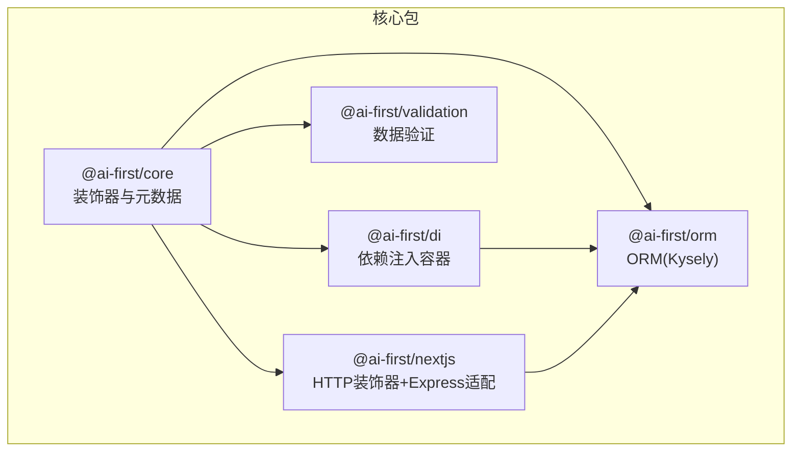
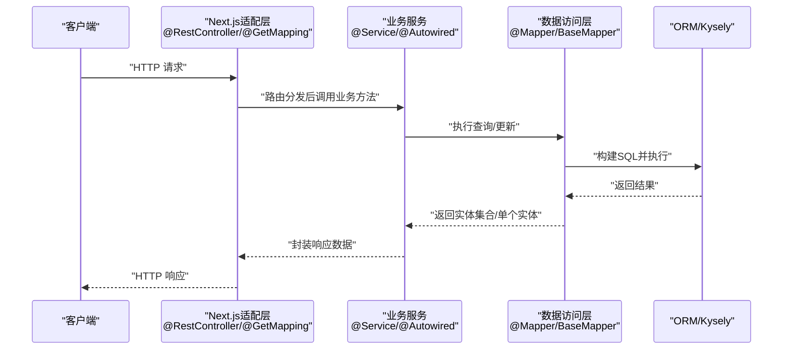
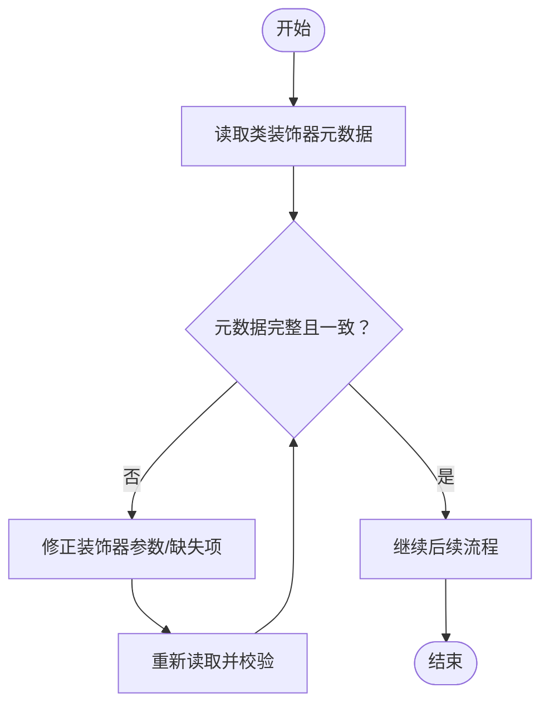
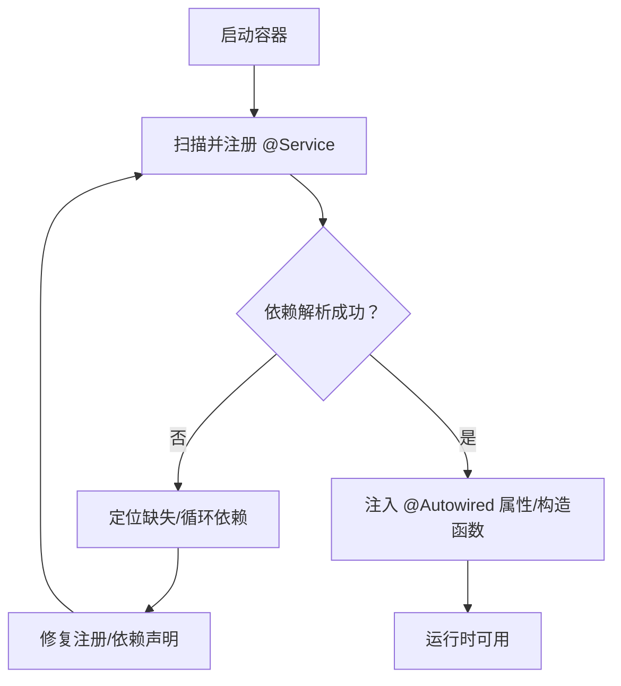
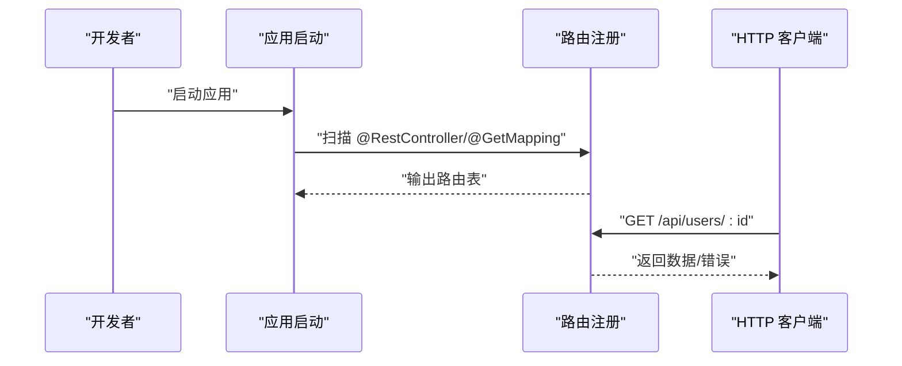
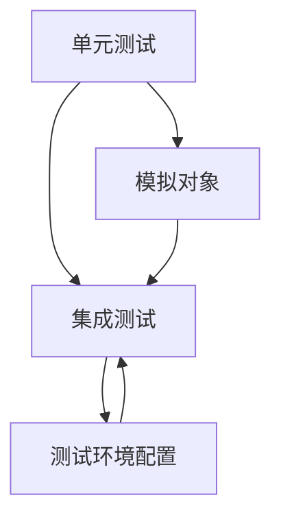
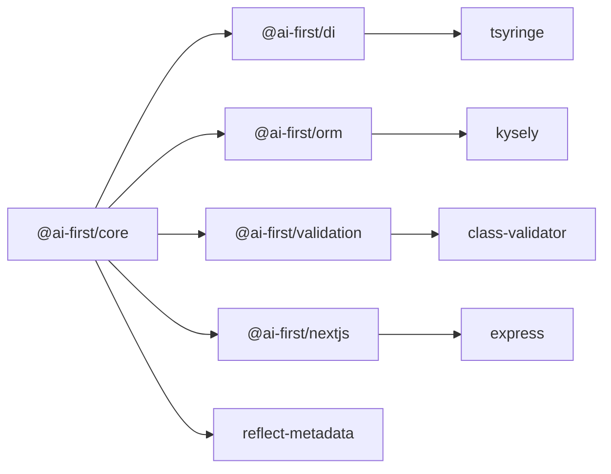

# 调试与测试

<cite>
**本文引用的文件**
- [README.md](file://README.md)
- [packages/core/package.json](file://packages/core/package.json)
- [packages/di/package.json](file://packages/di/package.json)
- [packages/orm/package.json](file://packages/orm/package.json)
- [packages/validation/package.json](file://packages/validation/package.json)
- [packages/nextjs/package.json](file://packages/nextjs/package.json)
- [packages/orm/examples/test-manual.mjs](file://packages/orm/examples/test-manual.mjs)
</cite>

## 目录
1. [简介](#简介)
2. [项目结构](#项目结构)
3. [核心组件](#核心组件)
4. [架构总览](#架构总览)
5. [详细组件分析](#详细组件分析)
6. [依赖关系分析](#依赖关系分析)
7. [性能考虑](#性能考虑)
8. [故障排查指南](#故障排查指南)
9. [结论](#结论)
10. [附录](#附录)

## 简介
本指南聚焦于该 AI-first 框架在“调试与测试”方面的实践方法，围绕以下目标展开：
- 装饰器元数据的检查与验证
- 依赖注入容器的状态查看与定位
- 路由映射的验证方法
- 单元测试与集成测试的编写要点（含模拟对象与测试环境）
- 常见问题诊断与性能分析技巧
- 测试覆盖率提升策略与持续集成配置建议
- 开发工具推荐与使用技巧

本指南以仓库中已存在的包结构与示例为依据，结合装饰器驱动的元数据系统、DI 容器与 Next.js 适配层，给出可操作的调试与测试流程。

## 项目结构
该仓库采用 monorepo 结构，核心能力通过多个包协同实现：
- packages/core：装饰器与元数据系统
- packages/di：依赖注入容器（基于 TSyringe）
- packages/orm：ORM（MyBatis-Plus 风格，Kysely 底层）
- packages/validation：数据验证（class-validator 风格）
- packages/nextjs：Spring Boot 风格 HTTP 装饰器与 Express 路由适配
- app/examples：示例项目（如 user-crud）

图表来源
- [packages/core/package.json](file://packages/core/package.json#L1-L39)
- [packages/di/package.json](file://packages/di/package.json#L1-L53)
- [packages/orm/package.json](file://packages/orm/package.json#L1-L54)
- [packages/validation/package.json](file://packages/validation/package.json#L1-L40)
- [packages/nextjs/package.json](file://packages/nextjs/package.json#L1-L59)

章节来源
- [README.md](file://README.md#L14-L34)
- [packages/core/package.json](file://packages/core/package.json#L1-L39)
- [packages/di/package.json](file://packages/di/package.json#L1-L53)
- [packages/orm/package.json](file://packages/orm/package.json#L1-L54)
- [packages/validation/package.json](file://packages/validation/package.json#L1-L40)
- [packages/nextjs/package.json](file://packages/nextjs/package.json#L1-L59)

## 核心组件
- 装饰器与元数据系统：提供运行时反射能力，支撑 ORM、DI、Validation、Next.js 的装饰器行为。
- 依赖注入容器：基于 TSyringe，提供构造函数与属性注入，支持服务注册与生命周期管理。
- ORM：提供 MyBatis-Plus 风格的实体与 Mapper 装饰器，配合 Kysely 执行查询。
- 数据验证：提供类级与字段级校验装饰器，与 class-validator 兼容。
- Next.js 适配：提供 @RestController、@GetMapping、@PostMapping 等装饰器，映射到 Express 路由。

章节来源
- [README.md](file://README.md#L57-L81)
- [packages/core/package.json](file://packages/core/package.json#L23-L26)
- [packages/di/package.json](file://packages/di/package.json#L27-L30)
- [packages/orm/package.json](file://packages/orm/package.json#L23-L29)
- [packages/validation/package.json](file://packages/validation/package.json#L21-L25)
- [packages/nextjs/package.json](file://packages/nextjs/package.json#L31-L37)

## 架构总览
下图展示从控制器到服务、再到数据访问层的整体调用链，以及装饰器元数据在各层的作用点。

图表来源
- [packages/nextjs/package.json](file://packages/nextjs/package.json#L31-L37)
- [packages/di/package.json](file://packages/di/package.json#L27-L30)
- [packages/orm/package.json](file://packages/orm/package.json#L23-L29)

## 详细组件分析

### 组件A：装饰器元数据检查
- 元数据来源：装饰器在编译期写入 reflect-metadata，运行时通过反射读取。
- 关键点：
  - 确认装饰器是否正确标注（如 @TableName、@TableId、@Mapper、@Service、@Autowired）。
  - 在运行时打印类的装饰器元数据，核对实体表名、字段映射、服务注册等信息。
  - 对比装饰器参数与实际行为（如主键类型、列名映射）。

图表来源
- [packages/core/package.json](file://packages/core/package.json#L23-L26)

章节来源
- [packages/core/package.json](file://packages/core/package.json#L23-L26)

### 组件B：依赖注入容器状态查看
- 注入方式：支持构造函数与属性注入，服务通过 @Service 注册，依赖通过 @Autowired 注入。
- 排查步骤：
  - 启动时打印已注册的服务清单与别名映射。
  - 校验循环依赖与未解析依赖。
  - 在关键调用点断言注入实例非空，避免 NPE。
  - 使用最小化测试用例隔离 DI 问题。

图表来源
- [packages/di/package.json](file://packages/di/package.json#L27-L30)

章节来源
- [packages/di/package.json](file://packages/di/package.json#L27-L30)

### 组件C：路由映射验证
- 映射机制：Next.js 适配层将 @RestController、@GetMapping、@PostMapping 等装饰器映射到 Express 路由。
- 验证方法：
  - 启动时输出路由表（路径、HTTP 方法、处理器函数）。
  - 发送请求到具体路径，观察响应与错误日志。
  - 对比装饰器路径与实际注册路径，确保无冲突与遗漏。

图表来源
- [packages/nextjs/package.json](file://packages/nextjs/package.json#L31-L37)

章节来源
- [packages/nextjs/package.json](file://packages/nextjs/package.json#L31-L37)

### 组件D：单元测试与集成测试编写指南
- 单元测试
  - 针对纯函数与无外部依赖的逻辑进行测试。
  - 使用模拟对象替换外部依赖（如 Mapper），确保测试稳定可控。
- 集成测试
  - 启动最小化服务，连接内存数据库（如 SQLite）进行端到端验证。
  - 验证路由映射、装饰器行为、DI 注入、ORM 查询链路。
- 测试环境
  - 使用独立的测试配置文件，隔离数据库与缓存。
  - 在 CI 中固定依赖版本，确保可重复性。

图表来源
- [packages/orm/examples/test-manual.mjs](file://packages/orm/examples/test-manual.mjs)

章节来源
- [packages/orm/examples/test-manual.mjs](file://packages/orm/examples/test-manual.mjs)

### 组件E：常见问题诊断与性能分析
- 装饰器相关
  - 症状：实体字段不生效、查询异常。
  - 诊断：检查装饰器参数一致性；确认 reflect-metadata 是否在入口处加载。
- DI 相关
  - 症状：注入失败、循环依赖。
  - 诊断：打印注册清单；逐步排除循环依赖；确认作用域与生命周期。
- 路由相关
  - 症状：404、路径冲突。
  - 诊断：核对装饰器路径与注册顺序；检查中间件与前缀。
- 性能分析
  - 使用 Node.js 内置探针或火焰图工具定位热点。
  - ORM 层关注 SQL 执行计划与索引使用情况。

章节来源
- [packages/core/package.json](file://packages/core/package.json#L23-L26)
- [packages/di/package.json](file://packages/di/package.json#L27-L30)
- [packages/nextjs/package.json](file://packages/nextjs/package.json#L31-L37)
- [packages/orm/package.json](file://packages/orm/package.json#L23-L29)

## 依赖关系分析
- 包间依赖
  - @ai-first/core 是基础，被 @ai-first/di、@ai-first/orm、@ai-first/validation、@ai-first/nextjs 依赖。
  - @ai-first/di 与 @ai-first/orm 在 @ai-first/nextjs 中共同被使用。
- 外部依赖
  - reflect-metadata：装饰器元数据反射。
  - tsyringe：DI 容器。
  - kysely：ORM 查询构建与执行。
  - class-validator：数据验证。
  - express：HTTP 服务器与路由。

图表来源
- [packages/core/package.json](file://packages/core/package.json#L23-L26)
- [packages/di/package.json](file://packages/di/package.json#L27-L30)
- [packages/orm/package.json](file://packages/orm/package.json#L23-L29)
- [packages/validation/package.json](file://packages/validation/package.json#L21-L25)
- [packages/nextjs/package.json](file://packages/nextjs/package.json#L31-L37)

章节来源
- [packages/core/package.json](file://packages/core/package.json#L23-L26)
- [packages/di/package.json](file://packages/di/package.json#L27-L30)
- [packages/orm/package.json](file://packages/orm/package.json#L23-L29)
- [packages/validation/package.json](file://packages/validation/package.json#L21-L25)
- [packages/nextjs/package.json](file://packages/nextjs/package.json#L31-L37)

## 性能考虑
- 装饰器反射
  - 尽量减少运行时反射次数；对频繁使用的元数据进行缓存。
- DI 注册
  - 合理划分模块与作用域，避免一次性注册过多服务导致启动慢。
- ORM 查询
  - 使用合适的索引；避免 N+1 查询；必要时开启查询日志与执行时间统计。
- 路由与中间件
  - 减少中间件层级；对静态资源与健康检查接口单独处理。

## 故障排查指南
- 装饰器元数据缺失
  - 确认入口文件已引入 reflect-metadata。
  - 检查装饰器参数是否与运行时期望一致。
- DI 注入失败
  - 检查 @Service 与 @Autowired 的拼写与导入路径。
  - 排查循环依赖与作用域不匹配。
- 路由 404 或冲突
  - 核对 @RestController 的 path 与 @GetMapping/@PostMapping 的相对路径。
  - 检查中间件顺序与通配符路由覆盖。
- ORM 查询异常
  - 打开 SQL 日志，核对生成的 SQL 与数据库方言。
  - 检查实体字段与表结构映射关系。

章节来源
- [packages/core/package.json](file://packages/core/package.json#L23-L26)
- [packages/di/package.json](file://packages/di/package.json#L27-L30)
- [packages/nextjs/package.json](file://packages/nextjs/package.json#L31-L37)
- [packages/orm/package.json](file://packages/orm/package.json#L23-L29)

## 结论
本指南提供了基于装饰器元数据、DI 容器与 Next.js 适配层的调试与测试实践路径。通过系统化的元数据检查、容器状态核对、路由映射验证与单元/集成测试策略，可以有效提升开发效率与系统稳定性。建议在团队内形成统一的测试规范与 CI 配置，持续改进覆盖率与质量门禁。

## 附录
- 开发工具推荐
  - VS Code 插件：ESLint、Prettier、TypeScript TSServer
  - 调试：Node.js 调试器、Chrome DevTools
  - 性能：clinic、0x、perf_hooks
- 测试覆盖率与 CI 建议
  - 使用 Vitest 或 Jest，结合覆盖率阈值与 PR 质量门禁
  - 在 CI 中分别执行单元测试与集成测试，确保数据库与外部依赖隔离