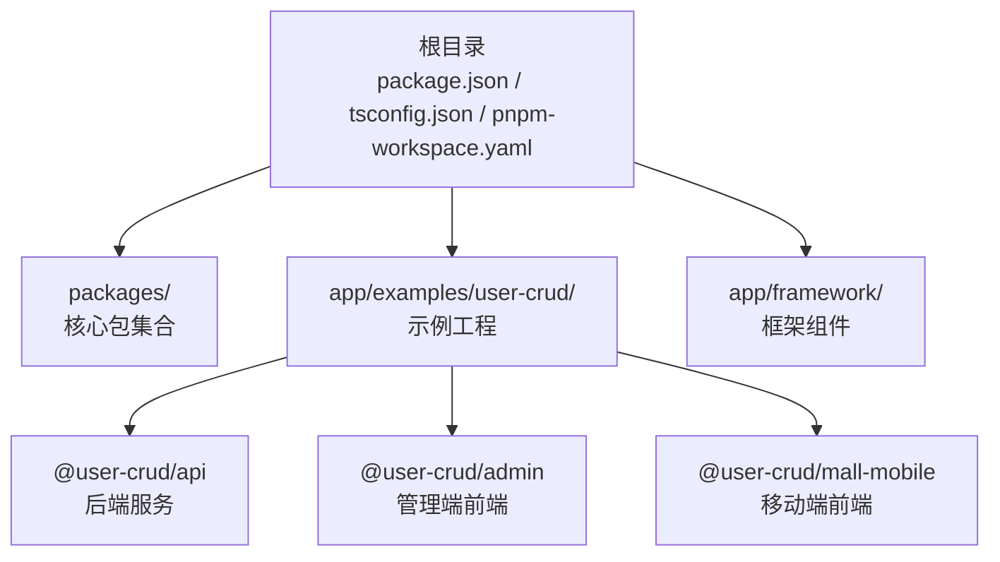
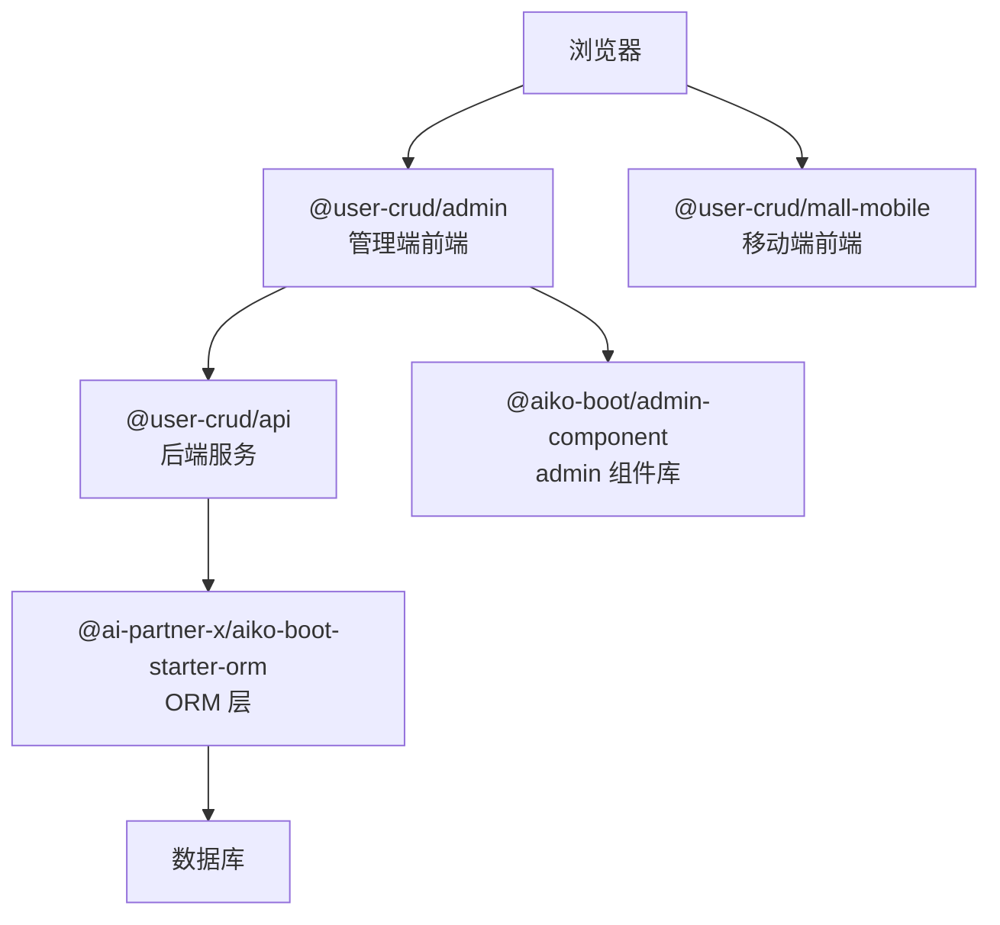
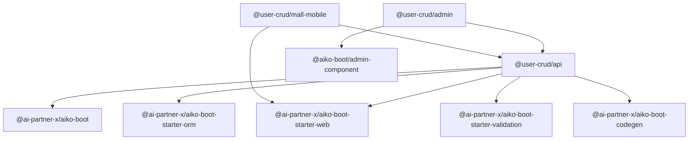

# 快速开始

<cite>
**本文引用的文件**
- [README.md](file://README.md)
- [package.json](file://package.json)
- [pnpm-workspace.yaml](file://pnpm-workspace.yaml)
- [tsconfig.json](file://tsconfig.json)
- [app/examples/user-crud/package.json](file://app/examples/user-crud/package.json)
- [app/examples/user-crud/README.md](file://app/examples/user-crud/README.md)
- [app/examples/user-crud/next.config.ts](file://app/examples/user-crud/next.config.ts)
- [app/examples/user-crud/packages/api/package.json](file://app/examples/user-crud/packages/api/package.json)
- [app/examples/user-crud/packages/admin/package.json](file://app/examples/user-crud/packages/admin/package.json)
- [app/examples/user-crud/packages/admin/vite.config.ts](file://app/examples/user-crud/packages/admin/vite.config.ts)
- [app/examples/user-crud/packages/mall-mobile/package.json](file://app/examples/user-crud/packages/mall-mobile/package.json)
- [app/framework/admin-component/package.json](file://app/framework/admin-component/package.json)
</cite>

## 目录
1. [简介](#简介)
2. [项目结构](#项目结构)
3. [核心组件](#核心组件)
4. [架构总览](#架构总览)
5. [详细组件分析](#详细组件分析)
6. [依赖关系分析](#依赖关系分析)
7. [性能注意事项](#性能注意事项)
8. [故障排除指南](#故障排除指南)
9. [结论](#结论)
10. [附录](#附录)

## 简介
本指南面向首次接触 AI First Framework 的开发者，帮助你在最短时间内完成环境准备、项目克隆、依赖安装、构建与运行，并成功启动 user-crud 示例。你将了解 monorepo 结构下的包管理方式（pnpm workspaces），以及如何在多包并行开发环境中高效工作。

## 项目结构
该仓库采用 pnpm workspaces 的 monorepo 结构，核心目录与职责如下：
- packages：核心包集合，包含依赖注入、Web 启动器、ORM、校验、代码生成等能力
- app/examples/user-crud：用户 CRUD 示例工程，包含 API、管理端前端、移动端前端三个子包
- app/framework：框架级组件库，如 admin 组件库
- 顶层配置：根 package.json、tsconfig.json、pnpm-workspace.yaml

图表来源
- [pnpm-workspace.yaml](file://pnpm-workspace.yaml#L1-L6)
- [app/examples/user-crud/package.json](file://app/examples/user-crud/package.json#L1-L20)

章节来源
- [README.md](file://README.md#L14-L33)
- [pnpm-workspace.yaml](file://pnpm-workspace.yaml#L1-L6)

## 核心组件
- 核心启动包：提供依赖注入与自动配置能力
- Web 启动器：提供注解式控制器与路由能力
- ORM 启动器：提供 MyBatis-Plus 风格的数据访问能力
- 校验启动器：提供数据校验能力
- 代码生成器：将 TypeScript 装饰器代码一键转换为 Java Spring Boot + MyBatis-Plus 代码
- admin 组件库：提供 Fiori 风格的 React UI 组件

章节来源
- [README.md](file://README.md#L56-L80)
- [packages/aiko-boot/package.json](file://packages/aiko-boot/package.json#L1-L61)

## 架构总览
下图展示了 user-crud 示例的典型运行时拓扑：浏览器通过管理端前端访问 API，API 再通过 ORM 访问数据库；移动端前端通过 Next.js 提供移动页面；admin 组件库为管理端提供 UI 基础设施。

图表来源
- [app/examples/user-crud/packages/admin/package.json](file://app/examples/user-crud/packages/admin/package.json#L12-L22)
- [app/examples/user-crud/packages/api/package.json](file://app/examples/user-crud/packages/api/package.json#L21-L32)
- [app/framework/admin-component/package.json](file://app/framework/admin-component/package.json#L1-L43)

## 详细组件分析

### 环境准备与前置条件
- Node.js 版本要求：根 package.json 中声明了 engines 字段，要求 Node.js >= 18.0.0
- 包管理器：推荐使用 pnpm，版本 >= 9.0.0；根 package.json 指定 packageManager 为 pnpm
- TypeScript：全局类型检查与编译配置由 tsconfig.json 提供
- React 生态：部分包对 React 有 peer 依赖，确保前端包正常工作

章节来源
- [package.json](file://package.json#L7-L10)
- [package.json](file://package.json#L30-L31)
- [tsconfig.json](file://tsconfig.json#L1-L33)

### 项目克隆与依赖安装
- 在本地克隆仓库后，进入根目录执行依赖安装
- 由于使用 pnpm workspaces，安装会一次性解析并链接所有包之间的依赖关系

章节来源
- [README.md](file://README.md#L35-L47)

### 构建流程
- 根目录构建：执行 pnpm build 将并行构建所有工作区包
- 示例工程构建：在 app/examples/user-crud 目录下执行 pnpm build，同样会并行构建 api、admin、mall-mobile 三个子包
- 单包构建：可通过 pnpm -F 指定包进行独立构建

章节来源
- [README.md](file://README.md#L43-L47)
- [app/examples/user-crud/package.json](file://app/examples/user-crud/package.json#L10-L14)

### 运行 user-crud 示例
- API 服务：进入 app/examples/user-crud/packages/api 并执行 pnpm dev，启动后端服务
- 管理端前端：在 app/examples/user-crud/packages/admin 执行 pnpm dev，默认监听 3000 端口
- 移动端前端：在 app/examples/user-crud/packages/mall-mobile 执行 pnpm dev，默认监听 3001 端口
- 注意：示例工程的 next.config.ts 默认为空配置，如需自定义可在该文件中添加配置

章节来源
- [README.md](file://README.md#L49-L54)
- [app/examples/user-crud/README.md](file://app/examples/user-crud/README.md#L1-L37)
- [app/examples/user-crud/next.config.ts](file://app/examples/user-crud/next.config.ts#L1-L6)
- [app/examples/user-crud/packages/admin/vite.config.ts](file://app/examples/user-crud/packages/admin/vite.config.ts#L1-L11)

### monorepo 包管理方式
- 工作区定义：pnpm-workspace.yaml 声明了 packages/*、app/framework/*、app/examples/*、app/examples/*/packages/* 等路径
- 脚本组织：根 package.json 提供统一的 build/dev/test/lint/type-check/clean 等脚本，通过 pnpm -r 递归执行
- 示例工程脚本：app/examples/user-crud/package.json 提供 dev:api、dev:admin、dev:mobile 等便捷脚本，便于按需启动
- 依赖解析：各包通过 workspace:* 引用同一工作区内的其他包，避免重复安装并保持版本一致

章节来源
- [pnpm-workspace.yaml](file://pnpm-workspace.yaml#L1-L6)
- [package.json](file://package.json#L11-L18)
- [app/examples/user-crud/package.json](file://app/examples/user-crud/package.json#L5-L14)

### 关键配置文件说明
- tsconfig.json：统一的 TypeScript 编译选项，启用装饰器元数据、严格模式、ESNext 模块解析等
- vite.config.ts（管理端）：集成 React 与 TailwindCSS 插件，开发服务器默认端口 3000
- next.config.ts（示例工程）：空配置，可按需扩展
- postcss.config.mjs（示例工程）：配置 TailwindCSS PostCSS 插件

章节来源
- [tsconfig.json](file://tsconfig.json#L1-L33)
- [app/examples/user-crud/packages/admin/vite.config.ts](file://app/examples/user-crud/packages/admin/vite.config.ts#L1-L11)
- [app/examples/user-crud/next.config.ts](file://app/examples/user-crud/next.config.ts#L1-L6)
- [app/examples/user-crud/postcss.config.mjs](file://app/examples/user-crud/postcss.config.mjs#L1-L8)

## 依赖关系分析
下图展示 user-crud 示例中的包依赖关系：管理端前端依赖 API 包与 admin 组件库；API 包依赖核心框架包；移动端前端依赖 API 包与 web 启动器。

图表来源
- [app/examples/user-crud/packages/admin/package.json](file://app/examples/user-crud/packages/admin/package.json#L12-L22)
- [app/examples/user-crud/packages/api/package.json](file://app/examples/user-crud/packages/api/package.json#L21-L32)
- [app/examples/user-crud/packages/mall-mobile/package.json](file://app/examples/user-crud/packages/mall-mobile/package.json#L11-L18)
- [app/framework/admin-component/package.json](file://app/framework/admin-component/package.json#L1-L43)

## 性能注意事项
- 使用 pnpm 的硬链接机制减少磁盘占用与安装时间
- 在根目录使用 pnpm -r 并行构建，缩短整体等待时间
- 开发阶段优先使用单包 dev 脚本，避免不必要的全量构建
- 管理端前端默认端口 3000，移动端前端默认端口 3001，避免端口冲突

## 故障排除指南
- Node.js 或 pnpm 版本过低
  - 现象：安装或构建时报错
  - 处理：升级 Node.js 至 >= 18.0.0，pnpm 至 >= 9.0.0
  - 参考：根 package.json 的 engines 字段
- 无法找到工作区包
  - 现象：构建时报找不到 workspace:* 依赖
  - 处理：确认 pnpm-workspace.yaml 正确声明了相关路径；重新执行 pnpm install
  - 参考：pnpm-workspace.yaml
- 端口被占用
  - 现象：vite 或 next 启动失败
  - 处理：修改 vite.config.ts 中的 server.port 或使用系统命令释放端口
  - 参考：vite.config.ts 端口配置
- TypeScript 类型错误
  - 现象：构建或 lint 报错
  - 处理：执行 pnpm type-check 或修复 tsconfig.json 中的严格模式相关配置
  - 参考：tsconfig.json

章节来源
- [package.json](file://package.json#L7-L10)
- [pnpm-workspace.yaml](file://pnpm-workspace.yaml#L1-L6)
- [app/examples/user-crud/packages/admin/vite.config.ts](file://app/examples/user-crud/packages/admin/vite.config.ts#L7-L9)
- [tsconfig.json](file://tsconfig.json#L23-L29)

## 结论
通过本指南，你已掌握 AI First Framework 的环境准备、依赖安装、构建与运行全流程，并能在 monorepo 结构下高效地启动 user-crud 示例。建议在熟悉基础流程后，逐步探索核心包与示例工程的实现细节，以加深对框架设计理念与最佳实践的理解。

## 附录
- 常用命令清单
  - 安装依赖：pnpm install
  - 根构建：pnpm build
  - 示例工程构建：cd app/examples/user-crud && pnpm build
  - API 开发：cd app/examples/user-crud/packages/api && pnpm dev
  - 管理端开发：cd app/examples/user-crud/packages/admin && pnpm dev
  - 移动端开发：cd app/examples/user-crud/packages/mall-mobile && pnpm dev
- 预期输出示例
  - API 启动日志：控制台显示服务监听端口与加载模块信息
  - 管理端前端：浏览器打开 http://localhost:3000，显示管理界面
  - 移动端前端：浏览器打开 http://localhost:3001，显示移动端页面

章节来源
- [README.md](file://README.md#L35-L54)
- [app/examples/user-crud/README.md](file://app/examples/user-crud/README.md#L7-L17)
- [app/examples/user-crud/packages/admin/vite.config.ts](file://app/examples/user-crud/packages/admin/vite.config.ts#L7-L9)
- [app/examples/user-crud/packages/mall-mobile/package.json](file://app/examples/user-crud/packages/mall-mobile/package.json#L6-L8)