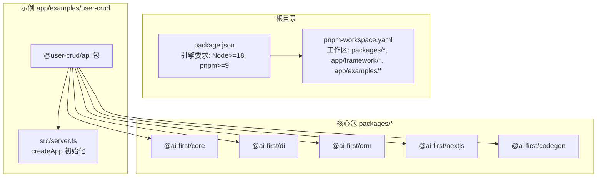
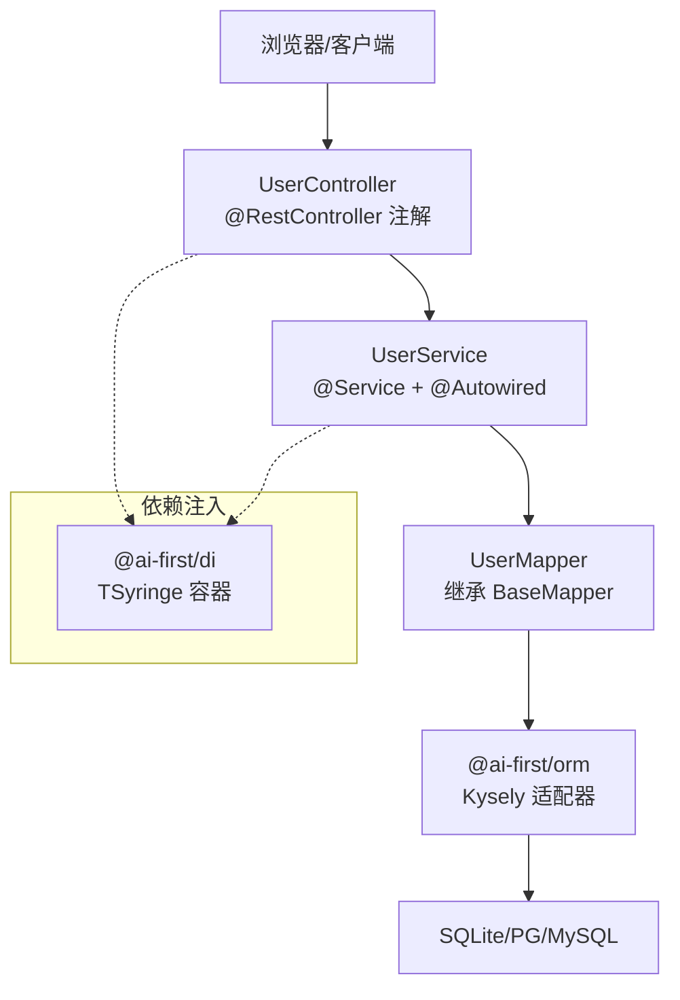
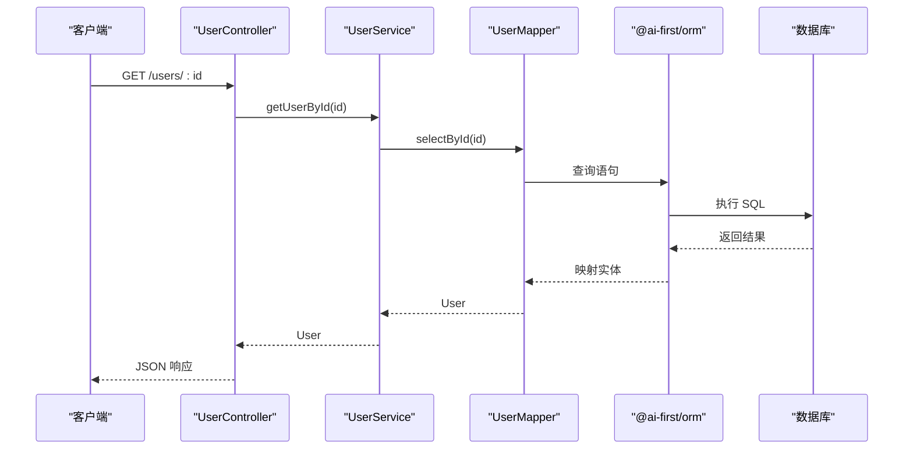
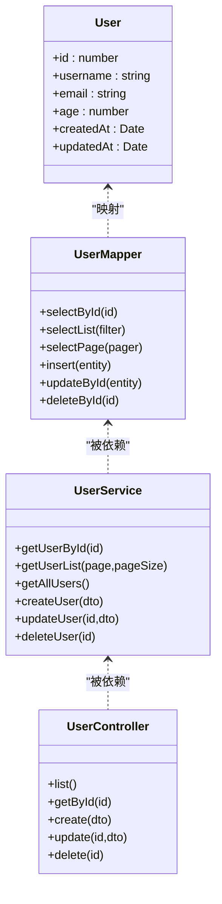
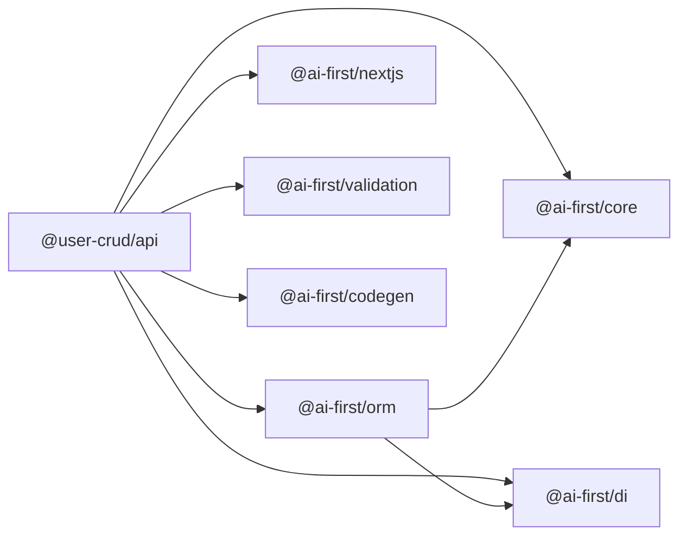

# 快速开始

<cite>
**本文引用的文件**
- [README.md](file://README.md)
- [package.json](file://package.json)
- [pnpm-workspace.yaml](file://pnpm-workspace.yaml)
- [app/examples/user-crud/README.md](file://app/examples/user-crud/README.md)
- [app/examples/user-crud/packages/api/package.json](file://app/examples/user-crud/packages/api/package.json)
- [app/examples/user-crud/packages/api/src/server.ts](file://app/examples/user-crud/packages/api/src/server.ts)
- [app/examples/user-crud/packages/api/src/entity/user.entity.ts](file://app/examples/user-crud/packages/api/src/entity/user.entity.ts)
- [app/examples/user-crud/packages/api/src/mapper/user.mapper.ts](file://app/examples/user-crud/packages/api/src/mapper/user.mapper.ts)
- [app/examples/user-crud/packages/api/src/service/user.service.ts](file://app/examples/user-crud/packages/api/src/service/user.service.ts)
- [app/examples/user-crud/packages/api/src/controller/user.controller.ts](file://app/examples/user-crud/packages/api/src/controller/user.controller.ts)
- [packages/core/package.json](file://packages/core/package.json)
- [packages/orm/package.json](file://packages/orm/package.json)
- [packages/di/package.json](file://packages/di/package.json)
</cite>

## 目录
1. [简介](#简介)
2. [项目结构](#项目结构)
3. [核心组件](#核心组件)
4. [架构总览](#架构总览)
5. [详细组件分析](#详细组件分析)
6. [依赖关系分析](#依赖关系分析)
7. [性能注意事项](#性能注意事项)
8. [故障排查指南](#故障排查指南)
9. [结论](#结论)
10. [附录](#附录)

## 简介
本指南面向新手开发者，帮助你在约 15 分钟内完成 AI-First Framework 的安装与运行，启动并体验 user-crud 示例项目，掌握创建第一个实体、Mapper、Service 与 Controller 的基础开发流程，并提供常见初始化问题的排查方案。

## 项目结构
该仓库采用 monorepo 结构，核心包位于 packages 目录，示例项目位于 app/examples。user-crud 示例是一个基于 Next.js 的全栈示例，后端 API 通过 @ai-first/nextjs 提供 Spring Boot 风格的控制器能力，ORM 层使用 @ai-first/orm，依赖注入由 @ai-first/di 提供。

图表来源
- [package.json](file://package.json#L7-L10)
- [pnpm-workspace.yaml](file://pnpm-workspace.yaml#L1-L5)
- [packages/core/package.json](file://packages/core/package.json#L1-L39)
- [packages/di/package.json](file://packages/di/package.json#L1-L53)
- [packages/orm/package.json](file://packages/orm/package.json#L1-L54)
- [app/examples/user-crud/packages/api/package.json](file://app/examples/user-crud/packages/api/package.json#L20-L32)
- [app/examples/user-crud/packages/api/src/server.ts](file://app/examples/user-crud/packages/api/src/server.ts#L10-L18)

章节来源
- [README.md](file://README.md#L14-L34)
- [package.json](file://package.json#L7-L10)
- [pnpm-workspace.yaml](file://pnpm-workspace.yaml#L1-L5)

## 核心组件
- @ai-first/core：提供装饰器与元数据系统，是框架其他包的基础。
- @ai-first/di：依赖注入容器，支持构造函数与属性注入。
- @ai-first/orm：MyBatis-Plus 风格 ORM，支持多种数据库，提供 BaseMapper 与 QueryWrapper。
- @ai-first/nextjs：Next.js 适配层，提供 Spring Boot 风格的控制器注解与自动装配。
- @ai-first/codegen：TypeScript 到 Java Spring Boot + MyBatis-Plus 的代码生成器。

章节来源
- [README.md](file://README.md#L57-L81)
- [packages/core/package.json](file://packages/core/package.json#L1-L39)
- [packages/di/package.json](file://packages/di/package.json#L1-L53)
- [packages/orm/package.json](file://packages/orm/package.json#L1-L54)

## 架构总览
下图展示了从浏览器到数据库的请求链路，以及各层之间的依赖关系。

图表来源
- [app/examples/user-crud/packages/api/src/controller/user.controller.ts](file://app/examples/user-crud/packages/api/src/controller/user.controller.ts#L19-L52)
- [app/examples/user-crud/packages/api/src/service/user.service.ts](file://app/examples/user-crud/packages/api/src/service/user.service.ts#L9-L77)
- [app/examples/user-crud/packages/api/src/mapper/user.mapper.ts](file://app/examples/user-crud/packages/api/src/mapper/user.mapper.ts#L5-L16)
- [packages/orm/package.json](file://packages/orm/package.json#L23-L28)

## 详细组件分析

### 安装与初始化
- 环境要求
  - Node.js 版本：>= 18.0.0
  - pnpm 版本：>= 9.0.0
- 安装依赖
  - 在仓库根目录执行安装命令以安装所有包与示例依赖。
- 构建所有包
  - 执行构建脚本以编译所有核心包与示例。
- 初始化数据库
  - 在示例 API 包中执行数据库初始化脚本，创建本地 SQLite 数据库文件。

章节来源
- [package.json](file://package.json#L7-L10)
- [README.md](file://README.md#L36-L56)
- [app/examples/user-crud/packages/api/package.json](file://app/examples/user-crud/packages/api/package.json#L12-L16)

### 运行示例项目（user-crud）
- 进入示例 API 包目录并启动开发服务器。
- 启动后在控制台可以看到服务运行地址与 API 路径提示。

章节来源
- [README.md](file://README.md#L50-L55)
- [app/examples/user-crud/README.md](file://app/examples/user-crud/README.md#L5-L15)
- [app/examples/user-crud/packages/api/src/server.ts](file://app/examples/user-crud/packages/api/src/server.ts#L20-L23)

### 基础开发工作流：创建你的第一个实体、Mapper、Service 与 Controller
- 创建实体（Entity）
  - 使用 @Entity 与字段装饰器声明表结构与主键/字段映射。
- 创建 Mapper
  - 使用 @Mapper 装饰类并继承 BaseMapper，即可获得通用 CRUD 能力；也可扩展自定义查询方法。
- 创建 Service
  - 使用 @Service 装饰类并通过 @Autowired 注入 Mapper 或其他 Service；可使用 @Transactional 标注事务方法。
- 创建 Controller
  - 使用 @RestController 与路径/方法注解编写接口；通过 @Autowired 注入 Service 并返回数据。

图表来源
- [app/examples/user-crud/packages/api/src/controller/user.controller.ts](file://app/examples/user-crud/packages/api/src/controller/user.controller.ts#L24-L32)
- [app/examples/user-crud/packages/api/src/service/user.service.ts](file://app/examples/user-crud/packages/api/src/service/user.service.ts#L14-L16)
- [app/examples/user-crud/packages/api/src/mapper/user.mapper.ts](file://app/examples/user-crud/packages/api/src/mapper/user.mapper.ts#L6-L10)
- [packages/orm/package.json](file://packages/orm/package.json#L23-L28)

章节来源
- [README.md](file://README.md#L82-L159)
- [app/examples/user-crud/packages/api/src/entity/user.entity.ts](file://app/examples/user-crud/packages/api/src/entity/user.entity.ts#L3-L22)
- [app/examples/user-crud/packages/api/src/mapper/user.mapper.ts](file://app/examples/user-crud/packages/api/src/mapper/user.mapper.ts#L5-L16)
- [app/examples/user-crud/packages/api/src/service/user.service.ts](file://app/examples/user-crud/packages/api/src/service/user.service.ts#L9-L77)
- [app/examples/user-crud/packages/api/src/controller/user.controller.ts](file://app/examples/user-crud/packages/api/src/controller/user.controller.ts#L19-L52)

### 示例实体、Mapper、Service、Controller 的职责与关系
- 实体（Entity）：描述数据库表结构与字段映射。
- Mapper（BaseMapper）：提供通用 CRUD 与分页查询能力，可扩展自定义查询。
- Service：业务逻辑封装，负责参数校验、事务控制与调用 Mapper。
- Controller：对外暴露 REST 接口，接收请求参数并返回响应。

图表来源
- [app/examples/user-crud/packages/api/src/entity/user.entity.ts](file://app/examples/user-crud/packages/api/src/entity/user.entity.ts#L3-L22)
- [app/examples/user-crud/packages/api/src/mapper/user.mapper.ts](file://app/examples/user-crud/packages/api/src/mapper/user.mapper.ts#L5-L16)
- [app/examples/user-crud/packages/api/src/service/user.service.ts](file://app/examples/user-crud/packages/api/src/service/user.service.ts#L9-L77)
- [app/examples/user-crud/packages/api/src/controller/user.controller.ts](file://app/examples/user-crud/packages/api/src/controller/user.controller.ts#L19-L52)

## 依赖关系分析
- @user-crud/api 依赖核心包：@ai-first/core、@ai-first/di、@ai-first/orm、@ai-first/nextjs、@ai-first/validation、@ai-first/codegen。
- @ai-first/orm 依赖 @ai-first/core 与 @ai-first/di，并提供 Kysely 适配器与数据库驱动。
- @ai-first/di 依赖 TSyringe 与 reflect-metadata，提供依赖注入能力。
- @ai-first/nextjs 作为适配层，连接控制器注解与框架运行时。

图表来源
- [app/examples/user-crud/packages/api/package.json](file://app/examples/user-crud/packages/api/package.json#L20-L32)
- [packages/core/package.json](file://packages/core/package.json#L23-L25)
- [packages/orm/package.json](file://packages/orm/package.json#L23-L28)
- [packages/di/package.json](file://packages/di/package.json#L27-L29)

章节来源
- [app/examples/user-crud/packages/api/package.json](file://app/examples/user-crud/packages/api/package.json#L20-L32)
- [packages/core/package.json](file://packages/core/package.json#L23-L25)
- [packages/orm/package.json](file://packages/orm/package.json#L23-L28)
- [packages/di/package.json](file://packages/di/package.json#L27-L29)

## 性能注意事项
- 使用分页查询避免一次性加载大量数据。
- 对高频查询建立合适的索引（如 username、email）。
- 在 Service 中进行必要的参数校验与边界检查，减少无效数据库访问。
- 生产环境建议使用 PostgreSQL 并启用连接池与慢查询日志。

## 故障排查指南
- Node.js 或 pnpm 版本过低
  - 症状：安装失败或构建报错。
  - 解决：升级 Node.js 至 >= 18，pnpm 至 >= 9。
- 无法找到模块或导入错误
  - 症状：运行时报“Cannot find module”。
  - 解决：先执行根目录构建，确保所有包编译完成；确认工作区配置正确。
- 数据库初始化失败
  - 症状：首次启动无数据或报数据库相关错误。
  - 解决：在示例 API 包中执行数据库初始化脚本后再启动服务。
- 端口占用
  - 症状：服务启动失败并提示端口冲突。
  - 解决：修改环境变量中的端口号或释放占用端口。
- 反射元数据未注册
  - 症状：装饰器不生效或注入失败。
  - 解决：在入口文件顶部添加反射元数据注册导入。

章节来源
- [package.json](file://package.json#L7-L10)
- [README.md](file://README.md#L36-L56)
- [app/examples/user-crud/packages/api/package.json](file://app/examples/user-crud/packages/api/package.json#L12-L16)
- [app/examples/user-crud/packages/api/src/server.ts](file://app/examples/user-crud/packages/api/src/server.ts#L10-L18)

## 结论
通过本指南，你已经完成了环境准备、依赖安装、示例运行与基础开发流程实践。建议在本地 SQLite 上验证 CRUD 功能后，逐步迁移到生产数据库并完善参数校验与事务处理。

## 附录
- 快速命令清单
  - 安装依赖：在根目录执行安装命令。
  - 构建所有包：在根目录执行构建脚本。
  - 运行示例 API：进入示例 API 包并启动开发服务器。
  - 初始化数据库：在示例 API 包中执行数据库初始化脚本。

章节来源
- [README.md](file://README.md#L36-L56)
- [app/examples/user-crud/packages/api/package.json](file://app/examples/user-crud/packages/api/package.json#L12-L16)