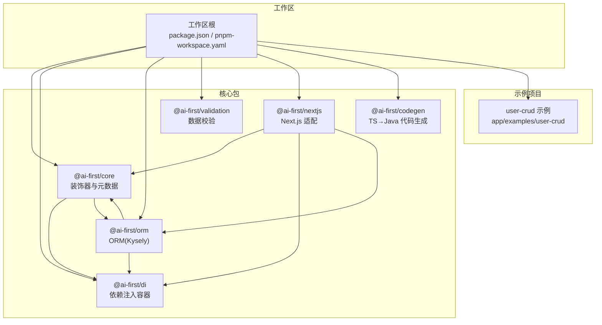
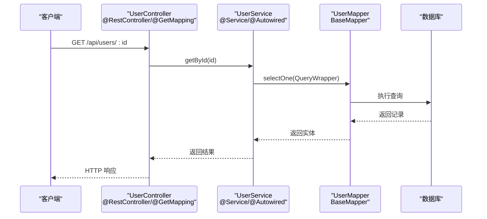
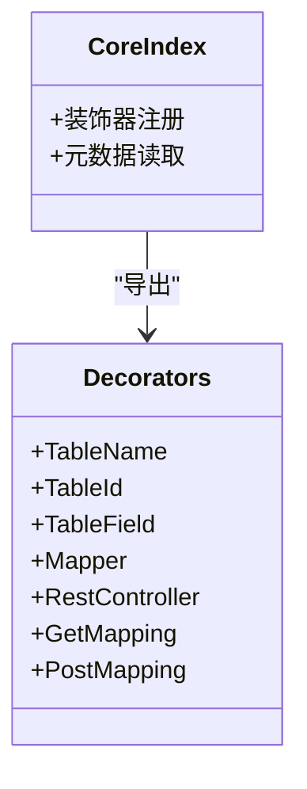
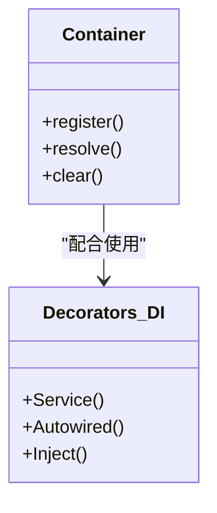
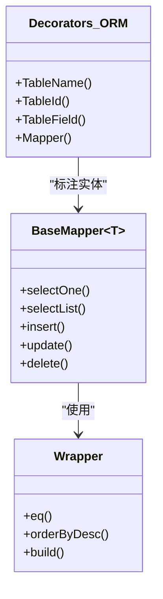
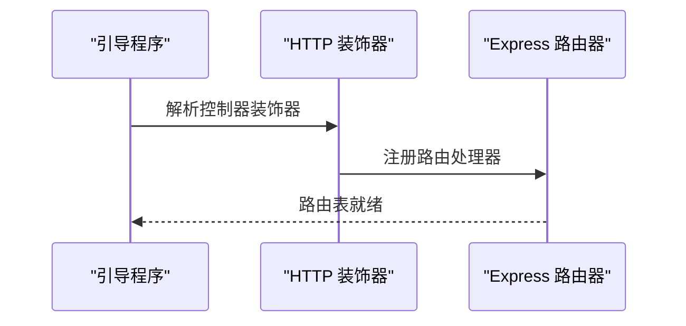
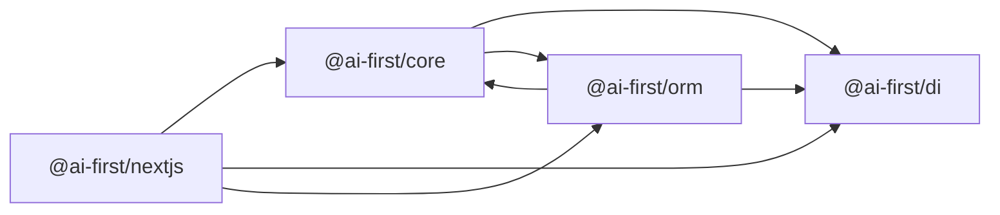

# 故障排除与常见问题

<cite>
**本文引用的文件**
- [README.md](file://README.md)
- [package.json](file://package.json)
- [pnpm-workspace.yaml](file://pnpm-workspace.yaml)
- [@ai-first/core 包配置](file://packages/core/package.json)
- [@ai-first/di 包配置](file://packages/di/package.json)
- [@ai-first/orm 包配置](file://packages/orm/package.json)
- [@ai-first/validation 包配置](file://packages/validation/package.json)
- [@ai-first/nextjs 包配置](file://packages/nextjs/package.json)
- [@ai-first/codegen 包配置](file://packages/codegen/package.json)
- [核心装饰器入口](file://packages/core/src/index.ts)
- [核心装饰器实现](file://packages/core/src/decorators.ts)
- [DI 容器实现](file://packages/di/src/container.ts)
- [DI 装饰器实现](file://packages/di/src/decorators.ts)
- [ORM 基类映射器](file://packages/orm/src/base-mapper.ts)
- [ORM 装饰器实现](file://packages/orm/src/decorators.ts)
- [ORM 查询包装器](file://packages/orm/src/wrapper.ts)
- [Next.js 装饰器实现](file://packages/nextjs/src/decorators.ts)
- [Next.js Express 路由器](file://packages/nextjs/src/express-router.ts)
- [Next.js 引导程序](file://packages/nextjs/src/bootstrap.ts)
- [用户 CRUD 示例控制器](file://app/examples/user-crud/packages/api/src/controllers/user.controller.ts)
- [用户 CRUD 示例服务](file://app/examples/user-crud/packages/api/src/services/user.service.ts)
- [用户 CRUD 示例映射器](file://app/examples/user-crud/packages/api/src/mappers/user.mapper.ts)
- [用户 CRUD 示例实体](file://app/examples/user-crud/packages/api/src/entities/user.entity.ts)
</cite>

## 目录
1. [简介](#简介)
2. [项目结构](#项目结构)
3. [核心组件](#核心组件)
4. [架构总览](#架构总览)
5. [详细组件分析](#详细组件分析)
6. [依赖关系分析](#依赖关系分析)
7. [性能考虑](#性能考虑)
8. [故障排除指南](#故障排除指南)
9. [结论](#结论)
10. [附录](#附录)

## 简介
本指南面向使用 AI-First Framework 的开发者，系统性地整理了开发过程中的常见问题与解决方案，涵盖装饰器不生效、依赖注入失败、路由生成异常、数据库连接问题等。同时提供调试方法、工具使用建议、性能诊断、内存泄漏排查与并发问题处理策略，并给出社区支持与版本兼容性说明，帮助开发者快速定位并解决问题。

## 项目结构
AI-First Framework 采用 monorepo 结构，核心包包括装饰器系统、依赖注入、ORM、校验、Next.js 适配层与代码生成器。示例项目位于 app/examples 下，便于复现与调试。

图表来源
- [pnpm-workspace.yaml](file://pnpm-workspace.yaml#L1-L5)
- [package.json](file://package.json#L1-L31)

章节来源
- [README.md](file://README.md#L14-L34)
- [pnpm-workspace.yaml](file://pnpm-workspace.yaml#L1-L5)
- [package.json](file://package.json#L1-L31)

## 核心组件
- 装饰器与元数据系统：提供实体、映射器、控制器等装饰器能力，依赖反射元数据。
- 依赖注入容器：基于 TSyringe，支持构造函数与属性注入。
- ORM 层：基于 Kysely，提供通用 Mapper、条件构造器与多数据库适配。
- 校验层：基于 class-validator，提供装饰器风格的数据校验。
- Next.js 适配层：提供 Spring Boot 风格的 HTTP 装饰器与 Express 路由集成。
- 代码生成器：将 TypeScript 装饰器代码转换为 Java Spring Boot + MyBatis-Plus 代码。

章节来源
- [README.md](file://README.md#L57-L81)
- [@ai-first/core 包配置](file://packages/core/package.json#L1-L39)
- [@ai-first/di 包配置](file://packages/di/package.json#L1-L53)
- [@ai-first/orm 包配置](file://packages/orm/package.json#L1-L54)
- [@ai-first/validation 包配置](file://packages/validation/package.json#L1-L40)
- [@ai-first/nextjs 包配置](file://packages/nextjs/package.json#L1-L59)
- [@ai-first/codegen 包配置](file://packages/codegen/package.json#L1-L28)

## 架构总览
下图展示了从控制器到服务、映射器再到数据库的典型调用链路，以及装饰器在各层的作用点。

图表来源
- [Next.js 装饰器实现](file://packages/nextjs/src/decorators.ts)
- [用户 CRUD 示例控制器](file://app/examples/user-crud/packages/api/src/controllers/user.controller.ts)
- [用户 CRUD 示例服务](file://app/examples/user-crud/packages/api/src/services/user.service.ts)
- [ORM 基类映射器](file://packages/orm/src/base-mapper.ts)
- [ORM 查询包装器](file://packages/orm/src/wrapper.ts)

## 详细组件分析

### 装饰器系统（@ai-first/core）
- 作用：为实体、映射器、控制器等提供声明式元数据，驱动运行时行为。
- 关键点：需启用 reflect-metadata；装饰器必须在类定义阶段执行。
- 常见问题：未导入 reflect-metadata、装饰器顺序错误、类未被实际引用导致元数据丢失。

图表来源
- [核心装饰器入口](file://packages/core/src/index.ts)
- [核心装饰器实现](file://packages/core/src/decorators.ts)

章节来源
- [核心装饰器入口](file://packages/core/src/index.ts)
- [核心装饰器实现](file://packages/core/src/decorators.ts)
- [@ai-first/core 包配置](file://packages/core/package.json#L23-L26)

### 依赖注入（@ai-first/di）
- 作用：容器管理服务生命周期与依赖解析，支持构造函数与属性注入。
- 关键点：确保服务类被扫描注册；注入目标需有对应绑定；避免循环依赖。
- 常见问题：未在模块中注册服务、注入类型不匹配、作用域配置错误。

图表来源
- [DI 容器实现](file://packages/di/src/container.ts)
- [DI 装饰器实现](file://packages/di/src/decorators.ts)

章节来源
- [DI 容器实现](file://packages/di/src/container.ts)
- [DI 装饰器实现](file://packages/di/src/decorators.ts)
- [@ai-first/di 包配置](file://packages/di/package.json#L27-L30)

### ORM 层（@ai-first/orm）
- 作用：提供通用 Mapper 与条件构造器，支持多数据库适配。
- 关键点：实体需正确标注表名与字段；查询包装器参数需与实体字段一致。
- 常见问题：字段名映射不一致、条件构造器参数类型错误、数据库驱动缺失。

图表来源
- [ORM 基类映射器](file://packages/orm/src/base-mapper.ts)
- [ORM 查询包装器](file://packages/orm/src/wrapper.ts)
- [ORM 装饰器实现](file://packages/orm/src/decorators.ts)

章节来源
- [ORM 基类映射器](file://packages/orm/src/base-mapper.ts)
- [ORM 查询包装器](file://packages/orm/src/wrapper.ts)
- [ORM 装饰器实现](file://packages/orm/src/decorators.ts)
- [@ai-first/orm 包配置](file://packages/orm/package.json#L23-L29)

### Next.js 适配层（@ai-first/nextjs）
- 作用：提供 Spring Boot 风格的 HTTP 装饰器与 Express 路由集成。
- 关键点：控制器类需标注 @RestController；路由装饰器需与路径一致；中间件与 CORS 配置需正确。
- 常见问题：路由未生成、装饰器未生效、中间件顺序错误。

图表来源
- [Next.js 引导程序](file://packages/nextjs/src/bootstrap.ts)
- [Next.js 装饰器实现](file://packages/nextjs/src/decorators.ts)
- [Next.js Express 路由器](file://packages/nextjs/src/express-router.ts)

章节来源
- [Next.js 引导程序](file://packages/nextjs/src/bootstrap.ts)
- [Next.js 装饰器实现](file://packages/nextjs/src/decorators.ts)
- [Next.js Express 路由器](file://packages/nextjs/src/express-router.ts)
- [@ai-first/nextjs 包配置](file://packages/nextjs/package.json#L31-L37)

### 示例项目（user-crud）
- 作用：演示完整的控制器-服务-映射器-实体链路，便于对照排查。
- 建议：先运行示例项目，确认环境正常后再迁移业务代码。

章节来源
- [用户 CRUD 示例控制器](file://app/examples/user-crud/packages/api/src/controllers/user.controller.ts)
- [用户 CRUD 示例服务](file://app/examples/user-crud/packages/api/src/services/user.service.ts)
- [用户 CRUD 示例映射器](file://app/examples/user-crud/packages/api/src/mappers/user.mapper.ts)
- [用户 CRUD 示例实体](file://app/examples/user-crud/packages/api/src/entities/user.entity.ts)

## 依赖关系分析

图表来源
- [@ai-first/core 包配置](file://packages/core/package.json#L23-L26)
- [@ai-first/di 包配置](file://packages/di/package.json#L27-L30)
- [@ai-first/orm 包配置](file://packages/orm/package.json#L23-L29)
- [@ai-first/nextjs 包配置](file://packages/nextjs/package.json#L31-L37)

章节来源
- [@ai-first/core 包配置](file://packages/core/package.json#L23-L26)
- [@ai-first/di 包配置](file://packages/di/package.json#L27-L30)
- [@ai-first/orm 包配置](file://packages/orm/package.json#L23-L29)
- [@ai-first/nextjs 包配置](file://packages/nextjs/package.json#L31-L37)

## 性能考虑
- 调试与分析
  - 使用 Node.js 内置分析器对关键路径进行采样，识别热点函数与阻塞点。
  - 对 ORM 查询进行 EXPLAIN 分析，检查索引使用与查询计划。
  - 在高并发场景下监控数据库连接池使用情况与等待队列长度。
- 优化建议
  - 合理分页与投影，避免一次性加载大结果集。
  - 复用连接与事务，减少连接建立开销。
  - 使用缓存层降低重复查询压力。
  - 控制装饰器与反射的使用频率，避免在热路径上过度使用元数据。

## 故障排除指南

### 装饰器不生效
- 检查项
  - 是否已导入 reflect-metadata 并在入口处执行。
  - 装饰器是否在类定义阶段执行，而非运行时动态生成。
  - 控制器装饰器路径与路由装饰器是否匹配。
- 排查步骤
  - 在控制器类上添加日志，确认装饰器解析阶段是否执行。
  - 检查引导程序是否正确扫描并注册控制器。
  - 对比示例项目中的装饰器写法，逐项核对。

章节来源
- [核心装饰器实现](file://packages/core/src/decorators.ts)
- [Next.js 装饰器实现](file://packages/nextjs/src/decorators.ts)
- [Next.js 引导程序](file://packages/nextjs/src/bootstrap.ts)

### 依赖注入失败
- 检查项
  - 服务类是否已通过 @Service 正确标注并注册。
  - @Autowired 注入的目标类型是否与注册的服务类型一致。
  - 是否存在循环依赖或作用域不匹配。
- 排查步骤
  - 在服务构造函数中添加日志，确认容器是否成功解析依赖。
  - 使用容器的诊断接口查看已注册的依赖关系。
  - 将复杂服务拆分为更小的子服务，消除循环依赖。

章节来源
- [DI 容器实现](file://packages/di/src/container.ts)
- [DI 装饰器实现](file://packages/di/src/decorators.ts)

### 路由生成异常
- 检查项
  - @RestController 的 path 与 @GetMapping/@PostMapping 的路径是否拼接正确。
  - Express 中间件顺序是否影响路由匹配。
  - CORS 与预检请求是否正确配置。
- 排查步骤
  - 查看引导程序输出的路由表，确认路由已注册。
  - 使用 curl 或浏览器开发者工具检查请求是否到达预期处理器。
  - 逐步注释中间件，定位冲突来源。

章节来源
- [Next.js 引导程序](file://packages/nextjs/src/bootstrap.ts)
- [Next.js Express 路由器](file://packages/nextjs/src/express-router.ts)

### 数据库连接问题
- 检查项
  - 数据库驱动是否安装（如 pg、better-sqlite3）。
  - 连接字符串格式与凭据是否正确。
  - 数据库服务是否可用，防火墙与网络策略是否放行。
- 排查步骤
  - 使用最小化示例直接连接数据库，排除框架层干扰。
  - 检查 ORM 配置与连接池设置，确认最大连接数与超时时间合理。
  - 查看数据库慢查询日志，定位性能瓶颈。

章节来源
- [ORM 基类映射器](file://packages/orm/src/base-mapper.ts)
- [@ai-first/orm 包配置](file://packages/orm/package.json#L26-L28)

### Java 代码生成异常
- 检查项
  - 输入的 TypeScript 装饰器代码是否符合规范。
  - 生成器依赖是否完整，TypeScript 编译器版本是否兼容。
- 排查步骤
  - 使用示例项目的实体与映射器作为输入，验证生成器功能。
  - 检查生成器的解析与转换逻辑，确认装饰器映射规则正确。

章节来源
- [@ai-first/codegen 包配置](file://packages/codegen/package.json#L21-L23)

### 并发问题与内存泄漏
- 并发问题
  - 确保服务无状态或正确处理共享资源的并发访问。
  - 对数据库操作使用事务边界控制，避免脏读与死锁。
- 内存泄漏排查
  - 使用内存快照对比，定位未释放的对象引用。
  - 检查事件监听器、定时器与全局变量是否正确清理。
  - 对长连接与连接池进行周期性健康检查。

## 结论
通过系统化的故障排除流程与工具使用建议，开发者可以快速定位并解决 AI-First Framework 使用过程中的常见问题。建议在开发初期即引入示例项目进行端到端验证，并建立完善的日志与监控体系，以便在生产环境中持续发现与解决问题。

## 附录

### 社区支持与问题反馈
- 仓库地址与贡献指南请参考项目根目录说明。
- 如需反馈问题，请附带：
  - 环境信息（Node.js、pnpm 版本）
  - 复现步骤与期望/实际行为
  - 相关代码片段路径（避免粘贴具体代码）

章节来源
- [README.md](file://README.md#L206-L212)

### 版本兼容性说明
- 运行时要求：Node.js >= 18.0.0，pnpm >= 9.0.0。
- 包内依赖：各包通过 workspace:* 绑定，确保版本一致性。
- 数据库驱动：根据所选数据库安装相应 peerDependencies（如 pg）。

章节来源
- [package.json](file://package.json#L7-L10)
- [@ai-first/orm 包配置](file://packages/orm/package.json#L37-L44)
- [@ai-first/nextjs 包配置](file://packages/nextjs/package.json#L38-L40)