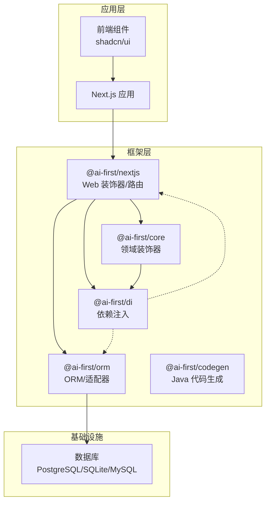
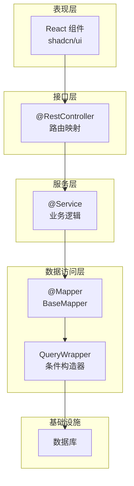
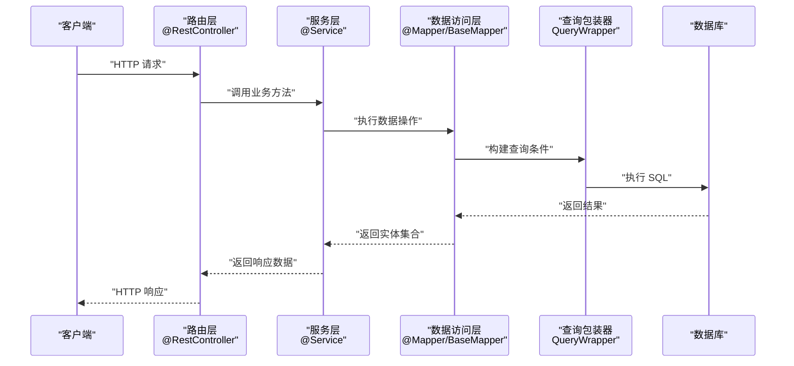
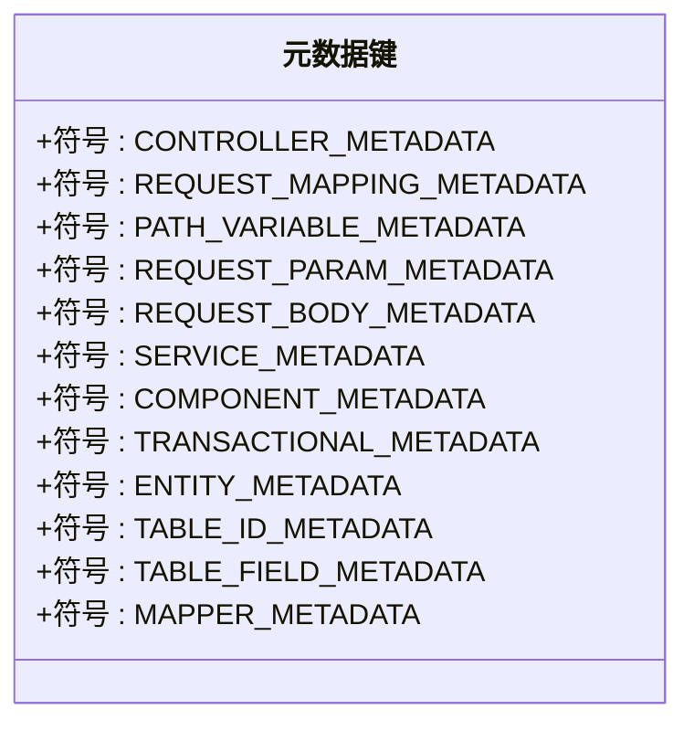
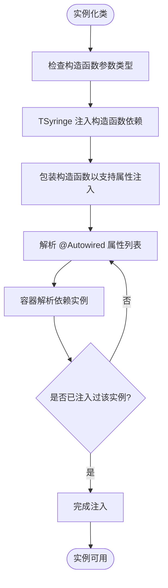
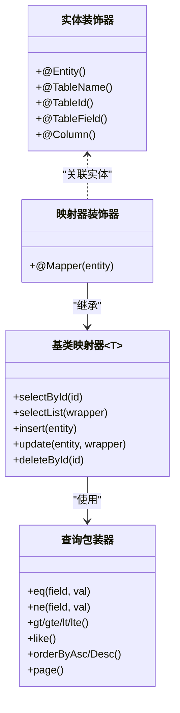
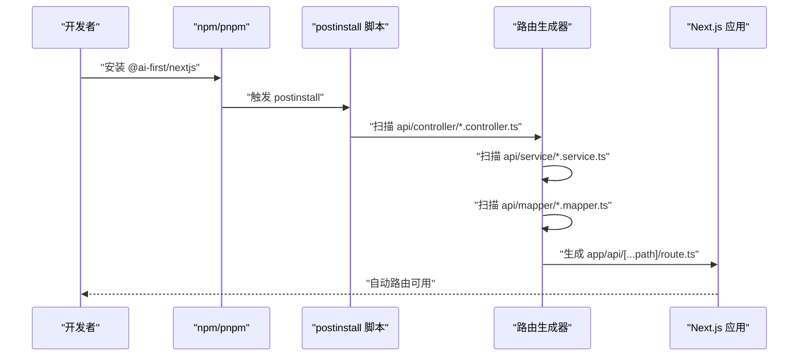
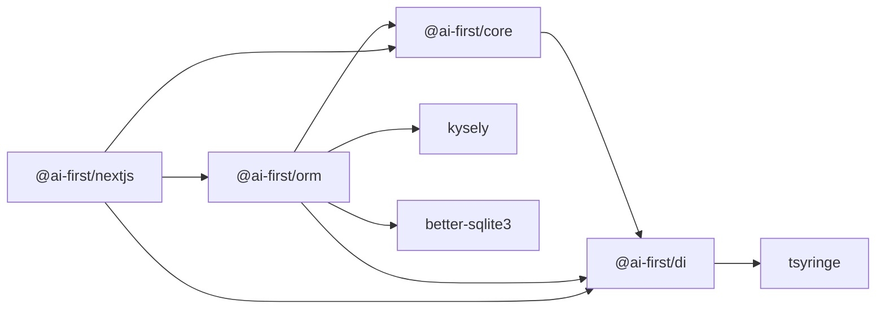

# 架构设计

<cite>
**本文引用的文件**
- [README.md](file://README.md)
- [package.json](file://package.json)
- [docs/architecture.md](file://docs/architecture.md)
- [@ai-first/core 包 package.json](file://packages/core/package.json)
- [@ai-first/di 包 package.json](file://packages/di/package.json)
- [@ai-first/orm 包 package.json](file://packages/orm/package.json)
- [@ai-first/nextjs 包 package.json](file://packages/nextjs/package.json)
- [@ai-first/core 装饰器实现](file://packages/core/src/decorators.ts)
- [@ai-first/di 装饰器实现](file://packages/di/src/decorators.ts)
- [@ai-first/orm 装饰器实现](file://packages/orm/src/decorators.ts)
- [@ai-first/nextjs 控制器装饰器实现](file://packages/nextjs/src/decorators.ts)
- [@ai-first/orm 基类映射器](file://packages/orm/src/base-mapper.ts)
- [@ai-first/orm 查询包装器](file://packages/orm/src/wrapper.ts)
- [@ai-first/orm 数据库适配器入口](file://packages/orm/src/adapters/index.ts)
- [@ai-first/orm Kysely 适配器](file://packages/orm/src/adapters/kysely-adapter.ts)
- [@ai-first/orm 数据库配置](file://packages/orm/src/config.ts)
- [@ai-first/orm 数据库连接管理](file://packages/orm/src/database.ts)
- [@ai-first/nextjs 引导与路由生成](file://packages/nextjs/src/bootstrap.ts)
- [@ai-first/nextjs Express 路由器](file://packages/nextjs/src/express-router.ts)
- [用户 CRUD 示例：控制器](file://app/examples/user-crud/packages/api/controller/user.controller.ts)
- [用户 CRUD 示例：服务](file://app/examples/user-crud/packages/api/service/user.service.ts)
- [用户 CRUD 示例：映射器](file://app/examples/user-crud/packages/api/mapper/user.mapper.ts)
- [用户 CRUD 示例：实体](file://app/examples/user-crud/packages/api/entity/user.entity.ts)
</cite>

## 目录
1. [引言](#引言)
2. [项目结构](#项目结构)
3. [核心组件](#核心组件)
4. [架构总览](#架构总览)
5. [详细组件分析](#详细组件分析)
6. [依赖分析](#依赖分析)
7. [性能考虑](#性能考虑)
8. [故障排查指南](#故障排查指南)
9. [结论](#结论)
10. [附录](#附录)

## 引言
本文件面向 AI-First Framework 的架构设计，系统性阐述其分层架构、装饰器模式的应用、依赖注入机制、MVC 模式实现、组件交互与数据流、装饰器元数据系统、DI 容器生命周期管理、ORM 查询构建机制，并给出系统边界图、组件关系图与序列图。同时解释技术选型原因、设计权衡与约束，提供扩展性分析与性能优化建议。

## 项目结构
AI-First Framework 采用 monorepo 结构，核心包包括：
- @ai-first/core：领域层装饰器与元数据系统
- @ai-first/di：基于 TSyringe 的依赖注入容器与装饰器
- @ai-first/orm：MyBatis-Plus 风格 ORM，兼容多数据库
- @ai-first/nextjs：Spring Boot 风格的 Web 层装饰器与路由生成
- @ai-first/validation：数据验证
- @ai-first/codegen：TypeScript 到 Java Spring Boot 的代码生成
- @ai-first/eslint-plugin：ESLint 规则插件
- @ai-first/types：共享类型定义

图表来源
- [docs/architecture.md](file://docs/architecture.md#L18-L30)
- [packages/core/package.json](file://packages/core/package.json#L1-L39)
- [packages/di/package.json](file://packages/di/package.json#L1-L53)
- [packages/orm/package.json](file://packages/orm/package.json#L1-L54)
- [packages/nextjs/package.json](file://packages/nextjs/package.json#L1-L59)

章节来源
- [README.md](file://README.md#L14-L34)
- [docs/architecture.md](file://docs/architecture.md#L18-L30)

## 核心组件
- 装饰器元数据系统：通过 reflect-metadata 在运行时存储与读取装饰器信息，支撑 MVC、ORM、DI 的反射式装配。
- 依赖注入容器：基于 TSyringe，提供 @Service/@Component/@Mapper 等装饰器的自动注册与生命周期控制。
- ORM 层：提供 @Entity/@TableId/@TableField/@Mapper 与 BaseMapper，结合适配器模式支持多数据库。
- Web 层：提供 @RestController/@GetMapping/@PostMapping 等装饰器，配合自动生成路由文件。
- 代码生成：将 TypeScript 装饰器代码转译为 Java Spring Boot + MyBatis-Plus。

章节来源
- [packages/core/src/decorators.ts](file://packages/core/src/decorators.ts#L1-L158)
- [packages/di/src/decorators.ts](file://packages/di/src/decorators.ts#L1-L110)
- [packages/orm/src/decorators.ts](file://packages/orm/src/decorators.ts#L1-L224)
- [packages/nextjs/src/decorators.ts](file://packages/nextjs/src/decorators.ts#L1-L196)

## 架构总览
AI-First Framework 采用“表现层-接口层-服务层-数据访问层-数据库”的分层架构，Web 层通过装饰器驱动，服务层通过 DI 注入，数据访问层通过 ORM 装饰器与适配器完成跨数据库抽象。

图表来源
- [docs/architecture.md](file://docs/architecture.md#L32-L65)
- [packages/nextjs/src/decorators.ts](file://packages/nextjs/src/decorators.ts#L46-L88)
- [packages/core/src/decorators.ts](file://packages/core/src/decorators.ts#L70-L118)
- [packages/orm/src/decorators.ts](file://packages/orm/src/decorators.ts#L130-L193)
- [packages/orm/src/wrapper.ts](file://packages/orm/src/wrapper.ts)

章节来源
- [docs/architecture.md](file://docs/architecture.md#L32-L65)

## 详细组件分析

### 分层架构与 MVC 实现
- 表现层：React 组件与 shadcn/ui，负责用户界面展示。
- 接口层：@RestController 与 @GetMapping/@PostMapping 等装饰器，将方法映射为 HTTP 接口；通过自动生成的路由文件对接 Next.js API Routes。
- 服务层：@Service 标注业务服务，支持构造函数注入与 @Autowired 属性注入。
- 数据访问层：@Mapper 标注数据访问对象，继承 BaseMapper<T>，使用 QueryWrapper 构建查询条件。

图表来源
- [packages/nextjs/src/decorators.ts](file://packages/nextjs/src/decorators.ts#L46-L88)
- [packages/core/src/decorators.ts](file://packages/core/src/decorators.ts#L70-L118)
- [packages/orm/src/decorators.ts](file://packages/orm/src/decorators.ts#L130-L193)
- [packages/orm/src/wrapper.ts](file://packages/orm/src/wrapper.ts)

章节来源
- [docs/architecture.md](file://docs/architecture.md#L32-L65)
- [packages/nextjs/src/decorators.ts](file://packages/nextjs/src/decorators.ts#L46-L88)
- [packages/core/src/decorators.ts](file://packages/core/src/decorators.ts#L70-L118)
- [packages/orm/src/decorators.ts](file://packages/orm/src/decorators.ts#L130-L193)

### 装饰器元数据系统与 MVC 元数据
- Web 层元数据：CONTROLLER_METADATA、REQUEST_MAPPING_METADATA、PATH_VARIABLE_METADATA、REQUEST_PARAM_METADATA、REQUEST_BODY_METADATA。
- 服务层元数据：SERVICE_METADATA、COMPONENT_METADATA、TRANSACTIONAL_METADATA。
- ORM 元数据：ENTITY_METADATA、TABLE_ID_METADATA、TABLE_FIELD_METADATA、MAPPER_METADATA。

图表来源
- [packages/nextjs/src/decorators.ts](file://packages/nextjs/src/decorators.ts#L8-L16)
- [packages/core/src/decorators.ts](file://packages/core/src/decorators.ts#L13-L16)
- [packages/orm/src/decorators.ts](file://packages/orm/src/decorators.ts#L14-L20)

章节来源
- [packages/nextjs/src/decorators.ts](file://packages/nextjs/src/decorators.ts#L8-L16)
- [packages/core/src/decorators.ts](file://packages/core/src/decorators.ts#L13-L16)
- [packages/orm/src/decorators.ts](file://packages/orm/src/decorators.ts#L14-L20)

### 依赖注入机制与生命周期
- 装饰器扩展：在 @Service/@Component/@Mapper 等装饰器中自动应用 Injectable 与 Singleton，实现构造函数注入与属性注入。
- Autowired 属性注入：通过 getAutowiredProperties 与 injectAutowiredProperties 递归解析并注入依赖。
- 生命周期：支持 singleton、scoped、transient，默认单例，可通过 AutoRegister 扩展选择生命周期。

图表来源
- [packages/core/src/decorators.ts](file://packages/core/src/decorators.ts#L30-L66)
- [packages/di/src/decorators.ts](file://packages/di/src/decorators.ts#L42-L84)

章节来源
- [packages/di/src/decorators.ts](file://packages/di/src/decorators.ts#L1-L110)
- [packages/core/src/decorators.ts](file://packages/core/src/decorators.ts#L30-L118)

### ORM 查询构建机制与适配器
- 装饰器：@Entity/@TableName、@TableId、@TableField/@Column、@Mapper。
- 基类映射器：BaseMapper<T> 提供通用 CRUD 操作。
- 查询包装器：QueryWrapper 提供链式条件构造。
- 适配器：根据实体类型创建适配器，支持 PostgreSQL、SQLite、MySQL 等数据库。

图表来源
- [packages/orm/src/decorators.ts](file://packages/orm/src/decorators.ts#L65-L193)
- [packages/orm/src/base-mapper.ts](file://packages/orm/src/base-mapper.ts)
- [packages/orm/src/wrapper.ts](file://packages/orm/src/wrapper.ts)

章节来源
- [packages/orm/src/decorators.ts](file://packages/orm/src/decorators.ts#L1-L224)
- [packages/orm/src/base-mapper.ts](file://packages/orm/src/base-mapper.ts)
- [packages/orm/src/wrapper.ts](file://packages/orm/src/wrapper.ts)

### 路由自动生成与 Next.js 集成
- @ai-first/nextjs 在安装后扫描控制器、服务、映射器，自动生成 Next.js 路由文件。
- 生成的路由文件导入 reflect-metadata 与 createApiRouter，将控制器注册为 API 路由。

图表来源
- [docs/architecture.md](file://docs/architecture.md#L164-L194)

章节来源
- [docs/architecture.md](file://docs/architecture.md#L164-L194)

### 示例项目：用户 CRUD
- 控制器：@RestController + @GetMapping/@PostMapping，使用 @Autowired 注入服务。
- 服务：@Service，封装业务逻辑，调用映射器。
- 映射器：@Mapper(User) 继承 BaseMapper<User>。
- 实体：@Entity/@TableId/@TableField 标注表结构。

章节来源
- [README.md](file://README.md#L139-L159)
- [README.md](file://README.md#L112-L137)
- [README.md](file://README.md#L102-L111)
- [README.md](file://README.md#L82-L100)
- [app/examples/user-crud/packages/api/controller/user.controller.ts](file://app/examples/user-crud/packages/api/controller/user.controller.ts)
- [app/examples/user-crud/packages/api/service/user.service.ts](file://app/examples/user-crud/packages/api/service/user.service.ts)
- [app/examples/user-crud/packages/api/mapper/user.mapper.ts](file://app/examples/user-crud/packages/api/mapper/user.mapper.ts)
- [app/examples/user-crud/packages/api/entity/user.entity.ts](file://app/examples/user-crud/packages/api/entity/user.entity.ts)

## 依赖分析
- @ai-first/core 依赖 @ai-first/di，提供领域层装饰器与元数据。
- @ai-first/orm 依赖 @ai-first/core、@ai-first/di、kysely、better-sqlite3，提供 ORM 能力与数据库适配。
- @ai-first/nextjs 依赖 @ai-first/core、@ai-first/di、@ai-first/orm，提供 Web 层装饰器与路由生成。
- @ai-first/di 依赖 tsyringe、reflect-metadata，提供依赖注入能力。

图表来源
- [packages/core/package.json](file://packages/core/package.json#L23-L26)
- [packages/orm/package.json](file://packages/orm/package.json#L23-L29)
- [packages/nextjs/package.json](file://packages/nextjs/package.json#L31-L37)
- [packages/di/package.json](file://packages/di/package.json#L27-L30)

章节来源
- [packages/core/package.json](file://packages/core/package.json#L1-L39)
- [packages/di/package.json](file://packages/di/package.json#L1-L53)
- [packages/orm/package.json](file://packages/orm/package.json#L1-L54)
- [packages/nextjs/package.json](file://packages/nextjs/package.json#L1-L59)

## 性能考虑
- 依赖注入：默认单例减少实例化开销；对高并发场景可评估 scoped 或 transient 的适用性。
- ORM 查询：使用 QueryWrapper 构建条件，避免 N+1 查询；合理使用分页与索引。
- 数据库适配：Kysely 提供类型安全的查询构建，注意复杂查询的 SQL 生成成本。
- 路由生成：postinstall 扫描与生成路由在开发阶段提升效率，生产环境可预编译路由文件。
- 缓存策略：可在服务层引入缓存中间件，减少重复查询。

## 故障排查指南
- 装饰器未生效：确认已导入 reflect-metadata，且装饰器在模块顶层执行。
- 注入失败：检查 @Autowired 的类型是否正确，容器是否已注册对应依赖。
- 路由未生成：确认 postinstall 脚本执行成功，控制器、服务、映射器路径符合约定。
- ORM 初始化：确保数据库连接配置正确，适配器在实例化时被设置。

章节来源
- [packages/di/src/decorators.ts](file://packages/di/src/decorators.ts#L67-L84)
- [packages/orm/src/decorators.ts](file://packages/orm/src/decorators.ts#L158-L193)
- [docs/architecture.md](file://docs/architecture.md#L164-L194)

## 结论
AI-First Framework 通过装饰器元数据系统、依赖注入容器与 ORM 适配器，实现了面向 AI 的 Spring Boot 风格全栈开发体验。其分层架构清晰、组件职责明确，结合自动生成机制与多数据库适配，既满足快速开发需求，又具备良好的扩展性与性能潜力。

## 附录
- 技术选型说明
  - Next.js：现代 SSR/SSG 与 API Routes，适合全栈一体化开发。
  - TSyringe：轻量、类型安全的 IoC 容器，与装饰器无缝集成。
  - Kysely：类型安全的查询构建器，支持多数据库方言。
  - reflect-metadata：运行时元数据读写，支撑装饰器反射装配。
- 设计权衡
  - 装饰器 API 简洁易懂，但需注意运行时性能与调试复杂度。
  - 单例默认策略简化内存管理，需谨慎处理状态共享。
  - ORM 适配器抽象带来跨数据库便利，但需关注 SQL 方言差异。
- 架构约束
  - 需要统一的装饰器命名与元数据规范，避免冲突。
  - 数据库连接与适配器初始化顺序需严格控制。
  - 路由生成脚本需与项目结构保持同步更新。