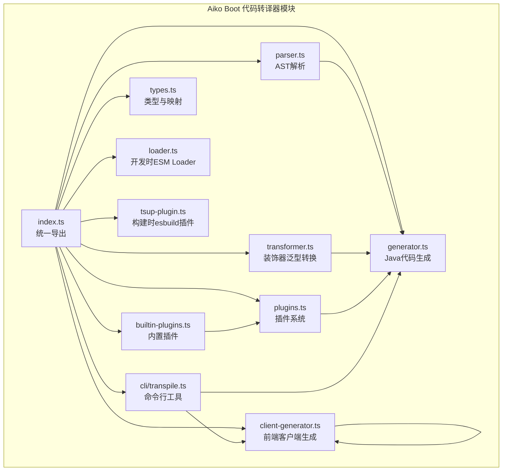
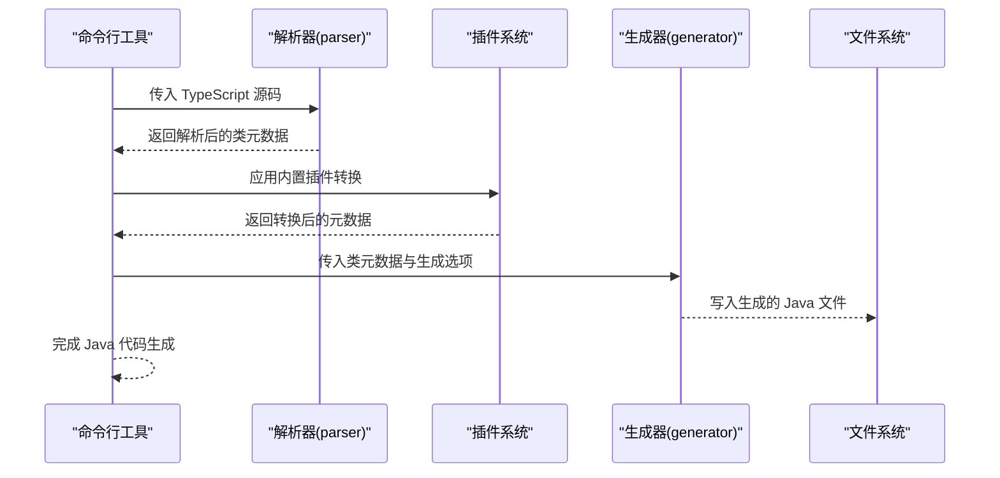
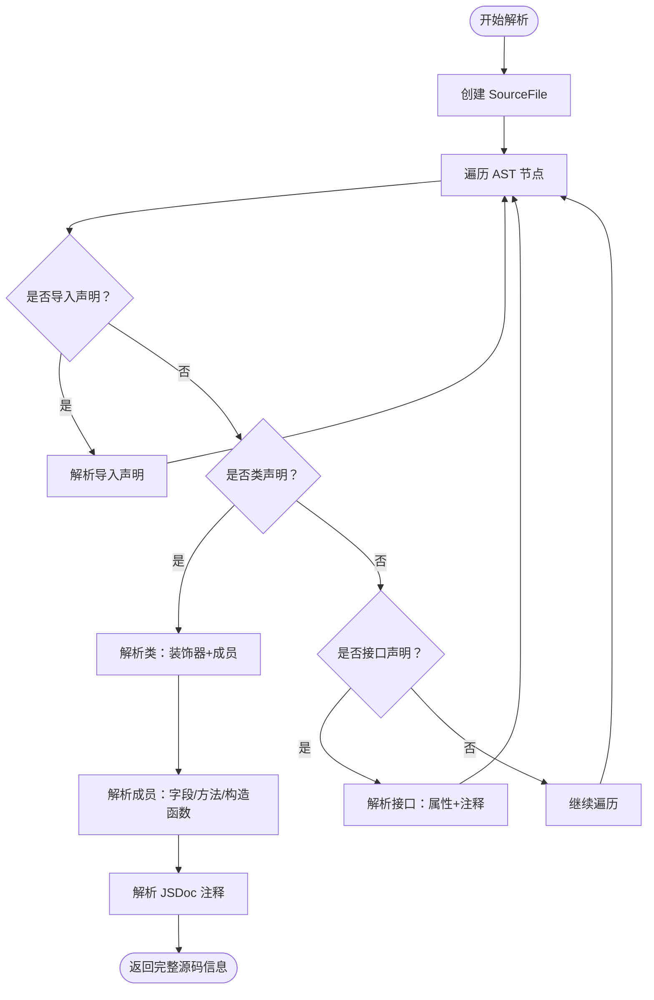
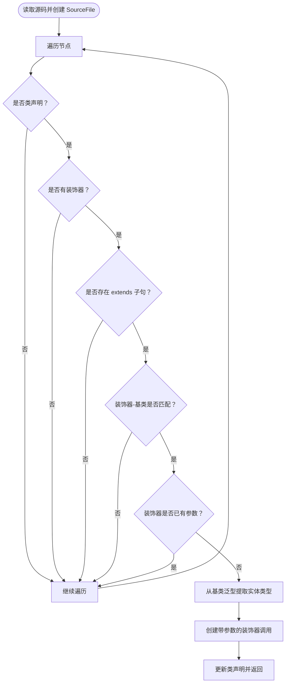
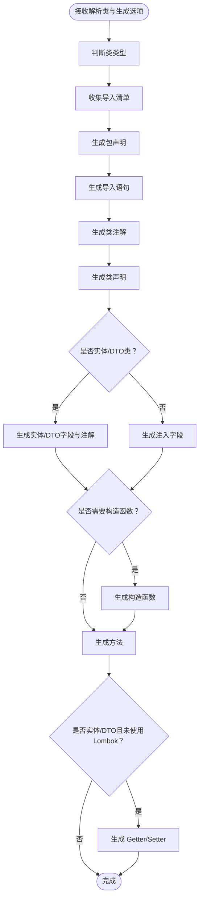
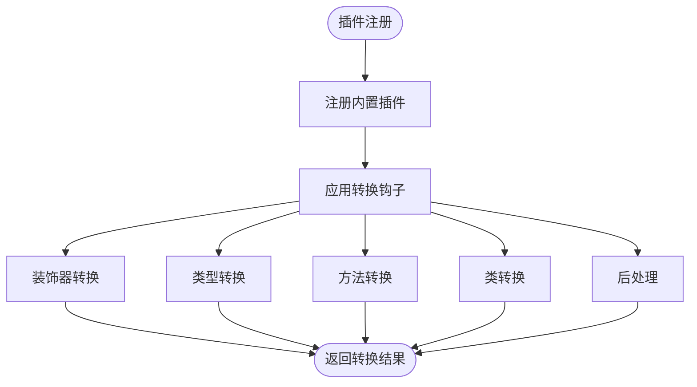
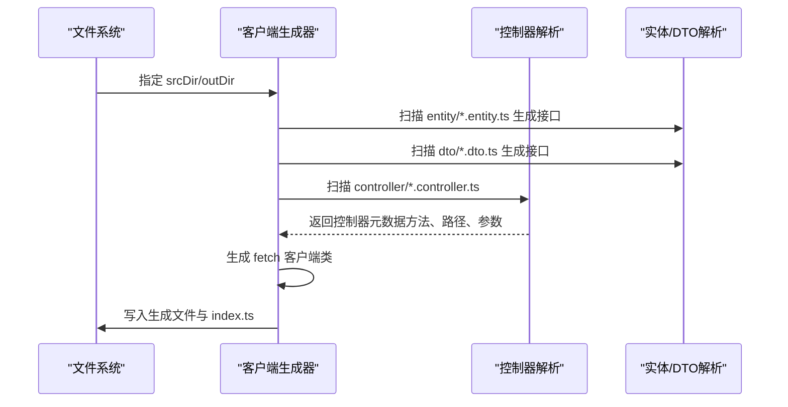
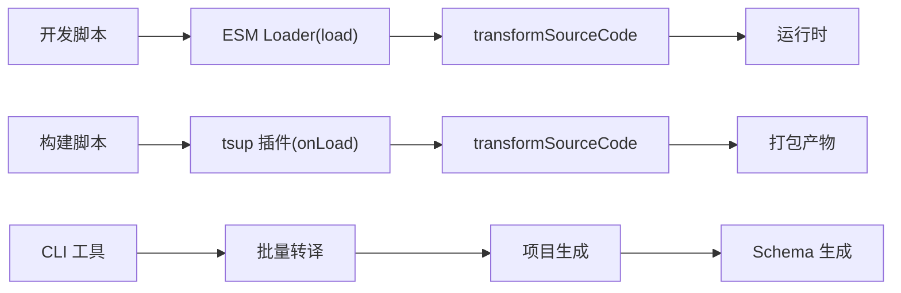
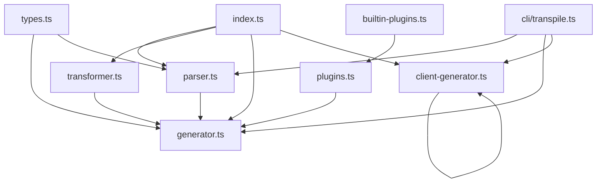

# Aiko Boot 代码转译器 - 代码生成器

<cite>
**本文档引用的文件**
- [packages/aiko-boot-codegen/src/index.ts](file://packages/aiko-boot-codegen/src/index.ts)
- [packages/aiko-boot-codegen/src/parser.ts](file://packages/aiko-boot-codegen/src/parser.ts)
- [packages/aiko-boot-codegen/src/transformer.ts](file://packages/aiko-boot-codegen/src/transformer.ts)
- [packages/aiko-boot-codegen/src/generator.ts](file://packages/aiko-boot-codegen/src/generator.ts)
- [packages/aiko-boot-codegen/src/types.ts](file://packages/aiko-boot-codegen/src/types.ts)
- [packages/aiko-boot-codegen/src/client-generator.ts](file://packages/aiko-boot-codegen/src/client-generator.ts)
- [packages/aiko-boot-codegen/src/plugins.ts](file://packages/aiko-boot-codegen/src/plugins.ts)
- [packages/aiko-boot-codegen/src/builtin-plugins.ts](file://packages/aiko-boot-codegen/src/builtin-plugins.ts)
- [packages/aiko-boot-codegen/src/cli/transpile.ts](file://packages/aiko-boot-codegen/src/cli/transpile.ts)
- [packages/aiko-boot-codegen/package.json](file://packages/aiko-boot-codegen/package.json)
- [packages/aiko-boot/src/index.ts](file://packages/aiko-boot/src/index.ts)
- [packages/aiko-boot/package.json](file://packages/aiko-boot/package.json)
</cite>

## 更新摘要
**变更内容**
- 移除了基于 @ai-first/codegen 的旧文档内容
- 新增了基于 Aiko Boot 代码转译器的全新架构文档
- 更新了包结构和模块组织方式
- 引入了插件系统和 CLI 工具
- 更新了类型映射和装饰器转换机制
- 新增了完整的 API 参考和使用示例

## 目录
1. [简介](#简介)
2. [项目结构](#项目结构)
3. [核心组件](#核心组件)
4. [架构总览](#架构总览)
5. [详细组件分析](#详细组件分析)
6. [依赖分析](#依赖分析)
7. [性能考虑](#性能考虑)
8. [故障排查指南](#故障排查指南)
9. [结论](#结论)
10. [附录](#附录)

## 简介
Aiko Boot 代码转译器是 AI-First Framework 的新一代代码生成器，负责将 TypeScript 装饰器风格的业务代码转换为 Java Spring Boot + MyBatis-Plus 代码，并同时提供前端 API 客户端生成能力。该转译器基于全新的插件架构设计，支持高度定制化的代码生成流程，通过装饰器元数据驱动实现从 TypeScript 到 Java 的高保真转换，以及从控制器到前端 API 客户端的自动化生成。

## 项目结构
Aiko Boot 代码转译器位于 packages/aiko-boot-codegen 目录下，采用模块化设计，主要包含以下核心模块：

- **parser**: TypeScript AST 解析器，提取类、装饰器、字段、方法等元数据
- **transformer**: 装饰器泛型自动填充转换器，提升开发体验
- **generator**: Java 代码生成器，基于解析结果生成 MyBatis-Plus 风格的 Java 代码
- **client-generator**: 前端 API 客户端生成器，从控制器生成 fetch 客户端
- **plugins**: 插件系统，提供可扩展的代码转换能力
- **builtin-plugins**: 内置插件集合，包含常用转换规则
- **cli**: 命令行工具，提供完整的转译和生成功能
- **types**: 类型定义与映射表
- **loader/tsup-plugin**: 开发时与构建时的自动转换插件

**图表来源**
- [packages/aiko-boot-codegen/src/index.ts](file://packages/aiko-boot-codegen/src/index.ts#L1-L57)
- [packages/aiko-boot-codegen/src/parser.ts](file://packages/aiko-boot-codegen/src/parser.ts#L1-L660)
- [packages/aiko-boot-codegen/src/transformer.ts](file://packages/aiko-boot-codegen/src/transformer.ts#L1-L217)
- [packages/aiko-boot-codegen/src/generator.ts](file://packages/aiko-boot-codegen/src/generator.ts#L1-L800)
- [packages/aiko-boot-codegen/src/client-generator.ts](file://packages/aiko-boot-codegen/src/client-generator.ts#L1-L349)
- [packages/aiko-boot-codegen/src/plugins.ts](file://packages/aiko-boot-codegen/src/plugins.ts#L1-L172)
- [packages/aiko-boot-codegen/src/builtin-plugins.ts](file://packages/aiko-boot-codegen/src/builtin-plugins.ts#L1-L190)
- [packages/aiko-boot-codegen/src/cli/transpile.ts](file://packages/aiko-boot-codegen/src/cli/transpile.ts#L1-L514)

**章节来源**
- [packages/aiko-boot-codegen/src/index.ts](file://packages/aiko-boot-codegen/src/index.ts#L1-L57)
- [packages/aiko-boot-codegen/package.json](file://packages/aiko-boot-codegen/package.json#L1-L34)

## 核心组件
- **统一导出入口**: 提供 transpile、parseSourceFile、generateJavaClass、generateApiClient、createDecoratorGenericTransformer、decoratorGenericPlugin 等 API
- **解析器**: 基于 TypeScript Compiler API，递归遍历 AST，提取类声明、装饰器、字段、方法、构造函数等信息，支持完整的 TypeScript 语法解析
- **转换器**: 在构建/开发时自动将 @Mapper() + extends BaseMapper<Entity> 转换为 @Mapper(Entity) + extends BaseMapper<Entity>
- **生成器**: 根据解析结果与配置，生成符合 MyBatis-Plus 风格的 Java 代码，支持实体、Mapper、Service、Controller、DTO 五种类型
- **前端客户端生成器**: 从控制器解析 HTTP 方法、路径、参数装饰器，生成 fetch 客户端代码及实体/DTO 接口
- **插件系统**: 提供可扩展的代码转换能力，支持装饰器转换、类型映射、方法转换、类转换等钩子
- **内置插件**: 包含 Mapper、Entity、Validation、Date、Service、Controller、QueryWrapper 等预配置插件
- **CLI 工具**: 提供完整的命令行界面，支持批量转译、项目生成、Schema 生成等功能
- **类型系统**: 提供 TypeScript 到 Java 的类型映射、装饰器映射、导入清单与生成选项

**章节来源**
- [packages/aiko-boot-codegen/src/index.ts](file://packages/aiko-boot-codegen/src/index.ts#L1-L57)
- [packages/aiko-boot-codegen/src/parser.ts](file://packages/aiko-boot-codegen/src/parser.ts#L1-L660)
- [packages/aiko-boot-codegen/src/transformer.ts](file://packages/aiko-boot-codegen/src/transformer.ts#L1-L217)
- [packages/aiko-boot-codegen/src/generator.ts](file://packages/aiko-boot-codegen/src/generator.ts#L1-L800)
- [packages/aiko-boot-codegen/src/client-generator.ts](file://packages/aiko-boot-codegen/src/client-generator.ts#L1-L349)
- [packages/aiko-boot-codegen/src/plugins.ts](file://packages/aiko-boot-codegen/src/plugins.ts#L1-L172)
- [packages/aiko-boot-codegen/src/builtin-plugins.ts](file://packages/aiko-boot-codegen/src/builtin-plugins.ts#L1-L190)
- [packages/aiko-boot-codegen/src/cli/transpile.ts](file://packages/aiko-boot-codegen/src/cli/transpile.ts#L1-L514)
- [packages/aiko-boot-codegen/src/types.ts](file://packages/aiko-boot-codegen/src/types.ts#L1-L478)

## 架构总览
整体工作流分为三条主线：
- **TypeScript 到 Java**: 解析 → 插件转换 → 生成 → 输出
- **TypeScript 到前端客户端**: 解析控制器 → 生成接口与客户端 → 输出
- **CLI 批量处理**: 命令行 → 批量解析 → 项目生成 → Schema 生成

**图表来源**
- [packages/aiko-boot-codegen/src/parser.ts](file://packages/aiko-boot-codegen/src/parser.ts#L23-L65)
- [packages/aiko-boot-codegen/src/plugins.ts](file://packages/aiko-boot-codegen/src/plugins.ts#L87-L166)
- [packages/aiko-boot-codegen/src/generator.ts](file://packages/aiko-boot-codegen/src/generator.ts#L29-L129)
- [packages/aiko-boot-codegen/src/cli/transpile.ts](file://packages/aiko-boot-codegen/src/cli/transpile.ts#L60-L307)

## 详细组件分析

### 解析器（TypeScript AST Parser）
解析器负责将 TypeScript 源码解析为结构化的元数据对象，支持完整的 TypeScript 语法：
- **类声明**: 类名、装饰器、字段、方法、构造函数、JSDoc 注释
- **接口声明**: 接口名、属性、可选属性、JSDoc 注释
- **导入声明**: 模块路径、命名导入、默认导入、命名空间导入、类型导入
- **装饰器**: 支持带参数与不带参数的装饰器调用，提取键值对参数
- **方法体**: 支持 return、throw、变量声明、if/else、for-of、表达式等多种语句类型
- **表达式**: 字面量、标识符、属性访问、方法调用、二元表达式、条件表达式等

**图表来源**
- [packages/aiko-boot-codegen/src/parser.ts](file://packages/aiko-boot-codegen/src/parser.ts#L23-L65)
- [packages/aiko-boot-codegen/src/parser.ts](file://packages/aiko-boot-codegen/src/parser.ts#L170-L192)
- [packages/aiko-boot-codegen/src/parser.ts](file://packages/aiko-boot-codegen/src/parser.ts#L197-L230)

**章节来源**
- [packages/aiko-boot-codegen/src/parser.ts](file://packages/aiko-boot-codegen/src/parser.ts#L1-L660)

### 转换器（装饰器泛型自动填充）
转换器在构建/开发时自动将 @Mapper() + extends BaseMapper<Entity> 转换为 @Mapper(Entity) + extends BaseMapper<Entity>，实现"开发时简洁，运行时保留完整类型信息"的目标。核心逻辑：
- 识别类声明与装饰器
- 检查继承链中的基类是否匹配映射表
- 若装饰器无参数且基类泛型存在，则自动注入实体类型参数
- 使用 TypeScript 编译器工厂 API 生成新的装饰器调用表达式

**图表来源**
- [packages/aiko-boot-codegen/src/transformer.ts](file://packages/aiko-boot-codegen/src/transformer.ts#L32-L130)
- [packages/aiko-boot-codegen/src/transformer.ts](file://packages/aiko-boot-codegen/src/transformer.ts#L197-L214)

**章节来源**
- [packages/aiko-boot-codegen/src/transformer.ts](file://packages/aiko-boot-codegen/src/transformer.ts#L1-L217)

### 生成器（Java 代码生成器）
生成器根据解析结果与配置生成 Java 代码，支持五种类类型：
- **实体类**: 生成 MyBatis-Plus 注解（@TableName/@TableId/@TableField），支持 Lombok 与校验注解
- **Mapper 接口**: 继承 BaseMapper<Entity>
- **Service 类**: Spring @Service，支持 @Autowired 注入与 @Transactional
- **Controller 类**: Spring @RestController + @RequestMapping，方法支持 @GetMapping/@PostMapping 等
- **DTO 类**: 纯数据传输对象，支持 Jakarta Validation 注解

关键流程：
- 判断类类型（依据装饰器）
- 收集所需导入（MyBatis-Plus、Spring、Validation、Lombok 等）
- 生成包声明与导入
- 生成类注解与声明
- 生成字段（实体/DTO）或注入字段（Service/Controller）
- 生成构造函数（Service/Controller）
- 生成方法（跳过 Mapper 接口）
- 生成 Getter/Setter（非 Lombok）

**图表来源**
- [packages/aiko-boot-codegen/src/generator.ts](file://packages/aiko-boot-codegen/src/generator.ts#L29-L129)
- [packages/aiko-boot-codegen/src/generator.ts](file://packages/aiko-boot-codegen/src/generator.ts#L233-L344)

**章节来源**
- [packages/aiko-boot-codegen/src/generator.ts](file://packages/aiko-boot-codegen/src/generator.ts#L1-L800)
- [packages/aiko-boot-codegen/src/types.ts](file://packages/aiko-boot-codegen/src/types.ts#L8-L17)

### 插件系统（Transpile Plugin System）
插件系统提供了可扩展的代码转换能力，支持多种转换钩子：
- **装饰器转换**: 修改装饰器参数或转换装饰器名称
- **类型转换**: 自定义 TypeScript 到 Java 的类型映射
- **方法转换**: 修改方法签名、注解等
- **类转换**: 进行类级别的修改
- **后处理**: 生成代码后的最终调整
- **附加生成**: 生成额外的辅助代码

**图表来源**
- [packages/aiko-boot-codegen/src/plugins.ts](file://packages/aiko-boot-codegen/src/plugins.ts#L87-L166)
- [packages/aiko-boot-codegen/src/builtin-plugins.ts](file://packages/aiko-boot-codegen/src/builtin-plugins.ts#L13-L165)

**章节来源**
- [packages/aiko-boot-codegen/src/plugins.ts](file://packages/aiko-boot-codegen/src/plugins.ts#L1-L172)
- [packages/aiko-boot-codegen/src/builtin-plugins.ts](file://packages/aiko-boot-codegen/src/builtin-plugins.ts#L1-L190)

### 内置插件（Built-in Plugins）
内置插件提供了常用的转换规则：
- **Mapper 插件**: 将 @Mapper(User) 转换为 @Mapper()（Java 使用 BaseMapper<User> 进行类型推断）
- **Entity 插件**: 将 @Entity 转换为 @TableName
- **Validation 插件**: 将 TypeScript 验证装饰器转换为 Jakarta Validation 注解
- **Date 插件**: 将 Date 类型转换为 LocalDateTime
- **Service 插件**: 处理 @Service 装饰器和依赖注入转换
- **Controller 插件**: 处理 @RestController 和请求映射转换
- **QueryWrapper 插件**: 处理 QueryWrapper/UpdateWrapper 代码转换

**章节来源**
- [packages/aiko-boot-codegen/src/builtin-plugins.ts](file://packages/aiko-boot-codegen/src/builtin-plugins.ts#L1-L190)

### 前端客户端生成器
客户端生成器从控制器源码解析 HTTP 方法、路径、参数装饰器，生成 fetch 客户端代码及实体/DTO 接口：
- **解析控制器**: 提取类名、基础路径、方法列表（HTTP 方法、路径、参数、返回类型）
- **生成实体/DTO 接口**: 从 entity/*.entity.ts 和 dto/*.dto.ts 文件生成 TypeScript 接口
- **生成控制器客户端**: 根据方法元数据生成 fetch 请求方法，自动替换路径参数
- **生成入口 index.ts**: 聚合导出所有生成的客户端

**图表来源**
- [packages/aiko-boot-codegen/src/client-generator.ts](file://packages/aiko-boot-codegen/src/client-generator.ts#L33-L147)
- [packages/aiko-boot-codegen/src/client-generator.ts](file://packages/aiko-boot-codegen/src/client-generator.ts#L249-L325)

**章节来源**
- [packages/aiko-boot-codegen/src/client-generator.ts](file://packages/aiko-boot-codegen/src/client-generator.ts#L1-L349)

### CLI 工具（命令行界面）
CLI 工具提供了完整的命令行界面，支持批量转译、项目生成、Schema 生成等功能：
- **transpile 命令**: 主要的转译命令，支持批量处理 TypeScript 文件
- **文件发现**: 支持单文件和目录模式，自动忽略测试文件和类型声明文件
- **插件集成**: 自动注册内置插件，支持自定义插件
- **项目生成**: 生成完整的 Spring Boot 项目结构，包括 pom.xml、application.yml、schema.sql
- **Schema 生成**: 基于实体信息生成数据库 Schema
- **Dry Run**: 支持预览模式，查看将要生成的代码

**章节来源**
- [packages/aiko-boot-codegen/src/cli/transpile.ts](file://packages/aiko-boot-codegen/src/cli/transpile.ts#L1-L514)

### 类型系统与映射
- **TypeScript 到 Java 类型映射**: number→Integer、string→String、boolean→Boolean、Date→LocalDateTime、数组→List<T>
- **装饰器映射**: Entity→@TableName、Mapper/Repository→@Mapper、Service→@Service、RestController→@RestController 等
- **验证注解映射**: Required→@NotNull、MinLength/MaxLength→@Size、Pattern→@Pattern
- **导入映射**: 支持模块级和命名导入映射，自动处理框架依赖
- **生成选项**: 输出目录、包名、Java 版本、Spring Boot 版本、是否启用 Lombok

**章节来源**
- [packages/aiko-boot-codegen/src/types.ts](file://packages/aiko-boot-codegen/src/types.ts#L8-L102)
- [packages/aiko-boot-codegen/src/types.ts](file://packages/aiko-boot-codegen/src/types.ts#L155-L166)

### 开发时与构建时集成
- **ESM Loader**: 在开发时拦截 .ts/.tsx 文件加载，自动进行装饰器泛型转换
- **tsup 插件**: 在构建时对匹配的 TypeScript 文件进行转换，确保最终产物包含完整类型信息
- **CLI 集成**: 命令行工具自动处理开发时和构建时的转换需求

**图表来源**
- [packages/aiko-boot-codegen/src/transformer.ts](file://packages/aiko-boot-codegen/src/transformer.ts#L197-L214)
- [packages/aiko-boot-codegen/src/cli/transpile.ts](file://packages/aiko-boot-codegen/src/cli/transpile.ts#L60-L307)

**章节来源**
- [packages/aiko-boot-codegen/src/transformer.ts](file://packages/aiko-boot-codegen/src/transformer.ts#L1-L217)
- [packages/aiko-boot-codegen/src/cli/transpile.ts](file://packages/aiko-boot-codegen/src/cli/transpile.ts#L1-L514)

## 依赖分析
- **内部依赖**: 各模块之间耦合度低，通过 index.ts 统一导出，parser 与 transformer 为 generator 提供输入，client-generator 独立运行
- **外部依赖**: TypeScript 编译器 API、Node.js 文件系统与路径模块、glob 用于文件发现
- **框架依赖**: Aiko Boot 核心框架、MyBatis-Plus、Spring Boot、Jakarta Validation
- **配置与脚本**: package.json 中提供 build/dev 脚本，支持模块化导出和 CLI 工具

**图表来源**
- [packages/aiko-boot-codegen/src/index.ts](file://packages/aiko-boot-codegen/src/index.ts#L5-L34)
- [packages/aiko-boot-codegen/src/parser.ts](file://packages/aiko-boot-codegen/src/parser.ts#L1-L10)
- [packages/aiko-boot-codegen/src/generator.ts](file://packages/aiko-boot-codegen/src/generator.ts#L5-L9)
- [packages/aiko-boot-codegen/src/types.ts](file://packages/aiko-boot-codegen/src/types.ts#L1-L10)

**章节来源**
- [packages/aiko-boot-codegen/package.json](file://packages/aiko-boot-codegen/package.json#L1-L34)

## 性能考虑
- **AST 解析**: 仅遍历一次源码，时间复杂度 O(N)，N 为节点数；避免重复解析
- **插件系统**: 插件按顺序执行，支持短路优化，减少不必要的转换开销
- **转换器**: 仅在包含特定装饰器模式时触发，减少不必要的转换开销
- **生成器**: 按需收集导入，避免重复导入；数组排序后统一输出，提升稳定性
- **CLI 批处理**: 支持并发处理多个文件，提高批量转换效率
- **内存管理**: 及时清理工具类型使用跟踪，避免内存泄漏

## 故障排查指南
- **装饰器泛型转换失败**: 检查源码中是否存在 @Mapper 与 extends BaseMapper 的组合；确认转换器的快速检查逻辑是否命中
- **生成的 Java 代码缺少注解**: 确认解析到的装饰器名称是否在映射表中，检查生成选项中的 useLombok 设置
- **插件转换异常**: 检查插件注册是否正确，确认插件钩子函数是否正确实现
- **CLI 命令执行失败**: 检查源文件路径是否正确，确认文件权限和存在性
- **前端客户端生成异常**: 检查控制器文件命名规范（*.controller.ts）、方法装饰器是否正确；确认实体/DTO 目录结构
- **类型映射不正确**: 核对 types.ts 中的 TYPE_MAPPING，必要时扩展自定义映射

**章节来源**
- [packages/aiko-boot-codegen/src/transformer.ts](file://packages/aiko-boot-codegen/src/transformer.ts#L197-L214)
- [packages/aiko-boot-codegen/src/cli/transpile.ts](file://packages/aiko-boot-codegen/src/cli/transpile.ts#L212-L216)
- [packages/aiko-boot-codegen/src/client-generator.ts](file://packages/aiko-boot-codegen/src/client-generator.ts#L256-L258)

## 结论
Aiko Boot 代码转译器通过全新的插件架构设计，实现了从 TypeScript 到 Java 的高保真转换与前端 API 客户端的自动化生成。其模块化设计、完善的类型映射、装饰器映射体系，以及强大的插件系统，使得开发者能够以最小成本获得跨语言的一致性代码与工具链支持。配合开发时与构建时的自动转换插件，以及完整的 CLI 工具链，进一步提升了开发体验与产物质量。

## 附录

### API 参考
- **transpile(sourceCode, options)**: 将 TypeScript 源码转换为 Java 映射（文件名→内容）
- **parseSourceFile(sourceCode, fileName?)**: 解析单个源码文件，返回类元数据数组
- **parseSourceFileFull(sourceCode, fileName?)**: 解析完整源码文件，返回类、接口、导入、注释信息
- **generateJavaClass(parsedClass, options)**: 生成单个 Java 类的源码
- **generateApiClient(options)**: 生成前端 API 客户端与接口文件
- **createDecoratorGenericTransformer()**: 创建装饰器泛型转换器
- **transformSourceCode(sourceCode, fileName?)**: 对源码进行装饰器泛型转换
- **decoratorGenericPlugin()**: 构建时 esbuild 插件
- **PluginRegistry**: 插件注册表，管理活跃插件
- **getBuiltinPlugins()**: 获取内置插件集合
- **CodegenOptions**: 客户端生成配置项（srcDir、outDir、silent）

**章节来源**
- [packages/aiko-boot-codegen/src/index.ts](file://packages/aiko-boot-codegen/src/index.ts#L40-L56)
- [packages/aiko-boot-codegen/src/client-generator.ts](file://packages/aiko-boot-codegen/src/client-generator.ts#L239-L243)
- [packages/aiko-boot-codegen/src/plugins.ts](file://packages/aiko-boot-codegen/src/plugins.ts#L87-L172)

### 使用示例
- **TypeScript 到 Java**: 调用 transpile，传入源码与生成选项，获取 Map<文件名, Java 源码>
- **装饰器泛型自动填充**: 在开发脚本中引入 ESM Loader 或在构建脚本中使用 tsup 插件
- **前端客户端生成**: 调用 generateApiClient，指定 srcDir 与 outDir，生成实体/DTO 接口与控制器客户端
- **CLI 批量转译**: 使用 aiko-codegen transpile 命令，支持批量处理 TypeScript 文件
- **自定义插件**: 通过 PluginRegistry 注册自定义插件，实现特定的代码转换需求

**章节来源**
- [packages/aiko-boot-codegen/src/index.ts](file://packages/aiko-boot-codegen/src/index.ts#L40-L56)
- [packages/aiko-boot-codegen/src/transformer.ts](file://packages/aiko-boot-codegen/src/transformer.ts#L32-L130)
- [packages/aiko-boot-codegen/src/client-generator.ts](file://packages/aiko-boot-codegen/src/client-generator.ts#L249-L325)
- [packages/aiko-boot-codegen/src/cli/transpile.ts](file://packages/aiko-boot-codegen/src/cli/transpile.ts#L60-L307)

### 示例项目参考
- **实体类**: @Entity + @TableId/@TableField
- **Mapper**: @Mapper(Entity) + extends BaseMapper<Entity>
- **Service**: @Service + @Autowired 注入 + @Transactional
- **Controller**: @RestController + @RequestMapping + @GetMapping/@PostMapping
- **DTO**: 纯数据传输对象，支持 Jakarta Validation 注解

**章节来源**
- [packages/aiko-boot/src/index.ts](file://packages/aiko-boot/src/index.ts#L1-L200)
- [packages/aiko-boot/package.json](file://packages/aiko-boot/package.json#L1-L61)