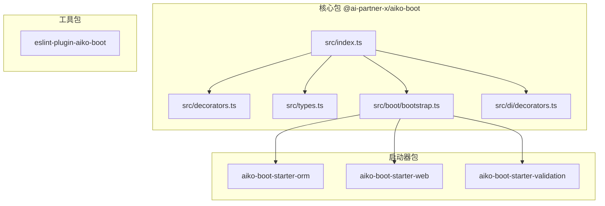
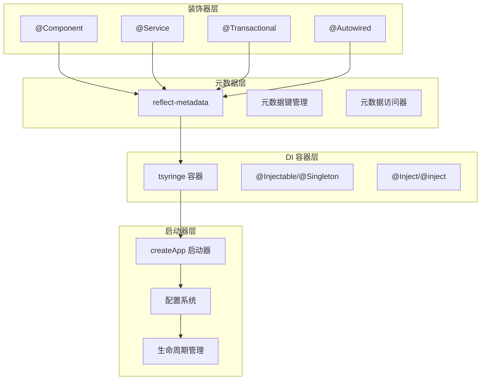
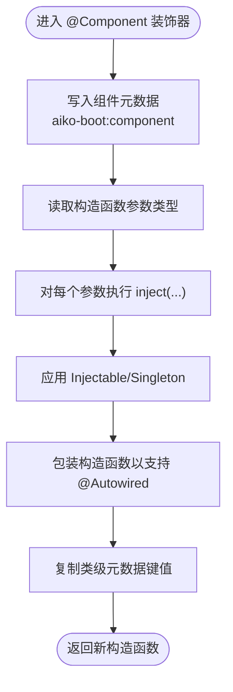
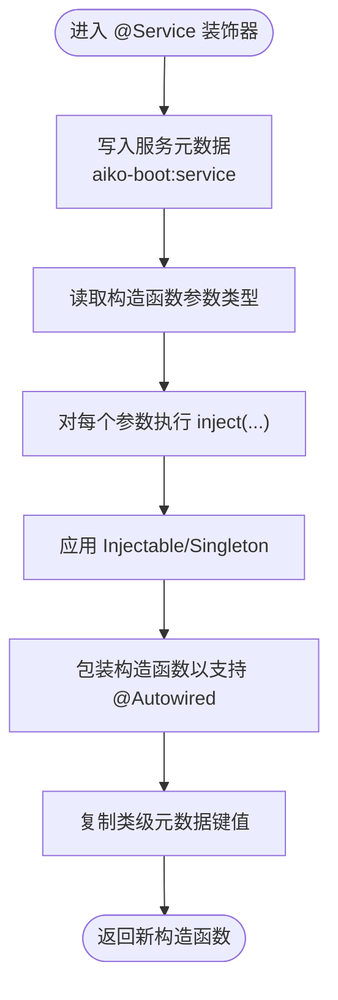
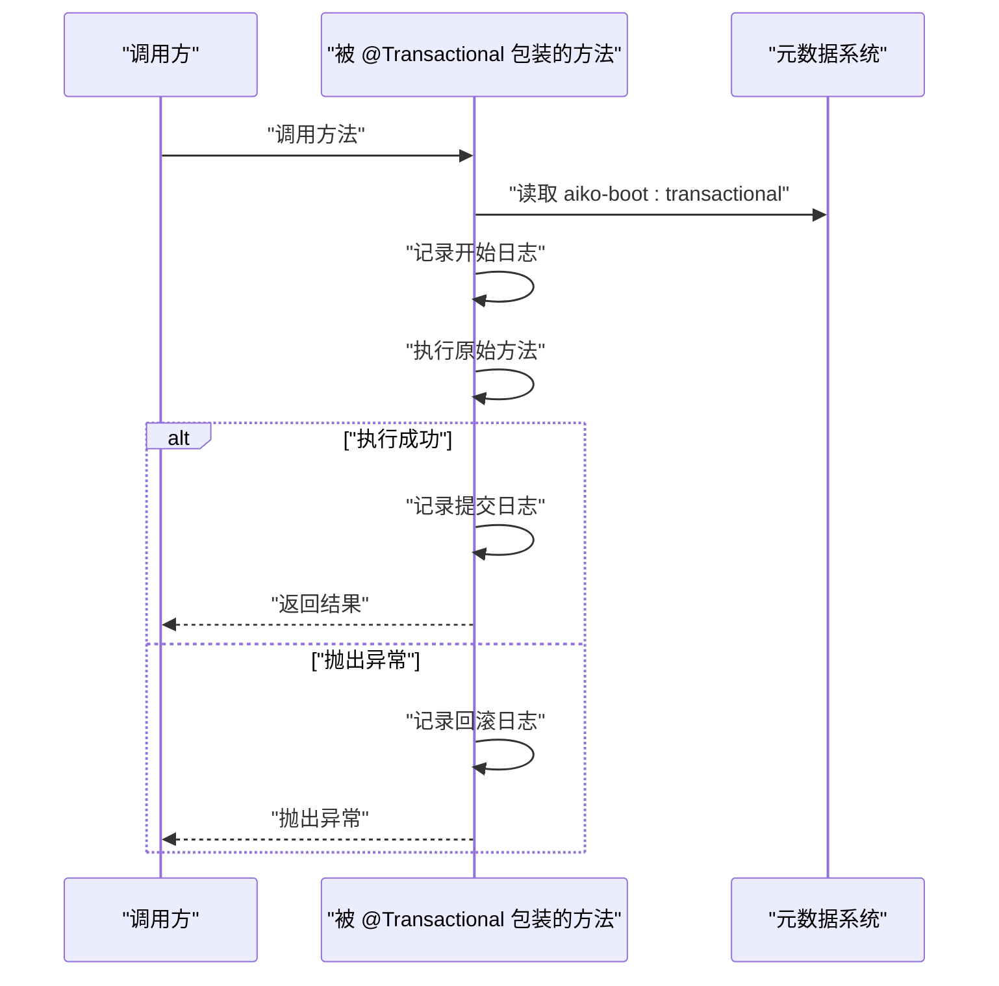
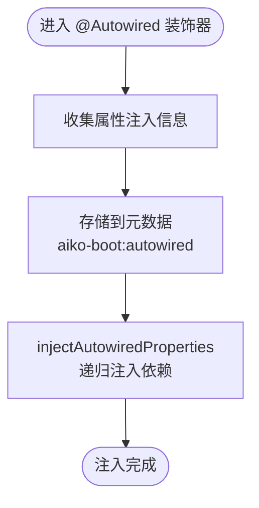
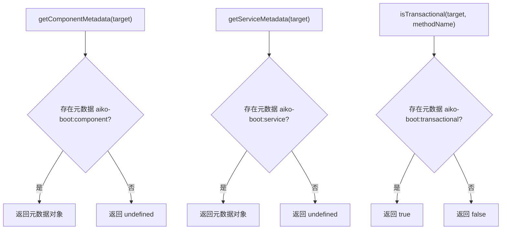
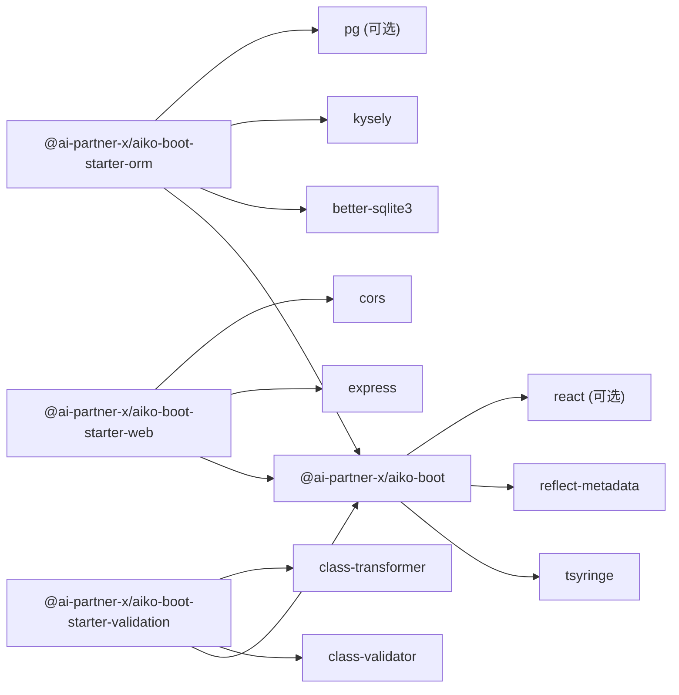

# Aiko Boot - 核心装饰器系统

<cite>
**本文档引用的文件**
- [packages/aiko-boot/src/decorators.ts](file://packages/aiko-boot/src/decorators.ts)
- [packages/aiko-boot/src/index.ts](file://packages/aiko-boot/src/index.ts)
- [packages/aiko-boot/src/types.ts](file://packages/aiko-boot/src/types.ts)
- [packages/aiko-boot/src/di/decorators.ts](file://packages/aiko-boot/src/di/decorators.ts)
- [packages/aiko-boot/src/boot/bootstrap.ts](file://packages/aiko-boot/src/boot/bootstrap.ts)
- [packages/aiko-boot/README.md](file://packages/aiko-boot/README.md)
- [packages/aiko-boot/package.json](file://packages/aiko-boot/package.json)
- [packages/aiko-boot-starter-orm/package.json](file://packages/aiko-boot-starter-orm/package.json)
- [packages/aiko-boot-starter-web/package.json](file://packages/aiko-boot-starter-web/package.json)
- [packages/aiko-boot-starter-validation/package.json](file://packages/aiko-boot-starter-validation/package.json)
</cite>

## 更新摘要
**所做更改**
- 更新包名为 @ai-partner-x/aiko-boot，反映从 @ai-first/core 的迁移
- 重新组织装饰器系统架构，整合到新的 Aiko Boot 框架中
- 更新依赖关系，移除 @ai-first/di 依赖，直接使用 tsyringe
- 扩展装饰器功能，增加更多领域层装饰器支持
- 更新项目结构和模块导出方式

## 目录
1. [简介](#简介)
2. [项目结构](#项目结构)
3. [核心组件](#核心组件)
4. [架构总览](#架构总览)
5. [详细组件分析](#详细组件分析)
6. [依赖关系分析](#依赖关系分析)
7. [性能考量](#性能考量)
8. [故障排除指南](#故障排除指南)
9. [结论](#结论)
10. [附录：API 参考](#附录api-参考)

## 简介
Aiko Boot 是一个现代化的 TypeScript 框架，提供 Spring Boot 风格的依赖注入和自动配置能力。核心装饰器系统是框架的基础，为领域驱动设计（DDD）提供了一套完整、可扩展的装饰器解决方案。

**重要变更**：@ai-first/core 包已被完全移除并整合到新的 @ai-partner-x/aiko-boot 框架中，提供更强大的功能和更好的架构设计。

- 支持的装饰器类别：
  - 组件层：@Component、@Service、@Repository、@AppService
  - 方法层：@Transactional、@Action、@Expose
  - 实体层：@Entity、@Field、@DbField、@Validation
  - 属性注入：@Autowired、@Inject
- 元数据访问器：
  - getComponentMetadata
  - getServiceMetadata
  - isTransactional
- 核心特性：
  - Spring Boot 风格的启动器和配置系统
  - 自动配置和条件注解
  - 生命周期事件管理
  - HTTP 服务器集成

**章节来源**
- [packages/aiko-boot/README.md](file://packages/aiko-boot/README.md#L1-L69)
- [packages/aiko-boot/src/decorators.ts](file://packages/aiko-boot/src/decorators.ts#L1-L158)
- [packages/aiko-boot/src/index.ts](file://packages/aiko-boot/src/index.ts#L1-L64)

## 项目结构
新的 Aiko Boot 框架采用模块化设计，将核心功能拆分为多个包：

- **@ai-partner-x/aiko-boot**：核心包，包含装饰器系统、DI 容器、启动器
- **@ai-partner-x/aiko-boot-starter-orm**：ORM 启动器，提供数据库访问能力
- **@ai-partner-x/aiko-boot-starter-web**：Web 启动器，提供 HTTP 服务器和路由
- **@ai-partner-x/aiko-boot-starter-validation**：验证启动器，提供数据验证能力
- **eslint-plugin-aiko-boot**：ESLint 插件，提供代码规范检查

**图表来源**
- [packages/aiko-boot/src/index.ts](file://packages/aiko-boot/src/index.ts#L1-L64)
- [packages/aiko-boot/src/decorators.ts](file://packages/aiko-boot/src/decorators.ts#L1-L158)
- [packages/aiko-boot/src/boot/bootstrap.ts](file://packages/aiko-boot/src/boot/bootstrap.ts#L1-L354)
- [packages/aiko-boot-starter-orm/package.json](file://packages/aiko-boot-starter-orm/package.json#L1-L55)
- [packages/aiko-boot-starter-web/package.json](file://packages/aiko-boot-starter-web/package.json#L1-L60)
- [packages/aiko-boot-starter-validation/package.json](file://packages/aiko-boot-starter-validation/package.json#L1-L41)

**章节来源**
- [packages/aiko-boot/src/index.ts](file://packages/aiko-boot/src/index.ts#L1-L64)
- [packages/aiko-boot/src/decorators.ts](file://packages/aiko-boot/src/decorators.ts#L1-L158)
- [packages/aiko-boot/src/types.ts](file://packages/aiko-boot/src/types.ts#L1-L14)
- [packages/aiko-boot/src/boot/bootstrap.ts](file://packages/aiko-boot/src/boot/bootstrap.ts#L1-L354)

## 核心组件
Aiko Boot 的装饰器系统经过重新设计，提供更完整的领域建模能力：

### 核心装饰器
- **@Component**：通用组件装饰器，支持构造函数注入和属性注入
- **@Service**：领域服务装饰器，语义上更偏向业务逻辑
- **@Repository**：数据访问层装饰器，专门用于持久化操作
- **@AppService**：应用服务装饰器，用于协调多个领域服务

### 方法装饰器
- **@Transactional**：事务性方法装饰器，确保数据一致性
- **@Action**：业务动作装饰器，标记可执行的操作
- **@Expose**：暴露接口装饰器，定义 REST API 路径

### 实体装饰器
- **@Entity**：实体类装饰器，定义数据库表映射
- **@Field**：字段装饰器，定义 UI 显示属性
- **@DbField**：数据库字段装饰器，定义数据库列属性
- **@Validation**：验证装饰器，提供数据验证规则

### 属性注入装饰器
- **@Autowired**：Spring 风格的属性注入装饰器
- **@Inject**：依赖注入装饰器，支持类型安全的注入

**章节来源**
- [packages/aiko-boot/src/decorators.ts](file://packages/aiko-boot/src/decorators.ts#L18-L158)
- [packages/aiko-boot/src/types.ts](file://packages/aiko-boot/src/types.ts#L8-L13)
- [packages/aiko-boot/src/di/decorators.ts](file://packages/aiko-boot/src/di/decorators.ts#L30-L110)

## 架构总览
Aiko Boot 的装饰器体系建立在以下关键架构之上：

### 核心架构
- **装饰器层**：提供领域建模的装饰器 API
- **元数据层**：基于 reflect-metadata 的元数据管理系统
- **DI 容器层**：基于 tsyringe 的依赖注入容器
- **启动器层**：提供 Spring Boot 风格的应用启动能力

### 模块化设计
- **核心模块**：装饰器定义和元数据管理
- **DI 模块**：依赖注入和属性注入
- **启动模块**：应用启动和配置管理
- **扩展模块**：ORM、Web、验证等启动器

**图表来源**
- [packages/aiko-boot/src/decorators.ts](file://packages/aiko-boot/src/decorators.ts#L9-L16)
- [packages/aiko-boot/src/di/decorators.ts](file://packages/aiko-boot/src/di/decorators.ts#L4-L13)
- [packages/aiko-boot/src/boot/bootstrap.ts](file://packages/aiko-boot/src/boot/bootstrap.ts#L21-L29)

**章节来源**
- [packages/aiko-boot/src/decorators.ts](file://packages/aiko-boot/src/decorators.ts#L1-L158)
- [packages/aiko-boot/src/di/decorators.ts](file://packages/aiko-boot/src/di/decorators.ts#L1-L110)
- [packages/aiko-boot/src/boot/bootstrap.ts](file://packages/aiko-boot/src/boot/bootstrap.ts#L1-L354)

## 详细组件分析

### @Component 装饰器
**更新**：@Component 装饰器现在使用新的命名空间 `aiko-boot:component`

- **功能要点**
  - 在类上写入组件元数据（名称默认取类名）
  - 自动进行构造函数参数注入（基于 design:paramtypes）
  - 应用 Injectable 与 Singleton 装饰器
  - 包装构造函数，使 @Autowired 属性注入生效
  - 复制原有类的所有元数据键值，确保反射可见性一致
- **元数据键**
  - `aiko-boot:component`：存储组件名称等信息
- **适用场景**
  - 工具类、基础设施组件、第三方适配器等

**图表来源**
- [packages/aiko-boot/src/decorators.ts](file://packages/aiko-boot/src/decorators.ts#L30-L66)

**章节来源**
- [packages/aiko-boot/src/decorators.ts](file://packages/aiko-boot/src/decorators.ts#L18-L66)

### @Service 装饰器
**更新**：@Service 装饰器现在使用新的命名空间 `aiko-boot:service`

- **功能要点**
  - 在类上写入服务元数据（名称默认取类名）
  - 自动进行构造函数参数注入
  - 应用 Injectable 与 Singleton 装饰器
  - 包装构造函数，使 @Autowired 属性注入生效
  - 复制类级元数据
- **元数据键**
  - `aiko-boot:service`：存储服务名称与描述等
- **适用场景**
  - 领域服务、应用服务、业务逻辑封装

**图表来源**
- [packages/aiko-boot/src/decorators.ts](file://packages/aiko-boot/src/decorators.ts#L81-L118)

**章节来源**
- [packages/aiko-boot/src/decorators.ts](file://packages/aiko-boot/src/decorators.ts#L68-L118)
- [packages/aiko-boot/src/types.ts](file://packages/aiko-boot/src/types.ts#L8-L13)

### @Transactional 方法装饰器
**更新**：@Transactional 装饰器现在使用新的命名空间 `aiko-boot:transactional`

- **功能要点**
  - 在方法上写入事务元数据（aiko-boot:transactional）
  - 包装方法体：在调用前后输出日志（开始/提交/回滚）
  - 保持原方法的返回值与异常传播
  - 支持异步方法的事务管理
- **元数据键**
  - `aiko-boot:transactional`：布尔值标识方法是否事务性
- **适用场景**
  - 数据一致性要求高的业务操作（如批量写入、跨表更新）

**图表来源**
- [packages/aiko-boot/src/decorators.ts](file://packages/aiko-boot/src/decorators.ts#L125-L143)

**章节来源**
- [packages/aiko-boot/src/decorators.ts](file://packages/aiko-boot/src/decorators.ts#L120-L143)

### @Autowired 属性注入装饰器
**新增**：全新的属性注入装饰器系统

- **功能要点**
  - 支持类型安全的属性注入
  - 自动收集 @Autowired 属性信息
  - 递归注入依赖链
  - 支持可选依赖注入
- **元数据键**
  - `aiko-boot:autowired`：存储属性注入信息数组
- **适用场景**
  - 依赖注入的属性字段
  - 复杂对象的依赖关系管理

**图表来源**
- [packages/aiko-boot/src/di/decorators.ts](file://packages/aiko-boot/src/di/decorators.ts#L42-L84)

**章节来源**
- [packages/aiko-boot/src/di/decorators.ts](file://packages/aiko-boot/src/di/decorators.ts#L30-L110)

### 元数据访问器
**更新**：元数据访问器现在使用新的命名空间

- **getComponentMetadata(target)**
  - 返回值：包含名称等的组件元数据对象，未设置时返回 undefined
- **getServiceMetadata(target)**
  - 返回值：包含名称、描述等的服务元数据对象，未设置时返回 undefined
- **isTransactional(target, methodName)**
  - 返回值：布尔值，表示方法是否标记为事务性

**图表来源**
- [packages/aiko-boot/src/decorators.ts](file://packages/aiko-boot/src/decorators.ts#L147-L157)

**章节来源**
- [packages/aiko-boot/src/decorators.ts](file://packages/aiko-boot/src/decorators.ts#L145-L158)

## 依赖关系分析
**更新**：依赖关系已完全重构

### 核心依赖
- **@ai-partner-x/aiko-boot** 依赖
  - tsyringe：IoC 容器实现
  - reflect-metadata：元数据支持
  - react：可选的 React 支持

### 启动器依赖
- **@ai-partner-x/aiko-boot-starter-orm** 依赖
  - @ai-partner-x/aiko-boot：核心框架
  - better-sqlite3：SQLite 支持
  - kysely：查询构建器
  - pg：PostgreSQL 支持

- **@ai-partner-x/aiko-boot-starter-web** 依赖
  - @ai-partner-x/aiko-boot：核心框架
  - express：HTTP 服务器
  - cors：跨域支持

- **@ai-partner-x/aiko-boot-starter-validation** 依赖
  - @ai-partner-x/aiko-boot：核心框架
  - class-validator：验证库
  - class-transformer：转换库

**图表来源**
- [packages/aiko-boot/package.json](file://packages/aiko-boot/package.json#L35-L49)
- [packages/aiko-boot-starter-orm/package.json](file://packages/aiko-boot-starter-orm/package.json#L24-L38)
- [packages/aiko-boot-starter-web/package.json](file://packages/aiko-boot-starter-web/package.json#L32-L45)
- [packages/aiko-boot-starter-validation/package.json](file://packages/aiko-boot-starter-validation/package.json#L21-L26)

**章节来源**
- [packages/aiko-boot/package.json](file://packages/aiko-boot/package.json#L1-L61)
- [packages/aiko-boot-starter-orm/package.json](file://packages/aiko-boot-starter-orm/package.json#L1-L55)
- [packages/aiko-boot-starter-web/package.json](file://packages/aiko-boot-starter-web/package.json#L1-L60)
- [packages/aiko-boot-starter-validation/package.json](file://packages/aiko-boot-starter-validation/package.json#L1-L41)

## 性能考量
**更新**：性能优化和最佳实践

### 元数据性能
- **元数据键命名**：使用字符串而非 Symbol，提高跨模块共享性能
- **元数据缓存**：反射元数据在运行时缓存，避免重复读取
- **条件注入**：@Autowired 支持可选依赖，减少注入失败的开销

### DI 容器优化
- **单例模式**：默认使用 Singleton，减少实例化开销
- **构造函数注入**：优先使用构造函数注入，性能优于属性注入
- **延迟初始化**：支持延迟注册，按需初始化依赖

### 启动性能
- **模块扫描**：智能文件扫描，过滤测试和声明文件
- **并行加载**：组件模块并行加载，提高启动速度
- **配置缓存**：配置文件缓存，避免重复解析

### 事务性能
- **异步事务**：支持 async/await 的事务管理
- **日志优化**：生产环境可配置事务日志级别
- **连接池**：ORM 启动器集成连接池管理

## 故障排除指南
**更新**：针对新架构的故障排除

### 装饰器相关问题
- **装饰器未生效**
  - 症状：@Component、@Service 等装饰器不工作
  - 排查：确认已导入正确的包名 `@ai-partner-x/aiko-boot`
  - 解决：检查装饰器导入路径和命名空间

- **元数据读取失败**
  - 症状：getComponentMetadata/getServiceMetadata 返回 undefined
  - 排查：确认装饰器在编译前已执行，检查元数据键命名
  - 解决：确保使用正确的元数据访问器函数

### DI 容器问题
- **依赖注入失败**
  - 症状：@Autowired 注入失败，属性为 undefined
  - 排查：确认目标类型已在容器中注册，检查循环依赖
  - 解决：使用 @Inject 显式指定依赖类型

- **构造函数注入无效**
  - 症状：构造函数参数未注入
  - 排查：确保已启用 reflect-metadata，检查设计类型元数据
  - 解决：确认装饰器正确应用且编译配置正确

### 启动器问题
- **应用启动失败**
  - 症状：createApp 抛出异常
  - 排查：检查配置文件路径，确认扫描目录存在
  - 解决：验证 srcDir 和 scanDirs 配置

- **HTTP 服务器未启动**
  - 症状：调用 run() 无响应
  - 排查：确认已安装 aiko-boot-starter-web，检查端口占用
  - 解决：安装 Web 启动器并配置服务器端口

**章节来源**
- [packages/aiko-boot/src/decorators.ts](file://packages/aiko-boot/src/decorators.ts#L125-L143)
- [packages/aiko-boot/src/di/decorators.ts](file://packages/aiko-boot/src/di/decorators.ts#L67-L84)
- [packages/aiko-boot/src/boot/bootstrap.ts](file://packages/aiko-boot/src/boot/bootstrap.ts#L238-L242)

## 结论
Aiko Boot 通过重新设计的装饰器系统，为现代 TypeScript 应用提供了完整的领域建模和依赖注入能力。相比之前的 @ai-first/core，新架构具有以下优势：

### 主要改进
- **模块化设计**：清晰的包分离和职责划分
- **增强功能**：支持更多领域层装饰器和属性注入
- **性能优化**：改进的元数据管理和 DI 容器性能
- **生态完善**：配套的启动器和工具链

### 最佳实践
- 使用 @Service 装饰器标记领域服务
- 通过 @Autowired 实现属性注入
- 使用 @Transactional 确保数据一致性
- 利用启动器包扩展功能
- 遵循 Spring Boot 风格的配置约定

遵循本文档的指导和最佳实践，开发者可以充分利用 Aiko Boot 的装饰器系统，构建高质量、可维护的企业级应用。

## 附录：API 参考

### 核心装饰器

#### @Component(options?)
- **参数**
  - `options.name?`: 字符串，组件名称，默认取类名
- **返回**
  - 装饰器函数，返回重定义后的构造函数
- **元数据**
  - 写入 `aiko-boot:component`
- **依赖**
  - Injectable、Singleton、inject、injectAutowiredProperties
- **示例**
  - [packages/aiko-boot/src/decorators.ts](file://packages/aiko-boot/src/decorators.ts#L24-L28)

#### @Service(options?)
- **参数**
  - `options.name?`: 字符串，服务名称，默认取类名
  - `options.description?`: 字符串，服务描述
- **返回**
  - 装饰器函数，返回重定义后的构造函数
- **元数据**
  - 写入 `aiko-boot:service`
- **依赖**
  - Injectable、Singleton、inject、injectAutowiredProperties
- **示例**
  - [packages/aiko-boot/src/decorators.ts](file://packages/aiko-boot/src/decorators.ts#L74-L80)

#### @Transactional()
- **参数**
  - 无
- **返回**
  - 方法装饰器，返回修改后的 PropertyDescriptor
- **元数据**
  - 在方法上写入 `aiko-boot:transactional`
- **行为**
  - 包装方法体，输出事务日志，保持返回值与异常传播
- **示例**
  - [packages/aiko-boot/src/decorators.ts](file://packages/aiko-boot/src/decorators.ts#L122-L143)

### 属性注入装饰器

#### @Autowired(type?)
- **参数**
  - `type?`: Function，要注入的类型（可选）
- **返回**
  - 属性装饰器，无返回值
- **元数据**
  - 写入 `aiko-boot:autowired`
- **行为**
  - 收集属性注入信息，支持递归注入依赖
- **示例**
  - [packages/aiko-boot/src/di/decorators.ts](file://packages/aiko-boot/src/di/decorators.ts#L36-L41)

#### @Inject(token?)
- **参数**
  - `token?`: any，注入令牌
- **返回**
  - 参数装饰器，无返回值
- **行为**
  - 标记构造函数参数为注入目标
- **示例**
  - [packages/aiko-boot/src/di/decorators.ts](file://packages/aiko-boot/src/di/decorators.ts#L17-L18)

### 元数据访问器

#### getComponentMetadata(target)
- **参数**
  - `target`: 类构造函数或实例构造函数
- **返回**
  - `{ name?: string } | undefined`
- **用途**
  - 读取组件元数据

#### getServiceMetadata(target)
- **参数**
  - `target`: 类构造函数或实例构造函数
- **返回**
  - `ServiceOptions | undefined`
- **用途**
  - 读取服务元数据

#### isTransactional(target, methodName)
- **参数**
  - `target`: 类构造函数或实例构造函数
  - `methodName`: 字符串，方法名
- **返回**
  - `boolean`
- **用途**
  - 判断方法是否标记为事务性

### 启动器 API

#### createApp(options)
- **参数**
  - `options`: AppOptions，应用启动选项
- **返回**
  - `Promise<ApplicationContext>`
- **行为**
  - 创建并启动应用上下文
- **示例**
  - [packages/aiko-boot/src/boot/bootstrap.ts](file://packages/aiko-boot/src/boot/bootstrap.ts#L126-L131)

#### ServiceOptions
- **属性**
  - `name?`: 字符串，服务名称
  - `description?`: 字符串，服务描述

**章节来源**
- [packages/aiko-boot/src/decorators.ts](file://packages/aiko-boot/src/decorators.ts#L18-L158)
- [packages/aiko-boot/src/di/decorators.ts](file://packages/aiko-boot/src/di/decorators.ts#L15-L110)
- [packages/aiko-boot/src/types.ts](file://packages/aiko-boot/src/types.ts#L8-L13)
- [packages/aiko-boot/src/index.ts](file://packages/aiko-boot/src/index.ts#L29-L64)
- [packages/aiko-boot/src/boot/bootstrap.ts](file://packages/aiko-boot/src/boot/bootstrap.ts#L132-L289)
- [packages/aiko-boot/README.md](file://packages/aiko-boot/README.md#L18-L64)