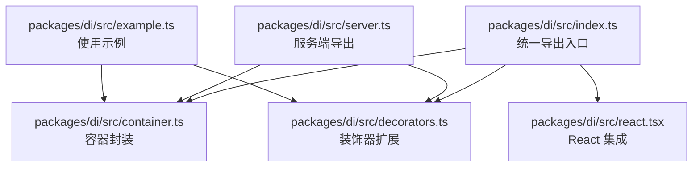
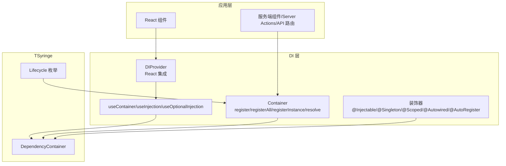
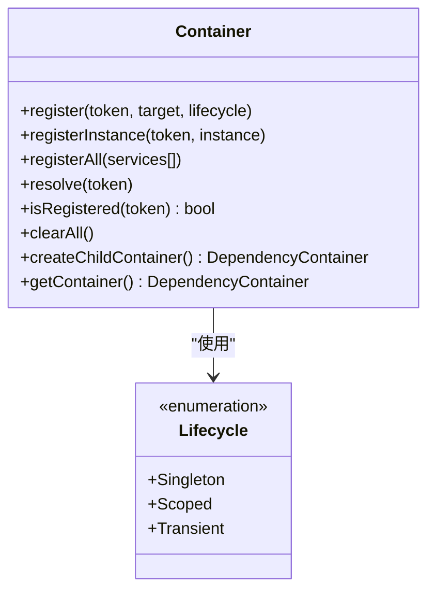
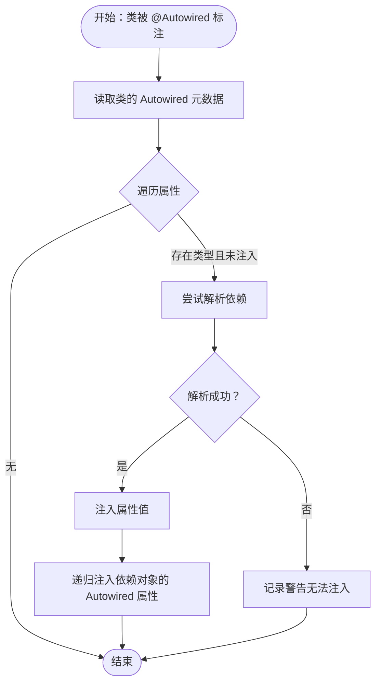
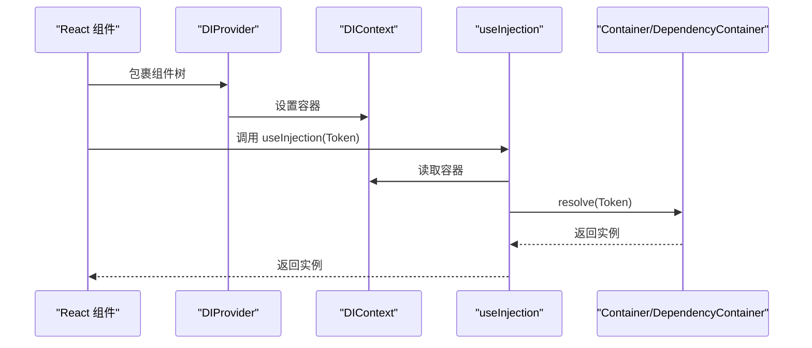
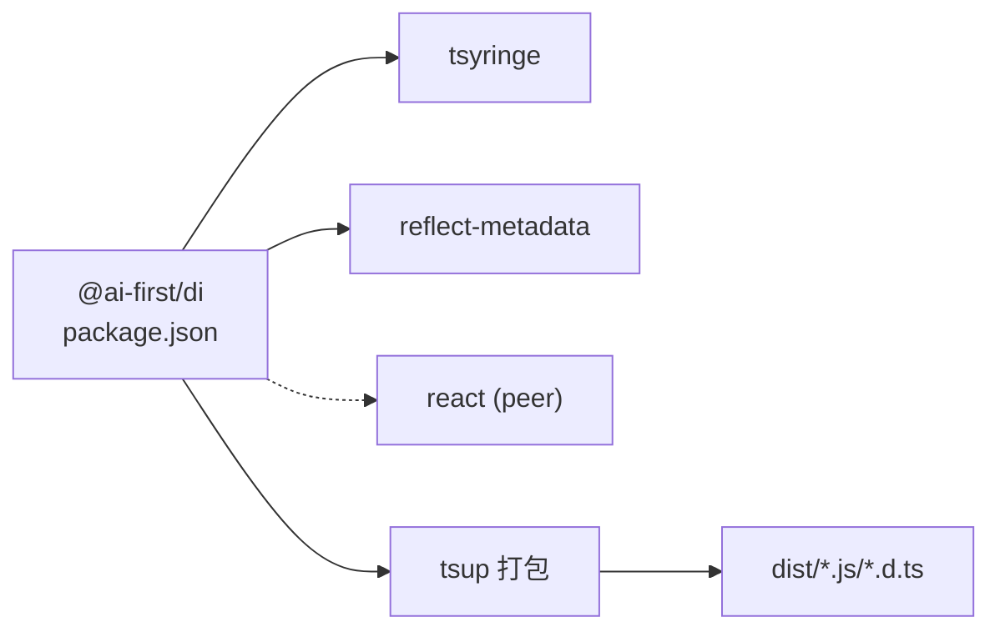

# @ai-first/di - 依赖注入容器

<cite>
**本文引用的文件**
- [packages/di/src/index.ts](file://packages/di/src/index.ts)
- [packages/di/src/container.ts](file://packages/di/src/container.ts)
- [packages/di/src/decorators.ts](file://packages/di/src/decorators.ts)
- [packages/di/src/react.tsx](file://packages/di/src/react.tsx)
- [packages/di/src/server.ts](file://packages/di/src/server.ts)
- [packages/di/src/example.ts](file://packages/di/src/example.ts)
- [packages/di/package.json](file://packages/di/package.json)
- [packages/di/tsconfig.json](file://packages/di/tsconfig.json)
- [packages/di/tsup.config.ts](file://packages/di/tsup.config.ts)
- [README.md](file://README.md)
</cite>

## 目录
1. [简介](#简介)
2. [项目结构](#项目结构)
3. [核心组件](#核心组件)
4. [架构总览](#架构总览)
5. [详细组件分析](#详细组件分析)
6. [依赖关系分析](#依赖关系分析)
7. [性能考虑](#性能考虑)
8. [故障排查指南](#故障排查指南)
9. [结论](#结论)
10. [附录](#附录)

## 简介
@ai-first/di 是一个基于 TSyringe 的依赖注入（DI）容器，提供简洁易用的装饰器与容器封装，支持生命周期管理与作用域控制，并提供了 React 集成与服务端专用导出。该包旨在让开发者以声明式的方式组织依赖关系，降低耦合度，提升可测试性与可维护性。

## 项目结构
该包位于 monorepo 的 packages/di 目录下，采用按功能模块划分的目录结构：
- src/index.ts：对外统一导出入口
- src/container.ts：容器封装与生命周期注册
- src/decorators.ts：装饰器扩展（含 @Autowired、@AutoRegister 等）
- src/react.tsx：React 集成（Provider 与 Hooks）
- src/server.ts：服务端专用导出（无 React 依赖）
- src/example.ts：使用示例
- tsup.config.ts：打包配置（双入口：index 与 server）
- package.json：包元信息与导出映射

图表来源
- [packages/di/src/index.ts](file://packages/di/src/index.ts#L1-L34)
- [packages/di/src/container.ts](file://packages/di/src/container.ts#L1-L105)
- [packages/di/src/decorators.ts](file://packages/di/src/decorators.ts#L1-L110)
- [packages/di/src/react.tsx](file://packages/di/src/react.tsx#L1-L59)
- [packages/di/src/server.ts](file://packages/di/src/server.ts#L1-L26)
- [packages/di/src/example.ts](file://packages/di/src/example.ts#L1-L68)

章节来源
- [packages/di/src/index.ts](file://packages/di/src/index.ts#L1-L34)
- [packages/di/tsup.config.ts](file://packages/di/tsup.config.ts#L1-L12)
- [packages/di/package.json](file://packages/di/package.json#L1-L53)

## 核心组件
- 容器封装（Container）：对 TSyringe 的轻量封装，提供 register/registerAll/registerInstance/resolve/isRegistered/clearAll/createChildContainer/getContainer 等能力，并通过枚举 Lifecycle 统一生命周期语义。
- 装饰器扩展（Decorators）：在 re-export TSyringe 原生装饰器的基础上，新增 @Autowired（属性注入）、@AutoRegister（自动注册），并提供辅助函数用于批量注入与获取元数据。
- React 集成（React）：提供 DIProvider、useContainer、useInjection、useOptionalInjection 等 API，便于在 React 组件树中注入依赖。
- 服务端导出（Server）：提供仅包含容器与装饰器的导出，避免引入 React 依赖，适用于服务端组件、Server Actions、API Routes 等场景。

章节来源
- [packages/di/src/container.ts](file://packages/di/src/container.ts#L1-L105)
- [packages/di/src/decorators.ts](file://packages/di/src/decorators.ts#L1-L110)
- [packages/di/src/react.tsx](file://packages/di/src/react.tsx#L1-L59)
- [packages/di/src/server.ts](file://packages/di/src/server.ts#L1-L26)

## 架构总览
@ai-first/di 的整体架构围绕 TSyringe 展开，通过一层薄封装与装饰器增强，提供一致的生命周期语义与更丰富的注入能力。React 集成通过 Context 将容器注入到组件树，服务端导出剥离 React 依赖，确保在 SSR/边缘运行时的兼容性。

图表来源
- [packages/di/src/react.tsx](file://packages/di/src/react.tsx#L1-L59)
- [packages/di/src/container.ts](file://packages/di/src/container.ts#L1-L105)
- [packages/di/src/decorators.ts](file://packages/di/src/decorators.ts#L1-L110)

## 详细组件分析

### 容器封装（Container）
- 生命周期枚举：Singleton（单例）、Scoped（请求/作用域内共享）、Transient（每次解析新建）。
- 注册方式：
  - register(token, target, lifecycle?)：按生命周期注册类。
  - registerInstance(token, instance)：直接注册实例。
  - registerAll(services[])：批量注册。
- 解析与查询：
  - resolve(token)：解析依赖。
  - isRegistered(token)：判断是否已注册。
- 清理与子容器：
  - clearAll()：清空实例（适合测试）。
  - createChildContainer()：创建子容器（用于作用域隔离）。
- 获取底层容器：getContainer() 返回 TSyringe 的 DependencyContainer。

图表来源
- [packages/di/src/container.ts](file://packages/di/src/container.ts#L1-L105)

章节来源
- [packages/di/src/container.ts](file://packages/di/src/container.ts#L1-L105)

### 装饰器扩展（Decorators）
- 原生装饰器重导出：@Injectable、@Inject/inject、@Singleton、@Scoped、registry。
- 自定义装饰器：
  - @Autowired(type?)：属性注入，支持显式类型或从反射元数据推断。
  - @AutoRegister({ lifecycle? })：自动注册装饰类，可选生命周期（singleton/scoped/transient）。
- 辅助函数：
  - getAutowiredProperties(constructor)：获取类上标注的 @Autowired 属性列表。
  - injectAutowiredProperties(instance, visited?)：递归注入属性并处理依赖链。

图表来源
- [packages/di/src/decorators.ts](file://packages/di/src/decorators.ts#L67-L84)

章节来源
- [packages/di/src/decorators.ts](file://packages/di/src/decorators.ts#L1-L110)

### React 集成（React）
- DIProvider(props)：向子组件树提供 DI 容器，默认使用 Container.getContainer()。
- useContainer()：在组件中获取 DI 容器，必须在 DIProvider 内使用。
- useInjection(token)：解析并返回依赖，依赖变化时重新解析。
- useOptionalInjection(token)：可选解析，解析失败返回 null。

图表来源
- [packages/di/src/react.tsx](file://packages/di/src/react.tsx#L21-L58)

章节来源
- [packages/di/src/react.tsx](file://packages/di/src/react.tsx#L1-L59)

### 服务端导出（Server）
- 提供与 index 相同的容器与装饰器 API，但不包含 React 依赖，适合在服务端组件、Server Actions、API 路由等场景使用。

章节来源
- [packages/di/src/server.ts](file://packages/di/src/server.ts#L1-L26)

## 依赖关系分析
- 对外依赖：
  - tsyringe：核心容器与生命周期管理。
  - reflect-metadata：装饰器元数据支持。
  - react（可选）：React 集成。
- 导出映射：
  - 主入口 ./ 与 ./server 分别导出不同组合的 API，便于按需引入。
- 构建配置：
  - tsup 多入口打包，ESM 格式，生成类型声明与 SourceMap。

图表来源
- [packages/di/package.json](file://packages/di/package.json#L27-L42)
- [packages/di/tsup.config.ts](file://packages/di/tsup.config.ts#L1-L12)

章节来源
- [packages/di/package.json](file://packages/di/package.json#L1-L53)
- [packages/di/tsup.config.ts](file://packages/di/tsup.config.ts#L1-L12)

## 性能考虑
- 生命周期选择：
  - Singleton：适合无状态或轻状态服务，减少实例化成本。
  - Scoped：适合请求级或作用域内共享，避免跨请求污染。
  - Transient：适合有状态或易变对象，确保隔离性。
- 懒加载与延迟初始化：
  - 通过 register/registerAll 按需注册，避免启动时一次性创建大量实例。
  - 在 resolve 时才真正实例化，遵循 TSyringe 的懒加载特性。
- 作用域隔离：
  - 使用 createChildContainer() 为特定场景创建子容器，隔离状态与缓存。
- React Hooks 缓存：
  - useInjection/useOptionalInjection 内部使用 useMemo，依赖不变时复用解析结果，减少重复解析。

章节来源
- [packages/di/src/container.ts](file://packages/di/src/container.ts#L94-L96)
- [packages/di/src/react.tsx](file://packages/di/src/react.tsx#L41-L58)

## 故障排查指南
- 在 DIProvider 外使用 useContainer 抛错：
  - 现象：调用 useContainer 抛出错误。
  - 原因：未在 DIProvider 包裹组件树。
  - 解决：确保组件树根部包裹 DIProvider。
- @Autowired 注入失败：
  - 现象：属性未注入或出现警告。
  - 排查：确认类已被 @Injectable 或 @AutoRegister 装饰；确认对应 token 已通过 Container.register/registerAll 注册；检查是否存在循环依赖导致解析异常。
- 循环依赖：
  - 现象：解析时抛出异常或行为不可预期。
  - 建议：重构设计，拆分职责或改用工厂模式；必要时使用可选注入与运行时判断。
- 作用域误用：
  - 现象：跨请求共享了本应隔离的状态。
  - 建议：将有状态对象改为 Scoped 或 Transient，并在合适的作用域内创建子容器。
- 测试清理：
  - 建议：在测试结束后调用 Container.clearAll()，避免跨用例污染。

章节来源
- [packages/di/src/react.tsx](file://packages/di/src/react.tsx#L30-L36)
- [packages/di/src/decorators.ts](file://packages/di/src/decorators.ts#L74-L82)
- [packages/di/src/container.ts](file://packages/di/src/container.ts#L87-L89)

## 结论
@ai-first/di 以 TSyringe 为基础，提供了清晰的生命周期语义、完善的装饰器扩展与 React 集成，既满足前端组件的依赖注入需求，也兼顾服务端场景的可用性。通过合理的生命周期选择、作用域隔离与懒加载策略，可在保证性能的同时提升代码的可维护性与可测试性。

## 附录

### API 参考（摘要）
- 容器
  - register(token, target, lifecycle?)
  - registerInstance(token, instance)
  - registerAll(services[])
  - resolve(token)
  - isRegistered(token)
  - clearAll()
  - createChildContainer()
  - getContainer()
- 装饰器
  - @Injectable, @Inject/inject, @Singleton, @Scoped, registry
  - @Autowired(type?)
  - @AutoRegister({ lifecycle? })
  - getAutowiredProperties(constructor)
  - injectAutowiredProperties(instance, visited?)
- React
  - DIProvider(props)
  - useContainer()
  - useInjection(token)
  - useOptionalInjection(token)

章节来源
- [packages/di/src/container.ts](file://packages/di/src/container.ts#L28-L96)
- [packages/di/src/decorators.ts](file://packages/di/src/decorators.ts#L16-L107)
- [packages/di/src/react.tsx](file://packages/di/src/react.tsx#L21-L58)
- [packages/di/src/index.ts](file://packages/di/src/index.ts#L13-L33)

### 使用示例（路径）
- 基础服务与单例服务示例：[packages/di/src/example.ts](file://packages/di/src/example.ts#L8-L68)
- 在 README 中的服务层与控制器示例：[README.md](file://README.md#L114-L159)

章节来源
- [packages/di/src/example.ts](file://packages/di/src/example.ts#L1-L68)
- [README.md](file://README.md#L68-L159)