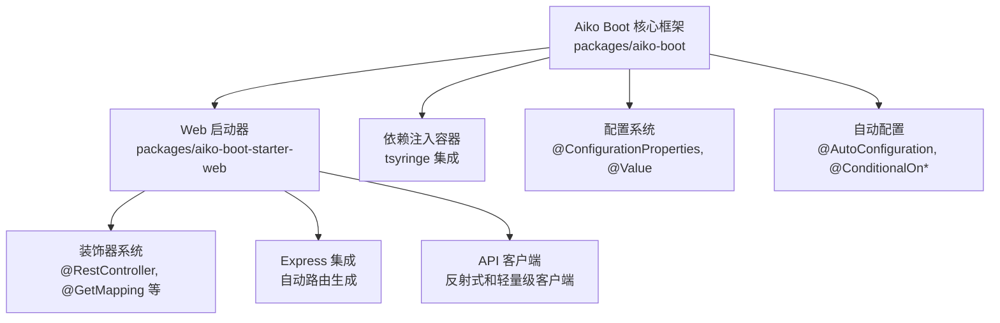
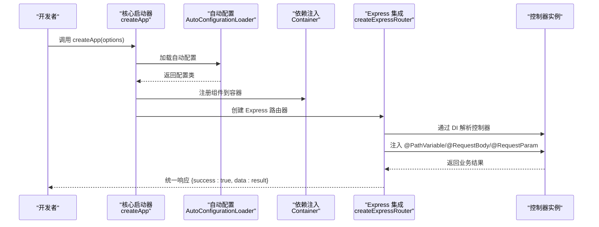
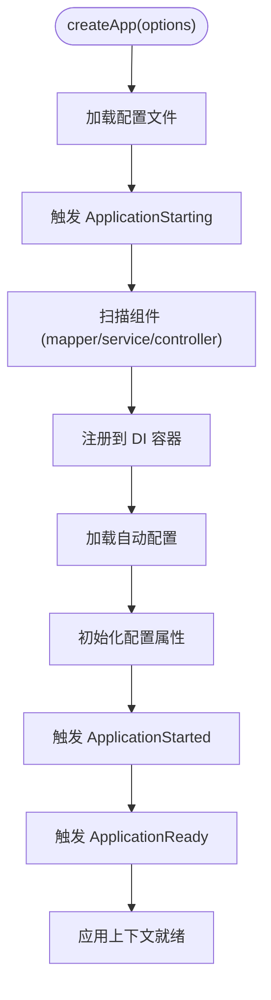
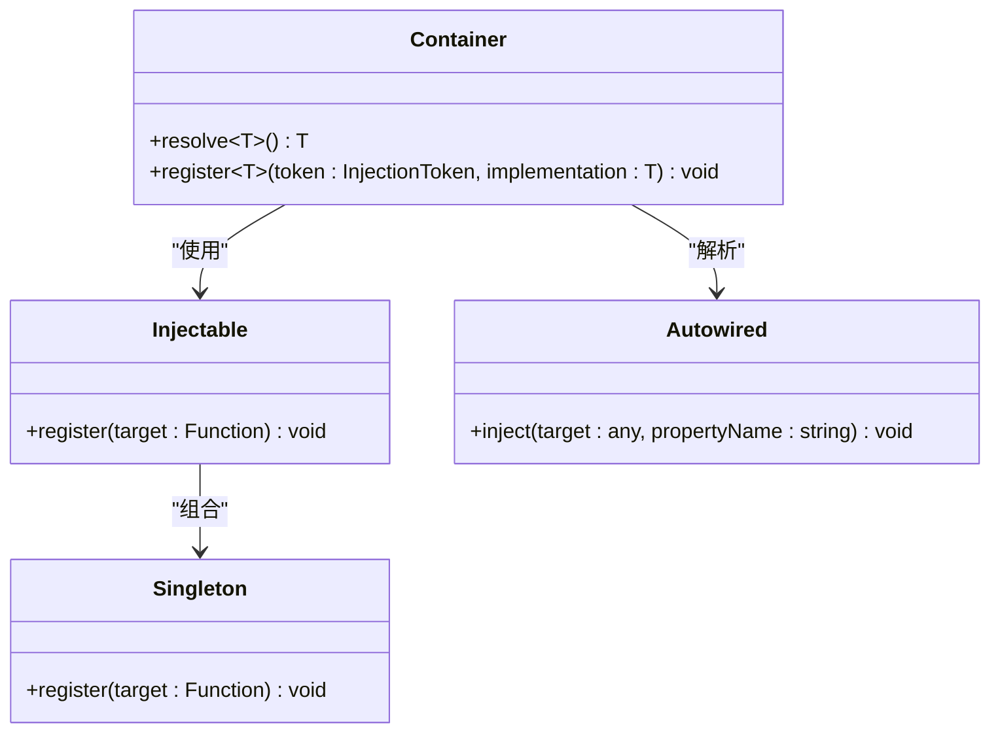
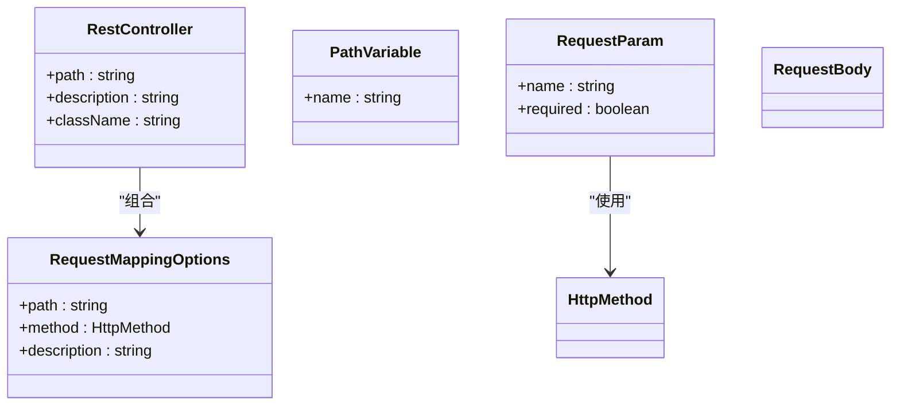
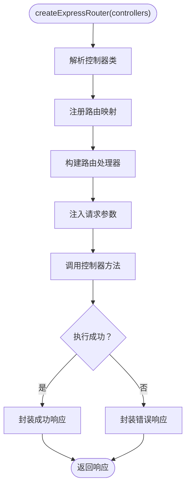
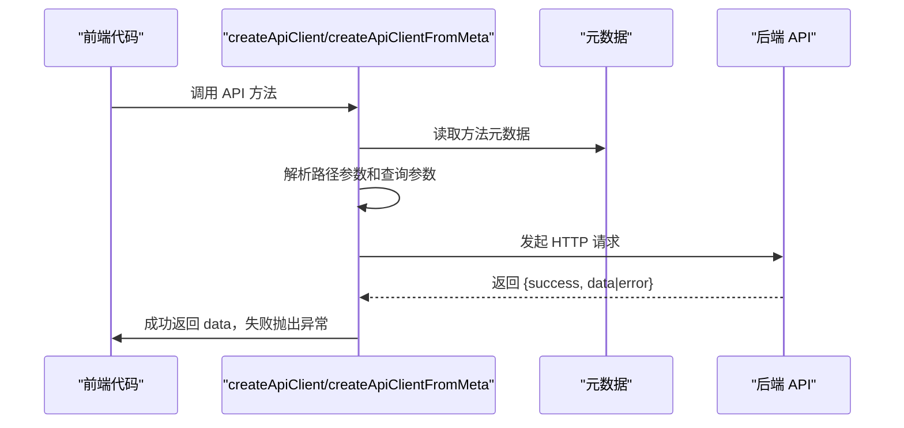
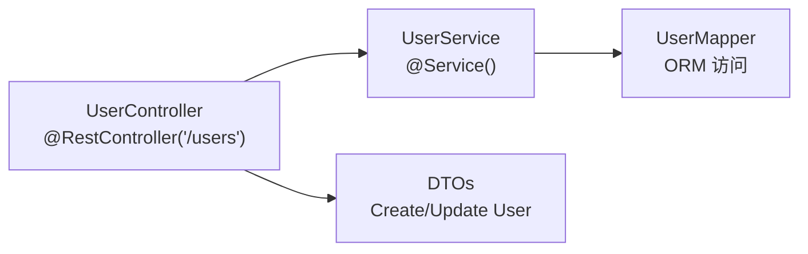
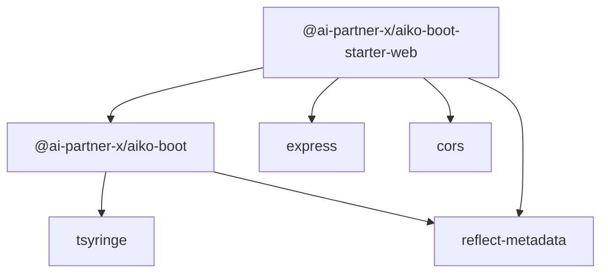

# Aiko Boot - Next.js 适配层

<cite>
**本文档引用的文件**
- [packages/aiko-boot/src/index.ts](file://packages/aiko-boot/src/index.ts)
- [packages/aiko-boot/src/boot/bootstrap.ts](file://packages/aiko-boot/src/boot/bootstrap.ts)
- [packages/aiko-boot-starter-web/src/index.ts](file://packages/aiko-boot-starter-web/src/index.ts)
- [packages/aiko-boot-starter-web/src/decorators.ts](file://packages/aiko-boot-starter-web/src/decorators.ts)
- [packages/aiko-boot-starter-web/src/express-router.ts](file://packages/aiko-boot-starter-web/src/express-router.ts)
- [packages/aiko-boot-starter-web/src/client.ts](file://packages/aiko-boot-starter-web/src/client.ts)
- [packages/aiko-boot-starter-web/src/client-lite.ts](file://packages/aiko-boot-starter-web/src/client-lite.ts)
- [packages/aiko-boot/package.json](file://packages/aiko-boot/package.json)
- [packages/aiko-boot-starter-web/package.json](file://packages/aiko-boot-starter-web/package.json)
- [app/examples/user-crud/packages/api/src/controller/user.controller.ts](file://app/examples/user-crud/packages/api/src/controller/user.controller.ts)
- [app/examples/user-crud/packages/api/src/service/user.service.ts](file://app/examples/user-crud/packages/api/src/service/user.service.ts)
- [README.md](file://README.md)
</cite>

## 更新摘要
**所做更改**
- 移除了 @ai-first/nextjs 包的相关内容，全面更新为新的 Aiko Boot 框架架构
- 新增了 Aiko Boot 核心启动器的详细说明
- 更新了 Web 启动器的装饰器系统和 Express 集成
- 重新组织了项目结构和依赖关系分析
- 更新了 API 参考和使用示例

## 目录
1. [简介](#简介)
2. [项目结构](#项目结构)
3. [核心组件](#核心组件)
4. [架构总览](#架构总览)
5. [详细组件分析](#详细组件分析)
6. [依赖关系分析](#依赖关系分析)
7. [性能考虑](#性能考虑)
8. [故障排除指南](#故障排除指南)
9. [结论](#结论)
10. [附录](#附录)

## 简介
Aiko Boot 是新一代的 Spring Boot 风格 Web 框架，专门为 TypeScript 和 Node.js 生态系统设计。它将 @ai-first/nextjs 包的功能整合到一个更加统一和强大的框架中，提供完整的依赖注入、自动配置、装饰器系统和 Web 集成功能。

该框架的核心价值在于：
- **统一的 Spring Boot 风格体验**：提供熟悉的注解驱动开发模式
- **模块化架构**：核心框架 + 专用启动器的清晰分离
- **完整的 Web 功能**：装饰器系统、Express 集成、API 客户端生成
- **TypeScript 友好**：完整的类型定义和编译时检查
- **开箱即用**：自动配置、依赖注入、生命周期管理

## 项目结构
Aiko Boot 采用模块化设计，分为核心框架和专用启动器：

**核心框架** (`packages/aiko-boot/`)
- 提供依赖注入、配置系统、自动配置和生命周期管理
- 作为所有启动器的基础依赖

**Web 启动器** (`packages/aiko-boot-starter-web/`)
- 提供 Spring Boot 风格的 HTTP 装饰器和 Express 集成
- 包含 API 客户端生成和自动配置功能

**图表来源**
- [packages/aiko-boot/src/index.ts](file://packages/aiko-boot/src/index.ts#L1-L64)
- [packages/aiko-boot-starter-web/src/index.ts](file://packages/aiko-boot-starter-web/src/index.ts#L1-L73)

**章节来源**
- [packages/aiko-boot/package.json](file://packages/aiko-boot/package.json#L1-L61)
- [packages/aiko-boot-starter-web/package.json](file://packages/aiko-boot-starter-web/package.json#L1-L60)

## 核心组件
- **核心启动器**：提供应用启动、配置加载、组件扫描和生命周期管理
- **依赖注入系统**：基于 tsyringe 的完整 DI 容器，支持构造函数注入和属性注入
- **装饰器系统**：与 Spring Boot 对齐的 HTTP 装饰器和领域模型装饰器
- **自动配置**：基于配置文件的条件化自动配置机制
- **Express 集成**：自动将装饰器映射为 Express 路由
- **API 客户端**：支持反射式和 SSR 友好的 API 客户端生成

**章节来源**
- [packages/aiko-boot/src/boot/bootstrap.ts](file://packages/aiko-boot/src/boot/bootstrap.ts#L1-L354)
- [packages/aiko-boot-starter-web/src/decorators.ts](file://packages/aiko-boot-starter-web/src/decorators.ts#L1-L196)
- [packages/aiko-boot-starter-web/src/express-router.ts](file://packages/aiko-boot-starter-web/src/express-router.ts#L1-L171)
- [packages/aiko-boot-starter-web/src/client.ts](file://packages/aiko-boot-starter-web/src/client.ts#L1-L233)

## 架构总览
Aiko Boot 的架构采用了分层设计，核心框架提供基础设施，启动器提供特定领域的功能集成：

**图表来源**
- [packages/aiko-boot/src/boot/bootstrap.ts](file://packages/aiko-boot/src/boot/bootstrap.ts#L132-L289)
- [packages/aiko-boot-starter-web/src/express-router.ts](file://packages/aiko-boot-starter-web/src/express-router.ts#L59-L171)

## 详细组件分析

### 核心启动器
核心启动器提供应用启动的完整生命周期管理：

- **配置加载**：支持多种配置格式（app.config.ts、JSON、YAML）和环境配置
- **组件扫描**：自动扫描并注册 mapper、service、controller 等组件
- **自动配置**：加载并初始化各种自动配置类
- **生命周期管理**：触发 ApplicationStarting、ApplicationStarted、ApplicationReady 等事件
- **HTTP 服务器集成**：提供 HTTP 服务器注册和启动机制

**图表来源**
- [packages/aiko-boot/src/boot/bootstrap.ts](file://packages/aiko-boot/src/boot/bootstrap.ts#L132-L289)

**章节来源**
- [packages/aiko-boot/src/boot/bootstrap.ts](file://packages/aiko-boot/src/boot/bootstrap.ts#L1-L354)

### 依赖注入系统
基于 tsyringe 的完整依赖注入解决方案：

- **构造函数注入**：通过 Injectable 和 Singleton 装饰器自动注入依赖
- **属性注入**：支持 @Autowired 属性注入，自动解析依赖关系
- **容器管理**：提供 Container.resolve、Container.register 等操作
- **作用域管理**：支持 Singleton、Scoped 等不同作用域

**图表来源**
- [packages/aiko-boot/src/di/server.ts](file://packages/aiko-boot/src/di/server.ts)

**章节来源**
- [packages/aiko-boot/src/di/server.ts](file://packages/aiko-boot/src/di/server.ts)

### 装饰器系统
Web 启动器提供完整的 Spring Boot 风格装饰器：

- **控制器装饰器**：@RestController、@GetMapping、@PostMapping 等
- **参数装饰器**：@PathVariable、@RequestParam、@RequestBody
- **元数据系统**：提供获取装饰器元数据的工具函数
- **类型安全**：完整的 TypeScript 类型定义

**图表来源**
- [packages/aiko-boot-starter-web/src/decorators.ts](file://packages/aiko-boot-starter-web/src/decorators.ts#L26-L43)
- [packages/aiko-boot-starter-web/src/decorators.ts](file://packages/aiko-boot-starter-web/src/decorators.ts#L139-L173)

**章节来源**
- [packages/aiko-boot-starter-web/src/decorators.ts](file://packages/aiko-boot-starter-web/src/decorators.ts#L1-L196)

### Express 集成
自动将装饰器映射为 Express 路由：

- **自动注册**：遍历控制器类，读取装饰器元数据自动注册路由
- **参数注入**：根据装饰器元数据自动注入请求参数
- **响应封装**：统一返回 {success: true, data: result} 格式
- **DI 集成**：通过依赖注入容器解析控制器实例

**图表来源**
- [packages/aiko-boot-starter-web/src/express-router.ts](file://packages/aiko-boot-starter-web/src/express-router.ts#L102-L171)

**章节来源**
- [packages/aiko-boot-starter-web/src/express-router.ts](file://packages/aiko-boot-starter-web/src/express-router.ts#L1-L171)

### API 客户端
提供两种类型的 API 客户端生成：

- **反射式客户端**：createApiClient，基于装饰器元数据生成类型安全的客户端
- **轻量级客户端**：createApiClientFromMeta，基于静态元数据对象，适合 SSR 环境
- **统一响应处理**：自动处理 {success: boolean, data?, error?} 响应格式

**图表来源**
- [packages/aiko-boot-starter-web/src/client.ts](file://packages/aiko-boot-starter-web/src/client.ts#L73-L144)
- [packages/aiko-boot-starter-web/src/client-lite.ts](file://packages/aiko-boot-starter-web/src/client-lite.ts#L47-L106)

**章节来源**
- [packages/aiko-boot-starter-web/src/client.ts](file://packages/aiko-boot-starter-web/src/client.ts#L1-L233)
- [packages/aiko-boot-starter-web/src/client-lite.ts](file://packages/aiko-boot-starter-web/src/client-lite.ts#L1-L107)

### 示例项目使用
示例项目展示了完整的 Aiko Boot 应用结构：

- **控制器示例**：使用 @RestController、@GetMapping、@PostMapping 等装饰器
- **服务层示例**：演示依赖注入和服务方法实现
- **类型安全**：完整的 TypeScript 类型定义和编译时检查

**图表来源**
- [app/examples/user-crud/packages/api/src/controller/user.controller.ts](file://app/examples/user-crud/packages/api/src/controller/user.controller.ts#L1-L53)
- [app/examples/user-crud/packages/api/src/service/user.service.ts](file://app/examples/user-crud/packages/api/src/service/user.service.ts#L1-L78)

**章节来源**
- [app/examples/user-crud/packages/api/src/controller/user.controller.ts](file://app/examples/user-crud/packages/api/src/controller/user.controller.ts#L1-L53)
- [app/examples/user-crud/packages/api/src/service/user.service.ts](file://app/examples/user-crud/packages/api/src/service/user.service.ts#L1-L78)

## 依赖关系分析
Aiko Boot 采用模块化依赖设计：

**核心框架依赖**
- tsyringe：依赖注入容器
- reflect-metadata：装饰器元数据支持
- React：可选的 React 集成支持

**Web 启动器依赖**
- @ai-partner-x/aiko-boot：核心框架依赖
- cors：CORS 中间件支持
- express：Express 框架集成
- reflect-metadata：装饰器元数据支持

**图表来源**
- [packages/aiko-boot/package.json](file://packages/aiko-boot/package.json#L35-L49)
- [packages/aiko-boot-starter-web/package.json](file://packages/aiko-boot-starter-web/package.json#L32-L45)

**章节来源**
- [packages/aiko-boot/package.json](file://packages/aiko-boot/package.json#L1-L61)
- [packages/aiko-boot-starter-web/package.json](file://packages/aiko-boot-starter-web/package.json#L1-L60)

## 性能考虑
- **启动性能**：组件扫描和自动配置在启动阶段完成，运行时无额外开销
- **内存管理**：Singleton 作用域确保单例实例复用，减少内存占用
- **路由性能**：装饰器元数据在启动时解析，运行时路由查找为 O(1)
- **客户端优化**：SSR 环境使用轻量级客户端，避免反射开销
- **配置缓存**：配置系统支持缓存，减少重复读取

## 故障排除指南
- **组件未注册**：检查 @RestController、@Service 等装饰器是否正确使用
- **依赖注入失败**：确认依赖类型正确注册到 DI 容器
- **路由未生效**：验证 @RequestMapping 装饰器的路径和方法配置
- **API 客户端错误**：检查 baseUrl 配置和响应格式一致性
- **自动配置问题**：确认配置文件格式正确且路径可达

**章节来源**
- [packages/aiko-boot/src/boot/bootstrap.ts](file://packages/aiko-boot/src/boot/bootstrap.ts#L308-L354)
- [packages/aiko-boot-starter-web/src/express-router.ts](file://packages/aiko-boot-starter-web/src/express-router.ts#L160-L171)

## 结论
Aiko Boot 通过模块化的架构设计，将 @ai-first/nextjs 的功能整合到一个更加完整和强大的框架中。其核心价值体现在：

- **统一的开发体验**：Spring Boot 风格的注解驱动开发模式
- **模块化设计**：核心框架 + 专用启动器的清晰分离
- **完整的功能集**：从依赖注入到 Web 集成的一站式解决方案
- **TypeScript 友好**：完整的类型定义和编译时检查
- **易于扩展**：基于自动配置的插件化架构

这种架构不仅保持了原有的易用性，还提供了更好的可扩展性和维护性，为大型项目的长期发展奠定了坚实基础。

## 附录

### API 参考（装饰器与工具）
- **核心启动器**
  - createApp(options)：应用启动入口
  - ApplicationContext：应用上下文接口
  - AppOptions：启动配置选项
- **装饰器系统**
  - @RestController：标记控制器，支持基路径与描述
  - @GetMapping/@PostMapping/@PutMapping/@DeleteMapping/@PatchMapping：HTTP 方法映射
  - @RequestMapping：通用请求映射
  - @PathVariable/@RequestParam/@QueryParam/@RequestBody：参数提取装饰器
  - 元数据访问器：getControllerMetadata、getRequestMappings、getPathVariables、getRequestParams、getRequestBody
- **Express 集成**
  - createExpressRouter(controllers, options)：创建 Express 路由器
  - ExpressRouterOptions：路由配置选项
- **API 客户端**
  - createApiClient(ApiClass, options)：反射式 API 客户端
  - createApiClientFromMeta(meta, ApiClass, options)：轻量级 API 客户端
  - ApiClientOptions：客户端配置选项
  - ApiMetadata：静态元数据类型定义

**章节来源**
- [packages/aiko-boot/src/boot/bootstrap.ts](file://packages/aiko-boot/src/boot/bootstrap.ts#L72-L94)
- [packages/aiko-boot-starter-web/src/decorators.ts](file://packages/aiko-boot-starter-web/src/decorators.ts#L1-L196)
- [packages/aiko-boot-starter-web/src/express-router.ts](file://packages/aiko-boot-starter-web/src/express-router.ts#L29-L44)
- [packages/aiko-boot-starter-web/src/client.ts](file://packages/aiko-boot-starter-web/src/client.ts#L47-L76)
- [packages/aiko-boot-starter-web/src/client-lite.ts](file://packages/aiko-boot-starter-web/src/client-lite.ts#L173-L180)