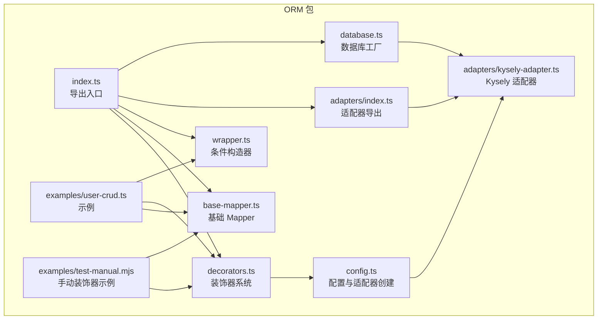
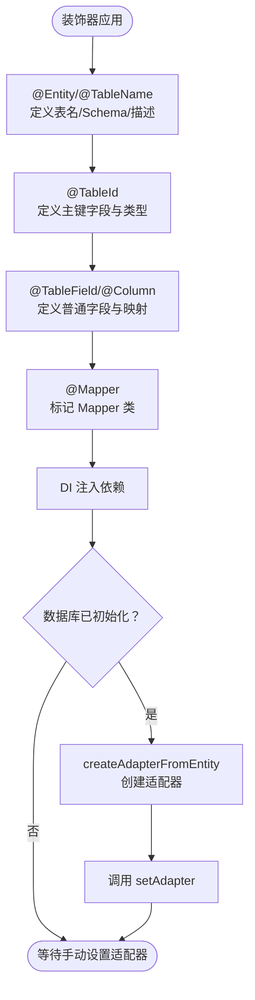
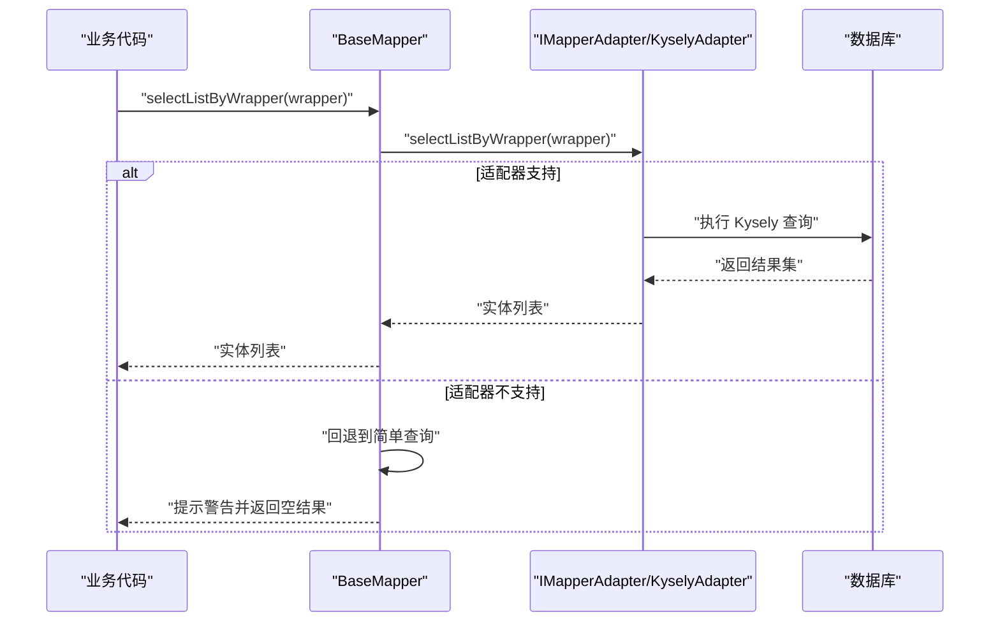
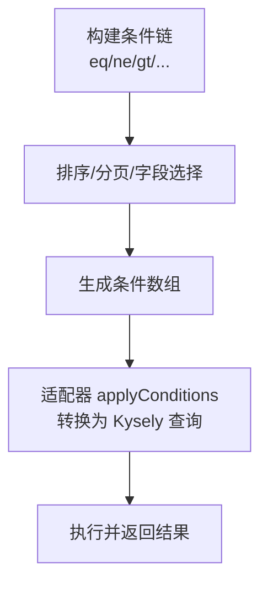
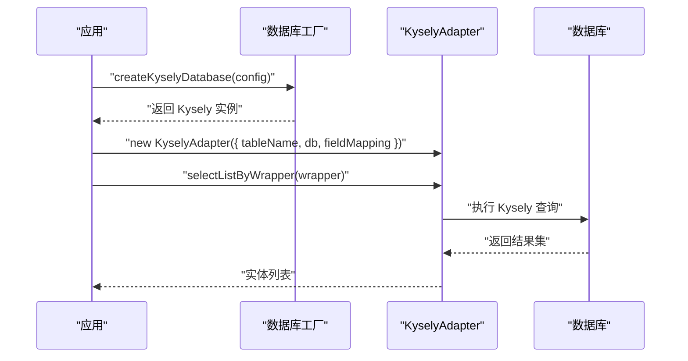
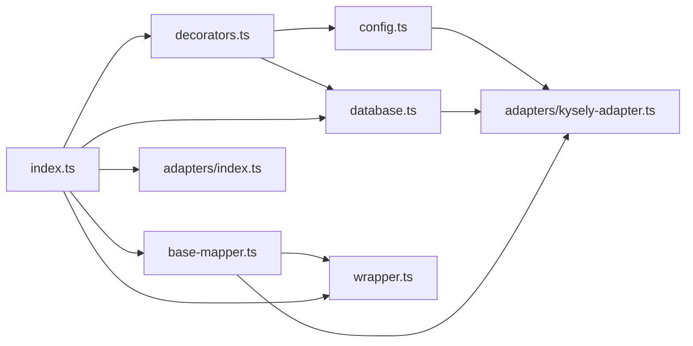

# @ai-first/orm - ORM 数据访问层

<cite>
**本文引用的文件**
- [packages/orm/src/index.ts](file://packages/orm/src/index.ts)
- [packages/orm/src/decorators.ts](file://packages/orm/src/decorators.ts)
- [packages/orm/src/base-mapper.ts](file://packages/orm/src/base-mapper.ts)
- [packages/orm/src/wrapper.ts](file://packages/orm/src/wrapper.ts)
- [packages/orm/src/adapters/kysely-adapter.ts](file://packages/orm/src/adapters/kysely-adapter.ts)
- [packages/orm/src/adapters/index.ts](file://packages/orm/src/adapters/index.ts)
- [packages/orm/src/config.ts](file://packages/orm/src/config.ts)
- [packages/orm/src/database.ts](file://packages/orm/src/database.ts)
- [packages/orm/examples/user-crud.ts](file://packages/orm/examples/user-crud.ts)
- [packages/orm/examples/test-manual.mjs](file://packages/orm/examples/test-manual.mjs)
- [packages/orm/tsconfig.json](file://packages/orm/tsconfig.json)
- [packages/orm/tsup.config.ts](file://packages/orm/tsup.config.ts)
- [README.md](file://README.md)
</cite>

## 目录
1. [简介](#简介)
2. [项目结构](#项目结构)
3. [核心组件](#核心组件)
4. [架构总览](#架构总览)
5. [详细组件分析](#详细组件分析)
6. [依赖关系分析](#依赖关系分析)
7. [性能考量](#性能考量)
8. [故障排查指南](#故障排查指南)
9. [结论](#结论)
10. [附录](#附录)

## 简介
@ai-first/orm 是一个基于装饰器的 ORM 框架，提供与 MyBatis-Plus 风格一致的 API，底层使用 Kysely 实现，支持 PostgreSQL、SQLite、MySQL 等数据库。其核心目标是：
- 以装饰器驱动的实体与 Mapper 定义，降低样板代码
- 提供与 MyBatis-Plus 一致的查询构造器与 CRUD 接口
- 通过适配器抽象数据库差异，便于扩展与迁移
- 支持 TypeScript 与 Java 互译（TypeScript 可转换为 Java Spring Boot + MyBatis-Plus）

## 项目结构
该包位于 packages/orm，核心源码组织如下：
- src/index.ts：对外导出入口，统一暴露配置、装饰器、BaseMapper、QueryWrapper、适配器与数据库工厂
- src/decorators.ts：装饰器系统，包括 @Entity/@TableName、@TableId、@TableField/@Column、@Mapper
- src/base-mapper.ts：基础 Mapper 抽象，定义 CRUD 与 QueryWrapper 支持
- src/wrapper.ts：MyBatis-Plus 风格的条件构造器 QueryWrapper/LambdaQueryWrapper
- src/adapters/kysely-adapter.ts：基于 Kysely 的适配器实现，负责将查询条件映射为具体数据库方言
- src/config.ts：全局配置与适配器创建工具（从实体元数据自动创建适配器）
- src/database.ts：数据库工厂，创建并管理 Kysely 实例，支持多数据库类型
- examples：示例代码，展示实体定义、Mapper 使用与 CRUD 操作



图表来源
- [packages/orm/src/index.ts](file://packages/orm/src/index.ts#L1-L72)
- [packages/orm/src/decorators.ts](file://packages/orm/src/decorators.ts#L1-L224)
- [packages/orm/src/base-mapper.ts](file://packages/orm/src/base-mapper.ts#L1-L332)
- [packages/orm/src/wrapper.ts](file://packages/orm/src/wrapper.ts#L1-L359)
- [packages/orm/src/adapters/index.ts](file://packages/orm/src/adapters/index.ts#L1-L2)
- [packages/orm/src/adapters/kysely-adapter.ts](file://packages/orm/src/adapters/kysely-adapter.ts#L1-L427)
- [packages/orm/src/config.ts](file://packages/orm/src/config.ts#L1-L77)
- [packages/orm/src/database.ts](file://packages/orm/src/database.ts#L1-L134)
- [packages/orm/examples/user-crud.ts](file://packages/orm/examples/user-crud.ts#L1-L155)
- [packages/orm/examples/test-manual.mjs](file://packages/orm/examples/test-manual.mjs#L1-L87)

章节来源
- [packages/orm/src/index.ts](file://packages/orm/src/index.ts#L1-L72)
- [packages/orm/src/decorators.ts](file://packages/orm/src/decorators.ts#L1-L224)
- [packages/orm/src/base-mapper.ts](file://packages/orm/src/base-mapper.ts#L1-L332)
- [packages/orm/src/wrapper.ts](file://packages/orm/src/wrapper.ts#L1-L359)
- [packages/orm/src/adapters/index.ts](file://packages/orm/src/adapters/index.ts#L1-L2)
- [packages/orm/src/adapters/kysely-adapter.ts](file://packages/orm/src/adapters/kysely-adapter.ts#L1-L427)
- [packages/orm/src/config.ts](file://packages/orm/src/config.ts#L1-L77)
- [packages/orm/src/database.ts](file://packages/orm/src/database.ts#L1-L134)
- [packages/orm/examples/user-crud.ts](file://packages/orm/examples/user-crud.ts#L1-L155)
- [packages/orm/examples/test-manual.mjs](file://packages/orm/examples/test-manual.mjs#L1-L87)

## 核心组件
- 装饰器系统
  - @Entity/@TableName：标记实体类，配置表名、Schema、描述等
  - @TableId：标记主键字段，支持 AUTO/INPUT/ASSIGN_ID/ASSIGN_UUID 等类型
  - @TableField/@Column：标记普通字段，支持列名映射、是否存在数据库、字段填充策略、是否大字段等
  - @Mapper：标记 Mapper 类，自动注入依赖、注册到 DI 容器，并在数据库初始化后尝试自动设置适配器
- BaseMapper
  - 提供标准 CRUD 操作：selectById/selectBatchIds/selectOne/selectList/selectPage/selectCount、insert/insertBatch、updateById/update、deleteById/deleteBatchIds/delete、以及基于 QueryWrapper 的查询/更新/删除
  - 通过适配器接口解耦数据库实现，适配器需实现对应方法
- QueryWrapper（MyBatis-Plus 风格）
  - 支持比较条件（=、!=、>、>=、<、<=）、模糊查询（like/not like 左右匹配）、范围（between/not between）、集合（in/not in）、NULL 判断（is null/is not null）、逻辑组合（and/or 嵌套）、排序（asc/desc）、分页（limit/offset/page）、字段选择（select）与分组（groupBy）
- 适配器与数据库工厂
  - KyselyAdapter：将 QueryWrapper 条件转换为 Kysely 查询，支持字段映射与实体转换
  - createKyselyDatabase/getKyselyDatabase/getKyselyDatabaseConfig/closeKyselyDatabase/isDatabaseInitialized：数据库工厂，支持 postgres、sqlite、mysql 三种类型
  - createAdapterFromEntity：从实体元数据自动创建适配器（表名、字段映射）

章节来源
- [packages/orm/src/decorators.ts](file://packages/orm/src/decorators.ts#L1-L224)
- [packages/orm/src/base-mapper.ts](file://packages/orm/src/base-mapper.ts#L1-L332)
- [packages/orm/src/wrapper.ts](file://packages/orm/src/wrapper.ts#L1-L359)
- [packages/orm/src/adapters/kysely-adapter.ts](file://packages/orm/src/adapters/kysely-adapter.ts#L1-L427)
- [packages/orm/src/config.ts](file://packages/orm/src/config.ts#L1-L77)
- [packages/orm/src/database.ts](file://packages/orm/src/database.ts#L1-L134)

## 架构总览
下图展示了装饰器、Mapper、适配器与数据库之间的交互关系：

```mermaid
classDiagram
class EntityDecorators {
"+Entity(options)"
"+TableName(options)"
"+TableId(options)"
"+TableField(options)"
"+Column(options)"
"+Mapper(entity)"
}
class BaseMapper {
"+setAdapter(adapter)"
"+selectById(id)"
"+selectList(condition, orderBy)"
"+selectPage(page, condition, orderBy)"
"+insert(entity)"
"+updateById(entity)"
"+deleteById(id)"
"+selectListByWrapper(wrapper)"
"+updateByWrapper(data, wrapper)"
"+deleteByWrapper(wrapper)"
}
class QueryWrapper {
"+eq/ne/gt/ge/lt/le()"
"+like/notLike/likeLeft/likeRight()"
"+between/notBetween()"
"+in/notIn()"
"+isNull/isNotNull()"
"+and()/or()"
"+orderBy()/orderByAsc()/orderByDesc()"
"+limit()/offset()/page()"
"+select()/groupBy()"
}
class KyselyAdapter {
"+findById()"
"+findList()"
"+findPage()"
"+insert()/insertBatch()"
"+updateById()/updateByCondition()"
"+deleteById()/deleteByIds()/deleteByCondition()"
"+selectListByWrapper()"
"+updateByWrapper()"
"+deleteByWrapper()"
}
class DatabaseFactory {
"+createKyselyDatabase(config)"
"+getKyselyDatabase()"
"+getKyselyDatabaseConfig()"
"+closeKyselyDatabase()"
"+isDatabaseInitialized()"
}
EntityDecorators --> BaseMapper : "元数据驱动"
BaseMapper --> QueryWrapper : "使用"
BaseMapper --> KyselyAdapter : "委托执行"
DatabaseFactory --> KyselyAdapter : "提供 Kysely 实例"
```

图表来源
- [packages/orm/src/decorators.ts](file://packages/orm/src/decorators.ts#L65-L193)
- [packages/orm/src/base-mapper.ts](file://packages/orm/src/base-mapper.ts#L54-L301)
- [packages/orm/src/wrapper.ts](file://packages/orm/src/wrapper.ts#L49-L359)
- [packages/orm/src/adapters/kysely-adapter.ts](file://packages/orm/src/adapters/kysely-adapter.ts#L24-L427)
- [packages/orm/src/database.ts](file://packages/orm/src/database.ts#L47-L133)

## 详细组件分析

### 装饰器系统（Entity、TableId、TableField、Mapper）
- @Entity/@TableName
  - 作用：标记实体类，解析表名、Schema、描述等
  - 默认表名规则：若未指定则使用类名小写加复数形式
- @TableId
  - 作用：标记主键字段，支持主键类型枚举
  - 默认类型：AUTO
- @TableField/@Column
  - 作用：标记普通字段，支持列名映射、字段存在性、填充策略、是否大字段、JDBC 类型等
- @Mapper
  - 作用：标记 Mapper 类，自动注入构造函数依赖、注册为单例；在数据库初始化后尝试自动设置适配器
  - 自动设置适配器：当实体已标注且数据库已初始化，会调用 createAdapterFromEntity 并调用实例的 setAdapter



图表来源
- [packages/orm/src/decorators.ts](file://packages/orm/src/decorators.ts#L65-L193)
- [packages/orm/src/config.ts](file://packages/orm/src/config.ts#L42-L76)

章节来源
- [packages/orm/src/decorators.ts](file://packages/orm/src/decorators.ts#L65-L193)
- [packages/orm/src/config.ts](file://packages/orm/src/config.ts#L42-L76)

### BaseMapper 与适配器接口
- BaseMapper
  - 通过 protected adapter 字段持有 IMapperAdapter 实例
  - 提供标准 CRUD 与分页、统计方法
  - 对于 QueryWrapper 的支持采用“尽力而为”策略：若适配器不支持，则抛出错误或回退到简单查询
- IMapperAdapter
  - 定义了查询、插入、更新、删除的完整接口，供不同数据库适配器实现



图表来源
- [packages/orm/src/base-mapper.ts](file://packages/orm/src/base-mapper.ts#L217-L301)
- [packages/orm/src/adapters/kysely-adapter.ts](file://packages/orm/src/adapters/kysely-adapter.ts#L177-L244)

章节来源
- [packages/orm/src/base-mapper.ts](file://packages/orm/src/base-mapper.ts#L54-L332)
- [packages/orm/src/adapters/kysely-adapter.ts](file://packages/orm/src/adapters/kysely-adapter.ts#L24-L427)

### QueryWrapper（MyBatis-Plus 风格）
- 支持的条件类型：比较（=、!=、>、>=、<、<=）、模糊（like/not like 左右匹配）、范围（between/not between）、集合（in/not in）、NULL（is null/is not null）、逻辑组合（and/or 嵌套）
- 支持的查询控制：排序（asc/desc）、分页（limit/offset/page）、字段选择（select）、分组（groupBy）
- 条件序列化：通过 getConditions/getOrderBy/getSelect/getLimit/getOffset/getGroupBy 获取内部状态，供适配器转换为具体 SQL



图表来源
- [packages/orm/src/wrapper.ts](file://packages/orm/src/wrapper.ts#L49-L359)
- [packages/orm/src/adapters/kysely-adapter.ts](file://packages/orm/src/adapters/kysely-adapter.ts#L249-L323)

章节来源
- [packages/orm/src/wrapper.ts](file://packages/orm/src/wrapper.ts#L26-L359)
- [packages/orm/src/adapters/kysely-adapter.ts](file://packages/orm/src/adapters/kysely-adapter.ts#L177-L323)

### 数据库适配器系统与工厂
- KyselyAdapter
  - 字段映射：支持 TypeScript 字段名到数据库列名的双向映射，用于实体转换
  - 查询实现：将 QueryWrapper 条件转换为 Kysely 查询，支持复杂条件、排序、分页、聚合
  - 插入/批量插入：返回插入后的实体
  - 更新/删除：支持按 ID、按条件、按 Wrapper 条件
- 数据库工厂
  - createKyselyDatabase：根据配置创建 Kysely 实例，支持 postgres、sqlite、mysql
  - getKyselyDatabase/getKyselyDatabaseConfig/closeKyselyDatabase/isDatabaseInitialized：全局实例管理与状态检查
- 适配器创建
  - createAdapterFromEntity：从实体元数据（@Entity/@TableField/@TableId）自动推断表名与字段映射，创建 KyselyAdapter



图表来源
- [packages/orm/src/database.ts](file://packages/orm/src/database.ts#L47-L95)
- [packages/orm/src/adapters/kysely-adapter.ts](file://packages/orm/src/adapters/kysely-adapter.ts#L30-L76)
- [packages/orm/src/config.ts](file://packages/orm/src/config.ts#L42-L76)

章节来源
- [packages/orm/src/adapters/kysely-adapter.ts](file://packages/orm/src/adapters/kysely-adapter.ts#L24-L427)
- [packages/orm/src/database.ts](file://packages/orm/src/database.ts#L47-L133)
- [packages/orm/src/config.ts](file://packages/orm/src/config.ts#L42-L76)

### CRUD 与复杂查询示例
- 示例一：基于装饰器的完整 CRUD
  - 实体定义：@Entity/@TableId/@TableField
  - Mapper 定义：@Mapper 继承 BaseMapper
  - 使用流程：创建 Mapper 实例 -> setAdapter -> 调用 CRUD 与分页/统计
- 示例二：手动装饰器（无类修饰符语法）
  - 通过手动调用装饰器函数为类添加元数据
  - 适用于某些运行时场景或历史代码迁移

章节来源
- [packages/orm/examples/user-crud.ts](file://packages/orm/examples/user-crud.ts#L23-L155)
- [packages/orm/examples/test-manual.mjs](file://packages/orm/examples/test-manual.mjs#L10-L87)

## 依赖关系分析
- 内部依赖
  - index.ts 统一导出装饰器、BaseMapper、QueryWrapper、适配器与数据库工厂
  - decorators.ts 依赖 DI 容器能力与反射元数据
  - base-mapper.ts 依赖 wrapper.ts 的 QueryWrapper 类型
  - adapters/kysely-adapter.ts 依赖 database.ts 的全局 Kysely 实例
  - config.ts 依赖 decorators.ts 的元数据与 database.ts 的初始化状态
- 外部依赖
  - kysely：数据库查询构建与执行
  - reflect-metadata：装饰器元数据支持
  - better-sqlite3、pg、mysql2：数据库驱动（可选 peerDependencies）



图表来源
- [packages/orm/src/index.ts](file://packages/orm/src/index.ts#L1-L72)
- [packages/orm/src/decorators.ts](file://packages/orm/src/decorators.ts#L1-L224)
- [packages/orm/src/config.ts](file://packages/orm/src/config.ts#L1-L77)
- [packages/orm/src/database.ts](file://packages/orm/src/database.ts#L1-L134)
- [packages/orm/src/base-mapper.ts](file://packages/orm/src/base-mapper.ts#L1-L332)
- [packages/orm/src/wrapper.ts](file://packages/orm/src/wrapper.ts#L1-L359)
- [packages/orm/src/adapters/index.ts](file://packages/orm/src/adapters/index.ts#L1-L2)
- [packages/orm/src/adapters/kysely-adapter.ts](file://packages/orm/src/adapters/kysely-adapter.ts#L1-L427)

章节来源
- [packages/orm/src/index.ts](file://packages/orm/src/index.ts#L1-L72)
- [packages/orm/src/decorators.ts](file://packages/orm/src/decorators.ts#L1-L224)
- [packages/orm/src/config.ts](file://packages/orm/src/config.ts#L1-L77)
- [packages/orm/src/database.ts](file://packages/orm/src/database.ts#L1-L134)
- [packages/orm/src/base-mapper.ts](file://packages/orm/src/base-mapper.ts#L1-L332)
- [packages/orm/src/wrapper.ts](file://packages/orm/src/wrapper.ts#L1-L359)
- [packages/orm/src/adapters/index.ts](file://packages/orm/src/adapters/index.ts#L1-L2)
- [packages/orm/src/adapters/kysely-adapter.ts](file://packages/orm/src/adapters/kysely-adapter.ts#L1-L427)

## 性能考量
- 字段映射与实体转换
  - KyselyAdapter 在查询后进行字段名映射与实体转换，建议在实体字段较多时避免不必要的 select 列，减少转换开销
- 分页与统计
  - 分页查询同时执行主查询与 COUNT 聚合查询，建议在大数据量场景下确保相关列建立索引
- 批量操作
  - insertBatch 与 deleteByIds 会一次性提交多个记录，注意数据库连接池大小与事务隔离级别
- 查询包装器
  - 复杂条件（嵌套 and/or、多层 between/in）可能生成较复杂的 WHERE 子句，建议结合 EXPLAIN/ANALYZE 分析执行计划

## 故障排查指南
- 适配器未设置
  - 现象：调用 CRUD 方法抛出“适配器未设置”
  - 处理：在实例化 Mapper 后调用 setAdapter 或使用 @Mapper 装饰器自动注入
- 数据库未初始化
  - 现象：createAdapterFromEntity 抛出“数据库未初始化”
  - 处理：先调用 createKyselyDatabase 初始化数据库实例
- 适配器不支持 QueryWrapper
  - 现象：selectListByWrapper/selectOneByWrapper/selectCountByWrapper/updateByWrapper/deleteByWrapper 抛错或回退
  - 处理：确认使用的适配器是否实现了相应方法；如需复杂条件，优先使用 KyselyAdapter
- 类型与装饰器配置
  - 现象：TypeScript 编译报错或运行时元数据缺失
  - 处理：确保 tsconfig 启用 experimentalDecorators 与 emitDecoratorMetadata；在入口处引入 reflect-metadata

章节来源
- [packages/orm/src/base-mapper.ts](file://packages/orm/src/base-mapper.ts#L67-L72)
- [packages/orm/src/config.ts](file://packages/orm/src/config.ts#L45-L47)
- [packages/orm/src/database.ts](file://packages/orm/src/database.ts#L100-L104)
- [packages/orm/src/base-mapper.ts](file://packages/orm/src/base-mapper.ts#L223-L225)
- [packages/orm/tsconfig.json](file://packages/orm/tsconfig.json#L3-L8)

## 结论
@ai-first/orm 通过装饰器与适配器模式，提供了与 MyBatis-Plus 风格一致的 API，结合 Kysely 实现跨数据库的统一查询能力。其设计强调：
- 易用性：装饰器驱动的实体与 Mapper 定义，降低样板代码
- 可移植性：适配器抽象数据库差异，便于扩展与迁移
- 可维护性：清晰的职责分离与统一的查询构造器

建议在生产环境中：
- 明确数据库类型与连接配置，提前初始化数据库实例
- 合理使用 QueryWrapper 构建查询，配合索引策略提升性能
- 在需要复杂条件时优先使用 KyselyAdapter，确保功能完整性

## 附录
- API 参考（节选）
  - 装饰器
    - @Entity：配置表名、Schema、描述
    - @TableId：配置主键类型与列名
    - @TableField/@Column：配置列名、是否存在数据库、字段填充策略、是否大字段等
    - @Mapper：标记 Mapper 类，自动注入与适配器设置
  - BaseMapper
    - 查询：selectById/selectBatchIds/selectOne/selectList/selectPage/selectCount
    - 插入：insert/insertBatch
    - 更新：updateById/update
    - 删除：deleteById/deleteBatchIds/delete
    - QueryWrapper：selectListByWrapper/selectOneByWrapper/selectCountByWrapper/updateByWrapper/deleteByWrapper
  - QueryWrapper
    - 条件：eq/ne/gt/ge/lt/le、like/notLike/likeLeft/likeRight、between/notBetween、in/notIn、isNull/isNotNull、and/or
    - 控制：orderBy/orderByAsc/orderByDesc、limit/offset/page、select、groupBy
  - 数据库工厂
    - createKyselyDatabase/getKyselyDatabase/getKyselyDatabaseConfig/closeKyselyDatabase/isDatabaseInitialized
  - 适配器
    - KyselyAdapter：字段映射、实体转换、复杂查询与批量操作

章节来源
- [packages/orm/src/decorators.ts](file://packages/orm/src/decorators.ts#L23-L61)
- [packages/orm/src/base-mapper.ts](file://packages/orm/src/base-mapper.ts#L76-L200)
- [packages/orm/src/wrapper.ts](file://packages/orm/src/wrapper.ts#L59-L310)
- [packages/orm/src/database.ts](file://packages/orm/src/database.ts#L47-L133)
- [packages/orm/src/adapters/kysely-adapter.ts](file://packages/orm/src/adapters/kysely-adapter.ts#L12-L37)