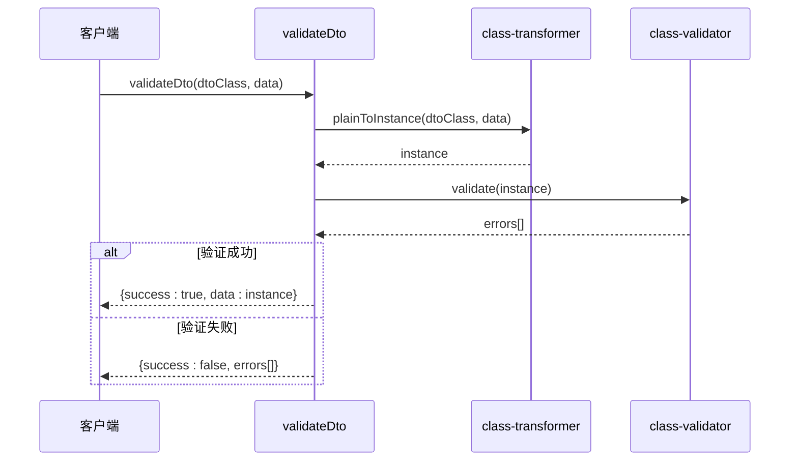
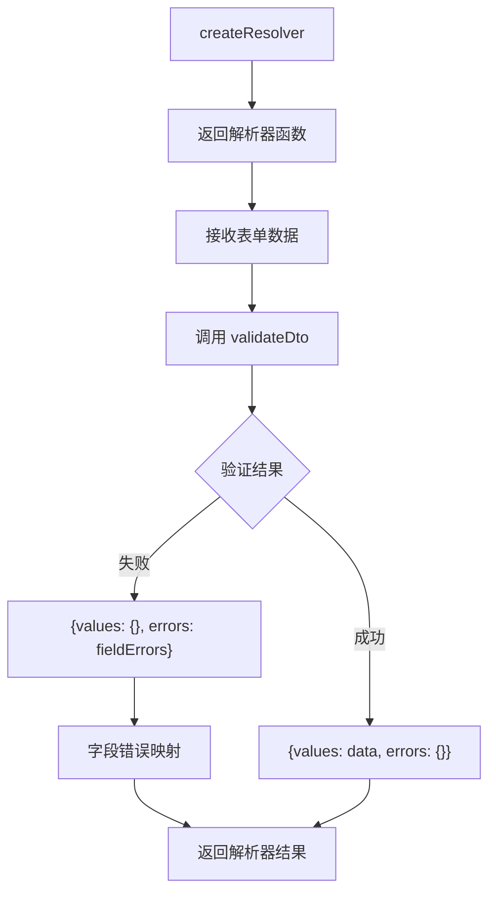
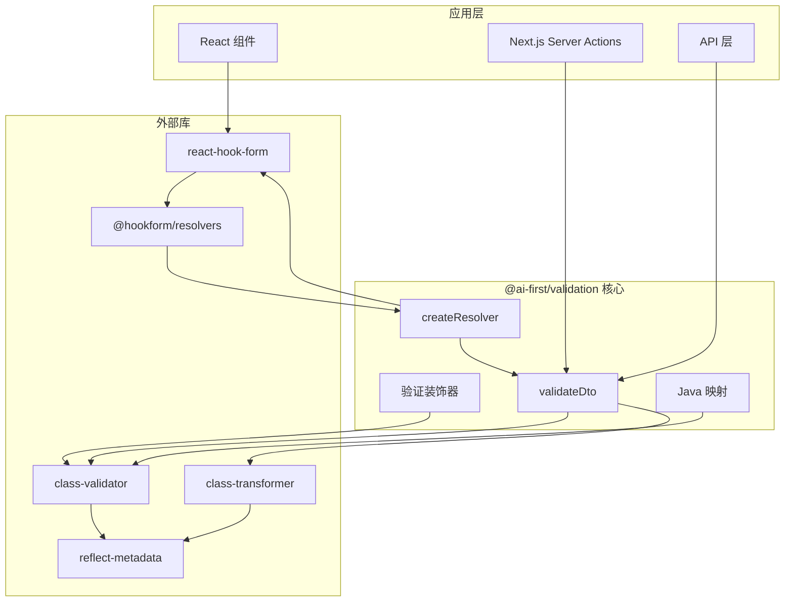

# @ai-first/validation - 数据验证系统

<cite>
**本文档引用的文件**
- [packages/validation/src/index.ts](file://packages/validation/src/index.ts)
- [packages/validation/package.json](file://packages/validation/package.json)
- [packages/validation/tsconfig.json](file://packages/validation/tsconfig.json)
- [packages/validation/tsup.config.ts](file://packages/validation/tsup.config.ts)
- [packages/validation/examples/user-dto.ts](file://packages/validation/examples/user-dto.ts)
- [packages/validation/examples/react-form.tsx](file://packages/validation/examples/react-form.tsx)
- [packages/validation/examples/server-action.ts](file://packages/validation/examples/server-action.ts)
- [app/examples/user-crud/packages/api/src/dto/user.dto.ts](file://app/examples/user-crud/packages/api/src/dto/user.dto.ts)
</cite>

## 目录
1. [简介](#简介)
2. [项目结构](#项目结构)
3. [核心组件](#核心组件)
4. [架构概览](#架构概览)
5. [详细组件分析](#详细组件分析)
6. [依赖关系分析](#依赖关系分析)
7. [性能考虑](#性能考虑)
8. [故障排除指南](#故障排除指南)
9. [结论](#结论)
10. [附录](#附录)

## 简介

@ai-first/validation 是一个基于 class-validator 的数据验证系统，专为 AI-First Framework 设计。该包提供了完整的数据验证解决方案，支持前后端一致性的验证规则，并具备 Java 转译兼容性。

### 主要特性

- **完整的 class-validator 兼容性**：完全重导出 class-validator 的所有验证装饰器
- **类型安全**：提供完整的 TypeScript 类型定义
- **前后端一致性**：支持在前端 React Hook Form 和后端服务器中使用相同的验证规则
- **Java 转译支持**：内置 Java 注解映射，支持代码生成转译
- **自定义扩展**：提供 validateDto 和 createResolver 等实用工具函数

## 项目结构

```mermaid
graph TB
subgraph "包结构"
A[src/index.ts] --> B[核心导出]
A --> C[自定义扩展]
A --> D[Java 映射]
E[examples/] --> F[user-dto.ts]
E --> G[react-form.tsx]
E --> H[server-action.ts]
I[package.json] --> J[依赖管理]
K[tsconfig.json] --> L[编译配置]
M[tsup.config.ts] --> N[构建配置]
end
subgraph "外部依赖"
O[class-validator]
P[class-transformer]
Q[reflect-metadata]
R[react-hook-form]
S[@hookform/resolvers]
end
B --> O
B --> P
B --> Q
C --> R
C --> S
```

**图表来源**
- [packages/validation/src/index.ts](file://packages/validation/src/index.ts#L1-L225)
- [packages/validation/package.json](file://packages/validation/package.json#L1-L40)

**章节来源**
- [packages/validation/src/index.ts](file://packages/validation/src/index.ts#L1-L225)
- [packages/validation/package.json](file://packages/validation/package.json#L1-L40)
- [packages/validation/tsconfig.json](file://packages/validation/tsconfig.json#L1-L12)
- [packages/validation/tsup.config.ts](file://packages/validation/tsup.config.ts#L1-L10)

## 核心组件

### 验证装饰器系统

@ai-first/validation 完全重导出了 class-validator 的所有验证装饰器，确保与现有生态系统的兼容性：

#### 基础验证装饰器
- **存在性验证**：IsDefined、IsOptional
- **类型验证**：IsString、IsNumber、IsInt、IsBoolean、IsArray、IsObject、IsDate、IsEnum
- **字符串验证**：IsNotEmpty、IsEmpty、Length、MinLength、MaxLength、Matches
- **数值验证**：Min、Max、IsPositive、IsNegative
- **格式验证**：IsEmail、IsUrl、IsUUID、IsIP、IsJSON
- **日期验证**：MinDate、MaxDate
- **数组验证**：ArrayContains、ArrayNotContains、ArrayNotEmpty、ArrayMinSize、ArrayMaxSize、ArrayUnique
- **嵌套验证**：ValidateNested
- **自定义验证**：Validate、ValidateIf、ValidateBy

#### 数据转换装饰器
- **plainToInstance**：将普通对象转换为类实例
- **instanceToPlain**：将类实例转换为普通对象
- **Type**：指定嵌套对象的类型
- **Exclude/Expose**：控制属性的序列化
- **Transform**：转换属性值

**章节来源**
- [packages/validation/src/index.ts](file://packages/validation/src/index.ts#L32-L98)
- [packages/validation/src/index.ts](file://packages/validation/src/index.ts#L101-L108)

### 自定义验证工具

#### validateDto 函数
提供统一的 DTO 验证接口，返回标准化的验证结果：



**图表来源**
- [packages/validation/src/index.ts](file://packages/validation/src/index.ts#L115-L137)

#### createResolver 函数
为 React Hook Form 创建验证解析器：



**图表来源**
- [packages/validation/src/index.ts](file://packages/validation/src/index.ts#L173-L191)

**章节来源**
- [packages/validation/src/index.ts](file://packages/validation/src/index.ts#L115-L191)

## 架构概览

### 系统架构图



**图表来源**
- [packages/validation/src/index.ts](file://packages/validation/src/index.ts#L26-L27)
- [packages/validation/src/index.ts](file://packages/validation/src/index.ts#L173-L191)
- [packages/validation/package.json](file://packages/validation/package.json#L21-L37)

### Java 转译映射

系统内置了完整的 Java 注解映射，支持代码生成转译：

| TypeScript 装饰器 | Java 注解 |
|-------------------|-----------|
| IsNotEmpty | @NotBlank |
| IsDefined | @NotNull |
| IsEmail | @Email |
| IsUrl | @URL |
| Length | @Size |
| MinLength | @Size(min = %s) |
| MaxLength | @Size(max = %s) |
| Min | @Min(%s) |
| Max | @Max(%s) |
| IsPositive | @Positive |
| IsNegative | @Negative |
| Matches | @Pattern(regexp = "%s") |
| IsUUID | @UUID |
| ValidateNested | @Valid |
| ArrayNotEmpty | @NotEmpty |
| ArrayMinSize | @Size(min = %s) |
| ArrayMaxSize | @Size(max = %s) |

**章节来源**
- [packages/validation/src/index.ts](file://packages/validation/src/index.ts#L200-L224)

## 详细组件分析

### 验证装饰器使用示例

#### 基础验证规则
```typescript
// 用户创建 DTO 示例
export class CreateUserDto {
  @IsNotEmpty({ message: '用户名不能为空' })
  @Length(2, 50, { message: '用户名长度必须在 2-50 之间' })
  name: string;

  @IsEmail({}, { message: '邮箱格式不正确' })
  email: string;

  @IsNotEmpty({ message: '密码不能为空' })
  @Length(6, 100, { message: '密码长度必须在 6-100 之间' })
  @Matches(/^(?=.*[a-z])(?=.*[A-Z])(?=.*\d)/, {
    message: '密码必须包含大小写字母和数字',
  })
  password: string;

  @IsOptional()
  @IsInt({ message: '年龄必须是整数' })
  @Min(0, { message: '年龄不能小于 0' })
  @Max(150, { message: '年龄不能大于 150' })
  age?: number;
}
```

#### 枚举验证
```typescript
export enum UserStatus {
  ACTIVE = 'ACTIVE',
  INACTIVE = 'INACTIVE',
  PENDING = 'PENDING',
}

export enum UserRole {
  ADMIN = 'ADMIN',
  USER = 'USER',
  GUEST = 'GUEST',
}

// 枚举验证
@IsEnum(UserStatus, { message: '状态值无效' })
status: UserStatus = UserStatus.PENDING;

// 数组枚举验证
@IsOptional()
@IsEnum(UserRole, { each: true, message: '角色值无效' })
roles?: UserRole[];
```

#### 嵌套对象验证
```typescript
export class AddressDto {
  @IsNotEmpty({ message: '省份不能为空' })
  province: string;

  @IsNotEmpty({ message: '城市不能为空' })
  city: string;

  @IsOptional()
  district?: string;

  @IsOptional()
  detail?: string;
}

export class CreateUserDto {
  @IsOptional()
  @ValidateNested()
  @Type(() => AddressDto)
  address?: AddressDto;
}
```

**章节来源**
- [packages/validation/examples/user-dto.ts](file://packages/validation/examples/user-dto.ts#L70-L106)
- [packages/validation/examples/user-dto.ts](file://packages/validation/examples/user-dto.ts#L37-L49)

### 前端表单集成

#### React Hook Form 集成
```typescript
import { useForm } from 'react-hook-form';
import { classValidatorResolver } from '@hookform/resolvers/class-validator';
import { CreateUserDto } from './user-dto';

export function UserRegistrationForm() {
  const {
    register,
    handleSubmit,
    formState: { errors, isSubmitting },
  } = useForm<CreateUserDto>({
    resolver: classValidatorResolver(CreateUserDto),
    defaultValues: {
      status: UserStatus.PENDING,
    },
  });

  // 表单提交处理
  const onSubmit = async (data: CreateUserDto) => {
    console.log('Form submitted:', data);
  };

  return (
    <form onSubmit={handleSubmit(onSubmit)}>
      {/* 表单字段渲染 */}
    </form>
  );
}
```

#### 自定义解析器集成
```typescript
import { createResolver } from '@ai-first/validation';

const resolver = createResolver(CreateUserDto);

export function UserRegistrationForm() {
  const {
    register,
    handleSubmit,
    formState: { errors },
  } = useForm({
    resolver: resolver,
  });
}
```

**章节来源**
- [packages/validation/examples/react-form.tsx](file://packages/validation/examples/react-form.tsx#L14-L74)
- [packages/validation/src/index.ts](file://packages/validation/src/index.ts#L173-L191)

### 后端验证集成

#### Next.js Server Action 验证
```typescript
import { validateDto, CreateUserDto } from '@ai-first/validation';

export async function createUser(formData: FormData) {
  // 从 FormData 提取数据
  const data = {
    name: formData.get('name'),
    email: formData.get('email'),
    password: formData.get('password'),
    age: formData.get('age') ? Number(formData.get('age')) : undefined,
    phone: formData.get('phone') || undefined,
  };

  // 使用 validateDto 验证
  const result = await validateDto(CreateUserDto, data);

  if (!result.success) {
    return {
      success: false,
      errors: result.errors,
    };
  }

  // 验证通过，处理业务逻辑
  const user = result.data!;
  
  return {
    success: true,
    data: { id: 1, ...user },
  };
}
```

#### 直接验证模式
```typescript
import { validate, plainToInstance } from '@ai-first/validation';

export async function validateUserData(data: Record<string, unknown>) {
  // 转换为 DTO 实例
  const instance = plainToInstance(CreateUserDto, data);
  
  // 验证
  const errors = await validate(instance);
  
  if (errors.length > 0) {
    return {
      valid: false,
      errors: errors.map(err => ({
        field: err.property,
        messages: Object.values(err.constraints || {}),
      })),
    };
  }

  return { valid: true, data: instance };
}
```

**章节来源**
- [packages/validation/examples/server-action.ts](file://packages/validation/examples/server-action.ts#L13-L43)
- [packages/validation/examples/server-action.ts](file://packages/validation/examples/server-action.ts#L50-L68)

### 错误处理策略

#### 标准化错误格式
```typescript
interface ValidationResult<T> {
  success: boolean;
  data?: T;
  errors?: FieldError[];
}

interface FieldError {
  field: string;
  message: string;
  constraints: Record<string, string>;
}
```

#### 错误处理流程
```mermaid
flowchart TD
A[输入数据] --> B[plainToInstance 转换]
B --> C[validate 验证]
C --> D{是否有错误?}
D --> |否| E[返回成功结果]
D --> |是| F[格式化错误数组]
F --> G[返回失败结果]
E --> H[success: true]
G --> I[success: false<br/>errors[]]
H --> J[业务逻辑继续]
I --> K[错误处理]
```

**图表来源**
- [packages/validation/src/index.ts](file://packages/validation/src/index.ts#L115-L137)
- [packages/validation/src/index.ts](file://packages/validation/src/index.ts#L142-L155)

**章节来源**
- [packages/validation/src/index.ts](file://packages/validation/src/index.ts#L142-L155)

## 依赖关系分析

### 依赖图

```mermaid
graph TB
subgraph "@ai-first/validation"
A[index.ts]
end
subgraph "运行时依赖"
B[class-validator ^0.14.1]
C[class-transformer ^0.5.1]
D[reflect-metadata ^0.2.1]
end
subgraph "开发依赖"
E[tsup ^8.0.0]
F[typescript ^5.3.0]
end
subgraph "可选依赖"
G[react-hook-form >=7.0.0]
H[@hookform/resolvers >=3.0.0]
end
A --> B
A --> C
A --> D
A --> G
A --> H
E --> A
F --> A
```

**图表来源**
- [packages/validation/package.json](file://packages/validation/package.json#L21-L37)

### 版本兼容性

- **class-validator**: ^0.14.1 - 提供核心验证功能
- **class-transformer**: ^0.5.1 - 提供数据转换功能
- **reflect-metadata**: ^0.2.1 - 支持装饰器元数据
- **react-hook-form**: >=7.0.0 - 前端表单集成（可选）
- **@hookform/resolvers**: >=3.0.0 - 解析器集成（可选）

**章节来源**
- [packages/validation/package.json](file://packages/validation/package.json#L21-L37)

## 性能考虑

### 编译配置优化

#### TypeScript 配置
- 启用实验性装饰器支持
- 启用装饰器元数据发射
- 优化输出目录结构

#### 构建配置
- 使用 ES 模块格式
- 生成类型声明文件
- 启用源码映射
- 清理构建输出

### 运行时性能优化

#### 异步验证
- 使用 `validate()` 而非 `validateSync()` 进行异步验证
- 避免在渲染过程中进行同步验证
- 合理使用防抖和节流机制

#### 内存管理
- 及时清理验证缓存
- 避免创建不必要的 DTO 实例
- 合理使用 WeakMap 存储验证状态

## 故障排除指南

### 常见问题

#### 装饰器元数据问题
**症状**: 装饰器无法正常工作
**解决方案**: 确保导入 `reflect-metadata` 并在入口文件顶部添加导入语句

#### 类型转换问题
**症状**: 验证通过但数据类型不正确
**解决方案**: 使用 `Type` 装饰器指定嵌套对象类型，或手动转换数据类型

#### 前端集成问题
**症状**: React Hook Form 无法识别验证规则
**解决方案**: 确保使用正确的解析器，检查依赖版本兼容性

### 调试技巧

#### 开启调试模式
```typescript
// 在开发环境中启用详细日志
const result = await validateDto(CreateUserDto, data);
console.log('验证结果:', result);
```

#### 错误诊断
```typescript
if (!result.success && result.errors) {
  result.errors.forEach(error => {
    console.error(`字段 ${error.field}: ${error.message}`);
    console.error('约束条件:', error.constraints);
  });
}
```

**章节来源**
- [packages/validation/src/index.ts](file://packages/validation/src/index.ts#L26-L27)

## 结论

@ai-first/validation 提供了一个完整、类型安全且高度兼容的数据验证解决方案。通过与 class-validator 的深度集成，该包不仅支持传统的后端验证，还提供了强大的前端表单集成能力。其 Java 转译映射功能使得开发者可以在多语言环境中保持验证规则的一致性。

主要优势包括：
- 完整的 class-validator 兼容性
- 类型安全的 TypeScript 支持
- 前后端一致性的验证体验
- Java 代码生成转译支持
- 简洁易用的 API 设计

## 附录

### API 参考

#### 核心导出
- **验证装饰器**: 所有 class-validator 装饰器的完整重导出
- **数据转换**: plainToInstance、instanceToPlain、Type、Exclude、Expose、Transform
- **验证函数**: validate、validateSync、validateOrReject、ValidationError

#### 自定义工具
- **validateDto**: 统一的 DTO 验证函数
- **createResolver**: React Hook Form 解析器创建器
- **JAVA_VALIDATION_MAPPING**: Java 注解映射表

#### 配置选项
- **message**: 自定义错误消息
- **each**: 对数组元素应用验证
- **groups**: 验证分组
- **always**: 强制执行验证
- **conditionalChecks**: 条件验证检查

**章节来源**
- [packages/validation/src/index.ts](file://packages/validation/src/index.ts#L32-L98)
- [packages/validation/src/index.ts](file://packages/validation/src/index.ts#L101-L108)
- [packages/validation/src/index.ts](file://packages/validation/src/index.ts#L200-L224)