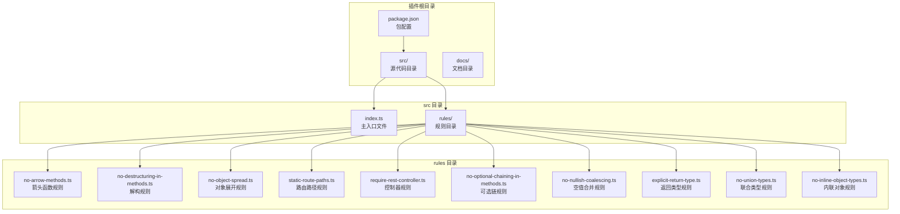
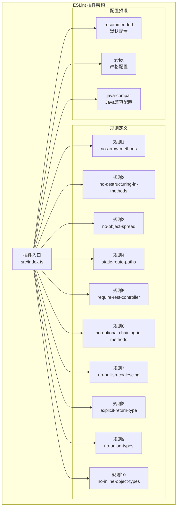
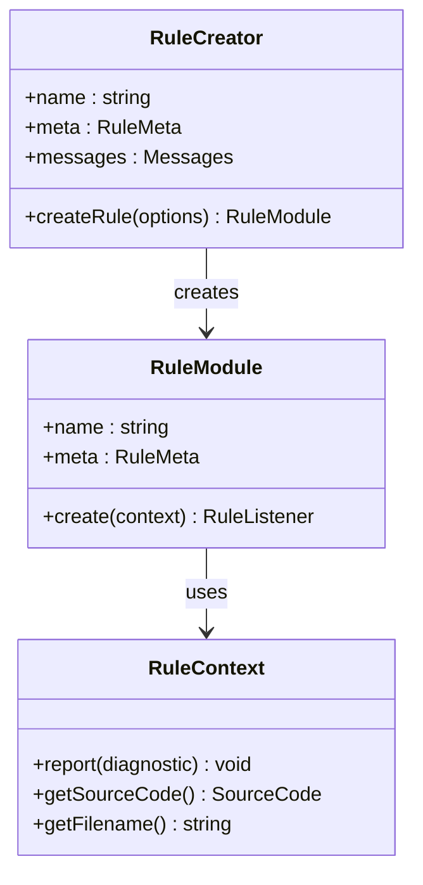
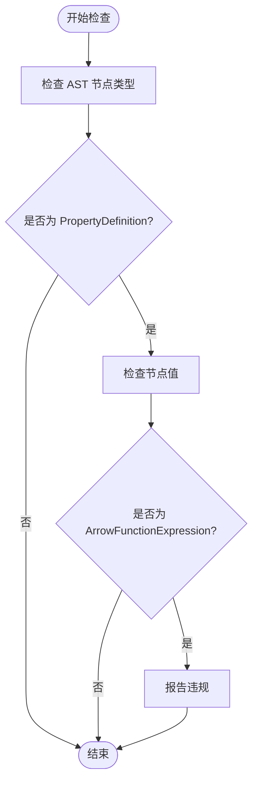
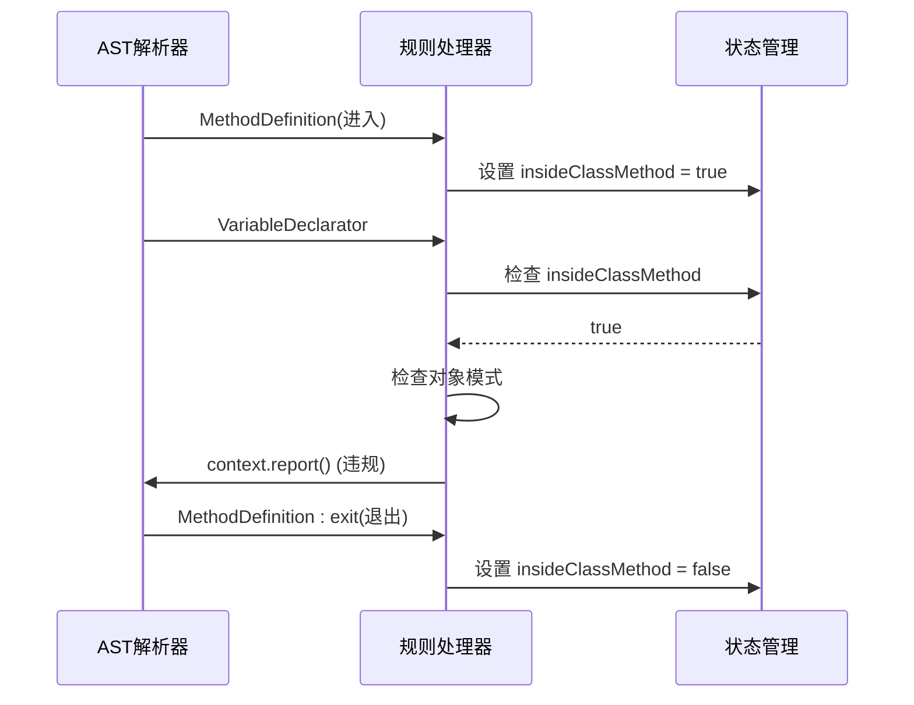
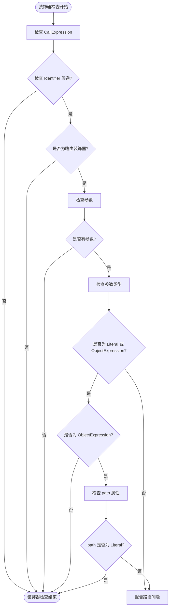

# Aiko Boot ESLint 插件

<cite>
**本文档引用的文件**
- [package.json](file://packages/eslint-plugin-aiko-boot/package.json)
- [index.ts](file://packages/eslint-plugin-aiko-boot/src/index.ts)
- [README.md](file://packages/eslint-plugin-aiko-boot/README.md)
- [no-arrow-methods.ts](file://packages/eslint-plugin-aiko-boot/src/rules/no-arrow-methods.ts)
- [no-destructuring-in-methods.ts](file://packages/eslint-plugin-aiko-boot/src/rules/no-destructuring-in-methods.ts)
- [no-object-spread.ts](file://packages/eslint-plugin-aiko-boot/src/rules/no-object-spread.ts)
- [static-route-paths.ts](file://packages/eslint-plugin-aiko-boot/src/rules/static-route-paths.ts)
- [require-rest-controller.ts](file://packages/eslint-plugin-aiko-boot/src/rules/require-rest-controller.ts)
- [no-optional-chaining-in-methods.ts](file://packages/eslint-plugin-aiko-boot/src/rules/no-optional-chaining-in-methods.ts)
- [no-nullish-coalescing.ts](file://packages/eslint-plugin-aiko-boot/src/rules/no-nullish-coalescing.ts)
- [explicit-return-type.ts](file://packages/eslint-plugin-aiko-boot/src/rules/explicit-return-type.ts)
- [no-union-types.ts](file://packages/eslint-plugin-aiko-boot/src/rules/no-union-types.ts)
- [no-inline-object-types.ts](file://packages/eslint-plugin-aiko-boot/src/rules/no-inline-object-types.ts)
</cite>

## 目录
1. [简介](#简介)
2. [项目结构](#项目结构)
3. [核心组件](#核心组件)
4. [架构概览](#架构概览)
5. [详细组件分析](#详细组件分析)
6. [依赖关系分析](#依赖关系分析)
7. [性能考虑](#性能考虑)
8. [故障排除指南](#故障排除指南)
9. [结论](#结论)

## 简介

Aiko Boot ESLint 插件是一个专门设计用于强制执行 Java 兼容 TypeScript 代码的 ESLint 插件。该插件的核心目标是确保代码能够顺利转换为 Java，特别适用于需要将 TypeScript 代码转译为 Java 的 Aiko Boot 框架项目。

该插件提供了九个专门的规则，涵盖了箭头函数方法、解构赋值、对象展开、路由路径静态化、REST 控制器要求、可选链、空值合并操作符、显式返回类型、联合类型和内联对象类型等多个方面，确保代码符合 Java 转换的要求。

## 项目结构

Aiko Boot ESLint 插件采用模块化的项目结构，主要包含以下核心部分：



**图表来源**
- [package.json](file://packages/eslint-plugin-aiko-boot/package.json#L1-L45)
- [index.ts](file://packages/eslint-plugin-aiko-boot/src/index.ts#L1-L79)

**章节来源**
- [package.json](file://packages/eslint-plugin-aiko-boot/package.json#L1-L45)
- [index.ts](file://packages/eslint-plugin-aiko-boot/src/index.ts#L1-L79)

## 核心组件

### 主入口文件

主入口文件负责导出插件的所有规则和配置预设。它定义了插件的基本元数据、规则集合以及三种不同的配置模式：recommended（推荐）、strict（严格）和 java-compat（Java 兼容）。

### 规则系统

插件包含九个专门的规则，每个规则都针对特定的 Java 不兼容特性进行检查：

1. **no-arrow-methods** - 禁止在类中使用箭头函数作为方法
2. **no-destructuring-in-methods** - 禁止在类方法中使用解构赋值
3. **no-object-spread** - 警告在类方法中使用对象展开
4. **static-route-paths** - 强制路由路径使用静态字符串字面量
5. **require-rest-controller** - 要求具有路由映射的方法必须有 @RestController 装饰器
6. **no-optional-chaining-in-methods** - 禁止在类方法中使用可选链操作符
7. **no-nullish-coalescing** - 禁止使用空值合并操作符
8. **explicit-return-type** - 要求类方法有显式的返回类型注解
9. **no-union-types** - 禁止使用联合类型（除了 T | null）
10. **no-inline-object-types** - 禁止在方法签名中使用内联对象类型

### 配置预设

插件提供了三种不同的配置预设，满足不同场景下的需求：

- **recommended**：默认推荐配置，包含基础的 Java 兼容性规则
- **strict**：严格模式配置，将所有规则提升为错误级别
- **java-compat**：完整的 Java 兼容性配置，包含所有可用规则

**章节来源**
- [index.ts](file://packages/eslint-plugin-aiko-boot/src/index.ts#L16-L79)

## 架构概览

Aiko Boot ESLint 插件遵循标准的 ESLint 插件架构，使用 TypeScript ESLint 工具库来创建规则。整个架构基于 AST（抽象语法树）遍历机制，通过监听特定的 AST 节点事件来执行规则检查。



**图表来源**
- [index.ts](file://packages/eslint-plugin-aiko-boot/src/index.ts#L16-L79)

## 详细组件分析

### 规则创建器模式

所有规则都使用相同的创建器模式，基于 `@typescript-eslint/utils` 库中的 `RuleCreator` 函数。这种模式提供了统一的规则结构，包括元数据定义、消息模板和 AST 监听器。



**图表来源**
- [no-arrow-methods.ts](file://packages/eslint-plugin-aiko-boot/src/rules/no-arrow-methods.ts#L7-L22)
- [no-destructuring-in-methods.ts](file://packages/eslint-plugin-aiko-boot/src/rules/no-destructuring-in-methods.ts#L8-L23)

### 箭头函数方法规则

`no-arrow-methods` 规则专门检查类中的属性定义，如果发现箭头函数表达式就会触发警告。这个规则基于 `PropertyDefinition` AST 节点进行检查。



**图表来源**
- [no-arrow-methods.ts](file://packages/eslint-plugin-aiko-boot/src/rules/no-arrow-methods.ts#L24-L38)

**章节来源**
- [no-arrow-methods.ts](file://packages/eslint-plugin-aiko-boot/src/rules/no-arrow-methods.ts#L1-L40)

### 解构赋值规则

`no-destructuring-in-methods` 规则使用状态跟踪机制来检测类方法中的解构赋值。它通过监听 `MethodDefinition` 事件来设置进入/退出标志，并在变量声明时检查对象模式。



**图表来源**
- [no-destructuring-in-methods.ts](file://packages/eslint-plugin-aiko-boot/src/rules/no-destructuring-in-methods.ts#L25-L46)

**章节来源**
- [no-destructuring-in-methods.ts](file://packages/eslint-plugin-aiko-boot/src/rules/no-destructuring-in-methods.ts#L1-L49)

### 对象展开规则

`no-object-spread` 规则与解构规则类似，但专门检查 `SpreadElement` 节点。它同样使用状态跟踪来确定当前是否在类方法内部。

**章节来源**
- [no-object-spread.ts](file://packages/eslint-plugin-aiko-boot/src/rules/no-object-spread.ts#L1-L46)

### 路由路径规则

`static-route-paths` 规则是最复杂的规则之一，它需要检查装饰器调用表达式并验证第一个参数是否为静态字符串字面量。



**图表来源**
- [static-route-paths.ts](file://packages/eslint-plugin-aiko-boot/src/rules/static-route-paths.ts#L35-L77)

**章节来源**
- [static-route-paths.ts](file://packages/eslint-plugin-aiko-boot/src/rules/static-route-paths.ts#L1-L80)

### REST 控制器规则

`require-rest-controller` 规则需要同时检查类装饰器和方法装饰器，确保具有路由映射方法的类都有 `@RestController` 装饰器。

**章节来源**
- [require-rest-controller.ts](file://packages/eslint-plugin-aiko-boot/src/rules/require-rest-controller.ts#L1-L80)

### 可选链规则

`no-optional-chaining-in-methods` 规则使用 `ChainExpression` 节点监听器来检测可选链操作符。与前面的规则类似，它也使用状态跟踪机制。

**章节来源**
- [no-optional-chaining-in-methods.ts](file://packages/eslint-plugin-aiko-boot/src/rules/no-optional-chaining-in-methods.ts#L1-L45)

### 空值合并规则

`no-nullish-coalescing` 规则专门检查 `LogicalExpression` 节点，当操作符为 `??` 时触发警告。

**章节来源**
- [no-nullish-coalescing.ts](file://packages/eslint-plugin-aiko-boot/src/rules/no-nullish-coalescing.ts#L1-L37)

### 显式返回类型规则

`explicit-return-type` 规则检查 `MethodDefinition` 节点，跳过构造函数并检查函数表达式的返回类型注解。

**章节来源**
- [explicit-return-type.ts](file://packages/eslint-plugin-aiko-boot/src/rules/explicit-return-type.ts#L1-L46)

### 联合类型规则

`no-union-types` 规则允许 `T | null` 形式的联合类型（转换为 Java 中的 `Optional<T>`），但禁止其他形式的联合类型。

**章节来源**
- [no-union-types.ts](file://packages/eslint-plugin-aiko-boot/src/rules/no-union-types.ts#L1-L48)

### 内联对象类型规则

`no-inline-object-types` 规则检查方法的返回类型和参数类型，不允许内联的对象类型字面量。

**章节来源**
- [no-inline-object-types.ts](file://packages/eslint-plugin-aiko-boot/src/rules/no-inline-object-types.ts#L1-L91)

## 依赖关系分析

Aiko Boot ESLint 插件的依赖关系相对简单，主要依赖于 TypeScript ESLint 工具库。

```mermaid
graph LR
subgraph "外部依赖"
ESLINT[eslint<br/>核心 ESLint 库]
TYPESCRIPT[typescript<br/>TypeScript 编译器]
PARSER[@typescript-eslint/parser<br/>TypeScript 解析器]
UTILS[@typescript-eslint/utils<br/>工具库]
end
subgraph "插件内部"
MAIN[主入口<br/>src/index.ts]
RULES[规则集合]
end
subgraph "规则实现"
RULE1[规则1]
RULE2[规则2]
RULE3[规则3]
RULE4[规则4]
RULE5[规则5]
RULE6[规则6]
RULE7[规则7]
RULE8[规则8]
RULE9[规则9]
RULE10[规则10]
end
ESLINT --> MAIN
TYPESCRIPT --> PARSER
PARSER --> UTILS
UTILS --> RULES
MAIN --> RULES
RULES --> RULE1
RULES --> RULE2
RULES --> RULE3
RULES --> RULE4
RULES --> RULE5
RULES --> RULE6
RULES --> RULE7
RULES --> RULE8
RULES --> RULE9
RULES --> RULE10
```

**图表来源**
- [package.json](file://packages/eslint-plugin-aiko-boot/package.json#L28-L43)

**章节来源**
- [package.json](file://packages/eslint-plugin-aiko-boot/package.json#L28-L43)

## 性能考虑

Aiko Boot ESLint 插件在设计时充分考虑了性能因素：

1. **AST 遍历优化**：每个规则只监听必要的 AST 节点类型，避免不必要的遍历开销
2. **早期退出**：在检查过程中使用条件判断实现早期退出，减少处理时间
3. **状态管理**：对于需要跨节点状态的规则（如方法体检查），使用高效的布尔标志管理
4. **选择性检查**：只对相关的 AST 节点类型进行检查，避免对整个代码库的全量扫描

## 故障排除指南

### 常见问题及解决方案

1. **规则未生效**
   - 检查 ESLint 配置文件中的插件导入
   - 确认 TypeScript 解析器正确配置
   - 验证规则名称拼写正确

2. **误报问题**
   - 检查是否在类方法外部使用了被禁止的特性
   - 确认装饰器使用方式符合预期
   - 验证路由路径是否为静态字符串

3. **配置冲突**
   - 检查不同配置预设之间的优先级
   - 确认自定义规则覆盖了默认规则
   - 验证 TypeScript 版本兼容性

### 调试技巧

1. **启用详细日志**：使用 ESLint 的调试功能查看规则执行过程
2. **简化测试**：创建最小化的测试用例来定位问题
3. **检查 AST 结构**：使用在线 AST 查看器验证代码结构

## 结论

Aiko Boot ESLint 插件是一个精心设计的工具，专门为 Java 兼容性需求而构建。通过九个专门的规则和三种配置预设，它能够有效地确保 TypeScript 代码符合 Java 转换的要求。

该插件的主要优势包括：

1. **全面的覆盖范围**：涵盖了从语法特性到架构设计的多个方面
2. **灵活的配置选项**：提供从推荐到严格的多种配置模式
3. **清晰的错误信息**：每个规则都提供了明确的错误描述和改进建议
4. **良好的性能表现**：优化的 AST 遍历和检查逻辑

对于需要将 TypeScript 代码转换为 Java 的项目，Aiko Boot ESLint 插件是一个不可或缺的工具，能够帮助开发者编写更加规范和可移植的代码。