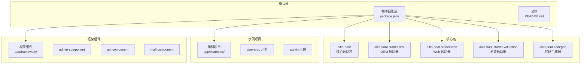
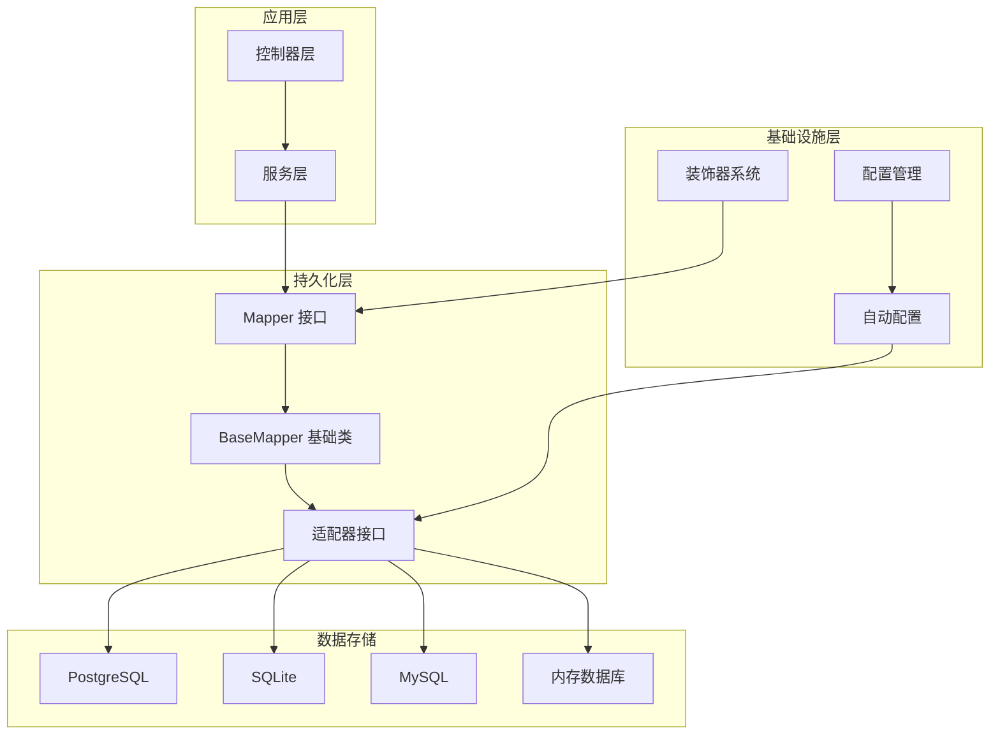
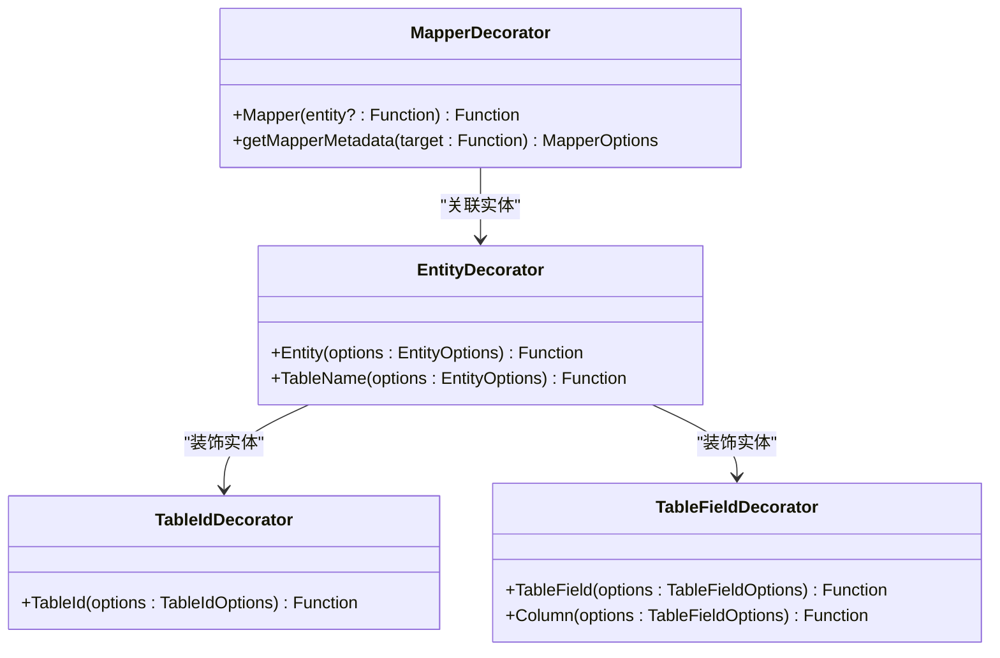
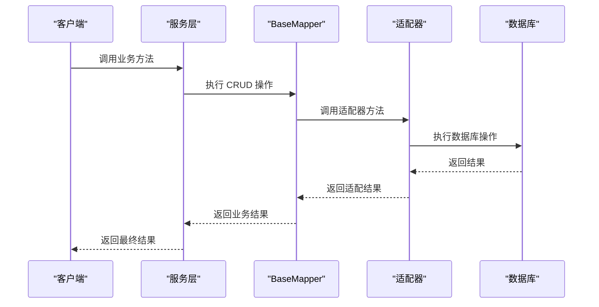
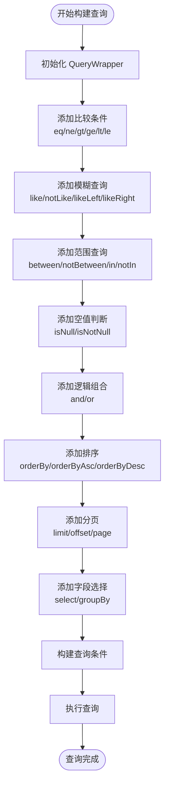
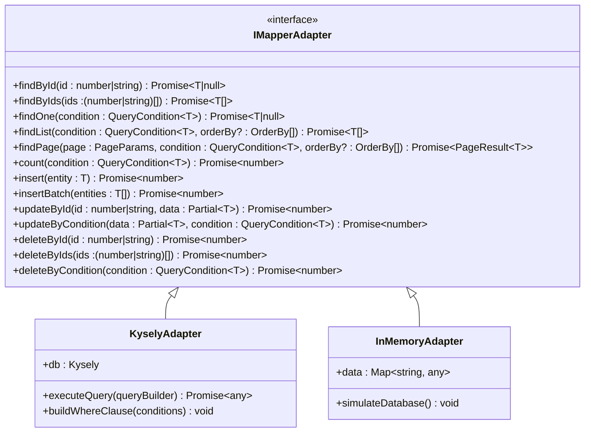
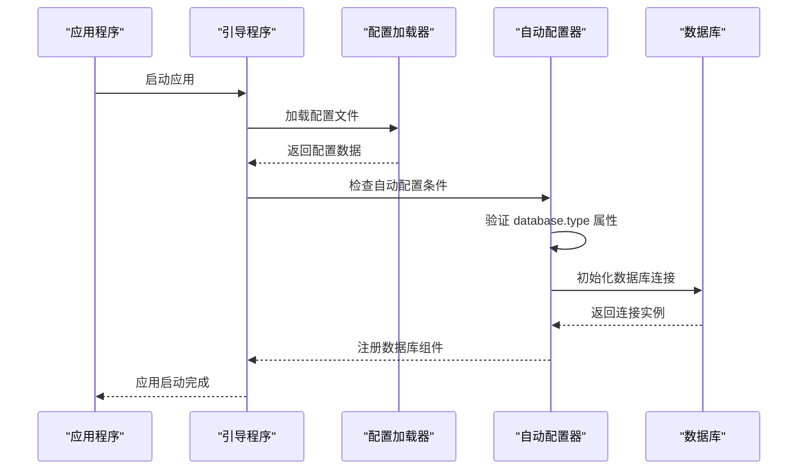
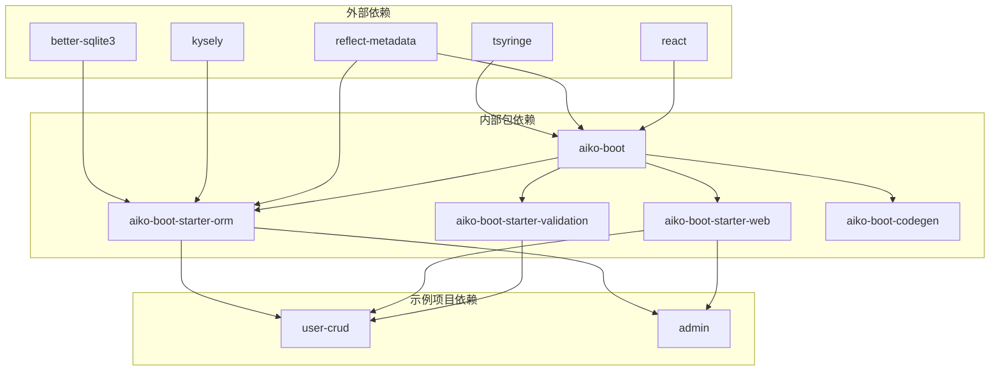

# Aiko Boot ORM 启动器

<cite>
**本文档引用的文件**
- [README.md](file://README.md)
- [package.json](file://package.json)
- [packages/aiko-boot-starter-orm/package.json](file://packages/aiko-boot-starter-orm/package.json)
- [packages/aiko-boot-starter-orm/src/index.ts](file://packages/aiko-boot-starter-orm/src/index.ts)
- [packages/aiko-boot-starter-orm/src/decorators.ts](file://packages/aiko-boot-starter-orm/src/decorators.ts)
- [packages/aiko-boot-starter-orm/src/base-mapper.ts](file://packages/aiko-boot-starter-orm/src/base-mapper.ts)
- [packages/aiko-boot-starter-orm/src/wrapper.ts](file://packages/aiko-boot-starter-orm/src/wrapper.ts)
- [packages/aiko-boot-starter-orm/src/auto-configuration.ts](file://packages/aiko-boot-starter-orm/src/auto-configuration.ts)
- [packages/aiko-boot-starter-orm/src/adapters/index.ts](file://packages/aiko-boot-starter-orm/src/adapters/index.ts)
- [packages/aiko-boot-starter-orm/src/adapters/kysely-adapter.ts](file://packages/aiko-boot-starter-orm/src/adapters/kysely-adapter.ts)
- [packages/aiko-boot-starter-orm/src/adapters/in-memory-adapter.ts](file://packages/aiko-boot-starter-orm/src/adapters/in-memory-adapter.ts)
- [packages/aiko-boot-starter-orm/src/database.ts](file://packages/aiko-boot-starter-orm/src/database.ts)
- [packages/aiko-boot-starter-orm/src/config.ts](file://packages/aiko-boot-starter-orm/src/config.ts)
- [packages/aiko-boot-starter-orm/src/config-augment.ts](file://packages/aiko-boot-starter-orm/src/config-augment.ts)
- [packages/aiko-boot/src/index.ts](file://packages/aiko-boot/src/index.ts)
- [packages/aiko-boot/src/boot/bootstrap.ts](file://packages/aiko-boot/src/boot/bootstrap.ts)
- [packages/aiko-boot/src/boot/auto-configuration.ts](file://packages/aiko-boot/src/boot/auto-configuration.ts)
- [packages/aiko-boot/src/di/container.ts](file://packages/aiko-boot/src/di/container.ts)
- [packages/aiko-boot/src/di/decorators.ts](file://packages/aiko-boot/src/di/decorators.ts)
</cite>

## 目录
1. [简介](#简介)
2. [项目结构](#项目结构)
3. [核心组件](#核心组件)
4. [架构概览](#架构概览)
5. [详细组件分析](#详细组件分析)
6. [依赖关系分析](#依赖关系分析)
7. [性能考虑](#性能考虑)
8. [故障排除指南](#故障排除指南)
9. [结论](#结论)

## 简介

Aiko Boot ORM 启动器是一个基于 TypeScript 的全栈开发框架，采用 MyBatis-Plus 风格的 API 设计，让 AI 能够理解和生成全栈应用代码。该启动器提供了完整的 ORM 解决方案，支持多种数据库（PostgreSQL、SQLite、MySQL），并通过装饰器提供类型安全的数据库操作。

该项目的核心特性包括：
- **AI 原生设计**：使用 TypeScript/React/Next.js，符合 AI 最熟悉的语言生态
- **代码优先**：代码即设计，无需学习新 DSL
- **类型安全**：通过 TypeScript 和装饰器保证代码质量
- **Java 兼容**：TypeScript 代码可转换为 Java Spring Boot + MyBatis-Plus
- **Spring Boot 风格**：提供类似 Spring Boot 的自动配置和依赖注入机制

## 项目结构

Aiko Boot 采用 monorepo 结构，包含多个相互关联的包：

**图表来源**
- [package.json](file://package.json#L1-L32)
- [README.md](file://README.md#L14-L33)

**章节来源**
- [README.md](file://README.md#L14-L33)
- [package.json](file://package.json#L1-L32)

## 核心组件

Aiko Boot ORM 启动器由以下核心组件构成：

### 1. 装饰器系统
提供与 MyBatis-Plus 兼容的装饰器，支持实体映射、字段映射和 Mapper 标记。

### 2. BaseMapper 基础映射器
提供类似 MyBatis-Plus 的基础 CRUD 操作接口，支持分页查询和批量操作。

### 3. QueryWrapper 条件构造器
实现 MyBatis-Plus 风格的条件查询构造器，支持复杂查询条件的链式构建。

### 4. 适配器模式
通过适配器模式支持不同的数据库实现，当前支持 Kysely 和内存数据库。

### 5. 自动配置系统
基于 Spring Boot 风格的自动配置机制，根据配置文件自动初始化数据库连接。

**章节来源**
- [packages/aiko-boot-starter-orm/src/index.ts](file://packages/aiko-boot-starter-orm/src/index.ts#L1-L91)

## 架构概览

Aiko Boot ORM 启动器采用分层架构设计，各层职责清晰分离：

**图表来源**
- [packages/aiko-boot-starter-orm/src/decorators.ts](file://packages/aiko-boot-starter-orm/src/decorators.ts#L1-L224)
- [packages/aiko-boot-starter-orm/src/base-mapper.ts](file://packages/aiko-boot-starter-orm/src/base-mapper.ts#L38-L384)
- [packages/aiko-boot-starter-orm/src/auto-configuration.ts](file://packages/aiko-boot-starter-orm/src/auto-configuration.ts#L56-L135)

## 详细组件分析

### 装饰器系统

装饰器系统是 Aiko Boot ORM 的核心特性之一，提供了与 MyBatis-Plus 完全兼容的实体映射能力。

#### 实体装饰器

**图表来源**
- [packages/aiko-boot-starter-orm/src/decorators.ts](file://packages/aiko-boot-starter-orm/src/decorators.ts#L65-L193)

装饰器系统支持以下功能：

1. **实体映射**：通过 `@Entity` 或 `@TableName` 装饰器标记实体类
2. **主键标识**：使用 `@TableId` 装饰器标识主键字段
3. **字段映射**：使用 `@TableField` 或 `@Column` 装饰器标识普通字段
4. **Mapper 标记**：使用 `@Mapper` 装饰器标记数据访问层接口

**章节来源**
- [packages/aiko-boot-starter-orm/src/decorators.ts](file://packages/aiko-boot-starter-orm/src/decorators.ts#L65-L193)

### BaseMapper 基础映射器

BaseMapper 提供了完整的 CRUD 操作接口，与 MyBatis-Plus 的 BaseMapper 保持完全一致的 API 设计。

#### CRUD 操作流程

**图表来源**
- [packages/aiko-boot-starter-orm/src/base-mapper.ts](file://packages/aiko-boot-starter-orm/src/base-mapper.ts#L77-L205)

BaseMapper 支持的操作包括：
- **查询操作**：按 ID 查询、批量查询、条件查询、分页查询、统计查询
- **插入操作**：单条插入、批量插入
- **更新操作**：按 ID 更新、条件更新
- **删除操作**：按 ID 删除、批量删除、条件删除

**章节来源**
- [packages/aiko-boot-starter-orm/src/base-mapper.ts](file://packages/aiko-boot-starter-orm/src/base-mapper.ts#L39-L384)

### QueryWrapper 条件构造器

QueryWrapper 实现了 MyBatis-Plus 风格的条件查询构造器，提供了丰富的查询条件构建能力。

#### 查询条件构建流程

**图表来源**
- [packages/aiko-boot-starter-orm/src/wrapper.ts](file://packages/aiko-boot-starter-orm/src/wrapper.ts#L49-L350)

QueryWrapper 支持的查询条件包括：
- **比较操作符**：等于、不等于、大于、大于等于、小于、小于等于
- **模糊查询**：包含、前缀匹配、后缀匹配
- **范围查询**：区间查询、非区间查询、集合查询、非集合查询
- **空值判断**：空值检查、非空值检查
- **逻辑组合**：AND/OR 组合查询
- **排序和分页**：多字段排序、分页查询
- **字段选择**：指定查询字段、分组查询

**章节来源**
- [packages/aiko-boot-starter-orm/src/wrapper.ts](file://packages/aiko-boot-starter-orm/src/wrapper.ts#L49-L476)

### 适配器模式实现

适配器模式是 Aiko Boot ORM 的核心设计模式，通过统一的适配器接口支持不同的数据库实现。

#### 适配器架构

**图表来源**
- [packages/aiko-boot-starter-orm/src/base-mapper.ts](file://packages/aiko-boot-starter-orm/src/base-mapper.ts#L362-L383)
- [packages/aiko-boot-starter-orm/src/adapters/kysely-adapter.ts](file://packages/aiko-boot-starter-orm/src/adapters/kysely-adapter.ts)
- [packages/aiko-boot-starter-orm/src/adapters/in-memory-adapter.ts](file://packages/aiko-boot-starter-orm/src/adapters/in-memory-adapter.ts)

**章节来源**
- [packages/aiko-boot-starter-orm/src/adapters/index.ts](file://packages/aiko-boot-starter-orm/src/adapters/index.ts)
- [packages/aiko-boot-starter-orm/src/adapters/kysely-adapter.ts](file://packages/aiko-boot-starter-orm/src/adapters/kysely-adapter.ts)
- [packages/aiko-boot-starter-orm/src/adapters/in-memory-adapter.ts](file://packages/aiko-boot-starter-orm/src/adapters/in-memory-adapter.ts)

### 自动配置系统

自动配置系统基于 Spring Boot 风格，能够根据配置文件自动初始化数据库连接和相关组件。

#### 自动配置流程

**图表来源**
- [packages/aiko-boot-starter-orm/src/auto-configuration.ts](file://packages/aiko-boot-starter-orm/src/auto-configuration.ts#L61-L135)

自动配置支持的数据库类型：
- **SQLite**：适用于开发和测试环境
- **PostgreSQL**：适用于生产环境
- **MySQL**：适用于企业级应用

**章节来源**
- [packages/aiko-boot-starter-orm/src/auto-configuration.ts](file://packages/aiko-boot-starter-orm/src/auto-configuration.ts#L56-L135)

## 依赖关系分析

Aiko Boot ORM 启动器的依赖关系体现了清晰的分层架构：

**图表来源**
- [packages/aiko-boot-starter-orm/package.json](file://packages/aiko-boot-starter-orm/package.json#L24-L44)
- [packages/aiko-boot/package.json](file://packages/aiko-boot/package.json#L35-L38)
- [packages/aiko-boot-starter-web/package.json](file://packages/aiko-boot-starter-web/package.json#L32-L36)

**章节来源**
- [packages/aiko-boot-starter-orm/package.json](file://packages/aiko-boot-starter-orm/package.json#L24-L44)
- [packages/aiko-boot/package.json](file://packages/aiko-boot/package.json#L35-L38)
- [packages/aiko-boot-starter-web/package.json](file://packages/aiko-boot-starter-web/package.json#L32-L36)

## 性能考虑

Aiko Boot ORM 启动器在设计时充分考虑了性能优化：

### 1. 适配器模式的优势
- **运行时优化**：不同数据库的适配器可以针对特定数据库进行优化
- **延迟初始化**：数据库连接采用延迟初始化策略
- **连接池管理**：支持数据库连接池配置

### 2. 查询优化
- **条件缓存**：QueryWrapper 的条件构建结果可以被缓存复用
- **批量操作**：支持批量插入和批量更新操作
- **分页查询**：内置分页查询优化

### 3. 内存管理
- **适配器生命周期**：适配器实例的创建和销毁遵循最佳实践
- **资源清理**：自动配置系统负责资源的正确清理

## 故障排除指南

### 常见问题及解决方案

#### 1. 数据库连接失败
**症状**：应用启动时报数据库连接错误
**解决方案**：
- 检查配置文件中的数据库连接参数
- 确认数据库服务正在运行
- 验证网络连接和防火墙设置

#### 2. 装饰器元数据丢失
**症状**：实体类无法被正确识别
**解决方案**：
- 确保已导入 `reflect-metadata`
- 检查装饰器的使用方式是否正确
- 验证 TypeScript 编译配置

#### 3. Mapper 适配器未设置
**症状**：调用 CRUD 方法时报适配器未设置错误
**解决方案**：
- 确保使用 `@Mapper` 装饰器标记 Mapper 类
- 检查自动配置是否正常工作
- 手动设置适配器或依赖注入

#### 4. 查询条件无效
**症状**：QueryWrapper 构建的查询条件不生效
**解决方案**：
- 检查字段名称是否与数据库列名匹配
- 验证查询条件的逻辑组合
- 确认适配器支持相应的查询功能

**章节来源**
- [packages/aiko-boot-starter-orm/src/base-mapper.ts](file://packages/aiko-boot-starter-orm/src/base-mapper.ts#L68-L73)
- [packages/aiko-boot-starter-orm/src/decorators.ts](file://packages/aiko-boot-starter-orm/src/decorators.ts#L164-L172)

## 结论

Aiko Boot ORM 启动器是一个设计精良的全栈开发框架，具有以下显著优势：

### 技术优势
- **类型安全**：完整的 TypeScript 类型支持，提供编译时错误检测
- **API 一致性**：与 MyBatis-Plus 保持完全一致的 API 设计
- **可扩展性**：基于适配器模式，易于扩展新的数据库支持
- **自动化程度高**：智能的自动配置和依赖注入机制

### 开发体验
- **AI 友好**：符合 AI 最熟悉的语言生态
- **代码即设计**：无需学习新的 DSL，直接使用熟悉的编程语言
- **快速开发**：提供丰富的 CRUD 操作和查询构造器
- **Java 兼容**：支持 TypeScript 到 Java 的代码转换

### 适用场景
- **快速原型开发**：适合需要快速搭建原型的应用
- **企业级应用**：支持复杂的业务逻辑和数据模型
- **多数据库支持**：适用于需要支持多种数据库的场景
- **团队协作**：提供统一的开发规范和最佳实践

Aiko Boot ORM 启动器通过其优雅的设计和强大的功能，为现代全栈应用开发提供了高效、可靠的解决方案。随着项目的不断发展和完善，它有望成为 AI 驱动开发的重要工具之一。