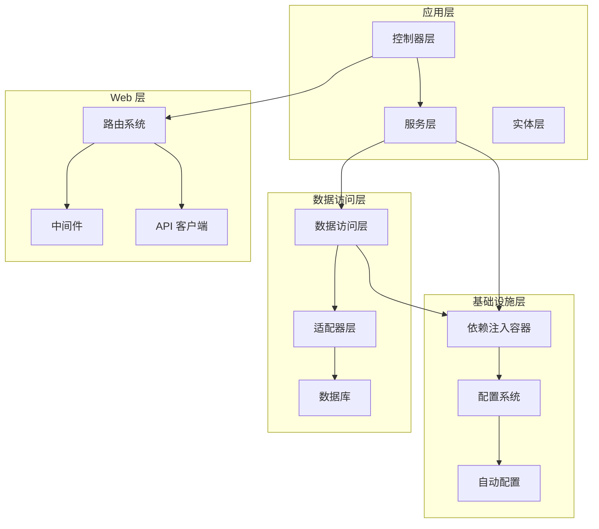
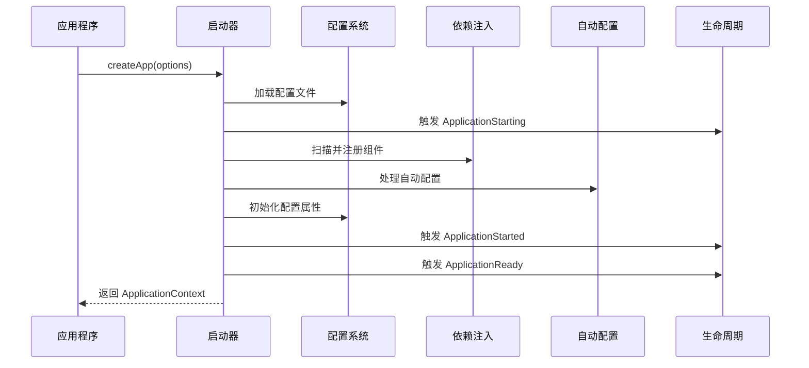
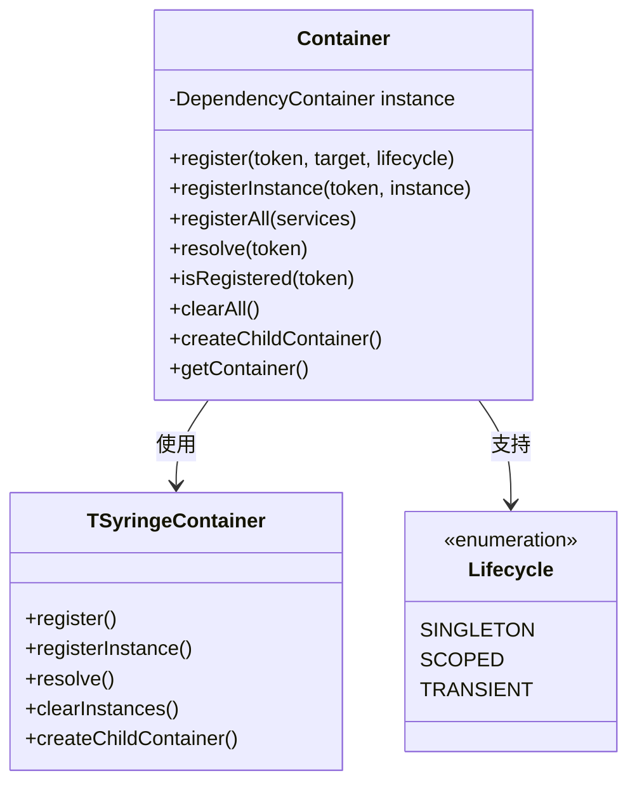
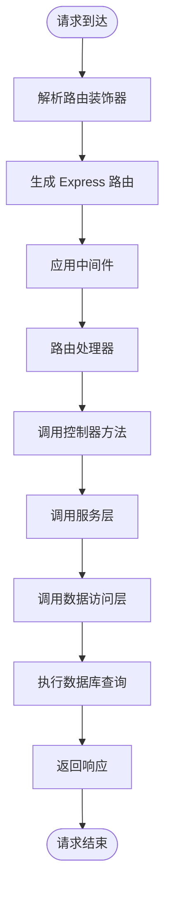
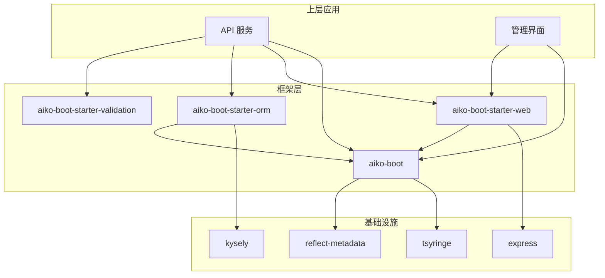

# Aiko Boot Web 启动器

<cite>
**本文档引用的文件**
- [README.md](file://README.md)
- [package.json](file://package.json)
- [pnpm-workspace.yaml](file://pnpm-workspace.yaml)
- [packages/aiko-boot/package.json](file://packages/aiko-boot/package.json)
- [packages/aiko-boot/src/index.ts](file://packages/aiko-boot/src/index.ts)
- [packages/aiko-boot/src/boot/bootstrap.ts](file://packages/aiko-boot/src/boot/bootstrap.ts)
- [packages/aiko-boot/src/di/container.ts](file://packages/aiko-boot/src/di/container.ts)
- [packages/aiko-boot-starter-web/package.json](file://packages/aiko-boot-starter-web/package.json)
- [packages/aiko-boot-starter-web/src/index.ts](file://packages/aiko-boot-starter-web/src/index.ts)
- [packages/aiko-boot-starter-orm/package.json](file://packages/aiko-boot-starter-orm/package.json)
- [packages/aiko-boot-starter-orm/src/index.ts](file://packages/aiko-boot-starter-orm/src/index.ts)
- [app/examples/user-crud/packages/api/package.json](file://app/examples/user-crud/packages/api/package.json)
- [app/examples/user-crud/packages/admin/package.json](file://app/examples/user-crud/packages/admin/package.json)
</cite>

## 目录
1. [简介](#简介)
2. [项目结构](#项目结构)
3. [核心组件](#核心组件)
4. [架构概览](#架构概览)
5. [详细组件分析](#详细组件分析)
6. [依赖关系分析](#依赖关系分析)
7. [性能考虑](#性能考虑)
8. [故障排除指南](#故障排除指南)
9. [结论](#结论)

## 简介

Aiko Boot 是一个基于 TypeScript + Next.js 的全栈开发框架，采用 Spring Boot 风格的设计理念，让 AI 能够理解和生成全栈应用代码。该框架的核心特性包括：

- **AI 原生**: 使用 AI 最熟悉的语言 (TypeScript/React/Next.js)
- **代码优先**: 代码即设计，无需学习新 DSL
- **类型安全**: TypeScript + 装饰器保证代码质量
- **Java 兼容**: TypeScript 代码可一键转换为 Java Spring Boot + MyBatis-Plus 项目

框架采用 monorepo 结构，包含核心启动包、Web 启动器、ORM 启动器等多个模块，以及完整的示例项目。

## 项目结构

该项目采用 pnpm workspace 的 monorepo 结构，主要包含以下核心部分：

```mermaid
graph TB
subgraph "根目录"
Root[项目根目录]
PackageJSON[package.json]
Workspace[pnpm-workspace.yaml]
README[README.md]
end
subgraph "核心包 packages/"
Boot[aiko-boot<br/>核心启动包]
Web[aiko-boot-starter-web<br/>Web 启动器]
ORM[aiko-boot-starter-orm<br/>ORM 启动器]
Validation[aiko-boot-starter-validation<br/>验证启动器]
Codegen[aiko-boot-codegen<br/>代码生成器]
ESLint[eslint-plugin-aiko-boot<br/>ESLint 插件]
end
subgraph "示例应用 app/examples/"
UserCRUD[user-crud<br/>用户 CRUD 示例]
Admin[admin<br/>管理界面示例]
end
subgraph "框架组件 app/framework/"
AdminComponent[admin-component<br/>管理组件库]
APIComponent[api-component<br/>API 组件库]
MallComponent[mall-component<br/>商城组件库]
end
Root --> PackageJSON
Root --> Workspace
Root --> Boot
Root --> Web
Root --> ORM
Root --> Validation
Root --> Codegen
Root --> UserCRUD
Root --> Admin
Root --> AdminComponent
Root --> APIComponent
Root --> MallComponent
```



**图表来源**
- [pnpm-workspace.yaml](file://pnpm-workspace.yaml#L1-L6)
- [package.json](file://package.json#L1-L32)

**章节来源**
- [README.md](file://README.md#L14-L33)
- [pnpm-workspace.yaml](file://pnpm-workspace.yaml#L1-L6)

## 核心组件

### Aiko Boot 核心启动包

Aiko Boot 核心启动包提供了 Spring Boot 风格的依赖注入和自动配置功能：

- **依赖注入容器**: 基于 tsyringe 的 IoC 容器
- **装饰器系统**: @Service、@Component、@Transactional 等
- **自动配置**: 基于条件注解的自动配置机制
- **生命周期管理**: 应用启动、运行、关闭的完整生命周期

### Aiko Boot Starter Web

Web 启动器提供 Spring Boot 风格的 Web 开发体验：

- **HTTP 装饰器**: @RestController、@GetMapping、@PostMapping 等
- **Express 集成**: 自动路由生成和中间件支持
- **API 客户端**: Feign 风格的 API 调用客户端
- **配置扩展**: 服务器配置和路由配置

### Aiko Boot Starter ORM

ORM 启动器提供 MyBatis-Plus 风格的数据访问层：

- **实体装饰器**: @Entity、@TableName、@TableId、@TableField
- **数据访问器**: BaseMapper 提供通用 CRUD 操作
- **查询构建器**: QueryWrapper 支持链式条件查询
- **多数据库支持**: PostgreSQL、SQLite、MySQL

**章节来源**
- [packages/aiko-boot/src/index.ts](file://packages/aiko-boot/src/index.ts#L1-L64)
- [packages/aiko-boot-starter-web/src/index.ts](file://packages/aiko-boot-starter-web/src/index.ts#L1-L73)
- [packages/aiko-boot-starter-orm/src/index.ts](file://packages/aiko-boot-starter-orm/src/index.ts#L1-L91)

## 架构概览

Aiko Boot 采用分层架构设计，各组件通过装饰器和自动配置机制协同工作：



**图表来源**
- [packages/aiko-boot/src/boot/bootstrap.ts](file://packages/aiko-boot/src/boot/bootstrap.ts#L115-L289)
- [packages/aiko-boot-starter-web/src/index.ts](file://packages/aiko-boot-starter-web/src/index.ts#L1-L73)
- [packages/aiko-boot-starter-orm/src/index.ts](file://packages/aiko-boot-starter-orm/src/index.ts#L1-L91)

## 详细组件分析

### 应用启动流程

Aiko Boot 的应用启动遵循 Spring Boot 的设计理念，包含完整的生命周期管理：



**图表来源**
- [packages/aiko-boot/src/boot/bootstrap.ts](file://packages/aiko-boot/src/boot/bootstrap.ts#L132-L289)

启动流程的关键步骤包括：

1. **配置加载**: 支持多种格式的配置文件（app.config.ts、json、yaml）
2. **组件扫描**: 自动发现和注册服务、映射器、控制器
3. **自动配置**: 基于条件注解的应用程序配置
4. **生命周期管理**: 完整的应用启动生命周期事件

**章节来源**
- [packages/aiko-boot/src/boot/bootstrap.ts](file://packages/aiko-boot/src/boot/bootstrap.ts#L115-L289)

### 依赖注入系统

Aiko Boot 使用 tsyringe 作为底层依赖注入容器，提供灵活的生命周期管理：



**图表来源**
- [packages/aiko-boot/src/di/container.ts](file://packages/aiko-boot/src/di/container.ts#L22-L104)

依赖注入系统的特点：

- **多种生命周期**: 支持单例、作用域、瞬态三种模式
- **批量注册**: 支持一次性注册多个服务
- **子容器**: 支持创建作用域隔离的子容器
- **类型安全**: 完整的 TypeScript 类型支持

**章节来源**
- [packages/aiko-boot/src/di/container.ts](file://packages/aiko-boot/src/di/container.ts#L1-L105)

### Web 路由系统

Web 启动器提供 Spring Boot 风格的 HTTP 装饰器和路由生成：



**图表来源**
- [packages/aiko-boot-starter-web/src/index.ts](file://packages/aiko-boot-starter-web/src/index.ts#L1-L73)

Web 路由系统的核心功能：

- **装饰器驱动**: 使用 @RestController、@GetMapping 等装饰器定义路由
- **自动路由生成**: 基于装饰器元数据自动生成 Express 路由
- **参数绑定**: 自动处理路径参数、查询参数、请求体等
- **API 客户端**: 提供类型安全的 API 调用客户端

**章节来源**
- [packages/aiko-boot-starter-web/src/index.ts](file://packages/aiko-boot-starter-web/src/index.ts#L1-L73)

### ORM 数据访问层

ORM 启动器提供 MyBatis-Plus 风格的数据访问抽象：

```mermaid
erDiagram
ENTITY {
int id PK
string name
datetime created_at
datetime updated_at
}
BASE_MAPPER {
+selectById()
+selectList()
+selectPage()
+insert()
+update()
+deleteById()
}
QUERY_WRAPPER {
+eq()
+ne()
+gt()
+like()
+orderByAsc()
+orderByDesc()
}
ADAPTER {
+executeSelect()
+executeInsert()
+executeUpdate()
+executeDelete()
}
ENTITY ||--|| BASE_MAPPER : 使用
BASE_MAPPER ||--|| QUERY_WRAPPER : 查询
BASE_MAPPER ||--|| ADAPTER : 适配
```

**图表来源**
- [packages/aiko-boot-starter-orm/src/index.ts](file://packages/aiko-boot-starter-orm/src/index.ts#L1-L91)

ORM 系统的核心特性：

- **实体映射**: 使用装饰器定义实体和表结构
- **通用 CRUD**: BaseMapper 提供完整的数据操作方法
- **链式查询**: QueryWrapper 支持复杂的查询条件组合
- **多数据库**: 支持 PostgreSQL、SQLite、MySQL 等数据库

**章节来源**
- [packages/aiko-boot-starter-orm/src/index.ts](file://packages/aiko-boot-starter-orm/src/index.ts#L1-L91)

## 依赖关系分析

项目采用清晰的依赖层次结构，确保模块间的松耦合：



**图表来源**
- [packages/aiko-boot/package.json](file://packages/aiko-boot/package.json#L35-L38)
- [packages/aiko-boot-starter-web/package.json](file://packages/aiko-boot-starter-web/package.json#L32-L37)
- [packages/aiko-boot-starter-orm/package.json](file://packages/aiko-boot-starter-orm/package.json#L24-L29)

依赖关系特点：

- **核心依赖**: aiko-boot 为核心，其他模块都依赖它
- **可选依赖**: 各启动器模块相互独立，可根据需要选择
- **运行时依赖**: 仅在运行时需要，开发时依赖在各自包中声明
- **版本管理**: 使用 workspace:* 确保版本一致性

**章节来源**
- [packages/aiko-boot/package.json](file://packages/aiko-boot/package.json#L1-L61)
- [packages/aiko-boot-starter-web/package.json](file://packages/aiko-boot-starter-web/package.json#L1-L60)
- [packages/aiko-boot-starter-orm/package.json](file://packages/aiko-boot-starter-orm/package.json#L1-L55)

## 性能考虑

Aiko Boot 在设计时充分考虑了性能优化：

### 启动性能
- **延迟加载**: 组件按需加载，避免不必要的初始化
- **缓存策略**: 配置和元数据信息进行缓存
- **并行处理**: 多个模块可以并行初始化

### 运行时性能
- **依赖注入优化**: 使用 tsyringe 提供高效的依赖解析
- **连接池管理**: ORM 层面的数据库连接池优化
- **内存管理**: 合理的生命周期管理减少内存泄漏

### 开发体验
- **热重载**: 支持开发时的快速重启
- **类型检查**: 编译时类型检查提升代码质量
- **自动配置**: 减少样板代码，提高开发效率

## 故障排除指南

### 常见问题及解决方案

**启动失败**
- 检查配置文件格式和内容
- 确认数据库连接配置正确
- 验证装饰器使用是否符合规范

**依赖注入问题**
- 确保装饰器正确添加到类上
- 检查生命周期设置是否合适
- 验证循环依赖情况

**路由不生效**
- 确认控制器类被正确扫描
- 检查装饰器参数配置
- 验证路由路径设置

**数据库连接问题**
- 检查数据库服务状态
- 验证连接字符串配置
- 确认数据库权限设置

**章节来源**
- [packages/aiko-boot/src/boot/bootstrap.ts](file://packages/aiko-boot/src/boot/bootstrap.ts#L325-L330)

## 结论

Aiko Boot Web 启动器是一个设计精良的全栈开发框架，具有以下优势：

1. **统一的开发体验**: Spring Boot 风格的设计让开发者能够快速上手
2. **模块化架构**: 清晰的模块划分便于维护和扩展
3. **类型安全**: 完整的 TypeScript 支持确保代码质量
4. **AI 友好**: 代码结构简单直观，便于 AI 理解和生成
5. **生产就绪**: 包含完整的生命周期管理和错误处理机制

该框架特别适合需要快速开发、具有良好可维护性的全栈应用项目。通过合理的模块化设计和丰富的工具链支持，开发者可以专注于业务逻辑的实现，而不需要过多关注基础设施的搭建。