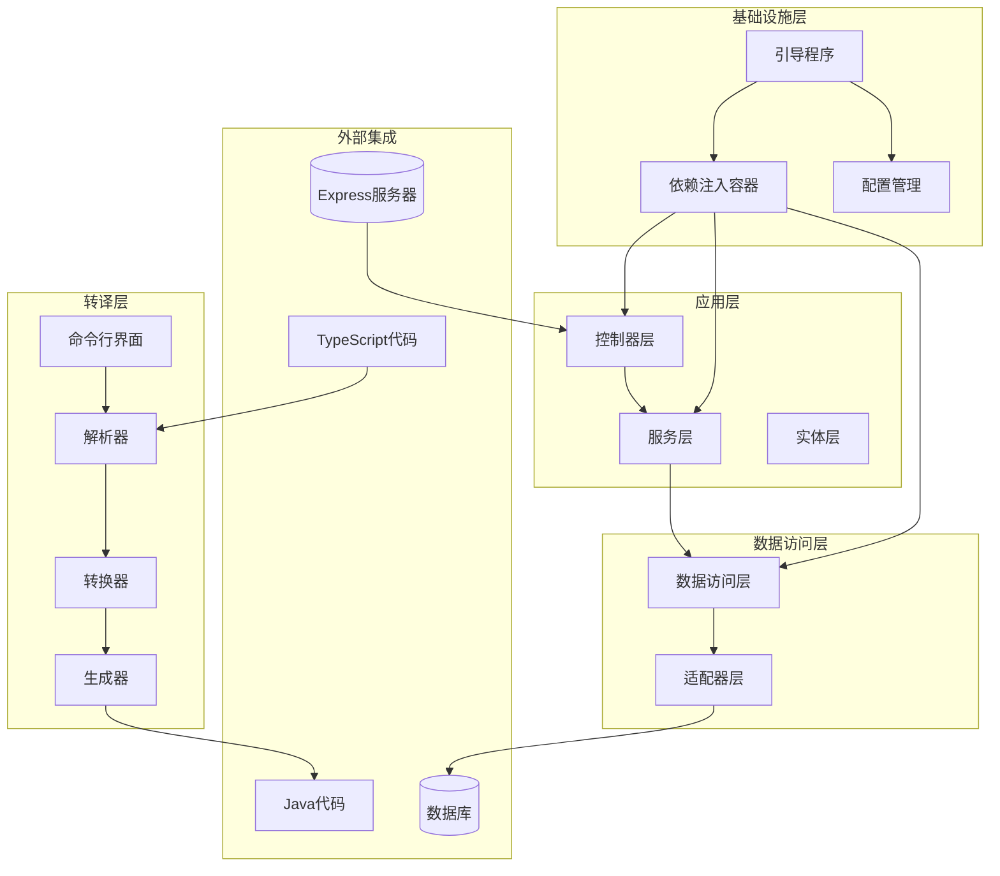
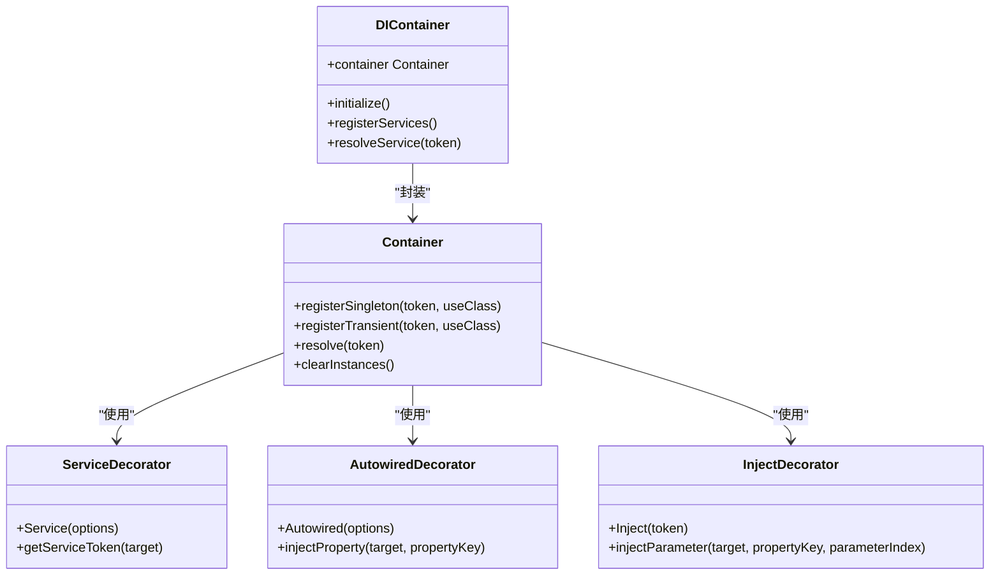
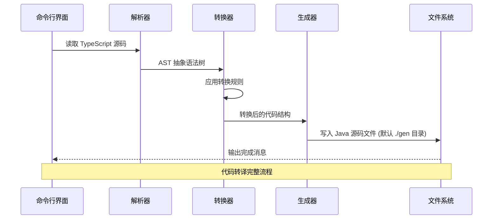
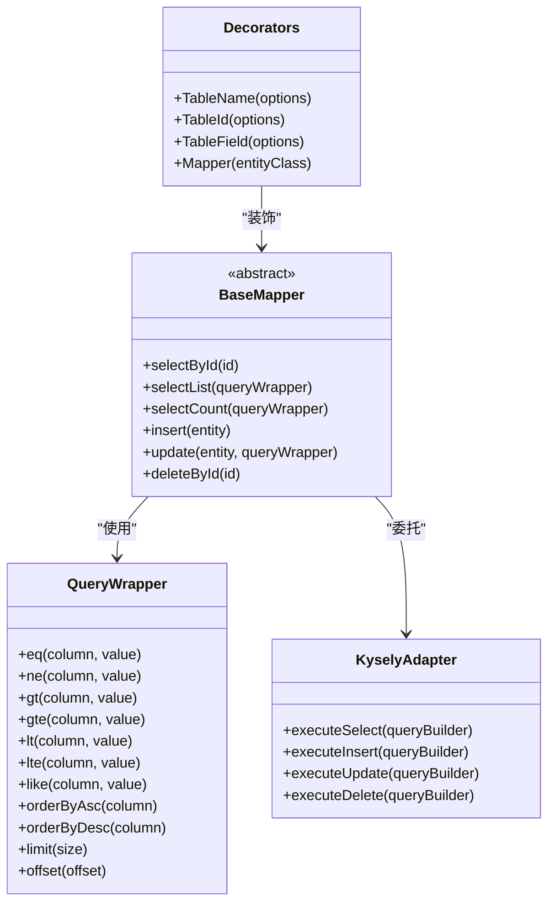
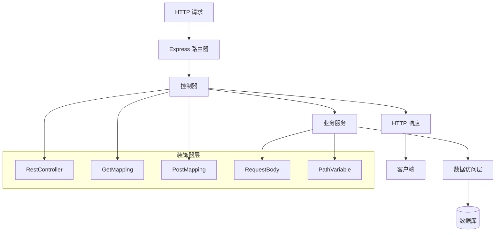
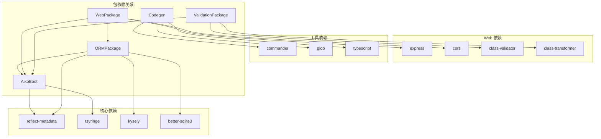

# Aiko Boot 代码转译器

<cite>
**本文档引用的文件**
- [README.md](file://README.md)
- [package.json](file://package.json)
- [pnpm-workspace.yaml](file://pnpm-workspace.yaml)
- [aiko-boot/package.json](file://packages/aiko-boot/package.json)
- [aiko-boot-codegen/package.json](file://packages/aiko-boot-codegen/package.json)
- [aiko-boot-starter-orm/package.json](file://packages/aiko-boot-starter-orm/package.json)
- [aiko-boot-starter-web/package.json](file://packages/aiko-boot-starter-web/package.json)
- [aiko-boot-starter-validation/package.json](file://packages/aiko-boot-starter-validation/package.json)
- [aiko-boot/src/index.ts](file://packages/aiko-boot/src/index.ts)
- [aiko-boot/src/di/container.ts](file://packages/aiko-boot/src/di/container.ts)
- [aiko-boot/src/di/decorators.ts](file://packages/aiko-boot/src/di/decorators.ts)
- [aiko-boot/src/boot/bootstrap.ts](file://packages/aiko-boot/src/boot/bootstrap.ts)
- [aiko-boot/src/boot/auto-configuration.ts](file://packages/aiko-boot/src/boot/auto-configuration.ts)
- [aiko-boot-codegen/src/index.ts](file://packages/aiko-boot-codegen/src/index.ts)
- [aiko-boot-codegen/src/cli/transpile.ts](file://packages/aiko-boot-codegen/src/cli/transpile.ts)
- [aiko-boot-codegen/src/cli/index.ts](file://packages/aiko-boot-codegen/src/cli/index.ts)
- [aiko-boot-codegen/src/parser.ts](file://packages/aiko-boot-codegen/src/parser.ts)
- [aiko-boot-codegen/src/transformer.ts](file://packages/aiko-boot-codegen/src/transformer.ts)
- [aiko-boot-codegen/src/generator.ts](file://packages/aiko-boot-codegen/src/generator.ts)
- [aiko-boot-starter-orm/src/index.ts](file://packages/aiko-boot-starter-orm/src/index.ts)
- [aiko-boot-starter-orm/src/decorators.ts](file://packages/aiko-boot-starter-orm/src/decorators.ts)
- [aiko-boot-starter-orm/src/base-mapper.ts](file://packages/aiko-boot-starter-orm/src/base-mapper.ts)
- [aiko-boot-starter-orm/src/wrapper.ts](file://packages/aiko-boot-starter-orm/src/wrapper.ts)
- [aiko-boot-starter-web/src/index.ts](file://packages/aiko-boot-starter-web/src/index.ts)
- [aiko-boot-starter-web/src/decorators.ts](file://packages/aiko-boot-starter-web/src/decorators.ts)
- [aiko-boot-starter-web/src/express-router.ts](file://packages/aiko-boot-starter-web/src/express-router.ts)
- [aiko-boot-starter-validation/src/index.ts](file://packages/aiko-boot-starter-validation/src/index.ts)
</cite>

## 更新摘要
**变更内容**
- 更新了 Java 代码生成器的默认输出目录，从 `./java-output` 更改为 `./gen`
- 更新了 CLI 工具的使用说明和配置选项
- 保持了代码生成器核心架构和功能的完整性

## 目录
1. [简介](#简介)
2. [项目结构](#项目结构)
3. [核心组件](#核心组件)
4. [架构概览](#架构概览)
5. [详细组件分析](#详细组件分析)
6. [依赖关系分析](#依赖关系分析)
7. [性能考虑](#性能考虑)
8. [故障排除指南](#故障排除指南)
9. [结论](#结论)

## 简介

Aiko Boot 是一个基于 TypeScript + Next.js 的全栈开发框架，采用 MyBatis-Plus 风格 API，让 AI 能够理解、生成、优化全栈应用代码，并支持一键转换为 Java Spring Boot + MyBatis-Plus 项目。该项目采用 Monorepo 结构，包含多个核心包和示例项目。

## 项目结构

Aiko Boot 项目采用 Monorepo 结构，主要包含以下核心目录：

```mermaid
graph TB
subgraph "根目录"
Root[项目根目录]
PackageJSON[package.json]
Workspace[pnpm-workspace.yaml]
Docs[docs/]
end
subgraph "核心包 (packages/)"
AikoBoot[@ai-partner-x/aiko-boot]
Codegen[@ai-partner-x/aiko-boot-codegen]
ORM[@ai-partner-x/aiko-boot-starter-orm]
Web[@ai-partner-x/aiko-boot-starter-web]
Validation[@ai-partner-x/aiko-boot-starter-validation]
ESLintPlugin[@ai-partner-x/eslint-plugin-aiko-boot]
end
subgraph "应用示例 (app/)"
Examples[examples/]
UserCRUD[user-crud/]
Framework[framework/]
AdminComponent[admin-component/]
APIComponent[api-component/]
MallComponent[mall-component/]
end
Root --> PackageJSON
Root --> Workspace
Root --> Docs
Root --> AikoBoot
Root --> Codegen
Root --> ORM
Root --> Web
Root --> Validation
Root --> ESLintPlugin
Root --> Examples
Examples --> UserCRUD
Examples --> Framework
Framework --> AdminComponent
Framework --> APIComponent
Framework --> MallComponent
```

**图表来源**
- [pnpm-workspace.yaml](file://pnpm-workspace.yaml#L1-L6)
- [README.md](file://README.md#L14-L33)

**章节来源**
- [README.md](file://README.md#L14-L33)
- [pnpm-workspace.yaml](file://pnpm-workspace.yaml#L1-L6)

## 核心组件

### Aiko Boot 核心启动包

Aiko Boot 核心启动包提供依赖注入容器与自动配置功能，包含以下关键特性：

- **装饰器系统**: `@Service`, `@Autowired`, `@Inject`
- **自动注入**: 支持构造函数和属性注入
- **容器管理**: 基于 tsyringe 的依赖注入容器
- **生命周期管理**: 应用程序启动和关闭流程

### Java 代码生成器

Java 代码生成器是项目的核心转译组件，负责将 TypeScript 装饰器代码转换为 Java Spring Boot + MyBatis-Plus 代码：

- **输入**: TypeScript 装饰器代码
- **输出**: Java Spring Boot + MyBatis-Plus 代码
- **CLI 工具**: 提供命令行界面进行代码转译，默认输出目录为 `./gen`
- **插件系统**: 支持自定义转换规则和插件

### ORM 启动器

MyBatis-Plus 风格的 ORM，底层使用 Kysely，支持多数据库：

- **支持数据库**: PostgreSQL、SQLite、MySQL
- **BaseMapper**: 通用 CRUD 操作
- **QueryWrapper**: 条件构造器
- **装饰器**: `@TableName`, `@TableId`, `@TableField`, `@Mapper`

### Web 启动器

Spring Boot 风格的 Web 启动器，提供 HTTP 装饰器和 Express 路由器：

- **HTTP 装饰器**: `@RestController`, `@GetMapping`, `@PostMapping`
- **Express 集成**: 基于 Express 的路由处理
- **客户端库**: 提供轻量级客户端工具

### 验证启动器

基于 class-validator 的数据验证器：

- **类验证**: 支持类级别的数据验证
- **装饰器**: 兼容 class-validator 的装饰器
- **转换器**: 集成 class-transformer 进行数据转换

**章节来源**
- [aiko-boot/package.json](file://packages/aiko-boot/package.json#L1-L61)
- [aiko-boot-codegen/package.json](file://packages/aiko-boot-codegen/package.json#L1-L34)
- [aiko-boot-starter-orm/package.json](file://packages/aiko-boot-starter-orm/package.json#L1-L55)
- [aiko-boot-starter-web/package.json](file://packages/aiko-boot-starter-web/package.json#L1-L60)
- [aiko-boot-starter-validation/package.json](file://packages/aiko-boot-starter-validation/package.json#L1-L41)

## 架构概览

Aiko Boot 采用分层架构设计，从底层基础设施到上层应用逻辑形成清晰的层次结构：



**图表来源**
- [aiko-boot/src/boot/bootstrap.ts](file://packages/aiko-boot/src/boot/bootstrap.ts)
- [aiko-boot-codegen/src/parser.ts](file://packages/aiko-boot-codegen/src/parser.ts)
- [aiko-boot-codegen/src/transformer.ts](file://packages/aiko-boot-codegen/src/transformer.ts)
- [aiko-boot-codegen/src/generator.ts](file://packages/aiko-boot-codegen/src/generator.ts)

## 详细组件分析

### 依赖注入系统

Aiko Boot 的依赖注入系统是整个框架的核心，基于 tsyringe 实现：



**图表来源**
- [aiko-boot/src/di/container.ts](file://packages/aiko-boot/src/di/container.ts)
- [aiko-boot/src/di/decorators.ts](file://packages/aiko-boot/src/di/decorators.ts)
- [aiko-boot/src/di/index.ts](file://packages/aiko-boot/src/di/index.ts)

依赖注入系统的实现特点：

- **类型安全**: 使用 TypeScript 装饰器确保类型安全
- **自动注册**: 支持自动扫描和注册服务
- **生命周期管理**: 支持单例和瞬态服务
- **循环依赖检测**: 防止循环依赖导致的内存泄漏

**章节来源**
- [aiko-boot/src/di/container.ts](file://packages/aiko-boot/src/di/container.ts)
- [aiko-boot/src/di/decorators.ts](file://packages/aiko-boot/src/di/decorators.ts)

### Java 代码生成器

Java 代码生成器是项目的核心转译组件，采用插件化架构：



**图表来源**
- [aiko-boot-codegen/src/cli/transpile.ts](file://packages/aiko-boot-codegen/src/cli/transpile.ts)
- [aiko-boot-codegen/src/parser.ts](file://packages/aiko-boot-codegen/src/parser.ts)
- [aiko-boot-codegen/src/transformer.ts](file://packages/aiko-boot-codegen/src/transformer.ts)
- [aiko-boot-codegen/src/generator.ts](file://packages/aiko-boot-codegen/src/generator.ts)

**更新** 默认输出目录已从 `./java-output` 更改为 `./gen`，这代表了更集成的代码组织方式。

代码生成器的工作流程：

1. **解析阶段**: 使用 TypeScript 编译器 API 解析源码
2. **转换阶段**: 将 TypeScript 装饰器转换为 Java 注解
3. **生成阶段**: 生成对应的 Java 源码文件到 `./gen` 目录
4. **输出阶段**: 写入目标目录并格式化代码

**章节来源**
- [aiko-boot-codegen/src/cli/transpile.ts](file://packages/aiko-boot-codegen/src/cli/transpile.ts)
- [aiko-boot-codegen/src/cli/index.ts](file://packages/aiko-boot-codegen/src/cli/index.ts)
- [aiko-boot-codegen/src/parser.ts](file://packages/aiko-boot-codegen/src/parser.ts)
- [aiko-boot-codegen/src/transformer.ts](file://packages/aiko-boot-codegen/src/transformer.ts)
- [aiko-boot-codegen/src/generator.ts](file://packages/aiko-boot-codegen/src/generator.ts)

### ORM 系统

ORM 系统提供 MyBatis-Plus 风格的数据访问能力：



**图表来源**
- [aiko-boot-starter-orm/src/base-mapper.ts](file://packages/aiko-boot-starter-orm/src/base-mapper.ts)
- [aiko-boot-starter-orm/src/wrapper.ts](file://packages/aiko-boot-starter-orm/src/wrapper.ts)
- [aiko-boot-starter-orm/src/decorators.ts](file://packages/aiko-boot-starter-orm/src/decorators.ts)
- [aiko-boot-starter-orm/src/adapters/kysely-adapter.ts](file://packages/aiko-boot-starter-orm/src/adapters/kysely-adapter.ts)

ORM 系统的核心特性：

- **装饰器驱动**: 使用装饰器定义实体映射关系
- **条件查询**: 强大的 QueryWrapper 条件构造器
- **多数据库支持**: 基于 Kysely 的数据库抽象层
- **类型安全**: 完整的 TypeScript 类型定义

**章节来源**
- [aiko-boot-starter-orm/src/base-mapper.ts](file://packages/aiko-boot-starter-orm/src/base-mapper.ts)
- [aiko-boot-starter-orm/src/wrapper.ts](file://packages/aiko-boot-starter-orm/src/wrapper.ts)
- [aiko-boot-starter-orm/src/decorators.ts](file://packages/aiko-boot-starter-orm/src/decorators.ts)

### Web 层架构

Web 层提供 Spring Boot 风格的 REST API 开发体验：



**图表来源**
- [aiko-boot-starter-web/src/express-router.ts](file://packages/aiko-boot-starter-web/src/express-router.ts)
- [aiko-boot-starter-web/src/decorators.ts](file://packages/aiko-boot-starter-web/src/decorators.ts)

Web 层的设计原则：

- **装饰器驱动**: 使用装饰器定义路由和参数绑定
- **类型安全**: 完整的 TypeScript 类型检查
- **自动路由**: 基于装饰器的自动路由注册
- **中间件支持**: 支持 Express 中间件生态系统

**章节来源**
- [aiko-boot-starter-web/src/express-router.ts](file://packages/aiko-boot-starter-web/src/express-router.ts)
- [aiko-boot-starter-web/src/decorators.ts](file://packages/aiko-boot-starter-web/src/decorators.ts)

## 依赖关系分析

项目采用 Monorepo 结构，各包之间存在明确的依赖关系：



**图表来源**
- [aiko-boot/package.json](file://packages/aiko-boot/package.json#L35-L38)
- [aiko-boot-starter-orm/package.json](file://packages/aiko-boot-starter-orm/package.json#L24-L28)
- [aiko-boot-starter-web/package.json](file://packages/aiko-boot-starter-web/package.json#L32-L36)
- [aiko-boot-starter-validation/package.json](file://packages/aiko-boot-starter-validation/package.json#L21-L26)
- [aiko-boot-codegen/package.json](file://packages/aiko-boot-codegen/package.json#L24-L28)

依赖管理策略：

- **工作区依赖**: 使用 `workspace:*` 管理内部包依赖
- **版本锁定**: 统一管理 TypeScript 和相关工具版本
- **可选依赖**: 使用 peerDependencies 管理可选的运行时依赖

**章节来源**
- [package.json](file://package.json#L1-L32)
- [aiko-boot/package.json](file://packages/aiko-boot/package.json#L35-L38)
- [aiko-boot-starter-orm/package.json](file://packages/aiko-boot-starter-orm/package.json#L24-L28)
- [aiko-boot-starter-web/package.json](file://packages/aiko-boot-starter-web/package.json#L32-L36)
- [aiko-boot-starter-validation/package.json](file://packages/aiko-boot-starter-validation/package.json#L21-L26)
- [aiko-boot-codegen/package.json](file://packages/aiko-boot-codegen/package.json#L24-L28)

## 性能考虑

Aiko Boot 在设计时充分考虑了性能优化：

### 依赖注入性能
- **延迟初始化**: 仅在需要时创建服务实例
- **缓存机制**: 缓存已解析的服务依赖关系
- **内存优化**: 避免不必要的对象创建和垃圾回收

### ORM 查询优化
- **连接池**: 使用连接池管理数据库连接
- **查询优化**: 自动生成高效的 SQL 查询
- **批量操作**: 支持批量插入和更新操作

### 代码生成性能
- **增量编译**: 仅重新编译变更的文件
- **并行处理**: 利用多核 CPU 并行处理多个文件
- **缓存机制**: 缓存解析结果避免重复计算

### Web 层性能
- **路由缓存**: 缓存路由匹配结果
- **中间件优化**: 减少中间件调用开销
- **响应压缩**: 支持 Gzip 压缩减少传输大小

## 故障排除指南

### 常见问题及解决方案

**依赖注入问题**
- **症状**: 服务无法注入或出现循环依赖错误
- **原因**: 装饰器使用不正确或服务注册顺序问题
- **解决**: 检查装饰器参数和依赖注入顺序

**ORM 查询问题**
- **症状**: 查询结果不符合预期或出现 SQL 错误
- **原因**: QueryWrapper 条件构造错误或数据库连接问题
- **解决**: 验证查询条件和数据库配置

**代码生成问题**
- **症状**: Java 代码生成失败或生成结果不正确
- **原因**: TypeScript 装饰器语法错误或转换规则不匹配
- **解决**: 检查源代码语法和转换插件配置

**输出目录问题**
- **症状**: 生成的 Java 代码不在预期位置
- **原因**: 默认输出目录已从 `./java-output` 更改为 `./gen`
- **解决**: 使用 `-o ./gen` 显式指定输出目录，或修改默认设置

**章节来源**
- [aiko-boot/src/boot/exception.ts](file://packages/aiko-boot/src/boot/exception.ts)
- [aiko-boot-codegen/src/parser.ts](file://packages/aiko-boot-codegen/src/parser.ts)
- [aiko-boot-starter-orm/src/database.ts](file://packages/aiko-boot-starter-orm/src/database.ts)

## 结论

Aiko Boot 代码转译器是一个创新的全栈开发框架，通过将 TypeScript 代码转换为 Java Spring Boot 代码，实现了跨语言的代码复用和开发效率提升。项目采用模块化的架构设计，每个组件都有明确的职责和清晰的接口定义。

### 主要优势

1. **AI 友好**: 使用 AI 最熟悉的 TypeScript 语言
2. **类型安全**: 完整的 TypeScript 类型系统保障
3. **代码即设计**: 无需学习新的 DSL 语言
4. **跨平台兼容**: 支持多种数据库和运行环境
5. **自动化程度高**: 大量减少重复性代码编写

### 发展方向

- 扩展更多数据库支持和适配器
- 增强代码生成器的功能和灵活性
- 完善 ESLint 插件规范
- 添加更多示例项目和最佳实践
- 优化性能和开发体验

**更新** 代码生成器的默认输出目录已从 `./java-output` 更改为 `./gen`，这代表了更集成的代码组织方式，使生成的 Java 项目与 TypeScript 项目在同一层级结构中更好地协同工作。

Aiko Boot 代表了下一代全栈开发工具的发展方向，为开发者提供了更加高效、智能的开发体验。