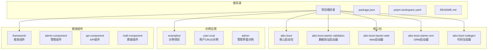
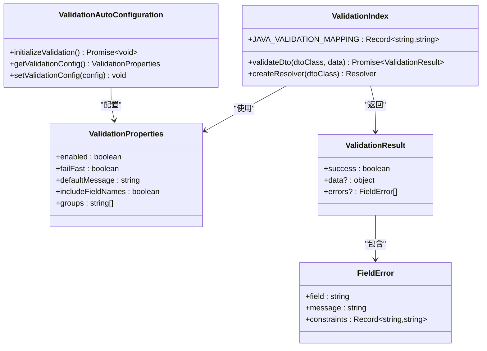
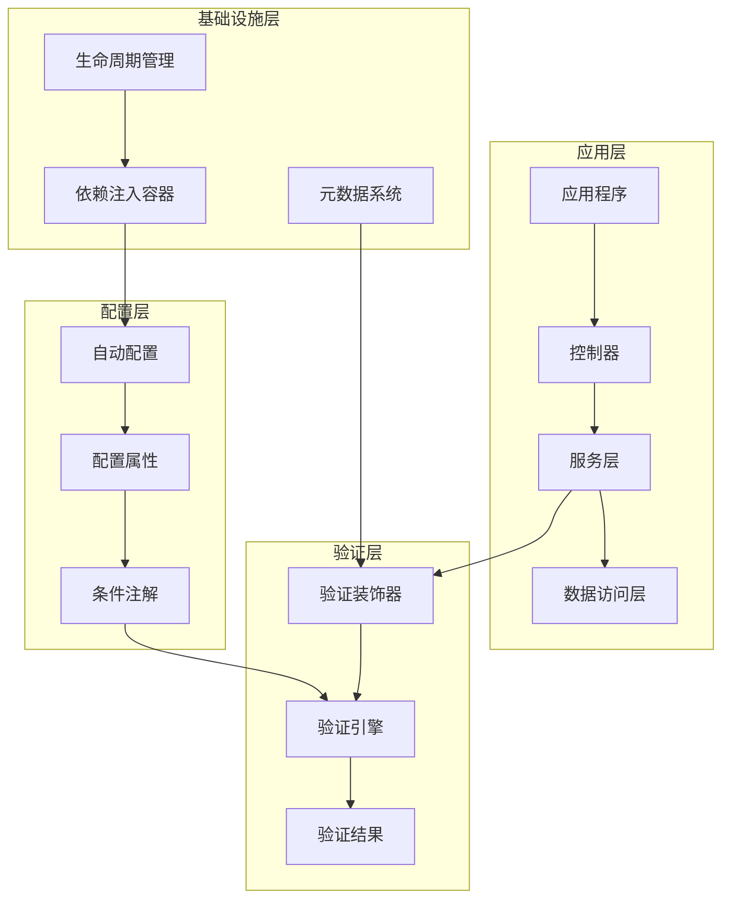
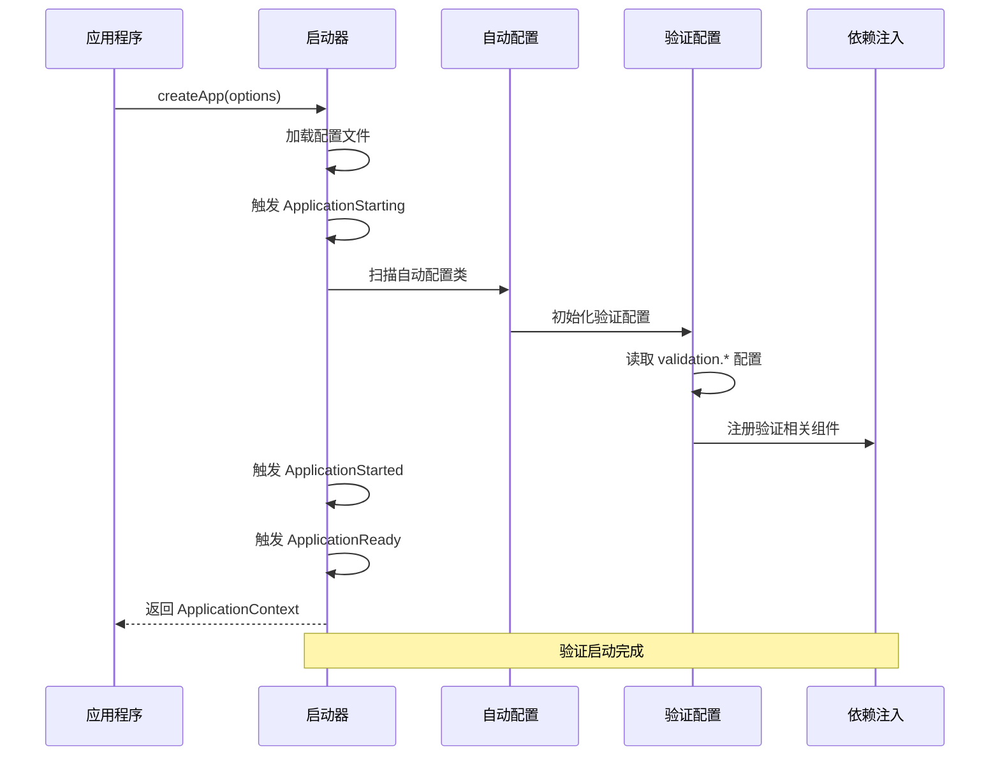
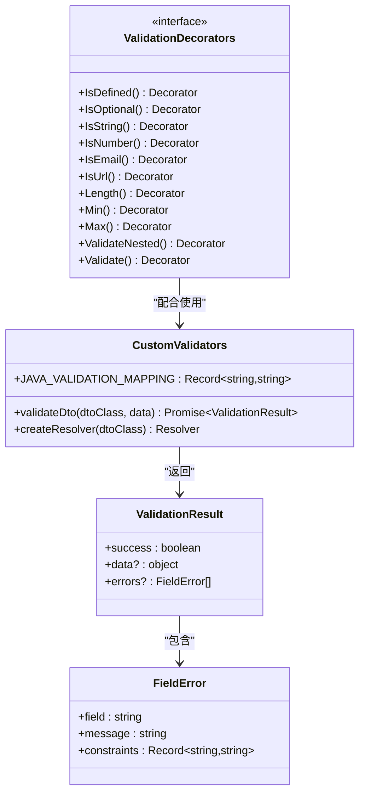
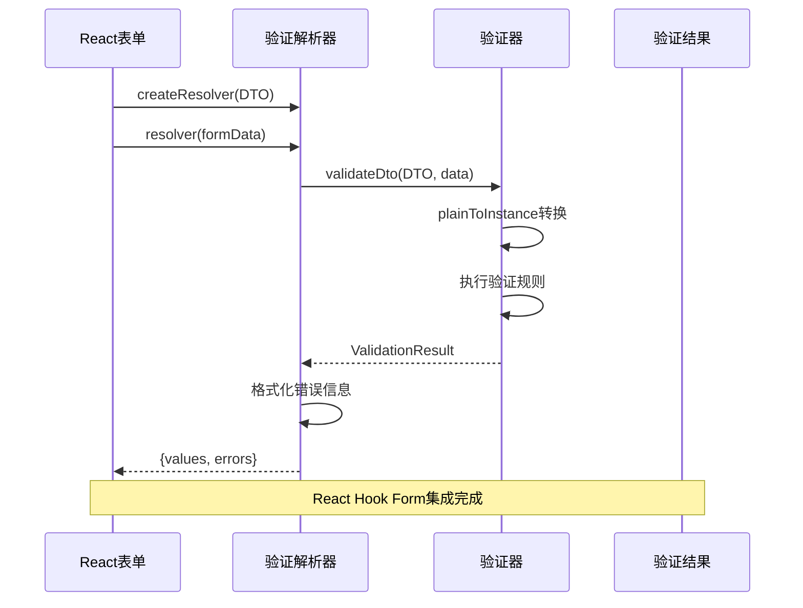
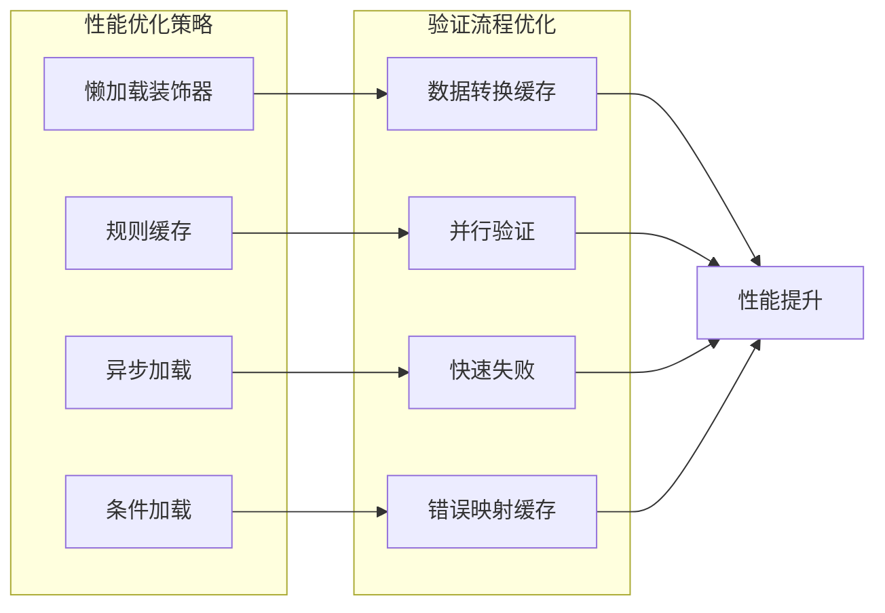

# Aiko Boot 数据验证启动器

<cite>
**本文档引用的文件**
- [README.md](file://README.md)
- [package.json](file://package.json)
- [pnpm-workspace.yaml](file://pnpm-workspace.yaml)
- [packages/aiko-boot/src/index.ts](file://packages/aiko-boot/src/index.ts)
- [packages/aiko-boot/src/boot/bootstrap.ts](file://packages/aiko-boot/src/boot/bootstrap.ts)
- [packages/aiko-boot/src/di/decorators.ts](file://packages/aiko-boot/src/di/decorators.ts)
- [packages/aiko-boot/src/boot/auto-configuration.ts](file://packages/aiko-boot/src/boot/auto-configuration.ts)
- [packages/aiko-boot/src/boot/conditional.ts](file://packages/aiko-boot/src/boot/conditional.ts)
- [packages/aiko-boot-starter-validation/src/index.ts](file://packages/aiko-boot-starter-validation/src/index.ts)
- [packages/aiko-boot-starter-validation/src/auto-configuration.ts](file://packages/aiko-boot-starter-validation/src/auto-configuration.ts)
- [packages/aiko-boot-starter-validation/src/config-augment.ts](file://packages/aiko-boot-starter-validation/src/config-augment.ts)
- [packages/aiko-boot-starter-validation/examples/user-dto.ts](file://packages/aiko-boot-starter-validation/examples/user-dto.ts)
- [packages/aiko-boot-starter-validation/examples/react-form.tsx](file://packages/aiko-boot-starter-validation/examples/react-form.tsx)
- [packages/aiko-boot-starter-validation/examples/server-action.ts](file://packages/aiko-boot-starter-validation/examples/server-action.ts)
- [packages/aiko-boot-starter-web/src/index.ts](file://packages/aiko-boot-starter-web/src/index.ts)
</cite>

## 目录
1. [简介](#简介)
2. [项目结构](#项目结构)
3. [核心组件](#核心组件)
4. [架构概览](#架构概览)
5. [详细组件分析](#详细组件分析)
6. [依赖关系分析](#依赖关系分析)
7. [性能考虑](#性能考虑)
8. [故障排除指南](#故障排除指南)
9. [结论](#结论)

## 简介

Aiko Boot 数据验证启动器是 Aiko Boot 全栈开发框架中的核心验证组件，基于 Spring Boot 风格的设计理念，提供了完整的数据验证解决方案。该启动器支持 TypeScript 和 Java 的双向兼容，能够实现前后端数据验证规则的统一管理。

该项目采用 Monorepo 架构，包含多个独立的包，每个包都有特定的功能职责。数据验证启动器通过装饰器模式提供类级验证规则，支持复杂的嵌套对象验证和自定义验证逻辑。

## 项目结构

Aiko Boot 项目采用 Monorepo 结构，主要包含以下核心部分：



**图表来源**
- [pnpm-workspace.yaml](file://pnpm-workspace.yaml#L1-L6)
- [package.json](file://package.json#L1-L32)

**章节来源**
- [README.md](file://README.md#L14-L33)
- [pnpm-workspace.yaml](file://pnpm-workspace.yaml#L1-L6)

## 核心组件

### 数据验证启动器架构

Aiko Boot 数据验证启动器的核心架构基于装饰器模式和自动配置机制：



**图表来源**
- [packages/aiko-boot-starter-validation/src/auto-configuration.ts](file://packages/aiko-boot-starter-validation/src/auto-configuration.ts#L28-L100)
- [packages/aiko-boot-starter-validation/src/index.ts](file://packages/aiko-boot-starter-validation/src/index.ts#L115-L242)

### 核心功能特性

数据验证启动器提供以下核心功能：

1. **装饰器验证**: 基于 class-validator 的完整验证装饰器集合
2. **自动配置**: Spring Boot 风格的自动配置机制
3. **React集成**: 与 react-hook-form 的无缝集成
4. **Java兼容**: 支持 TypeScript 到 Java 的验证规则转换
5. **类型安全**: 完整的 TypeScript 类型支持

**章节来源**
- [packages/aiko-boot-starter-validation/src/index.ts](file://packages/aiko-boot-starter-validation/src/index.ts#L1-L242)
- [packages/aiko-boot-starter-validation/src/auto-configuration.ts](file://packages/aiko-boot-starter-validation/src/auto-configuration.ts#L1-L101)

## 架构概览

### 整体架构设计

Aiko Boot 数据验证启动器采用分层架构设计，确保各组件之间的松耦合和高内聚：



**图表来源**
- [packages/aiko-boot/src/boot/bootstrap.ts](file://packages/aiko-boot/src/boot/bootstrap.ts#L115-L289)
- [packages/aiko-boot/src/boot/auto-configuration.ts](file://packages/aiko-boot/src/boot/auto-configuration.ts#L177-L436)
- [packages/aiko-boot/src/boot/conditional.ts](file://packages/aiko-boot/src/boot/conditional.ts#L27-L371)

### 启动流程

数据验证启动器的启动流程遵循 Spring Boot 的设计理念：



**图表来源**
- [packages/aiko-boot/src/boot/bootstrap.ts](file://packages/aiko-boot/src/boot/bootstrap.ts#L132-L289)
- [packages/aiko-boot/src/boot/auto-configuration.ts](file://packages/aiko-boot/src/boot/auto-configuration.ts#L196-L214)
- [packages/aiko-boot-starter-validation/src/auto-configuration.ts](file://packages/aiko-boot-starter-validation/src/auto-configuration.ts#L73-L100)

## 详细组件分析

### 验证装饰器系统

数据验证启动器提供了完整的验证装饰器生态系统，完全兼容 class-validator 的 API：



**图表来源**
- [packages/aiko-boot-starter-validation/src/index.ts](file://packages/aiko-boot-starter-validation/src/index.ts#L33-L113)
- [packages/aiko-boot-starter-validation/src/index.ts](file://packages/aiko-boot-starter-validation/src/index.ts#L117-L196)

### 验证配置系统

验证配置系统采用 Spring Boot 风格的配置机制：

```mermaid
flowchart TD
Start([应用启动]) --> LoadConfig[加载配置文件]
LoadConfig --> CheckValidation{检查 validation.enabled }
CheckValidation --> |true| InitValidation[初始化验证配置]
CheckValidation --> |false| SkipValidation[跳过验证配置]
InitValidation --> ReadProperties[读取验证属性]
ReadProperties --> SetConfig[设置全局配置]
SetConfig --> RegisterComponents[注册验证组件]
RegisterComponents --> Ready([验证系统就绪])
SkipValidation --> Ready
subgraph "配置属性"
Enabled[enabled: boolean]
FailFast[failFast: boolean]
DefaultMsg[defaultMessage: string]
IncludeFields[includeFieldNames: boolean]
Groups[groups: string[]]
end
ReadProperties --> Enabled
ReadProperties --> FailFast
ReadProperties --> DefaultMsg
ReadProperties --> IncludeFields
ReadProperties --> Groups
```

**图表来源**
- [packages/aiko-boot-starter-validation/src/auto-configuration.ts](file://packages/aiko-boot-starter-validation/src/auto-configuration.ts#L28-L99)

### React 集成方案

数据验证启动器提供了与 React 的深度集成：



**图表来源**
- [packages/aiko-boot-starter-validation/examples/react-form.tsx](file://packages/aiko-boot-starter-validation/examples/react-form.tsx#L14-L74)
- [packages/aiko-boot-starter-validation/src/index.ts](file://packages/aiko-boot-starter-validation/src/index.ts#L178-L196)

**章节来源**
- [packages/aiko-boot-starter-validation/src/index.ts](file://packages/aiko-boot-starter-validation/src/index.ts#L1-L242)
- [packages/aiko-boot-starter-validation/src/auto-configuration.ts](file://packages/aiko-boot-starter-validation/src/auto-configuration.ts#L1-L101)

## 依赖关系分析

### 包依赖关系

Aiko Boot 数据验证启动器的依赖关系清晰明确：

```mermaid
graph TB
subgraph "外部依赖"
ClassValidator[class-validator]
ClassTransformer[class-transformer]
ReactHookForm[react-hook-form]
ReflectMetadata[reflect-metadata]
end
subgraph "内部依赖"
AikoBoot[@ai-partner-x/aiko-boot]
AutoConfig[自动配置系统]
Conditional[条件注解]
DI[依赖注入]
end
subgraph "验证启动器"
ValidationIndex[index.ts]
AutoConfigClass[auto-configuration.ts]
ConfigAugment[config-augment.ts]
end
ValidationIndex --> ClassValidator
ValidationIndex --> ClassTransformer
ValidationIndex --> ReactHookForm
ValidationIndex --> ReflectMetadata
ValidationIndex --> AikoBoot
AutoConfigClass --> AutoConfig
AutoConfigClass --> Conditional
AutoConfigClass --> DI
ConfigAugment --> AikoBoot
AikoBoot --> DI
AikoBoot --> Conditional
AikoBoot --> AutoConfig
```

**图表来源**
- [packages/aiko-boot-starter-validation/src/index.ts](file://packages/aiko-boot-starter-validation/src/index.ts#L31-L113)
- [packages/aiko-boot-starter-validation/src/auto-configuration.ts](file://packages/aiko-boot-starter-validation/src/auto-configuration.ts#L18-L26)

### 组件耦合度分析

数据验证启动器采用了低耦合的设计原则：

| 组件 | 耦合度 | 说明 |
|------|--------|------|
| 验证装饰器 | 低 | 仅依赖 class-validator |
| 验证引擎 | 中 | 依赖装饰器和配置系统 |
| 配置系统 | 低 | 仅依赖 @ai-partner-x/aiko-boot |
| React集成 | 低 | 仅依赖 react-hook-form |
| Java映射 | 低 | 仅依赖装饰器元数据 |

**章节来源**
- [packages/aiko-boot-starter-validation/src/index.ts](file://packages/aiko-boot-starter-validation/src/index.ts#L1-L242)
- [packages/aiko-boot-starter-validation/src/config-augment.ts](file://packages/aiko-boot-starter-validation/src/config-augment.ts#L1-L23)

## 性能考虑

### 启动性能优化

数据验证启动器在启动阶段进行了多项性能优化：

1. **懒加载策略**: 验证装饰器在使用时才进行解析
2. **缓存机制**: 验证规则和映射关系进行缓存
3. **异步加载**: 配置文件和模块采用异步加载
4. **条件加载**: 仅在需要时加载验证相关组件

### 运行时性能优化



## 故障排除指南

### 常见问题及解决方案

#### 验证装饰器不生效

**问题描述**: 装饰器无法正常工作，验证规则不执行

**可能原因**:
1. 缺少 reflect-metadata 元数据支持
2. 装饰器未正确导入
3. TypeScript 配置问题

**解决方案**:
1. 确保在项目入口处导入 `reflect-metadata`
2. 检查装饰器导入路径
3. 验证 TypeScript 配置包含 `emitDecoratorMetadata`

#### 验证结果格式化问题

**问题描述**: 验证错误信息格式不符合预期

**可能原因**:
1. 自定义错误消息格式不正确
2. 验证配置未正确设置

**解决方案**:
1. 检查 `defaultMessage` 配置
2. 验证 `includeFieldNames` 设置
3. 确认错误消息模板格式

#### React 表单集成问题

**问题描述**: React Hook Form 无法正确集成验证

**可能原因**:
1. 解析器配置错误
2. DTO 类型定义问题

**解决方案**:
1. 检查 `createResolver` 的使用方式
2. 验证 DTO 类型与表单数据匹配
3. 确认字段名称一致

**章节来源**
- [packages/aiko-boot-starter-validation/examples/react-form.tsx](file://packages/aiko-boot-starter-validation/examples/react-form.tsx#L14-L74)
- [packages/aiko-boot-starter-validation/examples/server-action.ts](file://packages/aiko-boot-starter-validation/examples/server-action.ts#L13-L43)

## 结论

Aiko Boot 数据验证启动器是一个设计精良、功能完整的数据验证解决方案。它成功地将 Spring Boot 的设计理念引入到 TypeScript 生态系统中，提供了：

1. **完整的验证生态**: 从装饰器到配置的全链路支持
2. **跨平台兼容**: TypeScript 和 Java 的双向兼容
3. **现代化集成**: 与 React 和 Next.js 的无缝集成
4. **企业级特性**: 自动配置、条件加载等高级功能

该启动器特别适合需要构建大型企业应用的团队，因为它提供了统一的验证规则管理方式，支持前后端代码的一致性，并且具备良好的扩展性和维护性。通过合理的配置和使用，可以显著提高开发效率和代码质量。