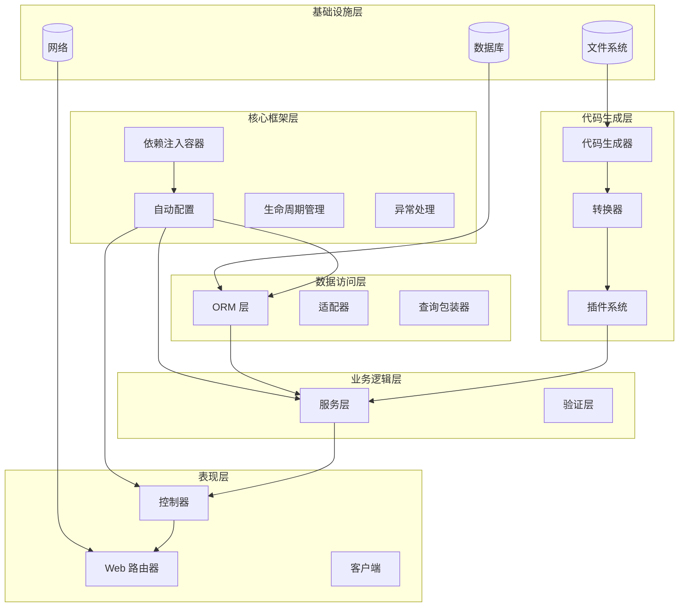
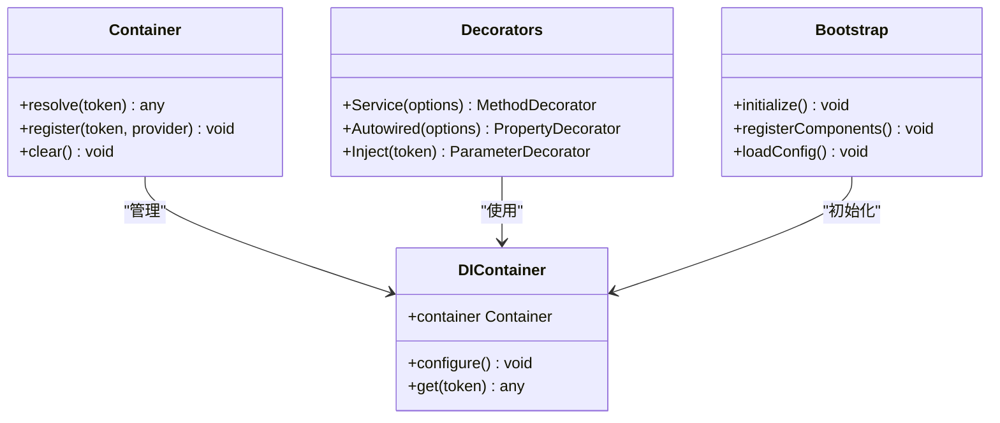
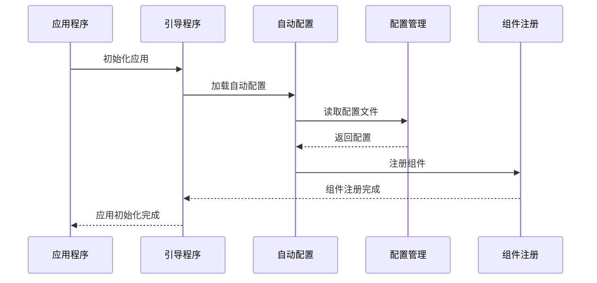
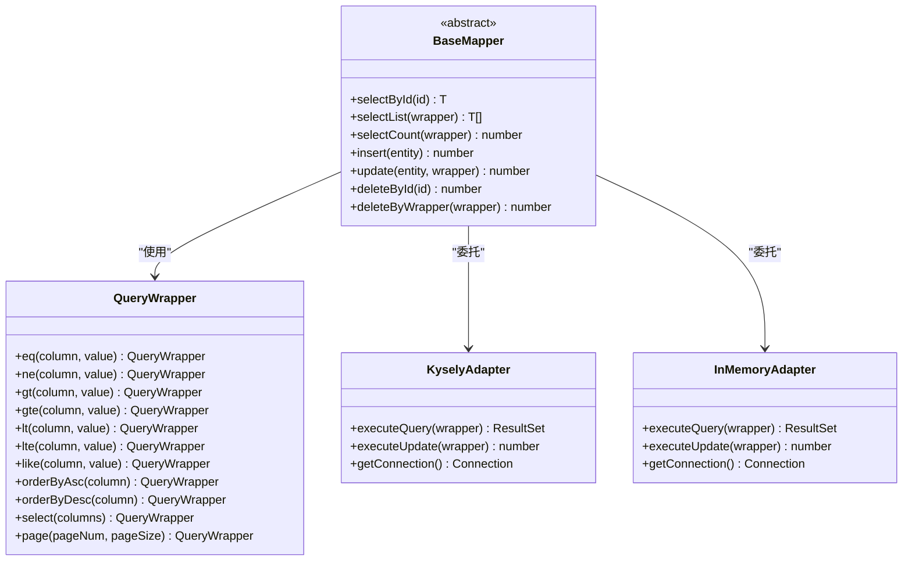
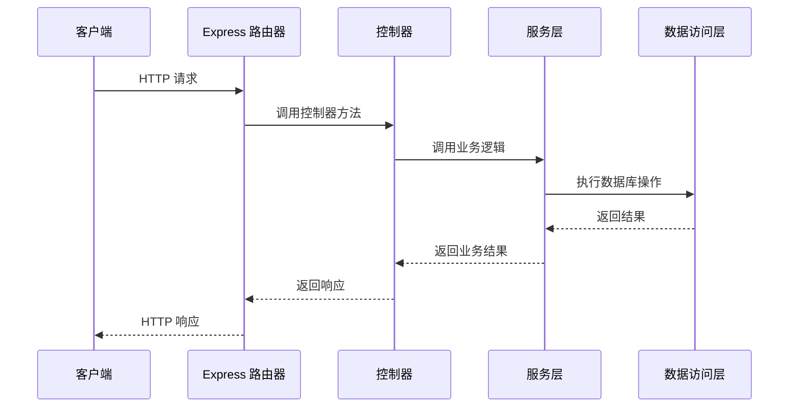
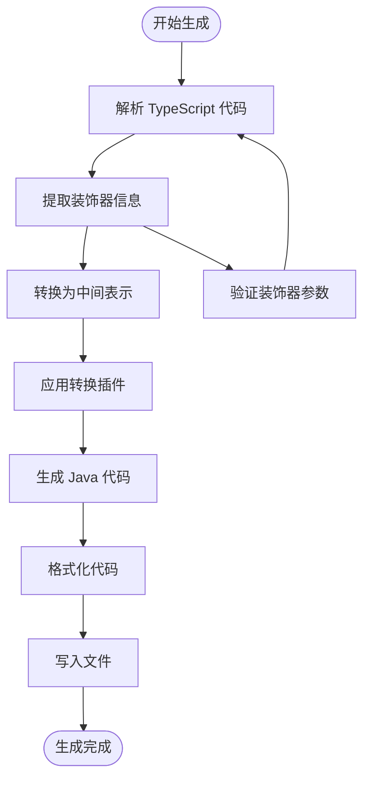

# Aiko Boot 核心框架

<cite>
**本文档引用的文件**
- [README.md](file://README.md)
- [package.json](file://package.json)
- [pnpm-workspace.yaml](file://pnpm-workspace.yaml)
- [packages/aiko-boot/package.json](file://packages/aiko-boot/package.json)
- [packages/aiko-boot/src/index.ts](file://packages/aiko-boot/src/index.ts)
- [packages/aiko-boot/src/boot/index.ts](file://packages/aiko-boot/src/boot/index.ts)
- [packages/aiko-boot/src/boot/bootstrap.ts](file://packages/aiko-boot/src/boot/bootstrap.ts)
- [packages/aiko-boot/src/boot/auto-configuration.ts](file://packages/aiko-boot/src/boot/auto-configuration.ts)
- [packages/aiko-boot/src/boot/conditional.ts](file://packages/aiko-boot/src/boot/conditional.ts)
- [packages/aiko-boot/src/boot/config.ts](file://packages/aiko-boot/src/boot/config.ts)
- [packages/aiko-boot/src/boot/lifecycle.ts](file://packages/aiko-boot/src/boot/lifecycle.ts)
- [packages/aiko-boot/src/boot/exception.ts](file://packages/aiko-boot/src/boot/exception.ts)
- [packages/aiko-boot/src/di/index.ts](file://packages/aiko-boot/src/di/index.ts)
- [packages/aiko-boot/src/di/decorators.ts](file://packages/aiko-boot/src/di/decorators.ts)
- [packages/aiko-boot/src/di/container.ts](file://packages/aiko-boot/src/di/container.ts)
- [packages/aiko-boot/src/di/server.ts](file://packages/aiko-boot/src/di/server.ts)
- [packages/aiko-boot/src/decorators.ts](file://packages/aiko-boot/src/decorators.ts)
- [packages/aiko-boot/src/types.ts](file://packages/aiko-boot/src/types.ts)
- [packages/aiko-boot-starter-orm/package.json](file://packages/aiko-boot-starter-rtm/package.json)
- [packages/aiko-boot-starter-orm/src/index.ts](file://packages/aiko-boot-starter-orm/src/index.ts)
- [packages/aiko-boot-starter-orm/src/decorators.ts](file://packages/aiko-boot-starter-orm/src/decorators.ts)
- [packages/aiko-boot-starter-orm/src/base-mapper.ts](file://packages/aiko-boot-starter-orm/src/base-mapper.ts)
- [packages/aiko-boot-starter-orm/src/wrapper.ts](file://packages/aiko-boot-starter-orm/src/wrapper.ts)
- [packages/aiko-boot-starter-orm/src/database.ts](file://packages/aiko-boot-starter-orm/src/database.ts)
- [packages/aiko-boot-starter-orm/src/auto-configuration.ts](file://packages/aiko-boot-starter-orm/src/auto-configuration.ts)
- [packages/aiko-boot-starter-orm/src/config-augment.ts](file://packages/aiko-boot-starter-orm/src/config-augment.ts)
- [packages/aiko-boot-starter-orm/src/adapters/index.ts](file://packages/aiko-boot-starter-orm/src/adapters/index.ts)
- [packages/aiko-boot-starter-orm/src/adapters/kysely-adapter.ts](file://packages/aiko-boot-starter-orm/src/adapters/kysely-adapter.ts)
- [packages/aiko-boot-starter-orm/src/adapters/in-memory-adapter.ts](file://packages/aiko-boot-starter-orm/src/adapters/in-memory-adapter.ts)
- [packages/aiko-boot-starter-web/package.json](file://packages/aiko-boot-starter-web/package.json)
- [packages/aiko-boot-starter-web/src/index.ts](file://packages/aiko-boot-starter-web/src/index.ts)
- [packages/aiko-boot-starter-web/src/decorators.ts](file://packages/aiko-boot-starter-web/src/decorators.ts)
- [packages/aiko-boot-starter-web/src/express-router.ts](file://packages/aiko-boot-starter-web/src/express-router.ts)
- [packages/aiko-boot-starter-web/src/auto-configuration.ts](file://packages/aiko-boot-starter-web/src/auto-configuration.ts)
- [packages/aiko-boot-starter-web/src/config-augment.ts](file://packages/aiko-boot-starter-web/src/config-augment.ts)
- [packages/aiko-boot-starter-web/src/client-lite.ts](file://packages/aiko-boot-starter-web/src/client-lite.ts)
- [packages/aiko-boot-starter-validation/package.json](file://packages/aiko-boot-starter-validation/package.json)
- [packages/aiko-boot-starter-validation/src/index.ts](file://packages/aiko-boot-starter-validation/src/index.ts)
- [packages/aiko-boot-starter-validation/src/auto-configuration.ts](file://packages/aiko-boot-starter-validation/src/auto-configuration.ts)
- [packages/aiko-boot-starter-validation/src/config-augment.ts](file://packages/aiko-boot-starter-validation/src/config-augment.ts)
- [packages/aiko-boot-codegen/package.json](file://packages/aiko-boot-codegen/package.json)
- [packages/aiko-boot-codegen/src/index.ts](file://packages/aiko-boot-codegen/src/index.ts)
- [packages/aiko-boot-codegen/src/cli/index.ts](file://packages/aiko-boot-codegen/src/cli/index.ts)
- [packages/aiko-boot-codegen/src/cli/transpile.ts](file://packages/aiko-boot-codegen/src/cli/transpile.ts)
- [packages/aiko-boot-codegen/src/generator.ts](file://packages/aiko-boot-codegen/src/generator.ts)
- [packages/aiko-boot-codegen/src/parser.ts](file://packages/aiko-boot-codegen/src/parser.ts)
- [packages/aiko-boot-codegen/src/transformer.ts](file://packages/aiko-boot-codegen/src/transformer.ts)
- [packages/aiko-boot-codegen/src/plugins.ts](file://packages/aiko-boot-codegen/src/plugins.ts)
- [packages/aiko-boot-codegen/src/builtin-plugins.ts](file://packages/aiko-boot-codegen/src/builtin-plugins.ts)
- [packages/aiko-boot-codegen/src/method-body-generator.ts](file://packages/aiko-boot-codegen/src/method-body-generator.ts)
- [packages/aiko-boot-codegen/src/client-generator.ts](file://packages/aiko-boot-codegen/src/client-generator.ts)
- [packages/aiko-boot-codegen/src/loader.ts](file://packages/aiko-boot-codegen/src/loader.ts)
- [packages/aiko-boot-codegen/src/tsup-plugin.ts](file://packages/aiko-boot-codegen/src/tsup-plugin.ts)
- [packages/aiko-boot-codegen/src/types.ts](file://packages/aiko-boot-codegen/src/types.ts)
</cite>

## 目录
1. [简介](#简介)
2. [项目结构](#项目结构)
3. [核心组件](#核心组件)
4. [架构概览](#架构概览)
5. [详细组件分析](#详细组件分析)
6. [依赖关系分析](#依赖关系分析)
7. [性能考虑](#性能考虑)
8. [故障排除指南](#故障排除指南)
9. [结论](#结论)

## 简介

Aiko Boot 是一个基于 TypeScript + Next.js 的全栈开发框架，采用 MyBatis-Plus 风格 API，让 AI 能够理解、生成、优化全栈应用代码，并支持一键转换为 Java Spring Boot + MyBatis-Plus 项目。该框架的核心理念包括：

- **AI 原生**: 使用 AI 最熟悉的语言 (TypeScript/React/Next.js)
- **代码优先**: 代码即设计，无需学习新 DSL
- **类型安全**: TypeScript + 装饰器保证代码质量
- **Java 兼容**: TypeScript 代码可转换为 Java Spring Boot + MyBatis-Plus

框架采用 monorepo 结构，包含核心启动包、Web 启动器、ORM 启动器、验证启动器、代码生成器等模块。

## 项目结构

Aiko Boot 采用 monorepo 结构，主要包含以下目录：

```mermaid
graph TB
subgraph "根目录"
Root[项目根目录]
PackageJSON[package.json]
Workspace[pnpm-workspace.yaml]
Docs[docs/]
end
subgraph "核心包 (packages/)"
AikoBoot[@ai-partner-x/aiko-boot]
ORMPkg[@ai-partner-x/aiko-boot-starter-orm]
WebPkg[@ai-partner-x/aiko-boot-starter-web]
ValidationPkg[@ai-partner-x/aiko-boot-starter-validation]
CodegenPkg[@ai-partner-x/aiko-boot-codegen]
ESLintPlugin[@ai-partner-x/eslint-plugin-aiko-boot]
end
subgraph "应用示例 (app/)"
Examples[examples/]
UserCRUD[user-crud/]
Framework[framework/]
AdminComponent[admin-component/]
APIComponent[api-component/]
MallComponent[mall-component/]
end
Root --> PackageJSON
Root --> Workspace
Root --> Docs
Root --> AikoBoot
Root --> ORMPkg
Root --> WebPkg
Root --> ValidationPkg
Root --> CodegenPkg
Root --> ESLintPlugin
Root --> Examples
Examples --> UserCRUD
Examples --> Framework
Framework --> AdminComponent
Framework --> APIComponent
Framework --> MallComponent
```

**图表来源**
- [pnpm-workspace.yaml](file://pnpm-workspace.yaml#L1-L6)
- [package.json](file://package.json#L1-L32)

**章节来源**
- [README.md](file://README.md#L14-L33)
- [pnpm-workspace.yaml](file://pnpm-workspace.yaml#L1-L6)

## 核心组件

Aiko Boot 框架由多个相互协作的包组成，每个包都有特定的功能职责：

### 核心启动包 (@ai-partner-x/aiko-boot)

核心启动包提供依赖注入容器和自动配置功能，是整个框架的基础。

**章节来源**
- [packages/aiko-boot/package.json](file://packages/aiko-boot/package.json#L1-L61)

### ORM 启动器 (@ai-partner-x/aiko-boot-starter-orm)

提供 MyBatis-Plus 风格的 ORM 功能，底层使用 Kysely，支持多种数据库。

**章节来源**
- [packages/aiko-boot-starter-orm/package.json](file://packages/aiko-boot-starter-orm/package.json#L1-L55)

### Web 启动器 (@ai-partner-x/aiko-boot-starter-web)

提供 Spring Boot 风格的 Web 功能，包含 HTTP 装饰器和 Express 路由器。

**章节来源**
- [packages/aiko-boot-starter-web/package.json](file://packages/aiko-boot-starter-web/package.json#L1-L60)

### 验证启动器 (@ai-partner-x/aiko-boot-starter-validation)

提供基于 class-validator 的数据验证功能。

**章节来源**
- [packages/aiko-boot-starter-validation/package.json](file://packages/aiko-boot-starter-validation/package.json#L1-L41)

### 代码生成器 (@ai-partner-x/aiko-boot-codegen)

将 TypeScript 代码转换为 Java Spring Boot + MyBatis-Plus 代码。

**章节来源**
- [packages/aiko-boot-codegen/package.json](file://packages/aiko-boot-codegen/package.json#L1-L34)

## 架构概览

Aiko Boot 采用分层架构设计，从下到上分为基础设施层、核心框架层、业务逻辑层和应用层：



**图表来源**
- [packages/aiko-boot/src/boot/bootstrap.ts](file://packages/aiko-boot/src/boot/bootstrap.ts)
- [packages/aiko-boot-starter-orm/src/auto-configuration.ts](file://packages/aiko-boot-starter-orm/src/auto-configuration.ts)
- [packages/aiko-boot-starter-web/src/auto-configuration.ts](file://packages/aiko-boot-starter-web/src/auto-configuration.ts)

## 详细组件分析

### 依赖注入系统

Aiko Boot 的依赖注入系统基于 tsyringe 和 reflect-metadata 实现，提供了完整的依赖注入功能。



**图表来源**
- [packages/aiko-boot/src/di/container.ts](file://packages/aiko-boot/src/di/container.ts)
- [packages/aiko-boot/src/di/decorators.ts](file://packages/aiko-boot/src/di/decorators.ts)
- [packages/aiko-boot/src/boot/bootstrap.ts](file://packages/aiko-boot/src/boot/bootstrap.ts)

**章节来源**
- [packages/aiko-boot/src/di/index.ts](file://packages/aiko-boot/src/di/index.ts)
- [packages/aiko-boot/src/di/decorators.ts](file://packages/aiko-boot/src/di/decorators.ts)
- [packages/aiko-boot/src/di/container.ts](file://packages/aiko-boot/src/di/container.ts)

### 自动配置机制

自动配置系统负责根据环境和配置自动设置各个组件。



**图表来源**
- [packages/aiko-boot/src/boot/auto-configuration.ts](file://packages/aiko-boot/src/boot/auto-configuration.ts)
- [packages/aiko-boot/src/boot/bootstrap.ts](file://packages/aiko-boot/src/boot/bootstrap.ts)

**章节来源**
- [packages/aiko-boot/src/boot/auto-configuration.ts](file://packages/aiko-boot/src/boot/auto-configuration.ts)
- [packages/aiko-boot/src/boot/config.ts](file://packages/aiko-boot/src/boot/config.ts)

### ORM 系统

ORM 系统提供 MyBatis-Plus 风格的数据访问功能，支持多种数据库。



**图表来源**
- [packages/aiko-boot-starter-orm/src/base-mapper.ts](file://packages/aiko-boot-starter-orm/src/base-mapper.ts)
- [packages/aiko-boot-starter-orm/src/wrapper.ts](file://packages/aiko-boot-starter-orm/src/wrapper.ts)
- [packages/aiko-boot-starter-orm/src/adapters/kysely-adapter.ts](file://packages/aiko-boot-starter-orm/src/adapters/kysely-adapter.ts)
- [packages/aiko-boot-starter-orm/src/adapters/in-memory-adapter.ts](file://packages/aiko-boot-starter-orm/src/adapters/in-memory-adapter.ts)

**章节来源**
- [packages/aiko-boot-starter-orm/src/base-mapper.ts](file://packages/aiko-boot-starter-orm/src/base-mapper.ts)
- [packages/aiko-boot-starter-orm/src/wrapper.ts](file://packages/aiko-boot-starter-orm/src/wrapper.ts)
- [packages/aiko-boot-starter-orm/src/adapters/index.ts](file://packages/aiko-boot-starter-orm/src/adapters/index.ts)

### Web 框架

Web 框架提供 Spring Boot 风格的 HTTP 控制器和路由功能。



**图表来源**
- [packages/aiko-boot-starter-web/src/express-router.ts](file://packages/aiko-boot-starter-web/src/express-router.ts)
- [packages/aiko-boot-starter-web/src/decorators.ts](file://packages/aiko-boot-starter-web/src/decorators.ts)

**章节来源**
- [packages/aiko-boot-starter-web/src/express-router.ts](file://packages/aiko-boot-starter-web/src/express-router.ts)
- [packages/aiko-boot-starter-web/src/decorators.ts](file://packages/aiko-boot-starter-web/src/decorators.ts)

### 代码生成器

代码生成器将 TypeScript 装饰器代码转换为 Java Spring Boot + MyBatis-Plus 代码。



**图表来源**
- [packages/aiko-boot-codegen/src/parser.ts](file://packages/aiko-boot-codegen/src/parser.ts)
- [packages/aiko-boot-codegen/src/transformer.ts](file://packages/aiko-boot-codegen/src/transformer.ts)
- [packages/aiko-boot-codegen/src/generator.ts](file://packages/aiko-boot-codegen/src/generator.ts)

**章节来源**
- [packages/aiko-boot-codegen/src/parser.ts](file://packages/aiko-boot-codegen/src/parser.ts)
- [packages/aiko-boot-codegen/src/transformer.ts](file://packages/aiko-boot-codegen/src/transformer.ts)
- [packages/aiko-boot-codegen/src/generator.ts](file://packages/aiko-boot-codegen/src/generator.ts)

## 依赖关系分析

Aiko Boot 框架的依赖关系呈现清晰的层次结构：

```mermaid
graph TB
subgraph "外部依赖"
TS[TypeScript]
React[React]
Express[Express]
Kysely[Kysely]
Tsyringe[Tsyringe]
ReflectMetadata[Reflect Metadata]
end
subgraph "核心包"
AikoBoot[@ai-partner-x/aiko-boot]
ORMPkg[@ai-partner-x/aiko-boot-starter-orm]
WebPkg[@ai-partner-x/aiko-boot-starter-web]
ValidationPkg[@ai-partner-x/aiko-boot-starter-validation]
CodegenPkg[@ai-partner-x/aiko-boot-codegen]
end
subgraph "应用层"
Examples[示例项目]
Framework[框架组件]
end
TS --> AikoBoot
React --> AikoBoot
Express --> WebPkg
Kysely --> ORMPkg
Tsyringe --> AikoBoot
ReflectMetadata --> AikoBoot
AikoBoot --> ORMPkg
AikoBoot --> WebPkg
AikoBoot --> ValidationPkg
AikoBoot --> CodegenPkg
ORMPkg --> WebPkg
ORMPkg --> ValidationPkg
AikoBoot --> Examples
AikoBoot --> Framework
```

**图表来源**
- [packages/aiko-boot/package.json](file://packages/aiko-boot/package.json#L35-L38)
- [packages/aiko-boot-starter-orm/package.json](file://packages/aiko-boot-starter-orm/package.json#L24-L28)
- [packages/aiko-boot-starter-web/package.json](file://packages/aiko-boot-starter-web/package.json#L32-L36)
- [packages/aiko-boot-starter-validation/package.json](file://packages/aiko-boot-starter-validation/package.json#L21-L26)

**章节来源**
- [packages/aiko-boot/package.json](file://packages/aiko-boot/package.json#L35-L44)
- [packages/aiko-boot-starter-orm/package.json](file://packages/aiko-boot-starter-orm/package.json#L24-L44)
- [packages/aiko-boot-starter-web/package.json](file://packages/aiko-boot-starter-web/package.json#L32-L48)
- [packages/aiko-boot-starter-validation/package.json](file://packages/aiko-boot-starter-validation/package.json#L21-L38)

## 性能考虑

Aiko Boot 框架在设计时充分考虑了性能因素：

### 依赖注入性能
- 使用 tsyringe 提供高效的依赖注入容器
- 支持构造函数和属性注入，减少运行时开销
- 缓存已解析的依赖项，避免重复解析

### ORM 性能优化
- 基于 Kysely 的类型安全查询构建器
- 支持多种数据库适配器，选择最优的数据库连接
- 查询包装器提供链式调用，减少不必要的对象创建

### Web 框架性能
- Express 路由器提供高性能的 HTTP 处理
- 装饰器模式减少样板代码，提高开发效率
- 中间件系统支持异步处理，提升响应速度

### 代码生成性能
- 增量编译和缓存机制
- 并行处理多个文件转换
- 插件系统支持自定义优化

## 故障排除指南

### 常见问题及解决方案

**依赖注入问题**
- 确保所有服务类都正确使用 `@Service` 装饰器
- 检查构造函数参数是否正确标注 `@Autowired`
- 验证装饰器元数据是否正确反射

**ORM 查询问题**
- 确认实体类正确使用 `@TableName`、`@TableId`、`@TableField` 装饰器
- 检查数据库连接配置是否正确
- 验证查询包装器的条件构造是否符合预期

**Web 路由问题**
- 确保控制器类正确使用 `@RestController` 装饰器
- 检查路由路径和 HTTP 方法注解是否匹配
- 验证中间件配置是否正确

**代码生成问题**
- 确认 TypeScript 装饰器语法正确
- 检查生成器配置文件是否完整
- 验证目标 Java 版本兼容性

**章节来源**
- [packages/aiko-boot/src/boot/exception.ts](file://packages/aiko-boot/src/boot/exception.ts)
- [packages/aiko-boot-starter-orm/src/database.ts](file://packages/aiko-boot-starter-orm/src/database.ts)

## 结论

Aiko Boot 核心框架是一个设计精良的全栈开发框架，具有以下特点：

1. **模块化设计**: 清晰的包结构和职责分离
2. **类型安全**: 完整的 TypeScript 类型支持
3. **AI 友好**: 使用 AI 最熟悉的语言和技术栈
4. **可扩展性**: 插件系统和装饰器模式支持扩展
5. **跨平台**: 支持 TypeScript 到 Java 的代码转换

该框架适合需要快速开发全栈应用的团队，特别是那些希望利用 AI 技术进行代码生成和优化的项目。通过合理的架构设计和丰富的功能模块，Aiko Boot 为开发者提供了一个高效、可靠的开发平台。

随着项目的不断发展，建议重点关注：
- 完善文档和示例代码
- 扩展更多数据库适配器
- 增强代码生成器的功能
- 优化性能和内存使用
- 添加更多的测试覆盖