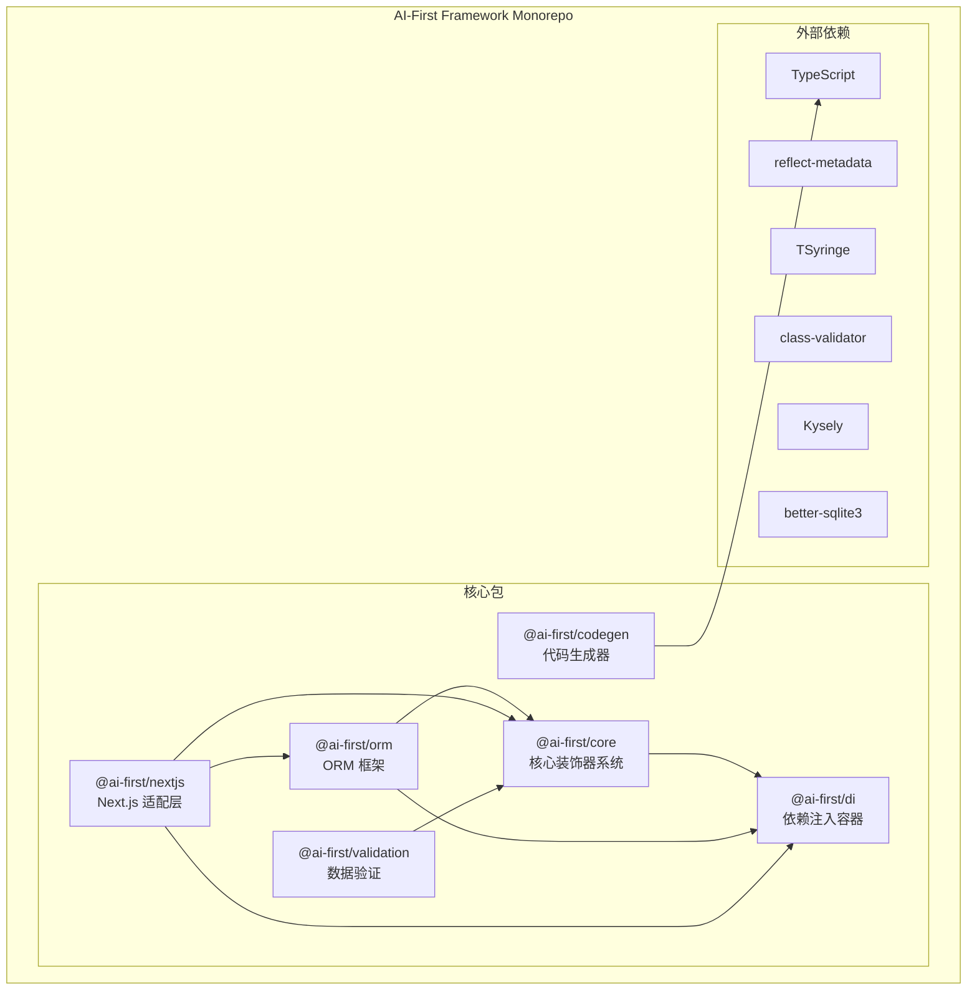
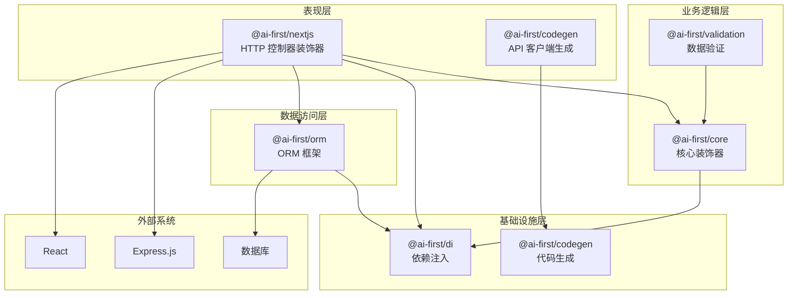
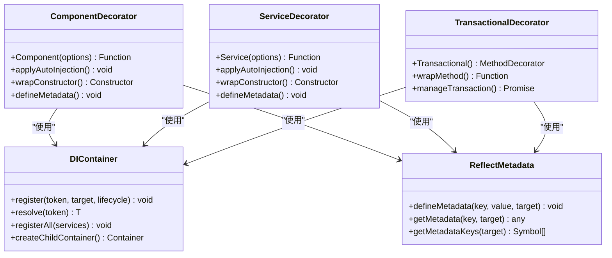
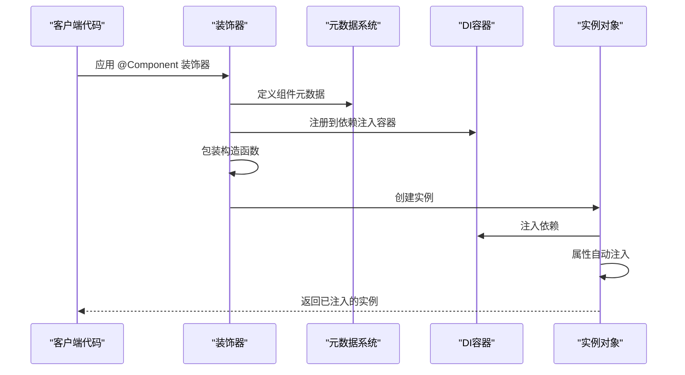
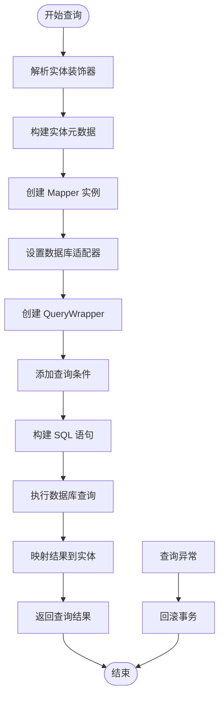
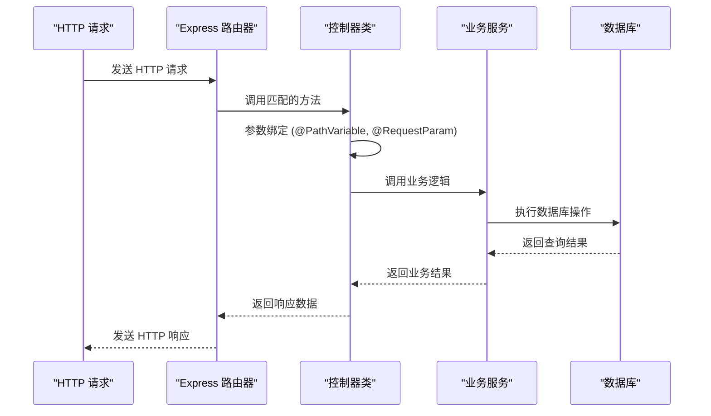
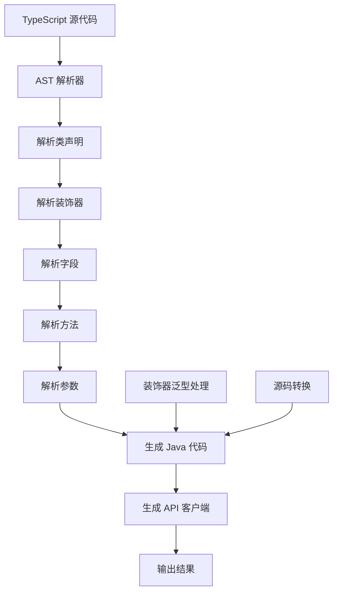
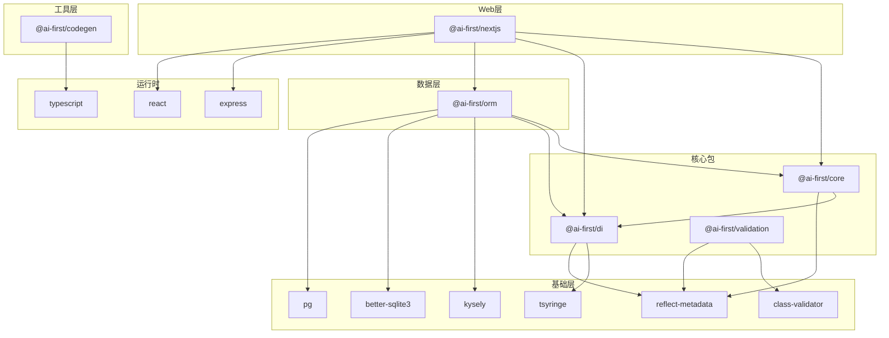
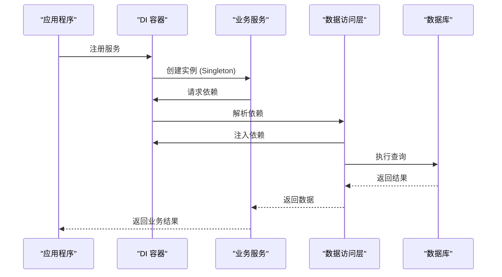

# 核心包详解

<cite>
**本文档引用的文件**
- [packages/core/package.json](file://packages/core/package.json)
- [packages/di/package.json](file://packages/di/package.json)
- [packages/orm/package.json](file://packages/orm/package.json)
- [packages/validation/package.json](file://packages/validation/package.json)
- [packages/nextjs/package.json](file://packages/nextjs/package.json)
- [packages/codegen/package.json](file://packages/codegen/package.json)
- [packages/core/src/index.ts](file://packages/core/src/index.ts)
- [packages/core/src/decorators.ts](file://packages/core/src/decorators.ts)
- [packages/di/src/index.ts](file://packages/di/src/index.ts)
- [packages/di/src/container.ts](file://packages/di/src/container.ts)
- [packages/orm/src/index.ts](file://packages/orm/src/index.ts)
- [packages/orm/src/decorators.ts](file://packages/orm/src/decorators.ts)
- [packages/validation/src/index.ts](file://packages/validation/src/index.ts)
- [packages/nextjs/src/index.ts](file://packages/nextjs/src/index.ts)
- [packages/nextjs/src/decorators.ts](file://packages/nextjs/src/decorators.ts)
- [packages/codegen/src/index.ts](file://packages/codegen/src/index.ts)
- [packages/codegen/src/parser.ts](file://packages/codegen/src/parser.ts)
</cite>

## 目录
1. [简介](#简介)
2. [项目结构](#项目结构)
3. [核心组件](#核心组件)
4. [架构概览](#架构概览)
5. [详细组件分析](#详细组件分析)
6. [依赖关系分析](#依赖关系分析)
7. [性能考虑](#性能考虑)
8. [故障排除指南](#故障排除指南)
9. [结论](#结论)

## 简介

AI-First Framework 是一个现代化的企业级应用开发框架，采用 TypeScript 构建，提供了完整的从后端到前端的开发解决方案。该框架的核心设计理念是"AI-First"，即以人工智能驱动的开发体验为核心，通过装饰器系统、依赖注入、ORM 映射、数据验证等模块化组件，为开发者提供高效、可维护的应用开发框架。

本框架包含六个核心包，每个包都有明确的功能定位和职责分工：

- **@ai-first/core**: 核心装饰器系统和元数据管理
- **@ai-first/di**: 基于 TSyringe 的依赖注入容器
- **@ai-first/orm**: MyBatis-Plus 风格的 ORM 框架
- **@ai-first/validation**: 基于 class-validator 的数据验证
- **@ai-first/nextjs**: Next.js 适配层和 HTTP 装饰器
- **@ai-first/codegen**: Java 代码生成器和前端 API 客户端生成器

## 项目结构

AI-First Framework 采用 monorepo 结构，通过 pnpm workspace 管理多个包。每个包都是独立的 npm 包，具有自己的构建配置和依赖管理。

**图表来源**
- [packages/core/package.json](file://packages/core/package.json#L1-L39)
- [packages/di/package.json](file://packages/di/package.json#L1-L53)
- [packages/orm/package.json](file://packages/orm/package.json#L1-L54)
- [packages/validation/package.json](file://packages/validation/package.json#L1-L40)
- [packages/nextjs/package.json](file://packages/nextjs/package.json#L1-L59)
- [packages/codegen/package.json](file://packages/codegen/package.json#L1-L28)

**章节来源**
- [packages/core/package.json](file://packages/core/package.json#L1-L39)
- [packages/di/package.json](file://packages/di/package.json#L1-L53)
- [packages/orm/package.json](file://packages/orm/package.json#L1-L54)
- [packages/validation/package.json](file://packages/validation/package.json#L1-L40)
- [packages/nextjs/package.json](file://packages/nextjs/package.json#L1-L59)
- [packages/codegen/package.json](file://packages/codegen/package.json#L1-L28)

## 核心组件

### @ai-first/core - 核心装饰器系统

@ai-first/core 是整个框架的基础，提供了领域驱动设计(Domain-Driven Design)所需的装饰器系统。它定义了业务组件的核心概念，包括组件(Component)、服务(Service)和事务(Transaction)。

#### 主要功能特性

1. **组件层装饰器**: 提供 @Component 和 @Service 装饰器，用于标记业务组件和服务类
2. **自动依赖注入**: 自动处理构造函数参数注入和 @Autowired 属性注入
3. **元数据管理**: 使用 reflect-metadata 管理装饰器元数据
4. **生命周期管理**: 集成 @ai-first/di 的生命周期管理

#### 关键装饰器说明

- **@Component**: 标记通用组件，支持自动注册到 DI 容器
- **@Service**: 标记业务服务类，提供领域服务功能
- **@Transactional**: 标记事务性方法，提供自动事务管理

**章节来源**
- [packages/core/src/index.ts](file://packages/core/src/index.ts#L1-L22)
- [packages/core/src/decorators.ts](file://packages/core/src/decorators.ts#L1-L158)

### @ai-first/di - 依赖注入容器

@ai-first/di 基于 TSyringe 提供了强大的依赖注入功能，支持多种生命周期管理和自动装配。

#### 核心特性

1. **生命周期管理**: 支持 Singleton、Scoped、Transient 三种生命周期
2. **自动装配**: 自动解析构造函数依赖和 @Autowired 属性
3. **容器包装**: 提供统一的 Container 类封装 TSyringe 功能
4. **React 集成**: 提供 React 组件的 DI 集成方案

#### 生命周期类型

- **Singleton**: 应用程序级别的单例实例
- **Scoped**: 请求作用域的实例
- **Transient**: 每次请求都创建新实例

**章节来源**
- [packages/di/src/index.ts](file://packages/di/src/index.ts#L1-L34)
- [packages/di/src/container.ts](file://packages/di/src/container.ts#L1-L105)

### @ai-first/orm - MyBatis-Plus 风格 ORM

@ai-first/orm 提供了类似 MyBatis-Plus 的装饰器风格 ORM 框架，支持多种数据库和查询方式。

#### 主要功能

1. **实体映射**: 使用装饰器定义实体类和表结构
2. **查询构建**: 提供类似 MyBatis-Plus 的 QueryWrapper 查询语法
3. **多数据库支持**: 支持 PostgreSQL、SQLite、MySQL 等数据库
4. **适配器模式**: 通过适配器支持不同的数据库客户端

#### 核心装饰器

- **@Entity/@TableName**: 定义实体类和表名
- **@TableId**: 定义主键字段
- **@TableField/@Column**: 定义普通字段
- **@Mapper**: 定义数据访问层接口

**章节来源**
- [packages/orm/src/index.ts](file://packages/orm/src/index.ts#L1-L72)
- [packages/orm/src/decorators.ts](file://packages/orm/src/decorators.ts#L1-L224)

### @ai-first/validation - 数据验证

基于 class-validator 的数据验证框架，提供与 Spring Boot Validation 兼容的装饰器集合。

#### 功能特性

1. **完整验证器集合**: 提供丰富的验证装饰器
2. **DTO 验证**: 支持对象图验证和嵌套验证
3. **React Hook Form 集成**: 提供表单验证集成
4. **Java 转译映射**: 支持代码生成时的 Java 注解转换

#### 验证装饰器分类

- **存在性验证**: IsDefined、IsOptional
- **类型验证**: IsString、IsNumber、IsBoolean 等
- **格式验证**: IsEmail、IsUrl、IsUUID 等
- **范围验证**: Min、Max、Length 等
- **数组验证**: ArrayNotEmpty、ArrayMinSize 等

**章节来源**
- [packages/validation/src/index.ts](file://packages/validation/src/index.ts#L1-L225)

### @ai-first/nextjs - Next.js 适配层

提供 Spring Boot 风格的 HTTP 控制器装饰器和 Express 路由器，专门针对 Next.js 框架优化。

#### 核心功能

1. **REST 控制器装饰器**: 提供 @RestController、@GetMapping 等装饰器
2. **参数绑定**: 支持 @PathVariable、@RequestParam、@RequestBody 参数提取
3. **路由生成**: 自动生成 Express 路由配置
4. **API 客户端**: 提供 Feign 风格的 API 客户端生成

#### HTTP 方法装饰器

- **@RestController**: 标记 REST 控制器类
- **@GetMapping/@PostMapping/@PutMapping/@DeleteMapping**: 映射 HTTP 方法
- **@RequestMapping**: 通用请求映射装饰器

**章节来源**
- [packages/nextjs/src/index.ts](file://packages/nextjs/src/index.ts#L1-L47)
- [packages/nextjs/src/decorators.ts](file://packages/nextjs/src/decorators.ts#L1-L196)

### @ai-first/codegen - Java 代码生成器

专门用于将 TypeScript 代码转译为 Java 代码的工具，支持前端 API 客户端生成。

#### 主要功能

1. **TypeScript 到 Java 转译**: 解析 TypeScript 源码并生成 Java 类
2. **装饰器泛型转换**: 处理装饰器的泛型参数
3. **API 客户端生成**: 生成前端调用的 API 客户端代码
4. **AST 解析**: 使用 TypeScript 编译器 API 解析源码

#### 生成能力

- **类定义**: 转译类声明和继承关系
- **字段定义**: 转译属性和类型注解
- **方法定义**: 转译方法签名和参数
- **装饰器处理**: 转译装饰器及其参数

**章节来源**
- [packages/codegen/src/index.ts](file://packages/codegen/src/index.ts#L1-L33)
- [packages/codegen/src/parser.ts](file://packages/codegen/src/parser.ts#L1-L172)

## 架构概览

AI-First Framework 采用分层架构设计，各包之间通过清晰的依赖关系协作，形成完整的开发生态。

**图表来源**
- [packages/core/src/decorators.ts](file://packages/core/src/decorators.ts#L1-L158)
- [packages/di/src/container.ts](file://packages/di/src/container.ts#L1-L105)
- [packages/orm/src/decorators.ts](file://packages/orm/src/decorators.ts#L1-L224)
- [packages/nextjs/src/decorators.ts](file://packages/nextjs/src/decorators.ts#L1-L196)
- [packages/validation/src/index.ts](file://packages/validation/src/index.ts#L1-L225)
- [packages/codegen/src/index.ts](file://packages/codegen/src/index.ts#L1-L33)

## 详细组件分析

### 装饰器系统架构

**图表来源**
- [packages/core/src/decorators.ts](file://packages/core/src/decorators.ts#L30-L118)
- [packages/di/src/container.ts](file://packages/di/src/container.ts#L22-L104)

#### 装饰器执行流程

**图表来源**
- [packages/core/src/decorators.ts](file://packages/core/src/decorators.ts#L30-L66)
- [packages/di/src/container.ts](file://packages/di/src/container.ts#L28-L46)

**章节来源**
- [packages/core/src/decorators.ts](file://packages/core/src/decorators.ts#L1-L158)
- [packages/di/src/container.ts](file://packages/di/src/container.ts#L1-L105)

### ORM 查询流程

**图表来源**
- [packages/orm/src/decorators.ts](file://packages/orm/src/decorators.ts#L140-L193)
- [packages/orm/src/decorators.ts](file://packages/orm/src/decorators.ts#L200-L224)

**章节来源**
- [packages/orm/src/decorators.ts](file://packages/orm/src/decorators.ts#L1-L224)

### Next.js 控制器装饰器

**图表来源**
- [packages/nextjs/src/decorators.ts](file://packages/nextjs/src/decorators.ts#L50-L88)
- [packages/nextjs/src/decorators.ts](file://packages/nextjs/src/decorators.ts#L128-L135)

**章节来源**
- [packages/nextjs/src/decorators.ts](file://packages/nextjs/src/decorators.ts#L1-L196)

### 代码生成工作流

**图表来源**
- [packages/codegen/src/parser.ts](file://packages/codegen/src/parser.ts#L11-L30)
- [packages/codegen/src/parser.ts](file://packages/codegen/src/parser.ts#L35-L53)
- [packages/codegen/src/index.ts](file://packages/codegen/src/index.ts#L19-L32)

**章节来源**
- [packages/codegen/src/parser.ts](file://packages/codegen/src/parser.ts#L1-L172)
- [packages/codegen/src/index.ts](file://packages/codegen/src/index.ts#L1-L33)

## 依赖关系分析

AI-First Framework 的包之间形成了清晰的依赖层次结构，体现了从基础设施到应用层的渐进式依赖。

**图表来源**
- [packages/core/package.json](file://packages/core/package.json#L23-L26)
- [packages/di/package.json](file://packages/di/package.json#L27-L30)
- [packages/orm/package.json](file://packages/orm/package.json#L23-L29)
- [packages/validation/package.json](file://packages/validation/package.json#L21-L25)
- [packages/nextjs/package.json](file://packages/nextjs/package.json#L31-L37)
- [packages/codegen/package.json](file://packages/codegen/package.json#L21-L23)

### 依赖注入流程

**图表来源**
- [packages/di/src/container.ts](file://packages/di/src/container.ts#L28-L46)
- [packages/core/src/decorators.ts](file://packages/core/src/decorators.ts#L82-L118)

**章节来源**
- [packages/core/package.json](file://packages/core/package.json#L1-L39)
- [packages/di/package.json](file://packages/di/package.json#L1-L53)
- [packages/orm/package.json](file://packages/orm/package.json#L1-L54)
- [packages/validation/package.json](file://packages/validation/package.json#L1-L40)
- [packages/nextjs/package.json](file://packages/nextjs/package.json#L1-L59)
- [packages/codegen/package.json](file://packages/codegen/package.json#L1-L28)

## 性能考虑

### 依赖注入性能优化

1. **单例模式**: 默认使用 Singleton 生命周期，减少对象创建开销
2. **延迟初始化**: 只在需要时创建依赖实例
3. **容器缓存**: TSyringe 内部缓存已解析的依赖关系

### ORM 查询优化

1. **连接池管理**: 合理配置数据库连接池大小
2. **查询缓存**: 支持查询结果缓存机制
3. **批量操作**: 提供批量插入和更新功能

### 装饰器性能影响

1. **编译时处理**: 装饰器在编译时处理，运行时开销最小
2. **元数据缓存**: 反射元数据只读取一次并缓存
3. **懒加载**: 依赖项按需加载，避免不必要的初始化

### 代码生成性能

1. **增量编译**: 支持增量编译，只处理变更的文件
2. **并行处理**: 多文件并行解析和生成
3. **内存管理**: 合理的内存使用和垃圾回收

## 故障排除指南

### 常见问题及解决方案

#### 1. 装饰器元数据丢失

**问题症状**: 装饰器无法正常工作，元数据获取为空

**解决方案**:
- 确保在文件顶部导入 `reflect-metadata`
- 检查 TypeScript 配置中的 `emitDecoratorMetadata` 设置
- 验证装饰器应用顺序是否正确

#### 2. 依赖注入循环依赖

**问题症状**: 应用启动时报错，提示循环依赖

**解决方案**:
- 使用 `@LazyInject` 装饰器解决循环依赖
- 重构代码，消除循环依赖关系
- 使用工厂模式创建依赖

#### 3. ORM 映射错误

**问题症状**: 实体映射失败，查询结果不正确

**解决方案**:
- 检查实体装饰器配置是否正确
- 验证数据库表结构与实体定义一致
- 确认字段类型映射关系

#### 4. Next.js 路由配置问题

**问题症状**: 控制器方法无法被正确路由

**解决方案**:
- 检查 @RestController 装饰器配置
- 验证 HTTP 方法装饰器使用是否正确
- 确认路由路径配置无冲突

#### 5. 代码生成失败

**问题症状**: TypeScript 到 Java 转译失败

**解决方案**:
- 检查 TypeScript 源码语法是否正确
- 验证装饰器参数格式
- 确认类型信息完整性和准确性

**章节来源**
- [packages/core/src/decorators.ts](file://packages/core/src/decorators.ts#L9-L10)
- [packages/di/src/container.ts](file://packages/di/src/container.ts#L1-L5)
- [packages/orm/src/decorators.ts](file://packages/orm/src/decorators.ts#L9-L12)
- [packages/nextjs/src/decorators.ts](file://packages/nextjs/src/decorators.ts#L5-L6)
- [packages/codegen/src/parser.ts](file://packages/codegen/src/parser.ts#L5-L6)

## 结论

AI-First Framework 通过精心设计的六个核心包，为现代企业应用开发提供了完整的解决方案。每个包都有明确的职责边界和清晰的接口定义，通过装饰器系统实现了高度的可配置性和可扩展性。

框架的主要优势包括：

1. **模块化设计**: 各包独立性强，可根据需求选择使用
2. **装饰器驱动**: 通过装饰器简化配置，提高开发效率
3. **类型安全**: 完整的 TypeScript 类型支持
4. **跨平台兼容**: 支持 Node.js、Next.js、React 等多种运行环境
5. **代码生成**: 提供从 TypeScript 到 Java 的双向代码生成能力

未来的发展方向包括：增强 AI 辅助开发功能、扩展更多数据库支持、优化性能表现、完善生态系统建设等。这个框架为开发者提供了一个强大而灵活的开发平台，能够满足从简单应用到复杂企业系统的各种需求。