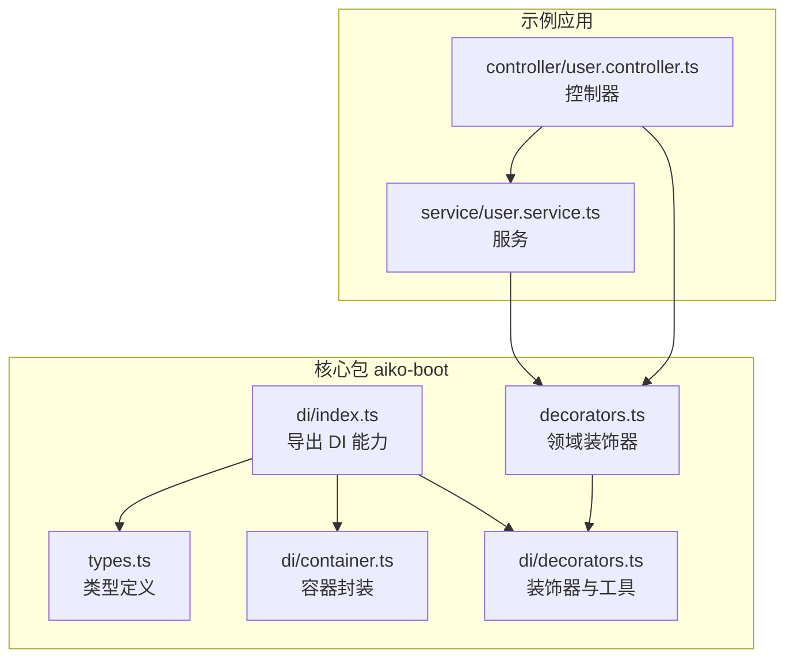
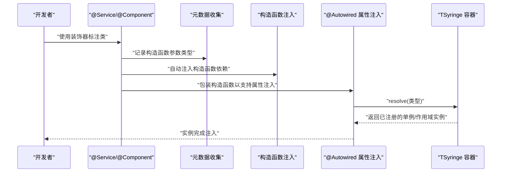
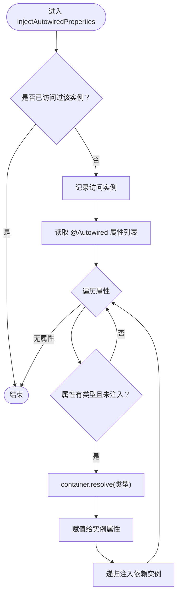
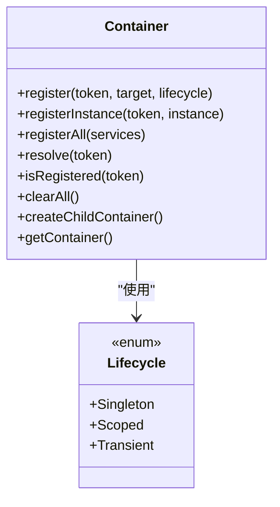
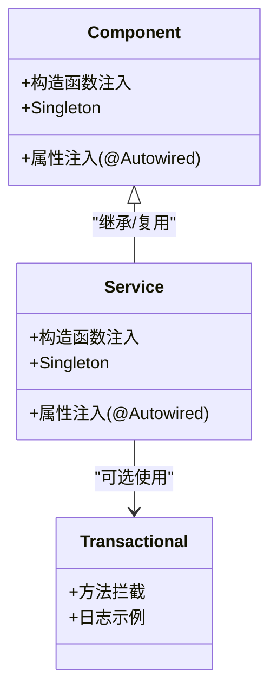
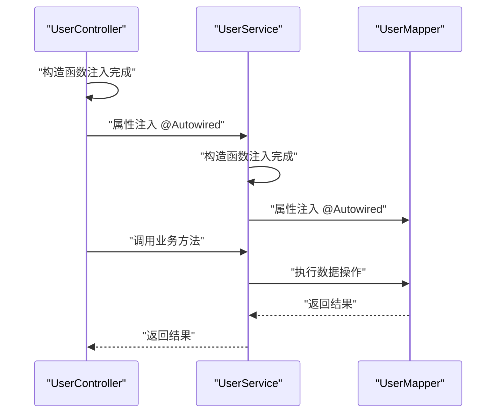
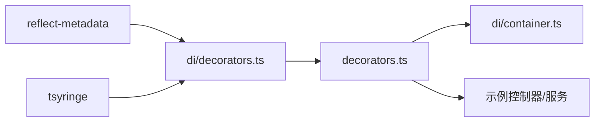

# 依赖注入系统

<cite>
**本文引用的文件**
- [packages/aiko-boot/src/di/decorators.ts](file://packages/aiko-boot/src/di/decorators.ts)
- [packages/aiko-boot/src/di/container.ts](file://packages/aiko-boot/src/di/container.ts)
- [packages/aiko-boot/src/di/index.ts](file://packages/aiko-boot/src/di/index.ts)
- [packages/aiko-boot/src/decorators.ts](file://packages/aiko-boot/src/decorators.ts)
- [packages/aiko-boot/src/types.ts](file://packages/aiko-boot/src/types.ts)
- [app/examples/user-crud/packages/api/src/controller/user.controller.ts](file://app/examples/user-crud/packages/api/src/controller/user.controller.ts)
- [app/examples/user-crud/packages/api/src/service/user.service.ts](file://app/examples/user-crud/packages/api/src/service/user.service.ts)
- [README.md](file://README.md)
</cite>

## 目录
1. [简介](#简介)
2. [项目结构](#项目结构)
3. [核心组件](#核心组件)
4. [架构总览](#架构总览)
5. [详细组件分析](#详细组件分析)
6. [依赖关系分析](#依赖关系分析)
7. [性能考量](#性能考量)
8. [故障排查指南](#故障排查指南)
9. [结论](#结论)
10. [附录](#附录)

## 简介
本技术文档围绕基于 tsyringe 的依赖注入（DI）容器实现，系统讲解以下内容：
- 基于 tsyringe 的容器封装与扩展
- 装饰器体系：Injectable、Singleton、Scoped、AutoRegister、Autowired
- 组件注册机制与生命周期管理
- 自动装配流程与依赖解析过程
- 循环依赖处理策略与最佳实践
- 在服务、控制器、实体管理器等场景中的完整示例
- 高级特性：作用域管理、生命周期控制、异常处理与调试技巧

## 项目结构
本项目的依赖注入能力由核心包 @ai-partner-x/aiko-boot 提供，主要文件分布如下：
- DI 装饰器与工具：packages/aiko-boot/src/di/decorators.ts
- DI 容器封装：packages/aiko-boot/src/di/container.ts
- DI 导出入口：packages/aiko-boot/src/di/index.ts
- 领域层装饰器（Service、Component 等）：packages/aiko-boot/src/decorators.ts
- 类型定义：packages/aiko-boot/src/types.ts
- 示例：控制器与服务的依赖注入用法见 app/examples/user-crud/packages/api/src/controller/user.controller.ts 与 app/examples/user-crud/packages/api/src/service/user.service.ts
- 顶层说明文档：README.md

图表来源
- [packages/aiko-boot/src/di/index.ts](file://packages/aiko-boot/src/di/index.ts#L1-L34)
- [packages/aiko-boot/src/di/decorators.ts](file://packages/aiko-boot/src/di/decorators.ts#L1-L110)
- [packages/aiko-boot/src/di/container.ts](file://packages/aiko-boot/src/di/container.ts#L1-L105)
- [packages/aiko-boot/src/decorators.ts](file://packages/aiko-boot/src/decorators.ts#L1-L158)
- [app/examples/user-crud/packages/api/src/controller/user.controller.ts](file://app/examples/user-crud/packages/api/src/controller/user.controller.ts#L1-L170)
- [app/examples/user-crud/packages/api/src/service/user.service.ts](file://app/examples/user-crud/packages/api/src/service/user.service.ts#L1-L251)

章节来源
- [packages/aiko-boot/src/di/index.ts](file://packages/aiko-boot/src/di/index.ts#L1-L34)
- [packages/aiko-boot/src/di/decorators.ts](file://packages/aiko-boot/src/di/decorators.ts#L1-L110)
- [packages/aiko-boot/src/di/container.ts](file://packages/aiko-boot/src/di/container.ts#L1-L105)
- [packages/aiko-boot/src/decorators.ts](file://packages/aiko-boot/src/decorators.ts#L1-L158)
- [README.md](file://README.md#L67-L72)

## 核心组件
- 装饰器与工具
  - Injectable、Inject、inject、Singleton、Scoped：直接 re-export 自 tsyringe，保持与 Spring 风格一致的命名与语义。
  - Autowired：属性注入装饰器，支持显式类型与反射类型推断；配合 getAutowiredProperties 与 injectAutowiredProperties 实现自动装配。
  - AutoRegister：自动注册装饰器，按生命周期（singleton/scoped/transient）自动完成注册。
- 容器封装
  - Container：对 tsyringe 的统一封装，提供 register/registerInstance/registerAll/resolve/isRegistered/clearAll/createChildContainer/getContainer 等方法，支持生命周期枚举 Lifecycle。
- 领域装饰器
  - Component、Service：自动注入构造函数依赖，应用 Injectable 与 Singleton；包装构造函数以支持 @Autowired 属性注入；复制元数据以保留类型信息。
  - Transactional：方法级事务装饰器（日志示例），用于演示扩展。

章节来源
- [packages/aiko-boot/src/di/decorators.ts](file://packages/aiko-boot/src/di/decorators.ts#L15-L109)
- [packages/aiko-boot/src/di/container.ts](file://packages/aiko-boot/src/di/container.ts#L10-L104)
- [packages/aiko-boot/src/decorators.ts](file://packages/aiko-boot/src/decorators.ts#L30-L118)
- [packages/aiko-boot/src/types.ts](file://packages/aiko-boot/src/types.ts#L8-L13)

## 架构总览
下图展示了依赖注入系统的核心交互：装饰器在编译期收集元数据，运行时通过容器解析依赖并注入到实例中；领域装饰器进一步封装构造函数注入与属性注入。

图表来源
- [packages/aiko-boot/src/decorators.ts](file://packages/aiko-boot/src/decorators.ts#L81-L118)
- [packages/aiko-boot/src/di/decorators.ts](file://packages/aiko-boot/src/di/decorators.ts#L42-L84)

## 详细组件分析

### 装饰器与自动装配（Autowired）
- Autowired 装饰器
  - 支持两种方式：显式传入类型或从设计时类型元数据推断。
  - 将属性信息写入类构造函数的元数据，键名为固定字符串，便于跨模块隔离。
- getAutowiredProperties
  - 从类构造函数读取已记录的 @Autowired 属性列表。
- injectAutowiredProperties
  - 对实例及其依赖进行递归注入，防止重复注入（使用 visited 集合）。
  - 通过 tsyringe 容器 resolve 解析依赖，未注册的依赖会静默失败（避免中断流程）。

图表来源
- [packages/aiko-boot/src/di/decorators.ts](file://packages/aiko-boot/src/di/decorators.ts#L67-L84)

章节来源
- [packages/aiko-boot/src/di/decorators.ts](file://packages/aiko-boot/src/di/decorators.ts#L42-L84)

### 组件注册机制（AutoRegister 与生命周期）
- AutoRegister
  - 自动应用 Injectable，并根据选项选择 Singleton 或 ContainerScoped（Scoped）或默认 transient。
  - 适用于快速将类注册为可注入组件。
- 生命周期
  - Singleton：应用级单例。
  - Scoped：容器作用域实例（ContainerScoped）。
  - Transient：每次解析创建新实例。
- Container 封装
  - register/registerInstance/registerAll/resolve/isRegistered/clearAll/createChildContainer/getContainer 提供统一接口。

图表来源
- [packages/aiko-boot/src/di/container.ts](file://packages/aiko-boot/src/di/container.ts#L22-L104)

章节来源
- [packages/aiko-boot/src/di/decorators.ts](file://packages/aiko-boot/src/di/decorators.ts#L89-L107)
- [packages/aiko-boot/src/di/container.ts](file://packages/aiko-boot/src/di/container.ts#L28-L96)

### 领域装饰器（Service、Component）
- Component
  - 自动注入构造函数依赖，应用 Injectable 与 Singleton。
  - 包装构造函数以支持 @Autowired 属性注入，并复制元数据。
- Service
  - 与 Component 类似，但面向业务服务层，常用于服务类。
- Transactional
  - 方法级装饰器示例，演示如何在调用前后打印事务日志（可替换为真实事务管理器）。

图表来源
- [packages/aiko-boot/src/decorators.ts](file://packages/aiko-boot/src/decorators.ts#L30-L118)

章节来源
- [packages/aiko-boot/src/decorators.ts](file://packages/aiko-boot/src/decorators.ts#L30-L118)
- [packages/aiko-boot/src/types.ts](file://packages/aiko-boot/src/types.ts#L8-L13)

### 控制器与服务的依赖注入示例
- 控制器（RestController）
  - 使用 @RestController 标注，自动注入构造函数依赖，同时支持 @Autowired 属性注入。
  - 示例中注入 UserService。
- 服务（Service）
  - 使用 @Service 标注，注入数据访问层（如 UserMapper）。
  - 通过 Transactional 装饰器标注事务方法（示例为日志演示）。

图表来源
- [app/examples/user-crud/packages/api/src/controller/user.controller.ts](file://app/examples/user-crud/packages/api/src/controller/user.controller.ts#L30-L34)
- [app/examples/user-crud/packages/api/src/service/user.service.ts](file://app/examples/user-crud/packages/api/src/service/user.service.ts#L30-L33)

章节来源
- [app/examples/user-crud/packages/api/src/controller/user.controller.ts](file://app/examples/user-crud/packages/api/src/controller/user.controller.ts#L1-L170)
- [app/examples/user-crud/packages/api/src/service/user.service.ts](file://app/examples/user-crud/packages/api/src/service/user.service.ts#L1-L251)
- [README.md](file://README.md#L113-L157)

## 依赖关系分析
- 装饰器层
  - di/decorators.ts 依赖 reflect-metadata 与 tsyringe，提供 Autowired、AutoRegister、injectAutowiredProperties 等能力。
  - decorators.ts 依赖 di/server.js（即 di/decorators.ts 的打包产物），提供 Component、Service、Transactional 等领域装饰器。
- 容器层
  - di/container.ts 封装 tsyringe 的 container 与 Lifecycle，提供统一注册与解析接口。
- 应用层
  - 示例控制器与服务通过 @Service、@Autowired、@RestController 等装饰器完成依赖注入。

图表来源
- [packages/aiko-boot/src/di/decorators.ts](file://packages/aiko-boot/src/di/decorators.ts#L4-L13)
- [packages/aiko-boot/src/decorators.ts](file://packages/aiko-boot/src/decorators.ts#L9-L11)
- [packages/aiko-boot/src/di/container.ts](file://packages/aiko-boot/src/di/container.ts#L4-L5)

章节来源
- [packages/aiko-boot/src/di/decorators.ts](file://packages/aiko-boot/src/di/decorators.ts#L1-L110)
- [packages/aiko-boot/src/decorators.ts](file://packages/aiko-boot/src/decorators.ts#L1-L158)
- [packages/aiko-boot/src/di/container.ts](file://packages/aiko-boot/src/di/container.ts#L1-L105)

## 性能考量
- 单例与作用域
  - 优先使用 Singleton 降低对象创建开销；对请求/会话相关场景使用 Scoped。
- 递归注入与循环依赖
  - injectAutowiredProperties 使用 visited 集合避免重复注入；对于强耦合依赖应重构设计，避免循环依赖。
- 清理与测试
  - 使用 clearAll 清空容器实例，确保测试隔离；在生产环境谨慎清理容器状态。
- 解析成本
  - 频繁 resolve 的场景建议缓存结果或合并批量注册（registerAll）。

## 故障排查指南
- 注入失败
  - 症状：属性未注入或为 undefined。
  - 排查：确认目标类已被正确注册（Injectable/Singleton/AutoRegister），检查类型是否匹配，确保 tsyringe 容器已解析过该类型。
- 未注册依赖
  - 症状：resolve 抛错或注入静默失败。
  - 排查：使用 isRegistered 检查令牌是否已注册；必要时使用 register/registerInstance 显式注册。
- 循环依赖
  - 症状：构造函数或属性注入导致死循环或性能问题。
  - 排查：拆分职责、引入接口抽象、使用工厂模式延迟解析。
- 元数据缺失
  - 症状：@Autowired 无法推断类型。
  - 排查：启用 emitDecoratorMetadata，确保 tsconfig 启用了相应编译选项。

章节来源
- [packages/aiko-boot/src/di/decorators.ts](file://packages/aiko-boot/src/di/decorators.ts#L67-L84)
- [packages/aiko-boot/src/di/container.ts](file://packages/aiko-boot/src/di/container.ts#L80-L82)

## 结论
本依赖注入系统以 tsyringe 为基础，结合自定义装饰器与容器封装，提供了与 Spring 风格一致的开发体验。通过 @Service、@Component、@Autowired、AutoRegister 等装饰器，开发者可以快速声明式地完成组件注册与自动装配；通过 Container 的生命周期管理与 resolve 机制，满足单例、作用域与瞬态等多样化需求。配合示例应用中的控制器与服务，可高效构建可维护的业务层与表现层。

## 附录
- 快速上手要点
  - 使用 @Service/@Component 标注业务类，自动完成构造函数注入与属性注入。
  - 使用 @Autowired 标注需要注入的属性，必要时显式传入类型。
  - 使用 AutoRegister 快速注册，按需选择生命周期。
  - 在复杂场景中，使用 Container.register/registerInstance/registerAll 精细控制注册行为。
- 参考示例路径
  - 控制器示例：[app/examples/user-crud/packages/api/src/controller/user.controller.ts](file://app/examples/user-crud/packages/api/src/controller/user.controller.ts#L30-L34)
  - 服务示例：[app/examples/user-crud/packages/api/src/service/user.service.ts](file://app/examples/user-crud/packages/api/src/service/user.service.ts#L30-L33)
  - 装饰器说明：[README.md](file://README.md#L67-L72)