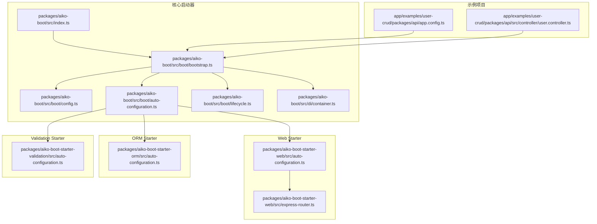
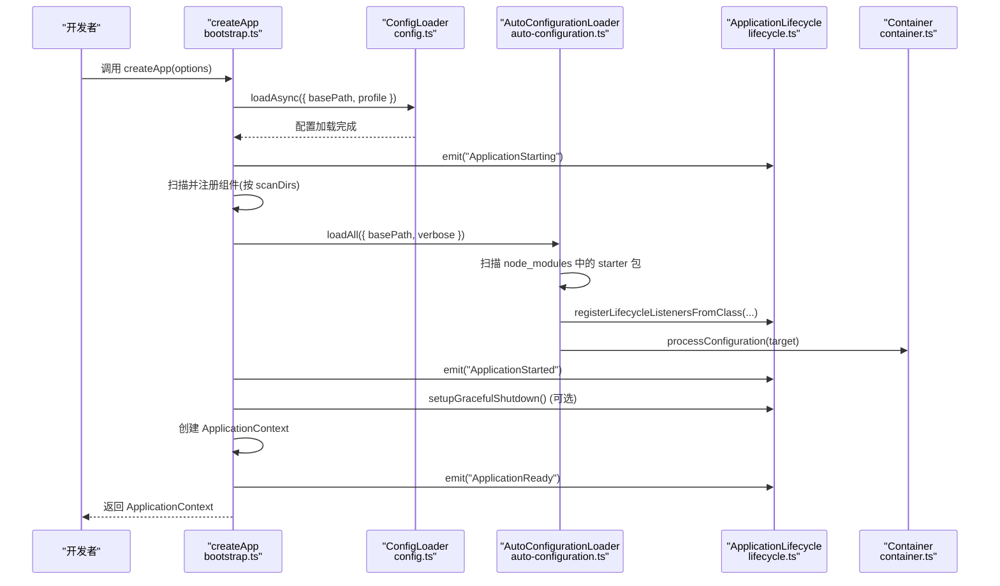
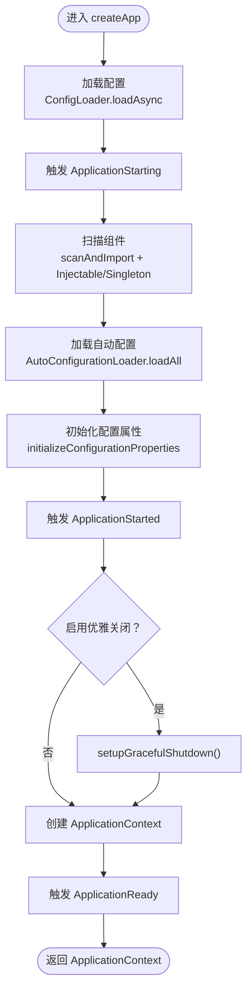
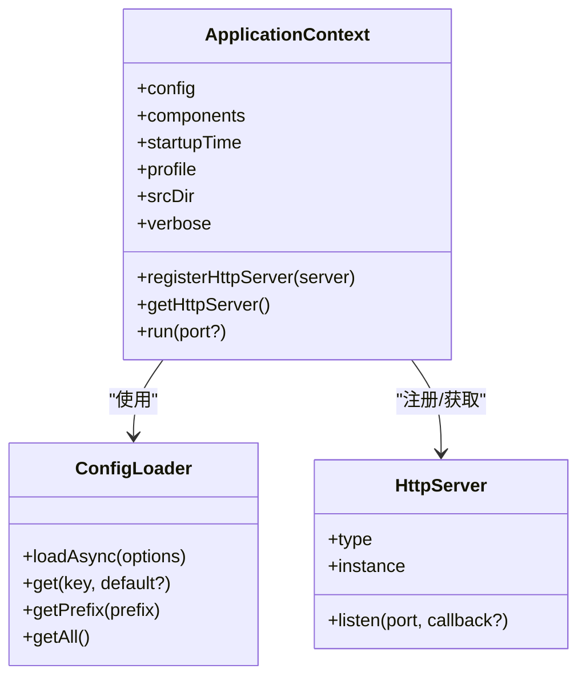
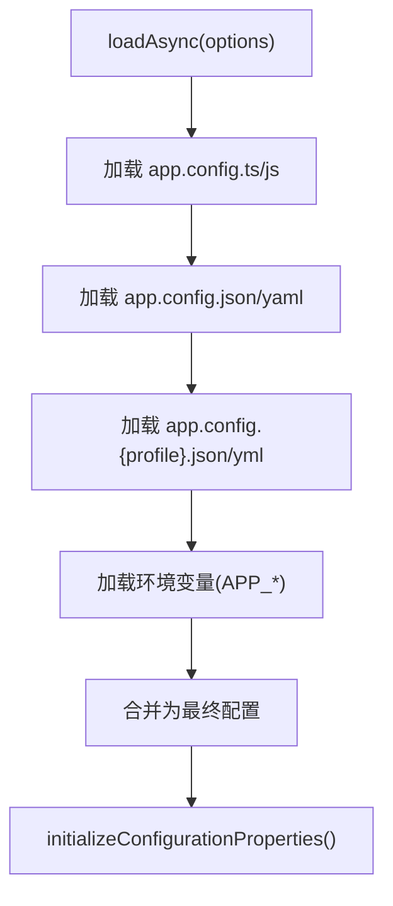
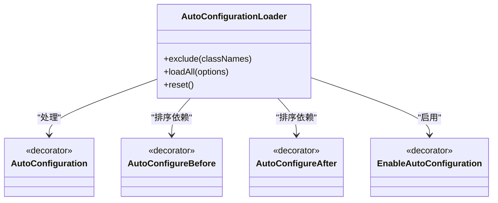
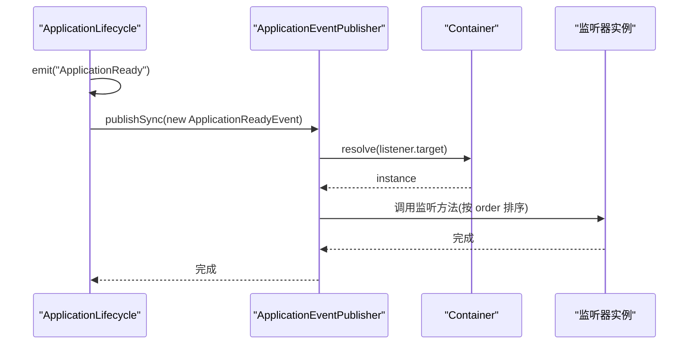
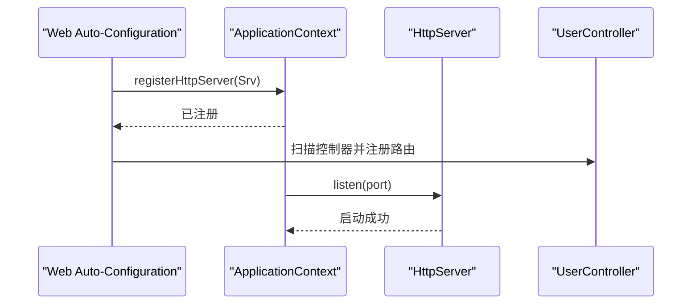
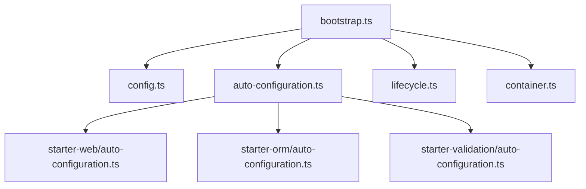

# 应用启动器

<cite>
**本文引用的文件**
- [packages/aiko-boot/src/index.ts](file://packages/aiko-boot/src/index.ts)
- [packages/aiko-boot/src/boot/bootstrap.ts](file://packages/aiko-boot/src/boot/bootstrap.ts)
- [packages/aiko-boot/src/boot/auto-configuration.ts](file://packages/aiko-boot/src/boot/auto-configuration.ts)
- [packages/aiko-boot/src/boot/lifecycle.ts](file://packages/aiko-boot/src/boot/lifecycle.ts)
- [packages/aiko-boot/src/boot/config.ts](file://packages/aiko-boot/src/boot/config.ts)
- [packages/aiko-boot/src/config-types.ts](file://packages/aiko-boot/src/config-types.ts)
- [packages/aiko-boot/src/di/container.ts](file://packages/aiko-boot/src/di/container.ts)
- [packages/aiko-boot-starter-web/src/auto-configuration.ts](file://packages/aiko-boot-starter-web/src/auto-configuration.ts)
- [packages/aiko-boot-starter-orm/src/auto-configuration.ts](file://packages/aiko-boot-starter-orm/src/auto-configuration.ts)
- [packages/aiko-boot-starter-validation/src/auto-configuration.ts](file://packages/aiko-boot-starter-validation/src/auto-configuration.ts)
- [packages/aiko-boot-starter-web/src/express-router.ts](file://packages/aiko-boot-starter-web/src/express-router.ts)
- [app/examples/user-crud/packages/api/src/controller/user.controller.ts](file://app/examples/user-crud/packages/api/src/controller/user.controller.ts)
- [app/examples/user-crud/packages/api/app.config.ts](file://app/examples/user-crud/packages/api/app.config.ts)
</cite>

## 目录
1. [简介](#简介)
2. [项目结构](#项目结构)
3. [核心组件](#核心组件)
4. [架构总览](#架构总览)
5. [详细组件分析](#详细组件分析)
6. [依赖关系分析](#依赖关系分析)
7. [性能考量](#性能考量)
8. [故障排查指南](#故障排查指南)
9. [结论](#结论)
10. [附录](#附录)

## 简介
本技术文档围绕应用启动器展开，重点解释 createApp 函数的实现原理与 Spring Boot 风格启动流程，涵盖配置加载、组件扫描、自动配置处理、生命周期事件触发、HTTP 服务器集成以及优雅关闭机制。同时对 ApplicationContext 接口、AppOptions 配置项进行系统说明，并提供启动示例与最佳实践建议，帮助开发者快速理解并正确使用该启动器。

## 项目结构
本仓库采用 monorepo 结构，核心启动器位于 packages/aiko-boot，配套 starter 包包括 web、orm、validation 等，示例项目位于 app/examples。启动器通过装饰器驱动的依赖注入与自动配置机制，实现“约定优于配置”的启动体验。

图表来源
- [packages/aiko-boot/src/index.ts](file://packages/aiko-boot/src/index.ts#L1-L64)
- [packages/aiko-boot/src/boot/bootstrap.ts](file://packages/aiko-boot/src/boot/bootstrap.ts#L1-L354)
- [packages/aiko-boot/src/boot/config.ts](file://packages/aiko-boot/src/boot/config.ts#L1-L448)
- [packages/aiko-boot/src/boot/auto-configuration.ts](file://packages/aiko-boot/src/boot/auto-configuration.ts#L1-L451)
- [packages/aiko-boot/src/boot/lifecycle.ts](file://packages/aiko-boot/src/boot/lifecycle.ts#L1-L457)
- [packages/aiko-boot/src/di/container.ts](file://packages/aiko-boot/src/di/container.ts#L1-L105)
- [packages/aiko-boot-starter-web/src/auto-configuration.ts](file://packages/aiko-boot-starter-web/src/auto-configuration.ts)
- [packages/aiko-boot-starter-web/src/express-router.ts](file://packages/aiko-boot-starter-web/src/express-router.ts)
- [packages/aiko-boot-starter-orm/src/auto-configuration.ts](file://packages/aiko-boot-starter-orm/src/auto-configuration.ts)
- [packages/aiko-boot-starter-validation/src/auto-configuration.ts](file://packages/aiko-boot-starter-validation/src/auto-configuration.ts)
- [app/examples/user-crud/packages/api/app.config.ts](file://app/examples/user-crud/packages/api/app.config.ts)
- [app/examples/user-crud/packages/api/src/controller/user.controller.ts](file://app/examples/user-crud/packages/api/src/controller/user.controller.ts)

章节来源
- [packages/aiko-boot/src/index.ts](file://packages/aiko-boot/src/index.ts#L1-L64)
- [packages/aiko-boot/src/boot/bootstrap.ts](file://packages/aiko-boot/src/boot/bootstrap.ts#L1-L354)

## 核心组件
- createApp：应用启动入口，负责配置加载、组件扫描、自动配置、生命周期事件与 HTTP 服务器集成。
- ApplicationContext：启动后返回的应用上下文，提供配置访问、组件集合、HTTP 服务器注册与运行控制。
- AppOptions：启动参数，包括 srcDir、profile、scanDirs、enableAutoConfiguration、excludeAutoConfigurations、enableGracefulShutdown 等。
- ConfigLoader：配置加载器，支持 app.config.ts/js/json/yaml 与环境变量合并。
- AutoConfigurationLoader：自动配置加载器，扫描 node_modules 中的 starter 包并按拓扑顺序处理。
- ApplicationLifecycle：生命周期事件系统，提供 @EventListener、@OnApplication* 等装饰器与事件发布。
- Container：基于 TSyringe 的依赖注入容器封装，提供生命周期注册与实例解析。

章节来源
- [packages/aiko-boot/src/boot/bootstrap.ts](file://packages/aiko-boot/src/boot/bootstrap.ts#L46-L94)
- [packages/aiko-boot/src/boot/config.ts](file://packages/aiko-boot/src/boot/config.ts#L49-L143)
- [packages/aiko-boot/src/boot/auto-configuration.ts](file://packages/aiko-boot/src/boot/auto-configuration.ts#L180-L214)
- [packages/aiko-boot/src/boot/lifecycle.ts](file://packages/aiko-boot/src/boot/lifecycle.ts#L312-L398)
- [packages/aiko-boot/src/di/container.ts](file://packages/aiko-boot/src/di/container.ts#L22-L104)

## 架构总览
下图展示 createApp 的启动流程与关键交互：

图表来源
- [packages/aiko-boot/src/boot/bootstrap.ts](file://packages/aiko-boot/src/boot/bootstrap.ts#L132-L289)
- [packages/aiko-boot/src/boot/config.ts](file://packages/aiko-boot/src/boot/config.ts#L111-L143)
- [packages/aiko-boot/src/boot/auto-configuration.ts](file://packages/aiko-boot/src/boot/auto-configuration.ts#L196-L214)
- [packages/aiko-boot/src/boot/lifecycle.ts](file://packages/aiko-boot/src/boot/lifecycle.ts#L319-L349)
- [packages/aiko-boot/src/di/container.ts](file://packages/aiko-boot/src/di/container.ts#L22-L104)

## 详细组件分析

### createApp 启动流程详解
- 配置加载阶段：优先加载 app.config.ts/js，再加载 app.config.json/yaml 及 profile 特定文件，最后合并环境变量，形成最终配置。
- 生命周期事件：依次触发 ApplicationStarting、ApplicationStarted、ApplicationReady。
- 组件扫描：遍历 scanDirs（默认 mapper、service、controller），动态导入模块并标注为可注入与单例。
- 自动配置：扫描 node_modules 中的 @ai-partner-x/aiko-boot-starter-* 包，按 @AutoConfigureBefore/@AutoConfigureAfter 与 order 进行拓扑排序，逐个处理。
- 配置属性初始化：解析 @ConfigurationProperties 与 @Value，将配置绑定到类实例。
- 优雅关闭：根据 server.shutdown 配置决定是否启用 graceful shutdown。
- 上下文创建：构建 ApplicationContext 并设置为全局上下文，随后触发 ApplicationReady。

图表来源
- [packages/aiko-boot/src/boot/bootstrap.ts](file://packages/aiko-boot/src/boot/bootstrap.ts#L132-L289)

章节来源
- [packages/aiko-boot/src/boot/bootstrap.ts](file://packages/aiko-boot/src/boot/bootstrap.ts#L132-L289)
- [packages/aiko-boot/src/boot/config.ts](file://packages/aiko-boot/src/boot/config.ts#L111-L143)
- [packages/aiko-boot/src/boot/auto-configuration.ts](file://packages/aiko-boot/src/boot/auto-configuration.ts#L196-L214)
- [packages/aiko-boot/src/boot/lifecycle.ts](file://packages/aiko-boot/src/boot/lifecycle.ts#L319-L349)

### ApplicationContext 接口设计与使用
- 配置访问：context.config 提供 ConfigLoader 能力，支持 get/getPrefix/getAll 等。
- 组件管理：context.components 保存按目录分类的组件类列表，便于调试与扩展。
- HTTP 服务器集成：registerHttpServer/getHttpServer/run 提供 HTTP 服务器注册与启动能力；通常由 aiko-boot-starter-web 在自动配置中注册。
- 生命周期：通过 ApplicationLifecycle 发布与订阅事件，实现启动后初始化、关闭清理等逻辑。

图表来源
- [packages/aiko-boot/src/boot/bootstrap.ts](file://packages/aiko-boot/src/boot/bootstrap.ts#L46-L67)
- [packages/aiko-boot/src/boot/config.ts](file://packages/aiko-boot/src/boot/config.ts#L49-L190)

章节来源
- [packages/aiko-boot/src/boot/bootstrap.ts](file://packages/aiko-boot/src/boot/bootstrap.ts#L46-L67)

### AppOptions 配置选项详解
- srcDir：源代码目录，组件扫描以此为基准。
- configPath：配置文件所在目录，默认为 srcDir 的父目录。
- profile：运行环境，默认取自 NODE_ENV。
- enableAutoConfiguration：是否启用自动配置，默认开启。
- excludeAutoConfigurations：排除的自动配置类名列表。
- verbose：是否输出详细日志，默认依据 logging.level.root 推断。
- scanDirs：扫描目录列表，默认 ['mapper', 'service', 'controller']。
- enableGracefulShutdown：是否启用优雅关闭，默认依据 server.shutdown 推断。

章节来源
- [packages/aiko-boot/src/boot/bootstrap.ts](file://packages/aiko-boot/src/boot/bootstrap.ts#L72-L89)

### 配置系统（ConfigLoader）
- 文件加载顺序：app.config.ts/js > app.config.json/yaml > app.config.{profile}.{json,yaml,yml} > 环境变量。
- 环境变量映射：APP_DATABASE_HOST -> database.host。
- 配置属性绑定：@ConfigurationProperties 将配置前缀绑定到类实例；@Value 注入单个属性。
- 初始化：initializeConfigurationProperties 通过 DI 容器解析，触发构造函数中的配置绑定。

图表来源
- [packages/aiko-boot/src/boot/config.ts](file://packages/aiko-boot/src/boot/config.ts#L111-L143)
- [packages/aiko-boot/src/boot/config.ts](file://packages/aiko-boot/src/boot/config.ts#L438-L447)

章节来源
- [packages/aiko-boot/src/boot/config.ts](file://packages/aiko-boot/src/boot/config.ts#L49-L190)
- [packages/aiko-boot/src/boot/config.ts](file://packages/aiko-boot/src/boot/config.ts#L334-L364)
- [packages/aiko-boot/src/boot/config.ts](file://packages/aiko-boot/src/boot/config.ts#L382-L392)
- [packages/aiko-boot/src/boot/config.ts](file://packages/aiko-boot/src/boot/config.ts#L438-L447)

### 自动配置（AutoConfigurationLoader）
- 发现机制：扫描 node_modules 下 @ai-partner-x/aiko-boot-starter-* 包，约定从 dist/index.js 导出自动配置类。
- 装饰器支持：@AutoConfiguration、@AutoConfigureBefore、@AutoConfigureAfter、@EnableAutoConfiguration。
- 拓扑排序：根据 before/after 与 order 字段进行拓扑排序，确保加载顺序。
- 条件加载：结合条件注解（如 @ConditionalOn*）判断是否加载。

图表来源
- [packages/aiko-boot/src/boot/auto-configuration.ts](file://packages/aiko-boot/src/boot/auto-configuration.ts#L180-L214)
- [packages/aiko-boot/src/boot/auto-configuration.ts](file://packages/aiko-boot/src/boot/auto-configuration.ts#L104-L124)
- [packages/aiko-boot/src/boot/auto-configuration.ts](file://packages/aiko-boot/src/boot/auto-configuration.ts#L131-L152)
- [packages/aiko-boot/src/boot/auto-configuration.ts](file://packages/aiko-boot/src/boot/auto-configuration.ts#L165-L175)

章节来源
- [packages/aiko-boot/src/boot/auto-configuration.ts](file://packages/aiko-boot/src/boot/auto-configuration.ts#L180-L214)
- [packages/aiko-boot/src/boot/auto-configuration.ts](file://packages/aiko-boot/src/boot/auto-configuration.ts#L313-L354)

### 生命周期事件（ApplicationLifecycle）
- 装饰器：@EventListener、@OnApplicationStarting、@OnApplicationStarted、@OnApplicationReady、@OnApplicationShutdown、@Async。
- 事件发布：ApplicationEventPublisher 提供 publish/publishSync。
- 优雅关闭：setupGracefulShutdown 注册 SIGINT/SIGTERM 处理，触发 ApplicationShutdown 并执行注册的关闭处理器。

图表来源
- [packages/aiko-boot/src/boot/lifecycle.ts](file://packages/aiko-boot/src/boot/lifecycle.ts#L319-L349)
- [packages/aiko-boot/src/boot/lifecycle.ts](file://packages/aiko-boot/src/boot/lifecycle.ts#L261-L307)

章节来源
- [packages/aiko-boot/src/boot/lifecycle.ts](file://packages/aiko-boot/src/boot/lifecycle.ts#L107-L134)
- [packages/aiko-boot/src/boot/lifecycle.ts](file://packages/aiko-boot/src/boot/lifecycle.ts#L152-L181)
- [packages/aiko-boot/src/boot/lifecycle.ts](file://packages/aiko-boot/src/boot/lifecycle.ts#L361-L387)

### HTTP 服务器集成（aiko-boot-starter-web）
- 自动配置：Web Starter 的自动配置类在加载时向 ApplicationContext 注册 HttpServer。
- 路由：Express 路由器通过装饰器扫描控制器并注册路由。
- 启动：调用 context.run() 启动 HTTP 服务器，遵循 server.port 配置。

图表来源
- [packages/aiko-boot/src/boot/bootstrap.ts](file://packages/aiko-boot/src/boot/bootstrap.ts#L227-L271)
- [packages/aiko-boot-starter-web/src/auto-configuration.ts](file://packages/aiko-boot-starter-web/src/auto-configuration.ts)
- [packages/aiko-boot-starter-web/src/express-router.ts](file://packages/aiko-boot-starter-web/src/express-router.ts)
- [app/examples/user-crud/packages/api/src/controller/user.controller.ts](file://app/examples/user-crud/packages/api/src/controller/user.controller.ts)

章节来源
- [packages/aiko-boot/src/boot/bootstrap.ts](file://packages/aiko-boot/src/boot/bootstrap.ts#L227-L271)
- [packages/aiko-boot-starter-web/src/auto-configuration.ts](file://packages/aiko-boot-starter-web/src/auto-configuration.ts)
- [packages/aiko-boot-starter-web/src/express-router.ts](file://packages/aiko-boot-starter-web/src/express-router.ts)

### 优雅关闭机制
- 配置项：server.shutdown 支持 graceful 或 immediate。
- 启用方式：createApp 会根据配置自动 setupGracefulShutdown；也可手动调用 setupGracefulShutdown。
- 关闭流程：接收信号后触发 ApplicationShutdown 事件，执行注册的关闭处理器，最后退出进程。

章节来源
- [packages/aiko-boot/src/boot/bootstrap.ts](file://packages/aiko-boot/src/boot/bootstrap.ts#L211-L214)
- [packages/aiko-boot/src/boot/lifecycle.ts](file://packages/aiko-boot/src/boot/lifecycle.ts#L361-L387)

## 依赖关系分析
- 启动器核心依赖 TSyringe 进行依赖注入，通过 Container 封装注册与解析。
- 自动配置依赖反射元数据与全局存储，确保跨模块实例共享。
- 生命周期事件依赖装饰器元数据与容器解析，支持同步与异步监听器。
- Web Starter 通过自动配置注册 HttpServer，与 ApplicationContext 解耦。

图表来源
- [packages/aiko-boot/src/boot/bootstrap.ts](file://packages/aiko-boot/src/boot/bootstrap.ts#L25-L29)
- [packages/aiko-boot/src/boot/auto-configuration.ts](file://packages/aiko-boot/src/boot/auto-configuration.ts#L262-L264)
- [packages/aiko-boot-starter-web/src/auto-configuration.ts](file://packages/aiko-boot-starter-web/src/auto-configuration.ts)
- [packages/aiko-boot-starter-orm/src/auto-configuration.ts](file://packages/aiko-boot-starter-orm/src/auto-configuration.ts)
- [packages/aiko-boot-starter-validation/src/auto-configuration.ts](file://packages/aiko-boot-starter-validation/src/auto-configuration.ts)

章节来源
- [packages/aiko-boot/src/boot/bootstrap.ts](file://packages/aiko-boot/src/boot/bootstrap.ts#L25-L29)
- [packages/aiko-boot/src/di/container.ts](file://packages/aiko-boot/src/di/container.ts#L22-L104)

## 性能考量
- 组件扫描：合理设置 scanDirs，避免扫描过多无关目录。
- 自动配置：排除不必要的 starter 包，减少加载与初始化开销。
- 日志级别：在生产环境使用 info/warn，避免 debug 造成 I/O 压力。
- 优雅关闭：确保关闭处理器快速完成清理，缩短停机窗口。

## 故障排查指南
- 配置未生效：检查 app.config.ts/js 是否存在，确认 profile 与环境变量命名规则。
- 组件未注册：确认文件扩展名与命名规范，避免 d.ts/test.ts/spec.ts 等文件参与扫描。
- 自动配置未加载：检查 node_modules 中 starter 包是否安装，dist/index.js 是否存在。
- 启动后无 HTTP 服务器：确认已引入 aiko-boot-starter-web，且在自动配置中注册了 HttpServer。
- 优雅关闭无效：检查 server.shutdown 配置与信号量，确认关闭处理器已注册。

章节来源
- [packages/aiko-boot/src/boot/bootstrap.ts](file://packages/aiko-boot/src/boot/bootstrap.ts#L308-L353)
- [packages/aiko-boot/src/boot/lifecycle.ts](file://packages/aiko-boot/src/boot/lifecycle.ts#L361-L387)

## 结论
该启动器以 Spring Boot 风格为核心，通过配置加载、组件扫描、自动配置与生命周期事件，构建了清晰、可扩展的应用启动流程。配合 ApplicationContext 的统一访问与 HTTP 服务器集成，开发者可以快速搭建从 CLI 到 Web 的全栈应用。建议在实际项目中合理配置 AppOptions 与 server.shutdown，充分利用装饰器与自动配置，提升开发效率与运行稳定性。

## 附录

### 启动示例与最佳实践
- 基础启动（无 HTTP 服务器）
  - 使用 createApp({ srcDir })，仅加载配置与组件，适合纯服务端任务。
- 配合 Web Starter 启动
  - 安装并引入 aiko-boot-starter-web，自动配置会注册 HttpServer；随后调用 context.run() 启动。
- 配置文件示例
  - app.config.ts/js 支持 TypeScript 编写，便于类型安全与复杂逻辑；app.config.json/yaml 适合简单配置。
- 最佳实践
  - 明确 scanDirs，避免扫描测试与声明文件。
  - 使用 @ConfigurationProperties 与 @Value 管理配置，保持代码可维护性。
  - 在 @OnApplicationReady 中进行缓存预热、连接池初始化等操作。
  - 在 @OnApplicationShutdown 中释放资源，确保 graceful shutdown 生效。

章节来源
- [packages/aiko-boot/src/boot/bootstrap.ts](file://packages/aiko-boot/src/boot/bootstrap.ts#L115-L131)
- [app/examples/user-crud/packages/api/app.config.ts](file://app/examples/user-crud/packages/api/app.config.ts)
- [app/examples/user-crud/packages/api/src/controller/user.controller.ts](file://app/examples/user-crud/packages/api/src/controller/user.controller.ts)