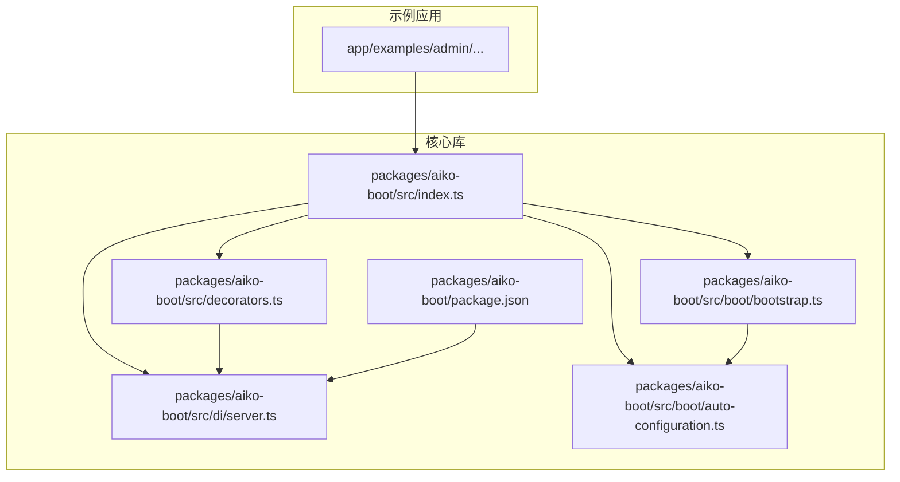
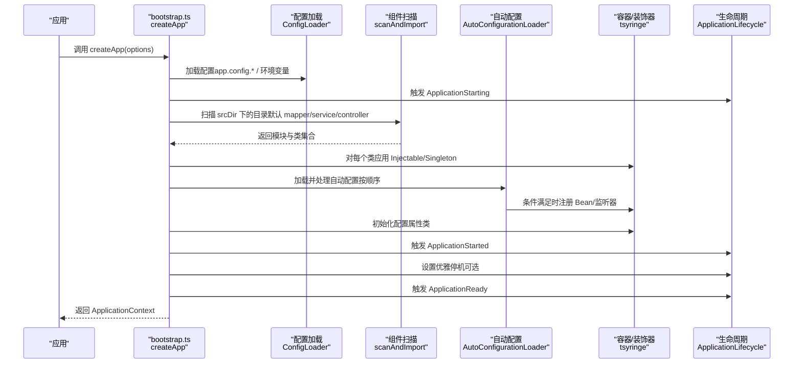
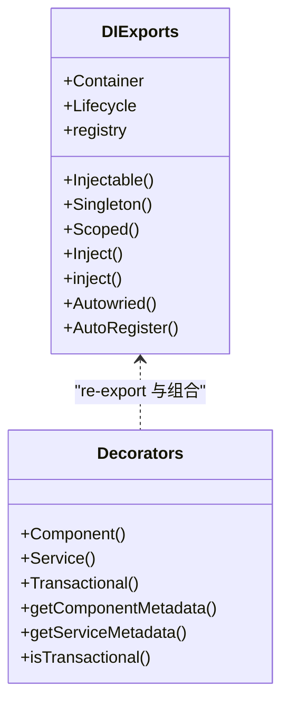
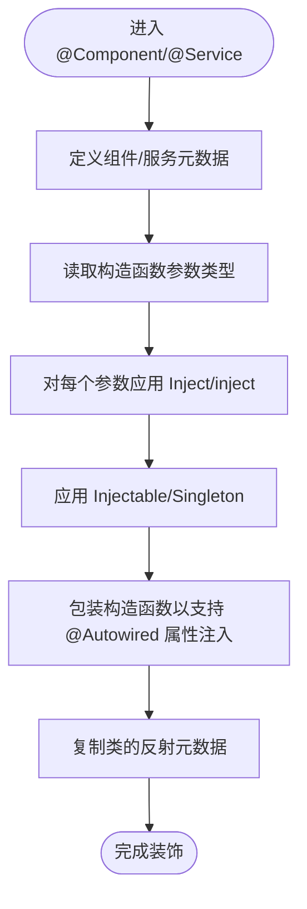
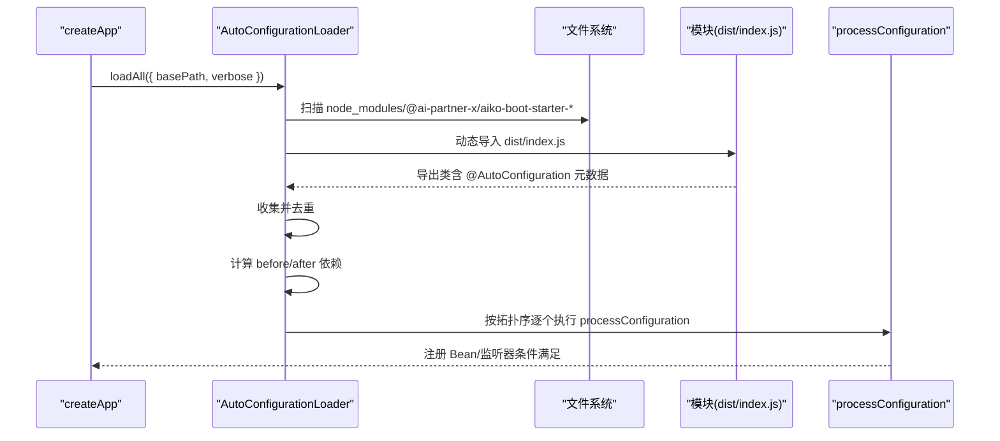
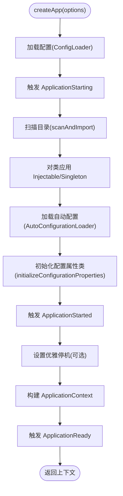
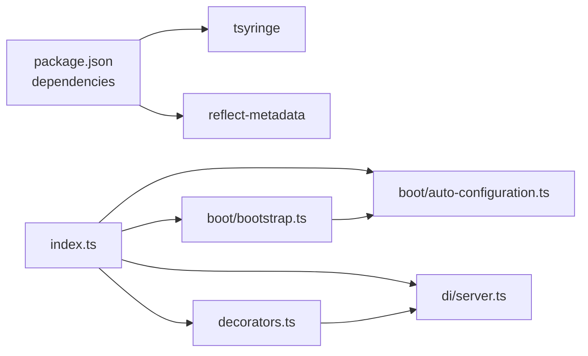

# 核心框架（Aiko Boot）

<cite>
**本文引用的文件**
- [packages/aiko-boot/src/index.ts](file://packages/aiko-boot/src/index.ts)
- [packages/aiko-boot/src/boot/bootstrap.ts](file://packages/aiko-boot/src/boot/bootstrap.ts)
- [packages/aiko-boot/src/decorators.ts](file://packages/aiko-boot/src/decorators.ts)
- [packages/aiko-boot/src/di/server.ts](file://packages/aiko-boot/src/di/server.ts)
- [packages/aiko-boot/src/boot/auto-configuration.ts](file://packages/aiko-boot/src/boot/auto-configuration.ts)
- [packages/aiko-boot/package.json](file://packages/aiko-boot/package.json)
- [packages/aiko-boot/src/types.ts](file://packages/aiko-boot/src/types.ts)
</cite>

## 目录
1. [简介](#简介)
2. [项目结构](#项目结构)
3. [核心组件](#核心组件)
4. [架构总览](#架构总览)
5. [详细组件分析](#详细组件分析)
6. [依赖关系分析](#依赖关系分析)
7. [性能考虑](#性能考虑)
8. [故障排查指南](#故障排查指南)
9. [结论](#结论)
10. [附录](#附录)

## 简介
本文件面向开发者，系统化阐述 Aiko Boot 核心框架的技术设计与实现要点，重点覆盖以下方面：
- 依赖注入系统：基于 tsyringe 的容器集成与装饰器驱动的组件注册机制
- 自动配置机制：条件装配、配置加载与环境检测
- 应用启动流程：从 bootstrap 到组件扫描的完整过程
- 生命周期管理：组件初始化、销毁与事件处理
- 装饰器体系：@Service、@Autowired、@Inject 等核心装饰器的使用方法与最佳实践
- 实战示例与排错建议：帮助快速上手并稳定落地

## 项目结构
Aiko Boot 采用多包工作区组织，核心库位于 packages/aiko-boot，提供依赖注入、装饰器、自动配置与启动引导等能力；其他包如 aiko-boot-starter-web、aiko-boot-starter-orm 等通过约定式自动配置扩展功能。

图表来源
- [packages/aiko-boot/src/index.ts](file://packages/aiko-boot/src/index.ts#L1-L64)
- [packages/aiko-boot/src/boot/bootstrap.ts](file://packages/aiko-boot/src/boot/bootstrap.ts#L1-L354)
- [packages/aiko-boot/src/decorators.ts](file://packages/aiko-boot/src/decorators.ts#L1-L158)
- [packages/aiko-boot/src/di/server.ts](file://packages/aiko-boot/src/di/server.ts#L1-L26)
- [packages/aiko-boot/src/boot/auto-configuration.ts](file://packages/aiko-boot/src/boot/auto-configuration.ts#L1-L451)
- [packages/aiko-boot/package.json](file://packages/aiko-boot/package.json#L1-L61)

章节来源
- [packages/aiko-boot/src/index.ts](file://packages/aiko-boot/src/index.ts#L1-L64)
- [packages/aiko-boot/package.json](file://packages/aiko-boot/package.json#L1-L61)

## 核心组件
- 依赖注入与容器包装：通过 re-export tsyringe 的核心类型与装饰器，并提供服务端专用导出，避免 React 依赖污染
- 装饰器体系：@Component、@Service、@Transactional 等，统一领域层注解风格
- 启动引导：createApp 提供 Spring Boot 风格的启动流程，含配置加载、组件扫描、自动配置与生命周期事件
- 自动配置：约定式扫描 starter 包，支持条件装配与拓扑排序加载
- 配置系统：支持 JSON/YAML/TS 配置与环境变量，提供统一读取与初始化

章节来源
- [packages/aiko-boot/src/di/server.ts](file://packages/aiko-boot/src/di/server.ts#L1-L26)
- [packages/aiko-boot/src/decorators.ts](file://packages/aiko-boot/src/decorators.ts#L1-L158)
- [packages/aiko-boot/src/boot/bootstrap.ts](file://packages/aiko-boot/src/boot/bootstrap.ts#L1-L354)
- [packages/aiko-boot/src/boot/auto-configuration.ts](file://packages/aiko-boot/src/boot/auto-configuration.ts#L1-L451)
- [packages/aiko-boot/src/types.ts](file://packages/aiko-boot/src/types.ts#L1-L14)

## 架构总览
下图展示 Aiko Boot 的启动与运行时交互：应用通过 createApp 启动，加载配置、扫描组件、执行自动配置、初始化配置属性类，随后触发生命周期事件，最终可选择启动 HTTP 服务器。

图表来源
- [packages/aiko-boot/src/boot/bootstrap.ts](file://packages/aiko-boot/src/boot/bootstrap.ts#L132-L289)
- [packages/aiko-boot/src/boot/auto-configuration.ts](file://packages/aiko-boot/src/boot/auto-configuration.ts#L180-L214)

章节来源
- [packages/aiko-boot/src/boot/bootstrap.ts](file://packages/aiko-boot/src/boot/bootstrap.ts#L115-L289)
- [packages/aiko-boot/src/boot/auto-configuration.ts](file://packages/aiko-boot/src/boot/auto-configuration.ts#L177-L214)

## 详细组件分析

### 依赖注入与容器集成（tsyringe）
- 容器与装饰器导出：服务端专用导出仅包含与服务端相关的装饰器与容器包装，避免引入 React 依赖
- 装饰器行为：
  - Injectable：标记类可被容器注入
  - Singleton/Scoped：控制作用域
  - Inject/inject：参数注入
  - Autowired：属性注入
  - AutoRegister：自动注册（由 @Component/@Service 内部触发）
- 与装饰器驱动的注册：@Component/@Service 在类层面自动应用 Injectable/Singleton，并在构造函数与属性层面完成依赖注入

图表来源
- [packages/aiko-boot/src/di/server.ts](file://packages/aiko-boot/src/di/server.ts#L7-L25)
- [packages/aiko-boot/src/decorators.ts](file://packages/aiko-boot/src/decorators.ts#L30-L118)

章节来源
- [packages/aiko-boot/src/di/server.ts](file://packages/aiko-boot/src/di/server.ts#L1-L26)
- [packages/aiko-boot/src/decorators.ts](file://packages/aiko-boot/src/decorators.ts#L1-L158)

### 装饰器系统详解
- @Component：通用组件装饰器，自动注册到 DI 容器，支持构造函数与属性注入
- @Service：领域服务装饰器，行为与 @Component 类似，语义更偏向业务层
- @Transactional：方法级事务装饰器，对目标方法进行包裹，输出提交/回滚日志
- 元数据工具：提供获取组件与服务元数据、判断方法是否事务性的辅助函数

图表来源
- [packages/aiko-boot/src/decorators.ts](file://packages/aiko-boot/src/decorators.ts#L30-L118)

章节来源
- [packages/aiko-boot/src/decorators.ts](file://packages/aiko-boot/src/decorators.ts#L1-L158)
- [packages/aiko-boot/src/types.ts](file://packages/aiko-boot/src/types.ts#L1-L14)

### 自动配置机制（条件装配、配置加载与环境检测）
- @AutoConfiguration：标记自动配置类，配合 @Bean 等在条件满足时注册 Bean 或监听器
- @AutoConfigureBefore/@AutoConfigureAfter：声明加载顺序，内部通过拓扑排序保证依赖顺序
- @EnableAutoConfiguration：启用自动配置（当前实现主要扫描 starter 包）
- AutoConfigurationLoader：扫描 node_modules 中的 @ai-partner-x/aiko-boot-starter-* 包，解析其 dist/index.js 导出，收集带 @AutoConfiguration 的类，按顺序处理并执行条件判断
- 条件装配：结合条件注解（如 @ConditionalOnProperty、@ConditionalOnClass 等）在 processConfiguration 阶段生效

图表来源
- [packages/aiko-boot/src/boot/auto-configuration.ts](file://packages/aiko-boot/src/boot/auto-configuration.ts#L180-L354)

章节来源
- [packages/aiko-boot/src/boot/auto-configuration.ts](file://packages/aiko-boot/src/boot/auto-configuration.ts#L1-L451)

### 应用启动流程（bootstrap → 组件扫描）
- 配置加载：优先 app.config.ts/json/yaml，其次环境变量，支持根据 profile 选择配置
- 生命周期事件：ApplicationStarting → 组件扫描 → 自动配置 → ApplicationStarted → ApplicationReady
- 组件扫描：遍历 srcDir 下的目录（默认 mapper、service、controller），动态导入模块，识别类并应用 Injectable/Singleton
- HTTP 服务器：通过 ApplicationContext.registerHttpServer 注册，createApp.run() 启动监听

图表来源
- [packages/aiko-boot/src/boot/bootstrap.ts](file://packages/aiko-boot/src/boot/bootstrap.ts#L132-L289)

章节来源
- [packages/aiko-boot/src/boot/bootstrap.ts](file://packages/aiko-boot/src/boot/bootstrap.ts#L1-L354)

### 生命周期管理（初始化、销毁与事件）
- 事件模型：通过 ApplicationLifecycle.emit 触发 ApplicationStarting、ApplicationStarted、ApplicationReady 等事件
- 优雅停机：setupGracefulShutdown 将进程信号转换为生命周期事件，便于资源回收
- 自动配置中的生命周期监听：registerLifecycleListenersFromClass 将自动配置类中声明的监听器注册到生命周期

章节来源
- [packages/aiko-boot/src/boot/bootstrap.ts](file://packages/aiko-boot/src/boot/bootstrap.ts#L29-L29)
- [packages/aiko-boot/src/boot/auto-configuration.ts](file://packages/aiko-boot/src/boot/auto-configuration.ts#L40-L40)

### 配置系统与环境检测
- 配置来源：app.config.ts（推荐）、app.config.json、app.config.yaml，以及环境变量
- 环境检测：通过 profile（默认取自 NODE_ENV）决定加载哪套配置
- 日志级别与优雅停机模式：从配置读取 logging.level.root 与 server.shutdown 并据此调整行为

章节来源
- [packages/aiko-boot/src/boot/bootstrap.ts](file://packages/aiko-boot/src/boot/bootstrap.ts#L143-L155)

## 依赖关系分析
- 外部依赖：tsyringe（容器）、reflect-metadata（反射元数据）
- 内部耦合：bootstrap 依赖 auto-configuration 与 lifecycle；decorators 依赖 di/server；index 统一导出
- 扩展点：aiko-boot-starter-* 通过约定式配置文件与 dist/index.js 导出自动配置类

图表来源
- [packages/aiko-boot/package.json](file://packages/aiko-boot/package.json#L35-L38)
- [packages/aiko-boot/src/index.ts](file://packages/aiko-boot/src/index.ts#L19-L63)
- [packages/aiko-boot/src/boot/bootstrap.ts](file://packages/aiko-boot/src/boot/bootstrap.ts#L25-L29)
- [packages/aiko-boot/src/boot/auto-configuration.ts](file://packages/aiko-boot/src/boot/auto-configuration.ts#L38-L39)
- [packages/aiko-boot/src/decorators.ts](file://packages/aiko-boot/src/decorators.ts#L9-L11)
- [packages/aiko-boot/src/di/server.ts](file://packages/aiko-boot/src/di/server.ts#L7-L11)

章节来源
- [packages/aiko-boot/package.json](file://packages/aiko-boot/package.json#L1-L61)
- [packages/aiko-boot/src/index.ts](file://packages/aiko-boot/src/index.ts#L1-L64)

## 性能考虑
- 组件扫描：默认仅扫描 mapper、service、controller 三类目录，避免不必要的 IO；可通过 scanDirs 自定义
- 自动配置：按拓扑序加载，减少重复导入；建议 starter 包仅导出必要类，避免大体积入口
- 日志与调试：verbose 模式会输出较多信息，生产环境建议关闭或降级为 info/warn
- 优雅停机：开启后在收到信号时等待请求处理完成，提升稳定性但可能增加停机时间

## 故障排查指南
- 启动无 HTTP 服务器：未引入 aiko-boot-starter-web 或未调用 registerHttpServer
- 组件未注册：确认类是否位于扫描目录且符合模块命名规范（排除 .d.ts/.test.ts 等）
- 自动配置未生效：检查包名是否以 aiko-boot-starter-* 命名，dist/index.js 是否存在并导出带 @AutoConfiguration 的类
- 条件装配不满足：核对 @ConditionalOn* 注解与配置项是否匹配
- 事务方法未生效：确认 @Transactional 作用在实例方法上，且方法通过容器获取的实例调用

章节来源
- [packages/aiko-boot/src/boot/bootstrap.ts](file://packages/aiko-boot/src/boot/bootstrap.ts#L227-L241)
- [packages/aiko-boot/src/boot/auto-configuration.ts](file://packages/aiko-boot/src/boot/auto-configuration.ts#L262-L308)
- [packages/aiko-boot/src/decorators.ts](file://packages/aiko-boot/src/decorators.ts#L125-L143)

## 结论
Aiko Boot 以 Spring Boot 风格的启动体验为核心，结合 tsyringe 的装饰器驱动 DI、约定式自动配置与统一的生命周期事件，形成一套可扩展、易维护的服务端开发框架。通过清晰的模块边界与导出策略，开发者可在服务端场景中高效地组织业务逻辑、配置与扩展。

## 附录
- 最佳实践
  - 使用 @Service 标注业务服务，@Component 标注通用组件
  - 将自动配置放入独立 starter 包，遵循 aiko-boot-starter-* 命名
  - 通过 app.config.ts 明确配置项，避免硬编码
  - 在生产环境启用优雅停机，确保平滑升级
- 快速上手
  - 引入 @ai-partner-x/aiko-boot 与所需 starter 包
  - 在 srcDir 下按约定放置 service/controller 等目录
  - 调用 createApp 并按需注册 HTTP 服务器