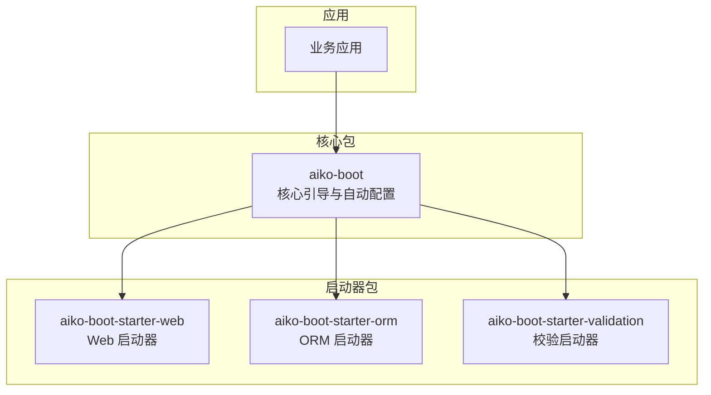
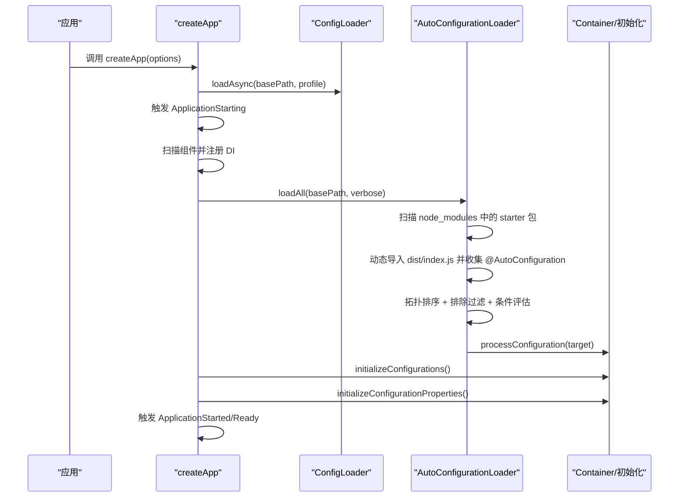
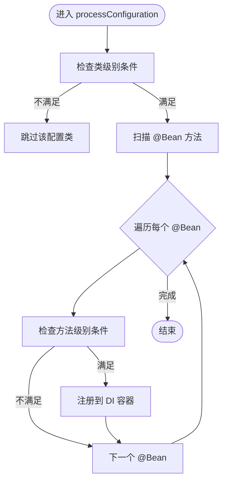
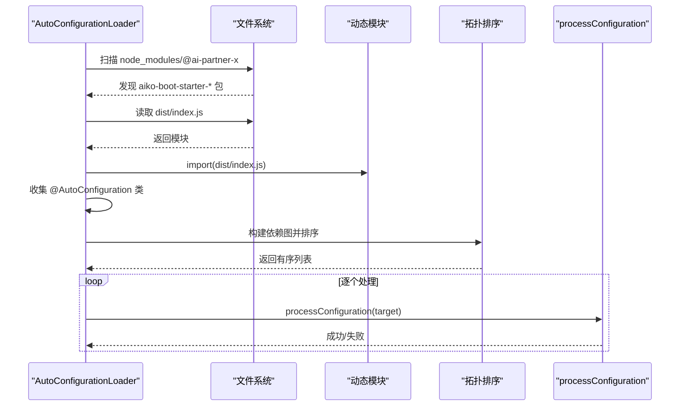
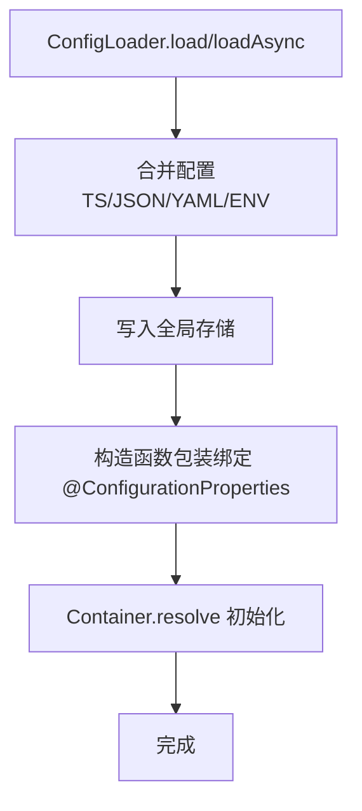
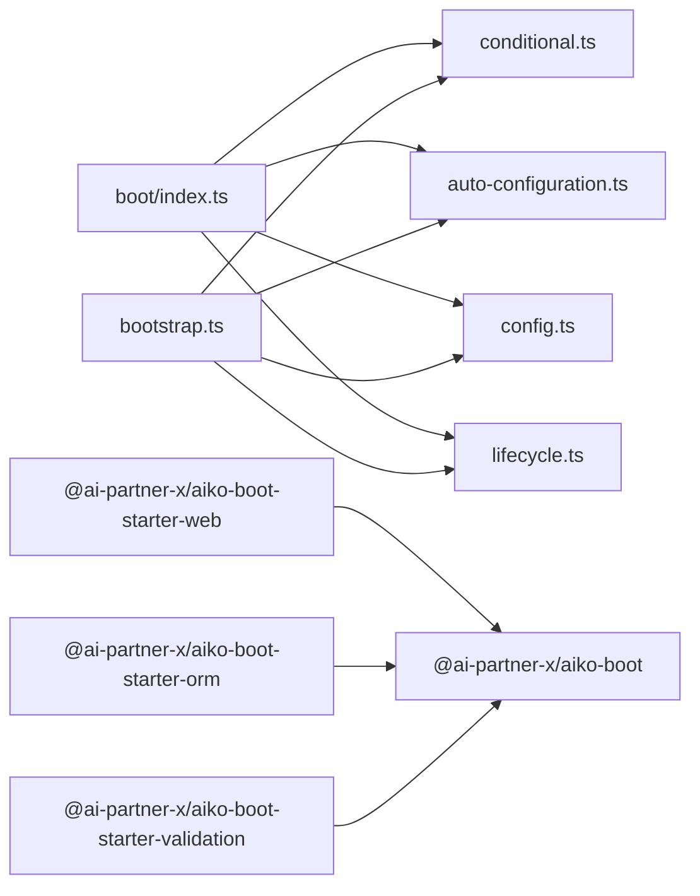

# 自动配置机制

<cite>
**本文引用的文件**
- [packages/aiko-boot/src/boot/index.ts](file://packages/aiko-boot/src/boot/index.ts)
- [packages/aiko-boot/src/boot/conditional.ts](file://packages/aiko-boot/src/boot/conditional.ts)
- [packages/aiko-boot/src/boot/auto-configuration.ts](file://packages/aiko-boot/src/boot/auto-configuration.ts)
- [packages/aiko-boot/src/boot/config.ts](file://packages/aiko-boot/src/boot/config.ts)
- [packages/aiko-boot/src/boot/bootstrap.ts](file://packages/aiko-boot/src/boot/bootstrap.ts)
- [packages/aiko-boot/package.json](file://packages/aiko-boot/package.json)
- [packages/aiko-boot-starter-web/package.json](file://packages/aiko-boot-starter-web/package.json)
- [packages/aiko-boot-starter-orm/package.json](file://packages/aiko-boot-starter-orm/package.json)
- [packages/aiko-boot-starter-validation/package.json](file://packages/aiko-boot-starter-validation/package.json)
</cite>

## 目录
1. [引言](#引言)
2. [项目结构](#项目结构)
3. [核心组件](#核心组件)
4. [架构总览](#架构总览)
5. [详细组件分析](#详细组件分析)
6. [依赖关系分析](#依赖关系分析)
7. [性能考量](#性能考量)
8. [故障排除指南](#故障排除指南)
9. [结论](#结论)
10. [附录](#附录)

## 引言
本文件系统性阐述该代码库中“自动配置机制”的实现与使用方式，涵盖条件装配（@ConditionalOnProperty、@ConditionalOnClass 等）、自动配置扫描与加载、配置类初始化流程（@ConfigurationProperties 绑定）、优先级与排除机制，以及自定义自动配置的开发指南与常见问题排查。目标是帮助开发者快速理解并正确使用该框架提供的 Spring Boot 风格的自动装配能力。

## 项目结构
该仓库采用多包工作区组织，核心能力集中在 @ai-partner-x/aiko-boot 包中，配套的启动器（starter）包通过命名约定与配置文件驱动自动装配的发现与加载。

图表来源
- [packages/aiko-boot/package.json](file://packages/aiko-boot/package.json#L1-L61)
- [packages/aiko-boot-starter-web/package.json](file://packages/aiko-boot-starter-web/package.json#L1-L60)
- [packages/aiko-boot-starter-orm/package.json](file://packages/aiko-boot-starter-orm/package.json#L1-L55)
- [packages/aiko-boot-starter-validation/package.json](file://packages/aiko-boot-starter-validation/package.json#L1-L41)

章节来源
- [packages/aiko-boot/package.json](file://packages/aiko-boot/package.json#L1-L61)
- [packages/aiko-boot-starter-web/package.json](file://packages/aiko-boot-starter-web/package.json#L1-L60)
- [packages/aiko-boot-starter-orm/package.json](file://packages/aiko-boot-starter-orm/package.json#L1-L55)
- [packages/aiko-boot-starter-validation/package.json](file://packages/aiko-boot-starter-validation/package.json#L1-L41)

## 核心组件
- 条件装配与配置类
  - @Configuration、@Bean、@ConditionalOnClass、@ConditionalOnMissingClass、@ConditionalOnProperty、@ConditionalOnMissingBean、@ConditionalOnBean、@ConditionalOnExpression
  - 条件评估与配置类/Bean 的加载判定
- 自动配置
  - @AutoConfiguration、@AutoConfigureBefore、@AutoConfigureAfter、@EnableAutoConfiguration
  - AutoConfigurationLoader 扫描与加载、拓扑排序与排除
- 配置系统
  - ConfigLoader 加载 JSON/YAML/TS/环境变量；@ConfigurationProperties 与 @Value 绑定
- 引导与生命周期
  - createApp 启动流程、生命周期事件、HTTP 服务器扩展点

章节来源
- [packages/aiko-boot/src/boot/index.ts](file://packages/aiko-boot/src/boot/index.ts#L54-L105)
- [packages/aiko-boot/src/boot/conditional.ts](file://packages/aiko-boot/src/boot/conditional.ts#L1-L335)
- [packages/aiko-boot/src/boot/auto-configuration.ts](file://packages/aiko-boot/src/boot/auto-configuration.ts#L1-L451)
- [packages/aiko-boot/src/boot/config.ts](file://packages/aiko-boot/src/boot/config.ts#L1-L448)
- [packages/aiko-boot/src/boot/bootstrap.ts](file://packages/aiko-boot/src/boot/bootstrap.ts#L114-L289)

## 架构总览
自动配置的总体流程如下：应用启动时，先加载配置，再触发 ApplicationStarting，随后扫描组件、加载自动配置、初始化配置属性，最后触发 ApplicationStarted 与 ApplicationReady。自动配置通过约定（starter 包名、dist/index.js 导出、@AutoConfiguration 标记）发现并按顺序处理，同时支持基于条件注解的按需装配与排除。

图表来源
- [packages/aiko-boot/src/boot/bootstrap.ts](file://packages/aiko-boot/src/boot/bootstrap.ts#L132-L289)
- [packages/aiko-boot/src/boot/auto-configuration.ts](file://packages/aiko-boot/src/boot/auto-configuration.ts#L177-L436)
- [packages/aiko-boot/src/boot/conditional.ts](file://packages/aiko-boot/src/boot/conditional.ts#L328-L335)
- [packages/aiko-boot/src/boot/config.ts](file://packages/aiko-boot/src/boot/config.ts#L435-L447)

## 详细组件分析

### 条件装配与配置类处理
- 装饰器与元数据
  - @Configuration 标记配置类，并在类上收集条件；同时对目标类应用 Injectable 与 Singleton
  - @Bean 标记方法级 Bean 定义，记录方法名、Bean 名称与条件
  - @ConditionalOnClass/@ConditionalOnMissingClass：类存在/不存在时才加载
  - @ConditionalOnProperty：配置键满足条件（havingValue/matchIfMissing）时才加载
  - @ConditionalOnMissingBean/@ConditionalOnBean：容器中 Bean 存在/不存在时才加载
  - @ConditionalOnExpression：表达式为真时才加载
- 条件评估
  - evaluateConditions/evaluateCondition：对一组条件进行求值
  - shouldLoadConfiguration/shouldLoadBean：判断配置类或 Bean 方法是否应被加载
- 配置类初始化
  - processConfiguration：若类条件满足，则处理其 @Bean 方法并注册到 DI 容器
  - initializeConfigurations：统一初始化已注册的配置类

图表来源
- [packages/aiko-boot/src/boot/conditional.ts](file://packages/aiko-boot/src/boot/conditional.ts#L328-L335)
- [packages/aiko-boot/src/boot/conditional.ts](file://packages/aiko-boot/src/boot/conditional.ts#L284-L305)

章节来源
- [packages/aiko-boot/src/boot/conditional.ts](file://packages/aiko-boot/src/boot/conditional.ts#L1-L335)

### 自动配置扫描与加载
- 发现机制
  - 约定优于配置：仅扫描 @ai-partner-x 命名空间下以 aiko-boot-starter-* 命名的包
  - 从 dist/index.js 动态导入，扫描导出项，识别带有 @AutoConfiguration 元数据的目标类
- 排序与依赖
  - @AutoConfigureBefore/@AutoConfigureAfter：声明 before/after 关系
  - 拓扑排序：构建依赖图，入度为 0 的优先，同层按 order 升序
- 排除机制
  - AutoConfigurationLoader.exclude：通过类名集合排除特定自动配置
  - createApp 支持 excludeAutoConfigurations 参数传入排除列表
- 加载流程
  - loadAll：扫描 node_modules 与项目配置（保留兼容），收集并排序，逐个处理并记录日志

图表来源
- [packages/aiko-boot/src/boot/auto-configuration.ts](file://packages/aiko-boot/src/boot/auto-configuration.ts#L177-L436)

章节来源
- [packages/aiko-boot/src/boot/auto-configuration.ts](file://packages/aiko-boot/src/boot/auto-configuration.ts#L1-L451)
- [packages/aiko-boot/src/boot/bootstrap.ts](file://packages/aiko-boot/src/boot/bootstrap.ts#L195-L203)

### 配置系统与属性绑定
- 配置加载顺序（后者覆盖前者）
  - app.config.ts（异步 TS 配置，优先）
  - app.config.json/yaml/yml
  - app.config.{profile}.json/yaml/yml
  - 环境变量（APP_DATABASE_HOST -> database.host）
- @ConfigurationProperties
  - 通过 prefix 将配置树形结构绑定到类实例
  - 构造函数包装：在实例化时自动注入匹配字段
- @Value
  - 注入单个配置键值，支持默认值
- 初始化
  - initializeConfigurationProperties：通过 DI 容器解析，触发构造函数中的绑定

图表来源
- [packages/aiko-boot/src/boot/config.ts](file://packages/aiko-boot/src/boot/config.ts#L64-L143)
- [packages/aiko-boot/src/boot/config.ts](file://packages/aiko-boot/src/boot/config.ts#L334-L364)
- [packages/aiko-boot/src/boot/config.ts](file://packages/aiko-boot/src/boot/config.ts#L435-L447)

章节来源
- [packages/aiko-boot/src/boot/config.ts](file://packages/aiko-boot/src/boot/config.ts#L1-L448)

### 启动流程与生命周期
- createApp 启动阶段
  - 加载配置、读取日志与优雅停机模式
  - 触发 ApplicationStarting
  - 组件扫描与 DI 注册
  - 自动配置加载与初始化
  - 初始化配置属性
  - 触发 ApplicationStarted、ApplicationReady
- HTTP 服务器扩展点
  - registerHttpServer/getHttpServer/run：由启动器（如 web）注册并运行 HTTP 服务

章节来源
- [packages/aiko-boot/src/boot/bootstrap.ts](file://packages/aiko-boot/src/boot/bootstrap.ts#L114-L289)

## 依赖关系分析
- 模块导出
  - boot/index.ts 统一导出条件装配、自动配置、生命周期等 API
- 内部依赖
  - auto-configuration 依赖 conditional 的条件评估与配置处理
  - bootstrap 依赖 config、conditional、auto-configuration、lifecycle
- 启动器依赖
  - 各 starter 包依赖 aiko-boot，并通过 dist/index.js 导出自动配置类

图表来源
- [packages/aiko-boot/src/boot/index.ts](file://packages/aiko-boot/src/boot/index.ts#L54-L105)
- [packages/aiko-boot/src/boot/bootstrap.ts](file://packages/aiko-boot/src/boot/bootstrap.ts#L21-L29)
- [packages/aiko-boot/package.json](file://packages/aiko-boot/package.json#L35-L38)
- [packages/aiko-boot-starter-web/package.json](file://packages/aiko-boot-starter-web/package.json#L32-L36)
- [packages/aiko-boot-starter-orm/package.json](file://packages/aiko-boot-starter-orm/package.json#L24-L29)
- [packages/aiko-boot-starter-validation/package.json](file://packages/aiko-boot-starter-validation/package.json#L21-L26)

章节来源
- [packages/aiko-boot/src/boot/index.ts](file://packages/aiko-boot/src/boot/index.ts#L54-L105)
- [packages/aiko-boot/src/boot/bootstrap.ts](file://packages/aiko-boot/src/boot/bootstrap.ts#L21-L29)
- [packages/aiko-boot/package.json](file://packages/aiko-boot/package.json#L35-L38)

## 性能考量
- 扫描范围控制
  - 仅扫描 @ai-partner-x 命名空间下的 starter 包，减少无关模块导入
- 动态导入与缓存
  - 通过 globalThis 存储自动配置类与排除集合，避免重复扫描与重复注册
- 排序与排除
  - 拓扑排序确保最小前置依赖，排除机制避免不必要的装配
- 日志与调试
  - 通过配置 logging.level.root 控制详细程度，避免生产环境冗余输出

## 故障排除指南
- 自动配置未生效
  - 确认包名符合约定（aiko-boot-starter-*）
  - 确认 dist/index.js 存在且导出了使用 @AutoConfiguration 标记的类
  - 检查条件注解是否满足（类存在、配置键存在、Bean 是否已存在）
  - 使用 verbose 模式查看扫描与处理日志
- 条件注解不生效
  - @ConditionalOnProperty：确认配置键存在且 matchIfMissing/ havingValue 设置合理
  - @ConditionalOnClass/@ConditionalOnMissingClass：确认目标类是否实际存在于运行时
  - @ConditionalOnBean/@ConditionalOnMissingBean：确认目标 Bean 是否已在容器中
- 配置属性未绑定
  - 确认 @ConfigurationProperties 的 prefix 与配置文件结构一致
  - 确认 initializeConfigurationProperties 已执行（由 createApp 流程自动调用）
- 优雅停机未触发
  - 确认 server.shutdown 设置为 graceful，且应用具备注册的 HTTP 服务器
- 启动器缺失
  - 若需要 HTTP 服务器，请引入对应启动器（如 aiko-boot-starter-web）

章节来源
- [packages/aiko-boot/src/boot/auto-configuration.ts](file://packages/aiko-boot/src/boot/auto-configuration.ts#L177-L436)
- [packages/aiko-boot/src/boot/config.ts](file://packages/aiko-boot/src/boot/config.ts#L435-L447)
- [packages/aiko-boot/src/boot/bootstrap.ts](file://packages/aiko-boot/src/boot/bootstrap.ts#L211-L214)

## 结论
该自动配置机制以装饰器为核心，结合约定（starter 包命名、dist/index.js 导出、@AutoConfiguration 标记）与条件注解，实现了高度可扩展、可组合的装配体系。通过拓扑排序与排除机制，既能保证装配顺序的合理性，又能灵活地按需禁用某些配置。配合 Spring Boot 风格的配置加载与属性绑定，开发者可以快速搭建功能完备的应用。

## 附录

### 条件注解一览与典型用法
- @ConditionalOnClass：当指定类存在时才装配
- @ConditionalOnMissingClass：当指定类不存在时才装配
- @ConditionalOnProperty：根据配置键是否存在或取值决定装配
- @ConditionalOnMissingBean：当某 Bean 不存在时才装配
- @ConditionalOnBean：当某 Bean 已存在时才装配
- @ConditionalOnExpression：根据表达式结果决定装配

章节来源
- [packages/aiko-boot/src/boot/conditional.ts](file://packages/aiko-boot/src/boot/conditional.ts#L129-L217)

### 自动配置优先级与排除参数
- @AutoConfiguration(order)：order 数值越小优先级越高
- @AutoConfigureBefore/@AutoConfigureAfter：声明相对顺序
- AutoConfigurationLoader.exclude：按类名排除
- createApp(excludeAutoConfigurations)：启动时传入排除列表

章节来源
- [packages/aiko-boot/src/boot/auto-configuration.ts](file://packages/aiko-boot/src/boot/auto-configuration.ts#L104-L175)
- [packages/aiko-boot/src/boot/auto-configuration.ts](file://packages/aiko-boot/src/boot/auto-configuration.ts#L356-L426)
- [packages/aiko-boot/src/boot/bootstrap.ts](file://packages/aiko-boot/src/boot/bootstrap.ts#L79-L88)
- [packages/aiko-boot/src/boot/bootstrap.ts](file://packages/aiko-boot/src/boot/bootstrap.ts#L195-L203)

### 自定义自动配置开发指南
- 创建启动器模块
  - 包名以 aiko-boot-starter-* 命名
  - 在 dist/index.js 导出使用 @AutoConfiguration 标记的类
  - 如需顺序控制，使用 @AutoConfigureBefore/@AutoConfigureAfter
- 实现条件装配
  - 在配置类或 Bean 方法上添加合适的 @Conditional* 注解
  - 使用 @ConfigurationProperties 与 @Value 绑定配置
- 发布与使用
  - 将启动器发布到 npm（或本地工作区），在应用中安装
  - 应用启动时自动发现并装配

章节来源
- [packages/aiko-boot/src/boot/auto-configuration.ts](file://packages/aiko-boot/src/boot/auto-configuration.ts#L254-L308)
- [packages/aiko-boot/src/boot/config.ts](file://packages/aiko-boot/src/boot/config.ts#L317-L392)
- [packages/aiko-boot/package.json](file://packages/aiko-boot/package.json#L35-L38)