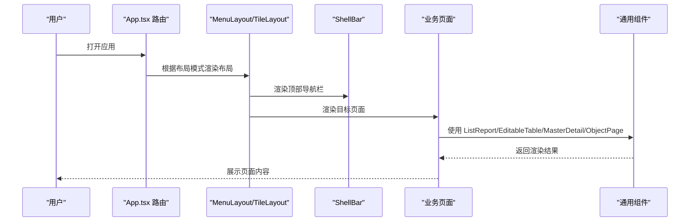
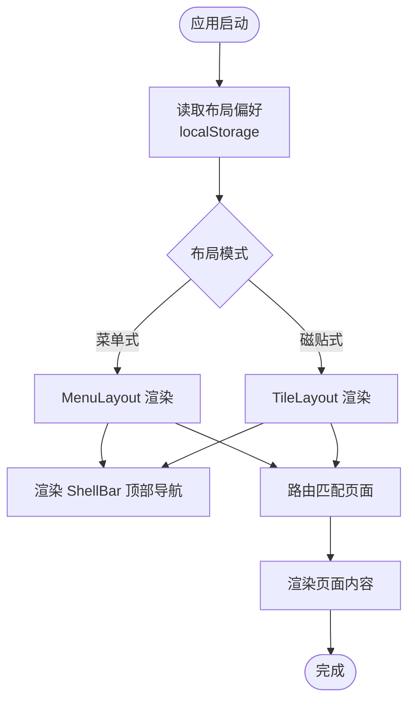
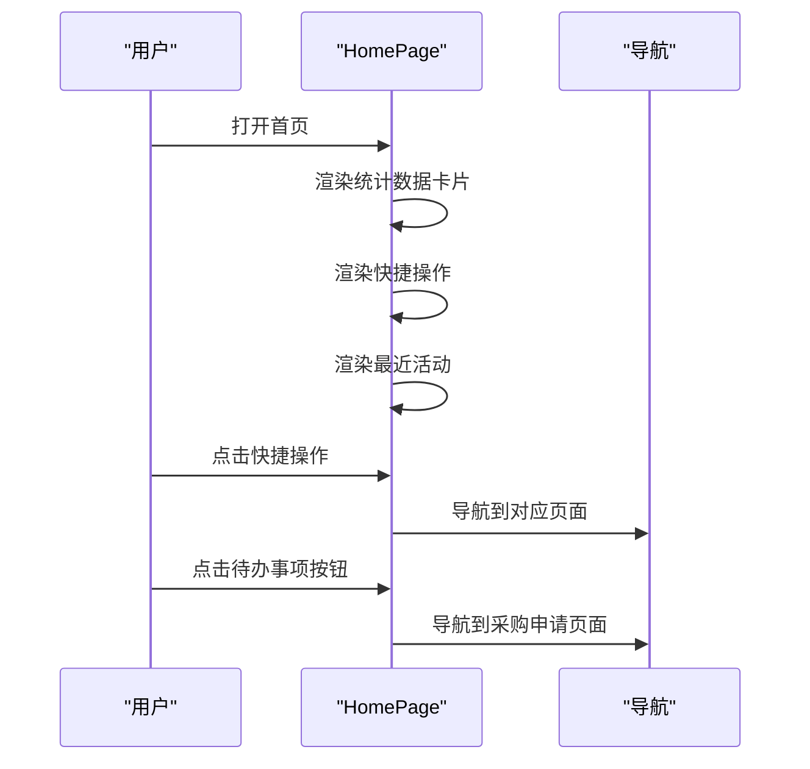
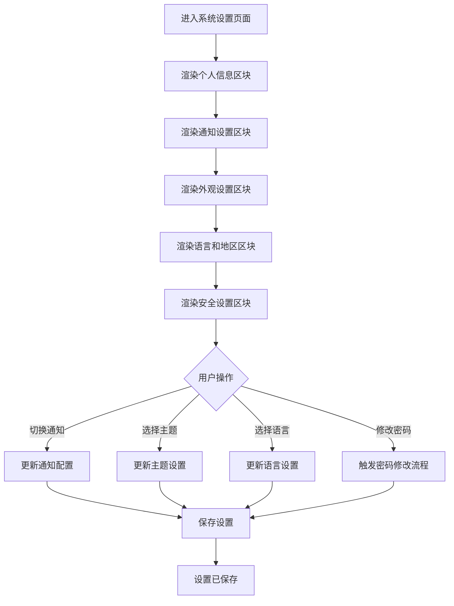
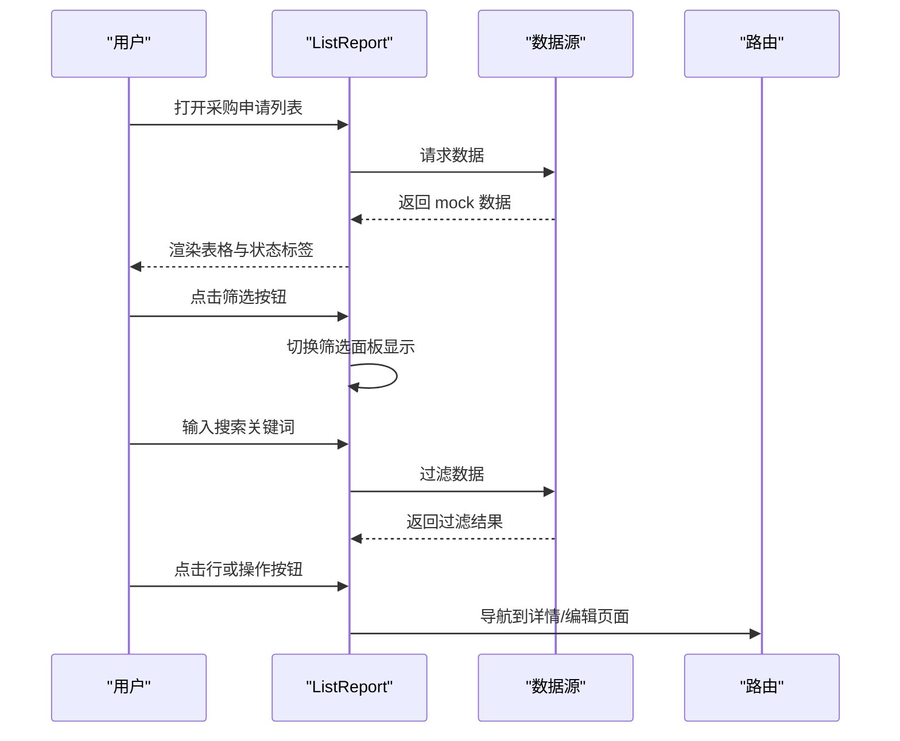
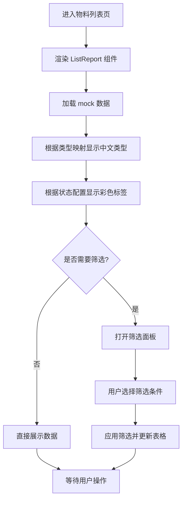
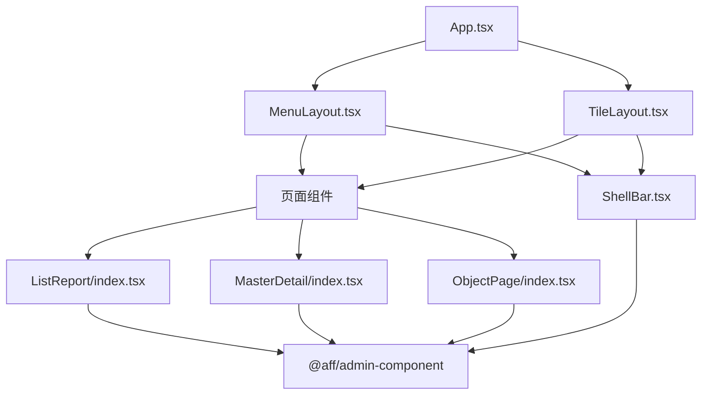

# Admin 管理系统示例

<cite>
**本文档引用的文件**
- [App.tsx](file://app/examples/admin/src/App.tsx)
- [MenuLayout.tsx](file://app/examples/admin/src/layouts/MenuLayout.tsx)
- [TileLayout.tsx](file://app/examples/admin/src/layouts/TileLayout.tsx)
- [HomePage.tsx](file://app/examples/admin/src/pages/HomePage.tsx)
- [SettingsPage.tsx](file://app/examples/admin/src/pages/SettingsPage.tsx)
- [ListReport/index.tsx](file://app/examples/admin/src/components/ListReport/index.tsx)
- [EditableTable/index.tsx](file://app/examples/admin/src/components/EditableTable/index.tsx)
- [MasterDetail/index.tsx](file://app/examples/admin/src/components/MasterDetail/index.tsx)
- [ObjectPage/index.tsx](file://app/examples/admin/src/components/ObjectPage/index.tsx)
- [ShellBar.tsx](file://app/examples/admin/src/components/ShellBar.tsx)
- [goods-receipt/ListPage.tsx](file://app/examples/admin/src/pages/goods-receipt/ListPage.tsx)
- [master-data/materials/ListPage.tsx](file://app/examples/admin/src/pages/master-data/materials/ListPage.tsx)
- [purchase-requisitions/ListPage.tsx](file://app/examples/admin/src/pages/purchase-requisitions/ListPage.tsx)
- [admin-component/package.json](file://app/framework/admin-component/package.json)
</cite>

## 目录
1. [简介](#简介)
2. [项目结构](#项目结构)
3. [核心组件](#核心组件)
4. [架构总览](#架构总览)
5. [详细组件分析](#详细组件分析)
6. [依赖关系分析](#依赖关系分析)
7. [性能考虑](#性能考虑)
8. [故障排除指南](#故障排除指南)
9. [结论](#结论)
10. [附录](#附录)

## 简介
本项目是一个基于 AI-First 框架的企业级 Admin 管理系统示例，采用 TypeScript + Next.js + React Router 的技术栈，结合 SAP Fiori 设计语言，提供现代化、可扩展的后台管理界面。系统包含完整的页面路由组织、组件层次结构与数据流管理，涵盖采购申请管理、采购订单管理、收货管理、主数据管理（物料、工厂、供应商、币种、计量单位、采购组织、成本中心）及其子模块，以及报表分析和系统设置，并通过统一的装饰器系统与依赖注入实现组件解耦与可维护性。

**更新** 本版本重构了应用结构，新增了系统设置页面、首页概览页面，完善了主数据管理模块，并优化了布局切换与页面导航体验。

## 项目结构
该示例项目位于 `app/examples/admin` 目录，采用清晰的功能模块划分：
- 布局层：MenuLayout（菜单式布局）与 TileLayout（磁贴式门户布局）
- 页面层：首页概览、系统设置、采购申请、采购订单、收货管理、主数据管理、报表分析等业务页面
- 组件层：通用业务组件（ListReport、EditableTable、MasterDetail、ObjectPage、ShellBar）
- 应用入口：App.tsx 路由配置与布局切换

```mermaid
graph TB
subgraph "应用入口"
App["App.tsx<br/>路由与布局切换"]
end
subgraph "布局层"
MenuLayout["MenuLayout.tsx<br/>菜单式布局"]
TileLayout["TileLayout.tsx<br/>磁贴式布局"]
ShellBar["ShellBar.tsx<br/>顶部导航栏"]
end
subgraph "页面层"
HomePage["HomePage.tsx<br/>首页概览"]
SettingsPage["SettingsPage.tsx<br/>系统设置"]
PurchaseRequisitions["purchase-requisitions/ListPage.tsx<br/>采购申请管理"]
PurchaseOrders["purchase-orders/ListPage.tsx<br/>采购订单管理"]
GoodsReceipt["goods-receipt/ListPage.tsx<br/>收货管理"]
Materials["master-data/materials/ListPage.tsx<br/>物料主数据"]
Vendors["master-data/vendors/ListPage.tsx<br/>供应商管理"]
Plants["master-data/plants/ListPage.tsx<br/>工厂/仓库管理"]
Reports["reports/PurchaseOrderReport.tsx<br/>报表分析"]
end
subgraph "组件层"
ListReport["ListReport/index.tsx<br/>列表报表组件"]
EditableTable["EditableTable/index.tsx<br/>表单内嵌可编辑表格"]
MasterDetail["MasterDetail/index.tsx<br/>主详情布局"]
ObjectPage["ObjectPage/index.tsx<br/>对象页组件"]
end
App --> MenuLayout
App --> TileLayout
MenuLayout --> ShellBar
TileLayout --> ShellBar
MenuLayout --> HomePage
MenuLayout --> SettingsPage
MenuLayout --> PurchaseRequisitions
MenuLayout --> PurchaseOrders
MenuLayout --> GoodsReceipt
MenuLayout --> Materials
MenuLayout --> Vendors
MenuLayout --> Plants
MenuLayout --> Reports
TileLayout --> HomePage
TileLayout --> SettingsPage
TileLayout --> PurchaseRequisitions
TileLayout --> PurchaseOrders
TileLayout --> GoodsReceipt
TileLayout --> Materials
TileLayout --> Vendors
TileLayout --> Plants
TileLayout --> Reports
PurchaseRequisitions --> ListReport
PurchaseOrders --> ListReport
GoodsReceipt --> ListReport
Materials --> ListReport
Vendors --> ListReport
Plants --> ListReport
ObjectPage --> EditableTable
MasterDetail --> ObjectPage
```

**图表来源**
- [App.tsx](file://app/examples/admin/src/App.tsx#L72-L171)
- [MenuLayout.tsx](file://app/examples/admin/src/layouts/MenuLayout.tsx#L160-L421)
- [TileLayout.tsx](file://app/examples/admin/src/layouts/TileLayout.tsx#L200-L454)
- [ShellBar.tsx](file://app/examples/admin/src/components/ShellBar.tsx#L102-L299)
- [HomePage.tsx](file://app/examples/admin/src/pages/HomePage.tsx#L120-L277)
- [SettingsPage.tsx](file://app/examples/admin/src/pages/SettingsPage.tsx#L112-L318)
- [ListReport/index.tsx](file://app/examples/admin/src/components/ListReport/index.tsx#L145-L398)
- [EditableTable/index.tsx](file://app/examples/admin/src/components/EditableTable/index.tsx#L54-L160)
- [MasterDetail/index.tsx](file://app/examples/admin/src/components/MasterDetail/index.tsx#L113-L355)
- [ObjectPage/index.tsx](file://app/examples/admin/src/components/ObjectPage/index.tsx#L131-L494)

**章节来源**
- [App.tsx](file://app/examples/admin/src/App.tsx#L72-L171)
- [README.md](file://README.md#L14-L34)

## 核心组件
本系统的核心组件围绕"页面-布局-通用组件"三层架构构建：

- **布局组件**
  - MenuLayout：提供菜单式导航与侧边栏，支持分组与折叠，适配传统后台管理场景
  - TileLayout：提供门户式磁贴入口，支持收藏、分类与搜索，适配企业应用门户
  - ShellBar：现代化顶部导航栏，包含搜索、布局切换、通知、用户菜单等功能

- **页面组件**
  - ListReport：基于 SAP Fiori List Report 设计，集成头部、工具栏、搜索筛选、数据表格与分页
  - EditableTable：表单内嵌可编辑表格，支持输入框、选择框、文本与删除按钮等单元格渲染
  - MasterDetail：左列表右详情的经典布局，支持查看/编辑/新建模式与操作按钮
  - ObjectPage：基于 SAP Fiori Object Page 设计，支持 display/edit/create 三种模式与粘性底部工具栏

- **页面示例**
  - 首页概览：Dashboard 风格仪表盘，包含统计数据、快捷操作、最近活动等
  - 系统设置：完整的设置页面，包含个人信息、通知设置、外观设置、语言地区、安全设置等
  - 采购申请管理列表页：使用 ListReport 展示采购申请，支持状态标签、筛选与操作按钮
  - 物料主数据列表页：使用 ListReport 展示物料信息，支持类型映射与状态标签

**章节来源**
- [MenuLayout.tsx](file://app/examples/admin/src/layouts/MenuLayout.tsx#L160-L421)
- [TileLayout.tsx](file://app/examples/admin/src/layouts/TileLayout.tsx#L200-L454)
- [ShellBar.tsx](file://app/examples/admin/src/components/ShellBar.tsx#L102-L299)
- [HomePage.tsx](file://app/examples/admin/src/pages/HomePage.tsx#L120-L277)
- [SettingsPage.tsx](file://app/examples/admin/src/pages/SettingsPage.tsx#L112-L318)
- [ListReport/index.tsx](file://app/examples/admin/src/components/ListReport/index.tsx#L145-L398)
- [EditableTable/index.tsx](file://app/examples/admin/src/components/EditableTable/index.tsx#L54-L160)
- [MasterDetail/index.tsx](file://app/examples/admin/src/components/MasterDetail/index.tsx#L113-L355)
- [ObjectPage/index.tsx](file://app/examples/admin/src/components/ObjectPage/index.tsx#L131-L494)
- [goods-receipt/ListPage.tsx](file://app/examples/admin/src/pages/goods-receipt/ListPage.tsx#L74-L278)
- [master-data/materials/ListPage.tsx](file://app/examples/admin/src/pages/master-data/materials/ListPage.tsx#L76-L256)
- [purchase-requisitions/ListPage.tsx](file://app/examples/admin/src/pages/purchase-requisitions/ListPage.tsx#L71-L271)

## 架构总览
系统采用"路由驱动 + 布局切换 + 业务页面 + 通用组件"的分层架构：
- 路由层：BrowserRouter + Routes + 动态导入页面组件，支持菜单式与磁贴式两种布局模式，布局偏好通过 localStorage 持久化
- 布局层：MenuLayout/TileLayout 提供统一的 ShellBar 与内容区，支持布局偏好持久化
- 页面层：各业务页面通过 ListReport/EditableTable/MasterDetail/ObjectPage 等组件快速搭建
- 组件层：@aff/admin-component 提供通用 UI 组件与工具类，降低重复开发成本

**图表来源**
- [App.tsx](file://app/examples/admin/src/App.tsx#L72-L171)
- [MenuLayout.tsx](file://app/examples/admin/src/layouts/MenuLayout.tsx#L160-L421)
- [TileLayout.tsx](file://app/examples/admin/src/layouts/TileLayout.tsx#L200-L454)
- [ShellBar.tsx](file://app/examples/admin/src/components/ShellBar.tsx#L102-L299)
- [ListReport/index.tsx](file://app/examples/admin/src/components/ListReport/index.tsx#L145-L398)
- [EditableTable/index.tsx](file://app/examples/admin/src/components/EditableTable/index.tsx#L54-L160)
- [MasterDetail/index.tsx](file://app/examples/admin/src/components/MasterDetail/index.tsx#L113-L355)
- [ObjectPage/index.tsx](file://app/examples/admin/src/components/ObjectPage/index.tsx#L131-L494)

## 详细组件分析

### 路由与布局系统
- 路由组织：App.tsx 中集中配置所有页面路由，支持菜单式与磁贴式两种布局模式，布局偏好通过 localStorage 持久化
- 布局切换：MenuLayout 提供侧边栏菜单与子菜单折叠；TileLayout 提供门户磁贴入口与分类导航
- 页面骨架：两套布局均提供 PageSkeleton 骨架屏组件，提升首屏体验

**图表来源**
- [App.tsx](file://app/examples/admin/src/App.tsx#L72-L171)
- [MenuLayout.tsx](file://app/examples/admin/src/layouts/MenuLayout.tsx#L160-L421)
- [TileLayout.tsx](file://app/examples/admin/src/layouts/TileLayout.tsx#L200-L454)
- [ShellBar.tsx](file://app/examples/admin/src/components/ShellBar.tsx#L102-L299)

**章节来源**
- [App.tsx](file://app/examples/admin/src/App.tsx#L72-L171)
- [MenuLayout.tsx](file://app/examples/admin/src/layouts/MenuLayout.tsx#L160-L421)
- [TileLayout.tsx](file://app/examples/admin/src/layouts/TileLayout.tsx#L200-L454)
- [ShellBar.tsx](file://app/examples/admin/src/components/ShellBar.tsx#L102-L299)

### 首页概览（HomePage）
- 设计模式：Dashboard 风格仪表盘，包含统计数据卡片、快捷操作、最近活动、待办事项提示等
- 数据流：内置统计数据、快捷操作、最近活动等 mock 数据
- 交互处理：支持快捷操作跳转、待办事项处理、最近活动查看等

**图表来源**
- [HomePage.tsx](file://app/examples/admin/src/pages/HomePage.tsx#L120-L277)

**章节来源**
- [HomePage.tsx](file://app/examples/admin/src/pages/HomePage.tsx#L120-L277)

### 系统设置（SettingsPage）
- 设计模式：基于 SAP Fiori 设计规范的设置页面，包含个人信息、通知设置、外观设置、语言地区、安全设置等
- 数据流：包含用户信息、通知偏好、主题设置、语言地区、安全选项等配置
- 交互处理：支持开关切换、下拉选择、按钮操作等用户交互

**图表来源**
- [SettingsPage.tsx](file://app/examples/admin/src/pages/SettingsPage.tsx#L112-L318)

**章节来源**
- [SettingsPage.tsx](file://app/examples/admin/src/pages/SettingsPage.tsx#L112-L318)

### 采购申请管理（purchase-requisitions）页面
- 设计模式：采用 ListReport 组件承载头部、工具栏、搜索筛选与数据表格
- 数据流：模拟数据 mockData，通过 columns 定义列结构与渲染逻辑，支持状态标签与操作按钮
- 交互处理：支持筛选面板开关、筛选条件清空、分页与行点击跳转详情/编辑

**图表来源**
- [purchase-requisitions/ListPage.tsx](file://app/examples/admin/src/pages/purchase-requisitions/ListPage.tsx#L71-L271)
- [ListReport/index.tsx](file://app/examples/admin/src/components/ListReport/index.tsx#L145-L398)

**章节来源**
- [purchase-requisitions/ListPage.tsx](file://app/examples/admin/src/pages/purchase-requisitions/ListPage.tsx#L71-L271)

### 收货管理（goods-receipt）页面
- 设计模式：采用 ListReport 组件承载头部、工具栏、搜索筛选与数据表格
- 数据流：模拟数据 mockData，通过 columns 定义列结构与渲染逻辑，支持状态标签与操作按钮
- 交互处理：支持筛选面板开关、筛选条件清空、分页与行点击跳转详情/编辑

**图表来源**
- [goods-receipt/ListPage.tsx](file://app/examples/admin/src/pages/goods-receipt/ListPage.tsx#L74-L278)
- [ListReport/index.tsx](file://app/examples/admin/src/components/ListReport/index.tsx#L145-L398)

**章节来源**
- [goods-receipt/ListPage.tsx](file://app/examples/admin/src/pages/goods-receipt/ListPage.tsx#L74-L278)

### 主数据管理（master-data）页面
- 设计模式：同样采用 ListReport 组件，支持状态映射与物料类型配置
- 数据流：物料类型通过 materialTypeConfig 映射中文标签，状态通过 statusConfig 显示彩色标签
- 交互处理：支持按状态、类型、组别筛选，清空筛选条件

**图表来源**
- [master-data/materials/ListPage.tsx](file://app/examples/admin/src/pages/master-data/materials/ListPage.tsx#L76-L256)
- [ListReport/index.tsx](file://app/examples/admin/src/components/ListReport/index.tsx#L145-L398)

**章节来源**
- [master-data/materials/ListPage.tsx](file://app/examples/admin/src/pages/master-data/materials/ListPage.tsx#L76-L256)

### 通用组件：ListReport
- 功能特性：头部（标题/副标题/标签/图标）、主操作按钮、工具栏（刷新/导出/列设置/帮助）、搜索与筛选栏、数据表格、分页与行选择
- 设计规范：遵循 SAP Fiori List Report 设计语言，提供一致的视觉与交互体验
- 复用策略：所有列表页面均可通过 ListReport 快速搭建，减少重复开发

**章节来源**
- [ListReport/index.tsx](file://app/examples/admin/src/components/ListReport/index.tsx#L145-L398)

### 通用组件：EditableTable
- 功能特性：表单内嵌可编辑表格，支持列配置、数据源绑定、行键、表头/表尾、空状态、最小宽度、嵌入模式等
- 设计规范：提供 TableInput、TableSelect、TableText、TableDeleteButton、TableFooterRow 等辅助组件
- 使用场景：适用于采购申请行项目、收货物料等场景

**章节来源**
- [EditableTable/index.tsx](file://app/examples/admin/src/components/EditableTable/index.tsx#L54-L160)

### 通用组件：MasterDetail
- 功能特性：左侧列表 + 右侧详情的经典布局，支持查看/编辑/新建模式、搜索、操作按钮、删除确认弹窗
- 设计规范：提供 DetailSection、DetailField、DetailFieldGrid 等详情区域组件
- 使用场景：适用于主数据管理、对象详情编辑等场景

**章节来源**
- [MasterDetail/index.tsx](file://app/examples/admin/src/components/MasterDetail/index.tsx#L113-L355)

### 通用组件：ObjectPage
- 功能特性：基于 SAP Fiori Object Page 设计，支持 display/edit/create 三种模式、粘性底部工具栏、Section 导航、Header 字段与 KPI
- 设计规范：提供多种按钮样式与图标，支持侧边栏 Section 布局
- 使用场景：适用于复杂对象的详情页与编辑页

**章节来源**
- [ObjectPage/index.tsx](file://app/examples/admin/src/components/ObjectPage/index.tsx#L131-L494)

### 通用组件：ShellBar
- 功能特性：现代化顶部导航栏，包含 Logo、标题、搜索框、布局切换、通知、帮助、用户菜单等功能
- 设计规范：采用精美的 SVG 图标，提供流畅的交互体验
- 使用场景：作为所有页面的顶部导航组件

**章节来源**
- [ShellBar.tsx](file://app/examples/admin/src/components/ShellBar.tsx#L102-L299)

## 依赖关系分析
- 组件依赖：页面组件依赖通用组件（ListReport、EditableTable、MasterDetail、ObjectPage、ShellBar），通用组件依赖 @aff/admin-component 提供的基础 UI 能力
- 布局依赖：App.tsx 作为路由入口，动态选择 MenuLayout 或 TileLayout，两者均依赖通用组件与页面组件
- 外部依赖：@aff/admin-component 提供 DataTable、Input、Button、Select、cn 等基础能力

**图表来源**
- [App.tsx](file://app/examples/admin/src/App.tsx#L72-L171)
- [MenuLayout.tsx](file://app/examples/admin/src/layouts/MenuLayout.tsx#L160-L421)
- [TileLayout.tsx](file://app/examples/admin/src/layouts/TileLayout.tsx#L200-L454)
- [ShellBar.tsx](file://app/examples/admin/src/components/ShellBar.tsx#L102-L299)
- [ListReport/index.tsx](file://app/examples/admin/src/components/ListReport/index.tsx#L145-L398)
- [MasterDetail/index.tsx](file://app/examples/admin/src/components/MasterDetail/index.tsx#L113-L355)
- [ObjectPage/index.tsx](file://app/examples/admin/src/components/ObjectPage/index.tsx#L131-L494)
- [admin-component/package.json](file://app/framework/admin-component/package.json#L19-L29)

**章节来源**
- [admin-component/package.json](file://app/framework/admin-component/package.json#L19-L29)

## 性能考虑
- 路由懒加载：通过动态导入页面组件，减少初始包体积
- 布局骨架屏：MenuLayout/TileLayout 提供 PageSkeleton，在页面切换时提升感知速度
- 组件复用：通用组件统一实现，减少重复渲染与逻辑重复
- 状态持久化：布局偏好通过 localStorage 持久化，避免每次刷新重新计算
- 图标优化：使用 SVG 图标，支持主题色切换，减少图片资源加载

## 故障排除指南
- 路由不生效：检查 App.tsx 中路由配置与页面导入路径是否正确
- 布局切换异常：确认 localStorage 中的布局偏好值是否为 'menu' 或 'tile'
- 列表筛选无效：检查 ListReport 的 onFilterToggle/onFilterClear 回调是否正确绑定
- 表格渲染异常：确认 DataTable 的 columns 与 data 结构是否匹配
- 设置页面异常：检查 SettingsPage 中的表单控件与状态管理是否正确
- 首页数据不显示：确认 HomePage 中的统计数据与快捷操作数据是否正确配置

## 结论
本 Admin 管理系统示例通过清晰的分层架构与丰富的通用组件，实现了企业级后台管理界面的快速搭建与维护。系统采用 SAP Fiori 设计语言，提供一致的用户体验；通过路由驱动与布局切换，满足不同场景下的使用需求；通过通用组件复用与依赖注入思想，提升了代码的可维护性与扩展性。新增的首页概览和系统设置页面进一步完善了管理系统的功能完整性。

## 附录
- 页面 walkthrough（以"首页概览"为例）
  1. 打开应用 → 选择布局模式（菜单式/磁贴式）
  2. 进入首页 → 查看统计数据卡片与快捷操作
  3. 点击统计数据卡片 → 查看详细信息
  4. 点击快捷操作 → 导航到相应功能页面
  5. 查看最近活动 → 点击查看更多
  6. 处理待办事项 → 点击"立即处理"跳转到相关页面

- 页面 walkthrough（以"系统设置"为例）
  1. 打开应用 → 选择布局模式
  2. 进入系统设置 → 查看个人信息区块
  3. 修改通知设置 → 切换开关状态
  4. 更改外观设置 → 选择主题模式
  5. 更新语言设置 → 选择界面语言
  6. 修改安全设置 → 触发密码修改流程

- 页面 walkthrough（以"采购申请管理列表页"为例）
  1. 打开应用 → 选择布局模式（菜单式/磁贴式）
  2. 进入"采购申请管理"页面 → 查看 ListReport 头部信息与主操作按钮
  3. 使用搜索框输入关键词 → 观察数据过滤效果
  4. 点击筛选按钮 → 打开筛选面板，选择状态/申请人/部门
  5. 清除筛选条件 → 点击"清除筛选"
  6. 点击行或操作按钮 → 导航到详情/编辑页面

- 页面 walkthrough（以"物料主数据列表页"为例）
  1. 打开应用 → 选择布局模式
  2. 进入"物料主数据"页面 → 查看列表与状态标签
  3. 使用筛选面板 → 按状态/类型/组别筛选
  4. 点击行 → 导航到详情/编辑页面

- 页面 walkthrough（以"收货管理列表页"为例）
  1. 打开应用 → 选择布局模式
  2. 进入"收货管理"页面 → 查看 ListReport 头部信息与主操作按钮
  3. 使用搜索框输入关键词 → 观察数据过滤效果
  4. 点击筛选按钮 → 打开筛选面板，选择状态/工厂/存储位置
  5. 清除筛选条件 → 点击"清除筛选"
  6. 点击行或操作按钮 → 导航到详情/编辑页面