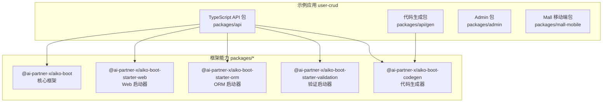
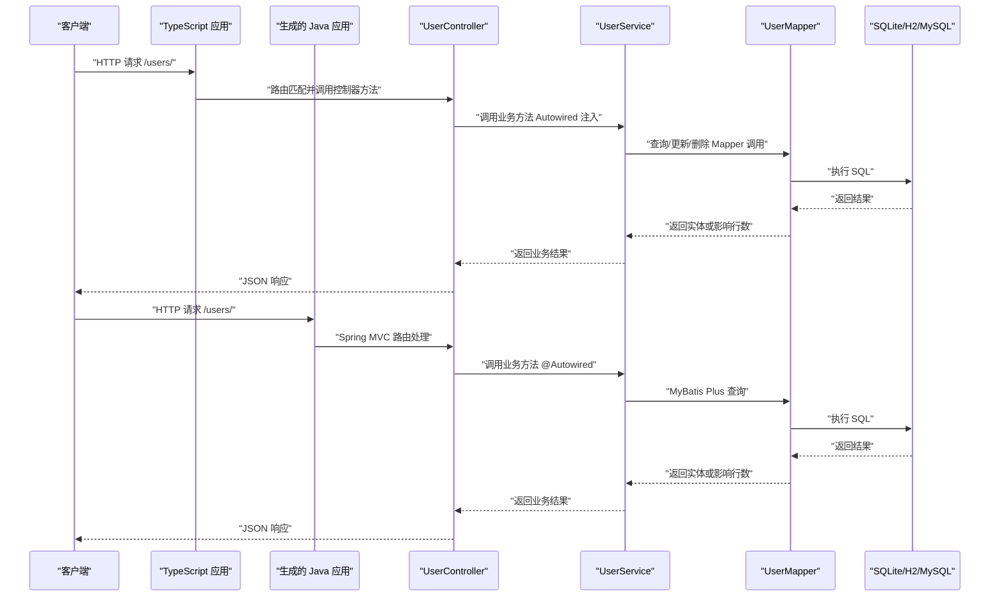
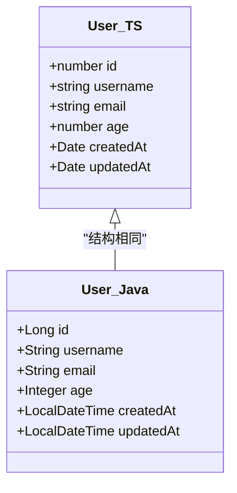
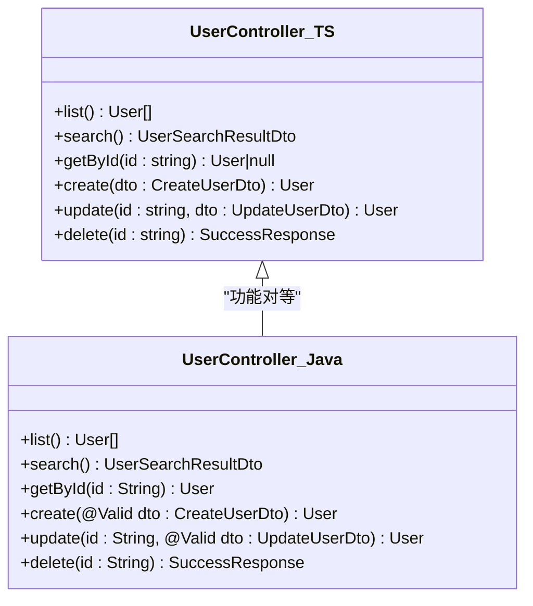
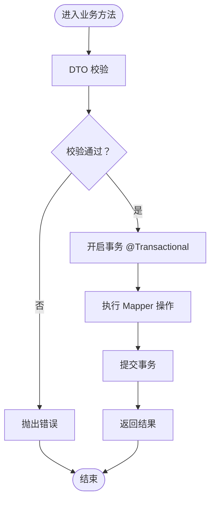
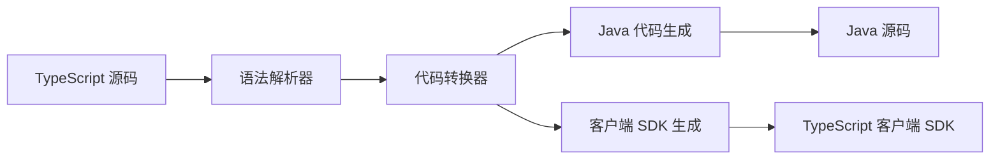
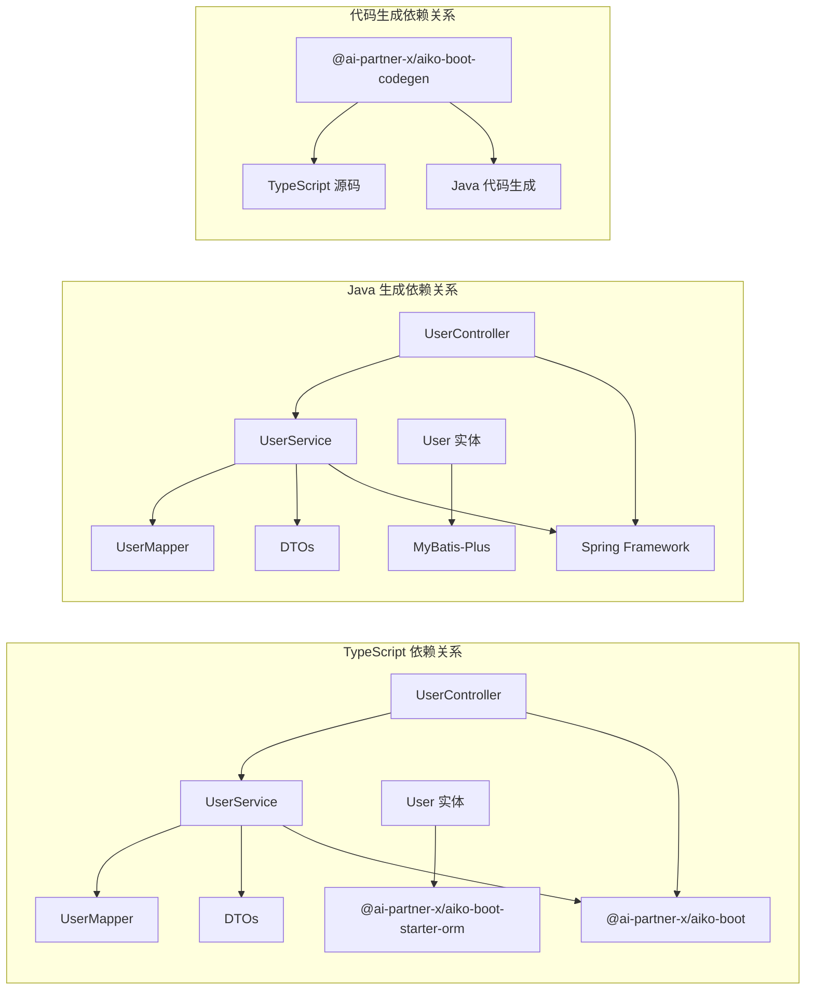

# 用户 CRUD 示例

<cite>
**本文引用的文件**
- [package.json](file://app/examples/user-crud/package.json)
- [server.ts](file://app/examples/user-crud/packages/api/src/server.ts)
- [user.controller.ts](file://app/examples/user-crud/packages/api/src/controller/user.controller.ts)
- [user.entity.ts](file://app/examples/user-crud/packages/api/src/entity/user.entity.ts)
- [UsercrudApplication.java](file://app/examples/user-crud/packages/api/gen/src/main/java/com/example/usercrud/UsercrudApplication.java)
- [UserController.java](file://app/examples/user-crud/packages/api/gen/src/main/java/com/example/usercrud/controller/UserController.java)
- [User.java](file://app/examples/user-crud/packages/api/gen/src/main/java/com/example/usercrud/entity/User.java)
- [UserService.java](file://app/examples/user-crud/packages/api/gen/src/main/java/com/example/usercrud/service/UserService.java)
- [pom.xml](file://app/examples/user-crud/packages/api/gen/pom.xml)
- [app.config.ts](file://app/examples/user-crud/packages/api/app.config.ts)
- [codegen.ts](file://app/examples/user-crud/packages/api/scripts/codegen.ts)
- [index.ts（核心装饰器）](file://packages/aiko-boot/src/index.ts)
- [index.ts（依赖注入）](file://packages/aiko-boot/src/index.ts)
- [index.ts（ORM 能力）](file://packages/aiko-boot-starter-orm/src/index.ts)
- [index.ts（代码生成器）](file://packages/aiko-boot-codegen/src/index.ts)
</cite>

## 更新摘要
**变更内容**
- 重构用户 CRUD 示例架构，从独立的 Java API 示例项目迁移到集成式代码生成流程
- 新增代码生成器模块，支持 TypeScript 到 Java 的双向代码转换
- 重构项目结构，将 Java 代码生成到 packages/api/gen 目录
- 更新控制器装饰器与路由映射，保持与生成的 Java 代码一致
- 增强查询包装器（QueryWrapper）和更新包装器（UpdateWrapper）功能
- 完善 Maven 构建配置，支持多种数据库驱动

## 目录
1. [简介](#简介)
2. [项目结构](#项目结构)
3. [核心组件](#核心组件)
4. [架构总览](#架构总览)
5. [组件详解](#组件详解)
6. [代码生成系统](#代码生成系统)
7. [多语言实现对比](#多语言实现对比)
8. [依赖关系分析](#依赖关系分析)
9. [性能与可扩展性](#性能与可扩展性)
10. [故障排查指南](#故障排查指南)
11. [结论](#结论)
12. [附录：开发与扩展指南](#附录开发与扩展指南)

## 简介
本文件面向"用户 CRUD 示例"应用，系统化解析其基于装饰器与依赖注入的多语言分层架构设计。该示例现已重构为集成式代码生成流程，通过 TypeScript 实现定义业务逻辑，代码生成器自动生成对应的 Java Spring Boot 实现。文档详细说明实体定义、控制器装饰器使用、服务层实现、数据访问层配置与数据库初始化流程，同时提供面向开发者的扩展建议与最佳实践。

## 项目结构
该示例采用多包工作区布局，包含 TypeScript API 包、Java 代码生成包、Admin 管理端与移动端示例目录，支持多语言并行开发与代码生成系统。

**图表来源**
- [package.json](file://app/examples/user-crud/package.json#L1-L20)
- [pom.xml](file://app/examples/user-crud/packages/api/gen/pom.xml#L1-L50)
- [server.ts](file://app/examples/user-crud/packages/api/src/server.ts#L1-L21)

**章节来源**
- [package.json](file://app/examples/user-crud/package.json#L1-L20)

## 核心组件
- **TypeScript 实现**：使用装饰器声明表结构与字段映射，统一由 ORM 管理元数据与适配器
- **Java 生成实现**：通过代码生成器自动生成，使用 MyBatis-Plus 注解声明实体映射
- **控制器层**：使用 Web 装饰器声明 REST 接口路径与方法，配合依赖注入自动装配服务
- **服务层**：承载业务逻辑，使用事务注解确保数据一致性，结合 DTO 校验保障输入质量
- **数据访问层**：通过 Mapper 与适配器执行查询与分页，屏蔽底层数据库差异
- **代码生成系统**：支持 TypeScript 到 Java 的双向转换，自动生成客户端 SDK 和服务端代码

**章节来源**
- [user.entity.ts](file://app/examples/user-crud/packages/api/src/entity/user.entity.ts#L1-L23)
- [User.java](file://app/examples/user-crud/packages/api/gen/src/main/java/com/example/usercrud/entity/User.java#L1-L77)
- [user.controller.ts](file://app/examples/user-crud/packages/api/src/controller/user.controller.ts#L1-L170)
- [UserController.java](file://app/examples/user-crud/packages/api/gen/src/main/java/com/example/usercrud/controller/UserController.java#L1-L137)

## 架构总览
下图展示了从请求到数据库的端到端调用链路，体现装饰器驱动的路由注册、依赖注入的服务装配与 ORM 的数据访问。

**图表来源**
- [server.ts](file://app/examples/user-crud/packages/api/src/server.ts#L10-L21)
- [user.controller.ts](file://app/examples/user-crud/packages/api/src/controller/user.controller.ts#L30-L170)
- [UserController.java](file://app/examples/user-crud/packages/api/gen/src/main/java/com/example/usercrud/controller/UserController.java#L21-L137)

## 组件详解

### 实体定义与 ORM 映射
**TypeScript 实现**使用装饰器声明表结构与字段映射，使用字段装饰器映射列名与可选字段。

**Java 生成实现**通过代码生成器自动生成，使用 MyBatis-Plus 注解声明实体映射。

**图表来源**
- [user.entity.ts](file://app/examples/user-crud/packages/api/src/entity/user.entity.ts#L3-L22)
- [User.java](file://app/examples/user-crud/packages/api/gen/src/main/java/com/example/usercrud/entity/User.java#L10-L27)

**章节来源**
- [user.entity.ts](file://app/examples/user-crud/packages/api/src/entity/user.entity.ts#L1-L23)
- [User.java](file://app/examples/user-crud/packages/api/gen/src/main/java/com/example/usercrud/entity/User.java#L1-L77)

### 控制器装饰器与路由映射
**TypeScript 实现**使用控制器装饰器声明统一前缀路径，使用方法级装饰器映射 HTTP 方法与路径变量。

**Java 生成实现**通过代码生成器自动生成，使用 Spring MVC 注解声明控制器和路由映射。

**图表来源**
- [user.controller.ts](file://app/examples/user-crud/packages/api/src/controller/user.controller.ts#L30-L170)
- [UserController.java](file://app/examples/user-crud/packages/api/gen/src/main/java/com/example/usercrud/controller/UserController.java#L21-L137)

**章节来源**
- [user.controller.ts](file://app/examples/user-crud/packages/api/src/controller/user.controller.ts#L1-L170)
- [UserController.java](file://app/examples/user-crud/packages/api/gen/src/main/java/com/example/usercrud/controller/UserController.java#L1-L137)

### 服务层实现与事务控制
**TypeScript 实现**使用装饰器声明为可注入组件，内部通过 Mapper 执行数据访问。

**Java 生成实现**通过代码生成器自动生成，使用 Spring Service 注解声明服务组件。

**图表来源**
- [UserService.java](file://app/examples/user-crud/packages/api/gen/src/main/java/com/example/usercrud/service/UserService.java#L124-L142)
- [UserService.java](file://app/examples/user-crud/packages/api/gen/src/main/java/com/example/usercrud/service/UserService.java#L144-L162)

**章节来源**
- [UserService.java](file://app/examples/user-crud/packages/api/gen/src/main/java/com/example/usercrud/service/UserService.java#L1-L211)

### 查询包装器与批量操作
两个实现都提供了丰富的查询和批量操作功能：

**TypeScript 实现**支持高级搜索、关键字搜索、批量更新和批量删除操作。

**Java 生成实现**通过 MyBatis-Plus 的 QueryWrapper 和 UpdateWrapper 提供相同的功能。

**章节来源**
- [user.controller.ts](file://app/examples/user-crud/packages/api/src/controller/user.controller.ts#L46-L168)
- [UserController.java](file://app/examples/user-crud/packages/api/gen/src/main/java/com/example/usercrud/controller/UserController.java#L38-L135)
- [UserService.java](file://app/examples/user-crud/packages/api/gen/src/main/java/com/example/usercrud/service/UserService.java#L52-L106)

## 代码生成系统

### 生成器架构
代码生成器模块负责将 TypeScript 实现转换为 Java Spring Boot 代码，支持双向转换和客户端 SDK 生成。

**图表来源**
- [codegen.ts](file://app/examples/user-crud/packages/api/scripts/codegen.ts#L1-L4)
- [index.ts](file://packages/aiko-boot-codegen/src/index.ts#L1-L50)

### 生成配置
代码生成器通过 app.config.ts 配置生成行为，支持多种输出格式和目标平台。

**章节来源**
- [app.config.ts](file://app/examples/user-crud/packages/api/app.config.ts#L1-L45)
- [codegen.ts](file://app/examples/user-crud/packages/api/scripts/codegen.ts#L1-L4)

## 多语言实现对比

### 技术栈对比
| 特性 | TypeScript 实现 | Java 生成实现 |
|------|----------------|---------------|
| 框架 | Aiko Boot | Spring Boot + MyBatis-Plus |
| 依赖注入 | @Autowired | @Autowired |
| 事务管理 | @Transactional | @Transactional |
| ORM 映射 | 装饰器 | 注解 |
| 查询包装器 | 自定义实现 | QueryWrapper |
| 更新包装器 | 自定义实现 | UpdateWrapper |
| 类型安全 | TypeScript 类型 | Java 编译时类型 |
| 代码生成 | 手动编写 | 自动生成 |

### 功能对比
两个实现都提供以下核心功能：
- 基础 CRUD 操作（创建、读取、更新、删除）
- 高级搜索功能（支持多条件组合查询）
- 批量操作（批量更新、批量删除）
- 分页查询支持
- 输入验证和错误处理

**章节来源**
- [user.controller.ts](file://app/examples/user-crud/packages/api/src/controller/user.controller.ts#L1-L170)
- [UserController.java](file://app/examples/user-crud/packages/api/gen/src/main/java/com/example/usercrud/controller/UserController.java#L1-L137)

## 依赖关系分析
- **TypeScript 实现**：控制器依赖服务（Autowired），服务依赖 Mapper 与 DTO，实体依赖 ORM 装饰器。
- **Java 生成实现**：控制器依赖服务（@Autowired），服务依赖 MyBatis-Plus Mapper，实体依赖注解映射。
- **代码生成系统**：通过装饰器与容器解耦组件，降低耦合度，提升可测试性与可维护性。

**图表来源**
- [user.controller.ts](file://app/examples/user-crud/packages/api/src/controller/user.controller.ts#L32-L33)
- [UserController.java](file://app/examples/user-crud/packages/api/gen/src/main/java/com/example/usercrud/controller/UserController.java#L25-L26)
- [UserService.java](file://app/examples/user-crud/packages/api/gen/src/main/java/com/example/usercrud/service/UserService.java#L23-L24)

## 性能与可扩展性
- **分页查询**：服务层提供分页接口，建议结合索引与合理分页大小，避免一次性加载过多数据。
- **缓存策略**：可在服务层引入缓存（如按 ID 缓存热点用户），减少数据库压力。
- **并发控制**：事务内尽量缩短持有锁的时间，避免长事务阻塞。
- **多数据库支持**：两个实现都支持多种数据库类型，可通过配置轻松切换。
- **代码生成**：增强的代码生成系统支持双向转换，提高开发效率。

## 故障排查指南
- **TypeScript 实现**：
  - 控制器未生效：检查是否正确使用控制器与方法装饰器
  - 注入失败：确认服务类已使用装饰器声明为可注入组件
  - 事务未生效：确认方法已标注事务注解
- **Java 生成实现**：
  - 控roller 未生效：检查是否正确使用 Spring MVC 注解
  - 注入失败：确认服务类已使用 @Service 注解
  - 事务未生效：确认方法已标注 @Transactional 注解
- **代码生成问题**：
  - 生成失败：检查 TypeScript 源码语法和装饰器使用
  - 生成代码不完整：确认 app.config.ts 配置正确
  - 依赖冲突：检查 pom.xml 中的 MyBatis-Plus 版本
- **通用问题**：
  - DTO 校验失败：检查 DTO 字段约束与消息提示
  - 数据库连接异常：核对数据库配置与文件权限
  - 代码生成失败：检查代码生成配置和依赖版本

## 结论
该示例以装饰器为核心，结合依赖注入与 ORM 能力，构建了清晰的分层架构与可扩展的数据访问模型。通过统一的实体映射、控制器路由与服务事务控制，开发者可以快速搭建稳定可靠的 CRUD 应用。新增的代码生成系统进一步验证了框架的跨语言能力，通过 TypeScript 定义业务逻辑，自动生成 Java 实现，大大提升了开发效率和维护性。

## 附录：开发与扩展指南

### 新增实体
**TypeScript 实现**：使用实体装饰器定义表结构，生成对应 Mapper 与服务方法。
**Java 生成实现**：通过代码生成器自动生成实体映射，保持与 TypeScript 实现一致。

### 新增接口
**TypeScript 实现**：在控制器中添加方法装饰器，注入服务并返回标准结构。
**Java 生成实现**：通过代码生成器自动生成对应的控制器方法。

### 事务边界
将涉及多步写操作的方法标记为事务，确保一致性。

### 校验增强
在 DTO 中补充更严格的约束，必要时自定义校验器。

### 多数据库迁移
通过 ORM 的数据库工厂切换目标数据库类型，保持业务代码不变。

### 代码生成
使用代码生成系统自动生成客户端 SDK 和服务端代码，支持 TypeScript 和 Java 双向转换。

**章节来源**
- [app.config.ts](file://app/examples/user-crud/packages/api/app.config.ts#L1-L50)
- [codegen.ts](file://app/examples/user-crud/packages/api/scripts/codegen.ts#L1-L100)
- [pom.xml](file://app/examples/user-crud/packages/api/gen/pom.xml#L1-L76)