# 前端管理界面

<cite>
**本文档引用的文件**
- [App.tsx](file://app/examples/admin/src/App.tsx)
- [main.tsx](file://app/examples/admin/src/main.tsx)
- [MenuLayout.tsx](file://app/examples/admin/src/layouts/MenuLayout.tsx)
- [TileLayout.tsx](file://app/examples/admin/src/layouts/TileLayout.tsx)
- [HomePage.tsx](file://app/examples/admin/src/pages/HomePage.tsx)
- [SettingsPage.tsx](file://app/examples/admin/src/pages/SettingsPage.tsx)
- [ListPage.tsx](file://app/examples/admin/src/pages/purchase-requisitions/ListPage.tsx)
- [CreatePage.tsx](file://app/examples/admin/src/pages/purchase-requisitions/CreatePage.tsx)
- [ListReport/index.tsx](file://app/examples/admin/src/components/ListReport/index.tsx)
- [EditableTable/index.tsx](file://app/examples/admin/src/components/EditableTable/index.tsx)
- [ObjectPage/index.tsx](file://app/examples/admin/src/components/ObjectPage/index.tsx)
- [data-table.tsx](file://app/framework/admin-component/src/ui/data-table.tsx)
- [form.tsx](file://app/framework/admin-component/src/ui/form.tsx)
- [button.tsx](file://app/framework/admin-component/src/ui/button.tsx)
- [fiori-theme.css](file://app/framework/admin-component/src/styles/fiori-theme.css)
- [index.ts](file://app/framework/admin-component/src/index.ts)
- [package.json](file://package.json)
</cite>

## 目录
1. [简介](#简介)
2. [项目结构](#项目结构)
3. [核心组件](#核心组件)
4. [架构总览](#架构总览)
5. [详细组件分析](#详细组件分析)
6. [依赖关系分析](#依赖关系分析)
7. [性能考虑](#性能考虑)
8. [故障排除指南](#故障排除指南)
9. [结论](#结论)

## 简介
本指南面向前端开发者，系统讲解如何基于 React 与 SAP Fiori 设计规范，使用 Aiko Boot 前端组件库构建企业级管理界面。内容涵盖应用入口配置、主页面布局设计、设置页面实现，以及数据表格、表单组件、按钮操作处理等关键交互。通过完整的开发流程，帮助你从零开始搭建用户友好的管理界面。

## 项目结构
该仓库采用多包工作区结构，前端示例位于 `app/examples/admin`，共享组件库位于 `app/framework/admin-component`。核心入口文件负责路由与布局切换，页面组件按功能域划分，组件库提供可复用的基础 UI 与业务组件。

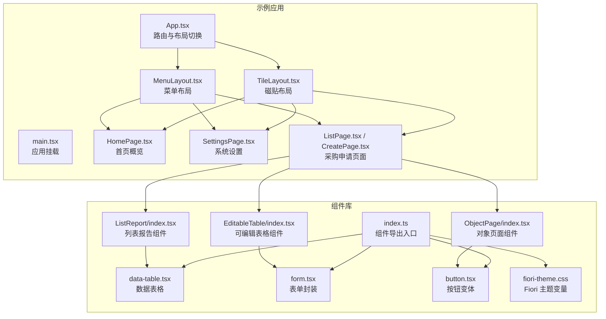

**图表来源**
- [App.tsx](file://app/examples/admin/src/App.tsx#L72-L171)
- [MenuLayout.tsx](file://app/examples/admin/src/layouts/MenuLayout.tsx#L160-L418)
- [TileLayout.tsx](file://app/examples/admin/src/layouts/TileLayout.tsx#L200-L453)
- [ListReport/index.tsx](file://app/examples/admin/src/components/ListReport/index.tsx#L145-L397)
- [EditableTable/index.tsx](file://app/examples/admin/src/components/EditableTable/index.tsx#L54-L160)
- [ObjectPage/index.tsx](file://app/examples/admin/src/components/ObjectPage/index.tsx#L131-L543)
- [data-table.tsx](file://app/framework/admin-component/src/ui/data-table.tsx#L73-L374)
- [form.tsx](file://app/framework/admin-component/src/ui/form.tsx#L19-L167)
- [button.tsx](file://app/framework/admin-component/src/ui/button.tsx#L41-L64)
- [fiori-theme.css](file://app/framework/admin-component/src/styles/fiori-theme.css#L6-L140)
- [index.ts](file://app/framework/admin-component/src/index.ts#L6-L37)

**章节来源**
- [App.tsx](file://app/examples/admin/src/App.tsx#L72-L171)
- [main.tsx](file://app/examples/admin/src/main.tsx#L1-L11)
- [package.json](file://package.json#L1-L32)

## 核心组件
- 应用入口与路由
  - 使用 React Router 进行路由配置，支持菜单布局与磁贴布局两种模式，通过本地存储持久化布局偏好。
  - 路由覆盖首页、设置、采购申请、采购订单、收货管理、主数据、报表分析等模块。
- 布局组件
  - MenuLayout：传统侧边栏导航，支持分组、折叠、子菜单、活跃态指示与徽标。
  - TileLayout：门户风格磁贴布局，支持分类展示、收藏、最近使用、搜索过滤。
- 页面组件
  - HomePage：基于 Fiori 风格的仪表盘，包含统计卡片、快捷操作、最近活动与待办提示。
  - SettingsPage：系统设置页面，提供个人信息、通知、外观、语言地区、安全设置等区块。
- 业务组件
  - ListReport：一体化卡片风格的列表报告，集成 Header、工具栏、搜索筛选、数据表格。
  - EditableTable：表单内嵌可编辑表格，适用于行项目编辑与计算。
  - ObjectPage：对象页面通用组件，支持 display/edit/create 三种模式与侧边栏导航。
- 基础组件库
  - DataTable：基于 @tanstack/react-table 的数据表格，支持排序、分页、选择、行点击。
  - Form：基于 react-hook-form 的表单封装，提供 Label、Control、Message 等槽位。
  - Button：基于 class-variance-authority 的按钮变体，支持尺寸与样式变体。

**章节来源**
- [App.tsx](file://app/examples/admin/src/App.tsx#L72-L171)
- [MenuLayout.tsx](file://app/examples/admin/src/layouts/MenuLayout.tsx#L160-L418)
- [TileLayout.tsx](file://app/examples/admin/src/layouts/TileLayout.tsx#L200-L453)
- [HomePage.tsx](file://app/examples/admin/src/pages/HomePage.tsx#L120-L276)
- [SettingsPage.tsx](file://app/examples/admin/src/pages/SettingsPage.tsx#L112-L317)
- [ListReport/index.tsx](file://app/examples/admin/src/components/ListReport/index.tsx#L145-L397)
- [EditableTable/index.tsx](file://app/examples/admin/src/components/EditableTable/index.tsx#L54-L160)
- [ObjectPage/index.tsx](file://app/examples/admin/src/components/ObjectPage/index.tsx#L131-L543)
- [data-table.tsx](file://app/framework/admin-component/src/ui/data-table.tsx#L73-L374)
- [form.tsx](file://app/framework/admin-component/src/ui/form.tsx#L19-L167)
- [button.tsx](file://app/framework/admin-component/src/ui/button.tsx#L41-L64)

## 架构总览
前端采用“布局 + 页面 + 组件库”的分层架构。布局层负责导航与容器；页面层承载业务视图；组件库提供基础与业务组件，统一设计语言与交互体验。

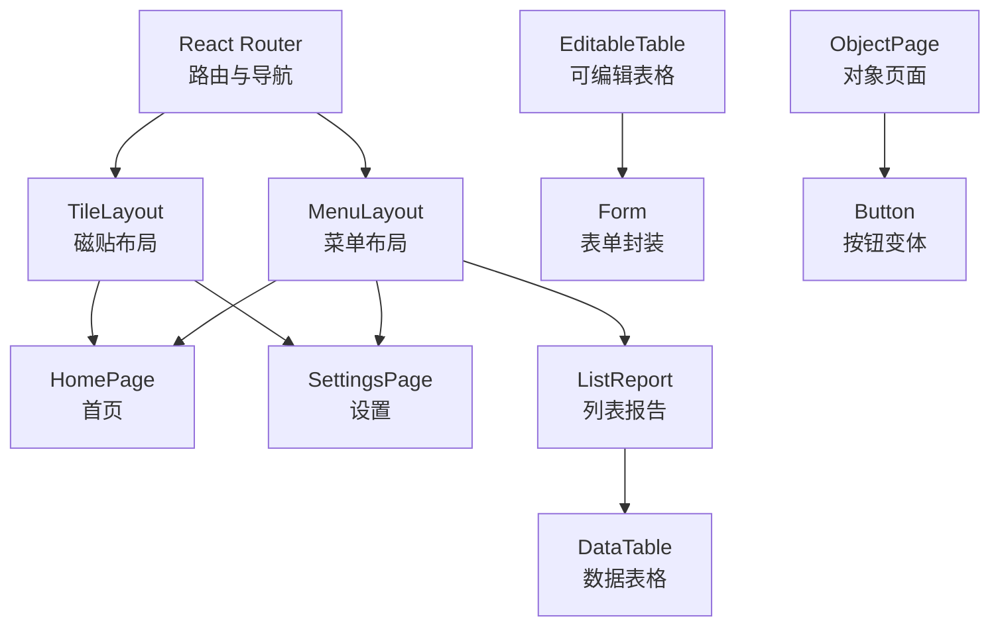

**图表来源**
- [App.tsx](file://app/examples/admin/src/App.tsx#L72-L171)
- [MenuLayout.tsx](file://app/examples/admin/src/layouts/MenuLayout.tsx#L160-L418)
- [TileLayout.tsx](file://app/examples/admin/src/layouts/TileLayout.tsx#L200-L453)
- [ListReport/index.tsx](file://app/examples/admin/src/components/ListReport/index.tsx#L145-L397)
- [EditableTable/index.tsx](file://app/examples/admin/src/components/EditableTable/index.tsx#L54-L160)
- [ObjectPage/index.tsx](file://app/examples/admin/src/components/ObjectPage/index.tsx#L131-L543)
- [data-table.tsx](file://app/framework/admin-component/src/ui/data-table.tsx#L73-L374)
- [form.tsx](file://app/framework/admin-component/src/ui/form.tsx#L19-L167)
- [button.tsx](file://app/framework/admin-component/src/ui/button.tsx#L41-L64)

## 详细组件分析

### 应用入口与路由配置
- 功能要点
  - 从 localStorage 读取布局偏好，支持菜单布局与磁贴布局切换。
  - 路由按模块划分，覆盖采购申请、采购订单、收货管理、主数据、报表分析与设置。
  - 支持通配符路由重定向至首页。
- 交互流程
  - 用户切换布局模式后，App 状态更新并持久化到 localStorage。
  - 路由根据当前模式渲染对应布局容器，再由布局容器渲染具体页面。

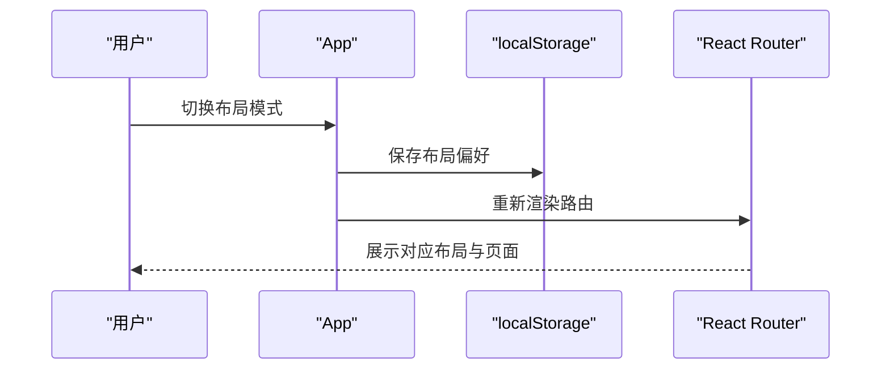

**图表来源**
- [App.tsx](file://app/examples/admin/src/App.tsx#L72-L86)

**章节来源**
- [App.tsx](file://app/examples/admin/src/App.tsx#L72-L171)

### 菜单布局（MenuLayout）
- 功能要点
  - 侧边栏支持分组、展开/折叠、子菜单层级、活跃态高亮与徽标。
  - 支持菜单项的动态激活判断与面包屑导航。
  - 顶部 ShellBar 集成布局切换与菜单开关。
- 交互流程
  - 用户点击菜单项或子菜单项，触发路由跳转。
  - 展开/折叠按钮控制侧边栏宽度与文字显示。

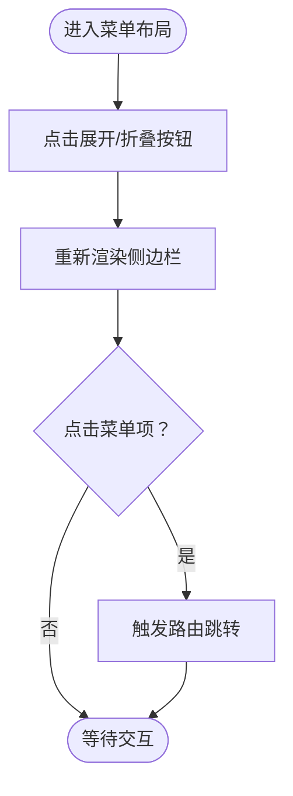

**图表来源**
- [MenuLayout.tsx](file://app/examples/admin/src/layouts/MenuLayout.tsx#L160-L418)

**章节来源**
- [MenuLayout.tsx](file://app/examples/admin/src/layouts/MenuLayout.tsx#L160-L418)

### 磁贴布局（TileLayout）
- 功能要点
  - 门户风格磁贴展示，支持分类、收藏、最近使用、搜索过滤。
  - 首页欢迎横幅与标签页（收藏夹/最近使用/所有应用）。
  - 点击磁贴导航至对应页面。
- 交互流程
  - 用户切换标签页或搜索磁贴，布局根据状态渲染不同内容区域。
  - 点击磁贴触发导航。

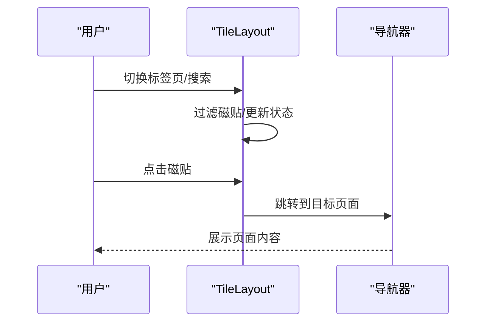

**图表来源**
- [TileLayout.tsx](file://app/examples/admin/src/layouts/TileLayout.tsx#L200-L453)

**章节来源**
- [TileLayout.tsx](file://app/examples/admin/src/layouts/TileLayout.tsx#L200-L453)

### 首页概览（HomePage）
- 功能要点
  - 统计卡片：待处理采购申请、进行中订单、待收货、本月采购额。
  - 快捷操作：创建采购申请、查看订单、收货确认、查看报表。
  - 最近活动：创建、审批、收货等事件流。
  - 待办提示：引导用户处理待办事项。
- 交互设计
  - 卡片与按钮悬停效果、图标与颜色搭配遵循 Fiori 设计语言。

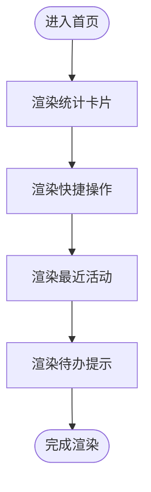

**图表来源**
- [HomePage.tsx](file://app/examples/admin/src/pages/HomePage.tsx#L120-L276)

**章节来源**
- [HomePage.tsx](file://app/examples/admin/src/pages/HomePage.tsx#L120-L276)

### 系统设置（SettingsPage）
- 功能要点
  - 个人信息：头像、姓名、邮箱、手机号、部门。
  - 通知设置：邮件、浏览器推送、短信开关。
  - 外观设置：浅色/深色/跟随系统主题。
  - 语言和地区：界面语言、时区、日期格式、数字格式。
  - 安全设置：修改密码、双因素认证、登录记录。
- 组件使用
  - 使用 Input、Select、Label 等基础组件组合表单区块。
  - Switch 组件实现开关控件，ThemeOption 实现主题选择。

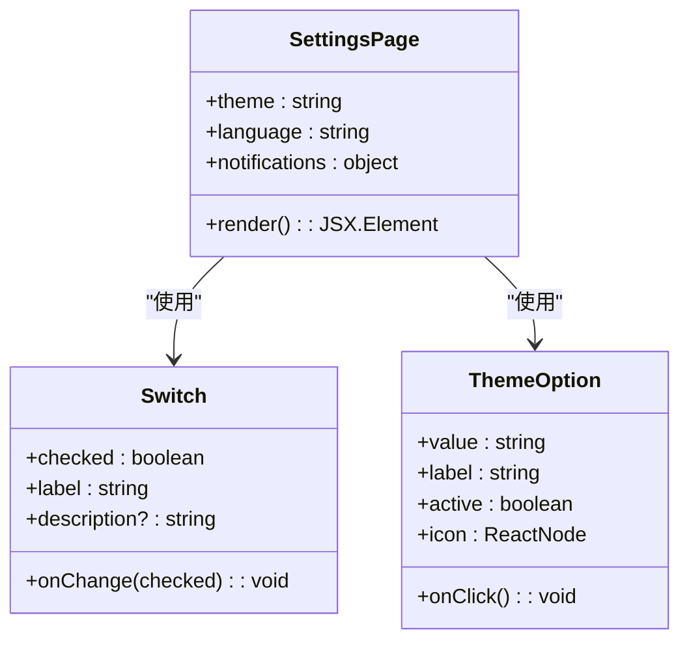

**图表来源**
- [SettingsPage.tsx](file://app/examples/admin/src/pages/SettingsPage.tsx#L112-L317)

**章节来源**
- [SettingsPage.tsx](file://app/examples/admin/src/pages/SettingsPage.tsx#L112-L317)

### 列表报告组件（ListReport）
- 功能要点
  - Header：标题、副标题、标签、图标、主操作按钮。
  - 工具栏：选择项计数、批量操作、刷新、导出、列设置、帮助。
  - 搜索与筛选：搜索框、筛选按钮、清除筛选、应用。
  - 数据表格：支持排序、分页、选择、行点击。
- 交互流程
  - 用户输入搜索词或切换筛选，ListReport 通过回调通知父组件。
  - 用户选择行或点击行，触发回调并可联动批量操作按钮。

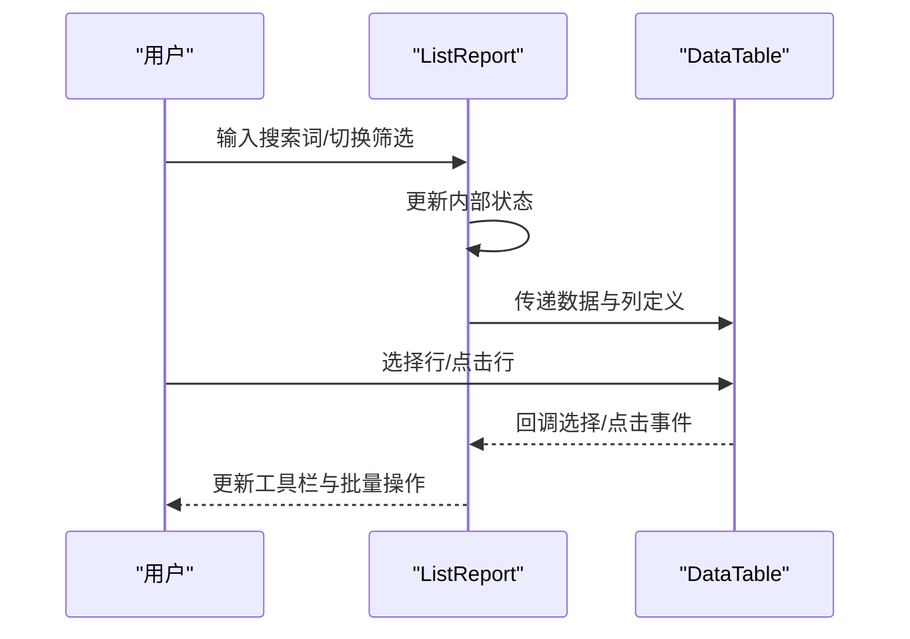

**图表来源**
- [ListReport/index.tsx](file://app/examples/admin/src/components/ListReport/index.tsx#L145-L397)
- [data-table.tsx](file://app/framework/admin-component/src/ui/data-table.tsx#L73-L374)

**章节来源**
- [ListReport/index.tsx](file://app/examples/admin/src/components/ListReport/index.tsx#L145-L397)
- [data-table.tsx](file://app/framework/admin-component/src/ui/data-table.tsx#L73-L374)

### 可编辑表格（EditableTable）
- 功能要点
  - 表头/表体/表尾结构，支持最小宽度、嵌入模式、序号列。
  - 单元格渲染器：TableInput、TableSelect、TableText、TableDeleteButton。
  - 适用于表单内的行项目编辑与计算。
- 使用建议
  - 列定义清晰，必要时使用 required 标记必填项。
  - 行项目增删与计算逻辑在父组件维护，表格仅负责渲染与交互。

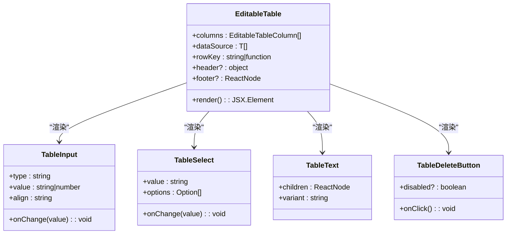

**图表来源**
- [EditableTable/index.tsx](file://app/examples/admin/src/components/EditableTable/index.tsx#L54-L160)

**章节来源**
- [EditableTable/index.tsx](file://app/examples/admin/src/components/EditableTable/index.tsx#L54-L160)

### 对象页面（ObjectPage）
- 功能要点
  - 支持 display/edit/create 三种模式，统一头部、关键信息区、KPI 区、Section 导航。
  - 底部粘浮工具栏，按模式区分按钮位置与样式。
  - Section 可配置是否显示在侧边栏，支持滚动定位。
- 使用建议
  - 根据模式显隐操作按钮，合理组织 Section 内容。
  - 使用 KPI 区突出关键指标，提升信息密度。

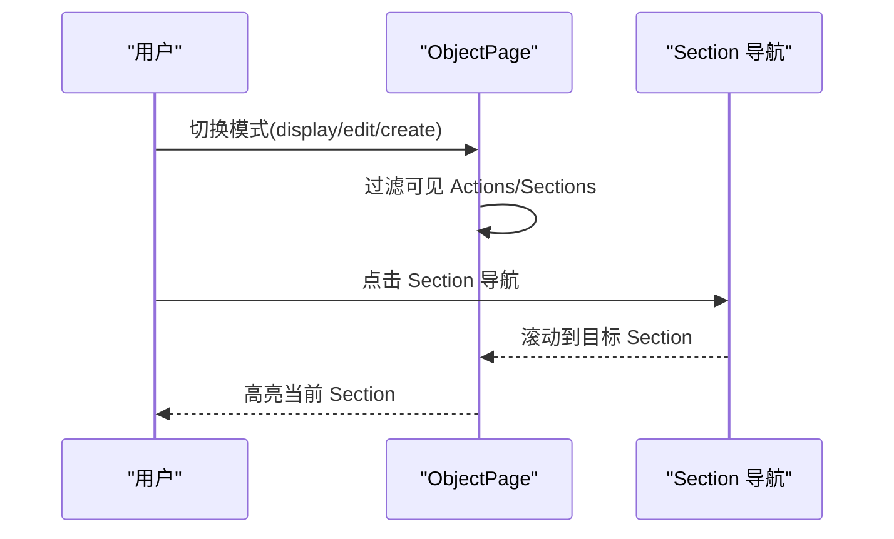

**图表来源**
- [ObjectPage/index.tsx](file://app/examples/admin/src/components/ObjectPage/index.tsx#L131-L543)

**章节来源**
- [ObjectPage/index.tsx](file://app/examples/admin/src/components/ObjectPage/index.tsx#L131-L543)

### 数据表格（DataTable）
- 功能要点
  - 基于 @tanstack/react-table，支持排序、分页、选择、行点击/双击。
  - 列定义灵活，支持对齐方式、排序开关、自定义渲染。
  - 手动分页模式下，通过回调同步外部状态。
- 性能建议
  - 大数据量时启用手动分页与虚拟滚动（如需）。
  - 合理设置列宽与对齐，减少重排。

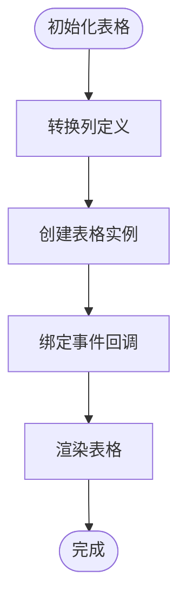

**图表来源**
- [data-table.tsx](file://app/framework/admin-component/src/ui/data-table.tsx#L104-L185)

**章节来源**
- [data-table.tsx](file://app/framework/admin-component/src/ui/data-table.tsx#L73-L374)

### 表单组件（Form）
- 功能要点
  - 基于 react-hook-form，提供 Form、FormField、FormLabel、FormControl、FormMessage 等槽位。
  - useFormField 提供字段状态与验证信息。
- 使用建议
  - 在表单容器中统一管理状态，结合组件库的 Input、Select 等使用。

**章节来源**
- [form.tsx](file://app/framework/admin-component/src/ui/form.tsx#L19-L167)

### 按钮组件（Button）
- 功能要点
  - 基于 class-variance-authority，支持 variant 与 size 变体。
  - 支持 asChild 渲染为其他元素。
- 使用建议
  - 根据场景选择 primary/secondary/success/danger/ghost 等变体。

**章节来源**
- [button.tsx](file://app/framework/admin-component/src/ui/button.tsx#L41-L64)

### 主题与样式（Fiori 主题）
- 功能要点
  - 定义完整的 Fiori 主题变量，支持浅色与深色模式。
  - 映射到 shadcn 变量，便于统一风格。
- 使用建议
  - 在根节点引入主题样式，确保全局一致。

**章节来源**
- [fiori-theme.css](file://app/framework/admin-component/src/styles/fiori-theme.css#L6-L140)

## 依赖关系分析
- 组件库导出入口
  - index.ts 汇总导出工具函数与基础组件、Aiko Boot 组件、状态芯片、搜索过滤栏等。
- 工作区脚本
  - 顶层 package.json 提供并行开发、构建、测试、类型检查与清理脚本。

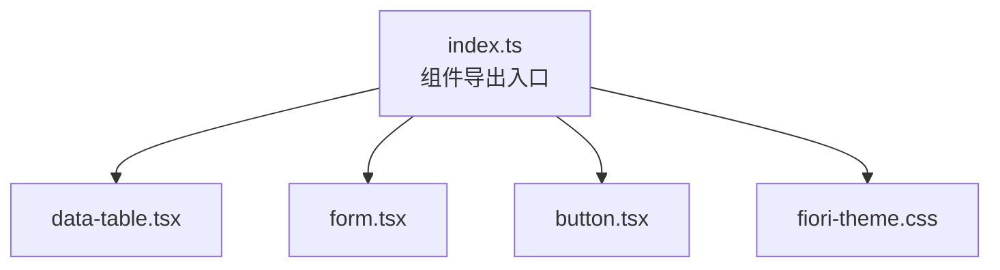

**图表来源**
- [index.ts](file://app/framework/admin-component/src/index.ts#L6-L37)

**章节来源**
- [index.ts](file://app/framework/admin-component/src/index.ts#L6-L37)
- [package.json](file://package.json#L11-L18)

## 性能考虑
- 路由与布局
  - 通过本地存储缓存布局偏好，避免每次刷新重新计算。
- 表格性能
  - 大数据场景启用手动分页与排序，减少一次性渲染压力。
  - 合理设置列宽与对齐，降低重排成本。
- 交互反馈
  - 使用骨架屏与加载状态，提升感知性能。
- 主题与样式
  - 使用 CSS 变量集中管理颜色与阴影，减少重复定义。

## 故障排除指南
- 路由不生效或布局未切换
  - 检查 App 中布局模式状态与 localStorage 的读写逻辑。
  - 确认路由配置是否覆盖目标路径。
- 表格排序/分页异常
  - 确认传入的 onSortChange、onPaginationChange 回调是否正确处理参数。
  - 手动分页时确保 totalCount 正确，pageIndex 与 pageSize 同步。
- 表单校验不显示错误
  - 确保在 Form 中使用 FormMessage 并正确传递字段名称。
- 主题样式未生效
  - 确认已引入 fiori-theme.css，且根节点具备正确的 CSS 变量。

**章节来源**
- [App.tsx](file://app/examples/admin/src/App.tsx#L72-L86)
- [data-table.tsx](file://app/framework/admin-component/src/ui/data-table.tsx#L157-L184)
- [form.tsx](file://app/framework/admin-component/src/ui/form.tsx#L138-L155)
- [fiori-theme.css](file://app/framework/admin-component/src/styles/fiori-theme.css#L6-L140)

## 结论
本指南基于 React 与 SAP Fiori 设计规范，结合 Aiko Boot 组件库，提供了从前端入口配置到页面组件实现的完整实践路径。通过菜单布局与磁贴布局的对比、列表报告与可编辑表格的组合、以及统一的主题与表单体系，能够快速搭建专业的企业级管理界面。建议在实际项目中遵循组件复用、状态分离与性能优化的原则，持续迭代用户体验。