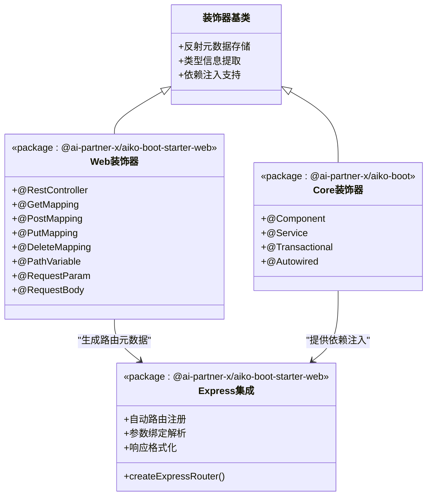
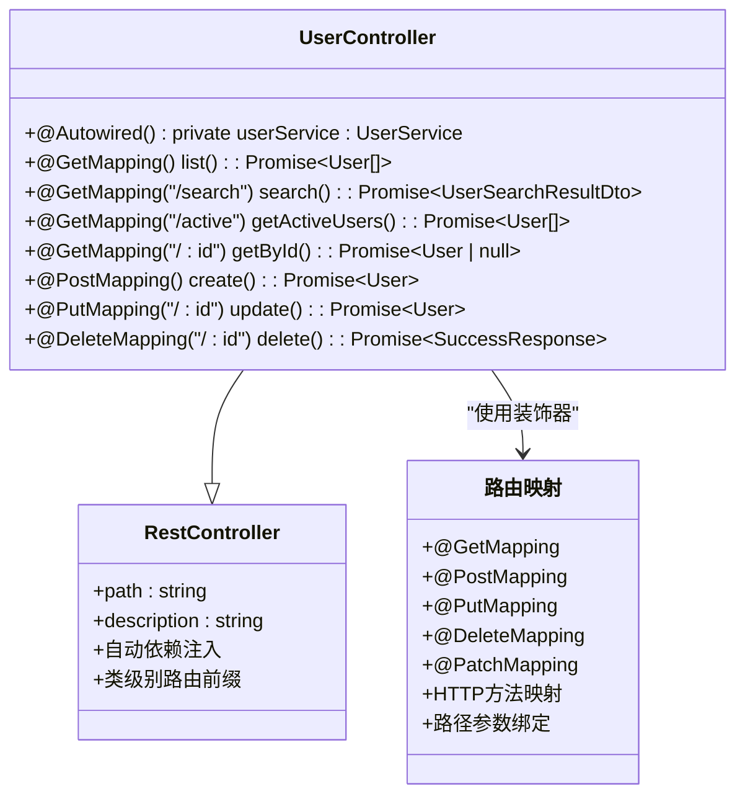
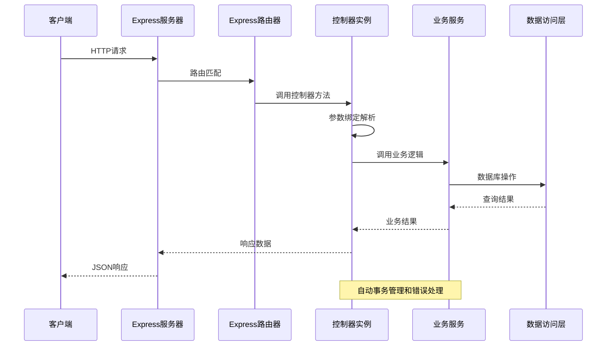
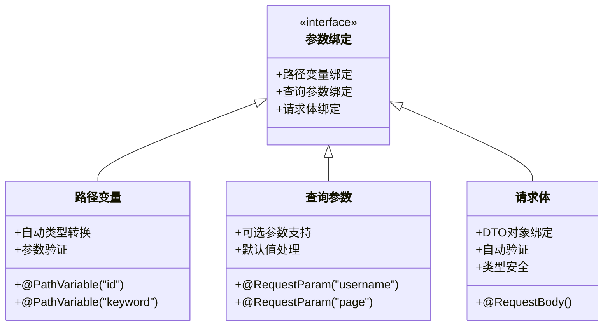
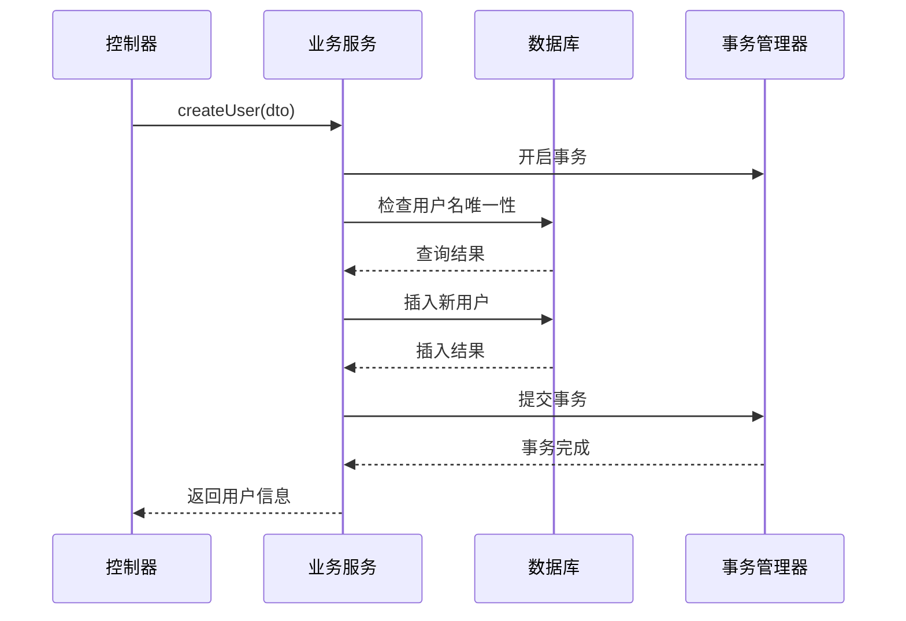
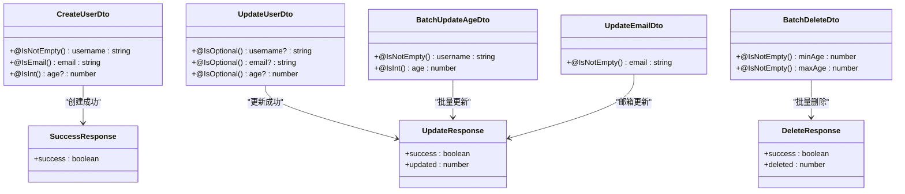
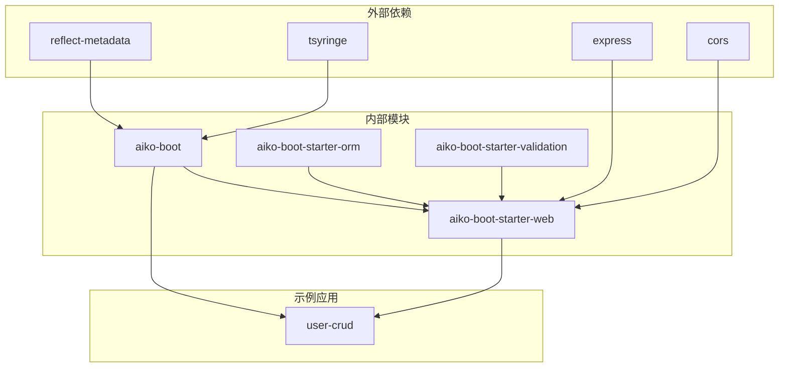
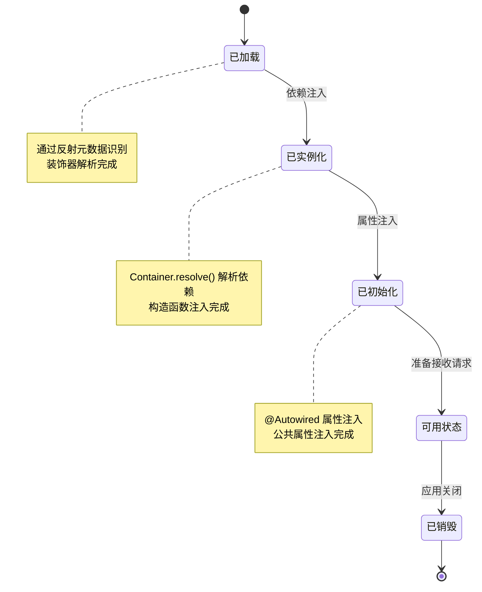
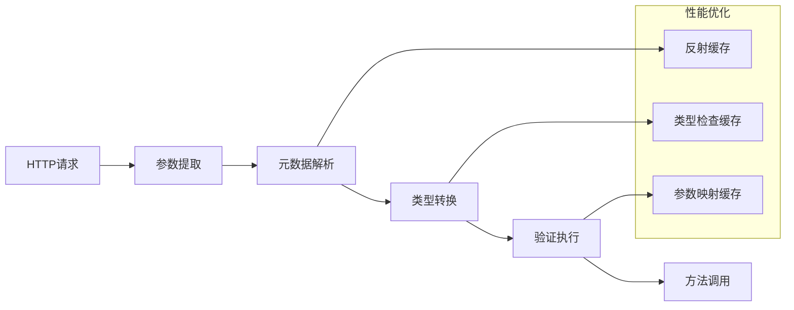

# API 控制器开发

<cite>
**本文档引用的文件**
- [packages/aiko-boot/src/decorators.ts](file://packages/aiko-boot/src/decorators.ts)
- [packages/aiko-boot-starter-web/src/decorators.ts](file://packages/aiko-boot-starter-web/src/decorators.ts)
- [packages/aiko-boot-starter-web/src/express-router.ts](file://packages/aiko-boot-starter-web/src/express-router.ts)
- [app/examples/user-crud/packages/api/src/controller/user.controller.ts](file://app/examples/user-crud/packages/api/src/controller/user.controller.ts)
- [app/examples/user-crud/packages/api/src/dto/user.dto.ts](file://app/examples/user-crud/packages/api/src/dto/user.dto.ts)
- [app/examples/user-crud/packages/api/src/service/user.service.ts](file://app/examples/user-crud/packages/api/src/service/user.service.ts)
- [app/examples/user-crud/packages/api/src/entity/user.entity.ts](file://app/examples/user-crud/packages/api/src/entity/user.entity.ts)
- [packages/aiko-boot/package.json](file://packages/aiko-boot/package.json)
- [packages/aiko-boot-starter-web/package.json](file://packages/aiko-boot-starter-web/package.json)
</cite>

## 目录
1. [简介](#简介)
2. [项目结构](#项目结构)
3. [核心组件](#核心组件)
4. [架构概览](#架构概览)
5. [详细组件分析](#详细组件分析)
6. [依赖关系分析](#依赖关系分析)
7. [性能考虑](#性能考虑)
8. [故障排除指南](#故障排除指南)
9. [结论](#结论)

## 简介

本指南面向使用 Aiko Boot 框架进行 API 控制器开发的开发者，详细介绍如何使用装饰器模式构建 RESTful API 接口。Aiko Boot 提供了与 Spring Boot 风格一致的控制器装饰器，包括 @RestController、@GetMapping、@PostMapping 等，配合依赖注入容器实现声明式的路由映射和参数绑定。

该框架的核心优势在于：
- **零样板代码**：通过装饰器自动注册路由，无需手动配置
- **强类型支持**：基于 TypeScript 的完整类型安全
- **依赖注入**：自动解析控制器和服务层依赖关系
- **参数绑定**：支持路径变量、查询参数和请求体的自动绑定
- **统一响应格式**：标准化的响应结构和错误处理

## 项目结构

Aiko Boot 采用多包架构，主要包含以下核心模块：

```mermaid
graph TB
subgraph "核心框架"
A[@ai-partner-x/aiko-boot<br/>核心装饰器和DI容器]
B[@ai-partner-x/aiko-boot-starter-web<br/>Web装饰器和Express集成]
end
subgraph "示例应用"
C[user-crud 示例<br/>完整的用户管理API]
D[实体模型 User]
E[服务层 UserService]
F[DTO 数据传输对象]
end
subgraph "运行时环境"
G[Express 应用服务器]
H[TypeScript 编译器]
I[反射元数据系统]
end
A --> B
B --> C
C --> D
C --> E
C --> F
B --> G
A --> I
B --> H
```

**图表来源**
- [packages/aiko-boot/package.json](file://packages/aiko-boot/package.json#L1-L61)
- [packages/aiko-boot-starter-web/package.json](file://packages/aiko-boot-starter-web/package.json#L1-L60)

**章节来源**
- [packages/aiko-boot/package.json](file://packages/aiko-boot/package.json#L1-L61)
- [packages/aiko-boot-starter-web/package.json](file://packages/aiko-boot-starter-web/package.json#L1-L60)

## 核心组件

### 装饰器系统架构

Aiko Boot 的装饰器系统分为三层：



**图表来源**
- [packages/aiko-boot/src/decorators.ts](file://packages/aiko-boot/src/decorators.ts#L1-L158)
- [packages/aiko-boot-starter-web/src/decorators.ts](file://packages/aiko-boot-starter-web/src/decorators.ts#L1-L196)
- [packages/aiko-boot-starter-web/src/express-router.ts](file://packages/aiko-boot-starter-web/src/express-router.ts#L1-L171)

### 控制器类结构设计

控制器类采用声明式设计，通过装饰器定义路由映射：



**图表来源**
- [app/examples/user-crud/packages/api/src/controller/user.controller.ts](file://app/examples/user-crud/packages/api/src/controller/user.controller.ts#L30-L170)

**章节来源**
- [app/examples/user-crud/packages/api/src/controller/user.controller.ts](file://app/examples/user-crud/packages/api/src/controller/user.controller.ts#L1-L170)

## 架构概览

Aiko Boot 的 API 控制器架构采用装饰器驱动的自动注册模式：



**图表来源**
- [packages/aiko-boot-starter-web/src/express-router.ts](file://packages/aiko-boot-starter-web/src/express-router.ts#L126-L169)

### HTTP 方法映射机制

框架支持多种 HTTP 方法映射装饰器：

| 装饰器 | 对应HTTP方法 | 用途 | 示例 |
|--------|-------------|------|------|
| @GetMapping | GET | 获取资源 | @GetMapping() |
| @PostMapping | POST | 创建资源 | @PostMapping() |
| @PutMapping | PUT | 更新资源 | @PutMapping("/:id") |
| @DeleteMapping | DELETE | 删除资源 | @DeleteMapping("/:id") |
| @PatchMapping | PATCH | 部分更新 | @PatchMapping() |

**章节来源**
- [packages/aiko-boot-starter-web/src/decorators.ts](file://packages/aiko-boot-starter-web/src/decorators.ts#L90-L123)

## 详细组件分析

### 用户管理 API 实现

#### 控制器层设计

用户管理控制器实现了完整的 CRUD 操作和高级查询功能：

```mermaid
flowchart TD
A[用户管理控制器] --> B[基础CRUD操作]
A --> C[高级搜索功能]
A --> D[批量操作]
B --> B1[获取用户列表<br/>@GetMapping()]
B --> B2[获取用户详情<br/>@GetMapping("/:id")]
B --> B3[创建用户<br/>@PostMapping()]
B --> B4[更新用户<br/>@PutMapping("/:id")]
B --> B5[删除用户<br/>@DeleteMapping("/:id")]
C --> C1[高级搜索<br/>@GetMapping("/search")]
C --> C2[活跃用户查询<br/>@GetMapping("/active")]
C --> C3[关键字搜索<br/>@GetMapping("/keyword/:keyword")]
D --> D1[批量更新年龄<br/>@PutMapping("/batch/age")]
D --> D2[更新邮箱<br/>@PutMapping("/:id/email")]
D --> D3[批量删除<br/>@DeleteMapping("/batch")]
```

**图表来源**
- [app/examples/user-crud/packages/api/src/controller/user.controller.ts](file://app/examples/user-crud/packages/api/src/controller/user.controller.ts#L35-L168)

#### 参数绑定机制

框架提供了三种主要的参数绑定方式：



**图表来源**
- [packages/aiko-boot-starter-web/src/decorators.ts](file://packages/aiko-boot-starter-web/src/decorators.ts#L138-L173)

#### 服务层事务管理

用户服务层使用 @Transactional 装饰器确保数据一致性：



**图表来源**
- [app/examples/user-crud/packages/api/src/service/user.service.ts](file://app/examples/user-crud/packages/api/src/service/user.service.ts#L148-L171)

**章节来源**
- [app/examples/user-crud/packages/api/src/controller/user.controller.ts](file://app/examples/user-crud/packages/api/src/controller/user.controller.ts#L1-L170)
- [app/examples/user-crud/packages/api/src/service/user.service.ts](file://app/examples/user-crud/packages/api/src/service/user.service.ts#L1-L251)

### 数据传输对象 (DTO) 设计

框架使用 DTO 模式实现数据验证和传输控制：



**图表来源**
- [app/examples/user-crud/packages/api/src/dto/user.dto.ts](file://app/examples/user-crud/packages/api/src/dto/user.dto.ts#L4-L105)

**章节来源**
- [app/examples/user-crud/packages/api/src/dto/user.dto.ts](file://app/examples/user-crud/packages/api/src/dto/user.dto.ts#L1-L105)

## 依赖关系分析

### 模块间依赖图



**图表来源**
- [packages/aiko-boot/package.json](file://packages/aiko-boot/package.json#L35-L38)
- [packages/aiko-boot-starter-web/package.json](file://packages/aiko-boot-starter-web/package.json#L32-L37)

### 控制器生命周期管理



**图表来源**
- [packages/aiko-boot-starter-web/src/express-router.ts](file://packages/aiko-boot-starter-web/src/express-router.ts#L87-L100)

**章节来源**
- [packages/aiko-boot-starter-web/src/express-router.ts](file://packages/aiko-boot-starter-web/src/express-router.ts#L1-L171)

## 性能考虑

### 路由注册优化

框架在启动时进行一次性路由注册，避免运行时重复解析：

- **元数据缓存**：装饰器元数据在类加载时解析并缓存
- **路由预编译**：路径模式在注册时编译为正则表达式
- **实例复用**：单例模式确保控制器实例只创建一次

### 参数绑定性能



### 错误处理策略

框架提供统一的错误处理机制：

- **自动捕获**：所有控制器方法调用都在 try-catch 包装中
- **状态码映射**：业务异常转换为 400 状态码
- **错误响应格式**：标准化的错误响应结构

## 故障排除指南

### 常见问题诊断

| 问题类型 | 症状 | 解决方案 |
|----------|------|----------|
| 路由未注册 | 404 Not Found | 检查 @RestController 装饰器是否正确导入 |
| 参数绑定失败 | 参数为 undefined | 确认装饰器参数名称与请求一致 |
| 依赖注入失败 | 控制器属性为 undefined | 检查 @Autowired 装饰器使用 |
| 事务未生效 | 数据库操作无回滚 | 确认 @Transactional 装饰器正确使用 |

### 调试技巧

1. **启用详细日志**：设置 `verbose: true` 查看路由注册信息
2. **检查元数据**：使用 `getControllerMetadata()` 和 `getRequestMappings()` 验证装饰器解析
3. **单元测试**：为控制器方法编写独立测试用例

**章节来源**
- [packages/aiko-boot-starter-web/src/express-router.ts](file://packages/aiko-boot-starter-web/src/express-router.ts#L160-L166)

## 结论

Aiko Boot 的 API 控制器开发模式提供了与 Spring Boot 一致的开发体验，通过装饰器驱动的方式简化了 RESTful API 的开发流程。核心优势包括：

- **声明式开发**：通过装饰器定义路由和参数绑定
- **类型安全**：完整的 TypeScript 类型支持
- **依赖注入**：自动化的依赖解析和管理
- **统一规范**：标准化的响应格式和错误处理
- **扩展性强**：模块化设计支持功能扩展

建议在实际项目中遵循以下最佳实践：
- 使用 DTO 模式进行数据验证和传输
- 合理使用 @Transactional 确保数据一致性
- 为复杂查询使用 QueryWrapper 和 UpdateWrapper
- 实施适当的日志记录和监控
- 编写充分的单元测试覆盖核心业务逻辑

通过这些实践，可以充分利用 Aiko Boot 的装饰器优势，快速构建高质量的 RESTful API 服务。