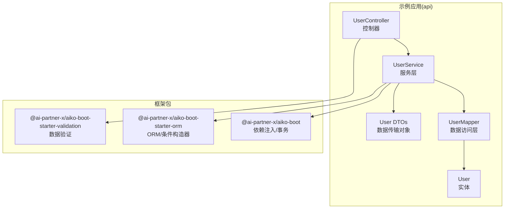
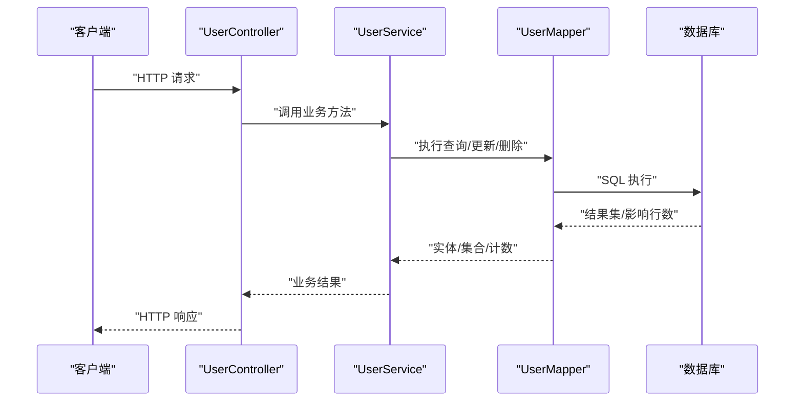
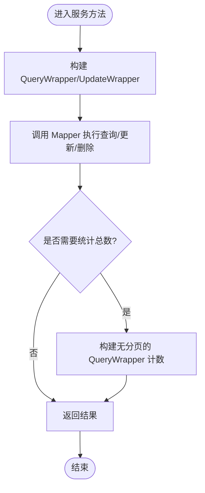
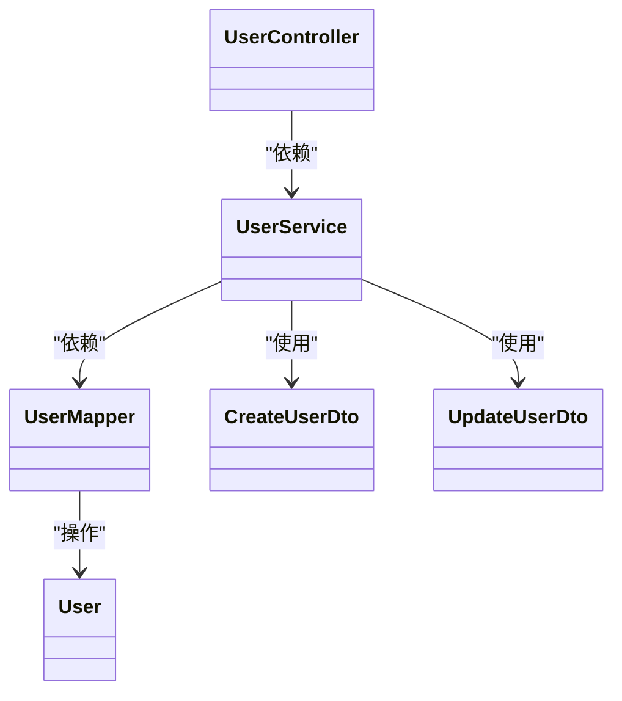

# 业务服务层

<cite>
**本文引用的文件**
- [README.md](file://README.md)
- [packages/aiko-boot/src/index.ts](file://packages/aiko-boot/src/index.ts)
- [packages/aiko-boot-starter-orm/src/index.ts](file://packages/aiko-boot-starter-orm/src/index.ts)
- [packages/aiko-boot-starter-validation/src/index.ts](file://packages/aiko-boot-starter-validation/src/index.ts)
- [app/examples/user-crud/packages/api/src/entity/user.entity.ts](file://app/examples/user-crud/packages/api/src/entity/user.entity.ts)
- [app/examples/user-crud/packages/api/src/mapper/user.mapper.ts](file://app/examples/user-crud/packages/api/src/mapper/user.mapper.ts)
- [app/examples/user-crud/packages/api/src/dto/user.dto.ts](file://app/examples/user-crud/packages/api/src/dto/user.dto.ts)
- [app/examples/user-crud/packages/api/src/service/user.service.ts](file://app/examples/user-crud/packages/api/src/service/user.service.ts)
- [app/examples/user-crud/packages/api/src/controller/user.controller.ts](file://app/examples/user-crud/packages/api/src/controller/user.controller.ts)
</cite>

## 目录
1. [引言](#引言)
2. [项目结构](#项目结构)
3. [核心组件](#核心组件)
4. [架构总览](#架构总览)
5. [组件详解](#组件详解)
6. [依赖关系分析](#依赖关系分析)
7. [性能考量](#性能考量)
8. [故障排查指南](#故障排查指南)
9. [结论](#结论)
10. [附录](#附录)

## 引言
本指南聚焦于业务服务层的设计与实现，围绕用户业务服务层展开，系统讲解服务类的创建、业务逻辑封装、数据验证与事务管理、服务层与数据访问层的交互模式、依赖注入的使用以及异常处理策略。同时给出复杂业务规则（如权限校验、数据完整性检查、业务流程控制）的实现思路与最佳实践，并提供单元测试编写方法与常见问题排查建议。

## 项目结构
该仓库采用 monorepo 结构，业务示例位于 app/examples/user-crud/packages/api 中，核心框架能力由 packages 下的多个子包提供：
- 依赖注入与自动配置：@ai-partner-x/aiko-boot
- ORM 与条件构造器：@ai-partner-x/aiko-boot-starter-orm
- 数据验证：@ai-partner-x/aiko-boot-starter-validation
- 控制器与 Web 能力：@ai-partner-x/aiko-boot-starter-web（示例中通过控制器调用服务）

图表来源
- [app/examples/user-crud/packages/api/src/controller/user.controller.ts](file://app/examples/user-crud/packages/api/src/controller/user.controller.ts#L30-L170)
- [app/examples/user-crud/packages/api/src/service/user.service.ts](file://app/examples/user-crud/packages/api/src/service/user.service.ts#L30-L251)
- [app/examples/user-crud/packages/api/src/mapper/user.mapper.ts](file://app/examples/user-crud/packages/api/src/mapper/user.mapper.ts#L5-L17)
- [app/examples/user-crud/packages/api/src/entity/user.entity.ts](file://app/examples/user-crud/packages/api/src/entity/user.entity.ts#L3-L23)
- [app/examples/user-crud/packages/api/src/dto/user.dto.ts](file://app/examples/user-crud/packages/api/src/dto/user.dto.ts#L4-L105)
- [packages/aiko-boot/src/index.ts](file://packages/aiko-boot/src/index.ts#L29-L53)
- [packages/aiko-boot-starter-orm/src/index.ts](file://packages/aiko-boot-starter-orm/src/index.ts#L22-L64)
- [packages/aiko-boot-starter-validation/src/index.ts](file://packages/aiko-boot-starter-validation/src/index.ts#L33-L103)

章节来源
- [README.md](file://README.md#L14-L33)
- [packages/aiko-boot/src/index.ts](file://packages/aiko-boot/src/index.ts#L1-L64)
- [packages/aiko-boot-starter-orm/src/index.ts](file://packages/aiko-boot-starter-orm/src/index.ts#L1-L91)
- [packages/aiko-boot-starter-validation/src/index.ts](file://packages/aiko-boot-starter-validation/src/index.ts#L1-L242)

## 核心组件
- 实体与映射
  - 实体：用户实体定义了表结构与字段元数据，用于 ORM 映射与查询包装器的类型约束。
  - 映射器：基于通用 BaseMapper 提供基础 CRUD 能力，并可扩展自定义查询方法。
- 服务层
  - 聚合业务逻辑，协调数据访问层与 DTO，执行事务边界内的复合操作。
  - 提供高级查询、批量更新/删除、条件构造器示例等。
- 控制器
  - 作为对外接口，接收请求参数，调用服务层，组装响应 DTO。
- 验证层
  - 基于 class-validator 的装饰器进行请求体与参数的声明式校验。
- 依赖注入与事务
  - 通过 @Service、@Autowired、@Transactional 等装饰器完成组件注册、自动注入与事务管理。

章节来源
- [app/examples/user-crud/packages/api/src/entity/user.entity.ts](file://app/examples/user-crud/packages/api/src/entity/user.entity.ts#L3-L23)
- [app/examples/user-crud/packages/api/src/mapper/user.mapper.ts](file://app/examples/user-crud/packages/api/src/mapper/user.mapper.ts#L5-L17)
- [app/examples/user-crud/packages/api/src/service/user.service.ts](file://app/examples/user-crud/packages/api/src/service/user.service.ts#L30-L251)
- [app/examples/user-crud/packages/api/src/controller/user.controller.ts](file://app/examples/user-crud/packages/api/src/controller/user.controller.ts#L30-L170)
- [packages/aiko-boot/src/index.ts](file://packages/aiko-boot/src/index.ts#L29-L53)
- [packages/aiko-boot-starter-orm/src/index.ts](file://packages/aiko-boot-starter-orm/src/index.ts#L22-L64)
- [packages/aiko-boot-starter-validation/src/index.ts](file://packages/aiko-boot-starter-validation/src/index.ts#L33-L103)

## 架构总览
下图展示了从控制器到服务层再到数据访问层的调用链路，以及验证层在请求进入时的作用位置。

图表来源
- [app/examples/user-crud/packages/api/src/controller/user.controller.ts](file://app/examples/user-crud/packages/api/src/controller/user.controller.ts#L30-L170)
- [app/examples/user-crud/packages/api/src/service/user.service.ts](file://app/examples/user-crud/packages/api/src/service/user.service.ts#L30-L251)
- [app/examples/user-crud/packages/api/src/mapper/user.mapper.ts](file://app/examples/user-crud/packages/api/src/mapper/user.mapper.ts#L5-L17)

## 组件详解

### 服务类创建与职责划分
- 服务类注解与生命周期
  - 使用 @Service 标记服务类，交由依赖注入容器管理；@Autowired 注入数据访问层或其他服务。
- 业务方法组织
  - 将单一职责的方法拆分为查询、创建、更新、删除、批量操作等，便于测试与维护。
- 事务边界
  - 对写操作（创建、更新、删除、批量更新/删除）使用 @Transactional 标注，确保原子性与一致性。

章节来源
- [app/examples/user-crud/packages/api/src/service/user.service.ts](file://app/examples/user-crud/packages/api/src/service/user.service.ts#L30-L251)
- [packages/aiko-boot/src/index.ts](file://packages/aiko-boot/src/index.ts#L29-L53)

### 业务逻辑封装与数据验证
- 请求参数与请求体验证
  - 在 DTO 上使用验证装饰器，明确字段约束与错误消息；控制器在进入业务方法前完成参数解析与校验。
- 服务层二次校验
  - 对跨字段、跨记录的业务规则进行补充校验（例如用户名唯一性），并在失败时抛出语义化的异常。
- 响应 DTO
  - 将服务层返回的数据封装为统一的响应 DTO，便于前端消费与版本演进。

章节来源
- [app/examples/user-crud/packages/api/src/dto/user.dto.ts](file://app/examples/user-crud/packages/api/src/dto/user.dto.ts#L4-L105)
- [app/examples/user-crud/packages/api/src/service/user.service.ts](file://app/examples/user-crud/packages/api/src/service/user.service.ts#L148-L198)
- [packages/aiko-boot-starter-validation/src/index.ts](file://packages/aiko-boot-starter-validation/src/index.ts#L33-L103)

### 服务层与数据访问层交互模式
- 查询模式
  - 使用 QueryWrapper 动态拼装条件，支持模糊匹配、范围查询、排序与分页。
  - 对于统计总数，构建不带分页的 QueryWrapper 再执行计数查询。
- 更新/删除模式
  - 使用 UpdateWrapper 进行批量更新；使用 QueryWrapper 进行批量删除。
- 组合查询与事务
  - 在 @Transactional 方法内组合多次读取/写入，保证一致性。

图表来源
- [app/examples/user-crud/packages/api/src/service/user.service.ts](file://app/examples/user-crud/packages/api/src/service/user.service.ts#L63-L123)
- [app/examples/user-crud/packages/api/src/mapper/user.mapper.ts](file://app/examples/user-crud/packages/api/src/mapper/user.mapper.ts#L5-L17)

章节来源
- [app/examples/user-crud/packages/api/src/service/user.service.ts](file://app/examples/user-crud/packages/api/src/service/user.service.ts#L63-L123)
- [app/examples/user-crud/packages/api/src/mapper/user.mapper.ts](file://app/examples/user-crud/packages/api/src/mapper/user.mapper.ts#L5-L17)

### 复杂业务规则实现
- 用户权限验证
  - 在服务层对敏感操作进行权限校验（如仅管理员可执行批量删除）。若无权限，抛出语义化异常。
- 数据完整性检查
  - 在创建/更新前检查外键关联是否存在、唯一性约束（如用户名唯一）、字段范围与格式。
- 业务流程控制
  - 对于多步骤流程（如先校验再插入再通知），在单个 @Transactional 方法内顺序执行，失败回滚。

章节来源
- [app/examples/user-crud/packages/api/src/service/user.service.ts](file://app/examples/user-crud/packages/api/src/service/user.service.ts#L148-L198)

### 依赖注入与异常处理策略
- 依赖注入
  - 使用 @Autowired 注入 Mapper 或其他服务；通过 @Service 自动注册，避免手动装配。
- 异常处理
  - 服务层抛出业务异常（如“用户不存在”、“用户名已存在”），由上层（控制器或全局异常处理器）统一转换为标准响应。
- 事务策略
  - @Transactional 默认回滚运行时异常；对于业务异常（非运行时异常）需显式声明 rollbackFor 或在服务层转换为运行时异常以触发回滚。

章节来源
- [packages/aiko-boot/src/index.ts](file://packages/aiko-boot/src/index.ts#L29-L53)
- [app/examples/user-crud/packages/api/src/service/user.service.ts](file://app/examples/user-crud/packages/api/src/service/user.service.ts#L148-L198)

### 单元测试编写方法
- 测试目标
  - 验证业务规则（唯一性、范围、格式）、事务边界、异常分支与边界条件。
- 测试策略
  - 使用内存数据库或测试适配器，模拟 Mapper 行为；对服务方法进行黑盒测试，断言返回值与副作用。
  - 对 DTO 验证使用集成测试，确保装饰器行为符合预期。
- 推荐断言
  - 正向场景：返回实体/集合/计数符合预期。
  - 异常场景：抛出指定异常类型与消息；事务未提交或已回滚。
  - 边界场景：空值、超长字符串、越界数值、特殊字符等。

章节来源
- [packages/aiko-boot-starter-validation/src/index.ts](file://packages/aiko-boot-starter-validation/src/index.ts#L115-L196)
- [packages/aiko-boot-starter-orm/src/index.ts](file://packages/aiko-boot-starter-orm/src/index.ts#L44-L64)

## 依赖关系分析
- 组件耦合
  - 控制器依赖服务；服务依赖映射器；服务依赖 DTO；服务依赖验证装饰器。
- 外部依赖
  - ORM 层提供 QueryWrapper/UpdateWrapper 与 BaseMapper；验证层提供 class-validator 装饰器；依赖注入层提供 @Service/@Autowired/@Transactional。
- 循环依赖
  - 通过接口与抽象隔离避免循环；服务层不应直接依赖控制器。

图表来源
- [app/examples/user-crud/packages/api/src/controller/user.controller.ts](file://app/examples/user-crud/packages/api/src/controller/user.controller.ts#L30-L170)
- [app/examples/user-crud/packages/api/src/service/user.service.ts](file://app/examples/user-crud/packages/api/src/service/user.service.ts#L30-L251)
- [app/examples/user-crud/packages/api/src/mapper/user.mapper.ts](file://app/examples/user-crud/packages/api/src/mapper/user.mapper.ts#L5-L17)
- [app/examples/user-crud/packages/api/src/entity/user.entity.ts](file://app/examples/user-crud/packages/api/src/entity/user.entity.ts#L3-L23)
- [app/examples/user-crud/packages/api/src/dto/user.dto.ts](file://app/examples/user-crud/packages/api/src/dto/user.dto.ts#L4-L105)

章节来源
- [packages/aiko-boot/src/index.ts](file://packages/aiko-boot/src/index.ts#L29-L53)
- [packages/aiko-boot-starter-orm/src/index.ts](file://packages/aiko-boot-starter-orm/src/index.ts#L22-L64)
- [packages/aiko-boot-starter-validation/src/index.ts](file://packages/aiko-boot-starter-validation/src/index.ts#L33-L103)

## 性能考量
- 查询性能
  - 合理使用索引字段参与条件（如 username、email、age 范围）；避免 N+1 查询，尽量批量加载。
- 分页与排序
  - 使用 QueryWrapper 的分页与排序功能，避免一次性加载过多数据。
- 批量操作
  - 使用 UpdateWrapper 进行批量更新，减少往返次数；注意批量删除的范围与影响行数统计。
- 缓存与一致性
  - 对只读高频查询考虑缓存；写后读取建议在同一事务内完成，避免脏读。

## 故障排查指南
- 常见问题
  - 参数未通过验证：检查 DTO 装饰器与消息配置，确认控制器参数绑定是否正确。
  - 事务未生效：确认方法被 @Transactional 标注且为 public；异常类型是否导致回滚。
  - 查询结果为空：核对 QueryWrapper 条件与排序字段是否匹配实体字段类型。
- 排查步骤
  - 打印请求参数与 DTO 校验结果；在服务层捕获异常并记录上下文；检查 Mapper 是否正确映射实体。
- 建议工具
  - 使用日志记录请求路径、参数与异常堆栈；结合数据库日志定位 SQL 问题。

章节来源
- [packages/aiko-boot-starter-validation/src/index.ts](file://packages/aiko-boot-starter-validation/src/index.ts#L115-L196)
- [app/examples/user-crud/packages/api/src/service/user.service.ts](file://app/examples/user-crud/packages/api/src/service/user.service.ts#L148-L198)

## 结论
通过将业务逻辑集中在服务层、配合声明式验证与事务管理，可以显著提升系统的可维护性与可靠性。建议遵循单一职责、清晰的输入输出、完善的异常处理与充分的单元测试，持续演进复杂业务规则与性能优化。

## 附录
- 快速参考
  - 实体与映射：实体类与 @Entity/@Mapper/@TableId/@TableField 的使用。
  - 查询包装器：QueryWrapper/LambdaQueryWrapper 的动态条件、排序与分页。
  - 更新包装器：UpdateWrapper 的批量更新与条件更新。
  - 验证装饰器：IsEmail/Length/Min/Max 等在 DTO 中的应用。
  - 依赖注入：@Service/@Autowired 的自动装配与生命周期。
  - 事务管理：@Transactional 的使用与异常回滚策略。

章节来源
- [app/examples/user-crud/packages/api/src/entity/user.entity.ts](file://app/examples/user-crud/packages/api/src/entity/user.entity.ts#L3-L23)
- [app/examples/user-crud/packages/api/src/mapper/user.mapper.ts](file://app/examples/user-crud/packages/api/src/mapper/user.mapper.ts#L5-L17)
- [packages/aiko-boot-starter-orm/src/index.ts](file://packages/aiko-boot-starter-orm/src/index.ts#L54-L64)
- [packages/aiko-boot-starter-validation/src/index.ts](file://packages/aiko-boot-starter-validation/src/index.ts#L33-L103)
- [packages/aiko-boot/src/index.ts](file://packages/aiko-boot/src/index.ts#L29-L53)