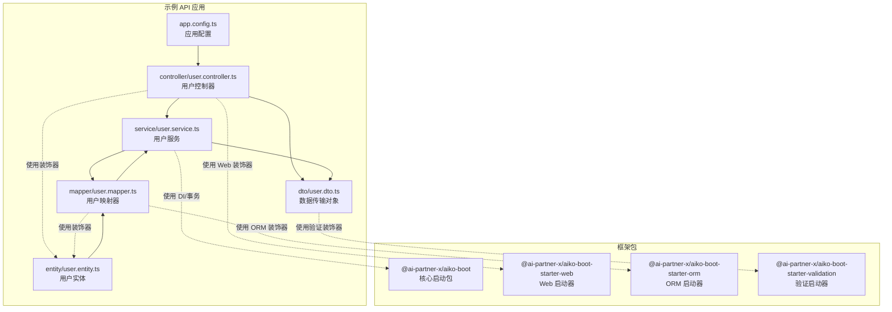
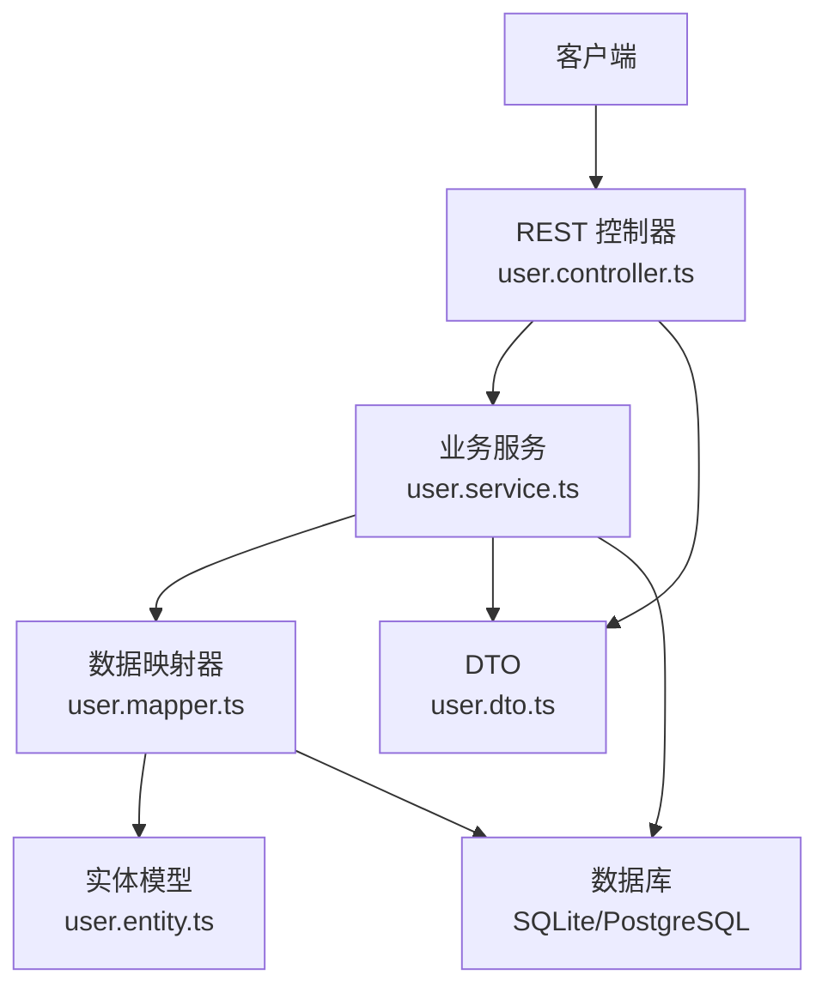
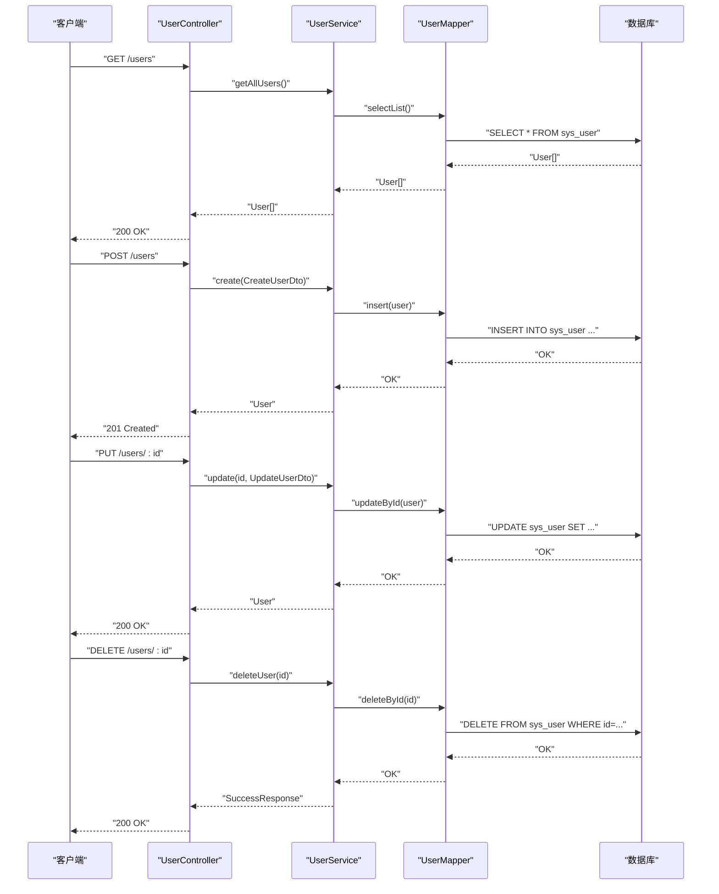
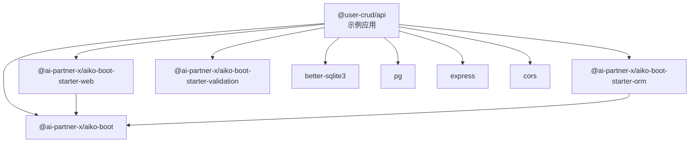

# 后端 API 开发

<cite>
**本文引用的文件**
- [README.md](file://README.md)
- [app.config.ts](file://app/examples/user-crud/packages/api/app.config.ts)
- [package.json](file://app/examples/user-crud/packages/api/package.json)
- [user.entity.ts](file://app/examples/user-crud/packages/api/src/entity/user.entity.ts)
- [user.mapper.ts](file://app/examples/user-crud/packages/api/src/mapper/user.mapper.ts)
- [user.service.ts](file://app/examples/user-crud/packages/api/src/service/user.service.ts)
- [user.controller.ts](file://app/examples/user-crud/packages/api/src/controller/user.controller.ts)
- [user.dto.ts](file://app/examples/user-crud/packages/api/src/dto/user.dto.ts)
- [aiko-boot/package.json](file://packages/aiko-boot/package.json)
- [aiko-boot-starter-web/package.json](file://packages/aiko-boot-starter-web/package.json)
- [aiko-boot-starter-orm/package.json](file://packages/aiko-boot-starter-orm/package.json)
- [aiko-boot-starter-validation/package.json](file://packages/aiko-boot-starter-validation/package.json)
</cite>

## 目录
1. [简介](#简介)
2. [项目结构](#项目结构)
3. [核心组件](#核心组件)
4. [架构总览](#架构总览)
5. [详细组件分析](#详细组件分析)
6. [依赖关系分析](#依赖关系分析)
7. [性能考虑](#性能考虑)
8. [故障排查指南](#故障排查指南)
9. [结论](#结论)
10. [附录](#附录)

## 简介
本指南面向后端 API 开发者，围绕用户管理系统的完整实现进行深入讲解。内容涵盖应用服务器创建与配置、用户实体设计与装饰器使用、基础映射器的 CRUD 操作、服务层业务逻辑封装、控制器 REST API 接口开发，以及如何使用 Aiko Boot 的装饰器系统实现数据持久化（@Entity、@TableId、@TableField 等）。文档提供从数据库表结构设计到 API 接口实现的全流程说明，并给出最佳实践与排错建议。

## 项目结构
该仓库采用 monorepo 结构，核心框架位于 packages 目录，示例项目位于 app/examples/user-crud。用户 CRUD 示例项目位于 app/examples/user-crud/packages/api，包含实体、映射器、服务、控制器、DTO 和应用配置等模块。

图表来源
- [app.config.ts](file://app/examples/user-crud/packages/api/app.config.ts#L1-L45)
- [user.entity.ts](file://app/examples/user-crud/packages/api/src/entity/user.entity.ts#L1-L23)
- [user.mapper.ts](file://app/examples/user-crud/packages/api/src/mapper/user.mapper.ts#L1-L17)
- [user.service.ts](file://app/examples/user-crud/packages/api/src/service/user.service.ts#L1-L251)
- [user.controller.ts](file://app/examples/user-crud/packages/api/src/controller/user.controller.ts#L1-L170)
- [user.dto.ts](file://app/examples/user-crud/packages/api/src/dto/user.dto.ts#L1-L105)
- [aiko-boot/package.json](file://packages/aiko-boot/package.json#L1-L61)
- [aiko-boot-starter-web/package.json](file://packages/aiko-boot-starter-web/package.json#L1-L60)
- [aiko-boot-starter-orm/package.json](file://packages/aiko-boot-starter-orm/package.json#L1-L55)
- [aiko-boot-starter-validation/package.json](file://packages/aiko-boot-starter-validation/package.json#L1-L41)

章节来源
- [README.md](file://README.md#L1-L215)
- [app.config.ts](file://app/examples/user-crud/packages/api/app.config.ts#L1-L45)
- [package.json](file://app/examples/user-crud/packages/api/package.json#L1-L47)

## 核心组件
- 应用配置：通过 app.config.ts 提供服务器端口、上下文路径、日志级别、数据库类型与连接信息等配置项，支持 SQLite 与 PostgreSQL。
- 实体层：使用 @Entity、@TableId、@TableField 等装饰器声明表结构与字段映射，定义用户实体。
- 映射器层：继承 BaseMapper 并通过 @Mapper 装饰器注册，提供基础 CRUD 与扩展查询方法。
- 服务层：封装业务逻辑，使用 @Service、@Autowired、@Transactional 等装饰器，组合映射器完成复杂操作。
- 控制器层：使用 @RestController、@GetMapping、@PostMapping、@PutMapping、@DeleteMapping 等装饰器暴露 REST API。
- DTO 层：使用 @ai-partner-x/aiko-boot-starter-validation 的装饰器进行请求参数与响应结构的校验与约束。

章节来源
- [app.config.ts](file://app/examples/user-crud/packages/api/app.config.ts#L1-L45)
- [user.entity.ts](file://app/examples/user-crud/packages/api/src/entity/user.entity.ts#L1-L23)
- [user.mapper.ts](file://app/examples/user-crud/packages/api/src/mapper/user.mapper.ts#L1-L17)
- [user.service.ts](file://app/examples/user-crud/packages/api/src/service/user.service.ts#L1-L251)
- [user.controller.ts](file://app/examples/user-crud/packages/api/src/controller/user.controller.ts#L1-L170)
- [user.dto.ts](file://app/examples/user-crud/packages/api/src/dto/user.dto.ts#L1-L105)

## 架构总览
下图展示了用户管理系统的整体架构与各层交互关系：

图表来源
- [user.controller.ts](file://app/examples/user-crud/packages/api/src/controller/user.controller.ts#L1-L170)
- [user.service.ts](file://app/examples/user-crud/packages/api/src/service/user.service.ts#L1-L251)
- [user.mapper.ts](file://app/examples/user-crud/packages/api/src/mapper/user.mapper.ts#L1-L17)
- [user.entity.ts](file://app/examples/user-crud/packages/api/src/entity/user.entity.ts#L1-L23)
- [user.dto.ts](file://app/examples/user-crud/packages/api/src/dto/user.dto.ts#L1-L105)

## 详细组件分析

### 应用服务器创建与配置
- 服务器配置：通过 app.config.ts 设置端口、上下文路径、优雅关闭策略等；数据库配置支持 sqlite 与 postgres，可通过环境变量切换。
- 启动脚本：示例应用提供 dev、init-db、build、start 等脚本，便于本地开发与部署。
- 日志配置：logging.level.root 可临时开启调试日志，便于问题定位。

章节来源
- [app.config.ts](file://app.examples/user-crud/packages/api/app.config.ts#L1-L45)
- [package.json](file://app/examples/user-crud/packages/api/package.json#L1-L47)

### 用户实体设计与装饰器使用
- 表与字段映射：使用 @Entity 指定表名，@TableId 声明主键及自增类型，@TableField 映射列名与可选字段。
- 字段设计：包含 id、username、email、age、createdAt、updatedAt 等字段，满足常见用户管理需求。
- 装饰器兼容性：与 MyBatis-Plus 风格一致，便于 Java 转换。

章节来源
- [user.entity.ts](file://app/examples/user-crud/packages/api/src/entity/user.entity.ts#L1-L23)
- [README.md](file://README.md#L83-L99)

### 基础映射器的 CRUD 操作实现
- 映射器注册：通过 @Mapper(User) 注册映射器，继承 BaseMapper 即获得通用 CRUD 能力。
- 扩展查询：UserMapper 在通用能力基础上新增按用户名与邮箱查询的方法，便于业务复用。
- 条件构造：结合 QueryWrapper 与 UpdateWrapper 实现复杂查询与批量更新/删除。

章节来源
- [user.mapper.ts](file://app/examples/user-crud/packages/api/src/mapper/user.mapper.ts#L1-L17)
- [user.service.ts](file://app/examples/user-crud/packages/api/src/service/user.service.ts#L1-L251)

### 服务层业务逻辑封装
- 事务管理：使用 @Transactional 确保业务原子性，如创建、更新、删除用户时的数据一致性。
- 复杂查询：通过 QueryWrapper 构建多条件查询（模糊匹配、范围查询、排序、分页），并统计总数。
- UpdateWrapper 示例：支持批量更新年龄、按条件更新邮箱等场景。
- 错误处理：对不存在资源抛出异常，确保接口语义清晰。

章节来源
- [user.service.ts](file://app/examples/user-crud/packages/api/src/service/user.service.ts#L1-L251)

### 控制器 REST API 接口开发
- 路由组织：@RestController({ path: '/users' }) 统一前缀，GET/POST/PUT/DELETE 对应 CRUD。
- 参数绑定：@PathVariable、@RequestBody、@RequestParam 实现路径参数、请求体与查询参数的绑定。
- 高级搜索：提供按用户名/邮箱模糊搜索、年龄范围、排序与分页的综合查询接口。
- 批量操作：支持批量更新年龄、按条件更新邮箱、按年龄范围批量删除等接口。

章节来源
- [user.controller.ts](file://app/examples/user-crud/packages/api/src/controller/user.controller.ts#L1-L170)

### 数据验证与 DTO 设计
- 请求校验：使用 @IsNotEmpty、@IsEmail、@Length、@Min、@Max、@IsInt 等装饰器对 DTO 字段进行约束。
- 响应结构：统一 SuccessResponse、UpdateResponse、DeleteResponse、UserSearchResultDto 等响应结构，提升接口一致性。
- 与服务层协作：控制器接收 DTO，服务层执行业务逻辑并返回实体或聚合结果。

章节来源
- [user.dto.ts](file://app/examples/user-crud/packages/api/src/dto/user.dto.ts#L1-L105)
- [user.controller.ts](file://app/examples/user-crud/packages/api/src/controller/user.controller.ts#L1-L170)

### 数据持久化装饰器使用详解
- @Entity：声明实体对应表，指定表名。
- @TableId：声明主键字段及主键策略（如 AUTO）。
- @TableField：声明普通字段及其列名映射，支持可选字段。
- @Mapper：注册映射器类，继承 BaseMapper 获取通用 CRUD 能力。
- 与 QueryWrapper/UpdateWrapper 协作：在服务层构建条件，实现复杂查询与更新。

章节来源
- [user.entity.ts](file://app/examples/user-crud/packages/api/src/entity/user.entity.ts#L1-L23)
- [user.mapper.ts](file://app/examples/user-crud/packages/api/src/mapper/user.mapper.ts#L1-L17)
- [README.md](file://README.md#L83-L99)

### 完整用户 CRUD 流程时序图
以下序列图展示了从控制器到数据库的完整调用链路，涵盖查询、创建、更新、删除与批量操作。

图表来源
- [user.controller.ts](file://app/examples/user-crud/packages/api/src/controller/user.controller.ts#L1-L170)
- [user.service.ts](file://app/examples/user-crud/packages/api/src/service/user.service.ts#L1-L251)
- [user.mapper.ts](file://app/examples/user-crud/packages/api/src/mapper/user.mapper.ts#L1-L17)

## 依赖关系分析
- 应用层依赖：示例 API 应用依赖 aiko-boot、aiko-boot-starter-web、aiko-boot-starter-orm、aiko-boot-starter-validation 以及 better-sqlite3、pg、express、cors 等运行时库。
- 框架包职责：aiko-boot 提供依赖注入与自动配置；aiko-boot-starter-web 提供 HTTP 装饰器与路由；aiko-boot-starter-orm 提供 ORM 装饰器与条件构造器；aiko-boot-starter-validation 提供数据验证装饰器。
- 版本与导出：各包通过 package.json 的 exports 字段提供模块入口，便于按需导入。

图表来源
- [package.json](file://app/examples/user-crud/packages/api/package.json#L1-L47)
- [aiko-boot/package.json](file://packages/aiko-boot/package.json#L1-L61)
- [aiko-boot-starter-web/package.json](file://packages/aiko-boot-starter-web/package.json#L1-L60)
- [aiko-boot-starter-orm/package.json](file://packages/aiko-boot-starter-orm/package.json#L1-L55)
- [aiko-boot-starter-validation/package.json](file://packages/aiko-boot-starter-validation/package.json#L1-L41)

章节来源
- [package.json](file://app/examples/user-crud/packages/api/package.json#L1-L47)
- [aiko-boot/package.json](file://packages/aiko-boot/package.json#L1-L61)
- [aiko-boot-starter-web/package.json](file://packages/aiko-boot-starter-web/package.json#L1-L60)
- [aiko-boot-starter-orm/package.json](file://packages/aiko-boot-starter-orm/package.json#L1-L55)
- [aiko-boot-starter-validation/package.json](file://packages/aiko-boot-starter-validation/package.json#L1-L41)

## 性能考虑
- 分页查询：服务层使用 QueryWrapper.page 实现分页，避免一次性加载大量数据。
- 条件裁剪：仅在参数存在时添加查询条件，减少不必要的数据库扫描。
- 批量操作：UpdateWrapper 与 QueryWrapper 的批量更新/删除可显著降低网络往返与事务开销。
- 索引建议：根据常用查询字段（如 username、email、age）建立索引以提升查询性能。
- 连接池与数据库选择：SQLite 适合开发测试，生产推荐 PostgreSQL 并启用连接池与读写分离。

## 故障排查指南
- 启动失败：检查 app.config.ts 中 server.port、database.type 与连接参数是否正确，确认环境变量是否存在。
- 数据库连接：若使用 PostgreSQL，请确认 host、port、user、password、database 是否配置正确。
- 装饰器未生效：确保在实体与映射器文件顶部引入 reflect-metadata，并在 tsconfig 中启用 emitDecoratorMetadata。
- 参数校验失败：检查 DTO 上的验证装饰器是否正确配置，查看控制台错误信息定位具体字段。
- 事务回滚：@Transactional 仅在服务层使用，确保异常被抛出并被捕获，避免静默失败。

章节来源
- [app.config.ts](file://app/examples/user-crud/packages/api/app.config.ts#L1-L45)
- [user.dto.ts](file://app/examples/user-crud/packages/api/src/dto/user.dto.ts#L1-L105)
- [user.service.ts](file://app/examples/user-crud/packages/api/src/service/user.service.ts#L1-L251)

## 结论
本指南基于 Aiko Boot 框架，完整演示了用户管理系统的后端实现。通过装饰器驱动的实体与映射器、服务层的业务封装与控制器的 REST 接口，开发者可以快速搭建可维护、可扩展的后端 API。配合分页、批量操作与参数校验等特性，能够满足大多数企业级用户管理场景的需求。

## 附录
- 快速开始
  - 安装依赖：在仓库根目录执行安装命令。
  - 构建所有包：执行构建脚本生成产物。
  - 运行示例 API：进入 app/examples/user-crud/packages/api，执行开发模式启动。
- Java 兼容性
  - 通过 aiko-boot-codegen 可将 TypeScript 装饰器代码一键转换为 Java Spring Boot + MyBatis-Plus 代码，便于跨团队协作与迁移。

章节来源
- [README.md](file://README.md#L35-L54)