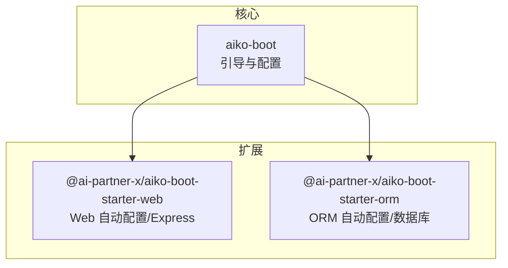
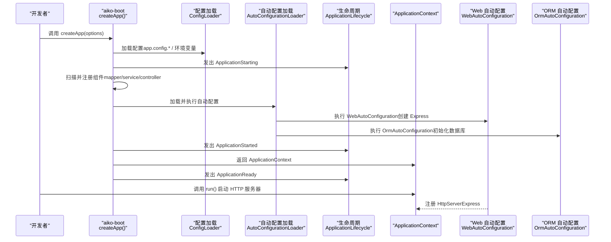
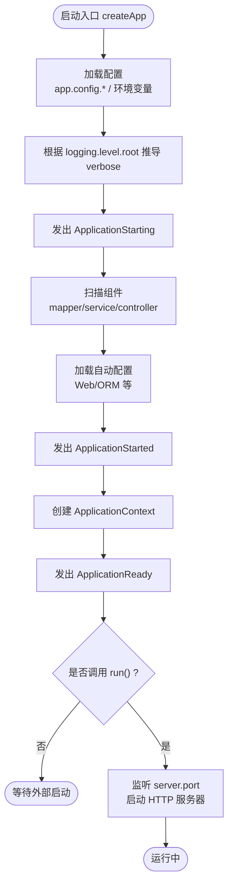
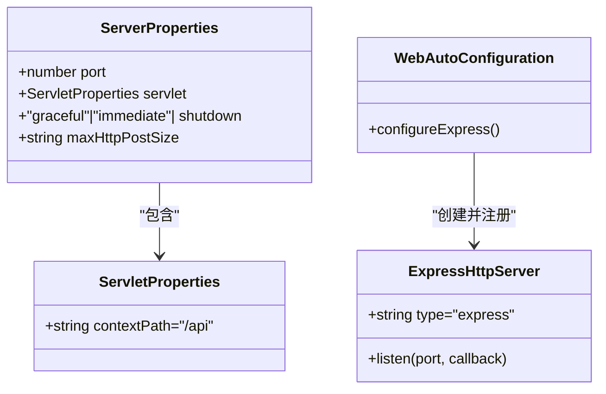
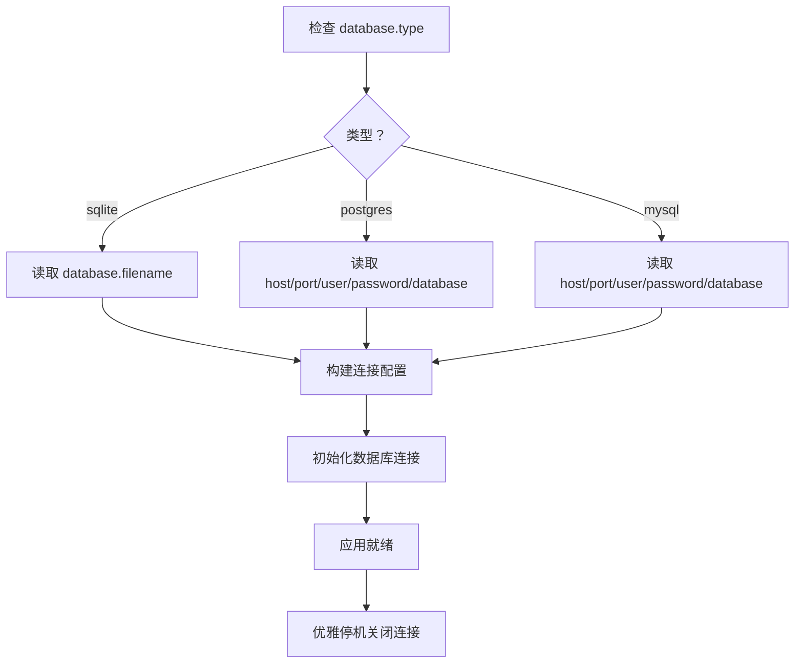
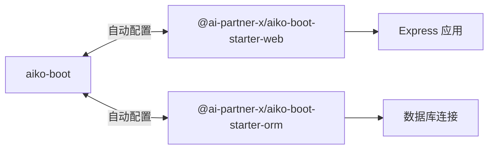

# 应用服务器配置

<cite>
**本文引用的文件**
- [packages/aiko-boot/src/index.ts](file://packages/aiko-boot/src/index.ts)
- [packages/aiko-boot/src/boot/bootstrap.ts](file://packages/aiko-boot/src/boot/bootstrap.ts)
- [packages/aiko-boot-starter-web/src/index.ts](file://packages/aiko-boot-starter-web/src/index.ts)
- [packages/aiko-boot-starter-web/src/auto-configuration.ts](file://packages/aiko-boot-starter-web/src/auto-configuration.ts)
- [packages/aiko-boot-starter-orm/src/index.ts](file://packages/aiko-boot-starter-orm/src/index.ts)
- [packages/aiko-boot-starter-orm/src/auto-configuration.ts](file://packages/aiko-boot-starter-orm/src/auto-configuration.ts)
</cite>

## 目录
1. [简介](#简介)
2. [项目结构](#项目结构)
3. [核心组件](#核心组件)
4. [架构总览](#架构总览)
5. [详细组件分析](#详细组件分析)
6. [依赖关系分析](#依赖关系分析)
7. [性能考虑](#性能考虑)
8. [故障排查指南](#故障排查指南)
9. [结论](#结论)
10. [附录：配置清单与最佳实践](#附录配置清单与最佳实践)

## 简介
本指南围绕 Aiko Boot 的 createApp() 函数，系统讲解如何以 Spring Boot 风格创建应用服务器，涵盖以下主题：
- 配置文件加载机制（支持 TypeScript、JSON、YAML 及环境变量）
- Express 服务器的自动配置与路由生成
- 应用启动流程与生命周期事件
- 运行时配置（如端口、上下文路径、优雅停机等）
- 配置项详解（server.port、server.servlet.contextPath、数据库连接等）
- 不同环境（开发、测试、生产）的配置策略与最佳实践

## 项目结构
该仓库采用多包工作区结构，核心与扩展通过包导出与自动配置协同工作：
- aiko-boot：核心引导、依赖注入、配置系统、生命周期事件
- aiko-boot-starter-web：Web 自动配置、Express 服务器、HTTP 装饰器与路由
- aiko-boot-starter-orm：ORM 自动配置、数据库连接与适配器

图表来源
- [packages/aiko-boot/src/index.ts](file://packages/aiko-boot/src/index.ts#L57-L63)
- [packages/aiko-boot-starter-web/src/index.ts](file://packages/aiko-boot-starter-web/src/index.ts#L39-L45)
- [packages/aiko-boot-starter-orm/src/index.ts](file://packages/aiko-boot-starter-orm/src/index.ts#L83-L87)

章节来源
- [packages/aiko-boot/src/index.ts](file://packages/aiko-boot/src/index.ts#L1-L64)
- [packages/aiko-boot-starter-web/src/index.ts](file://packages/aiko-boot-starter-web/src/index.ts#L1-L73)
- [packages/aiko-boot-starter-orm/src/index.ts](file://packages/aiko-boot-starter-orm/src/index.ts#L1-L91)

## 核心组件
- createApp()：应用启动入口，负责配置加载、组件扫描、自动配置、生命周期事件与 HTTP 服务器注册
- ApplicationContext：启动后返回的上下文，提供配置访问、组件集合、HTTP 服务器注册与运行控制
- HttpServer 接口：抽象的服务器扩展点，由扩展包实现（如 ExpressHttpServer）
- Web 自动配置：基于 server.* 配置自动创建 Express 应用、注册控制器路由、CORS 与请求体解析
- ORM 自动配置：基于 database.* 配置自动初始化数据库连接（SQLite/PostgreSQL/MySQL）

章节来源
- [packages/aiko-boot/src/boot/bootstrap.ts](file://packages/aiko-boot/src/boot/bootstrap.ts#L34-L67)
- [packages/aiko-boot/src/boot/bootstrap.ts](file://packages/aiko-boot/src/boot/bootstrap.ts#L132-L289)
- [packages/aiko-boot-starter-web/src/auto-configuration.ts](file://packages/aiko-boot-starter-web/src/auto-configuration.ts#L82-L90)
- [packages/aiko-boot-starter-orm/src/auto-configuration.ts](file://packages/aiko-boot-starter-orm/src/auto-configuration.ts#L61-L93)

## 架构总览
下图展示了从 createApp() 到 Web 自动配置与 ORM 自动配置的整体流程，以及配置加载与生命周期事件的交互。

图表来源
- [packages/aiko-boot/src/boot/bootstrap.ts](file://packages/aiko-boot/src/boot/bootstrap.ts#L143-L209)
- [packages/aiko-boot-starter-web/src/auto-configuration.ts](file://packages/aiko-boot-starter-web/src/auto-configuration.ts#L97-L146)
- [packages/aiko-boot-starter-orm/src/auto-configuration.ts](file://packages/aiko-boot-starter-orm/src/auto-configuration.ts#L61-L93)

## 详细组件分析

### 1) 配置加载与应用启动流程
- 配置来源优先级：app.config.ts > app.config.json > app.config.yaml > 环境变量
- 关键配置项（Spring Boot 风格）：
  - logging.level.root：日志级别，用于推导 verbose
  - server.shutdown：graceful 或 immediate，决定是否启用优雅停机
  - server.port：HTTP 服务监听端口，默认 3001
  - server.servlet.contextPath：API 路由前缀，默认 /api
  - server.maxHttpPostSize：请求体大小限制，默认 10MB
- 启动阶段：
  - ApplicationStarting → 组件扫描 → 自动配置 → ApplicationStarted → ApplicationReady
  - 若启用优雅停机，进程退出前触发清理

图表来源
- [packages/aiko-boot/src/boot/bootstrap.ts](file://packages/aiko-boot/src/boot/bootstrap.ts#L143-L289)

章节来源
- [packages/aiko-boot/src/boot/bootstrap.ts](file://packages/aiko-boot/src/boot/bootstrap.ts#L143-L289)

### 2) Express 服务器自动配置
- 自动配置类：WebAutoConfiguration
- 功能要点：
  - 读取 server.servlet.contextPath 作为路由前缀（默认 /api）
  - 读取 server.maxHttpPostSize 作为请求体大小限制（默认 10MB）
  - 默认启用 CORS
  - 收集控制器并生成路由，注册到 Express 应用
  - 注册全局异常处理器
  - 将 Express 实例封装为 HttpServer 并注册到 ApplicationContext

图表来源
- [packages/aiko-boot-starter-web/src/auto-configuration.ts](file://packages/aiko-boot-starter-web/src/auto-configuration.ts#L47-L60)
- [packages/aiko-boot-starter-web/src/auto-configuration.ts](file://packages/aiko-boot-starter-web/src/auto-configuration.ts#L82-L90)
- [packages/aiko-boot-starter-web/src/auto-configuration.ts](file://packages/aiko-boot-starter-web/src/auto-configuration.ts#L97-L146)

章节来源
- [packages/aiko-boot-starter-web/src/auto-configuration.ts](file://packages/aiko-boot-starter-web/src/auto-configuration.ts#L47-L146)

### 3) ORM 自动配置与数据库连接
- 自动配置类：OrmAutoConfiguration
- 条件触发：当配置存在 database.type 时生效
- 支持数据库类型：sqlite、postgres、mysql
- 配置项（Spring Boot 风格）：
  - database.type：必填
  - sqlite：database.filename
  - postgres/mysql：database.host、database.port、database.user、database.password、database.database
- 生命周期钩子：
  - ApplicationReady：初始化数据库连接
  - ApplicationShutdown：关闭数据库连接

图表来源
- [packages/aiko-boot-starter-orm/src/auto-configuration.ts](file://packages/aiko-boot-starter-orm/src/auto-configuration.ts#L98-L133)
- [packages/aiko-boot-starter-orm/src/auto-configuration.ts](file://packages/aiko-boot-starter-orm/src/auto-configuration.ts#L70-L93)

章节来源
- [packages/aiko-boot-starter-orm/src/auto-configuration.ts](file://packages/aiko-boot-starter-orm/src/auto-configuration.ts#L34-L133)

### 4) 配置文件结构与参数说明
- 配置文件位置与加载顺序（Spring Boot 风格）：
  - app.config.ts（推荐用于 TypeScript 开发）
  - app.config.json
  - app.config.yaml
  - 环境变量（优先级最高）
- 关键配置项（Web 侧）：
  - server.port：监听端口，默认 3001
  - server.servlet.contextPath：API 路由前缀，默认 /api
  - server.maxHttpPostSize：请求体大小限制，默认 10MB
  - server.shutdown：关闭模式，graceful 或 immediate
  - logging.level.root：日志级别，用于推导 verbose
- 关键配置项（ORM 侧）：
  - database.type：数据库类型，sqlite/postgres/mysql
  - sqlite：database.filename
  - postgres/mysql：database.host、database.port、database.user、database.password、database.database

章节来源
- [packages/aiko-boot/src/boot/bootstrap.ts](file://packages/aiko-boot/src/boot/bootstrap.ts#L149-L155)
- [packages/aiko-boot-starter-web/src/auto-configuration.ts](file://packages/aiko-boot-starter-web/src/auto-configuration.ts#L47-L60)
- [packages/aiko-boot-starter-orm/src/auto-configuration.ts](file://packages/aiko-boot-starter-orm/src/auto-configuration.ts#L34-L54)

### 5) 运行时配置与 HTTP 服务器控制
- ApplicationContext 提供：
  - registerHttpServer()/getHttpServer()：注册与获取 HTTP 服务器
  - run(port?)：启动 HTTP 服务器，优先使用传入端口，否则读取 server.port
- 优雅停机：
  - 通过 server.shutdown=graceful 启用；进程信号到达时触发清理逻辑

章节来源
- [packages/aiko-boot/src/boot/bootstrap.ts](file://packages/aiko-boot/src/boot/bootstrap.ts#L219-L271)
- [packages/aiko-boot/src/boot/bootstrap.ts](file://packages/aiko-boot/src/boot/bootstrap.ts#L211-L214)

## 依赖关系分析
- aiko-boot 为核心，提供引导、配置、生命周期与 DI 能力
- aiko-boot-starter-web 依赖 aiko-boot，并在启动时自动创建 Express 服务器
- aiko-boot-starter-orm 依赖 aiko-boot，并在检测到数据库配置时自动初始化连接
- 三者通过自动配置机制解耦，可按需引入

图表来源
- [packages/aiko-boot/src/index.ts](file://packages/aiko-boot/src/index.ts#L57-L63)
- [packages/aiko-boot-starter-web/src/index.ts](file://packages/aiko-boot-starter-web/src/index.ts#L39-L45)
- [packages/aiko-boot-starter-orm/src/index.ts](file://packages/aiko-boot-starter-orm/src/index.ts#L83-L87)

章节来源
- [packages/aiko-boot/src/index.ts](file://packages/aiko-boot/src/index.ts#L57-L63)
- [packages/aiko-boot-starter-web/src/index.ts](file://packages/aiko-boot-starter-web/src/index.ts#L39-L72)
- [packages/aiko-boot-starter-orm/src/index.ts](file://packages/aiko-boot-starter-orm/src/index.ts#L83-L90)

## 性能考虑
- 启动阶段：
  - 组件扫描仅在指定目录进行，避免不必要的文件系统遍历
  - 自动配置按顺序执行，可通过排除列表减少加载项
- Web 层：
  - 默认启用 CORS 与 JSON 解析，可根据实际需求裁剪中间件
  - 路由前缀 contextPath 有助于多版本 API 并存
- ORM 层：
  - 数据库连接在应用启动时建立，建议在生产环境配置合适的连接池参数（如扩展包提供）
  - 优雅停机确保在关闭前完成未决事务或释放资源

## 故障排查指南
- 未找到控制器：
  - 现象：控制台警告“未找到控制器”
  - 排查：确认控制器位于 controller 目录且被正确导出
- 未注册 HTTP 服务器：
  - 现象：调用 run() 时提示未注册服务器
  - 排查：确保引入并安装了 aiko-boot-starter-web
- 数据库连接失败：
  - 现象：初始化数据库时报错
  - 排查：核对 database.type 与对应字段（sqlite.filename 或 postgres/mysql 的 host/port/user/database）
- 端口占用：
  - 现象：run() 启动失败
  - 排查：修改 server.port 或释放占用端口

章节来源
- [packages/aiko-boot-starter-web/src/auto-configuration.ts](file://packages/aiko-boot-starter-web/src/auto-configuration.ts#L136-L138)
- [packages/aiko-boot/src/boot/bootstrap.ts](file://packages/aiko-boot/src/boot/bootstrap.ts#L238-L242)
- [packages/aiko-boot-starter-orm/src/auto-configuration.ts](file://packages/aiko-boot-starter-orm/src/auto-configuration.ts#L70-L76)

## 结论
通过 createApp() 与自动配置机制，Aiko Boot 提供了与 Spring Boot 风格一致的应用服务器搭建体验。结合 Web 与 ORM 扩展，开发者可以快速完成从配置到运行的全链路落地。建议在不同环境中遵循“配置分层、最小化依赖、明确生命周期”的原则，以获得更稳定与可维护的服务。

## 附录：配置清单与最佳实践

- 开发环境（本地调试）
  - 配置建议：
    - server.port：3001
    - server.servlet.contextPath：/api
    - server.maxHttpPostSize：10mb
    - server.shutdown：graceful
    - logging.level.root：debug
  - 最佳实践：
    - 使用 app.config.ts 管理本地配置
    - 控制器放置于 controller 目录，便于自动扫描
    - 本地数据库可选 sqlite，便于快速迭代

- 测试环境（CI/CD）
  - 配置建议：
    - server.port：随机或容器分配端口
    - server.servlet.contextPath：/api
    - server.shutdown：graceful
    - logging.level.root：warn
  - 最佳实践：
    - 使用环境变量覆盖关键配置
    - 数据库使用内存或临时数据库，缩短测试周期

- 生产环境（线上部署）
  - 配置建议：
    - server.port：80 或 443（经反向代理转发）
    - server.servlet.contextPath：/api
    - server.maxHttpPostSize：按业务需求调整
    - server.shutdown：graceful
    - logging.level.root：error 或 info
  - 最佳实践：
    - 使用只读配置文件，敏感信息通过环境变量注入
    - 数据库使用高可用连接池与监控
    - 结合容器编排与健康检查

章节来源
- [packages/aiko-boot/src/boot/bootstrap.ts](file://packages/aiko-boot/src/boot/bootstrap.ts#L149-L155)
- [packages/aiko-boot-starter-web/src/auto-configuration.ts](file://packages/aiko-boot-starter-web/src/auto-configuration.ts#L47-L60)
- [packages/aiko-boot-starter-orm/src/auto-configuration.ts](file://packages/aiko-boot-starter-orm/src/auto-configuration.ts#L34-L54)