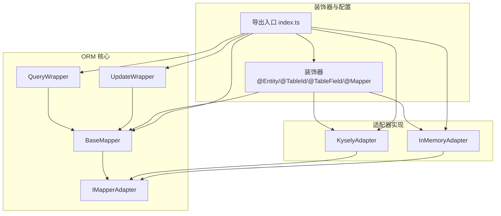
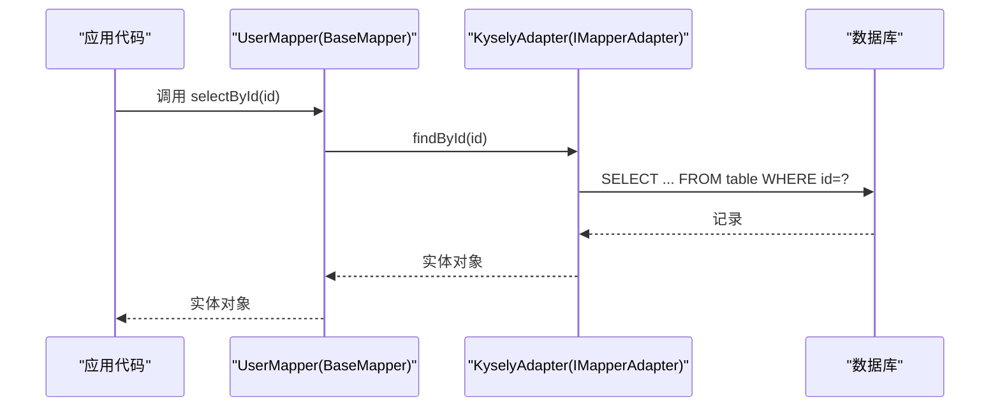
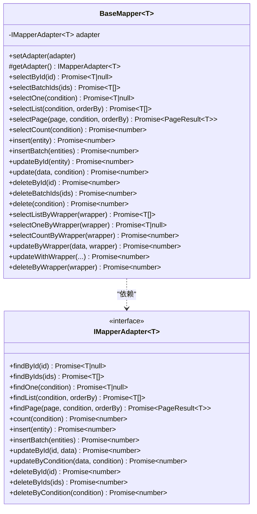
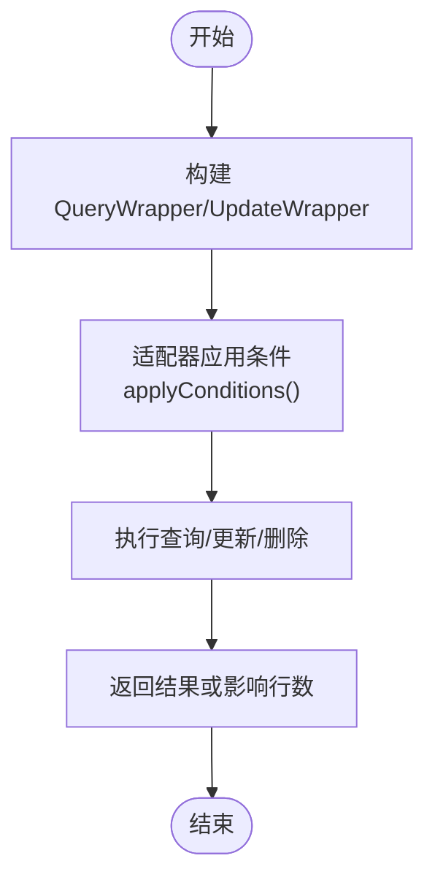
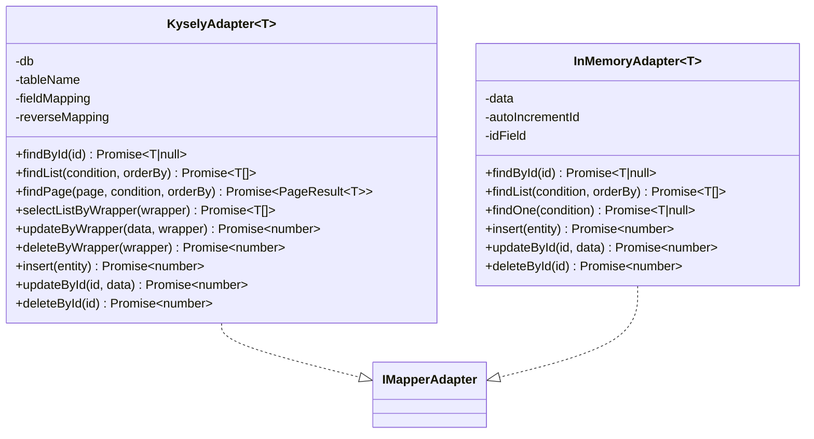
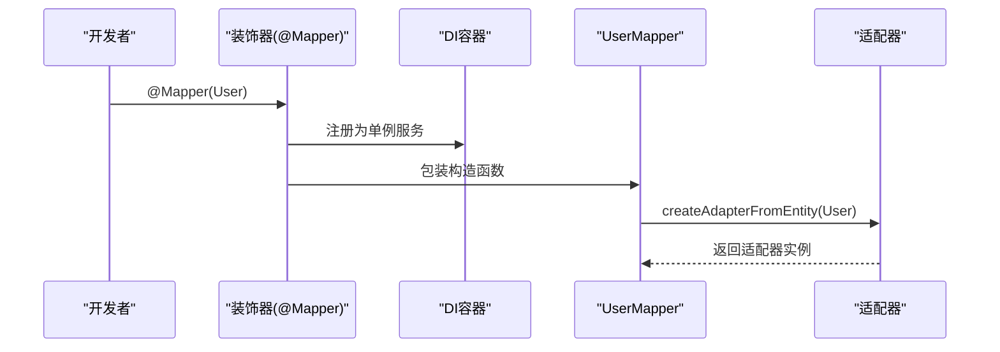
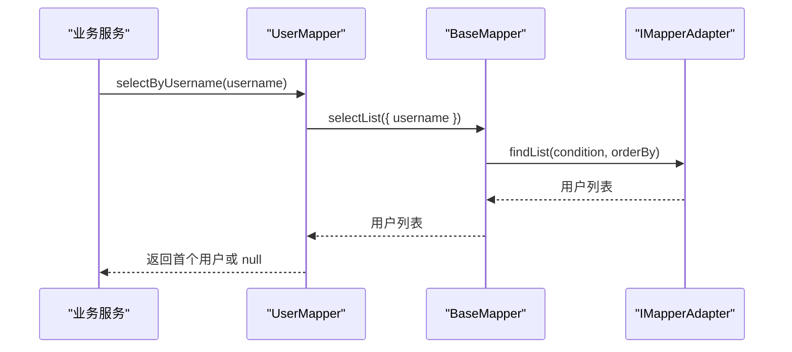
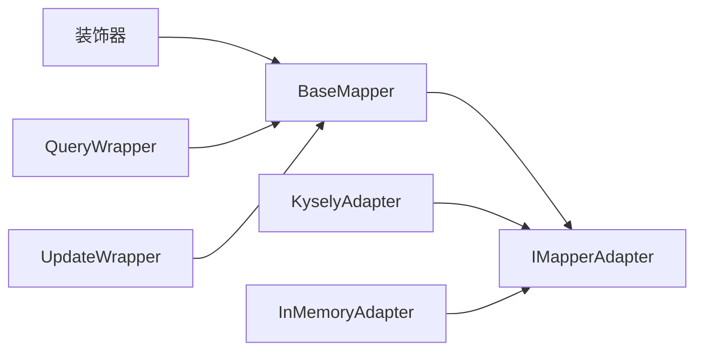

# 数据访问层实现

<cite>
**本文档引用的文件**
- [base-mapper.ts](file://packages/aiko-boot-starter-orm/src/base-mapper.ts)
- [wrapper.ts](file://packages/aiko-boot-starter-orm/src/wrapper.ts)
- [decorators.ts](file://packages/aiko-boot-starter-orm/src/decorators.ts)
- [kysely-adapter.ts](file://packages/aiko-boot-starter-orm/src/adapters/kysely-adapter.ts)
- [in-memory-adapter.ts](file://packages/aiko-boot-starter-orm/src/adapters/in-memory-adapter.ts)
- [index.ts](file://packages/aiko-boot-starter-orm/src/index.ts)
- [user-crud.ts](file://packages/aiko-boot-starter-orm/examples/user-crud.ts)
- [user.mapper.ts](file://app/examples/user-crud/packages/api/src/mapper/user.mapper.ts)
</cite>

## 目录
1. [简介](#简介)
2. [项目结构](#项目结构)
3. [核心组件](#核心组件)
4. [架构总览](#架构总览)
5. [详细组件分析](#详细组件分析)
6. [依赖关系分析](#依赖关系分析)
7. [性能考虑](#性能考虑)
8. [故障排除指南](#故障排除指南)
9. [结论](#结论)

## 简介
本指南面向希望在本项目中实现数据访问层的开发者，重点围绕 BaseMapper 泛型映射器、MyBatis-Plus 风格的 CRUD 操作、条件查询与分页查询、以及如何通过装饰器与适配器扩展 Mapper 接口。文档将从设计模式、接口定义、实现策略出发，逐步讲解如何基于现有基础设施快速实现用户数据的完整 CRUD，并提供性能优化与错误处理建议。

## 项目结构
本项目的数据访问层主要位于 `packages/aiko-boot-starter-orm` 包内，核心文件包括：
- base-mapper.ts：提供 MyBatis-Plus 风格的 BaseMapper 抽象类与 IMapperAdapter 接口
- wrapper.ts：提供 QueryWrapper/UpdateWrapper 条件构造器
- adapters/*：适配器实现，如 KyselyAdapter、InMemoryAdapter
- decorators.ts：实体与 Mapper 装饰器，支持依赖注入与自动适配器装配
- index.ts：对外导出入口

图表来源
- [base-mapper.ts](file://packages/aiko-boot-starter-orm/src/base-mapper.ts#L39-L383)
- [wrapper.ts](file://packages/aiko-boot-starter-orm/src/wrapper.ts#L49-L476)
- [kysely-adapter.ts](file://packages/aiko-boot-starter-orm/src/adapters/kysely-adapter.ts#L24-L419)
- [in-memory-adapter.ts](file://packages/aiko-boot-starter-orm/src/adapters/in-memory-adapter.ts#L9-L45)
- [decorators.ts](file://packages/aiko-boot-starter-orm/src/decorators.ts#L140-L193)
- [index.ts](file://packages/aiko-boot-starter-orm/src/index.ts#L14-L91)

章节来源
- [index.ts](file://packages/aiko-boot-starter-orm/src/index.ts#L1-L91)

## 核心组件
- BaseMapper<T>：提供标准 CRUD 与分页查询能力，内部通过 IMapperAdapter<T> 执行具体数据库操作
- IMapperAdapter<T>：适配器接口，定义 findById/findList/findPage/count 等方法
- QueryWrapper<T>/UpdateWrapper<T>：MyBatis-Plus 风格的条件构造器，支持链式调用与复杂查询
- KyselyAdapter<T>：基于 Kysely 的数据库适配器，支持 PostgreSQL/SQLite/MySQL
- InMemoryAdapter<T>：内存适配器，便于测试与开发
- 装饰器：@Entity/@TableId/@TableField/@Mapper，配合依赖注入与自动适配器装配

章节来源
- [base-mapper.ts](file://packages/aiko-boot-starter-orm/src/base-mapper.ts#L55-L383)
- [wrapper.ts](file://packages/aiko-boot-starter-orm/src/wrapper.ts#L49-L476)
- [kysely-adapter.ts](file://packages/aiko-boot-starter-orm/src/adapters/kysely-adapter.ts#L24-L419)
- [in-memory-adapter.ts](file://packages/aiko-boot-starter-orm/src/adapters/in-memory-adapter.ts#L9-L45)
- [decorators.ts](file://packages/aiko-boot-starter-orm/src/decorators.ts#L68-L193)

## 架构总览
下图展示了数据访问层的整体架构：应用通过装饰器声明实体与 Mapper，运行时由装饰器自动装配适配器；BaseMapper 统一暴露 CRUD 与查询方法，适配器负责将抽象操作转换为具体数据库操作。

图表来源
- [base-mapper.ts](file://packages/aiko-boot-starter-orm/src/base-mapper.ts#L82-L84)
- [kysely-adapter.ts](file://packages/aiko-boot-starter-orm/src/adapters/kysely-adapter.ts#L69-L77)

## 详细组件分析

### BaseMapper 设计与实现
- 设计模式：模板方法 + 适配器模式。BaseMapper 定义统一接口，具体数据库操作委托给 IMapperAdapter 实现
- 泛型映射器：通过 T 约束 id 字段，确保 ID 相关操作的类型安全
- CRUD 与分页：提供 selectById/selectBatchIds/selectList/selectPage/selectCount 等常用方法
- 条件查询：支持 QueryWrapper/UpdateWrapper，回退机制保证向后兼容

图表来源
- [base-mapper.ts](file://packages/aiko-boot-starter-orm/src/base-mapper.ts#L55-L383)

章节来源
- [base-mapper.ts](file://packages/aiko-boot-starter-orm/src/base-mapper.ts#L55-L383)

### 条件构造器：QueryWrapper 与 UpdateWrapper
- QueryWrapper<T>：提供 eq/ne/gt/ge/lt/le/like/notLike/between/in/isNull/isNotNull/or/and/orderBy/limit/offset/page/select/groupBy 等链式 API
- UpdateWrapper<T>：在 QueryWrapper 基础上增加 set/setIf/setIncr/setDecr/setNull 等更新字段设置
- 适配器支持：KyselyAdapter 实现了 selectListByWrapper/selectOneByWrapper/selectCountByWrapper/updateByWrapper/deleteByWrapper 等方法

图表来源
- [wrapper.ts](file://packages/aiko-boot-starter-orm/src/wrapper.ts#L49-L350)
- [kysely-adapter.ts](file://packages/aiko-boot-starter-orm/src/adapters/kysely-adapter.ts#L177-L244)

章节来源
- [wrapper.ts](file://packages/aiko-boot-starter-orm/src/wrapper.ts#L49-L476)
- [kysely-adapter.ts](file://packages/aiko-boot-starter-orm/src/adapters/kysely-adapter.ts#L177-L244)

### 适配器实现：KyselyAdapter 与 InMemoryAdapter
- KyselyAdapter<T>：将 QueryWrapper 条件转换为 Kysely 查询，支持字段映射、分页、排序、批量插入等
- InMemoryAdapter<T>：内存存储，适合测试与本地开发，提供基础 CRUD 与排序能力

图表来源
- [kysely-adapter.ts](file://packages/aiko-boot-starter-orm/src/adapters/kysely-adapter.ts#L24-L419)
- [in-memory-adapter.ts](file://packages/aiko-boot-starter-orm/src/adapters/in-memory-adapter.ts#L9-L45)

章节来源
- [kysely-adapter.ts](file://packages/aiko-boot-starter-orm/src/adapters/kysely-adapter.ts#L24-L419)
- [in-memory-adapter.ts](file://packages/aiko-boot-starter-orm/src/adapters/in-memory-adapter.ts#L9-L45)

### 装饰器与依赖注入：@Mapper 自动装配
- @Mapper 装饰器：标记 Mapper 类，自动注册到 DI 容器，自动注入依赖，必要时自动设置适配器
- 运行时泛型填充：通过 TypeScript Transformer 在构建时将 @Mapper() + extends BaseMapper<User> 转换为 @Mapper(User) + extends BaseMapper<User>

图表来源
- [decorators.ts](file://packages/aiko-boot-starter-orm/src/decorators.ts#L140-L193)
- [index.ts](file://packages/aiko-boot-starter-orm/src/index.ts#L14-L20)

章节来源
- [decorators.ts](file://packages/aiko-boot-starter-orm/src/decorators.ts#L140-L193)
- [index.ts](file://packages/aiko-boot-starter-orm/src/index.ts#L14-L20)

### 扩展 Mapper：自定义查询方法
- 在现有 BaseMapper 基础上扩展：例如按用户名或邮箱查询用户
- 示例：UserMapper 扩展 selectByUsername/selectByEmail 方法，内部复用 selectList 并取首条结果

图表来源
- [user.mapper.ts](file://app/examples/user-crud/packages/api/src/mapper/user.mapper.ts#L7-L15)
- [base-mapper.ts](file://packages/aiko-boot-starter-orm/src/base-mapper.ts#L109-L111)

章节来源
- [user.mapper.ts](file://app/examples/user-crud/packages/api/src/mapper/user.mapper.ts#L1-L16)
- [base-mapper.ts](file://packages/aiko-boot-starter-orm/src/base-mapper.ts#L109-L111)

## 依赖关系分析
- BaseMapper 依赖 IMapperAdapter 接口，解耦具体数据库实现
- 装饰器依赖 DI 容器与适配器工厂，实现自动装配
- Wrapper 与适配器协作，将链式条件转换为具体查询

图表来源
- [base-mapper.ts](file://packages/aiko-boot-starter-orm/src/base-mapper.ts#L55-L383)
- [wrapper.ts](file://packages/aiko-boot-starter-orm/src/wrapper.ts#L49-L476)
- [kysely-adapter.ts](file://packages/aiko-boot-starter-orm/src/adapters/kysely-adapter.ts#L24-L419)
- [in-memory-adapter.ts](file://packages/aiko-boot-starter-orm/src/adapters/in-memory-adapter.ts#L9-L45)
- [decorators.ts](file://packages/aiko-boot-starter-orm/src/decorators.ts#L140-L193)

章节来源
- [base-mapper.ts](file://packages/aiko-boot-starter-orm/src/base-mapper.ts#L55-L383)
- [wrapper.ts](file://packages/aiko-boot-starter-orm/src/wrapper.ts#L49-L476)
- [kysely-adapter.ts](file://packages/aiko-boot-starter-orm/src/adapters/kysely-adapter.ts#L24-L419)
- [in-memory-adapter.ts](file://packages/aiko-boot-starter-orm/src/adapters/in-memory-adapter.ts#L9-L45)
- [decorators.ts](file://packages/aiko-boot-starter-orm/src/decorators.ts#L140-L193)

## 性能考虑
- 分页查询：优先使用 selectPage 或 QueryWrapper.page，避免一次性加载大量数据
- 条件过滤：尽量在数据库侧完成过滤与排序，减少网络传输与前端处理
- 字段映射：KyselyAdapter 支持字段映射，避免不必要的列选择，提升查询效率
- 批量操作：使用 insertBatch 与 deleteByIds 减少往返次数
- 缓存策略：结合业务场景在服务层引入缓存，降低重复查询压力
- 索引设计：确保常用查询字段建立合适索引，配合条件构造器高效筛选

## 故障排除指南
- 适配器未设置：若直接实例化 Mapper 未设置适配器，会抛出适配器未设置错误。可通过 @Mapper 装饰器自动装配或手动 setAdapter
- 适配器不支持 Wrapper：当使用 selectListByWrapper/selectOneByWrapper 等方法时，若适配器未实现对应方法，BaseMapper 会回退或抛错。请确认适配器实现
- 查询结果为空：检查条件是否正确，Wrapper 条件是否匹配数据库字段名；必要时开启日志定位问题
- 分页异常：确认 page 参数合法，适配器实现是否正确计算 total 与 totalPages

章节来源
- [base-mapper.ts](file://packages/aiko-boot-starter-orm/src/base-mapper.ts#L68-L72)
- [base-mapper.ts](file://packages/aiko-boot-starter-orm/src/base-mapper.ts#L222-L230)
- [kysely-adapter.ts](file://packages/aiko-boot-starter-orm/src/adapters/kysely-adapter.ts#L177-L244)

## 结论
通过 BaseMapper 泛型映射器与装饰器体系，本项目实现了与 MyBatis-Plus 风格一致的数据访问层抽象。借助适配器模式，可在不改变上层代码的情况下切换数据库实现；通过条件构造器，可灵活表达复杂查询。建议在实际项目中遵循分页优先、条件下沉、批量操作与缓存策略，以获得更优的性能与可维护性。