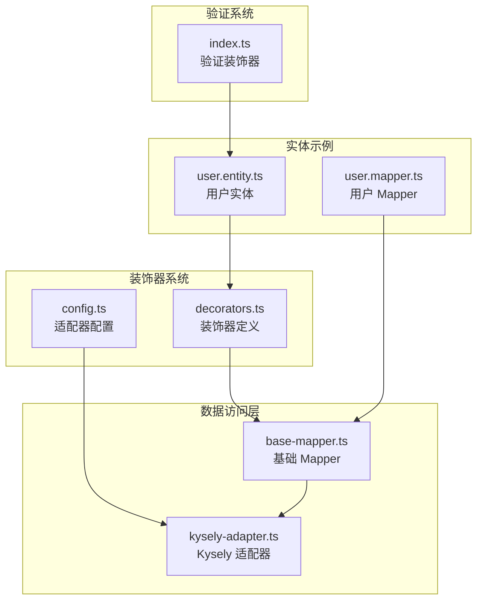
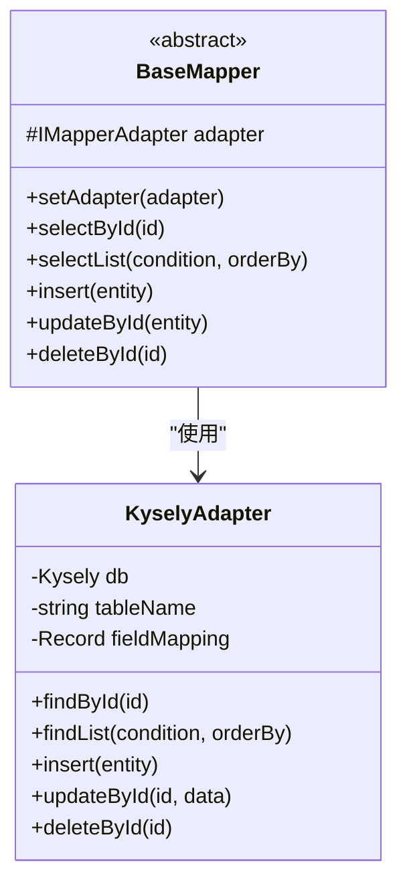
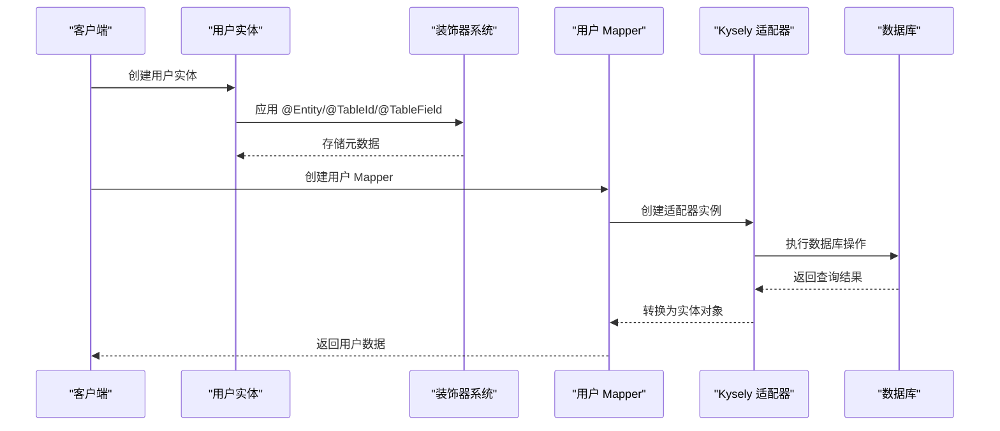
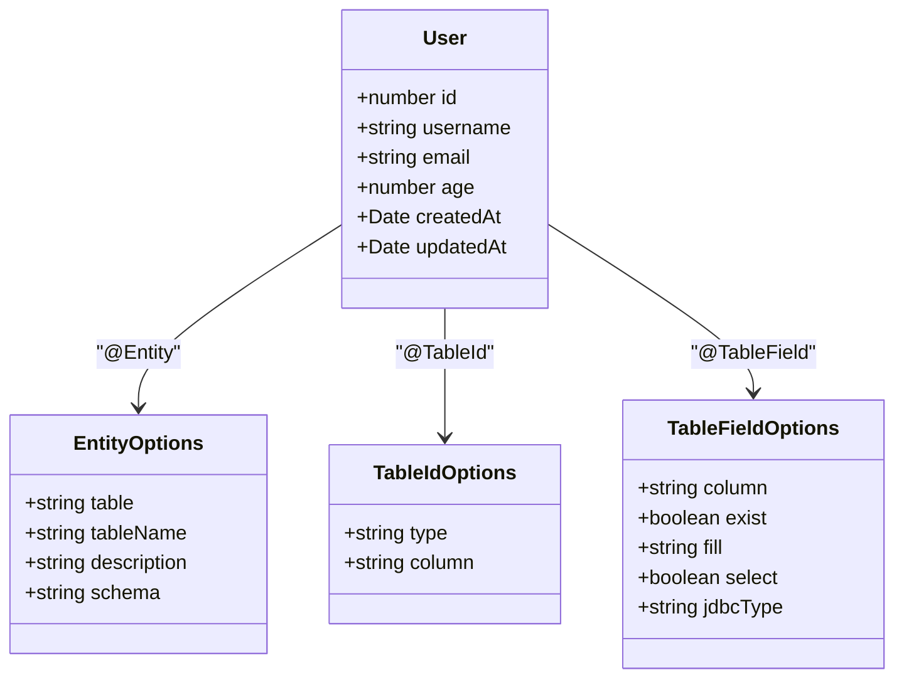
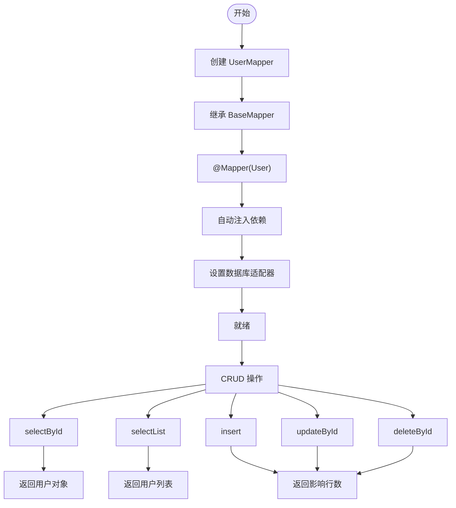
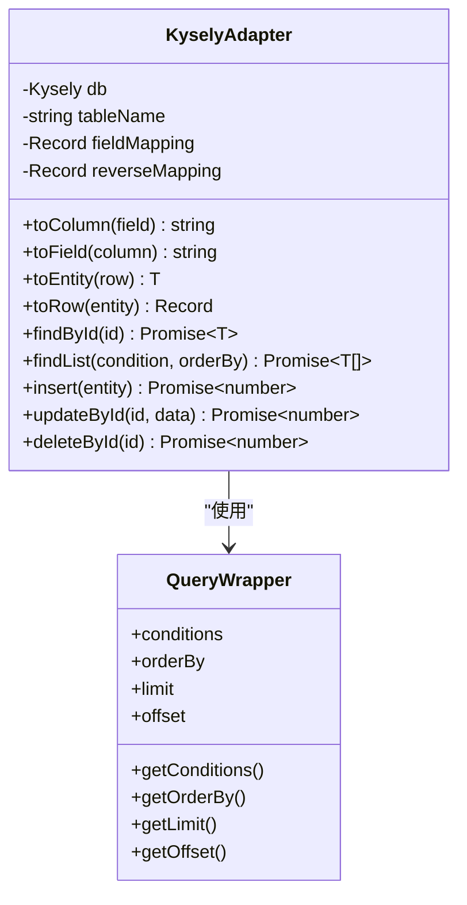
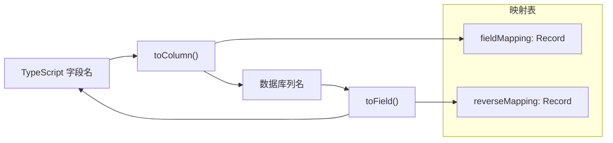
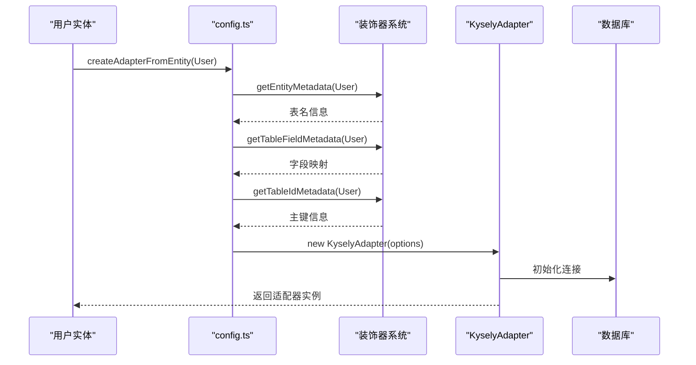

# 用户实体设计

<cite>
**本文档引用的文件**
- [decorators.ts](file://packages/aiko-boot-starter-orm/src/decorators.ts)
- [base-mapper.ts](file://packages/aiko-boot-starter-orm/src/base-mapper.ts)
- [kysely-adapter.ts](file://packages/aiko-boot-starter-orm/src/adapters/kysely-adapter.ts)
- [config.ts](file://packages/aiko-boot-starter-orm/src/config.ts)
- [user.entity.ts](file://app/examples/user-crud/packages/api/src/entity/user.entity.ts)
- [user.mapper.ts](file://app/examples/user-crud/packages/api/src/mapper/user.mapper.ts)
- [index.ts](file://packages/aiko-boot-starter-validation/src/index.ts)
</cite>

## 目录
1. [简介](#简介)
2. [项目结构](#项目结构)
3. [核心组件](#核心组件)
4. [架构概览](#架构概览)
5. [详细组件分析](#详细组件分析)
6. [依赖关系分析](#依赖关系分析)
7. [性能考虑](#性能考虑)
8. [故障排除指南](#故障排除指南)
9. [结论](#结论)

## 简介

本指南专注于使用 Aiko Boot 的装饰器系统设计用户实体的完整实现方案。Aiko Boot 提供了一套基于装饰器的 ORM 解决方案，支持与 MyBatis-Plus 风格兼容的实体映射和数据访问模式。本文将深入解释如何使用 @Entity、@TableId、@TableField 等装饰器来设计用户实体，包括主键标识、字段映射、数据类型处理和约束验证等方面。

## 项目结构

Aiko Boot 的用户实体设计涉及多个关键模块的协作：



**图表来源**
- [decorators.ts](file://packages/aiko-boot-starter-orm/src/decorators.ts#L1-L224)
- [base-mapper.ts](file://packages/aiko-boot-starter-orm/src/base-mapper.ts#L1-L384)
- [kysely-adapter.ts](file://packages/aiko-boot-starter-orm/src/adapters/kysely-adapter.ts#L1-L420)

**章节来源**
- [decorators.ts](file://packages/aiko-boot-starter-orm/src/decorators.ts#L1-L224)
- [base-mapper.ts](file://packages/aiko-boot-starter-orm/src/base-mapper.ts#L1-L384)

## 核心组件

### 装饰器系统

Aiko Boot 的装饰器系统提供了与 MyBatis-Plus 风格兼容的实体映射能力：

#### @Entity 装饰器
- **功能**：标记实体类并配置表名
- **参数**：支持自定义表名、描述、Schema 等选项
- **默认行为**：未指定表名时使用类名小写加 's'

#### @TableId 装饰器
- **功能**：标记主键字段
- **主键类型**：支持 AUTO、INPUT、ASSIGN_ID、ASSIGN_UUID
- **列名映射**：可自定义数据库列名

#### @TableField 装饰器
- **功能**：标记普通字段
- **字段选项**：列名、存在性、填充策略、选择性、JDBC 类型
- **默认行为**：列名默认与属性名相同

**章节来源**
- [decorators.ts](file://packages/aiko-boot-starter-orm/src/decorators.ts#L68-L123)

### 数据访问层

#### BaseMapper 抽象类
提供完整的 CRUD 操作接口，类似于 MyBatis-Plus 的 BaseMapper：



**图表来源**
- [base-mapper.ts](file://packages/aiko-boot-starter-orm/src/base-mapper.ts#L55-L384)
- [kysely-adapter.ts](file://packages/aiko-boot-starter-orm/src/adapters/kysely-adapter.ts#L24-L420)

**章节来源**
- [base-mapper.ts](file://packages/aiko-boot-starter-orm/src/base-mapper.ts#L55-L384)

## 架构概览

Aiko Boot 的用户实体设计采用分层架构，实现了装饰器驱动的 ORM 映射：



**图表来源**
- [decorators.ts](file://packages/aiko-boot-starter-orm/src/decorators.ts#L68-L193)
- [config.ts](file://packages/aiko-boot-starter-orm/src/config.ts#L42-L76)
- [kysely-adapter.ts](file://packages/aiko-boot-starter-orm/src/adapters/kysely-adapter.ts#L69-L170)

## 详细组件分析

### 用户实体设计

#### 基础用户实体实现

基于示例项目中的用户实体，以下是完整的用户实体设计：



**图表来源**
- [user.entity.ts](file://app/examples/user-crud/packages/api/src/entity/user.entity.ts#L3-L22)

#### 字段映射策略

| TypeScript 字段 | 数据库列名 | 装饰器配置 | 数据类型 | 约束 |
|----------------|------------|------------|----------|------|
| id | id | @TableId({ type: 'AUTO' }) | number | 主键，自增 |
| username | user_name | @TableField({ column: 'user_name' }) | string | 非空，长度限制 |
| email | email | @TableField() | string | 邮箱格式 |
| age | age | @TableField() | number | 数值范围 |
| createdAt | created_at | @TableField({ column: 'created_at' }) | Date | 时间戳 |
| updatedAt | updated_at | @TableField({ column: 'updated_at' }) | Date | 时间戳 |

**章节来源**
- [user.entity.ts](file://app/examples/user-crud/packages/api/src/entity/user.entity.ts#L1-L22)

### 装饰器配置详解

#### @Entity 装饰器配置

```typescript
@Entity({ 
  tableName: 'sys_user',
  description: '系统用户表'
})
```

- **tableName**：指定数据库表名
- **description**：实体描述信息
- **schema**：数据库 Schema（可选）

#### @TableId 主键配置

```typescript
@TableId({ 
  type: 'AUTO',
  column: 'id'
})
```

主键类型支持：
- **AUTO**：数据库自增主键
- **INPUT**：手动输入主键
- **ASSIGN_ID**：框架分配 ID
- **ASSIGN_UUID**：UUID 主键

#### @TableField 字段配置

```typescript
@TableField({ 
  column: 'user_name',
  exist: true,
  fill: 'INSERT',
  select: true,
  jdbcType: 'VARCHAR'
})
```

字段选项说明：
- **column**：数据库列名映射
- **exist**：字段是否存在数据库中
- **fill**：字段填充策略（INSERT/UPDATE/INSERT_UPDATE）
- **select**：是否参与查询选择
- **jdbcType**：JDBC 类型映射

**章节来源**
- [decorators.ts](file://packages/aiko-boot-starter-orm/src/decorators.ts#L24-L61)

### 数据访问层实现

#### 用户 Mapper 设计



**图表来源**
- [user.mapper.ts](file://app/examples/user-crud/packages/api/src/mapper/user.mapper.ts#L5-L16)

#### 自定义查询方法

用户 Mapper 可以扩展自定义查询方法：

```typescript
export class UserMapper extends BaseMapper<User> {
  async selectByUsername(username: string): Promise<User | null> {
    const users = await this.selectList({ username });
    return users.length > 0 ? users[0] : null;
  }

  async selectByEmail(email: string): Promise<User | null> {
    const users = await this.selectList({ email });
    return users.length > 0 ? users[0] : null;
  }
}
```

**章节来源**
- [user.mapper.ts](file://app/examples/user-crud/packages/api/src/mapper/user.mapper.ts#L1-L16)

### 数据库适配器

#### KyselyAdapter 实现

KyselyAdapter 提供了完整的数据库操作实现：



**图表来源**
- [kysely-adapter.ts](file://packages/aiko-boot-starter-orm/src/adapters/kysely-adapter.ts#L24-L420)

#### 字段映射机制

KyselyAdapter 实现了双向字段映射：



**图表来源**
- [kysely-adapter.ts](file://packages/aiko-boot-starter-orm/src/adapters/kysely-adapter.ts#L41-L65)

**章节来源**
- [kysely-adapter.ts](file://packages/aiko-boot-starter-orm/src/adapters/kysely-adapter.ts#L24-L420)

## 依赖关系分析

### 装饰器依赖链

```mermaid
graph TD
A[用户实体] --> B[@Entity 装饰器]
A --> C[@TableId 装饰器]
A --> D[@TableField 装饰器]
B --> E[EntityOptions]
C --> F[TableIdOptions]
D --> G[TableFieldOptions]
H[BaseMapper] --> I[KyselyAdapter]
J[Mapper 装饰器] --> H
K[config.ts] --> L[createAdapterFromEntity]
L --> I
M[用户 Mapper] --> J
M --> H
```

**图表来源**
- [decorators.ts](file://packages/aiko-boot-starter-orm/src/decorators.ts#L68-L193)
- [config.ts](file://packages/aiko-boot-starter-orm/src/config.ts#L42-L76)

### 适配器创建流程



**图表来源**
- [config.ts](file://packages/aiko-boot-starter-orm/src/config.ts#L42-L76)
- [decorators.ts](file://packages/aiko-boot-starter-orm/src/decorators.ts#L200-L223)

**章节来源**
- [config.ts](file://packages/aiko-boot-starter-orm/src/config.ts#L1-L77)

## 性能考虑

### 查询优化策略

1. **索引设计**：为主键和常用查询字段建立索引
2. **批量操作**：使用批量插入和更新减少数据库往返
3. **分页查询**：合理设置分页大小避免大数据集加载
4. **字段选择**：利用 select 选项控制查询字段数量

### 内存管理

- **适配器复用**：避免频繁创建适配器实例
- **连接池**：合理配置数据库连接池参数
- **实体缓存**：对于频繁访问的实体考虑缓存策略

## 故障排除指南

### 常见问题及解决方案

#### 装饰器元数据丢失

**问题**：装饰器元数据在某些环境下无法正确读取

**解决方案**：
1. 确保导入 `reflect-metadata`
2. 在文件顶部添加 `import 'reflect-metadata';`
3. 检查 TypeScript 编译配置中的 `emitDecoratorMetadata`

#### 数据库适配器未初始化

**问题**：提示数据库未初始化

**解决方案**：
1. 确保先调用 `createKyselyDatabase()` 初始化数据库
2. 检查数据库连接配置
3. 确认适配器创建时机

#### 字段映射错误

**问题**：TypeScript 字段与数据库列名不匹配

**解决方案**：
1. 使用 @TableField 的 column 参数明确指定列名
2. 检查 fieldMapping 配置
3. 验证数据库表结构

**章节来源**
- [decorators.ts](file://packages/aiko-boot-starter-orm/src/decorators.ts#L9-L12)
- [config.ts](file://packages/aiko-boot-starter-orm/src/config.ts#L45-L47)

## 结论

Aiko Boot 的装饰器系统为用户实体设计提供了强大而灵活的解决方案。通过 @Entity、@TableId、@TableField 等装饰器，开发者可以轻松实现类型安全的实体映射和数据访问。

### 最佳实践总结

1. **明确的字段映射**：使用 @TableField 明确指定数据库列名
2. **合理的主键设计**：根据业务场景选择合适的主键类型
3. **类型安全**：充分利用 TypeScript 类型系统
4. **验证集成**：结合验证装饰器确保数据完整性
5. **性能优化**：合理设计索引和查询策略

### 扩展建议

1. **复杂关联**：通过扩展装饰器支持多对一、一对多关系
2. **审计日志**：利用字段填充策略实现自动审计
3. **软删除**：通过特殊字段实现软删除功能
4. **版本控制**：添加乐观锁支持防止并发冲突

这套装饰器驱动的 ORM 解决方案为现代 Web 应用开发提供了高效、类型安全的数据访问层实现。