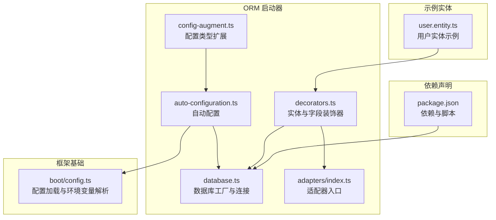
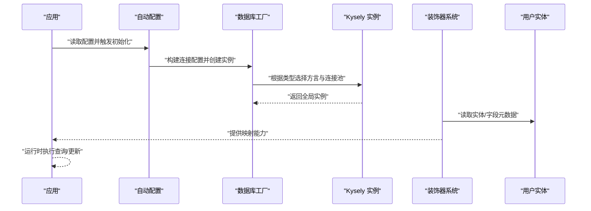
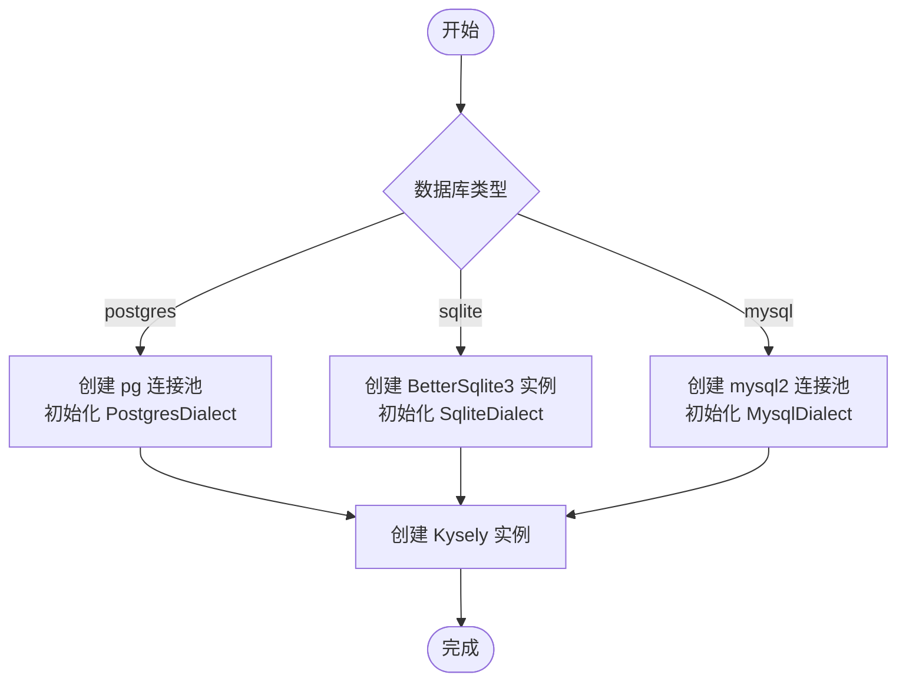
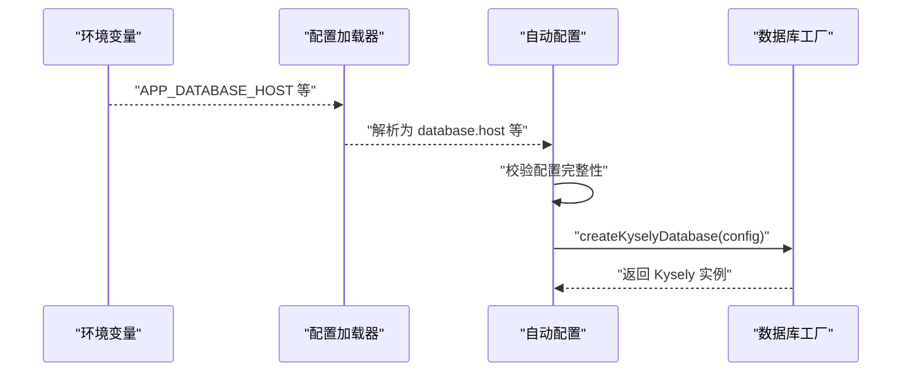
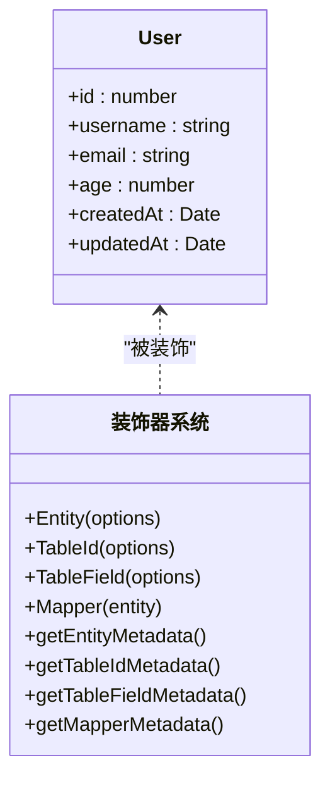
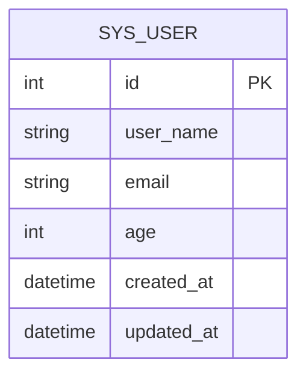
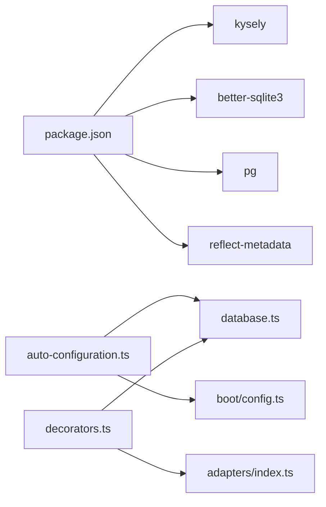

# 数据库配置

<cite>
**本文引用的文件**
- [packages/aiko-boot-starter-orm/src/database.ts](file://packages/aiko-boot-starter-orm/src/database.ts)
- [packages/aiko-boot-starter-orm/src/auto-configuration.ts](file://packages/aiko-boot-starter-orm/src/auto-configuration.ts)
- [packages/aiko-boot-starter-orm/src/decorators.ts](file://packages/aiko-boot-starter-orm/src/decorators.ts)
- [packages/aiko-boot-starter-orm/src/config-augment.ts](file://packages/aiko-boot-starter-orm/src/config-augment.ts)
- [packages/aiko-boot-starter-orm/src/adapters/index.ts](file://packages/aiko-boot-starter-orm/src/adapters/index.ts)
- [app/examples/user-crud/packages/api/src/entity/user.entity.ts](file://app/examples/user-crud/packages/api/src/entity/user.entity.ts)
- [packages/aiko-boot/src/boot/config.ts](file://packages/aiko-boot/src/boot/config.ts)
- [packages/aiko-boot-starter-orm/package.json](file://packages/aiko-boot-starter-orm/package.json)
</cite>

## 目录
1. [简介](#简介)
2. [项目结构](#项目结构)
3. [核心组件](#核心组件)
4. [架构总览](#架构总览)
5. [详细组件分析](#详细组件分析)
6. [依赖关系分析](#依赖关系分析)
7. [性能考量](#性能考量)
8. [故障排查指南](#故障排查指南)
9. [结论](#结论)
10. [附录](#附录)

## 简介
本指南面向需要在用户管理系统中实现数据库配置与实体映射的开发者，系统讲解基于 Kysely 的 ORM 启动器如何完成以下目标：
- 数据库连接配置：支持 PostgreSQL、SQLite、MySQL，涵盖连接参数、驱动程序、连接池管理。
- 表结构设计与实体映射：通过装饰器定义实体、主键、字段映射及数据类型特性。
- 数据库迁移与版本管理：给出最佳实践建议，帮助团队建立可演进的数据层。

## 项目结构
该仓库采用多包工作区组织，数据库配置相关的核心位于 aiko-boot-starter-orm 包；示例实体位于 user-crud 示例工程中。下图展示了与数据库配置直接相关的模块与文件：

**图表来源**
- [packages/aiko-boot-starter-orm/src/database.ts](file://packages/aiko-boot-starter-orm/src/database.ts#L1-L134)
- [packages/aiko-boot-starter-orm/src/auto-configuration.ts](file://packages/aiko-boot-starter-orm/src/auto-configuration.ts#L1-L134)
- [packages/aiko-boot-starter-orm/src/decorators.ts](file://packages/aiko-boot-starter-orm/src/decorators.ts#L1-L224)
- [packages/aiko-boot-starter-orm/src/config-augment.ts](file://packages/aiko-boot-starter-orm/src/config-augment.ts#L1-L26)
- [packages/aiko-boot-starter-orm/src/adapters/index.ts](file://packages/aiko-boot-starter-orm/src/adapters/index.ts#L1-L3)
- [app/examples/user-crud/packages/api/src/entity/user.entity.ts](file://app/examples/user-crud/packages/api/src/entity/user.entity.ts#L1-L23)
- [packages/aiko-boot/src/boot/config.ts](file://packages/aiko-boot/src/boot/config.ts#L231-L266)
- [packages/aiko-boot-starter-orm/package.json](file://packages/aiko-boot-starter-orm/package.json#L1-L55)

**章节来源**
- [packages/aiko-boot-starter-orm/src/database.ts](file://packages/aiko-boot-starter-orm/src/database.ts#L1-L134)
- [packages/aiko-boot-starter-orm/src/auto-configuration.ts](file://packages/aiko-boot-starter-orm/src/auto-configuration.ts#L1-L134)
- [packages/aiko-boot-starter-orm/src/decorators.ts](file://packages/aiko-boot-starter-orm/src/decorators.ts#L1-L224)
- [packages/aiko-boot-starter-orm/src/config-augment.ts](file://packages/aiko-boot-starter-orm/src/config-augment.ts#L1-L26)
- [packages/aiko-boot-starter-orm/src/adapters/index.ts](file://packages/aiko-boot-starter-orm/src/adapters/index.ts#L1-L3)
- [app/examples/user-crud/packages/api/src/entity/user.entity.ts](file://app/examples/user-crud/packages/api/src/entity/user.entity.ts#L1-L23)
- [packages/aiko-boot/src/boot/config.ts](file://packages/aiko-boot/src/boot/config.ts#L231-L266)
- [packages/aiko-boot-starter-orm/package.json](file://packages/aiko-boot-starter-orm/package.json#L1-L55)

## 核心组件
- 数据库工厂与连接
  - 支持三种数据库类型：PostgreSQL、SQLite、MySQL。
  - 基于 Kysely 的方言（Dialect）与连接池（Pool）进行连接管理。
  - 提供全局实例缓存、获取、关闭与初始化状态检查。
- 自动配置
  - 通过配置属性类与条件注解，按需初始化数据库连接。
  - 从配置加载器读取配置，并在应用启动与关闭阶段执行生命周期钩子。
- 装饰器体系
  - 实体装饰器用于标注表名与描述等元信息。
  - 主键与字段装饰器用于映射列名、填充策略、存在性等。
  - Mapper 装饰器用于标记仓储接口并自动注入依赖与适配器。
- 配置类型扩展
  - 通过模块增强为应用配置类型添加数据库配置字段，便于类型安全访问。
- 示例实体
  - 用户实体演示了如何使用装饰器标注主键、字段与时间戳等。

**章节来源**
- [packages/aiko-boot-starter-orm/src/database.ts](file://packages/aiko-boot-starter-orm/src/database.ts#L40-L134)
- [packages/aiko-boot-starter-orm/src/auto-configuration.ts](file://packages/aiko-boot-starter-orm/src/auto-configuration.ts#L34-L134)
- [packages/aiko-boot-starter-orm/src/decorators.ts](file://packages/aiko-boot-starter-orm/src/decorators.ts#L23-L130)
- [packages/aiko-boot-starter-orm/src/config-augment.ts](file://packages/aiko-boot-starter-orm/src/config-augment.ts#L20-L25)
- [app/examples/user-crud/packages/api/src/entity/user.entity.ts](file://app/examples/user-crud/packages/api/src/entity/user.entity.ts#L3-L22)

## 架构总览
下图展示了从配置到数据库连接、再到实体映射的整体流程：

**图表来源**
- [packages/aiko-boot-starter-orm/src/auto-configuration.ts](file://packages/aiko-boot-starter-orm/src/auto-configuration.ts#L64-L93)
- [packages/aiko-boot-starter-orm/src/database.ts](file://packages/aiko-boot-starter-orm/src/database.ts#L47-L95)
- [packages/aiko-boot-starter-orm/src/decorators.ts](file://packages/aiko-boot-starter-orm/src/decorators.ts#L68-L123)
- [app/examples/user-crud/packages/api/src/entity/user.entity.ts](file://app/examples/user-crud/packages/api/src/entity/user.entity.ts#L3-L22)

## 详细组件分析

### 数据库工厂与连接配置
- 支持的数据库类型与参数
  - PostgreSQL：主机、端口、用户名、密码、数据库名。
  - SQLite：文件路径，支持内存数据库。
  - MySQL：主机、端口、用户名、密码、数据库名。
- 连接池与驱动
  - PostgreSQL 使用 pg 的连接池。
  - SQLite 使用 better-sqlite3 的本地驱动。
  - MySQL 使用 mysql2 的连接池。
- 生命周期管理
  - 全局缓存 Kysely 实例，提供获取、关闭与初始化状态检查。
- 错误处理
  - 不支持的类型会抛出错误；未初始化时获取实例会抛错。

**图表来源**
- [packages/aiko-boot-starter-orm/src/database.ts](file://packages/aiko-boot-starter-orm/src/database.ts#L47-L95)

**章节来源**
- [packages/aiko-boot-starter-orm/src/database.ts](file://packages/aiko-boot-starter-orm/src/database.ts#L9-L95)

### 自动配置与环境变量解析
- 配置属性类
  - 通过配置前缀 database.* 映射到类型安全的属性对象。
- 条件初始化
  - 当配置项存在时自动执行初始化与关闭钩子。
- 配置加载
  - 支持从配置文件与环境变量加载，环境变量键名会被转换为点号分隔的嵌套键。
- 初始化流程
  - 应用启动时读取配置并创建数据库实例；应用关闭时销毁连接。

**图表来源**
- [packages/aiko-boot-starter-orm/src/auto-configuration.ts](file://packages/aiko-boot-starter-orm/src/auto-configuration.ts#L64-L133)
- [packages/aiko-boot/src/boot/config.ts](file://packages/aiko-boot/src/boot/config.ts#L231-L266)

**章节来源**
- [packages/aiko-boot-starter-orm/src/auto-configuration.ts](file://packages/aiko-boot-starter-orm/src/auto-configuration.ts#L34-L134)
- [packages/aiko-boot/src/boot/config.ts](file://packages/aiko-boot/src/boot/config.ts#L231-L266)

### 装饰器与实体映射
- 实体装饰器
  - 用于标注类为实体，并指定表名、Schema、描述等。
- 主键装饰器
  - 支持主键类型（自增、输入、分配 ID/UUID）与列名映射。
- 字段装饰器
  - 支持列名映射、字段存在性、填充策略、是否为大字段、JDBC 类型等。
- Mapper 装饰器
  - 标记仓储接口，自动注册到容器并尝试在实例化时注入适配器。
- 元数据读取
  - 提供辅助函数读取实体、主键、字段与 Mapper 的元数据。

**图表来源**
- [app/examples/user-crud/packages/api/src/entity/user.entity.ts](file://app/examples/user-crud/packages/api/src/entity/user.entity.ts#L3-L22)
- [packages/aiko-boot-starter-orm/src/decorators.ts](file://packages/aiko-boot-starter-orm/src/decorators.ts#L68-L130)

**章节来源**
- [packages/aiko-boot-starter-orm/src/decorators.ts](file://packages/aiko-boot-starter-orm/src/decorators.ts#L23-L130)
- [app/examples/user-crud/packages/api/src/entity/user.entity.ts](file://app/examples/user-crud/packages/api/src/entity/user.entity.ts#L3-L22)

### 示例：用户实体映射配置
- 表名：sys_user
- 主键：自增 id
- 字段映射：
  - username → user_name
  - email → email（默认字段名与属性一致）
  - age → age（可选字段）
  - createdAt → created_at（时间戳）
  - updatedAt → updated_at（时间戳）

**图表来源**
- [app/examples/user-crud/packages/api/src/entity/user.entity.ts](file://app/examples/user-crud/packages/api/src/entity/user.entity.ts#L3-L22)

**章节来源**
- [app/examples/user-crud/packages/api/src/entity/user.entity.ts](file://app/examples/user-crud/packages/api/src/entity/user.entity.ts#L3-L22)

### 适配器与运行时集成
- 适配器入口导出 Kysely 适配器与内存适配器，便于在不同场景切换。
- 装饰器在实例化时可自动设置适配器，前提是数据库已初始化且实例具备设置方法。

**章节来源**
- [packages/aiko-boot-starter-orm/src/adapters/index.ts](file://packages/aiko-boot-starter-orm/src/adapters/index.ts#L1-L3)
- [packages/aiko-boot-starter-orm/src/decorators.ts](file://packages/aiko-boot-starter-orm/src/decorators.ts#L158-L175)

## 依赖关系分析
- ORM 启动器依赖
  - Kysely：SQL 查询构建与方言支持。
  - better-sqlite3：SQLite 驱动。
  - pg：PostgreSQL 驱动与连接池。
  - reflect-metadata：装饰器元数据支持。
- 运行时耦合
  - 自动配置依赖框架的配置加载器与生命周期钩子。
  - 装饰器系统依赖反射元数据与 DI 容器能力。

**图表来源**
- [packages/aiko-boot-starter-orm/package.json](file://packages/aiko-boot-starter-orm/package.json#L24-L38)
- [packages/aiko-boot-starter-orm/src/auto-configuration.ts](file://packages/aiko-boot-starter-orm/src/auto-configuration.ts#L17-L27)
- [packages/aiko-boot-starter-orm/src/database.ts](file://packages/aiko-boot-starter-orm/src/database.ts#L7-L7)
- [packages/aiko-boot-starter-orm/src/decorators.ts](file://packages/aiko-boot-starter-orm/src/decorators.ts#L9-L12)
- [packages/aiko-boot-starter-orm/src/adapters/index.ts](file://packages/aiko-boot-starter-orm/src/adapters/index.ts#L1-L2)
- [packages/aiko-boot/src/boot/config.ts](file://packages/aiko-boot/src/boot/config.ts#L231-L266)

**章节来源**
- [packages/aiko-boot-starter-orm/package.json](file://packages/aiko-boot-starter-orm/package.json#L24-L38)
- [packages/aiko-boot-starter-orm/src/auto-configuration.ts](file://packages/aiko-boot-starter-orm/src/auto-configuration.ts#L17-L27)
- [packages/aiko-boot-starter-orm/src/database.ts](file://packages/aiko-boot-starter-orm/src/database.ts#L7-L7)
- [packages/aiko-boot-starter-orm/src/decorators.ts](file://packages/aiko-boot-starter-orm/src/decorators.ts#L9-L12)
- [packages/aiko-boot-starter-orm/src/adapters/index.ts](file://packages/aiko-boot-starter-orm/src/adapters/index.ts#L1-L2)
- [packages/aiko-boot/src/boot/config.ts](file://packages/aiko-boot/src/boot/config.ts#L231-L266)

## 性能考量
- 连接池大小与超时
  - PostgreSQL 与 MySQL 使用连接池，应结合并发请求量与数据库资源合理设置池大小与超时。
- SQLite 适用场景
  - 内存数据库适合测试与轻量场景；持久化文件需考虑磁盘 I/O 与 WAL 模式。
- 查询优化
  - 使用 Kysely 的类型安全查询构建器减少运行时错误，配合索引与分页提升查询性能。
- 适配器选择
  - 在开发与生产环境选择合适的适配器，避免不必要的抽象层开销。

[本节为通用指导，无需列出具体文件来源]

## 故障排查指南
- 未初始化数据库
  - 现象：获取实例或配置时报错。
  - 处理：确保先调用创建实例流程或启用自动配置。
- 配置不完整
  - 现象：自动配置跳过初始化。
  - 处理：补齐 database.type 以及对应类型的必填字段。
- 不支持的数据库类型
  - 现象：创建实例时抛出错误。
  - 处理：确认类型拼写与依赖安装。
- 环境变量未生效
  - 现象：配置未按预期加载。
  - 处理：检查前缀与键名格式，确保符合框架约定。

**章节来源**
- [packages/aiko-boot-starter-orm/src/database.ts](file://packages/aiko-boot-starter-orm/src/database.ts#L100-L126)
- [packages/aiko-boot-starter-orm/src/auto-configuration.ts](file://packages/aiko-boot-starter-orm/src/auto-configuration.ts#L71-L76)
- [packages/aiko-boot/src/boot/config.ts](file://packages/aiko-boot/src/boot/config.ts#L231-L266)

## 结论
本指南围绕 aiko-boot-starter-orm 的数据库配置与实体映射提供了从连接工厂、自动配置、装饰器体系到示例实体的完整实现路径。通过类型安全的配置与装饰器映射，开发者可以快速搭建用户管理系统的数据持久化层，并在 PostgreSQL、SQLite、MySQL 之间灵活切换。配合合理的连接池与查询优化策略，可在开发与生产环境中获得稳定可靠的性能表现。

[本节为总结性内容，无需列出具体文件来源]

## 附录

### 数据库类型与连接参数对照
- PostgreSQL
  - 参数：host、port、user、password、database
  - 驱动：pg（连接池）
- SQLite
  - 参数：filename（支持内存数据库）
  - 驱动：better-sqlite3
- MySQL
  - 参数：host、port、user、password、database
  - 驱动：mysql2（连接池）

**章节来源**
- [packages/aiko-boot-starter-orm/src/database.ts](file://packages/aiko-boot-starter-orm/src/database.ts#L11-L38)

### 配置文件与环境变量示例键名
- 配置文件键名：database.type、database.filename、database.host、database.port、database.user、database.password、database.database
- 环境变量键名（前缀 APP_）：APP_DATABASE_TYPE、APP_DATABASE_FILENAME、APP_DATABASE_HOST、APP_DATABASE_PORT、APP_DATABASE_USER、APP_DATABASE_PASSWORD、APP_DATABASE_DATABASE

**章节来源**
- [packages/aiko-boot-starter-orm/src/auto-configuration.ts](file://packages/aiko-boot-starter-orm/src/auto-configuration.ts#L34-L54)
- [packages/aiko-boot/src/boot/config.ts](file://packages/aiko-boot/src/boot/config.ts#L231-L266)

### 数据库迁移与版本管理最佳实践
- 版本化迁移脚本
  - 将每次结构变更封装为独立脚本，记录变更原因与回滚步骤。
- 变更控制
  - 使用版本号前缀命名脚本，保证执行顺序与幂等性。
- 测试与验证
  - 在测试环境先执行迁移，验证数据一致性与查询性能。
- 回滚策略
  - 保留安全的回滚脚本，确保紧急情况下可快速恢复。
- 文档同步
  - 将迁移脚本与数据库设计文档同步维护，便于审计与知识传承。

[本节为通用指导，无需列出具体文件来源]