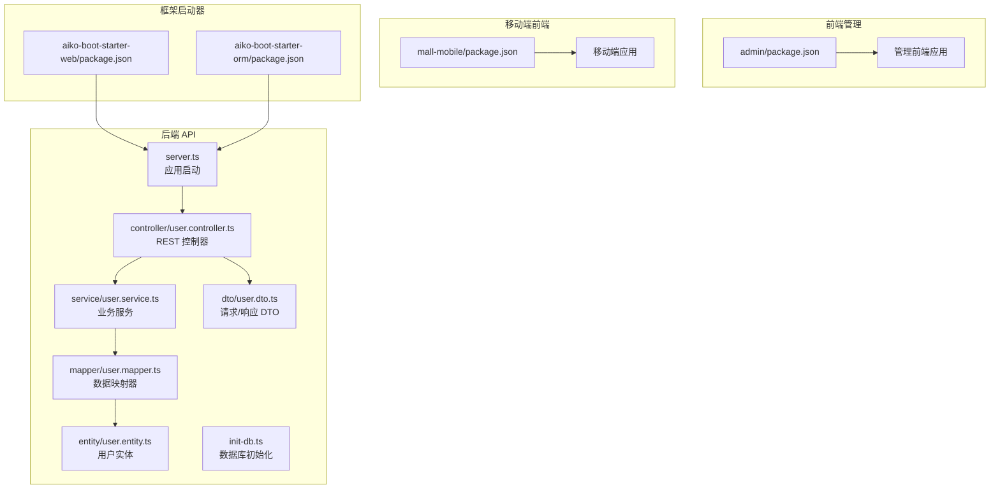
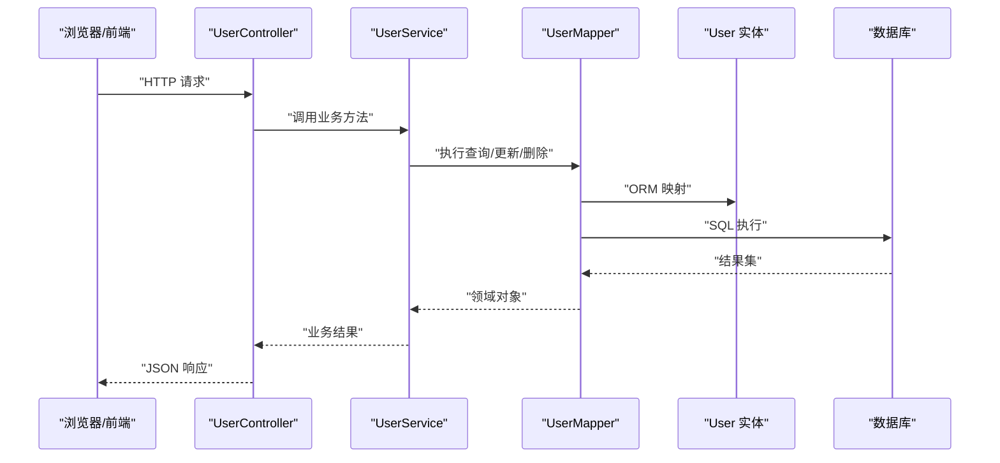
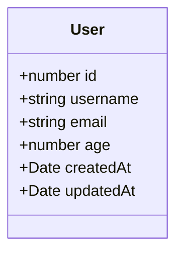
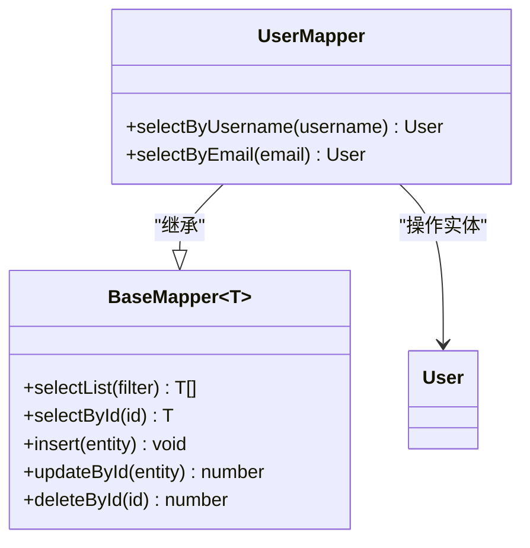
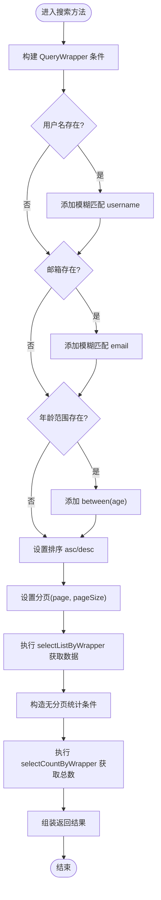
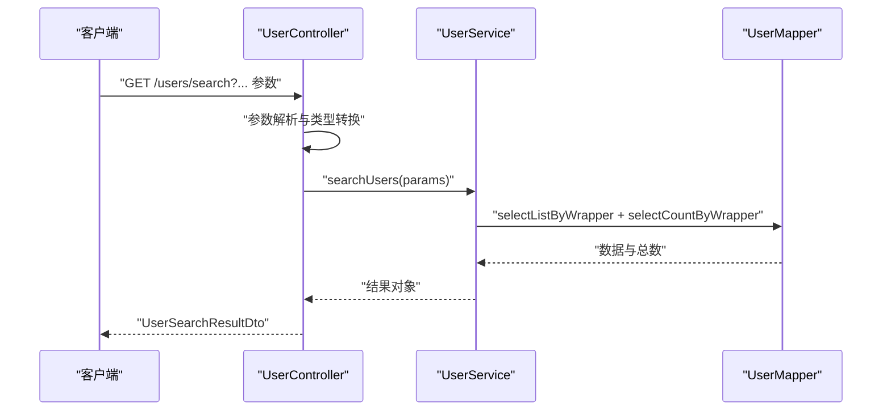
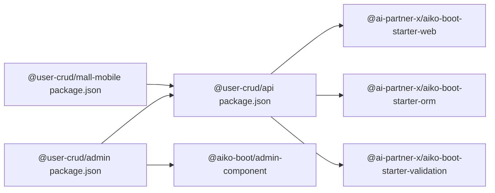

# 用户 CRUD 示例

<cite>
**本文引用的文件**
- [app/examples/user-crud/packages/api/src/server.ts](file://app/examples/user-crud/packages/api/src/server.ts)
- [app/examples/user-crud/packages/api/src/entity/user.entity.ts](file://app/examples/user-crud/packages/api/src/entity/user.entity.ts)
- [app/examples/user-crud/packages/api/src/mapper/user.mapper.ts](file://app/examples/user-crud/packages/api/src/mapper/user.mapper.ts)
- [app/examples/user-crud/packages/api/src/service/user.service.ts](file://app/examples/user-crud/packages/api/src/service/user.service.ts)
- [app/examples/user-crud/packages/api/src/controller/user.controller.ts](file://app/examples/user-crud/packages/api/src/controller/user.controller.ts)
- [app/examples/user-crud/packages/api/src/dto/user.dto.ts](file://app/examples/user-crud/packages/api/src/dto/user.dto.ts)
- [app/examples/user-crud/packages/api/src/scripts/init-db.ts](file://app/examples/user-crud/packages/api/src/scripts/init-db.ts)
- [app/examples/user-crud/packages/api/package.json](file://app/examples/user-crud/packages/api/package.json)
- [app/examples/user-crud/packages/admin/package.json](file://app/examples/user-crud/packages/admin/package.json)
- [app/examples/user-crud/packages/mall-mobile/package.json](file://app/examples/user-crud/packages/mall-mobile/package.json)
- [packages/aiko-boot-starter-web/package.json](file://packages/aiko-boot-starter-web/package.json)
- [packages/aiko-boot-starter-orm/package.json](file://packages/aiko-boot-starter-orm/package.json)
</cite>

## 目录
1. [简介](#简介)
2. [项目结构](#项目结构)
3. [核心组件](#核心组件)
4. [架构总览](#架构总览)
5. [详细组件分析](#详细组件分析)
6. [依赖分析](#依赖分析)
7. [性能考虑](#性能考虑)
8. [故障排查指南](#故障排查指南)
9. [结论](#结论)
10. [附录](#附录)

## 简介
本指南围绕“用户 CRUD 示例”项目，系统讲解从数据库设计、实体与映射器、服务层业务逻辑，到控制器 API 接口与前端管理界面的完整实现路径。项目采用装饰器驱动的数据持久化方案与 Spring Boot 风格的 Web 控制器，结合 TypeScript 与 React 前端，提供可直接运行的示例工程。

## 项目结构
该示例工程采用多包工作区组织方式，包含后端 API、管理前端与移动端前端三部分，以及底层框架启动器与组件库：

- 后端 API 包：提供用户实体、映射器、服务与控制器，内置数据库初始化脚本与启动入口。
- 管理前端包：基于 React + TailwindCSS，集成表单校验与数据表格组件，调用后端 API。
- 移动端前端包：基于 Next.js，提供移动端用户管理页面。
- 框架启动器与组件库：提供 Web 装饰器、ORM 装饰器与通用 UI 组件。

图表来源
- [app/examples/user-crud/packages/api/src/server.ts](file://app/examples/user-crud/packages/api/src/server.ts#L1-L21)
- [app/examples/user-crud/packages/api/src/controller/user.controller.ts](file://app/examples/user-crud/packages/api/src/controller/user.controller.ts#L1-L170)
- [app/examples/user-crud/packages/api/src/service/user.service.ts](file://app/examples/user-crud/packages/api/src/service/user.service.ts#L1-L251)
- [app/examples/user-crud/packages/api/src/mapper/user.mapper.ts](file://app/examples/user-crud/packages/api/src/mapper/user.mapper.ts#L1-L17)
- [app/examples/user-crud/packages/api/src/entity/user.entity.ts](file://app/examples/user-crud/packages/api/src/entity/user.entity.ts#L1-L23)
- [app/examples/user-crud/packages/api/src/dto/user.dto.ts](file://app/examples/user-crud/packages/api/src/dto/user.dto.ts#L1-L105)
- [app/examples/user-crud/packages/api/src/scripts/init-db.ts](file://app/examples/user-crud/packages/api/src/scripts/init-db.ts)
- [app/examples/user-crud/packages/admin/package.json](file://app/examples/user-crud/packages/admin/package.json#L1-L34)
- [app/examples/user-crud/packages/mall-mobile/package.json](file://app/examples/user-crud/packages/mall-mobile/package.json#L1-L28)
- [packages/aiko-boot-starter-web/package.json](file://packages/aiko-boot-starter-web/package.json#L1-L60)
- [packages/aiko-boot-starter-orm/package.json](file://packages/aiko-boot-starter-orm/package.json#L1-L55)

章节来源
- [app/examples/user-crud/packages/api/src/server.ts](file://app/examples/user-crud/packages/api/src/server.ts#L1-L21)
- [app/examples/user-crud/packages/admin/package.json](file://app/examples/user-crud/packages/admin/package.json#L1-L34)
- [app/examples/user-crud/packages/mall-mobile/package.json](file://app/examples/user-crud/packages/mall-mobile/package.json#L1-L28)
- [packages/aiko-boot-starter-web/package.json](file://packages/aiko-boot-starter-web/package.json#L1-L60)
- [packages/aiko-boot-starter-orm/package.json](file://packages/aiko-boot-starter-orm/package.json#L1-L55)

## 核心组件
- 用户实体：通过装饰器定义表结构与字段映射，声明主键与时间戳字段。
- 映射器：继承基础映射器，扩展按用户名/邮箱查询等便捷方法。
- 服务层：封装 CRUD 与复杂查询，支持分页、排序、条件过滤与批量操作；提供事务控制。
- 控制器：暴露 REST 接口，统一参数解析与响应格式。
- DTO：约束请求参数与响应结构，配合验证器进行输入校验。
- 启动器：自动装配 Web 与 ORM 能力，简化应用初始化。

章节来源
- [app/examples/user-crud/packages/api/src/entity/user.entity.ts](file://app/examples/user-crud/packages/api/src/entity/user.entity.ts#L1-L23)
- [app/examples/user-crud/packages/api/src/mapper/user.mapper.ts](file://app/examples/user-crud/packages/api/src/mapper/user.mapper.ts#L1-L17)
- [app/examples/user-crud/packages/api/src/service/user.service.ts](file://app/examples/user-crud/packages/api/src/service/user.service.ts#L1-L251)
- [app/examples/user-crud/packages/api/src/controller/user.controller.ts](file://app/examples/user-crud/packages/api/src/controller/user.controller.ts#L1-L170)
- [app/examples/user-crud/packages/api/src/dto/user.dto.ts](file://app/examples/user-crud/packages/api/src/dto/user.dto.ts#L1-L105)

## 架构总览
下图展示了从浏览器到数据库的端到端调用链路，涵盖装饰器驱动的实体映射、服务层事务与控制器路由。

图表来源
- [app/examples/user-crud/packages/api/src/controller/user.controller.ts](file://app/examples/user-crud/packages/api/src/controller/user.controller.ts#L30-L170)
- [app/examples/user-crud/packages/api/src/service/user.service.ts](file://app/examples/user-crud/packages/api/src/service/user.service.ts#L30-L251)
- [app/examples/user-crud/packages/api/src/mapper/user.mapper.ts](file://app/examples/user-crud/packages/api/src/mapper/user.mapper.ts#L5-L17)
- [app/examples/user-crud/packages/api/src/entity/user.entity.ts](file://app/examples/user-crud/packages/api/src/entity/user.entity.ts#L3-L22)

## 详细组件分析

### 用户实体与装饰器映射
- 实体装饰器：声明表名为 sys_user。
- 主键装饰器：自增主键 id。
- 字段装饰器：username、email、age、createdAt、updatedAt，支持列名映射与可选字段。
- 设计要点：通过装饰器将类属性与数据库表字段一一对应，避免手写 SQL 映射样板代码。

图表来源
- [app/examples/user-crud/packages/api/src/entity/user.entity.ts](file://app/examples/user-crud/packages/api/src/entity/user.entity.ts#L3-L22)

章节来源
- [app/examples/user-crud/packages/api/src/entity/user.entity.ts](file://app/examples/user-crud/packages/api/src/entity/user.entity.ts#L1-L23)

### 映射器与基础 CRUD
- 继承 BaseMapper：获得 selectList、selectById、insert、updateById、deleteById 等通用能力。
- 扩展查询：selectByUsername、selectByEmail 提供常用条件查询。
- 复杂查询：通过 Wrapper（QueryWrapper/UpdateWrapper）构建动态条件。

图表来源
- [app/examples/user-crud/packages/api/src/mapper/user.mapper.ts](file://app/examples/user-crud/packages/api/src/mapper/user.mapper.ts#L5-L17)
- [app/examples/user-crud/packages/api/src/entity/user.entity.ts](file://app/examples/user-crud/packages/api/src/entity/user.entity.ts#L3-L22)

章节来源
- [app/examples/user-crud/packages/api/src/mapper/user.mapper.ts](file://app/examples/user-crud/packages/api/src/mapper/user.mapper.ts#L1-L17)

### 服务层业务逻辑
- 基础查询：按 ID、分页列表、全量列表。
- 高级搜索：支持模糊匹配、范围查询、排序与分页，返回数据与总数。
- 事务控制：使用注解确保新增、修改、删除与批量操作的一致性。
- 批量操作：UpdateWrapper 支持批量更新；QueryWrapper 支持批量删除。

图表来源
- [app/examples/user-crud/packages/api/src/service/user.service.ts](file://app/examples/user-crud/packages/api/src/service/user.service.ts#L63-L123)

章节来源
- [app/examples/user-crud/packages/api/src/service/user.service.ts](file://app/examples/user-crud/packages/api/src/service/user.service.ts#L1-L251)

### 控制器 API 接口
- 列表与详情：GET /users、GET /users/{id}
- 高级搜索：GET /users/search（支持 username、email、minAge、maxAge、page、pageSize、orderBy、orderDir）
- 活跃用户与关键字搜索：GET /users/active、GET /users/keyword/{keyword}
- 新增、修改、删除：POST /users、PUT /users/{id}、DELETE /users/{id}
- 批量更新年龄：PUT /users/batch/age
- 更新邮箱：PUT /users/{id}/email
- 批量删除：DELETE /users/batch

图表来源
- [app/examples/user-crud/packages/api/src/controller/user.controller.ts](file://app/examples/user-crud/packages/api/src/controller/user.controller.ts#L46-L76)
- [app/examples/user-crud/packages/api/src/service/user.service.ts](file://app/examples/user-crud/packages/api/src/service/user.service.ts#L63-L123)

章节来源
- [app/examples/user-crud/packages/api/src/controller/user.controller.ts](file://app/examples/user-crud/packages/api/src/controller/user.controller.ts#L1-L170)

### DTO 与表单验证
- CreateUserDto：用户名非空、长度限制、邮箱格式、年龄可选且范围校验。
- UpdateUserDto：字段可选，邮箱格式与年龄范围校验。
- 批量更新年龄、更新邮箱、批量删除 DTO：约束请求体字段与范围。
- 响应 DTO：SuccessResponse、UpdateResponse、DeleteResponse、UserSearchResultDto。

章节来源
- [app/examples/user-crud/packages/api/src/dto/user.dto.ts](file://app/examples/user-crud/packages/api/src/dto/user.dto.ts#L1-L105)

### 数据库初始化与配置
- 初始化脚本：用于创建 sys_user 表与初始数据，便于快速体验。
- 应用启动：通过框架自动装配 Web 与 ORM，加载配置并启动 HTTP 服务器。

章节来源
- [app/examples/user-crud/packages/api/src/scripts/init-db.ts](file://app/examples/user-crud/packages/api/src/scripts/init-db.ts)
- [app/examples/user-crud/packages/api/src/server.ts](file://app/examples/user-crud/packages/api/src/server.ts#L10-L21)

## 依赖分析
- 后端 API 依赖：
  - aiko-boot：容器与注解能力
  - aiko-boot-starter-web：HTTP 路由与控制器装饰器
  - aiko-boot-starter-orm：实体与映射器装饰器、Kysely 查询构建器
  - aiko-boot-starter-validation：DTO 字段校验装饰器
  - better-sqlite3 或 pg：数据库驱动（二选一）
- 前端管理依赖：
  - @user-crud/api：后端客户端封装
  - @aiko-boot/admin-component：UI 组件库
  - react-hook-form + zod：表单与校验
  - swr：数据缓存与刷新
- 移动端前端依赖：
  - @user-crud/api：后端客户端封装
  - next + react：移动端页面

图表来源
- [app/examples/user-crud/packages/api/package.json](file://app/examples/user-crud/packages/api/package.json#L21-L46)
- [app/examples/user-crud/packages/admin/package.json](file://app/examples/user-crud/packages/admin/package.json#L12-L22)
- [app/examples/user-crud/packages/mall-mobile/package.json](file://app/examples/user-crud/packages/mall-mobile/package.json#L11-L18)
- [packages/aiko-boot-starter-web/package.json](file://packages/aiko-boot-starter-web/package.json#L32-L37)
- [packages/aiko-boot-starter-orm/package.json](file://packages/aiko-boot-starter-orm/package.json#L24-L29)

章节来源
- [app/examples/user-crud/packages/api/package.json](file://app/examples/user-crud/packages/api/package.json#L1-L47)
- [app/examples/user-crud/packages/admin/package.json](file://app/examples/user-crud/packages/admin/package.json#L1-L34)
- [app/examples/user-crud/packages/mall-mobile/package.json](file://app/examples/user-crud/packages/mall-mobile/package.json#L1-L28)
- [packages/aiko-boot-starter-web/package.json](file://packages/aiko-boot-starter-web/package.json#L1-L60)
- [packages/aiko-boot-starter-orm/package.json](file://packages/aiko-boot-starter-orm/package.json#L1-L55)

## 性能考虑
- 查询优化：优先使用索引字段（如 username、email）作为过滤条件；避免在大数据表上进行全表模糊匹配。
- 分页策略：合理设置 page 与 pageSize，避免一次性返回过多数据；对高频查询建立复合索引。
- 事务边界：将多个相关写操作放入同一事务，减少中间状态；避免长事务占用锁资源。
- 缓存与并发：前端使用 SWR 进行请求去重与缓存；服务端可引入二级缓存（需自行扩展）。
- 日志与监控：为关键接口埋点，记录耗时与异常，便于定位性能瓶颈。

## 故障排查指南
- 启动失败：检查数据库驱动与连接配置，确认 init-db 已执行并创建表。
- 控制器 404：确认装饰器路径与路由前缀一致，控制器已注册。
- DTO 校验失败：检查请求体字段与校验规则，确保必填项与格式正确。
- 事务回滚：检查 @Transactional 是否包裹在正确的业务方法上，异常是否被吞掉。
- 响应格式不符：核对控制器返回值与 DTO 结构，确保字段命名与类型一致。

## 结论
本示例以装饰器为核心，将实体、映射器、服务与控制器有机串联，形成清晰的分层架构。配合 DTO 校验与前端组件库，能够快速搭建具备完整 CRUD 能力的用户管理功能。建议在生产环境中补充鉴权、审计日志与更完善的错误处理机制。

## 附录

### 快速运行步骤
- 安装依赖：在仓库根目录执行安装命令。
- 初始化数据库：在 API 包中执行数据库初始化脚本。
- 启动后端：在 API 包中启动开发服务器。
- 启动前端：在 admin 包中启动开发服务器。
- 访问地址：打开浏览器访问前端管理界面与 API 文档。

章节来源
- [app/examples/user-crud/packages/api/package.json](file://app/examples/user-crud/packages/api/package.json#L12-L20)
- [app/examples/user-crud/packages/admin/package.json](file://app/examples/user-crud/packages/admin/package.json#L6-L11)
- [app/examples/user-crud/packages/api/src/scripts/init-db.ts](file://app/examples/user-crud/packages/api/src/scripts/init-db.ts)