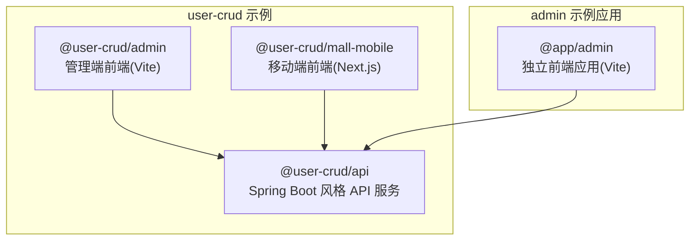
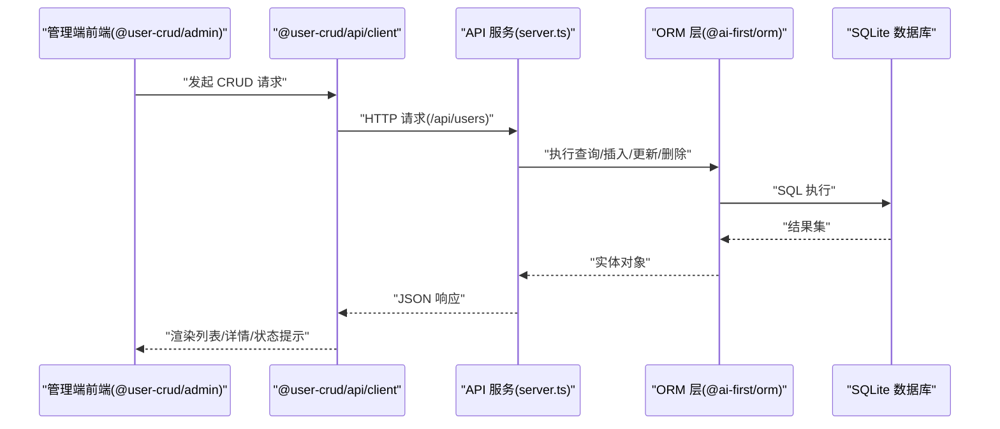
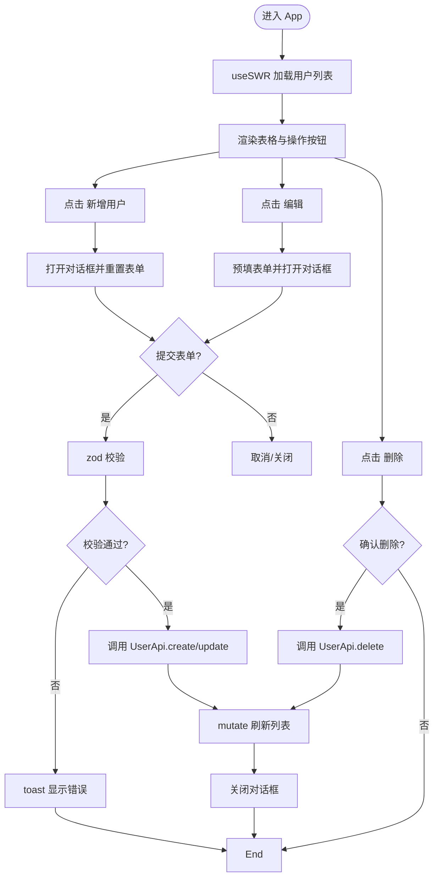
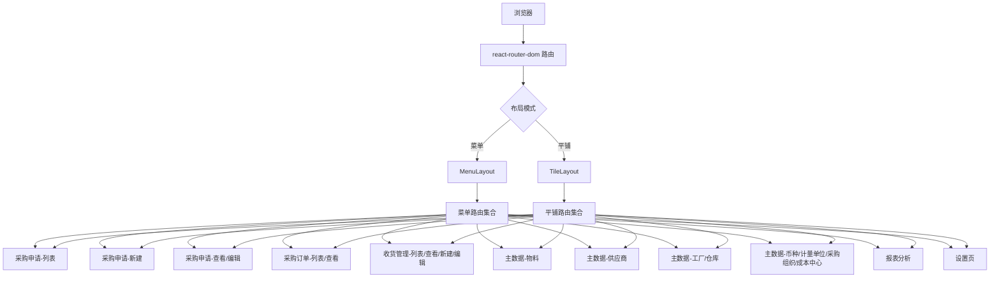
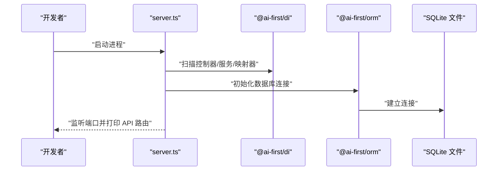
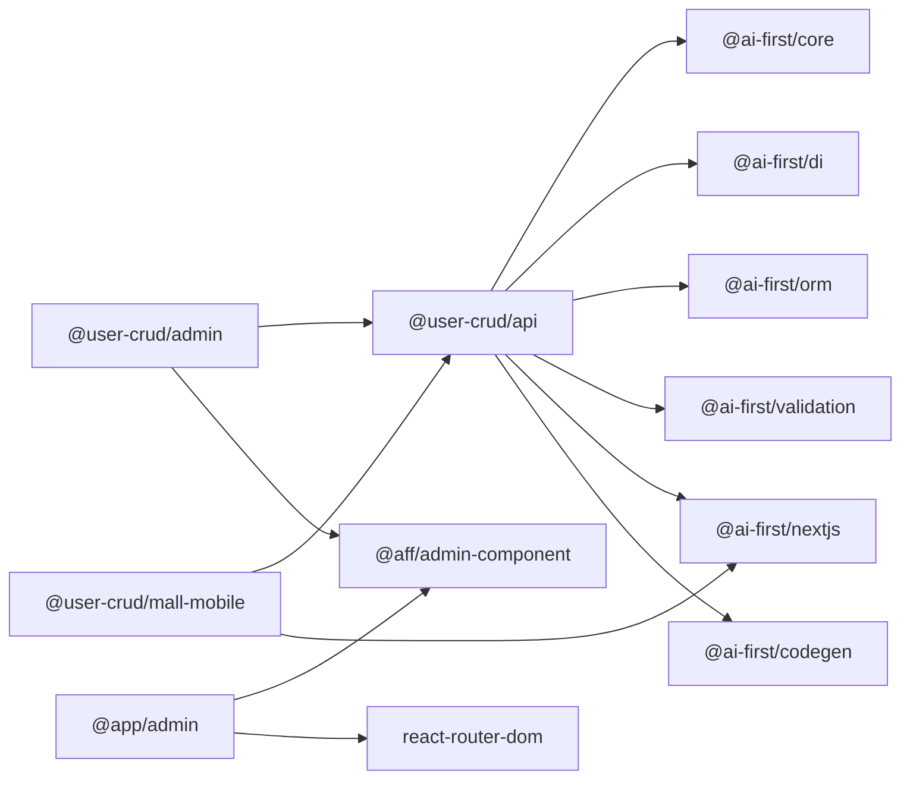

# 示例应用

<cite>
**本文引用的文件**   
- [README.md](file://README.md)
- [package.json](file://app/examples/user-crud/package.json)
- [packages/api/package.json](file://app/examples/user-crud/packages/api/package.json)
- [packages/admin/package.json](file://app/examples/user-crud/packages/admin/package.json)
- [packages/mall-mobile/package.json](file://app/examples/user-crud/packages/mall-mobile/package.json)
- [server.ts](file://app/examples/user-crud/packages/api/src/server.ts)
- [App.tsx（user-crud 管理端）](file://app/examples/user-crud/packages/admin/src/App.tsx)
- [App.tsx（admin 示例应用）](file://app/examples/admin/src/App.tsx)
- [README.md（user-crud 示例）](file://app/examples/user-crud/README.md)
- [README.md（admin 示例应用）](file://app/examples/admin/README.md)
</cite>

## 目录
1. [简介](#简介)
2. [项目结构](#项目结构)
3. [核心组件](#核心组件)
4. [架构总览](#架构总览)
5. [详细组件分析](#详细组件分析)
6. [依赖关系分析](#依赖关系分析)
7. [性能与可用性考量](#性能与可用性考量)
8. [故障排查指南](#故障排查指南)
9. [结论](#结论)
10. [附录：运行与扩展指南](#附录运行与扩展指南)

## 简介
本文件面向 AI-First Framework 的示例应用，系统化解析两个示例项目：
- user-crud：基于 Spring Boot 风格自动装配的 API 服务与前端管理端组合，展示完整的 CRUD 流程与前后端集成。
- admin：一个以路由组织的前端示例应用，演示页面分层、组件化页面与布局切换。

文档将从架构设计、实现细节、数据流与 API 集成、页面组织与组件架构、UI 设计等方面进行深入说明，并提供可视化图示与扩展开发建议，帮助开发者快速理解框架在真实场景中的应用方式。

## 项目结构
示例应用位于 app/examples 下，采用 monorepo 组织：
- user-crud：包含 API、管理端（admin）、移动端（mall-mobile）三个子包，统一通过根级脚本进行开发与构建。
- admin：独立的前端示例应用，演示页面组织与布局切换。

图表来源
- [package.json](file://app/examples/user-crud/package.json#L1-L20)
- [packages/api/package.json](file://app/examples/user-crud/packages/api/package.json#L1-L47)
- [packages/admin/package.json](file://app/examples/user-crud/packages/admin/package.json#L1-L34)
- [packages/mall-mobile/package.json](file://app/examples/user-crud/packages/mall-mobile/package.json#L1-L28)
- [App.tsx（admin 示例应用）](file://app/examples/admin/src/App.tsx#L1-L174)

章节来源
- [README.md](file://README.md#L14-L34)
- [package.json](file://app/examples/user-crud/package.json#L1-L20)
- [README.md（user-crud 示例）](file://app/examples/user-crud/README.md#L1-L37)
- [README.md（admin 示例应用）](file://app/examples/admin/README.md#L1-L74)

## 核心组件
- API 服务（@user-crud/api）
  - 基于 @ai-first/nextjs 的自动装配能力，内置数据库配置与监听端口。
  - 提供 SQLite 本地数据库与标准 API 路由（如 /api/users），便于 CRUD 示例直接运行。
- 管理端前端（@user-crud/admin）
  - 使用 @aff/admin-component 组件库与 @user-crud/api/client 接口，实现用户增删改查。
  - 集成 react-hook-form + zod 进行表单校验，使用 SWR 进行数据拉取与缓存更新。
- 移动端前端（@user-crud/mall-mobile）
  - 基于 Next.js，复用 @user-crud/api 的客户端接口，适配移动端场景。
- admin 示例应用（@app/admin）
  - 以 react-router-dom 组织页面，支持菜单布局与平铺布局两种模式，演示页面分层与导航组织。

章节来源
- [server.ts](file://app/examples/user-crud/packages/api/src/server.ts#L1-L24)
- [packages/api/package.json](file://app/examples/user-crud/packages/api/package.json#L1-L47)
- [App.tsx（user-crud 管理端）](file://app/examples/user-crud/packages/admin/src/App.tsx#L1-L208)
- [packages/admin/package.json](file://app/examples/user-crud/packages/admin/package.json#L1-L34)
- [packages/mall-mobile/package.json](file://app/examples/user-crud/packages/mall-mobile/package.json#L1-L28)
- [App.tsx（admin 示例应用）](file://app/examples/admin/src/App.tsx#L1-L174)

## 架构总览
下图展示了 user-crud 示例的典型请求链路：管理端前端通过 @user-crud/api/client 发起请求，API 服务根据装饰器与 ORM 层完成数据持久化，最终返回响应。

图表来源
- [server.ts](file://app/examples/user-crud/packages/api/src/server.ts#L1-L24)
- [App.tsx（user-crud 管理端）](file://app/examples/user-crud/packages/admin/src/App.tsx#L1-L208)
- [packages/api/package.json](file://app/examples/user-crud/packages/api/package.json#L1-L47)

## 详细组件分析

### user-crud 管理端前端（Admin - Vite）
该组件负责用户管理的增删改查交互，核心要点：
- 表单校验：使用 zod + react-hook-form，确保输入合法。
- 数据获取：使用 SWR 拉取用户列表，支持手动刷新与错误提示。
- 对话框交互：统一的新增/编辑对话框，提交后自动刷新列表。
- 错误处理：统一使用 toast 提示成功/失败信息。
- 组件库：使用 @aff/admin-component 提供的卡片、表格、按钮等基础 UI。

图表来源
- [App.tsx（user-crud 管理端）](file://app/examples/user-crud/packages/admin/src/App.tsx#L1-L208)

章节来源
- [App.tsx（user-crud 管理端）](file://app/examples/user-crud/packages/admin/src/App.tsx#L1-L208)

### admin 示例应用（页面组织与布局）
该示例应用通过 react-router-dom 将不同业务页面按模块划分，支持两种布局模式：
- 菜单布局：左侧菜单导航，路由嵌套在 MenuLayout 中。
- 平铺布局：顶部工具栏与功能区块，路由嵌套在 TileLayout 中。
- 布局偏好：通过 localStorage 记住用户选择的布局模式。

图表来源
- [App.tsx（admin 示例应用）](file://app/examples/admin/src/App.tsx#L1-L174)

章节来源
- [App.tsx（admin 示例应用）](file://app/examples/admin/src/App.tsx#L1-L174)

### API 服务（Spring Boot 风格自动装配）
API 服务通过 @ai-first/nextjs 创建应用，自动装配数据库与路由，提供 /api/users 等接口，便于前端直接消费。

图表来源
- [server.ts](file://app/examples/user-crud/packages/api/src/server.ts#L1-L24)
- [packages/api/package.json](file://app/examples/user-crud/packages/api/package.json#L1-L47)

章节来源
- [server.ts](file://app/examples/user-crud/packages/api/src/server.ts#L1-L24)
- [packages/api/package.json](file://app/examples/user-crud/packages/api/package.json#L1-L47)

## 依赖关系分析
- user-crud 示例内部依赖
  - @user-crud/admin 依赖 @user-crud/api 与 @aff/admin-component。
  - @user-crud/mall-mobile 依赖 @user-crud/api 与 @ai-first/nextjs。
  - @user-crud/api 依赖 @ai-first/core、@ai-first/di、@ai-first/orm、@ai-first/validation、@ai-first/nextjs、@ai-first/codegen 等。
- admin 示例应用依赖
  - @app/admin 依赖 @aff/admin-component、react、react-router-dom 等。

图表来源
- [packages/admin/package.json](file://app/examples/user-crud/packages/admin/package.json#L1-L34)
- [packages/mall-mobile/package.json](file://app/examples/user-crud/packages/mall-mobile/package.json#L1-L28)
- [packages/api/package.json](file://app/examples/user-crud/packages/api/package.json#L1-L47)
- [package.json](file://app/examples/user-crud/package.json#L1-L20)

章节来源
- [packages/admin/package.json](file://app/examples/user-crud/packages/admin/package.json#L1-L34)
- [packages/mall-mobile/package.json](file://app/examples/user-crud/packages/mall-mobile/package.json#L1-L28)
- [packages/api/package.json](file://app/examples/user-crud/packages/api/package.json#L1-L47)
- [package.json](file://app/examples/user-crud/package.json#L1-L20)

## 性能与可用性考量
- 数据获取与缓存
  - 建议在管理端前端对列表数据启用缓存策略，减少重复请求；对高频变更的记录采用乐观更新与本地回滚。
- 表单校验与用户体验
  - 在提交前进行字段级实时校验，避免无效请求；对必填字段与格式进行即时反馈。
- 错误处理
  - 对网络异常与服务端错误进行统一拦截与提示，避免页面崩溃；对删除等危险操作增加二次确认。
- 布局与导航
  - 在 admin 示例应用中，布局模式切换应保持路由状态稳定；对深层嵌套路由建议使用相对路径与参数化 ID，提升可维护性。

## 故障排查指南
- 启动失败
  - 确认已安装依赖并完成构建：先执行根目录构建，再分别启动各子包。
  - 检查环境变量与端口占用：API 默认监听 3001，前端默认 3000/3002。
- 数据库连接
  - 若使用 SQLite，请确认 data 目录存在且具备写权限；若更换数据库类型，请调整连接配置。
- CORS 与跨域
  - 如遇跨域问题，检查 API 服务是否正确配置 CORS 中间件。
- 前端无法访问 API
  - 确认前端环境变量 VITE_API_URL 指向正确的后端地址；在本地开发时保持一致。

章节来源
- [README.md（user-crud 示例）](file://app/examples/user-crud/README.md#L1-L37)
- [README.md（admin 示例应用）](file://app/examples/admin/README.md#L1-L74)
- [server.ts](file://app/examples/user-crud/packages/api/src/server.ts#L1-L24)
- [packages/api/package.json](file://app/examples/user-crud/packages/api/package.json#L1-L47)

## 结论
本示例应用以 user-crud 为核心，结合 API 服务与管理端前端，完整演示了从数据模型到前端交互的端到端流程；admin 示例应用则展示了页面组织、布局切换与路由分层的最佳实践。通过统一的 monorepo 结构与组件化设计，开发者可以快速扩展更多业务页面与功能模块。

## 附录：运行与扩展指南
- 运行步骤
  - 安装依赖并构建所有包。
  - 分别启动 API 服务与前端应用：管理端前端默认 3000，移动端前端 3002，API 服务 3001。
- 扩展建议
  - 新增页面：在 admin 示例应用中参考现有路由与布局，新增页面并在路由中注册。
  - 新增实体与接口：在 API 服务中添加实体、映射器与控制器，前端通过 client 接口直接消费。
  - 组件复用：将通用 UI 组件沉淀至 @aff/admin-component，提升一致性与可维护性。
- 截图与交互演示
  - 管理端前端：展示用户列表、新增/编辑对话框、删除确认与成功/失败提示。
  - admin 示例应用：展示菜单布局与平铺布局之间的切换，以及各业务页面的导航与内容区域。

章节来源
- [package.json](file://app/examples/user-crud/package.json#L1-L20)
- [packages/api/package.json](file://app/examples/user-crud/packages/api/package.json#L1-L47)
- [packages/admin/package.json](file://app/examples/user-crud/packages/admin/package.json#L1-L34)
- [packages/mall-mobile/package.json](file://app/examples/user-crud/packages/mall-mobile/package.json#L1-L28)
- [App.tsx（user-crud 管理端）](file://app/examples/user-crud/packages/admin/src/App.tsx#L1-L208)
- [App.tsx（admin 示例应用）](file://app/examples/admin/src/App.tsx#L1-L174)