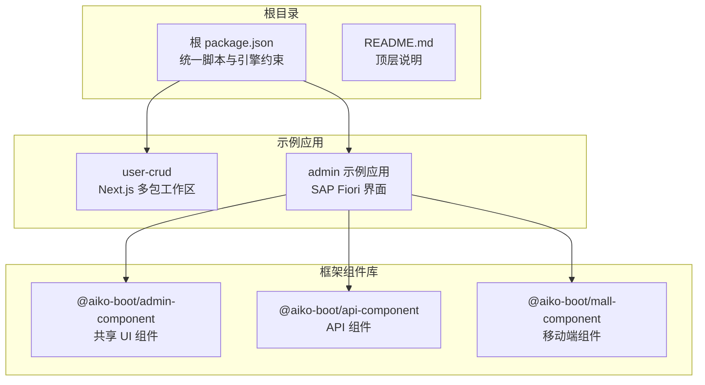
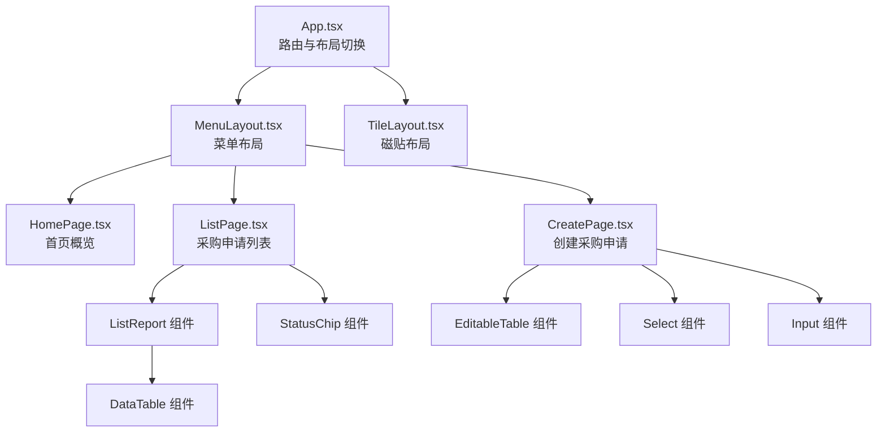
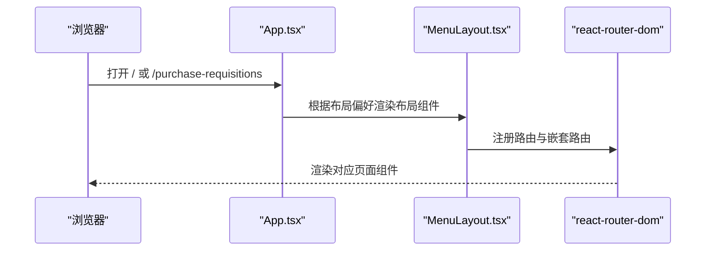
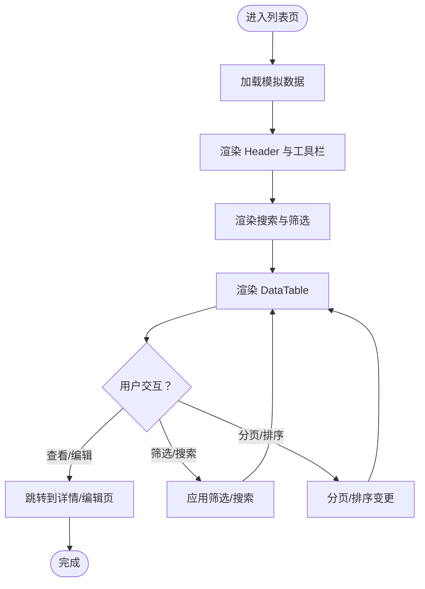
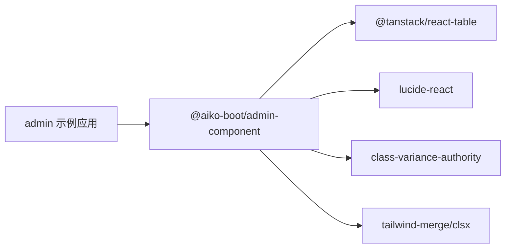

# 示例应用

<cite>
**本文引用的文件**
- [README.md](file://README.md)
- [package.json](file://package.json)
- [app/examples/user-crud/README.md](file://app/examples/user-crud/README.md)
- [app/examples/user-crud/package.json](file://app/examples/user-crud/package.json)
- [app/examples/admin/src/App.tsx](file://app/examples/admin/src/App.tsx)
- [app/examples/admin/src/pages/HomePage.tsx](file://app/examples/admin/src/pages/HomePage.tsx)
- [app/examples/admin/src/layouts/MenuLayout.tsx](file://app/examples/admin/src/layouts/MenuLayout.tsx)
- [app/examples/admin/src/pages/purchase-requisitions/CreatePage.tsx](file://app/examples/admin/src/pages/purchase-requisitions/CreatePage.tsx)
- [app/examples/admin/src/pages/purchase-requisitions/ListPage.tsx](file://app/examples/admin/src/pages/purchase-requisitions/ListPage.tsx)
- [app/framework/admin-component/src/index.ts](file://app/framework/admin-component/src/index.ts)
- [app/framework/admin-component/src/ui/data-table.tsx](file://app/framework/admin-component/src/ui/data-table.tsx)
- [app/framework/admin-component/src/ui/search-filter-bar.tsx](file://app/framework/admin-component/src/ui/search-filter-bar.tsx)
- [app/framework/admin-component/src/ui/status-chip.tsx](file://app/framework/admin-component/src/ui/status-chip.tsx)
- [app/framework/admin-component/src/utils.ts](file://app/framework/admin-component/src/utils.ts)
- [app/examples/admin/src/components/EditableTable/index.tsx](file://app/examples/admin/src/components/EditableTable/index.tsx)
- [app/examples/admin/src/components/ListReport/index.tsx](file://app/examples/admin/src/components/ListReport/index.tsx)
</cite>

## 目录
1. [简介](#简介)
2. [项目结构](#项目结构)
3. [核心组件](#核心组件)
4. [架构总览](#架构总览)
5. [详细组件分析](#详细组件分析)
6. [依赖分析](#依赖分析)
7. [性能考虑](#性能考虑)
8. [故障排查指南](#故障排查指南)
9. [结论](#结论)
10. [附录](#附录)

## 简介
本指南面向示例应用“示例应用”，聚焦以下两个子项目：
- user-crud 示例项目：基于 Next.js 的多包工作区，演示前后端协作与脚手架能力。
- admin 示例项目：基于 SAP Fiori 风格的复杂业务界面，涵盖采购申请、采购订单、收货管理、主数据与报表分析等模块。

文档将从项目结构、核心组件、架构设计、数据流与处理逻辑、集成点与错误处理、性能特性、故障排查到最佳实践与扩展建议进行全面阐述，帮助开发者快速理解并复用该框架的实际应用场景。

## 项目结构
整体采用 monorepo 结构，根目录提供统一的开发脚本与工程化配置；示例应用位于 app/examples 下，框架组件库位于 app/framework 下。



图表来源
- [package.json](file://package.json#L1-L32)
- [app/examples/user-crud/package.json](file://app/examples/user-crud/package.json#L1-L20)

章节来源
- [package.json](file://package.json#L1-L32)
- [app/examples/user-crud/package.json](file://app/examples/user-crud/package.json#L1-L20)

## 核心组件
本节梳理 admin 示例应用中的关键 UI 组件与共享库，它们共同支撑了 SAP Fiori 风格的复杂业务场景。

- 组件库入口与导出
  - 组件库通过统一入口导出基础组件、数据表格、状态标签、搜索筛选栏等，便于按需引入与复用。
- 数据表格组件
  - 基于 @tanstack/react-table 实现，支持排序、分页、选择、行点击、空态与加载态等。
- 搜索筛选栏组件
  - 提供搜索框、筛选展开/收起、应用/清除筛选、多字段类型（文本、单选、多选、日期、日期范围）渲染。
- 状态标签组件
  - 提供通用状态芯片与带映射的状态芯片，内置多种预设状态映射（如审批状态、采购申请状态）。
- 可编辑表格组件
  - 用于表单内嵌场景（如采购申请行项目），支持动态增删、必填标记、对齐与格式化显示。
- ListReport 组件
  - 一体化卡片风格的列表报告页面，封装 Header、工具栏、搜索筛选、数据表格与分页交互。

章节来源
- [app/framework/admin-component/src/index.ts](file://app/framework/admin-component/src/index.ts#L1-L38)
- [app/framework/admin-component/src/ui/data-table.tsx](file://app/framework/admin-component/src/ui/data-table.tsx#L1-L375)
- [app/framework/admin-component/src/ui/search-filter-bar.tsx](file://app/framework/admin-component/src/ui/search-filter-bar.tsx#L1-L276)
- [app/framework/admin-component/src/ui/status-chip.tsx](file://app/framework/admin-component/src/ui/status-chip.tsx#L1-L178)
- [app/examples/admin/src/components/EditableTable/index.tsx](file://app/examples/admin/src/components/EditableTable/index.tsx#L1-L308)
- [app/examples/admin/src/components/ListReport/index.tsx](file://app/examples/admin/src/components/ListReport/index.tsx#L1-L398)

## 架构总览
admin 示例应用采用“路由驱动 + 布局切换 + 组件库复用”的架构模式：
- 路由层：基于 react-router-dom 定义菜单与页面路径，支持两种布局模式（菜单布局/磁贴布局）。
- 布局层：MenuLayout/TileLayout 提供统一的 ShellBar 与侧边导航，支持布局模式切换与菜单展开/收起。
- 页面层：各业务页面（如采购申请列表、创建、查看、编辑）复用 ListReport/EditableTable 等组件。
- 组件库层：@aiko-boot/admin-component 提供可复用的 UI 组件与工具函数，保证一致的 Fiori 风格与交互体验。



图表来源
- [app/examples/admin/src/App.tsx](file://app/examples/admin/src/App.tsx#L72-L171)
- [app/examples/admin/src/layouts/MenuLayout.tsx](file://app/examples/admin/src/layouts/MenuLayout.tsx#L160-L421)
- [app/examples/admin/src/pages/HomePage.tsx](file://app/examples/admin/src/pages/HomePage.tsx#L120-L277)
- [app/examples/admin/src/pages/purchase-requisitions/ListPage.tsx](file://app/examples/admin/src/pages/purchase-requisitions/ListPage.tsx#L71-L271)
- [app/examples/admin/src/pages/purchase-requisitions/CreatePage.tsx](file://app/examples/admin/src/pages/purchase-requisitions/CreatePage.tsx#L103-L567)
- [app/examples/admin/src/components/ListReport/index.tsx](file://app/examples/admin/src/components/ListReport/index.tsx#L145-L398)
- [app/examples/admin/src/components/EditableTable/index.tsx](file://app/examples/admin/src/components/EditableTable/index.tsx#L54-L160)
- [app/framework/admin-component/src/ui/data-table.tsx](file://app/framework/admin-component/src/ui/data-table.tsx#L73-L375)
- [app/framework/admin-component/src/ui/status-chip.tsx](file://app/framework/admin-component/src/ui/status-chip.tsx#L63-L178)

## 详细组件分析

### 路由与布局（App 与 MenuLayout）
- App 负责根据本地存储的布局偏好决定使用菜单布局或磁贴布局，并在两种布局下挂载相同的页面集合。
- MenuLayout 提供侧边导航、分组菜单、子菜单连接线、展开/收起动画、面包屑与 ShellBar 集成。



图表来源
- [app/examples/admin/src/App.tsx](file://app/examples/admin/src/App.tsx#L72-L171)
- [app/examples/admin/src/layouts/MenuLayout.tsx](file://app/examples/admin/src/layouts/MenuLayout.tsx#L160-L421)

章节来源
- [app/examples/admin/src/App.tsx](file://app/examples/admin/src/App.tsx#L72-L171)
- [app/examples/admin/src/layouts/MenuLayout.tsx](file://app/examples/admin/src/layouts/MenuLayout.tsx#L160-L421)

### 首页概览（HomePage）
- 提供统计卡片、快捷操作、最近活动与待办提示，使用自定义 SVG 图标与渐变背景，体现 Fiori 风格。
- 通过路由跳转与交互按钮串联到具体业务页面。

章节来源
- [app/examples/admin/src/pages/HomePage.tsx](file://app/examples/admin/src/pages/HomePage.tsx#L120-L277)

### 采购申请列表（ListPage）
- 使用 ListReport 组件构建一体化页面，包含 Header、工具栏、搜索筛选、数据表格与分页。
- 支持状态标签、筛选条件与行操作（查看/编辑）。



图表来源
- [app/examples/admin/src/pages/purchase-requisitions/ListPage.tsx](file://app/examples/admin/src/pages/purchase-requisitions/ListPage.tsx#L71-L271)
- [app/examples/admin/src/components/ListReport/index.tsx](file://app/examples/admin/src/components/ListReport/index.tsx#L145-L398)
- [app/framework/admin-component/src/ui/data-table.tsx](file://app/framework/admin-component/src/ui/data-table.tsx#L73-L375)
- [app/framework/admin-component/src/ui/status-chip.tsx](file://app/framework/admin-component/src/ui/status-chip.tsx#L63-L178)

章节来源
- [app/examples/admin/src/pages/purchase-requisitions/ListPage.tsx](file://app/examples/admin/src/pages/purchase-requisitions/ListPage.tsx#L71-L271)

### 创建采购申请（CreatePage）
- 基于 SAP Fiori Create Object Page 设计，包含表头信息与可编辑行项目表格。
- 行项目表格支持动态增删、物料选择联动、数量/单价计算金额、底部合计行与底部固定操作栏。

```mermaid
sequenceDiagram
participant User as "用户"
participant Create as "CreatePage.tsx"
participant Table as "EditableTable 组件"
participant Utils as "辅助组件"
User->>Create : 填写表头信息
User->>Table : 添加/删除行项目
Table->>Utils : 选择物料/输入数量/单价
Utils-->>Table : 自动填充名称/单位/单价
Table-->>Create : 计算金额与合计
User->>Create : 保存/提交审批
Create-->>User : 跳转至列表页
```

图表来源
- [app/examples/admin/src/pages/purchase-requisitions/CreatePage.tsx](file://app/examples/admin/src/pages/purchase-requisitions/CreatePage.tsx#L103-L567)
- [app/examples/admin/src/components/EditableTable/index.tsx](file://app/examples/admin/src/components/EditableTable/index.tsx#L54-L160)

章节来源
- [app/examples/admin/src/pages/purchase-requisitions/CreatePage.tsx](file://app/examples/admin/src/pages/purchase-requisitions/CreatePage.tsx#L103-L567)

### 组件库与工具函数
- 组件库入口集中导出基础组件、数据表格、状态标签、搜索筛选栏等。
- 工具函数 cn 用于合并 Tailwind 类名，提升样式组合灵活性。

章节来源
- [app/framework/admin-component/src/index.ts](file://app/framework/admin-component/src/index.ts#L1-L38)
- [app/framework/admin-component/src/utils.ts](file://app/framework/admin-component/src/utils.ts#L1-L7)

## 依赖分析
- 组件库依赖
  - @aiko-boot/admin-component 作为 admin 示例应用的核心依赖，提供 ListReport、EditableTable、DataTable、StatusChip、SearchFilterBar 等组件。
- 外部依赖
  - @tanstack/react-table：数据表格核心实现。
  - lucide-react：图标库。
  - class-variance-authority/tailwind-merge/clsx：样式变体与类名合并。
- 脚本与工作区
  - 根与 user-crud 工作区均提供统一的开发、构建、启动与 lint 脚本，支持并行开发与跨包调试。



图表来源
- [app/framework/admin-component/src/ui/data-table.tsx](file://app/framework/admin-component/src/ui/data-table.tsx#L23-L26)
- [app/framework/admin-component/src/ui/search-filter-bar.tsx](file://app/framework/admin-component/src/ui/search-filter-bar.tsx#L6-L8)
- [app/framework/admin-component/src/ui/status-chip.tsx](file://app/framework/admin-component/src/ui/status-chip.tsx#L6-L7)

章节来源
- [app/framework/admin-component/src/ui/data-table.tsx](file://app/framework/admin-component/src/ui/data-table.tsx#L23-L26)
- [app/framework/admin-component/src/ui/search-filter-bar.tsx](file://app/framework/admin-component/src/ui/search-filter-bar.tsx#L6-L8)
- [app/framework/admin-component/src/ui/status-chip.tsx](file://app/framework/admin-component/src/ui/status-chip.tsx#L6-L7)
- [app/examples/user-crud/package.json](file://app/examples/user-crud/package.json#L5-L14)

## 性能考虑
- 列表渲染与交互
  - DataTable 支持手动分页与排序回调，避免一次性渲染大量数据导致的卡顿。
  - 列对齐与最小宽度控制，减少重排与滚动抖动。
- 表单内嵌表格
  - EditableTable 在行项目较少时可显著降低 DOM 节点数量，提升交互流畅度。
- 样式与类名
  - 使用 cn 合并类名，减少重复样式与不必要的覆盖，提升渲染效率。
- 脚本与并发
  - 工作区脚本支持并行开发，缩短等待时间；生产构建按包拆分，便于增量编译与缓存。

## 故障排查指南
- 路由与布局问题
  - 若布局切换无效，检查本地存储键值与 MenuLayout 的状态同步逻辑。
  - 若菜单项高亮不正确，检查 isActive/isParentActive 的路径匹配规则。
- 表格与筛选
  - 若筛选条件未生效，确认 onFilterChange/onApply 回调是否正确传递到 ListReport。
  - 若分页异常，检查 totalCount 与 pageSize 的计算与传入。
- 表单与联动
  - 若物料选择后未自动填充，检查 EditableTable 的列定义与 updateLineItem 的字段映射。
  - 若金额未更新，确认数量/单价变更触发了金额计算逻辑。
- 组件样式
  - 若样式错乱，检查 cn 的类名合并顺序与 Tailwind 配置是否正确。

章节来源
- [app/examples/admin/src/layouts/MenuLayout.tsx](file://app/examples/admin/src/layouts/MenuLayout.tsx#L171-L183)
- [app/examples/admin/src/pages/purchase-requisitions/CreatePage.tsx](file://app/examples/admin/src/pages/purchase-requisitions/CreatePage.tsx#L160-L187)
- [app/examples/admin/src/components/ListReport/index.tsx](file://app/examples/admin/src/components/ListReport/index.tsx#L179-L188)

## 结论
本示例应用通过清晰的项目结构、可复用的组件库与一致的 SAP Fiori 风格，展示了从首页概览到复杂业务流程（采购申请、采购订单、收货管理、主数据与报表）的完整实现路径。开发者可直接复用组件库与页面模板，快速搭建企业级管理界面，并在此基础上扩展更多业务场景。

## 附录

### 运行步骤（user-crud 示例）
- 进入工作区根目录，安装依赖并启动所有包：
  - 开发模式：执行工作区脚本以并行启动 API、管理端与移动端服务。
  - API/管理端/移动端单独启动：使用对应脚本分别启动。
- 打开浏览器访问默认地址，查看示例页面。

章节来源
- [app/examples/user-crud/README.md](file://app/examples/user-crud/README.md#L3-L15)
- [app/examples/user-crud/package.json](file://app/examples/user-crud/package.json#L5-L14)

### 最佳实践与开发模式
- 组件复用
  - 优先使用 @aiko-boot/admin-component 提供的组件，保持一致的交互与视觉规范。
- 页面组织
  - 以 ListReport/EditableTable 为核心页面模板，按业务场景扩展 Header、工具栏与筛选区域。
- 状态管理
  - 使用受控组件与状态钩子管理表单与表格数据，确保联动逻辑清晰可维护。
- 样式与主题
  - 基于 cn 合并类名，结合 Tailwind 配置，统一风格与响应式表现。
- 脚本与工作区
  - 使用工作区脚本统一管理开发、构建与测试，提高团队协作效率。

### 扩展与定制建议
- 新增页面
  - 基于 ListReport/EditableTable 快速搭建新页面，按需扩展筛选、工具栏与操作按钮。
- 自定义组件
  - 在 @aiko-boot/admin-component 中新增或扩展组件，遵循现有接口与类型定义。
- 业务流程
  - 将流程拆分为多个页面（创建/查看/编辑/审批），并通过路由与面包屑串联。
- 数据与接口
  - 将模拟数据替换为真实 API 请求，结合分页、排序与筛选回调完善数据流。