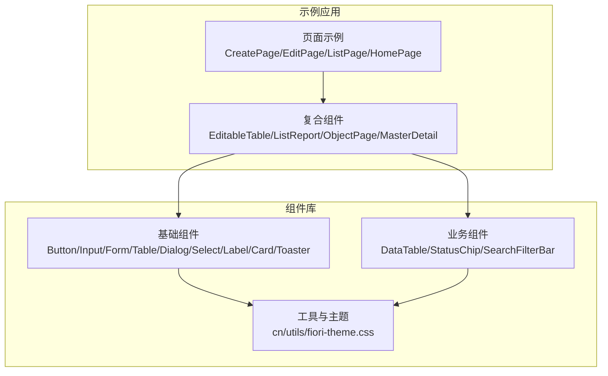
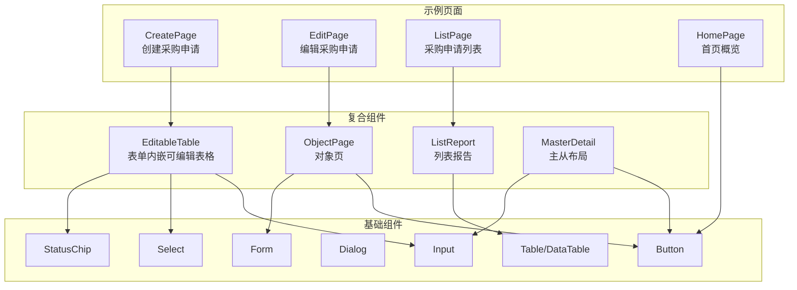
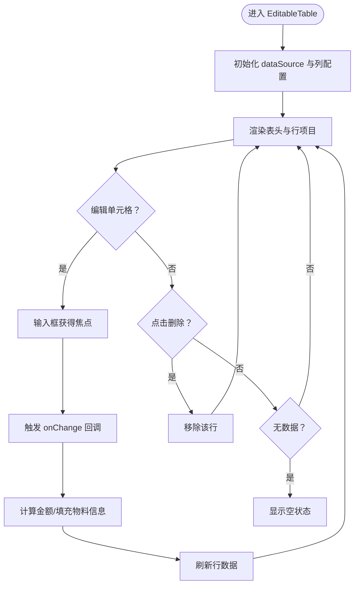
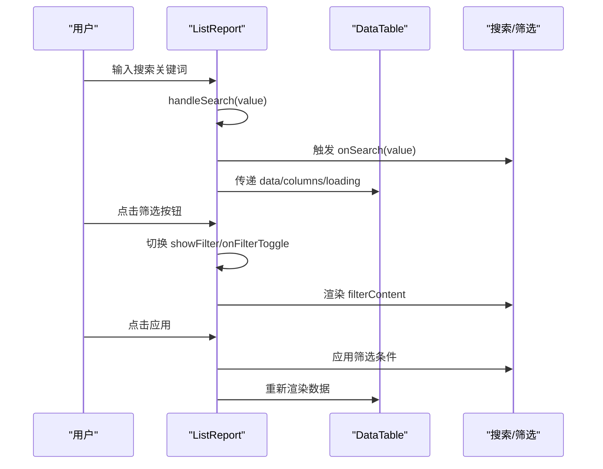
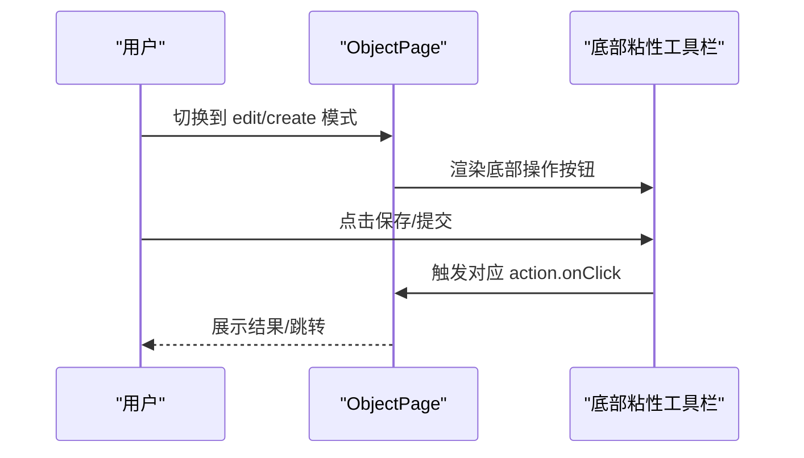
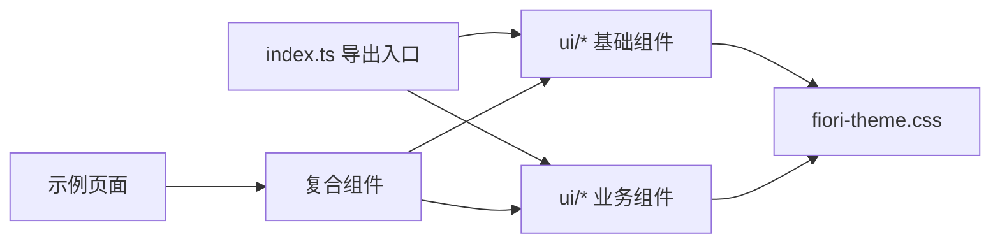

# UI 组件库使用

<cite>
**本文引用的文件**
- [app/framework/admin-component/src/ui/button.tsx](file://app/framework/admin-component/src/ui/button.tsx)
- [app/framework/admin-component/src/ui/input.tsx](file://app/framework/admin-component/src/ui/input.tsx)
- [app/framework/admin-component/src/ui/form.tsx](file://app/framework/admin-component/src/ui/form.tsx)
- [app/framework/admin-component/src/ui/table.tsx](file://app/framework/admin-component/src/ui/table.tsx)
- [app/framework/admin-component/src/ui/dialog.tsx](file://app/framework/admin-component/src/ui/dialog.tsx)
- [app/framework/admin-component/src/ui/select.tsx](file://app/framework/admin-component/src/ui/select.tsx)
- [app/framework/admin-component/src/ui/status-chip.tsx](file://app/framework/admin-component/src/ui/status-chip.tsx)
- [app/framework/admin-component/src/ui/data-table.tsx](file://app/framework/admin-component/src/ui/data-table.tsx)
- [app/framework/admin-component/src/styles/fiori-theme.css](file://app/framework/admin-component/src/styles/fiori-theme.css)
- [app/framework/admin-component/src/index.ts](file://app/framework/admin-component/src/index.ts)
- [app/examples/admin/src/components/EditableTable/index.tsx](file://app/examples/admin/src/components/EditableTable/index.tsx)
- [app/examples/admin/src/components/ListReport/index.tsx](file://app/examples/admin/src/components/ListReport/index.tsx)
- [app/examples/admin/src/components/MasterDetail/index.tsx](file://app/examples/admin/src/components/MasterDetail/index.tsx)
- [app/examples/admin/src/components/ObjectPage/index.tsx](file://app/examples/admin/src/components/ObjectPage/index.tsx)
- [app/examples/admin/src/pages/purchase-requisitions/CreatePage.tsx](file://app/examples/admin/src/pages/purchase-requisitions/CreatePage.tsx)
- [app/examples/admin/src/pages/purchase-requisitions/EditPage.tsx](file://app/examples/admin/src/pages/purchase-requisitions/EditPage.tsx)
- [app/examples/admin/src/pages/purchase-requisitions/ListPage.tsx](file://app/examples/admin/src/pages/purchase-requisitions/ListPage.tsx)
- [app/examples/admin/src/pages/HomePage.tsx](file://app/examples/admin/src/pages/HomePage.tsx)
</cite>

## 目录
1. [简介](#简介)
2. [项目结构](#项目结构)
3. [核心组件](#核心组件)
4. [架构总览](#架构总览)
5. [详细组件分析](#详细组件分析)
6. [依赖关系分析](#依赖关系分析)
7. [性能考量](#性能考量)
8. [故障排查指南](#故障排查指南)
9. [结论](#结论)
10. [附录](#附录)

## 简介
本指南面向使用基于 SAP Fiori 设计规范的 UI 组件库的开发者与产品团队，系统讲解基础组件（Button、Input、Form、Table 等）与复合组件（ListReport、ObjectPage、MasterDetail、EditableTable 等）的属性配置、事件处理、样式定制与主题适配；并通过真实页面示例展示表单验证、数据表格、对话框、状态指示器等常见 UI 场景的使用方式；同时覆盖可访问性、响应式布局与国际化支持建议，以及组件组合最佳实践与自定义扩展方法。

## 项目结构
组件库位于 app/framework/admin-component，采用“基础组件 + 业务复合组件”的分层组织：
- 基础组件：Button、Input、Form、Table、Dialog、Select、Label、Card、Toaster 等
- 业务复合组件：DataTable、StatusChip、SearchFilterBar、EditableTable、ListReport、ObjectPage、MasterDetail 等
- 主题系统：基于 Fiori Morning/Evening 主题变量，映射至 shadcn 变量体系
- 示例应用：app/examples/admin 展示各组件在实际页面中的组合使用

图表来源
- [app/framework/admin-component/src/index.ts](file://app/framework/admin-component/src/index.ts#L1-L38)
- [app/framework/admin-component/src/styles/fiori-theme.css](file://app/framework/admin-component/src/styles/fiori-theme.css#L1-L140)

章节来源
- [app/framework/admin-component/src/index.ts](file://app/framework/admin-component/src/index.ts#L1-L38)
- [app/framework/admin-component/src/styles/fiori-theme.css](file://app/framework/admin-component/src/styles/fiori-theme.css#L1-L140)

## 核心组件
本节聚焦基础组件与主题系统，说明其能力边界与使用要点。

- Button
  - 变体：default、destructive、outline、secondary、ghost、link
  - 尺寸：default、xs、sm、lg、icon、icon-xs、icon-sm、icon-lg
  - 支持 asChild、禁用态、聚焦态与错误态视觉反馈
  - 适用场景：主次操作、链接、图标按钮、危险操作
  章节来源
  - [app/framework/admin-component/src/ui/button.tsx](file://app/framework/admin-component/src/ui/button.tsx#L1-L65)

- Input
  - 提供统一的输入框样式与交互反馈（聚焦、禁用、错误态）
  - 适用场景：文本、数字、日期等基础输入
  章节来源
  - [app/framework/admin-component/src/ui/input.tsx](file://app/framework/admin-component/src/ui/input.tsx#L1-L22)

- Form（基于 react-hook-form）
  - 提供 Form、FormItem、FormLabel、FormControl、FormDescription、FormMessage、FormField、useFormField
  - 与 Input/Button 等组件配合实现表单校验与可访问性
  章节来源
  - [app/framework/admin-component/src/ui/form.tsx](file://app/framework/admin-component/src/ui/form.tsx#L1-L168)

- Table（表格容器与子组件）
  - Table、TableHeader、TableBody、TableFooter、TableHead、TableRow、TableCell、TableCaption
  - 适用于简单表格或与 DataTable 组合使用
  章节来源
  - [app/framework/admin-component/src/ui/table.tsx](file://app/framework/admin-component/src/ui/table.tsx#L1-L117)

- Dialog（基于 Radix UI）
  - Dialog、DialogTrigger、DialogPortal、DialogOverlay、DialogContent、DialogHeader、DialogFooter、DialogTitle、DialogDescription、DialogClose
  - 支持关闭按钮显隐、动画与无障碍
  章节来源
  - [app/framework/admin-component/src/ui/dialog.tsx](file://app/framework/admin-component/src/ui/dialog.tsx#L1-L159)

- Select（下拉选择）
  - 支持占位符、禁用、选项渲染、受控/非受控
  - 内部处理空值占位符转换，避免 Radix UI 的空字符串限制
  章节来源
  - [app/framework/admin-component/src/ui/select.tsx](file://app/framework/admin-component/src/ui/select.tsx#L1-L154)

- DataTable（数据表格）
  - 基于 @tanstack/react-table，支持排序、分页、选择、加载态、行点击/双击、对齐与自定义列
  - 适用场景：复杂数据列表、带筛选/分页/排序的数据面板
  章节来源
  - [app/framework/admin-component/src/ui/data-table.tsx](file://app/framework/admin-component/src/ui/data-table.tsx#L1-L375)

- StatusChip（状态标签）
  - 支持多种语义变体（default/primary/secondary/success/warning/error/info）与描边、尺寸
  - 提供映射状态组件 MappedStatusChip 与预设状态映射（如审批、采购申请）
  章节来源
  - [app/framework/admin-component/src/ui/status-chip.tsx](file://app/framework/admin-component/src/ui/status-chip.tsx#L1-L178)

- 主题系统（Fiori）
  - 定义 Morning Horizon 与 Evening Horizon 色板，映射到 shadcn 变量
  - 提供圆角与阴影变量，支持暗色模式
  章节来源
  - [app/framework/admin-component/src/styles/fiori-theme.css](file://app/framework/admin-component/src/styles/fiori-theme.css#L1-L140)

## 架构总览
组件库以“基础组件 + 业务组件 + 主题系统”为核心，示例应用通过复合组件组合实现 Fiori 风格的页面布局与交互。

图表来源
- [app/examples/admin/src/pages/purchase-requisitions/CreatePage.tsx](file://app/examples/admin/src/pages/purchase-requisitions/CreatePage.tsx#L1-L200)
- [app/examples/admin/src/pages/purchase-requisitions/EditPage.tsx](file://app/examples/admin/src/pages/purchase-requisitions/EditPage.tsx#L1-L200)
- [app/examples/admin/src/pages/purchase-requisitions/ListPage.tsx](file://app/examples/admin/src/pages/purchase-requisitions/ListPage.tsx#L1-L200)
- [app/examples/admin/src/pages/HomePage.tsx](file://app/examples/admin/src/pages/HomePage.tsx#L1-L200)
- [app/examples/admin/src/components/EditableTable/index.tsx](file://app/examples/admin/src/components/EditableTable/index.tsx#L1-L308)
- [app/examples/admin/src/components/ListReport/index.tsx](file://app/examples/admin/src/components/ListReport/index.tsx#L1-L398)
- [app/examples/admin/src/components/ObjectPage/index.tsx](file://app/examples/admin/src/components/ObjectPage/index.tsx#L1-L544)
- [app/examples/admin/src/components/MasterDetail/index.tsx](file://app/examples/admin/src/components/MasterDetail/index.tsx#L1-L498)

## 详细组件分析

### 基础组件：Button、Input、Form、Table、Dialog、Select
- Button
  - 变体与尺寸组合满足不同层级操作；支持 SVG 图标与聚焦态 ring
  - 适合与 Dialog、Form 控件组合使用
  章节来源
  - [app/framework/admin-component/src/ui/button.tsx](file://app/framework/admin-component/src/ui/button.tsx#L1-L65)

- Input
  - 统一的边框、圆角、阴影与聚焦态；支持 aria-invalid 错误态
  章节来源
  - [app/framework/admin-component/src/ui/input.tsx](file://app/framework/admin-component/src/ui/input.tsx#L1-L22)

- Form
  - 通过 FormProvider、FormField、useFormField 管理字段状态与可访问性属性
  - 与 Input、Label、FormMessage 协作实现表单验证与错误提示
  章节来源
  - [app/framework/admin-component/src/ui/form.tsx](file://app/framework/admin-component/src/ui/form.tsx#L1-L168)

- Table
  - 提供表格容器与子元素，适合轻量表格或与 DataTable 组合
  章节来源
  - [app/framework/admin-component/src/ui/table.tsx](file://app/framework/admin-component/src/ui/table.tsx#L1-L117)

- Dialog
  - Portal + Overlay + Content + Title/Description/Footer 组合，支持关闭按钮与动画
  章节来源
  - [app/framework/admin-component/src/ui/dialog.tsx](file://app/framework/admin-component/src/ui/dialog.tsx#L1-L159)

- Select
  - 内部值与外部值的空值占位符转换，保证与受控场景兼容
  章节来源
  - [app/framework/admin-component/src/ui/select.tsx](file://app/framework/admin-component/src/ui/select.tsx#L1-L154)

### 业务组件：DataTable、StatusChip、EditableTable、ListReport、ObjectPage、MasterDetail

#### DataTable
- 能力：排序、分页、选择、加载态、行点击/双击、列对齐、自定义列渲染
- 适用：复杂数据面板、报表、管理后台
- 性能：虚拟化与手动分页由外部传入 totalCount/pageSize 控制
- 章节来源
  - [app/framework/admin-component/src/ui/data-table.tsx](file://app/framework/admin-component/src/ui/data-table.tsx#L1-L375)

#### StatusChip
- 能力：多语义变体、描边、尺寸、悬停提示
- 适用：状态标签、审批流程、指标展示
- 章节来源
  - [app/framework/admin-component/src/ui/status-chip.tsx](file://app/framework/admin-component/src/ui/status-chip.tsx#L1-L178)

#### EditableTable（表单内嵌可编辑表格）
- 能力：列配置、行键、表头/表尾、嵌入模式、表格输入/选择/文本/删除按钮/汇总行
- 适用：表单内的行项目编辑（如采购申请明细）
- 章节来源
  - [app/examples/admin/src/components/EditableTable/index.tsx](file://app/examples/admin/src/components/EditableTable/index.tsx#L1-L308)

#### ListReport（列表报告）
- 能力：Header、工具栏、搜索/筛选、数据表格、分页、行选择、批量操作
- 适用：列表页的一体化卡片风格（Header + Toolbar + 搜索筛选 + DataTable）
- 章节来源
  - [app/examples/admin/src/components/ListReport/index.tsx](file://app/examples/admin/src/components/ListReport/index.tsx#L1-L398)

#### ObjectPage（对象页）
- 能力：display/edit/create 三种模式、Section 导航、KPI 指标、操作按钮、粘性底部工具栏
- 适用：详情页、编辑页、创建页
- 章节来源
  - [app/examples/admin/src/components/ObjectPage/index.tsx](file://app/examples/admin/src/components/ObjectPage/index.tsx#L1-L544)

#### MasterDetail（主从布局）
- 能力：Master 列表 + Detail 详情、搜索、编辑模式、删除确认对话框
- 适用：主从数据浏览与编辑
- 章节来源
  - [app/examples/admin/src/components/MasterDetail/index.tsx](file://app/examples/admin/src/components/MasterDetail/index.tsx#L1-L498)

### 复杂逻辑流程图：EditableTable 行项目编辑

图表来源
- [app/examples/admin/src/components/EditableTable/index.tsx](file://app/examples/admin/src/components/EditableTable/index.tsx#L1-L308)

### 交互序列图：ListReport 搜索与筛选

图表来源
- [app/examples/admin/src/components/ListReport/index.tsx](file://app/examples/admin/src/components/ListReport/index.tsx#L1-L398)

### 交互序列图：ObjectPage 操作按钮与粘性底部栏

图表来源
- [app/examples/admin/src/components/ObjectPage/index.tsx](file://app/examples/admin/src/components/ObjectPage/index.tsx#L1-L544)

## 依赖关系分析
- 组件库导出入口集中于 index.ts，统一暴露工具函数与组件
- 复合组件依赖基础组件与业务组件，形成清晰的分层
- 主题系统通过 CSS 变量与 shadcn 变量映射，确保全局一致性

图表来源
- [app/framework/admin-component/src/index.ts](file://app/framework/admin-component/src/index.ts#L1-L38)
- [app/framework/admin-component/src/styles/fiori-theme.css](file://app/framework/admin-component/src/styles/fiori-theme.css#L1-L140)

章节来源
- [app/framework/admin-component/src/index.ts](file://app/framework/admin-component/src/index.ts#L1-L38)

## 性能考量
- DataTable
  - 使用 manualPagination 与 totalCount 控制分页，避免全量渲染
  - 排序与分页回调按需触发，减少不必要的重渲染
- EditableTable
  - 通过最小宽度与嵌入模式控制滚动与布局开销
  - 行键使用 rowKey 或索引，避免重复渲染
- 主题系统
  - CSS 变量集中管理，减少样式计算与重绘
- 建议
  - 大数据量场景优先使用 DataTable 并开启服务端分页/排序
  - 表单内嵌表格尽量使用受控组件与精确的 key 设置

## 故障排查指南
- 表单校验未生效
  - 检查 Form、FormField、useFormField 的包裹层级是否正确
  - 确认 FormControl 的 aria-describedby 与 aria-invalid 是否按约定设置
  章节来源
  - [app/framework/admin-component/src/ui/form.tsx](file://app/framework/admin-component/src/ui/form.tsx#L1-L168)

- Select 空值异常
  - 确认外部传入空字符串时内部已做占位符转换
  章节来源
  - [app/framework/admin-component/src/ui/select.tsx](file://app/framework/admin-component/src/ui/select.tsx#L1-L154)

- Dialog 关闭后焦点丢失
  - 确保 DialogTrigger 与 DialogContent 的组合使用，必要时手动管理焦点
  章节来源
  - [app/framework/admin-component/src/ui/dialog.tsx](file://app/framework/admin-component/src/ui/dialog.tsx#L1-L159)

- DataTable 排序/分页不触发
  - 检查 onSortChange/onPaginationChange 是否传入，manualPagination 与 pageCount 的配合
  章节来源
  - [app/framework/admin-component/src/ui/data-table.tsx](file://app/framework/admin-component/src/ui/data-table.tsx#L1-L375)

## 结论
本组件库以 SAP Fiori 设计语言为基础，结合 shadcn 主题变量与 @tanstack/react-table，提供了从基础到复合的完整 UI 能力。通过示例页面可以看到组件在表单、列表、详情、主从等典型场景中的组合使用方式。建议在实际项目中遵循以下原则：
- 优先使用 DataTable 处理大数据与复杂交互
- 使用 Form + Input/Select 确保表单可访问性与一致性
- 使用 StatusChip 与主题变量统一状态与色彩
- 通过复合组件快速搭建 Fiori 风格页面

## 附录

### 常见使用场景与示例路径
- 表单验证与提交
  - 示例页面：[CreatePage](file://app/examples/admin/src/pages/purchase-requisitions/CreatePage.tsx#L1-L200)
  - 组件组合：Form + Input + Button + Select
- 数据表格与分页
  - 示例页面：[ListPage](file://app/examples/admin/src/pages/purchase-requisitions/ListPage.tsx#L1-L200)
  - 组件组合：ListReport + DataTable
- 对话框与确认
  - 示例页面：[MasterDetail 删除确认](file://app/examples/admin/src/components/MasterDetail/index.tsx#L327-L352)
  - 组件组合：Dialog + Button
- 状态指示器
  - 示例页面：[ListPage 状态列](file://app/examples/admin/src/pages/purchase-requisitions/ListPage.tsx#L134-L149)
  - 组件组合：StatusChip
- 对象页与粘性底部栏
  - 示例页面：[ObjectPage](file://app/examples/admin/src/components/ObjectPage/index.tsx#L426-L492)
  - 组件组合：ObjectPage + Button

### 可访问性、响应式与国际化建议
- 可访问性
  - 使用 Form 的 aria 属性与 Label 关联，确保屏幕阅读器友好
  - Dialog 提供关闭按钮与 Portal，确保键盘可达
- 响应式
  - 基于 Tailwind 类名与组件容器（如 Table 容器）实现自适应
- 国际化
  - 文案与格式化（如金额）建议通过 i18n 注入，保持与组件解耦