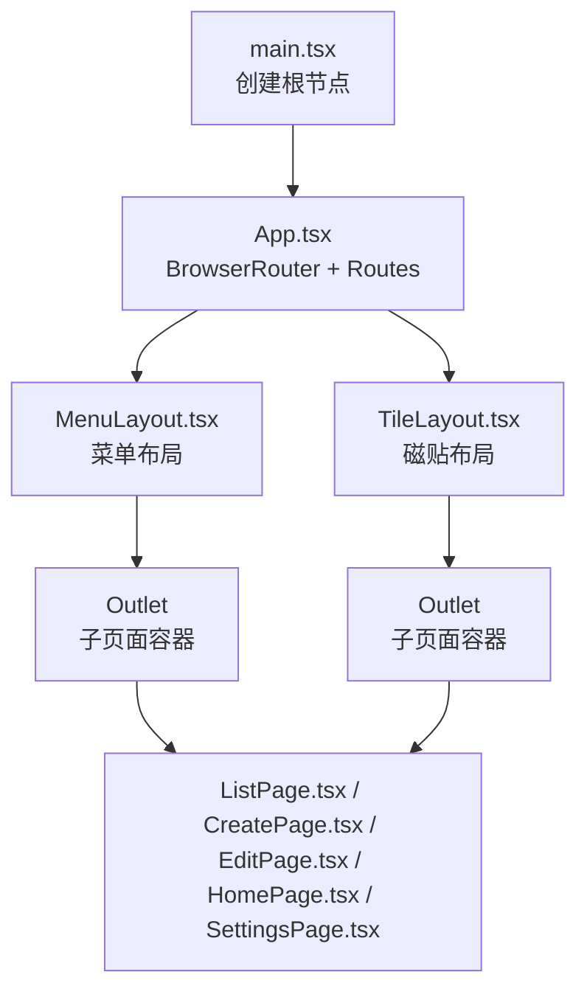
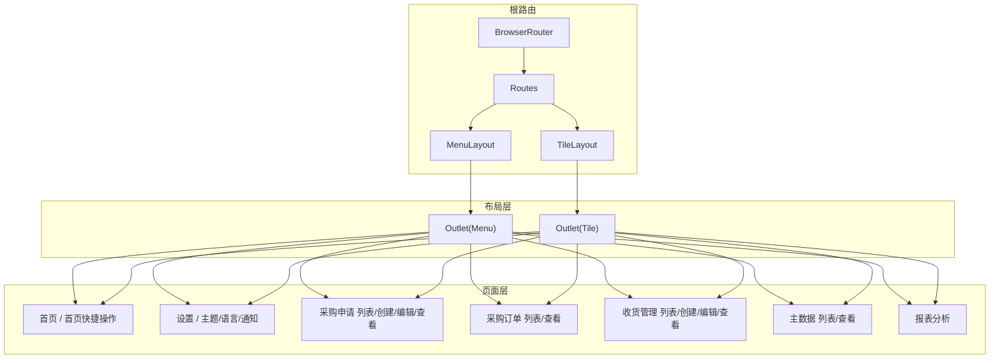
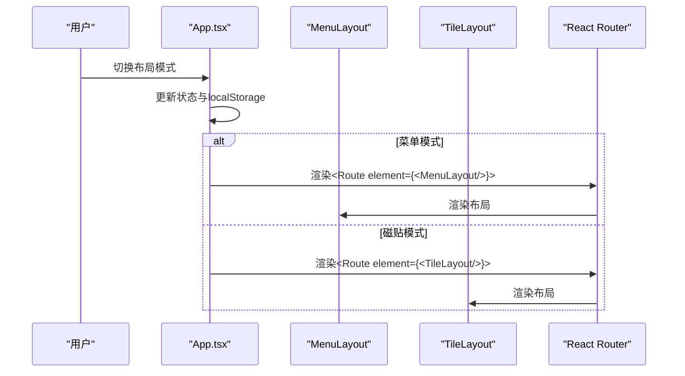
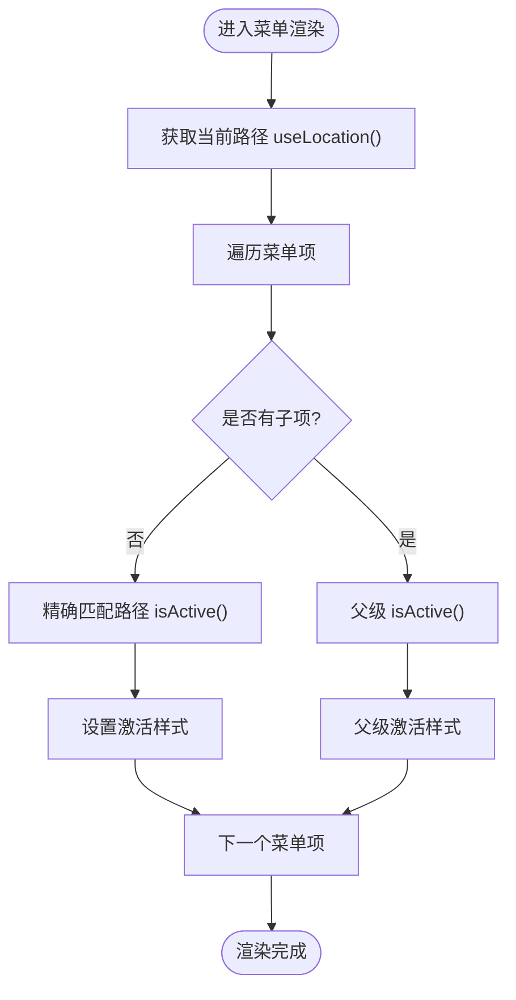
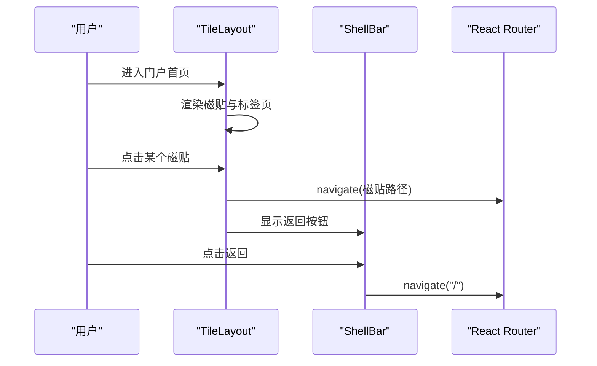
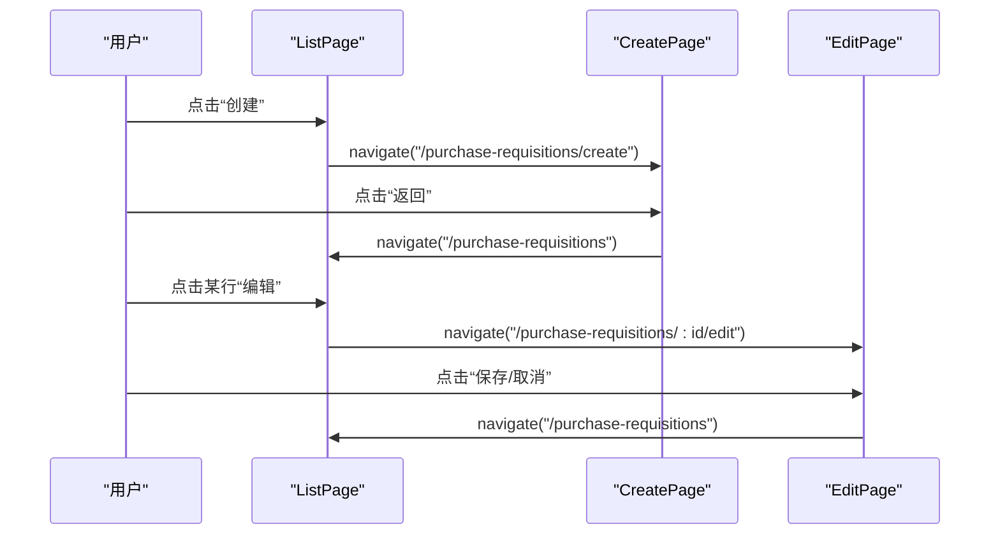
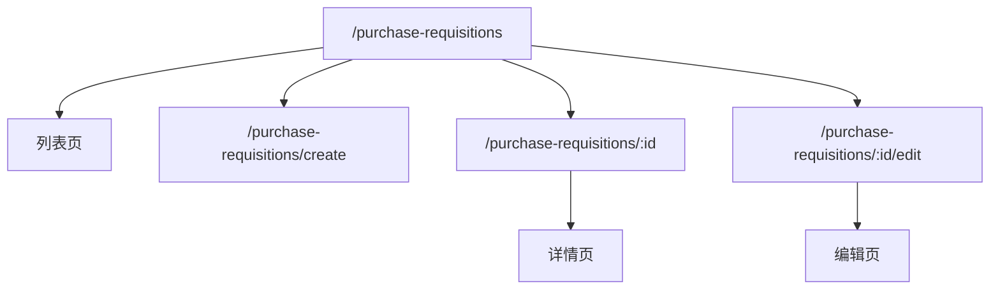
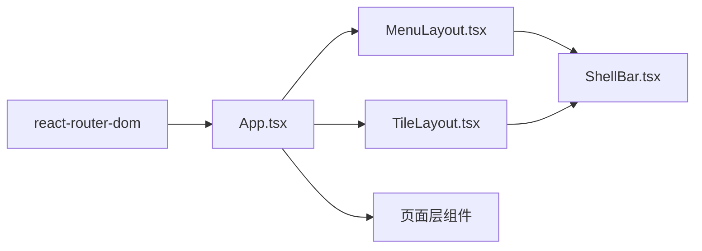

# 导航和路由

<cite>
**本文引用的文件**
- [App.tsx](file://app/examples/admin/src/App.tsx)
- [main.tsx](file://app/examples/admin/src/main.tsx)
- [MenuLayout.tsx](file://app/examples/admin/src/layouts/MenuLayout.tsx)
- [TileLayout.tsx](file://app/examples/admin/src/layouts/TileLayout.tsx)
- [ShellBar.tsx](file://app/examples/admin/src/components/ShellBar.tsx)
- [HomePage.tsx](file://app/examples/admin/src/pages/HomePage.tsx)
- [SettingsPage.tsx](file://app/examples/admin/src/pages/SettingsPage.tsx)
- [ListPage.tsx](file://app/examples/admin/src/pages/purchase-requisitions/ListPage.tsx)
- [CreatePage.tsx](file://app/examples/admin/src/pages/purchase-requisitions/CreatePage.tsx)
- [EditPage.tsx](file://app/examples/admin/src/pages/purchase-requisitions/EditPage.tsx)
- [package.json](file://app/examples/admin/package.json)
</cite>

## 目录
1. [简介](#简介)
2. [项目结构](#项目结构)
3. [核心组件](#核心组件)
4. [架构总览](#架构总览)
5. [详细组件分析](#详细组件分析)
6. [依赖关系分析](#依赖关系分析)
7. [性能考虑](#性能考虑)
8. [故障排查指南](#故障排查指南)
9. [结论](#结论)
10. [附录](#附录)

## 简介
本指南围绕基于 React Router 的导航与路由系统，结合示例应用的菜单布局与磁贴布局，系统讲解以下主题：
- 路由配置与嵌套路由
- 动态路由参数与路径匹配
- 布局系统集成与导航状态管理
- 面包屑导航与活动状态管理
- 路由懒加载与性能优化
- 路由调试技巧与常见问题

该示例采用 BrowserRouter + Routes + Route 的组合，通过顶层布局组件承载菜单或磁贴两种导航模式，并在布局内部使用 Outlet 承载子路由页面。

## 项目结构
示例应用位于 app/examples/admin，核心路由与布局如下：
- 入口渲染：main.tsx 渲染 App
- 应用根路由：App.tsx 定义 BrowserRouter、Routes 与路由表
- 布局层：MenuLayout（菜单式）与 TileLayout（磁贴式），均通过 Outlet 承载子页面
- 页面层：各业务页面（如采购申请列表、创建、编辑、首页、设置等）

图表来源
- [main.tsx](file://app/examples/admin/src/main.tsx#L1-L11)
- [App.tsx](file://app/examples/admin/src/App.tsx#L88-L171)
- [MenuLayout.tsx](file://app/examples/admin/src/layouts/MenuLayout.tsx#L411-L417)
- [TileLayout.tsx](file://app/examples/admin/src/layouts/TileLayout.tsx#L321-L326)

章节来源
- [main.tsx](file://app/examples/admin/src/main.tsx#L1-L11)
- [App.tsx](file://app/examples/admin/src/App.tsx#L88-L171)

## 核心组件
- App 根路由与布局切换
  - 使用本地存储持久化布局模式（菜单/磁贴），根据模式渲染对应布局根路由
  - 路由表覆盖首页、采购申请、采购订单、收货管理、主数据、报表、设置等
  - 通配符路由重定向到首页，保证未知路径安全
- MenuLayout 菜单布局
  - 侧边菜单树形结构，支持分组与折叠
  - 基于 useLocation 的活动状态判断，支持父级激活态联动
  - 通过 Link 实现导航，支持徽标与层级样式
- TileLayout 磁贴布局
  - 首页作为门户，提供应用磁贴与分类浏览
  - 非首页时显示 ShellBar 返回按钮，返回门户
  - 支持收藏、最近使用、搜索过滤
- ShellBar 顶部工具栏
  - 提供布局切换、通知、帮助、用户菜单
  - 支持返回按钮与回调
- 页面导航与面包屑
  - 首页与设置页面展示基于 useNavigate 的程序化导航
  - 采购申请对象页（创建/编辑）展示面包屑导航与状态标签

章节来源
- [App.tsx](file://app/examples/admin/src/App.tsx#L72-L171)
- [MenuLayout.tsx](file://app/examples/admin/src/layouts/MenuLayout.tsx#L160-L421)
- [TileLayout.tsx](file://app/examples/admin/src/layouts/TileLayout.tsx#L200-L454)
- [ShellBar.tsx](file://app/examples/admin/src/components/ShellBar.tsx#L91-L299)
- [HomePage.tsx](file://app/examples/admin/src/pages/HomePage.tsx#L120-L277)
- [SettingsPage.tsx](file://app/examples/admin/src/pages/SettingsPage.tsx#L112-L318)
- [ListPage.tsx](file://app/examples/admin/src/pages/purchase-requisitions/ListPage.tsx#L71-L271)
- [CreatePage.tsx](file://app/examples/admin/src/pages/purchase-requisitions/CreatePage.tsx#L103-L567)
- [EditPage.tsx](file://app/examples/admin/src/pages/purchase-requisitions/EditPage.tsx#L142-L643)

## 架构总览
整体架构采用“根路由 + 布局层 + 页面层”的三层结构：
- 根路由负责环境与全局路由表
- 布局层负责导航与容器，决定页面呈现形态
- 页面层负责具体业务逻辑与交互

图表来源
- [App.tsx](file://app/examples/admin/src/App.tsx#L88-L171)
- [MenuLayout.tsx](file://app/examples/admin/src/layouts/MenuLayout.tsx#L411-L417)
- [TileLayout.tsx](file://app/examples/admin/src/layouts/TileLayout.tsx#L321-L326)

## 详细组件分析

### 根路由与嵌套路由
- 根路由使用 BrowserRouter 包裹 Routes，Routes 内部按布局模式分支：
  - 菜单模式：根路由包裹 MenuLayout，子路由直接挂载在 Routes 下
  - 磁贴模式：根路由包裹 TileLayout，子路由同样挂载在 Routes 下
- 通配符路由统一跳转首页，确保未知路径安全
- 布局切换通过 App 状态与本地存储实现，切换后不刷新页面

图表来源
- [App.tsx](file://app/examples/admin/src/App.tsx#L72-L86)
- [App.tsx](file://app/examples/admin/src/App.tsx#L88-L171)

章节来源
- [App.tsx](file://app/examples/admin/src/App.tsx#L72-L171)

### 菜单布局与活动状态管理
- 菜单数据结构支持分组与子项，支持徽标与图标
- 活动状态判断：
  - 精确匹配根路径
  - 前缀匹配子路径（如 /purchase-requisitions 开头的所有子路由）
  - 父级激活联动（任一子项激活则父级高亮）
- 通过 Link 组件实现导航，支持层级缩进与视觉反馈

图表来源
- [MenuLayout.tsx](file://app/examples/admin/src/layouts/MenuLayout.tsx#L160-L183)
- [MenuLayout.tsx](file://app/examples/admin/src/layouts/MenuLayout.tsx#L185-L319)

章节来源
- [MenuLayout.tsx](file://app/examples/admin/src/layouts/MenuLayout.tsx#L91-L183)
- [MenuLayout.tsx](file://app/examples/admin/src/layouts/MenuLayout.tsx#L185-L319)

### 磁贴布局与门户导航
- 首页作为门户，提供收藏、最近使用、分类浏览三种视图
- 非首页时显示返回按钮，返回门户
- 支持搜索过滤与分类聚合

图表来源
- [TileLayout.tsx](file://app/examples/admin/src/layouts/TileLayout.tsx#L200-L326)
- [ShellBar.tsx](file://app/examples/admin/src/components/ShellBar.tsx#L91-L117)

章节来源
- [TileLayout.tsx](file://app/examples/admin/src/layouts/TileLayout.tsx#L200-L454)
- [ShellBar.tsx](file://app/examples/admin/src/components/ShellBar.tsx#L91-L299)

### 页面导航与面包屑
- 首页与设置页面使用 useNavigate 进行程序化导航
- 采购申请对象页（创建/编辑）展示面包屑导航，清晰指示上下文路径
- 列表页通过点击行或操作按钮进入详情/编辑页，保持导航连贯性

图表来源
- [ListPage.tsx](file://app/examples/admin/src/pages/purchase-requisitions/ListPage.tsx#L173-L191)
- [CreatePage.tsx](file://app/examples/admin/src/pages/purchase-requisitions/CreatePage.tsx#L192-L212)
- [EditPage.tsx](file://app/examples/admin/src/pages/purchase-requisitions/EditPage.tsx#L240-L251)

章节来源
- [HomePage.tsx](file://app/examples/admin/src/pages/HomePage.tsx#L120-L277)
- [SettingsPage.tsx](file://app/examples/admin/src/pages/SettingsPage.tsx#L112-L318)
- [ListPage.tsx](file://app/examples/admin/src/pages/purchase-requisitions/ListPage.tsx#L71-L271)
- [CreatePage.tsx](file://app/examples/admin/src/pages/purchase-requisitions/CreatePage.tsx#L103-L567)
- [EditPage.tsx](file://app/examples/admin/src/pages/purchase-requisitions/EditPage.tsx#L142-L643)

### 动态路由参数与路径匹配
- 采购申请详情与编辑页使用动态参数 :id，支持精确匹配与前缀匹配
- 路由表中明确声明了动态段，确保参数可被 useParams 获取
- 路径设计遵循 REST 风格，便于语义化与扩展

图表来源
- [App.tsx](file://app/examples/admin/src/App.tsx#L96-L99)
- [App.tsx](file://app/examples/admin/src/App.tsx#L98-L99)
- [EditPage.tsx](file://app/examples/admin/src/pages/purchase-requisitions/EditPage.tsx#L142-L144)

章节来源
- [App.tsx](file://app/examples/admin/src/App.tsx#L96-L99)
- [EditPage.tsx](file://app/examples/admin/src/pages/purchase-requisitions/EditPage.tsx#L142-L144)

### 路由守卫与权限控制
- 当前示例未实现全局路由守卫（如鉴权拦截、角色校验）
- 若需实现，可在布局层或页面层引入自定义 Hook 或中间件，在进入路由前进行权限校验；若未授权，可重定向至登录页或错误页
- 建议结合状态管理（如 Redux/Zustand）与路由事件监听，实现细粒度的访问控制

[本节为通用指导，不直接分析具体文件，故无章节来源]

### 路由懒加载与性能优化
- 当前示例未使用 React.lazy 或 React.Suspense 进行路由级懒加载
- 建议方案：
  - 使用 React.lazy 动态导入页面组件
  - 在 Suspense 中提供骨架屏占位，提升首屏与切换体验
  - 结合 Webpack/Vite 的代码分割策略，按路由拆分包
  - 对高频页面（如门户首页）可预取关键资源
- 与现有布局系统配合时，注意在布局层保留必要的加载状态与回退 UI

[本节为通用指导，不直接分析具体文件，故无章节来源]

## 依赖关系分析
- 路由核心依赖：react-router-dom
- 布局与页面：MenuLayout、TileLayout、各业务页面
- 顶部工具栏：ShellBar

图表来源
- [package.json](file://app/examples/admin/package.json#L12-L17)
- [App.tsx](file://app/examples/admin/src/App.tsx#L5-L8)
- [MenuLayout.tsx](file://app/examples/admin/src/layouts/MenuLayout.tsx#L6-L9)
- [TileLayout.tsx](file://app/examples/admin/src/layouts/TileLayout.tsx#L6-L20)
- [ShellBar.tsx](file://app/examples/admin/src/components/ShellBar.tsx#L6-L8)

章节来源
- [package.json](file://app/examples/admin/package.json#L12-L17)

## 性能考虑
- 骨架屏：MenuLayout 与 TileLayout 均内置 PageSkeleton，用于页面切换时的占位渲染
- 路由切换体验：磁贴布局在非首页时显示返回按钮，减少用户迷失感
- 本地存储：App 使用 localStorage 保存布局偏好，避免每次进入都重新计算
- 建议进一步优化：
  - 对大型页面组件启用懒加载
  - 合理拆分路由包，按需加载
  - 使用缓存策略（如 BFCache）提升回退性能

章节来源
- [MenuLayout.tsx](file://app/examples/admin/src/layouts/MenuLayout.tsx#L11-L49)
- [TileLayout.tsx](file://app/examples/admin/src/layouts/TileLayout.tsx#L22-L58)
- [App.tsx](file://app/examples/admin/src/App.tsx#L72-L86)

## 故障排查指南
- 未知路径导致空白页
  - 检查通配符路由是否正确重定向至首页
  - 章节来源
    - [App.tsx](file://app/examples/admin/src/App.tsx#L127-L128)
- 菜单高亮不准确
  - 确认 isActive 判断逻辑是否覆盖前缀匹配
  - 章节来源
    - [MenuLayout.tsx](file://app/examples/admin/src/layouts/MenuLayout.tsx#L171-L175)
- 磁贴点击无响应
  - 检查 navigate 调用与磁贴 path 是否一致
  - 章节来源
    - [TileLayout.tsx](file://app/examples/admin/src/layouts/TileLayout.tsx#L240-L246)
- 布局切换后状态丢失
  - 确认使用本地存储保存布局模式
  - 章节来源
    - [App.tsx](file://app/examples/admin/src/App.tsx#L72-L86)
- 程序化导航无效
  - 确保在正确的组件上下文中使用 useNavigate
  - 章节来源
    - [HomePage.tsx](file://app/examples/admin/src/pages/HomePage.tsx#L120-L121)
    - [ListPage.tsx](file://app/examples/admin/src/pages/purchase-requisitions/ListPage.tsx#L173-L174)

## 结论
该示例以简洁的方式实现了基于 React Router 的导航与路由系统，通过菜单布局与磁贴布局两种模式满足不同场景下的导航需求。其优点在于：
- 路由表清晰、嵌套结构合理
- 活动状态与面包屑导航直观
- 布局与页面解耦良好，易于扩展

建议后续在以下方面持续改进：
- 引入路由守卫与权限控制
- 实施路由级懒加载与骨架屏
- 增强路由调试与错误边界

## 附录
- 完整路由配置示例（静态与动态）
  - 静态路由：首页、设置、报表分析
  - 动态路由：采购申请列表、创建、详情、编辑
  - 章节来源
    - [App.tsx](file://app/examples/admin/src/App.tsx#L95-L127)
    - [App.tsx](file://app/examples/admin/src/App.tsx#L129-L167)
- 布局系统集成要点
  - 布局层通过 Outlet 承载子页面
  - 顶部工具栏与布局模式联动
  - 章节来源
    - [MenuLayout.tsx](file://app/examples/admin/src/layouts/MenuLayout.tsx#L411-L417)
    - [TileLayout.tsx](file://app/examples/admin/src/layouts/TileLayout.tsx#L321-L326)
    - [ShellBar.tsx](file://app/examples/admin/src/components/ShellBar.tsx#L91-L117)