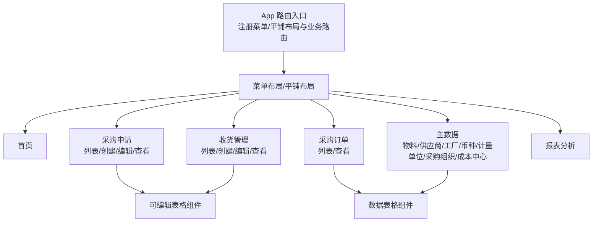
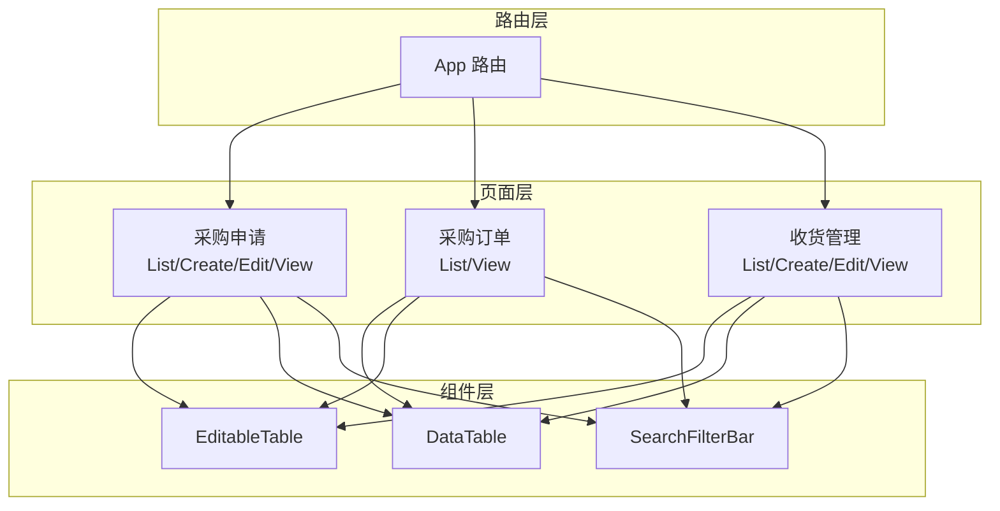
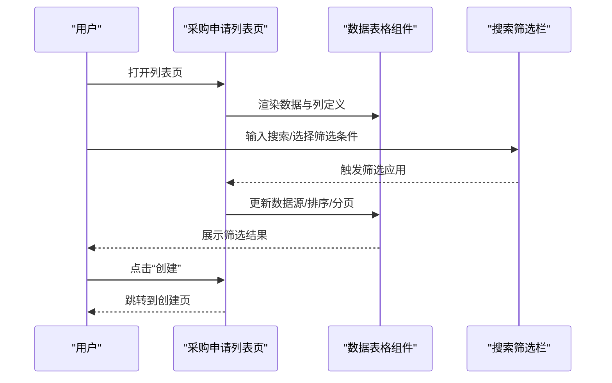
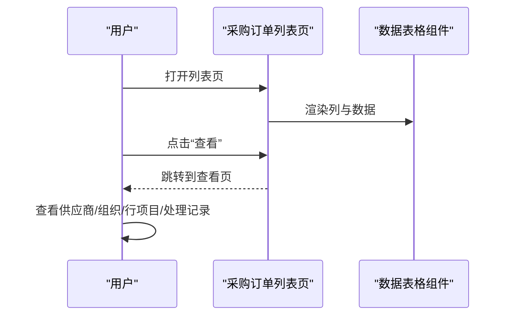
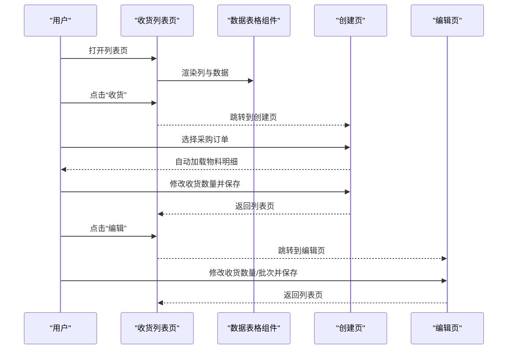
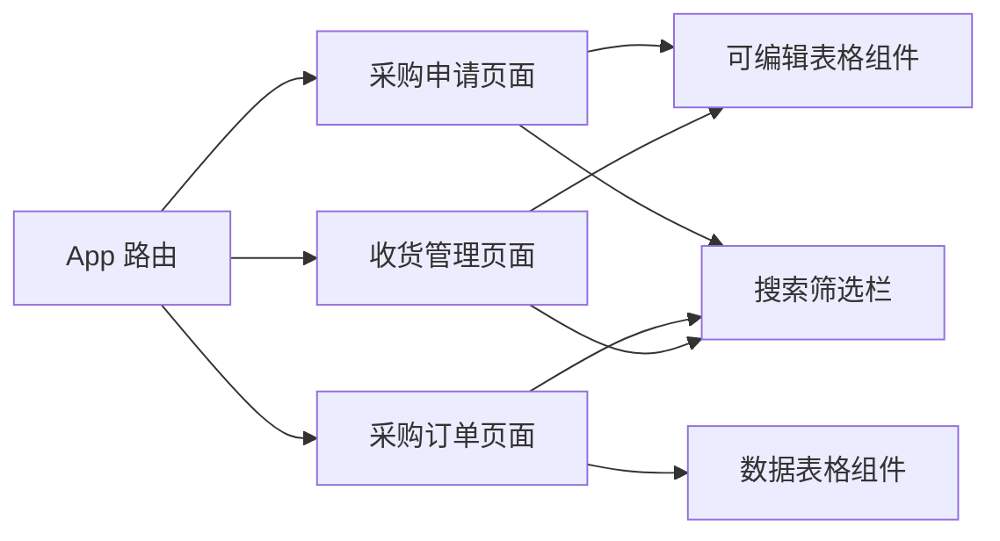

# 数据管理

<cite>
**本文引用的文件**
- [App.tsx](file://app/examples/admin/src/App.tsx)
- [HomePage.tsx](file://app/examples/admin/src/pages/HomePage.tsx)
- [ListPage.tsx（采购申请）](file://app/examples/admin/src/pages/purchase-requisitions/ListPage.tsx)
- [CreatePage.tsx（采购申请）](file://app/examples/admin/src/pages/purchase-requisitions/CreatePage.tsx)
- [EditPage.tsx（采购申请）](file://app/examples/admin/src/pages/purchase-requisitions/EditPage.tsx)
- [ViewPage.tsx（采购申请）](file://app/examples/admin/src/pages/purchase-requisitions/ViewPage.tsx)
- [ListPage.tsx（采购订单）](file://app/examples/admin/src/pages/purchase-orders/ListPage.tsx)
- [ViewPage.tsx（采购订单）](file://app/examples/admin/src/pages/purchase-orders/ViewPage.tsx)
- [ListPage.tsx（收货管理）](file://app/examples/admin/src/pages/goods-receipt/ListPage.tsx)
- [CreatePage.tsx（收货管理）](file://app/examples/admin/src/pages/goods-receipt/CreatePage.tsx)
- [EditPage.tsx（收货管理）](file://app/examples/admin/src/pages/goods-receipt/EditPage.tsx)
- [EditableTable/index.tsx](file://app/examples/admin/src/components/EditableTable/index.tsx)
- [data-table.tsx](file://app/framework/admin-component/src/ui/data-table.tsx)
- [search-filter-bar.tsx](file://app/framework/admin-component/src/ui/search-filter-bar.tsx)
</cite>

## 目录
1. [简介](#简介)
2. [项目结构](#项目结构)
3. [核心组件](#核心组件)
4. [架构总览](#架构总览)
5. [详细组件分析](#详细组件分析)
6. [依赖关系分析](#依赖关系分析)
7. [性能考虑](#性能考虑)
8. [故障排查指南](#故障排查指南)
9. [结论](#结论)
10. [附录](#附录)

## 简介
本使用指南面向管理员与开发人员，系统讲解数据管理系统中各类业务实体（采购申请、采购订单、收货管理、主数据）在管理员界面中的管理方式与数据操作流程。内容涵盖增删改查、数据验证、批量操作、导入导出（概念性说明）、数据绑定与状态同步、实时更新、数据流设计模式（获取、缓存、错误处理、加载状态）、权限与安全、一致性保障以及最佳实践与性能优化建议。

## 项目结构
该系统采用前端单页应用（SPA）架构，基于路由驱动的页面组织方式，结合可复用的 UI 组件库与自定义的可编辑表格组件，支撑多业务实体的数据管理。

- 应用入口与路由
  - 应用入口负责根据布局模式（菜单/平铺）挂载菜单布局或平铺布局，并注册各业务模块路由。
  - 路由覆盖首页、设置、采购申请、采购订单、收货管理、主数据、报表分析等页面。
- 页面层
  - 采购申请：列表、创建、编辑、查看。
  - 采购订单：列表、查看。
  - 收货管理：列表、创建、编辑、查看。
  - 主数据：物料、供应商、工厂/仓库、币种、计量单位、采购组织、成本中心。
- 组件层
  - 可编辑表格组件：支持行项目编辑、必填校验、合计计算、删除等。
  - 数据表格组件：基于 react-table 的高性能列表组件，支持排序、分页、选择、空态与加载态。
  - 搜索筛选栏：统一的搜索与筛选 UI，支持多种字段类型与应用/清除逻辑。
- 样式与主题
  - 基于 Fiori 风格的主题与样式工具类，确保一致的视觉与交互体验。

图表来源
- [App.tsx](file://app/examples/admin/src/App.tsx#L72-L171)
- [ListPage.tsx（采购申请）](file://app/examples/admin/src/pages/purchase-requisitions/ListPage.tsx#L71-L271)
- [CreatePage.tsx（采购申请）](file://app/examples/admin/src/pages/purchase-requisitions/CreatePage.tsx#L103-L567)
- [EditPage.tsx（采购申请）](file://app/examples/admin/src/pages/purchase-requisitions/EditPage.tsx#L142-L643)
- [ViewPage.tsx（采购申请）](file://app/examples/admin/src/pages/purchase-requisitions/ViewPage.tsx#L144-L478)
- [ListPage.tsx（采购订单）](file://app/examples/admin/src/pages/purchase-orders/ListPage.tsx#L72-L296)
- [ViewPage.tsx（采购订单）](file://app/examples/admin/src/pages/purchase-orders/ViewPage.tsx#L96-L395)
- [ListPage.tsx（收货管理）](file://app/examples/admin/src/pages/goods-receipt/ListPage.tsx#L74-L278)
- [CreatePage.tsx（收货管理）](file://app/examples/admin/src/pages/goods-receipt/CreatePage.tsx#L47-L267)
- [EditPage.tsx（收货管理）](file://app/examples/admin/src/pages/goods-receipt/EditPage.tsx#L53-L211)
- [EditableTable/index.tsx](file://app/examples/admin/src/components/EditableTable/index.tsx#L54-L160)
- [data-table.tsx](file://app/framework/admin-component/src/ui/data-table.tsx#L73-L375)
- [search-filter-bar.tsx](file://app/framework/admin-component/src/ui/search-filter-bar.tsx#L52-L186)

章节来源
- [App.tsx](file://app/examples/admin/src/App.tsx#L72-L171)

## 核心组件
- 可编辑表格组件（EditableTable）
  - 用途：在对象页内编辑行项目（如采购申请行项目、收货明细），支持必填标记、输入/选择渲染、合计行、删除按钮等。
  - 关键能力：列定义、数据源绑定、行键、最小宽度、嵌入模式、索引列开关、空态文案。
- 数据表格组件（DataTable）
  - 用途：列表页展示大量数据，支持排序、分页、选择、空态与加载态。
  - 关键能力：列定义、数据源、选择、分页、排序、行点击/双击、行 ID 获取。
- 搜索筛选栏（SearchFilterBar）
  - 用途：统一的搜索与筛选 UI，支持文本、单选、多选、日期、日期范围等字段类型。
  - 关键能力：展开/收起、应用、清除、激活筛选条件计数、受控/非受控值同步。

章节来源
- [EditableTable/index.tsx](file://app/examples/admin/src/components/EditableTable/index.tsx#L10-L160)
- [data-table.tsx](file://app/framework/admin-component/src/ui/data-table.tsx#L28-L90)
- [search-filter-bar.tsx](file://app/framework/admin-component/src/ui/search-filter-bar.tsx#L11-L48)

## 架构总览
系统采用“路由 + 页面 + 组件”的分层架构：
- 路由层：集中注册业务路由，支持菜单布局与平铺布局两种模式。
- 页面层：每个业务实体对应一组页面（列表、创建、编辑、查看），页面内组合使用可编辑表格与数据表格组件。
- 组件层：可复用 UI 组件，提供一致的数据绑定、状态管理与交互行为。

图表来源
- [App.tsx](file://app/examples/admin/src/App.tsx#L90-L168)
- [ListPage.tsx（采购申请）](file://app/examples/admin/src/pages/purchase-requisitions/ListPage.tsx#L194-L266)
- [CreatePage.tsx（采购申请）](file://app/examples/admin/src/pages/purchase-requisitions/CreatePage.tsx#L383-L506)
- [EditPage.tsx（采购申请）](file://app/examples/admin/src/pages/purchase-requisitions/EditPage.tsx#L399-L522)
- [ViewPage.tsx（采购申请）](file://app/examples/admin/src/pages/purchase-requisitions/ViewPage.tsx#L332-L400)
- [ListPage.tsx（采购订单）](file://app/examples/admin/src/pages/purchase-orders/ListPage.tsx#L204-L291)
- [ViewPage.tsx（采购订单）](file://app/examples/admin/src/pages/purchase-orders/ViewPage.tsx#L105-L391)
- [ListPage.tsx（收货管理）](file://app/examples/admin/src/pages/goods-receipt/ListPage.tsx#L201-L273)
- [CreatePage.tsx（收货管理）](file://app/examples/admin/src/pages/goods-receipt/CreatePage.tsx#L111-L263)
- [EditPage.tsx（收货管理）](file://app/examples/admin/src/pages/goods-receipt/EditPage.tsx#L72-L207)
- [EditableTable/index.tsx](file://app/examples/admin/src/components/EditableTable/index.tsx#L54-L160)
- [data-table.tsx](file://app/framework/admin-component/src/ui/data-table.tsx#L73-L375)
- [search-filter-bar.tsx](file://app/framework/admin-component/src/ui/search-filter-bar.tsx#L52-L186)

## 详细组件分析

### 采购申请管理
- 列表页（ListPage）
  - 数据绑定：使用数据表格组件展示采购申请列表，支持搜索、筛选、排序、分页与选择。
  - 筛选：通过搜索筛选栏与过滤面板实现多字段筛选，支持清除筛选。
  - 操作：提供“创建”主操作与“查看/编辑”选择操作。
- 创建页（CreatePage）
  - 数据绑定：表头与行项目通过状态管理维护，支持必填字段与自动计算（金额=数量×单价）。
  - 行项目编辑：可添加/删除行，选择物料自动回填描述、单价与金额；数量/单价变更即时重算金额。
  - 保存与提交：提供保存与提交审批按钮，禁用状态与加载动画。
- 编辑页（EditPage）
  - 数据绑定：表头与行项目可编辑，支持新增/删除行，字段变更触发脏状态。
  - 实时更新：金额与数量联动计算，合计行实时更新。
  - 审批流程：侧边栏展示审批流程节点与状态。
- 查看页（ViewPage）
  - 数据绑定：只读展示，支持 Section 导航与滚动定位。
  - 金额格式化：统一金额格式化方法。
  - 相关主数据：展示与该申请相关的主数据链接。

图表来源
- [ListPage.tsx（采购申请）](file://app/examples/admin/src/pages/purchase-requisitions/ListPage.tsx#L71-L271)
- [data-table.tsx](file://app/framework/admin-component/src/ui/data-table.tsx#L73-L375)
- [search-filter-bar.tsx](file://app/framework/admin-component/src/ui/search-filter-bar.tsx#L52-L186)

章节来源
- [ListPage.tsx（采购申请）](file://app/examples/admin/src/pages/purchase-requisitions/ListPage.tsx#L71-L271)
- [CreatePage.tsx（采购申请）](file://app/examples/admin/src/pages/purchase-requisitions/CreatePage.tsx#L103-L567)
- [EditPage.tsx（采购申请）](file://app/examples/admin/src/pages/purchase-requisitions/EditPage.tsx#L142-L643)
- [ViewPage.tsx（采购申请）](file://app/examples/admin/src/pages/purchase-requisitions/ViewPage.tsx#L144-L478)

### 采购订单管理
- 列表页（ListPage）
  - 数据绑定：使用数据表格组件展示采购订单列表，支持按状态、采购员、日期范围等筛选。
  - 操作：提供“创建”主操作与“查看/编辑”选择操作。
- 查看页（ViewPage）
  - 数据绑定：展示供应商信息、组织数据、行项目明细与处理记录。
  - 金额与状态：统一金额格式化与状态标签展示。

图表来源
- [ListPage.tsx（采购订单）](file://app/examples/admin/src/pages/purchase-orders/ListPage.tsx#L72-L296)
- [ViewPage.tsx（采购订单）](file://app/examples/admin/src/pages/purchase-orders/ViewPage.tsx#L96-L395)
- [data-table.tsx](file://app/framework/admin-component/src/ui/data-table.tsx#L73-L375)

章节来源
- [ListPage.tsx（采购订单）](file://app/examples/admin/src/pages/purchase-orders/ListPage.tsx#L72-L296)
- [ViewPage.tsx（采购订单）](file://app/examples/admin/src/pages/purchase-orders/ViewPage.tsx#L96-L395)

### 收货管理
- 列表页（ListPage）
  - 数据绑定：使用数据表格组件展示收货单列表，支持按状态、工厂、存储位置筛选。
  - 操作：提供“收货”主操作与“查看”选择操作。
- 创建页（CreatePage）
  - 数据绑定：通过选择采购订单自动加载物料明细，计算默认收货数量（订单数量-已收货数量）。
  - 行项目编辑：支持调整收货数量，限制最大值与最小值。
  - 保存：保存成功后跳转回列表。
- 编辑页（EditPage）
  - 数据绑定：展示库存信息与收货明细，支持修改收货数量与批次。
  - 保存：保存成功后返回详情页。

图表来源
- [ListPage.tsx（收货管理）](file://app/examples/admin/src/pages/goods-receipt/ListPage.tsx#L74-L278)
- [CreatePage.tsx（收货管理）](file://app/examples/admin/src/pages/goods-receipt/CreatePage.tsx#L47-L267)
- [EditPage.tsx（收货管理）](file://app/examples/admin/src/pages/goods-receipt/EditPage.tsx#L53-L211)
- [data-table.tsx](file://app/framework/admin-component/src/ui/data-table.tsx#L73-L375)

章节来源
- [ListPage.tsx（收货管理）](file://app/examples/admin/src/pages/goods-receipt/ListPage.tsx#L74-L278)
- [CreatePage.tsx（收货管理）](file://app/examples/admin/src/pages/goods-receipt/CreatePage.tsx#L47-L267)
- [EditPage.tsx（收货管理）](file://app/examples/admin/src/pages/goods-receipt/EditPage.tsx#L53-L211)

### 主数据管理（概念性说明）
- 主数据通常指物料、供应商、工厂/仓库、币种、计量单位、采购组织、成本中心等。
- 管理方式
  - 列表页：使用数据表格组件展示主数据，支持搜索、筛选、排序与分页。
  - 查看/编辑：对象页展示主数据详情，支持字段编辑与保存。
  - 创建：提供创建入口，完成必填字段校验后保存。
- 数据一致性
  - 引用完整性：在其他业务实体中引用主数据时，应保持编码与名称的一致性。
  - 版本与变更：建议引入变更日志与版本控制，便于审计与回溯。

[本节为概念性说明，不直接分析具体文件]

## 依赖关系分析
- 组件耦合
  - 页面与组件：页面通过 props 将数据与事件传递给组件，组件内部不直接访问页面状态，降低耦合度。
  - 可编辑表格与数据表格：分别服务于对象页内的行项目编辑与列表页的数据展示，职责清晰。
- 外部依赖
  - react-router-dom：负责路由导航与参数传递。
  - @tanstack/react-table：提供高性能的表格能力，支持复杂交互。
- 可能的循环依赖
  - 当前结构中未发现循环依赖，页面与组件之间为单向依赖。

图表来源
- [App.tsx](file://app/examples/admin/src/App.tsx#L90-L168)
- [EditableTable/index.tsx](file://app/examples/admin/src/components/EditableTable/index.tsx#L54-L160)
- [data-table.tsx](file://app/framework/admin-component/src/ui/data-table.tsx#L73-L375)
- [search-filter-bar.tsx](file://app/framework/admin-component/src/ui/search-filter-bar.tsx#L52-L186)

章节来源
- [App.tsx](file://app/examples/admin/src/App.tsx#L90-L168)

## 性能考虑
- 列表性能
  - 使用数据表格组件（react-table）实现虚拟滚动与分页，减少 DOM 节点数量，提升大数据量下的渲染性能。
  - 合理设置 pageSize 与手动分页，避免一次性加载过多数据。
- 行项目编辑
  - 可编辑表格组件支持嵌入模式与最小宽度控制，避免频繁重排。
  - 合计计算在客户端进行，建议在大批量行项目时采用防抖或批量更新策略。
- 状态管理
  - 页面内状态尽量局部化，避免跨层级传递导致的重复渲染。
  - 使用 React.memo 或 useMemo 优化昂贵计算与子组件渲染。
- 网络与缓存
  - 列表页可引入本地缓存策略（如 localStorage）缓存筛选条件与分页状态，提升用户体验。
  - 对高频查询接口增加请求去重与超时控制，避免重复请求与阻塞 UI。
- 错误处理与加载状态
  - 在数据表格与可编辑表格中统一处理加载态与空态，提供明确的错误提示与重试机制。

[本节提供通用指导，不直接分析具体文件]

## 故障排查指南
- 列表无数据或空白
  - 检查数据源是否正确传入，确认 totalCount 与分页配置。
  - 若使用手动分页，确保分页状态与回调正确同步。
- 行项目编辑异常
  - 确认列定义中的 render 函数返回正确的输入组件，并正确绑定 onChange。
  - 检查必填字段是否带星号标记且在保存时进行校验。
- 筛选无效
  - 检查搜索筛选栏的 onApply 与 onFilterChange 回调是否正确触发。
  - 确认 filterValues 的受控/非受控同步逻辑。
- 保存失败或状态未更新
  - 检查保存按钮的禁用状态与加载动画，确保异步保存完成后恢复状态。
  - 确认路由跳转逻辑与页面刷新策略。

章节来源
- [data-table.tsx](file://app/framework/admin-component/src/ui/data-table.tsx#L187-L191)
- [EditableTable/index.tsx](file://app/examples/admin/src/components/EditableTable/index.tsx#L164-L202)
- [search-filter-bar.tsx](file://app/framework/admin-component/src/ui/search-filter-bar.tsx#L68-L96)

## 结论
本系统通过统一的路由与页面组织、可复用的 UI 组件与清晰的数据流设计，实现了对采购申请、采购订单、收货管理等业务实体的高效管理。借助数据表格与可编辑表格组件，系统在保证良好用户体验的同时，具备良好的扩展性与可维护性。建议在实际生产环境中进一步完善权限控制、数据安全与一致性保障机制，并持续优化性能与错误处理策略。

[本节为总结性内容，不直接分析具体文件]

## 附录
- 数据导入导出（概念性说明）
  - 导入：建议提供 CSV/Excel 模板下载与上传功能，后台进行格式校验与幂等处理，支持批量创建与更新。
  - 导出：支持按筛选条件导出当前页或全量数据，注意大体量数据的分页导出与压缩策略。
- 数据权限控制
  - 建议在路由与页面层加入鉴权守卫，按角色限制访问路径；在数据层对查询与写入操作进行 RBAC 控制。
- 数据安全
  - 对敏感字段（如金额、税率）进行脱敏展示与传输加密；对操作日志进行审计留痕。
- 一致性保障
  - 对关键业务流程（如收货）采用事务性处理与状态机设计，确保状态流转正确与数据一致。

[本节为概念性说明，不直接分析具体文件]