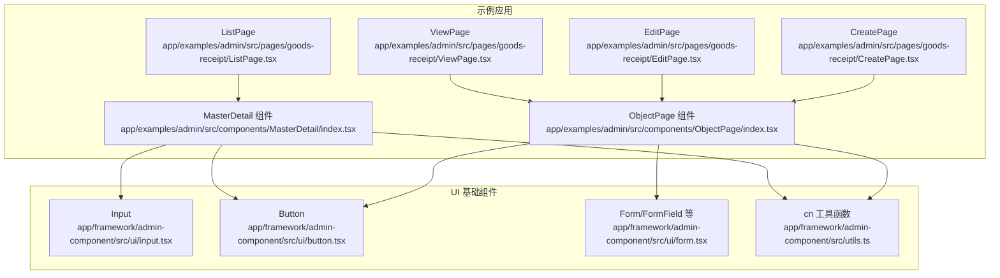
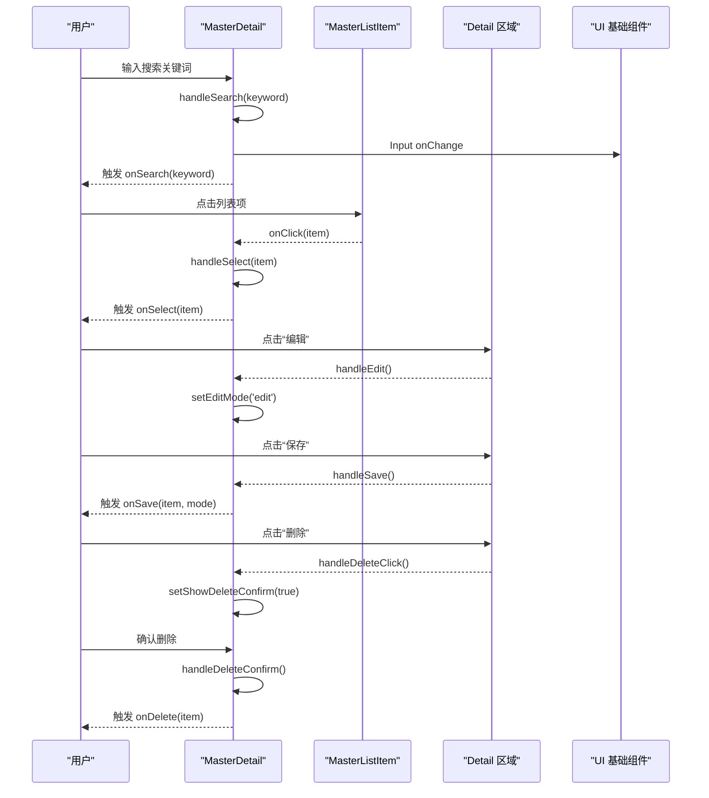
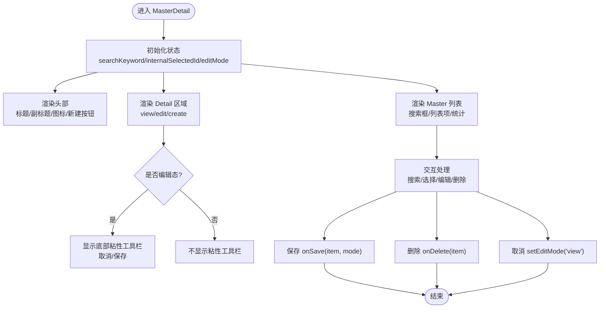
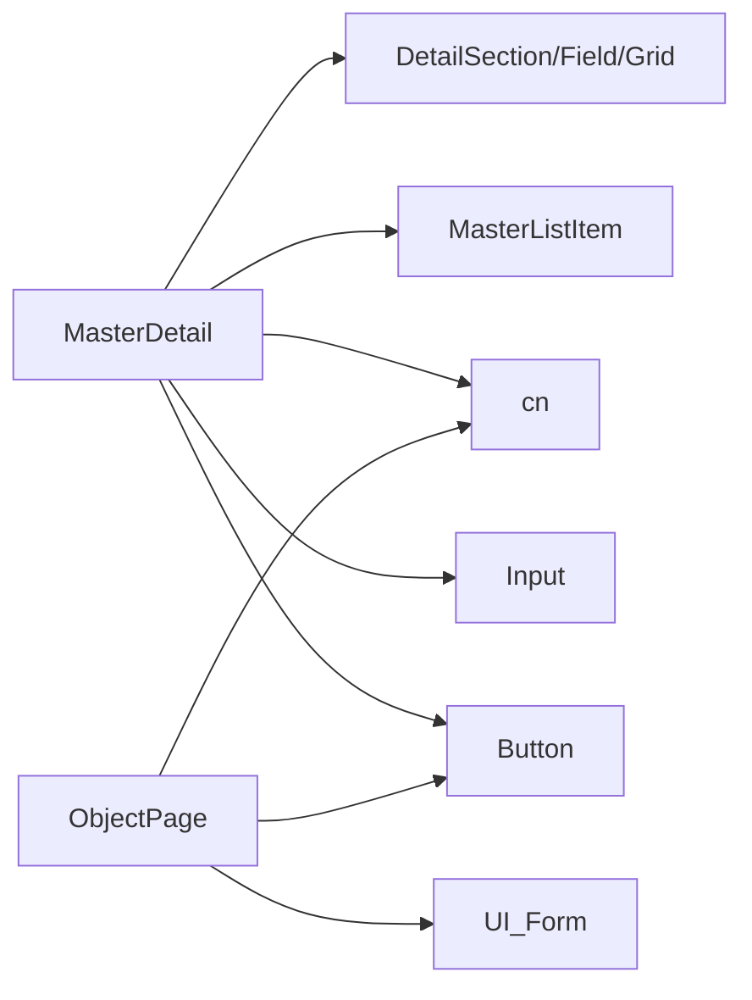

# 主从详情组件 (MasterDetail)

<cite>
**本文引用的文件**
- [MasterDetail/index.tsx](file://app/examples/admin/src/components/MasterDetail/index.tsx)
- [ListPage.tsx](file://app/examples/admin/src/pages/goods-receipt/ListPage.tsx)
- [ViewPage.tsx](file://app/examples/admin/src/pages/goods-receipt/ViewPage.tsx)
- [EditPage.tsx](file://app/examples/admin/src/pages/goods-receipt/EditPage.tsx)
- [CreatePage.tsx](file://app/examples/admin/src/pages/goods-receipt/CreatePage.tsx)
- [ObjectPage/index.tsx](file://app/examples/admin/src/components/ObjectPage/index.tsx)
- [form.tsx](file://app/framework/admin-component/src/ui/form.tsx)
- [input.tsx](file://app/framework/admin-component/src/ui/input.tsx)
- [button.tsx](file://app/framework/admin-component/src/ui/button.tsx)
- [utils.ts](file://app/framework/admin-component/src/utils.ts)
</cite>

## 目录
1. [简介](#简介)
2. [项目结构](#项目结构)
3. [核心组件](#核心组件)
4. [架构总览](#架构总览)
5. [详细组件分析](#详细组件分析)
6. [依赖关系分析](#依赖关系分析)
7. [性能考量](#性能考量)
8. [故障排查指南](#故障排查指南)
9. [结论](#结论)
10. [附录](#附录)

## 简介
本文件面向“主从详情组件（MasterDetail）”的完整功能文档，聚焦以下目标：
- 设计理念与 SAP Fiori 设计规范的实现
- 经典左列表右详情的布局模式
- 核心属性配置（如 title、subtitle、items、selectedId 等）
- 事件回调机制（onSelect、onSearch、onSave、onDelete）
- 状态管理模式（view/edit/create 模式）
- 交互流程（搜索过滤、列表选择、编辑模式切换、表单渲染）
- 使用示例（数据绑定、样式定制、响应式设计、无障碍支持）
- 最佳实践、性能优化建议与常见问题解决方案

## 项目结构
本组件位于示例工程中，作为通用 UI 组件与业务页面协同工作：
- 组件源码：app/examples/admin/src/components/MasterDetail/index.tsx
- 业务页面示例：goods-receipt 的 List/View/Edit/Create 页面
- 通用 ObjectPage 组件：用于展示详情/编辑/创建的页面骨架
- UI 基础组件：输入框、按钮、表单等来自 admin-component 包

图表来源
- [MasterDetail/index.tsx](file://app/examples/admin/src/components/MasterDetail/index.tsx#L1-L498)
- [ListPage.tsx](file://app/examples/admin/src/pages/goods-receipt/ListPage.tsx#L1-L278)
- [ViewPage.tsx](file://app/examples/admin/src/pages/goods-receipt/ViewPage.tsx#L1-L270)
- [EditPage.tsx](file://app/examples/admin/src/pages/goods-receipt/EditPage.tsx#L1-L211)
- [CreatePage.tsx](file://app/examples/admin/src/pages/goods-receipt/CreatePage.tsx#L1-L267)
- [ObjectPage/index.tsx](file://app/examples/admin/src/components/ObjectPage/index.tsx#L1-L544)
- [input.tsx](file://app/framework/admin-component/src/ui/input.tsx#L1-L22)
- [button.tsx](file://app/framework/admin-component/src/ui/button.tsx#L1-L65)
- [form.tsx](file://app/framework/admin-component/src/ui/form.tsx#L1-L168)
- [utils.ts](file://app/framework/admin-component/src/utils.ts#L1-L7)

章节来源
- [MasterDetail/index.tsx](file://app/examples/admin/src/components/MasterDetail/index.tsx#L1-L498)
- [ListPage.tsx](file://app/examples/admin/src/pages/goods-receipt/ListPage.tsx#L1-L278)
- [ObjectPage/index.tsx](file://app/examples/admin/src/components/ObjectPage/index.tsx#L1-L544)

## 核心组件
- MasterDetail 主组件：提供头部、Master 列表、Detail 详情、底部粘性工具栏、删除确认弹窗等能力；支持 view/edit/create 三态切换与搜索过滤。
- MasterListItem 子组件：渲染列表项，支持选中态、徽标、状态点、图标等。
- DetailSection/DetailField/DetailFieldGrid 辅助组件：用于在 Detail 中组织字段卡片与网格布局。
- ObjectPage 通用页面骨架：与 MasterDetail 协作，提供面包屑、标题、状态标签、KPI、操作按钮、Section 导航等。

章节来源
- [MasterDetail/index.tsx](file://app/examples/admin/src/components/MasterDetail/index.tsx#L113-L355)
- [MasterDetail/index.tsx](file://app/examples/admin/src/components/MasterDetail/index.tsx#L359-L431)
- [MasterDetail/index.tsx](file://app/examples/admin/src/components/MasterDetail/index.tsx#L435-L495)
- [ObjectPage/index.tsx](file://app/examples/admin/src/components/ObjectPage/index.tsx#L131-L494)

## 架构总览
MasterDetail 采用“左侧列表 + 右侧详情”的经典布局，结合 SAP Fiori 的视觉与交互规范，通过 props 驱动行为，内部状态控制视图切换与交互反馈。

图表来源
- [MasterDetail/index.tsx](file://app/examples/admin/src/components/MasterDetail/index.tsx#L142-L180)
- [MasterDetail/index.tsx](file://app/examples/admin/src/components/MasterDetail/index.tsx#L268-L323)

## 详细组件分析

### MasterDetail 主组件
- 设计要点
  - 头部区域：标题、副标题、图标、新建按钮（仅 view 模式且允许创建）
  - Master 列表：搜索框、列表项、统计信息、禁用编辑态下的交互
  - Detail 区域：根据模式渲染查看详情、编辑表单或新建表单
  - 底部粘性工具栏：仅在编辑态显示，提供取消/保存
  - 删除确认弹窗：二次确认，避免误删
- 关键状态
  - 内部状态：searchKeyword、internalSelectedId、editMode、showDeleteConfirm
  - 外部受控：selectedId（若传入则以 props 为准）
- 事件回调
  - onSelect(item)：列表项点击
  - onSearch(keyword)：搜索输入变更
  - onSave(item, mode)：保存（含 create/edit）
  - onDelete(item)：删除
- 模式控制
  - view：查看详情，可编辑/删除（取决于 allowEdit/allowDelete）
  - edit：编辑表单
  - create：新建表单

图表来源
- [MasterDetail/index.tsx](file://app/examples/admin/src/components/MasterDetail/index.tsx#L113-L355)

章节来源
- [MasterDetail/index.tsx](file://app/examples/admin/src/components/MasterDetail/index.tsx#L113-L355)

### MasterListItem 子组件
- 设计要点
  - 选中态高亮（左侧蓝线、背景色）
  - 支持图标、标题、副标题、描述、徽标、状态点
  - 禁用态与可点击态区分
- 适用场景
  - 与 MasterDetail 协同，作为列表项渲染器

章节来源
- [MasterDetail/index.tsx](file://app/examples/admin/src/components/MasterDetail/index.tsx#L359-L431)

### Detail 辅助组件
- DetailSection：卡片容器，带标题与可折叠能力
- DetailField：键值对展示
- DetailFieldGrid：按列数布局字段网格

章节来源
- [MasterDetail/index.tsx](file://app/examples/admin/src/components/MasterDetail/index.tsx#L435-L495)

### 与 ObjectPage 的协作
- ViewPage/EditPage/CreatePage 通过 ObjectPage 提供统一的页面骨架（头部、KPI、Section 导航、底部粘性工具栏），MasterDetail 可作为其中的一个 Section 或独立页面布局。
- ObjectPage 的模式（display/edit/create）与 MasterDetail 的模式（view/edit/create）语义一致，便于统一管理。

章节来源
- [ObjectPage/index.tsx](file://app/examples/admin/src/components/ObjectPage/index.tsx#L131-L494)
- [ViewPage.tsx](file://app/examples/admin/src/pages/goods-receipt/ViewPage.tsx#L76-L267)
- [EditPage.tsx](file://app/examples/admin/src/pages/goods-receipt/EditPage.tsx#L53-L211)
- [CreatePage.tsx](file://app/examples/admin/src/pages/goods-receipt/CreatePage.tsx#L47-L267)

## 依赖关系分析
- 组件依赖
  - UI 基础组件：Input、Button、Form 系列
  - 工具函数：cn（类名合并）
- 组件耦合
  - MasterDetail 与 UI 基础组件松耦合，通过 props 传递行为
  - Detail 区域通过 renderDetail/renderForm 插槽扩展，降低耦合度
- 外部依赖
  - react-router（示例页面中用于导航）

图表来源
- [MasterDetail/index.tsx](file://app/examples/admin/src/components/MasterDetail/index.tsx#L8-L10)
- [input.tsx](file://app/framework/admin-component/src/ui/input.tsx#L1-L22)
- [button.tsx](file://app/framework/admin-component/src/ui/button.tsx#L1-L65)
- [form.tsx](file://app/framework/admin-component/src/ui/form.tsx#L1-L168)
- [utils.ts](file://app/framework/admin-component/src/utils.ts#L1-L7)
- [ObjectPage/index.tsx](file://app/examples/admin/src/components/ObjectPage/index.tsx#L1-L544)

章节来源
- [MasterDetail/index.tsx](file://app/examples/admin/src/components/MasterDetail/index.tsx#L1-L498)
- [ObjectPage/index.tsx](file://app/examples/admin/src/components/ObjectPage/index.tsx#L1-L544)

## 性能考量
- 列表渲染
  - 使用虚拟化或分页策略处理大量数据项
  - 列表项点击与搜索输入应防抖，避免频繁重渲染
- 表单渲染
  - 编辑/新建表单按需渲染，减少不必要的计算
- 状态管理
  - 将外部受控 selectedId 与内部状态解耦，避免重复选择
- 样式与动画
  - 减少复杂阴影与过渡，确保在低端设备上流畅运行
- 无障碍
  - 为按钮、输入框、列表项提供合适的 ARIA 属性与键盘导航

## 故障排查指南
- 无法切换到编辑态
  - 检查是否处于编辑态（编辑态下禁止列表切换）
  - 确认 allowEdit/renderForm/onSave 配置正确
- 保存无效
  - 确认 onSave 回调是否触发，以及 mode 参数是否正确
- 删除确认弹窗不出现
  - 检查 onDelete 配置与 handleDeleteClick 流程
- 列表搜索无响应
  - 确认 onSearch 回调是否实现，输入框 disabled 状态是否正确
- 样式异常
  - 检查 cn 工具函数与 Tailwind 配置是否生效

章节来源
- [MasterDetail/index.tsx](file://app/examples/admin/src/components/MasterDetail/index.tsx#L142-L180)
- [MasterDetail/index.tsx](file://app/examples/admin/src/components/MasterDetail/index.tsx#L268-L323)

## 结论
MasterDetail 组件以清晰的职责划分与灵活的插槽扩展，实现了 SAP Fiori 风格的主从布局。通过 props 驱动与内部状态管理，组件在不同模式间平滑切换，满足查看、编辑、创建等典型业务场景。配合 ObjectPage 与基础 UI 组件，可在企业级应用中快速落地。

## 附录

### 核心属性与事件清单
- 核心属性
  - title、subtitle、headerIcon：头部信息
  - items：列表数据
  - selectedId：受控选中项
  - renderDetail(item, actionButtons)：详情渲染
  - renderForm(item, mode)：表单渲染
  - renderEmpty()：空状态渲染
  - searchPlaceholder、onSearch：搜索
  - showCreate、createLabel：新建按钮
  - allowEdit、allowDelete：权限控制
  - onSave(item, mode)、onDelete(item)：保存/删除
  - masterWidth：Master 列表宽度
- 事件回调
  - onSelect(item)：列表项选择
  - onSearch(keyword)：搜索输入
  - onSave(item, mode)：保存
  - onDelete(item)：删除

章节来源
- [MasterDetail/index.tsx](file://app/examples/admin/src/components/MasterDetail/index.tsx#L28-L65)
- [MasterDetail/index.tsx](file://app/examples/admin/src/components/MasterDetail/index.tsx#L142-L180)

### 使用示例（集成思路）
- 在列表页（如 ListPage）中使用 MasterDetail，将列表数据与路由参数结合，实现点击跳转详情
- 在详情页（ViewPage/EditPage/CreatePage）中，可将 MasterDetail 作为页面的一部分，或直接使用 ObjectPage 的 Section 布局
- 表单渲染通过 renderForm 注入，结合 UI 基础组件与表单库（如 react-hook-form）实现复杂表单

章节来源
- [ListPage.tsx](file://app/examples/admin/src/pages/goods-receipt/ListPage.tsx#L74-L275)
- [ViewPage.tsx](file://app/examples/admin/src/pages/goods-receipt/ViewPage.tsx#L76-L267)
- [EditPage.tsx](file://app/examples/admin/src/pages/goods-receipt/EditPage.tsx#L53-L211)
- [CreatePage.tsx](file://app/examples/admin/src/pages/goods-receipt/CreatePage.tsx#L47-L267)
- [ObjectPage/index.tsx](file://app/examples/admin/src/components/ObjectPage/index.tsx#L131-L494)

### 样式定制与响应式
- 通过 masterWidth 调整 Master 列表宽度
- 使用 Tailwind 类覆盖默认样式，结合 cn 工具函数进行合并
- 响应式布局：在不同屏幕尺寸下调整列数、字体大小与间距

章节来源
- [MasterDetail/index.tsx](file://app/examples/admin/src/components/MasterDetail/index.tsx#L131-L132)
- [utils.ts](file://app/framework/admin-component/src/utils.ts#L1-L7)

### 无障碍支持建议
- 为按钮添加 title 或 aria-label
- 为列表项提供 tabindex 与键盘交互
- 为表单控件提供正确的 aria-invalid 与 aria-describedby
- 为弹窗提供遮罩层与 ESC 关闭

章节来源
- [button.tsx](file://app/framework/admin-component/src/ui/button.tsx#L1-L65)
- [input.tsx](file://app/framework/admin-component/src/ui/input.tsx#L1-L22)
- [form.tsx](file://app/framework/admin-component/src/ui/form.tsx#L1-L168)