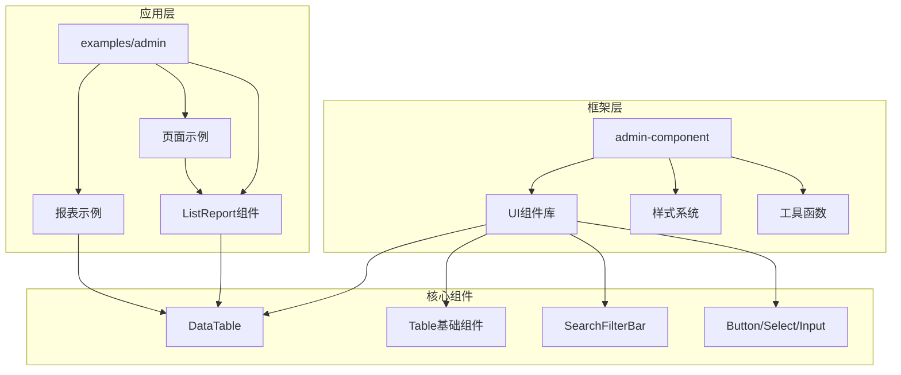
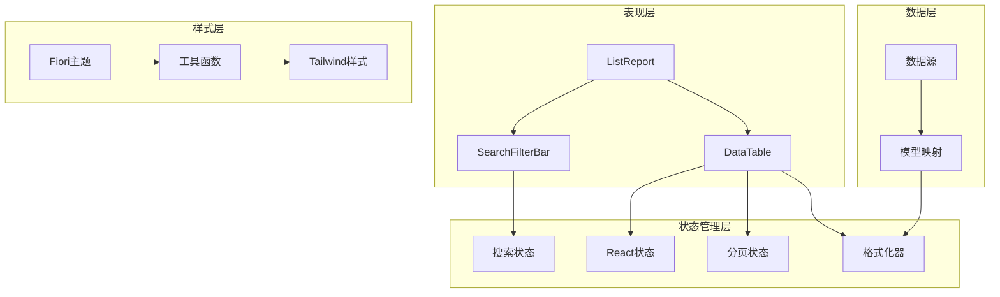
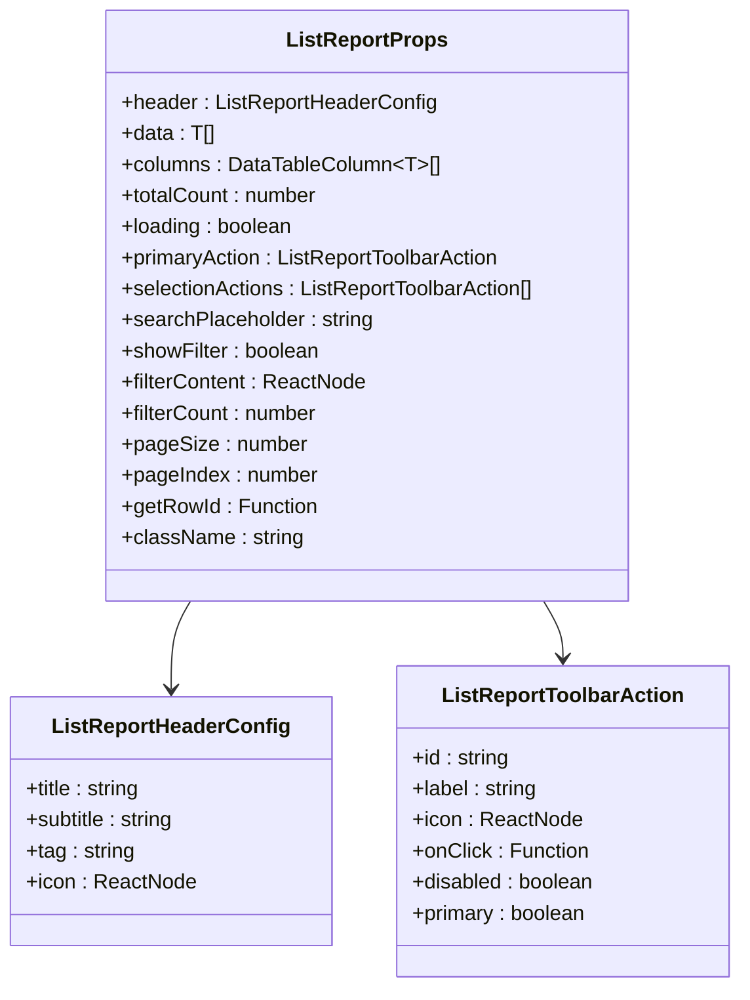
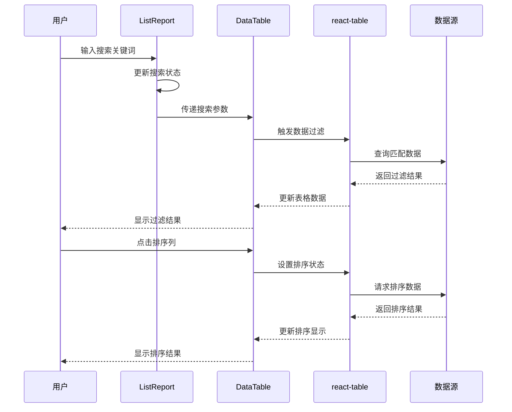
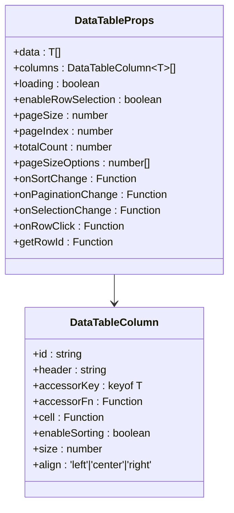
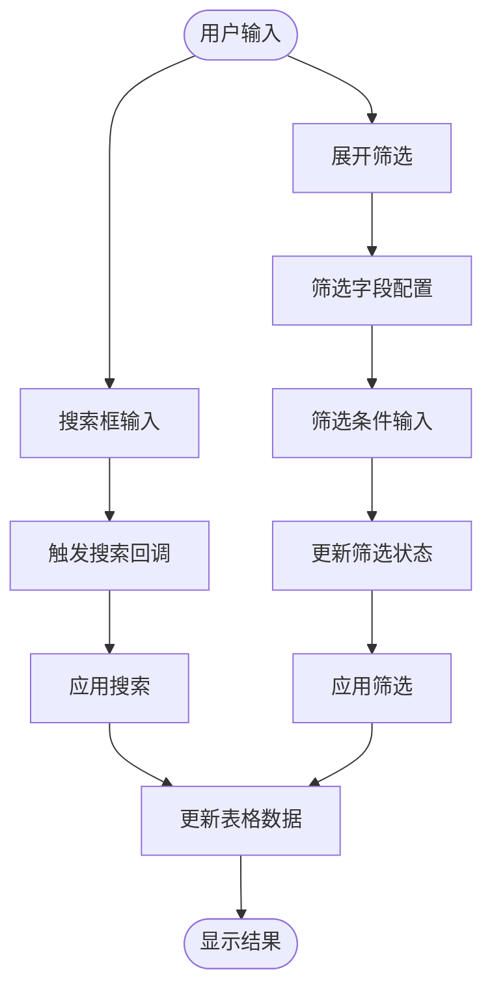
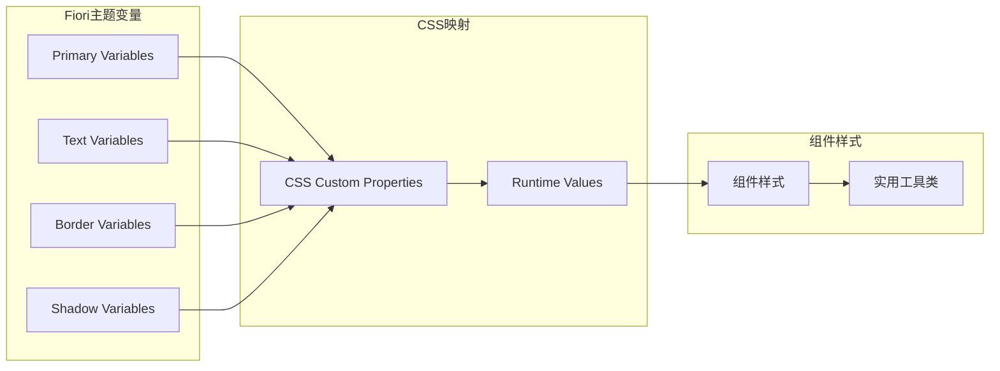
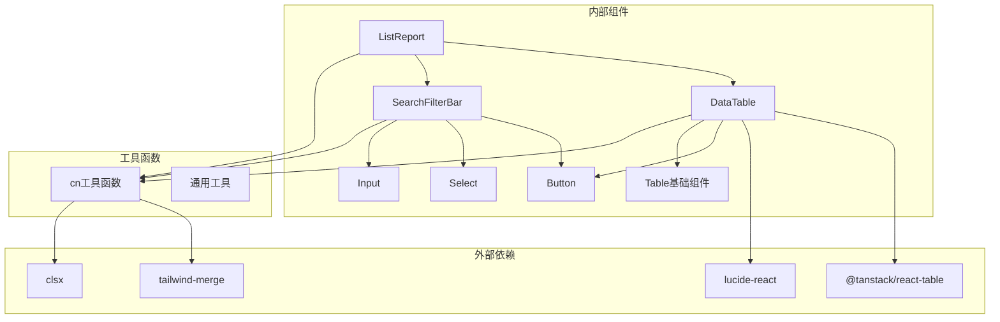

# 列表报表组件 (ListReport)

<cite>
**本文档引用的文件**
- [app/examples/admin/src/components/ListReport/index.tsx](file://app/examples/admin/src/components/ListReport/index.tsx)
- [app/framework/admin-component/src/ui/data-table.tsx](file://app/framework/admin-component/src/ui/data-table.tsx)
- [app/framework/admin-component/src/ui/table.tsx](file://app/framework/admin-component/src/ui/table.tsx)
- [app/framework/admin-component/src/ui/search-filter-bar.tsx](file://app/framework/admin-component/src/ui/search-filter-bar.tsx)
- [app/examples/admin/src/pages/purchase-orders/ListPage.tsx](file://app/examples/admin/src/pages/purchase-orders/ListPage.tsx)
- [app/examples/admin/src/pages/reports/PurchaseOrderReport.tsx](file://app/examples/admin/src/pages/reports/PurchaseOrderReport.tsx)
- [app/framework/admin-component/src/utils.ts](file://app/framework/admin-component/src/utils.ts)
- [app/framework/admin-component/src/ui/button.tsx](file://app/framework/admin-component/src/ui/button.tsx)
- [app/framework/admin-component/src/ui/select.tsx](file://app/framework/admin-component/src/ui/select.tsx)
- [app/framework/admin-component/src/ui/input.tsx](file://app/framework/admin-component/src/ui/input.tsx)
- [app/framework/admin-component/src/styles/fiori-theme.css](file://app/framework/admin-component/src/styles/fiori-theme.css)
</cite>

## 目录
1. [简介](#简介)
2. [项目结构](#项目结构)
3. [核心组件](#核心组件)
4. [架构概览](#架构概览)
5. [详细组件分析](#详细组件分析)
6. [依赖关系分析](#依赖关系分析)
7. [性能考虑](#性能考虑)
8. [故障排除指南](#故障排除指南)
9. [结论](#结论)
10. [附录](#附录)

## 简介
ListReport 是基于 SAP Fiori 设计规范开发的报表展示组件，采用 List Report Floorplan 设计模式。该组件提供了一体化的卡片风格界面，集成了头部区域、工具栏、搜索筛选、数据表格等功能模块，专为复杂报表场景而设计。

ListReport 组件的核心优势在于其完整的 Fiori 设计语言实现，包括：
- 基于 Morning Horizon 主题的视觉设计
- 完整的数据表格功能（排序、分页、选择）
- 灵活的搜索筛选机制
- 批量操作支持
- 导出功能集成
- 响应式布局设计

## 项目结构
该项目采用模块化架构，主要包含以下关键目录：

**图表来源**
- [app/examples/admin/src/components/ListReport/index.tsx](file://app/examples/admin/src/components/ListReport/index.tsx#L1-L398)
- [app/framework/admin-component/src/ui/data-table.tsx](file://app/framework/admin-component/src/ui/data-table.tsx#L1-L375)

**章节来源**
- [app/examples/admin/src/components/ListReport/index.tsx](file://app/examples/admin/src/components/ListReport/index.tsx#L1-L50)
- [app/framework/admin-component/src/ui/data-table.tsx](file://app/framework/admin-component/src/ui/data-table.tsx#L1-L50)

## 核心组件
ListReport 组件由多个精心设计的子组件构成，每个组件都有明确的职责分工：

### 主要组件架构
- **ListReport**: 主容器组件，负责整体布局和状态管理
- **DataTable**: 基于 @tanstack/react-table 的高性能数据表格
- **SearchFilterBar**: 搜索筛选栏组件
- **Fiori 主题系统**: 基于 SAP Fiori 设计规范的主题实现

### 关键特性
- **响应式设计**: 支持不同屏幕尺寸的自适应布局
- **状态管理**: 内置搜索、筛选、选择等状态管理
- **可扩展性**: 通过插槽和回调函数支持高度定制
- **性能优化**: 基于虚拟滚动和懒加载的优化策略

**章节来源**
- [app/examples/admin/src/components/ListReport/index.tsx](file://app/examples/admin/src/components/ListReport/index.tsx#L94-L141)
- [app/framework/admin-component/src/ui/data-table.tsx](file://app/framework/admin-component/src/ui/data-table.tsx#L30-L69)

## 架构概览
ListReport 采用分层架构设计，确保了组件间的松耦合和高内聚：

**图表来源**
- [app/examples/admin/src/components/ListReport/index.tsx](file://app/examples/admin/src/components/ListReport/index.tsx#L145-L392)
- [app/framework/admin-component/src/ui/data-table.tsx](file://app/framework/admin-component/src/ui/data-table.tsx#L73-L185)

## 详细组件分析

### ListReport 组件详解

#### 组件结构分析
ListReport 采用卡片式设计，包含四个主要区域：

1. **头部区域**: 包含标题、副标题、标签和主操作按钮
2. **工具栏**: 显示选择状态和工具按钮
3. **搜索筛选栏**: 提供搜索和筛选功能
4. **数据表格**: 基于 DataTable 组件的完整数据展示

#### 配置选项详解
ListReport 提供了丰富的配置选项：

**图表来源**
- [app/examples/admin/src/components/ListReport/index.tsx](file://app/examples/admin/src/components/ListReport/index.tsx#L73-L141)

#### 数据表格集成
ListReport 将 DataTable 组件无缝集成，提供了完整的数据展示功能：

**图表来源**
- [app/examples/admin/src/components/ListReport/index.tsx](file://app/examples/admin/src/components/ListReport/index.tsx#L179-L182)
- [app/framework/admin-component/src/ui/data-table.tsx](file://app/framework/admin-component/src/ui/data-table.tsx#L149-L185)

**章节来源**
- [app/examples/admin/src/components/ListReport/index.tsx](file://app/examples/admin/src/components/ListReport/index.tsx#L145-L392)

### DataTable 组件深度解析

#### 核心功能特性
DataTable 组件基于 @tanstack/react-table 构建，提供了企业级的数据表格功能：

1. **高性能渲染**: 使用虚拟滚动和记忆化优化
2. **灵活的列定义**: 支持多种数据类型的列配置
3. **完整的交互功能**: 排序、分页、选择、搜索
4. **可定制的单元格**: 支持复杂的数据格式化

#### 列定义系统
DataTable 采用灵活的列定义系统，支持多种配置选项：

**图表来源**
- [app/framework/admin-component/src/ui/data-table.tsx](file://app/framework/admin-component/src/ui/data-table.tsx#L30-L69)

#### 性能优化策略
DataTable 实现了多项性能优化技术：

1. **状态分离**: 将排序、分页、选择状态分离管理
2. **记忆化计算**: 使用 React.useMemo 优化列定义转换
3. **虚拟滚动**: 对大数据量进行虚拟化渲染
4. **懒加载**: 支持手动分页以减少初始负载

**章节来源**
- [app/framework/admin-component/src/ui/data-table.tsx](file://app/framework/admin-component/src/ui/data-table.tsx#L73-L375)

### 搜索筛选系统

#### SearchFilterBar 组件
SearchFilterBar 提供了完整的搜索和筛选功能：

**图表来源**
- [app/framework/admin-component/src/ui/search-filter-bar.tsx](file://app/framework/admin-component/src/ui/search-filter-bar.tsx#L52-L186)

#### 筛选字段类型
支持多种筛选字段类型：
- 文本输入：普通字符串匹配
- 单选下拉：单一值选择
- 多选下拉：多值组合筛选
- 日期选择：单日期筛选
- 日期范围：时间段筛选

**章节来源**
- [app/framework/admin-component/src/ui/search-filter-bar.tsx](file://app/framework/admin-component/src/ui/search-filter-bar.tsx#L13-L48)

### Fiori 主题系统

#### 设计规范实现
ListReport 完全遵循 SAP Fiori 设计规范，实现了以下关键特性：

1. **颜色系统**: 基于 Morning Horizon 主题的颜色体系
2. **阴影效果**: 标准的 Fiori 阴影层级
3. **圆角设计**: 统一的圆角半径规范
4. **字体规范**: 一致的字体大小和字重

#### 主题变量映射
组件使用 CSS 变量实现主题统一：

**图表来源**
- [app/framework/admin-component/src/styles/fiori-theme.css](file://app/framework/admin-component/src/styles/fiori-theme.css#L6-L111)

**章节来源**
- [app/framework/admin-component/src/styles/fiori-theme.css](file://app/framework/admin-component/src/styles/fiori-theme.css#L1-L140)

## 依赖关系分析

### 组件依赖图
ListReport 组件的依赖关系清晰且层次分明：

**图表来源**
- [app/examples/admin/src/components/ListReport/index.tsx](file://app/examples/admin/src/components/ListReport/index.tsx#L8-L26)
- [app/framework/admin-component/src/ui/data-table.tsx](file://app/framework/admin-component/src/ui/data-table.tsx#L7-L26)

### 第三方库集成
ListReport 有效利用了现代前端生态系统的优秀库：

1. **@tanstack/react-table**: 提供高性能表格渲染
2. **lucide-react**: 简洁的 SVG 图标库
3. **tailwind-merge**: Tailwind CSS 类名合并
4. **clsx**: 条件类名组合

**章节来源**
- [app/examples/admin/src/components/ListReport/index.tsx](file://app/examples/admin/src/components/ListReport/index.tsx#L8-L26)
- [app/framework/admin-component/src/ui/data-table.tsx](file://app/framework/admin-component/src/ui/data-table.tsx#L7-L26)

## 性能考虑

### 大数据量处理策略
ListReport 为大数据量场景提供了专门的优化方案：

1. **虚拟滚动**: 对表格内容进行虚拟化渲染，只渲染可见区域
2. **分页加载**: 支持手动分页，避免一次性加载大量数据
3. **记忆化优化**: 使用 React.useMemo 优化昂贵的计算
4. **状态分离**: 将不同状态分离管理，减少不必要的重渲染

### 内存管理
组件实现了有效的内存管理策略：

1. **状态清理**: 在组件卸载时清理相关状态
2. **事件监听**: 正确管理事件监听器的添加和移除
3. **定时器管理**: 及时清理定时器和异步操作
4. **缓存控制**: 合理控制数据缓存，避免内存泄漏

### 用户体验优化
ListReport 注重用户体验的细节优化：

1. **加载指示**: 提供清晰的加载状态反馈
2. **错误处理**: 完善的错误边界和降级处理
3. **响应速度**: 优化交互响应时间
4. **无障碍访问**: 支持键盘导航和屏幕阅读器

## 故障排除指南

### 常见问题及解决方案

#### 数据不显示问题
**症状**: 表格显示空白或"暂无数据"
**可能原因**:
- 数据格式不正确
- 列定义缺失
- 数据源未正确绑定

**解决方法**:
1. 检查数据格式是否符合预期
2. 确认列定义中的 accessorKey 是否正确
3. 验证数据源的绑定关系

#### 排序功能异常
**症状**: 点击排序列无反应
**可能原因**:
- enableSorting 设置为 false
- onSortChange 回调未正确实现
- 数据类型不支持排序

**解决方法**:
1. 确保列定义中 enableSorting 为 true
2. 实现 onSortChange 回调函数
3. 检查数据类型是否支持排序

#### 分页问题
**症状**: 分页功能无法正常工作
**可能原因**:
- totalCount 未正确设置
- onPaginationChange 回调缺失
- pageSizeOptions 配置错误

**解决方法**:
1. 设置正确的 totalCount 值
2. 实现 onPaginationChange 回调
3. 检查 pageSizeOptions 配置

**章节来源**
- [app/framework/admin-component/src/ui/data-table.tsx](file://app/framework/admin-component/src/ui/data-table.tsx#L149-L185)

## 结论
ListReport 组件是一个功能完整、设计精良的企业级报表组件。它成功地将 SAP Fiori 设计规范与现代前端技术相结合，为复杂报表场景提供了优雅的解决方案。

### 主要优势
1. **设计一致性**: 完全遵循 Fiori 设计规范
2. **功能完整性**: 提供报表所需的所有核心功能
3. **性能优化**: 针对大数据量场景进行了专门优化
4. **可扩展性**: 支持高度定制和扩展
5. **易用性**: 提供直观的 API 和配置选项

### 技术亮点
- 基于 @tanstack/react-table 的高性能实现
- 完整的状态管理和事件处理机制
- 灵活的列定义和数据格式化系统
- 响应式设计和主题系统
- 详细的文档和示例代码

ListReport 组件为构建专业级报表应用提供了坚实的基础，是企业级前端开发的理想选择。

## 附录

### 使用示例索引
- **基础列表报表**: [PurchaseOrderListPage](file://app/examples/admin/src/pages/purchase-orders/ListPage.tsx#L72-L293)
- **复杂报表页面**: [PurchaseOrderReport](file://app/examples/admin/src/pages/reports/PurchaseOrderReport.tsx#L114-L518)

### API 参考
- **ListReport Props**: [接口定义](file://app/examples/admin/src/components/ListReport/index.tsx#L94-L141)
- **DataTable Props**: [接口定义](file://app/framework/admin-component/src/ui/data-table.tsx#L42-L69)
- **SearchFilterBar Props**: [接口定义](file://app/framework/admin-component/src/ui/search-filter-bar.tsx#L25-L48)

### 主题变量参考
- **Fiori 主题变量**: [CSS变量定义](file://app/framework/admin-component/src/styles/fiori-theme.css#L6-L111)
- **暗色主题支持**: [暗色主题实现](file://app/framework/admin-component/src/styles/fiori-theme.css#L113-L139)