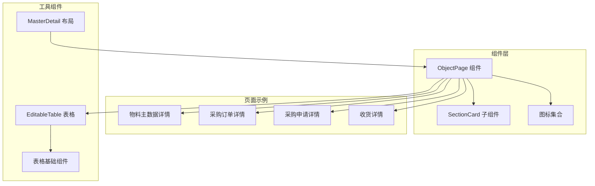
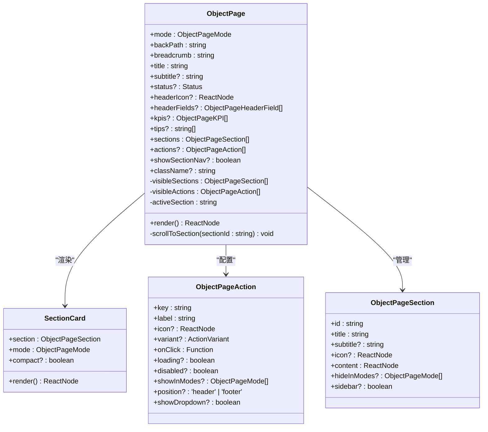
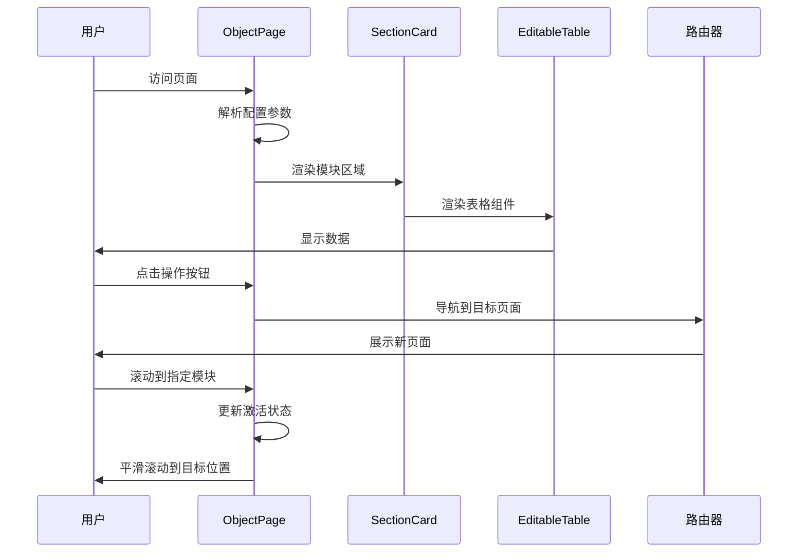
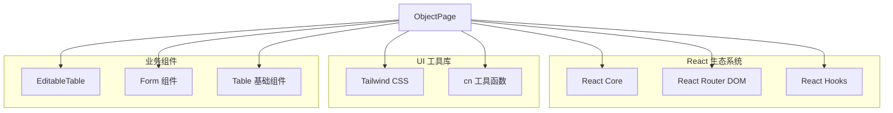

# 对象页面组件 (ObjectPage)

<cite>
**本文档引用的文件**
- [ObjectPage/index.tsx](file://app/examples/admin/src/components/ObjectPage/index.tsx)
- [ViewPage.tsx (物料主数据)](file://app/examples/admin/src/pages/master-data/materials/ViewPage.tsx)
- [ViewPage.tsx (采购订单)](file://app/examples/admin/src/pages/purchase-orders/ViewPage.tsx)
- [ViewPage.tsx (采购申请)](file://app/examples/admin/src/pages/purchase-requisitions/ViewPage.tsx)
- [ViewPage.tsx (收货详情)](file://app/examples/admin/src/pages/goods-receipt/ViewPage.tsx)
- [EditableTable/index.tsx](file://app/examples/admin/src/components/EditableTable/index.tsx)
- [MasterDetail/index.tsx](file://app/examples/admin/src/components/MasterDetail/index.tsx)
- [form.tsx](file://app/framework/admin-component/src/ui/form.tsx)
- [table.tsx](file://app/framework/admin-component/src/ui/table.tsx)
- [utils.ts](file://app/framework/admin-component/src/utils.ts)
- [fiori-theme.css](file://app/framework/admin-component/src/styles/fiori-theme.css)
</cite>

## 目录
1. [简介](#简介)
2. [项目结构](#项目结构)
3. [核心组件](#核心组件)
4. [架构概览](#架构概览)
5. [详细组件分析](#详细组件分析)
6. [依赖关系分析](#依赖关系分析)
7. [性能考虑](#性能考虑)
8. [故障排除指南](#故障排除指南)
9. [结论](#结论)
10. [附录](#附录)

## 简介

ObjectPage 是一个基于 SAP Fiori 设计规范的对象页面组件，专为复杂业务场景设计的详细信息展示和交互界面。该组件提供了完整的页面布局解决方案，支持多种模式（查看、编辑、创建），并集成了丰富的功能模块，包括页面标题、面包屑导航、操作工具栏、内容区域划分等。

ObjectPage 组件遵循 SAP Fiori 的设计原则，采用现代化的视觉语言，提供了一致的用户体验。它支持响应式设计，能够在不同设备和屏幕尺寸上提供最佳的显示效果。

## 项目结构

ObjectPage 组件位于示例应用的组件目录中，与多个业务页面示例相结合，展示了组件在实际场景中的应用。



**图表来源**
- [ObjectPage/index.tsx](file://app/examples/admin/src/components/ObjectPage/index.tsx#L1-L544)
- [ViewPage.tsx (物料主数据)](file://app/examples/admin/src/pages/master-data/materials/ViewPage.tsx#L1-L283)

**章节来源**
- [ObjectPage/index.tsx](file://app/examples/admin/src/components/ObjectPage/index.tsx#L1-L50)
- [ViewPage.tsx (物料主数据)](file://app/examples/admin/src/pages/master-data/materials/ViewPage.tsx#L1-L50)

## 核心组件

### ObjectPage 主组件

ObjectPage 是整个页面的核心组件，负责协调各个子组件和功能模块。它支持三种工作模式：display（详情）、edit（编辑）、create（创建），每种模式都有不同的界面行为和交互逻辑。

#### 主要特性

1. **多模式支持**：根据不同的业务需求提供相应的界面模式
2. **响应式布局**：自适应不同屏幕尺寸的显示效果
3. **模块化设计**：将页面内容划分为独立的功能模块
4. **状态管理**：内置状态管理机制，处理页面的各种状态变化

#### 核心接口定义

组件定义了完整的 TypeScript 接口，确保类型安全和开发体验：

- `ObjectPageMode`：页面模式类型定义
- `ObjectPageAction`：操作按钮配置接口
- `ObjectPageSection`：页面模块配置接口
- `ObjectPageHeaderField`：头部字段配置接口
- `ObjectPageKPI`：关键指标配置接口

**章节来源**
- [ObjectPage/index.tsx](file://app/examples/admin/src/components/ObjectPage/index.tsx#L52-L128)

### SectionCard 子组件

SectionCard 是 ObjectPage 的内部子组件，负责渲染页面的各个模块区域。它支持紧凑模式和正常模式，能够根据内容的复杂程度自动调整显示效果。

#### 功能特点

- **灵活的内容容器**：支持任意类型的 React 组件作为内容
- **图标支持**：每个模块可以配置相应的图标
- **标题和副标题**：提供清晰的模块标识
- **响应式设计**：在不同屏幕尺寸下保持良好的显示效果

**章节来源**
- [ObjectPage/index.tsx](file://app/examples/admin/src/components/ObjectPage/index.tsx#L497-L535)

## 架构概览

ObjectPage 采用了模块化的架构设计，将复杂的页面功能分解为独立的组件和模块，提高了代码的可维护性和可扩展性。



**图表来源**
- [ObjectPage/index.tsx](file://app/examples/admin/src/components/ObjectPage/index.tsx#L96-L128)
- [ObjectPage/index.tsx](file://app/examples/admin/src/components/ObjectPage/index.tsx#L497-L501)

### 数据流架构

ObjectPage 的数据流采用自顶向下的传递方式，确保数据的一致性和可预测性。



**图表来源**
- [ObjectPage/index.tsx](file://app/examples/admin/src/components/ObjectPage/index.tsx#L174-L181)
- [ViewPage.tsx (物料主数据)](file://app/examples/admin/src/pages/master-data/materials/ViewPage.tsx#L269-L278)

## 详细组件分析

### 页面头部设计

ObjectPage 的页面头部是整个组件最引人注目的部分，采用了 SAP Fiori 的渐变色彩设计，营造出专业和现代的视觉效果。

#### 头部元素构成

1. **面包屑导航**：提供层级导航，帮助用户了解当前位置
2. **页面标题**：显示主要的业务对象名称
3. **状态标签**：显示对象的当前状态
4. **操作按钮**：提供快速访问的功能入口
5. **图标装饰**：增强视觉层次感

#### 状态管理机制

组件内置了完善的状态管理机制，能够处理页面的各种状态变化：

- **页面加载状态**：显示加载指示器
- **编辑模式状态**：切换到编辑界面
- **保存状态**：显示保存进度和结果
- **错误处理状态**：展示错误信息和恢复选项

**章节来源**
- [ObjectPage/index.tsx](file://app/examples/admin/src/components/ObjectPage/index.tsx#L215-L298)

### 内容区域布局

ObjectPage 提供了灵活的内容区域布局，支持主内容区和侧边栏的组合显示。

#### 布局策略

1. **无侧边栏布局**：适用于简单的页面结构
2. **双栏布局**：主内容区 + 侧边栏，适合复杂的数据展示
3. **响应式适配**：在移动端自动调整布局

#### 模块化设计

页面内容被划分为多个独立的模块，每个模块都有明确的功能边界：

- **基本信息模块**：展示核心的业务数据
- **规格信息模块**：提供详细的技术规格
- **历史记录模块**：追踪数据的变更历史
- **相关对象模块**：展示关联的业务实体

**章节来源**
- [ObjectPage/index.tsx](file://app/examples/admin/src/components/ObjectPage/index.tsx#L390-L424)

### 操作工具栏设计

ObjectPage 的操作工具栏根据不同的页面模式提供相应的操作选项。

#### 模式特定的工具栏

1. **查看模式**：顶部工具栏，包含所有必要的操作按钮
2. **编辑模式**：底部粘性工具栏，包含保存和取消按钮
3. **创建模式**：底部粘性工具栏，专注于创建流程

#### 按钮变体系统

组件支持多种按钮样式，满足不同的交互需求：

- **主要按钮**：用于最重要的操作
- **次要按钮**：用于辅助操作
- **成功按钮**：用于确认和完成操作
- **危险按钮**：用于删除和取消等敏感操作
- **幽灵按钮**：用于轻量级操作

**章节来源**
- [ObjectPage/index.tsx](file://app/examples/admin/src/components/ObjectPage/index.tsx#L426-L488)

### Section 导航系统

ObjectPage 内置了智能的 Section 导航系统，帮助用户快速定位到页面的不同模块。

#### 导航特性

- **自动激活**：根据滚动位置自动更新激活状态
- **平滑滚动**：提供流畅的页面导航体验
- **响应式设计**：在移动端提供优化的导航体验
- **条件显示**：只在需要时显示导航控件

#### 导航配置

导航系统支持灵活的配置选项：

- **显示/隐藏**：根据页面内容决定是否显示导航
- **模块过滤**：支持按模式过滤显示的模块
- **侧边栏模块**：特殊处理侧边栏中的模块

**章节来源**
- [ObjectPage/index.tsx](file://app/examples/admin/src/components/ObjectPage/index.tsx#L367-L387)

### 实际应用场景

ObjectPage 组件在多个业务场景中得到了广泛应用，展示了其强大的适应性和灵活性。

#### 物料主数据详情

物料主数据详情页面展示了 ObjectPage 在复杂数据展示场景中的应用：

- **关键信息区**：展示物料的核心属性
- **规格信息模块**：详细的技术规格数据
- **库存概览模块**：实时的库存状态
- **变更记录模块**：完整的数据变更历史

#### 采购订单详情

采购订单详情页面体现了 ObjectPage 在供应链管理中的重要作用：

- **订单状态跟踪**：实时显示订单的处理状态
- **供应商信息**：完整的供应商数据展示
- **行项目表格**：详细的采购明细
- **审批历史**：完整的审批流程记录

#### 采购申请详情

采购申请详情页面展示了 ObjectPage 在企业内部流程管理中的应用：

- **申请状态管理**：清晰的状态指示
- **审批流程可视化**：直观的流程展示
- **相关主数据**：关联的物料和供应商信息
- **行项目管理**：详细的申请明细

#### 收货详情

收货详情页面体现了 ObjectPage 在仓储管理中的实用性：

- **收货状态跟踪**：实时的收货进度
- **库存信息**：详细的库存数据
- **收货明细表格**：精确的收货记录
- **处理记录**：完整的处理历史

**章节来源**
- [ViewPage.tsx (物料主数据)](file://app/examples/admin/src/pages/master-data/materials/ViewPage.tsx#L96-L283)
- [ViewPage.tsx (采购订单)](file://app/examples/admin/src/pages/purchase-orders/ViewPage.tsx#L96-L395)
- [ViewPage.tsx (采购申请)](file://app/examples/admin/src/pages/purchase-requisitions/ViewPage.tsx#L144-L478)
- [ViewPage.tsx (收货详情)](file://app/examples/admin/src/pages/goods-receipt/ViewPage.tsx#L76-L270)

## 依赖关系分析

ObjectPage 组件的依赖关系相对简单，主要依赖于 React 生态系统和一些工具函数。



**图表来源**
- [ObjectPage/index.tsx](file://app/examples/admin/src/components/ObjectPage/index.tsx#L7-L10)
- [EditableTable/index.tsx](file://app/examples/admin/src/components/EditableTable/index.tsx#L7-L8)

### 外部依赖

ObjectPage 组件的外部依赖主要包括：

1. **React 生态系统**：使用 React 18 的最新特性
2. **Tailwind CSS**：提供实用的样式类
3. **@aiko-boot/admin-component**：提供基础 UI 组件
4. **react-router-dom**：处理页面导航

### 内部依赖

组件内部的依赖关系清晰且模块化：

- **utils.ts**：提供 cn 工具函数，用于合并 CSS 类名
- **fiori-theme.css**：提供 SAP Fiori 设计规范的主题变量
- **EditableTable**：用于展示表格数据
- **form.tsx**：提供表单验证和状态管理

**章节来源**
- [ObjectPage/index.tsx](file://app/examples/admin/src/components/ObjectPage/index.tsx#L1-L50)
- [utils.ts](file://app/framework/admin-component/src/utils.ts#L1-L7)

## 性能考虑

ObjectPage 组件在设计时充分考虑了性能优化，采用了多种策略来确保良好的用户体验。

### 渲染优化

1. **条件渲染**：根据模式和配置动态决定渲染内容
2. **懒加载**：大型表格组件按需加载
3. **虚拟滚动**：对于大量数据的场景提供虚拟滚动支持

### 内存管理

1. **状态清理**：组件卸载时自动清理状态
2. **事件监听器**：避免内存泄漏的事件监听器管理
3. **资源释放**：及时释放不需要的资源

### 网络优化

1. **缓存策略**：合理利用浏览器缓存
2. **请求合并**：减少不必要的网络请求
3. **错误重试**：提供智能的错误重试机制

## 故障排除指南

### 常见问题及解决方案

#### 页面不显示或显示异常

**问题症状**：
- 页面空白或部分内容缺失
- 样式错乱或布局异常

**可能原因**：
- 缺少必要的依赖包
- CSS 样式未正确加载
- 数据格式不正确

**解决步骤**：
1. 检查依赖包安装情况
2. 确认 CSS 文件正确引入
3. 验证数据结构符合要求

#### 操作按钮无响应

**问题症状**：
- 点击按钮没有反应
- 按钮状态不更新

**可能原因**：
- onClick 函数未正确绑定
- 禁用状态配置错误
- 事件冒泡冲突

**解决步骤**：
1. 检查按钮的 onClick 配置
2. 验证 disabled 和 loading 状态
3. 确认事件处理函数的正确性

#### 导航功能异常

**问题症状**：
- 面包屑导航不工作
- 模块间跳转失败

**可能原因**：
- 路由配置错误
- 导航路径不正确
- 状态管理问题

**解决步骤**：
1. 检查路由配置
2. 验证导航路径
3. 确认状态同步

**章节来源**
- [ObjectPage/index.tsx](file://app/examples/admin/src/components/ObjectPage/index.tsx#L174-L181)

## 结论

ObjectPage 组件是一个功能完整、设计精良的对象页面解决方案。它成功地将 SAP Fiori 设计规范与现代 React 开发实践相结合，为复杂业务场景提供了优雅的页面解决方案。

### 主要优势

1. **设计理念先进**：完全遵循 SAP Fiori 设计规范
2. **功能丰富完整**：涵盖对象页面的所有核心功能
3. **高度可定制**：支持灵活的配置和扩展
4. **性能优化良好**：采用多种性能优化策略
5. **易于使用**：简洁的 API 设计和完善的文档

### 技术特色

- **响应式设计**：完美适配各种设备和屏幕尺寸
- **模块化架构**：清晰的组件结构和职责分离
- **类型安全**：完整的 TypeScript 支持
- **状态管理**：内置的状态管理机制
- **国际化支持**：易于扩展的多语言支持

### 发展前景

ObjectPage 组件为未来的功能扩展奠定了坚实的基础。随着业务需求的不断增长和技术的发展，该组件将继续演进，为用户提供更好的使用体验。

## 附录

### 配置选项详解

#### ObjectPageProps 配置

| 属性名 | 类型 | 必需 | 默认值 | 描述 |
|--------|------|------|--------|------|
| mode | ObjectPageMode | 是 | - | 页面模式：display/edit/create |
| backPath | string | 是 | - | 返回路径 |
| breadcrumb | string | 是 | - | 面包屑文本 |
| title | string | 是 | - | 页面标题 |
| subtitle | string | 否 | - | 副标题 |
| status | ObjectPageStatus | 否 | - | 状态标签配置 |
| headerIcon | ReactNode | 否 | - | 头部图标 |
| headerFields | ObjectPageHeaderField[] | 否 | [] | 头部字段数组 |
| kpis | ObjectPageKPI[] | 否 | [] | KPI 指标数组 |
| tips | string[] | 否 | [] | 提示信息数组 |
| sections | ObjectPageSection[] | 是 | - | 页面模块数组 |
| actions | ObjectPageAction[] | 否 | [] | 操作按钮数组 |
| showSectionNav | boolean | 否 | true | 是否显示模块导航 |
| className | string | 否 | - | 自定义 CSS 类名 |

#### ObjectPageAction 配置

| 属性名 | 类型 | 必需 | 默认值 | 描述 |
|--------|------|------|--------|------|
| key | string | 是 | - | 按钮唯一标识 |
| label | string | 是 | - | 按钮显示文本 |
| icon | ReactNode | 否 | - | 按钮图标 |
| variant | ActionVariant | 否 | 'primary' | 按钮样式变体 |
| onClick | Function | 是 | - | 点击事件处理函数 |
| loading | boolean | 否 | false | 加载状态 |
| disabled | boolean | 否 | false | 禁用状态 |
| showInModes | ObjectPageMode[] | 否 | - | 显示模式限制 |
| position | 'header' \| 'footer' | 否 | 'header' | 按钮位置 |
| showDropdown | boolean | 否 | false | 是否显示下拉箭头 |

#### ObjectPageSection 配置

| 属性名 | 类型 | 必需 | 默认值 | 描述 |
|--------|------|------|--------|------|
| id | string | 是 | - | 模块唯一标识 |
| title | string | 是 | - | 模块标题 |
| subtitle | string | 否 | - | 模块副标题 |
| icon | ReactNode | 否 | - | 模块图标 |
| content | ReactNode | 是 | - | 模块内容 |
| hideInModes | ObjectPageMode[] | 否 | - | 隐藏模式限制 |
| sidebar | boolean | 否 | false | 是否放入侧边栏 |

### 扩展指南

#### 自定义图标

ObjectPage 提供了完整的图标系统，支持自定义图标：

```typescript
// 使用自定义图标
const customIcons = {
  ...ObjectPageIcons,
  customIcon: (
    <svg width="20" height="20" viewBox="0 0 20 20">
      {/* 自定义 SVG 路径 */}
    </svg>
  )
};

// 在组件中使用
<ObjectPage
  headerIcon={customIcons.customIcon}
  sections={[
    {
      id: 'custom',
      title: '自定义模块',
      icon: customIcons.customIcon,
      content: <CustomContent />
    }
  ]}
/>
```

#### 自定义样式

通过 `className` 属性可以轻松自定义组件样式：

```typescript
<ObjectPage
  className="custom-object-page"
  sections={[
    {
      id: 'custom',
      title: '自定义样式模块',
      content: <div className="custom-module-content">内容</div>
    }
  ]}
/>
```

#### 状态管理扩展

ObjectPage 内置了完善的状态管理机制，支持复杂的业务逻辑：

```typescript
const [formData, setFormData] = useState(initialData);
const [isSaving, setIsSaving] = useState(false);
const [saveError, setSaveError] = useState('');

const handleSave = async () => {
  setIsSaving(true);
  try {
    await saveData(formData);
    setIsSaving(false);
    // 处理保存成功
  } catch (error) {
    setIsSaving(false);
    setSaveError(error.message);
  }
};

<ObjectPage
  actions={[
    {
      key: 'save',
      label: '保存',
      icon: ObjectPageIcons.save,
      variant: 'success',
      onClick: handleSave,
      loading: isSaving,
      disabled: isSaving
    }
  ]}
/>
```

### 国际化支持

ObjectPage 组件天然支持国际化，可以通过以下方式实现多语言：

```typescript
// 使用 i18n 库
import { useTranslation } from 'react-i18next';

const MyPage = () => {
  const { t } = useTranslation();
  
  return (
    <ObjectPage
      title={t('page.title')}
      breadcrumb={t('page.breadcrumb')}
      sections={[
        {
          id: 'info',
          title: t('section.info'),
          content: <div>{t('section.info.content')}</div>
        }
      ]}
      actions={[
        {
          key: 'save',
          label: t('action.save'),
          icon: ObjectPageIcons.save,
          onClick: handleSave
        }
      ]}
    />
  );
};
```

### 与后端 API 集成

ObjectPage 组件可以轻松与后端 API 集成，支持常见的数据获取和更新场景：

```typescript
// 使用 React Query 进行数据管理
import { useQuery, useMutation } from '@tanstack/react-query';

const MyPage = ({ id }) => {
  // 获取数据
  const { data, isLoading, isError } = useQuery({
    queryKey: ['object', id],
    queryFn: () => fetchObject(id)
  });

  // 更新数据
  const mutation = useMutation({
    mutationFn: (updatedData) => updateObject(id, updatedData),
    onSuccess: () => {
      // 刷新数据
      refetch();
    }
  });

  if (isLoading) return <div>加载中...</div>;
  if (isError) return <div>加载失败</div>;

  return (
    <ObjectPage
      title={data.title}
      sections={[
        {
          id: 'details',
          title: '详情',
          content: <div>{data.content}</div>
        }
      ]}
      actions={[
        {
          key: 'edit',
          label: '编辑',
          onClick: () => {
            // 触发编辑模式
            mutation.mutate(updatedData);
          }
        }
      ]}
    />
  );
};
```