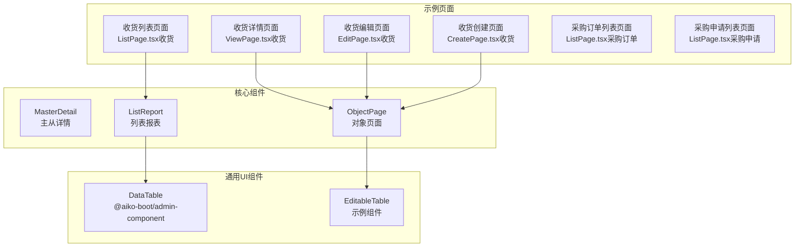
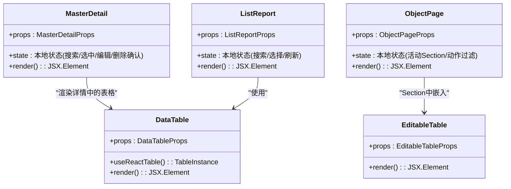
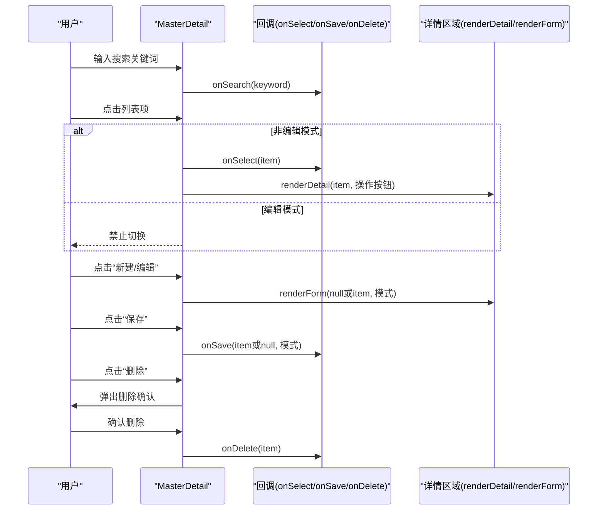
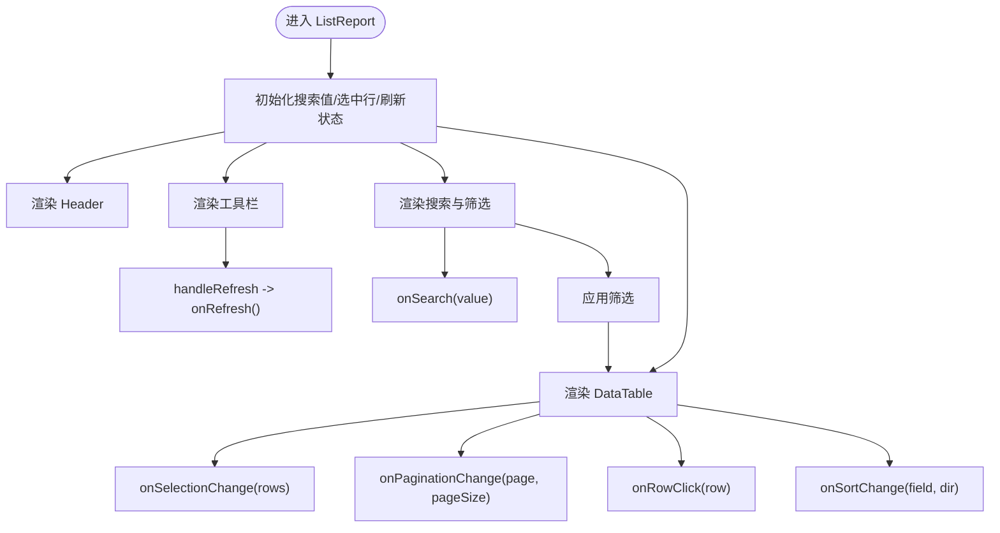
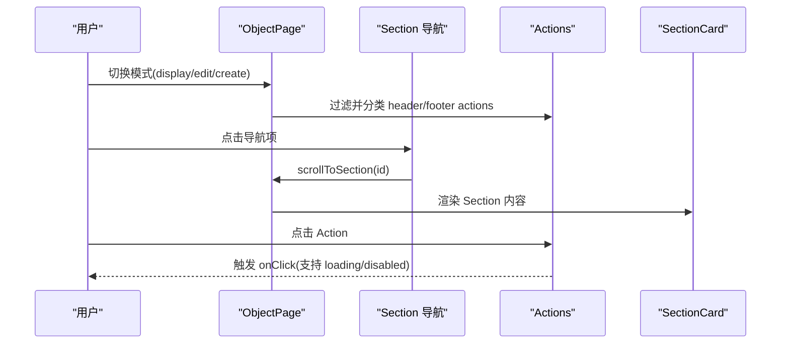
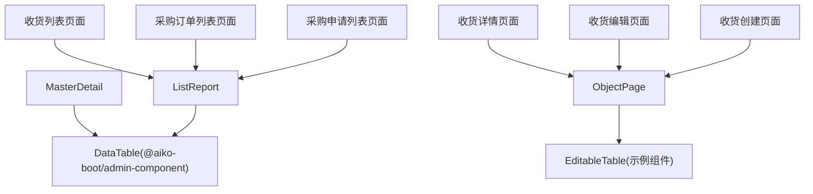

# 核心业务组件

<cite>
**本文引用的文件**
- [MasterDetail/index.tsx](file://app/examples/admin/src/components/MasterDetail/index.tsx)
- [ListReport/index.tsx](file://app/examples/admin/src/components/ListReport/index.tsx)
- [ObjectPage/index.tsx](file://app/examples/admin/src/components/ObjectPage/index.tsx)
- [data-table.tsx](file://app/framework/admin-component/src/ui/data-table.tsx)
- [EditableTable/index.tsx](file://app/examples/admin/src/components/EditableTable/index.tsx)
- [ListPage.tsx（收货）](file://app/examples/admin/src/pages/goods-receipt/ListPage.tsx)
- [ViewPage.tsx（收货）](file://app/examples/admin/src/pages/goods-receipt/ViewPage.tsx)
- [EditPage.tsx（收货）](file://app/examples/admin/src/pages/goods-receipt/EditPage.tsx)
- [CreatePage.tsx（收货）](file://app/examples/admin/src/pages/goods-receipt/CreatePage.tsx)
- [ListPage.tsx（采购订单）](file://app/examples/admin/src/pages/purchase-orders/ListPage.tsx)
- [ListPage.tsx（采购申请）](file://app/examples/admin/src/pages/purchase-requisitions/ListPage.tsx)
</cite>

## 目录
1. [简介](#简介)
2. [项目结构](#项目结构)
3. [核心组件](#核心组件)
4. [架构总览](#架构总览)
5. [详细组件分析](#详细组件分析)
6. [依赖关系分析](#依赖关系分析)
7. [性能考量](#性能考量)
8. [故障排查指南](#故障排查指南)
9. [结论](#结论)
10. [附录](#附录)

## 简介
本文件围绕三大核心业务组件：主从详情（MasterDetail）、列表报表（ListReport）、对象页面（ObjectPage），系统化梳理其设计模式、实现原理与使用方法。重点阐述：
- 数据流与状态管理（本地状态、受控/非受控模式）
- 事件处理与组件间通信（路由跳转、回调函数）
- 属性配置、事件回调、样式定制与扩展点
- 实战组合：在示例页面中如何通过这些组件构建复杂业务界面（数据绑定、搜索过滤、分页处理）

## 项目结构
三大组件均位于示例应用的组件目录，配合框架层的通用 UI 组件（如数据表格）与示例页面共同构成完整业务闭环。

图表来源
- [ListPage.tsx（收货）](file://app/examples/admin/src/pages/goods-receipt/ListPage.tsx#L203-L274)
- [ViewPage.tsx（收货）](file://app/examples/admin/src/pages/goods-receipt/ViewPage.tsx#L84-L266)
- [EditPage.tsx（收货）](file://app/examples/admin/src/pages/goods-receipt/EditPage.tsx#L73-L207)
- [CreatePage.tsx（收货）](file://app/examples/admin/src/pages/goods-receipt/CreatePage.tsx#L112-L263)
- [ListPage.tsx（采购订单）](file://app/examples/admin/src/pages/purchase-orders/ListPage.tsx#L205-L290)
- [ListPage.tsx（采购申请）](file://app/examples/admin/src/pages/purchase-requisitions/ListPage.tsx#L196-L265)
- [ListReport/index.tsx](file://app/examples/admin/src/components/ListReport/index.tsx#L145-L392)
- [ObjectPage/index.tsx](file://app/examples/admin/src/components/ObjectPage/index.tsx#L131-L544)
- [MasterDetail/index.tsx](file://app/examples/admin/src/components/MasterDetail/index.tsx#L113-L355)
- [data-table.tsx](file://app/framework/admin-component/src/ui/data-table.tsx#L73-L375)
- [EditableTable/index.tsx](file://app/examples/admin/src/components/EditableTable/index.tsx#L54-L160)

章节来源
- [ListPage.tsx（收货）](file://app/examples/admin/src/pages/goods-receipt/ListPage.tsx#L1-L278)
- [ListPage.tsx（采购订单）](file://app/examples/admin/src/pages/purchase-orders/ListPage.tsx#L1-L296)
- [ListPage.tsx（采购申请）](file://app/examples/admin/src/pages/purchase-requisitions/ListPage.tsx#L1-L271)
- [ListReport/index.tsx](file://app/examples/admin/src/components/ListReport/index.tsx#L1-L398)
- [ObjectPage/index.tsx](file://app/examples/admin/src/components/ObjectPage/index.tsx#L1-L544)
- [MasterDetail/index.tsx](file://app/examples/admin/src/components/MasterDetail/index.tsx#L1-L498)
- [data-table.tsx](file://app/framework/admin-component/src/ui/data-table.tsx#L1-L375)
- [EditableTable/index.tsx](file://app/examples/admin/src/components/EditableTable/index.tsx#L1-L308)

## 核心组件
- MasterDetail：左侧列表 + 右侧详情的主从布局，支持查看/编辑/新建模式，内置搜索、空状态、删除确认等交互。
- ListReport：一体化卡片风格的列表报表，包含 Header、工具栏、搜索筛选、数据表格与分页，适合“列表+筛选+表格”的统一视图。
- ObjectPage：对象页面，支持 display/edit/create 三种模式，提供 Section 区块、KPI 指标、操作按钮、侧边栏导航与底部粘浮工具栏。

章节来源
- [MasterDetail/index.tsx](file://app/examples/admin/src/components/MasterDetail/index.tsx#L113-L355)
- [ListReport/index.tsx](file://app/examples/admin/src/components/ListReport/index.tsx#L145-L392)
- [ObjectPage/index.tsx](file://app/examples/admin/src/components/ObjectPage/index.tsx#L131-L544)

## 架构总览
三大组件与通用 UI 组件的关系如下：

图表来源
- [MasterDetail/index.tsx](file://app/examples/admin/src/components/MasterDetail/index.tsx#L268-L389)
- [ListReport/index.tsx](file://app/examples/admin/src/components/ListReport/index.tsx#L377-L389)
- [ObjectPage/index.tsx](file://app/examples/admin/src/components/ObjectPage/index.tsx#L396-L424)
- [data-table.tsx](file://app/framework/admin-component/src/ui/data-table.tsx#L73-L375)
- [EditableTable/index.tsx](file://app/examples/admin/src/components/EditableTable/index.tsx#L54-L160)

## 详细组件分析

### MasterDetail（主从详情）
- 设计模式：双面板布局，左侧列表作为导航，右侧详情作为内容区；支持查看/编辑/新建三种模式切换。
- 数据流与状态：
  - 本地状态：搜索关键字、当前选中项、编辑模式、删除确认弹窗。
  - 受控模式：可通过外部传入 selectedId 控制选中项；onSelect 回调用于外部同步。
- 事件处理：
  - 搜索：onSearch 回调触发外部搜索逻辑。
  - 选中：handleSelect 触发 onSelect，并在编辑模式下禁止切换。
  - 编辑/新建/保存/删除：对应 handleEdit/handleCreate/handleSave/handleDeleteClick/handleDeleteConfirm。
- 组件间通信：
  - 通过 props 回调与外部交互（onSelect/onSave/onDelete）。
  - Detail 区域支持渲染自定义操作按钮（由 renderDetail 的第二个参数传入）。
- 扩展点：
  - DetailSection/DetailField/DetailFieldGrid 提供详情区块、字段与网格布局。
  - 支持自定义空状态 renderEmpty。
- 样式与布局：
  - Master 列表宽度可配置，编辑模式下 Master 区域半透明禁用交互。
  - Detail 区域底部粘性工具栏仅在编辑模式显示。

图表来源
- [MasterDetail/index.tsx](file://app/examples/admin/src/components/MasterDetail/index.tsx#L142-L179)
- [MasterDetail/index.tsx](file://app/examples/admin/src/components/MasterDetail/index.tsx#L268-L304)

章节来源
- [MasterDetail/index.tsx](file://app/examples/admin/src/components/MasterDetail/index.tsx#L113-L355)

### ListReport（列表报表）
- 设计模式：一体化卡片风格，Header + 工具栏 + 搜索筛选 + 数据表格 + 分页，适合“列表+筛选+表格”的统一视图。
- 数据流与状态：
  - 本地状态：搜索值、选中行集合、刷新动画。
  - 受控模式：通过 pageSize/pageIndex/onPaginationChange 实现服务端分页。
- 事件处理：
  - 搜索：onSearch 回调。
  - 刷新：handleRefresh 触发 onRefresh 并带动画反馈。
  - 选择：onSelectionChange 回调返回选中行集合。
  - 分页：onPaginationChange 返回 page/pageSize。
- 组件间通信：
  - 通过 props 回调与外部交互（onSearch/onRefresh/onSelectionChange/onPaginationChange）。
  - 使用 @aiko-boot/admin-component 的 DataTable 组件承载表格能力。
- 扩展点：
  - filterContent 自定义筛选区域。
  - selectionActions 自定义行级批量操作。
  - primaryAction 主操作按钮。
- 样式与布局：
  - Header 渐变背景 + 装饰圆形；工具栏显示选择数量或显示条数；搜索与筛选区域支持“应用”按钮。

图表来源
- [ListReport/index.tsx](file://app/examples/admin/src/components/ListReport/index.tsx#L170-L194)
- [ListReport/index.tsx](file://app/examples/admin/src/components/ListReport/index.tsx#L377-L389)
- [data-table.tsx](file://app/framework/admin-component/src/ui/data-table.tsx#L73-L375)

章节来源
- [ListReport/index.tsx](file://app/examples/admin/src/components/ListReport/index.tsx#L145-L392)
- [data-table.tsx](file://app/framework/admin-component/src/ui/data-table.tsx#L73-L375)

### ObjectPage（对象页面）
- 设计模式：对象页面，支持 display/edit/create 三种模式；Section 区块组织内容，支持侧边栏与底部粘浮工具栏。
- 数据流与状态：
  - 本地状态：活动 Section、可见 Actions、导航 Sections。
  - 模式控制：mode 决定显示/编辑/创建行为与按钮位置。
- 事件处理：
  - 滚动到 Section：scrollToSection。
  - Actions：根据 showInModes 与 position 决定显示与位置。
- 组件间通信：
  - 通过 actions.onClick 与外部交互；支持 loading/disabled。
  - tips 提示信息；kpis 展示指标。
- 扩展点：
  - sections 支持 sidebar 侧边栏；showSectionNav 控制导航显示。
  - SectionCard 支持 compact 模式。
- 样式与布局：
  - Header 渐变背景 + 装饰圆形；关键信息区与 KPI 区；Section 导航吸顶；底部粘浮工具栏仅在 edit/create 显示。

图表来源
- [ObjectPage/index.tsx](file://app/examples/admin/src/components/ObjectPage/index.tsx#L147-L181)
- [ObjectPage/index.tsx](file://app/examples/admin/src/components/ObjectPage/index.tsx#L157-L172)
- [ObjectPage/index.tsx](file://app/examples/admin/src/components/ObjectPage/index.tsx#L396-L424)

章节来源
- [ObjectPage/index.tsx](file://app/examples/admin/src/components/ObjectPage/index.tsx#L131-L544)

## 依赖关系分析

图表来源
- [MasterDetail/index.tsx](file://app/examples/admin/src/components/MasterDetail/index.tsx#L268-L389)
- [ListReport/index.tsx](file://app/examples/admin/src/components/ListReport/index.tsx#L377-L389)
- [ObjectPage/index.tsx](file://app/examples/admin/src/components/ObjectPage/index.tsx#L396-L424)
- [ListPage.tsx（收货）](file://app/examples/admin/src/pages/goods-receipt/ListPage.tsx#L203-L274)
- [ViewPage.tsx（收货）](file://app/examples/admin/src/pages/goods-receipt/ViewPage.tsx#L84-L266)
- [EditPage.tsx（收货）](file://app/examples/admin/src/pages/goods-receipt/EditPage.tsx#L73-L207)
- [CreatePage.tsx（收货）](file://app/examples/admin/src/pages/goods-receipt/CreatePage.tsx#L112-L263)
- [ListPage.tsx（采购订单）](file://app/examples/admin/src/pages/purchase-orders/ListPage.tsx#L205-L290)
- [ListPage.tsx（采购申请）](file://app/examples/admin/src/pages/purchase-requisitions/ListPage.tsx#L196-L265)

章节来源
- [MasterDetail/index.tsx](file://app/examples/admin/src/components/MasterDetail/index.tsx#L1-L498)
- [ListReport/index.tsx](file://app/examples/admin/src/components/ListReport/index.tsx#L1-L398)
- [ObjectPage/index.tsx](file://app/examples/admin/src/components/ObjectPage/index.tsx#L1-L544)
- [data-table.tsx](file://app/framework/admin-component/src/ui/data-table.tsx#L1-L375)
- [EditableTable/index.tsx](file://app/examples/admin/src/components/EditableTable/index.tsx#L1-L308)
- [ListPage.tsx（收货）](file://app/examples/admin/src/pages/goods-receipt/ListPage.tsx#L1-L278)
- [ViewPage.tsx（收货）](file://app/examples/admin/src/pages/goods-receipt/ViewPage.tsx#L1-L270)
- [EditPage.tsx（收货）](file://app/examples/admin/src/pages/goods-receipt/EditPage.tsx#L1-L211)
- [CreatePage.tsx（收货）](file://app/examples/admin/src/pages/goods-receipt/CreatePage.tsx#L1-L267)
- [ListPage.tsx（采购订单）](file://app/examples/admin/src/pages/purchase-orders/ListPage.tsx#L1-L296)
- [ListPage.tsx（采购申请）](file://app/examples/admin/src/pages/purchase-requisitions/ListPage.tsx#L1-L271)

## 性能考量
- 列表报表（ListReport + DataTable）
  - 使用 @tanstack/react-table，具备虚拟化与分页能力；建议结合服务端分页（onPaginationChange）与排序（onSortChange）以降低前端渲染压力。
  - 通过 enableRowSelection 与 getRowId 优化选择状态管理。
- 主从详情（MasterDetail）
  - 列表项渲染采用轻量组件 MasterListItem，避免在列表中嵌入重型子树。
  - 编辑模式下禁用 Master 区域交互，减少不必要的事件处理。
- 对象页面（ObjectPage）
  - Section 导航吸顶与底部粘浮工具栏会增加滚动计算成本，建议在移动端谨慎使用。
  - EditableTable 嵌入模式（embedded=true）减少边框阴影，提升滚动性能。

[本节为通用指导，不直接分析具体文件]

## 故障排查指南
- 列表报表无数据或加载异常
  - 检查 data 与 totalCount 是否正确传递；若使用服务端分页，确保 onPaginationChange 正确更新 page/pageSize。
  - 若启用排序，确认 onSortChange 能正确接收字段与方向。
- 主从详情无法切换
  - 编辑模式下会禁用列表项点击；检查 editMode 状态是否意外保持为非 view。
  - 确认 selectedId 与 items 的 id 匹配，避免选中项丢失。
- 对象页面导航无效
  - 确保 sections 的 id 唯一且与 scrollToSection 参数一致。
  - 检查 showSectionNav 与 sidebar 配置，确认导航显示逻辑符合预期。
- 表格分页/排序/选择不同步
  - 确保外部传入的 pageIndex/pageSize 与 totalCount 与服务端一致。
  - 检查 getRowId 是否稳定，避免选择状态错乱。

章节来源
- [data-table.tsx](file://app/framework/admin-component/src/ui/data-table.tsx#L149-L190)
- [ListReport/index.tsx](file://app/examples/admin/src/components/ListReport/index.tsx#L164-L169)
- [MasterDetail/index.tsx](file://app/examples/admin/src/components/MasterDetail/index.tsx#L147-L151)
- [ObjectPage/index.tsx](file://app/examples/admin/src/components/ObjectPage/index.tsx#L174-L181)

## 结论
三大核心业务组件分别覆盖“主从导航”“列表报表”“对象页面”三大典型业务形态。通过清晰的属性接口、回调事件与扩展点，它们能够灵活适配多种业务场景。配合通用 UI 组件（DataTable/EditableTable）与示例页面，开发者可以快速搭建复杂业务界面，实现数据绑定、搜索过滤、分页处理与交互一致性。

[本节为总结性内容，不直接分析具体文件]

## 附录

### 组件属性与事件速览（按组件）
- MasterDetail
  - 关键属性：title/subtitle/headerIcon/items/selectedId/onSelect/renderDetail/renderForm/renderEmpty/searchPlaceholder/onSearch/showCreate/createLabel/allowEdit/allowDelete/onSave/onDelete/masterWidth
  - 关键事件：onSelect/onSearch/onSave/onDelete
  - 扩展：DetailSection/DetailField/DetailFieldGrid
- ListReport
  - 关键属性：header(data/table)/data/columns/loading/totalCount/loading/primaryAction/selectionActions/searchPlaceholder/onSearch/showFilter/onFilterToggle/filterContent/filterCount/onFilterClear/onRefresh/onExport/onRowClick/onSelectionChange/pageSize/pageIndex/onPaginationChange/getRowId/className
  - 关键事件：onSearch/onRefresh/onExport/onRowClick/onSelectionChange/onPaginationChange
- ObjectPage
  - 关键属性：mode/backPath/breadcrumb/title/subtitle/status/headerIcon/headerFields/kpis/tips/sections/actions/showSectionNav/className
  - 关键事件：actions.onClick（内部触发）
  - 扩展：SectionCard/ObjectPageIcons

章节来源
- [MasterDetail/index.tsx](file://app/examples/admin/src/components/MasterDetail/index.tsx#L28-L65)
- [ListReport/index.tsx](file://app/examples/admin/src/components/ListReport/index.tsx#L94-L141)
- [ObjectPage/index.tsx](file://app/examples/admin/src/components/ObjectPage/index.tsx#L96-L128)

### 实战组合示例（数据绑定、搜索过滤、分页）
- 收货管理（ListReport + DataTable）
  - 列定义：通过 DataTableColumn 配置列头、对齐、排序与单元格渲染。
  - 筛选：filterContent 自定义 Select/Input；filterCount 与 onFilterClear 控制筛选状态。
  - 分页：totalCount + onPaginationChange 实现服务端分页。
  - 搜索：onSearch 回调驱动外部查询。
- 收货详情/编辑/创建（ObjectPage + EditableTable）
  - ObjectPage 模式：display/edit/create 控制按钮与布局。
  - EditableTable：在 Section 中嵌入表格，支持行内输入、选择与汇总行。
  - 导航：Section 导航吸顶，底部粘浮工具栏在 edit/create 模式显示。
- 主从详情（MasterDetail）
  - 适用于需要“列表 + 详情”的场景；支持搜索、空状态、删除确认等交互。

章节来源
- [ListPage.tsx（收货）](file://app/examples/admin/src/pages/goods-receipt/ListPage.tsx#L89-L274)
- [ViewPage.tsx（收货）](file://app/examples/admin/src/pages/goods-receipt/ViewPage.tsx#L112-L266)
- [EditPage.tsx（收货）](file://app/examples/admin/src/pages/goods-receipt/EditPage.tsx#L105-L207)
- [CreatePage.tsx（收货）](file://app/examples/admin/src/pages/goods-receipt/CreatePage.tsx#L150-L263)
- [ListPage.tsx（采购订单）](file://app/examples/admin/src/pages/purchase-orders/ListPage.tsx#L92-L290)
- [ListPage.tsx（采购申请）](file://app/examples/admin/src/pages/purchase-requisitions/ListPage.tsx#L88-L265)
- [data-table.tsx](file://app/framework/admin-component/src/ui/data-table.tsx#L30-L69)
- [EditableTable/index.tsx](file://app/examples/admin/src/components/EditableTable/index.tsx#L10-L51)