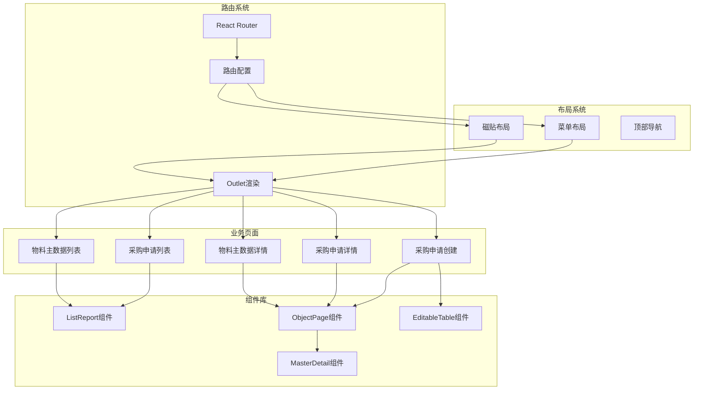
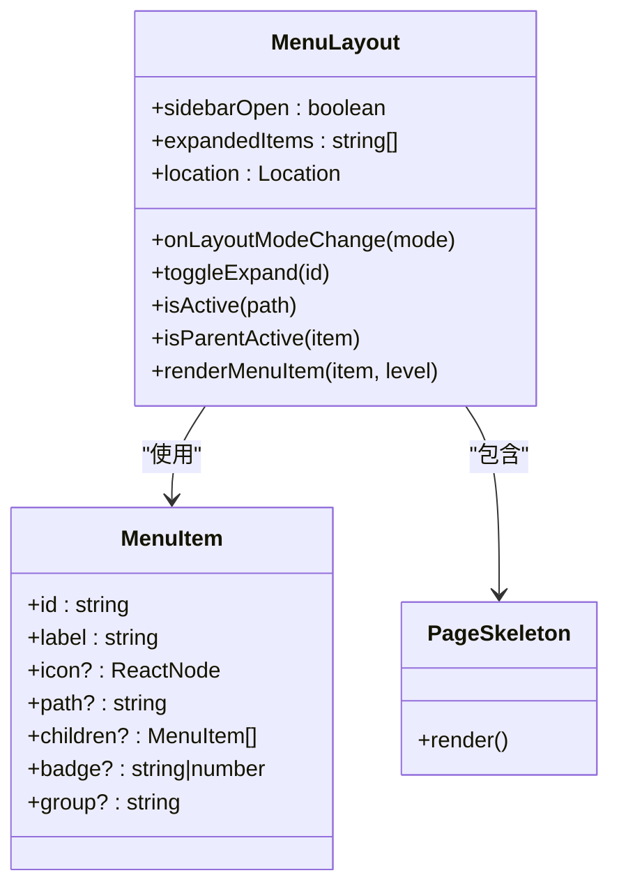
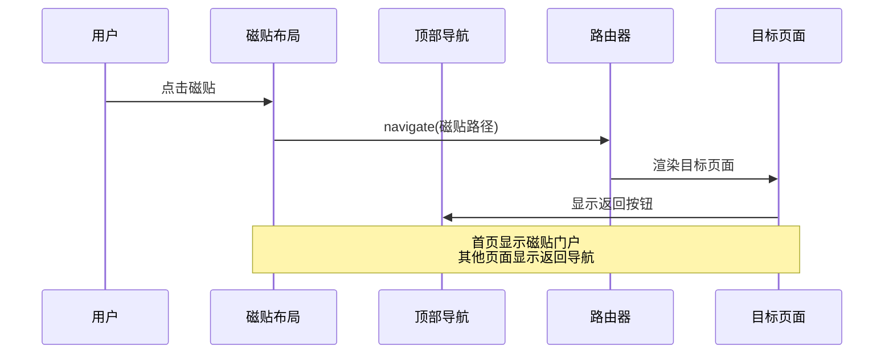
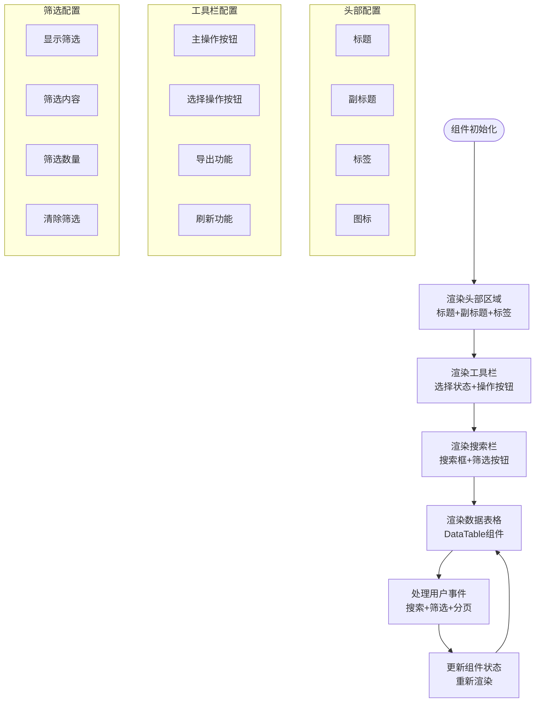
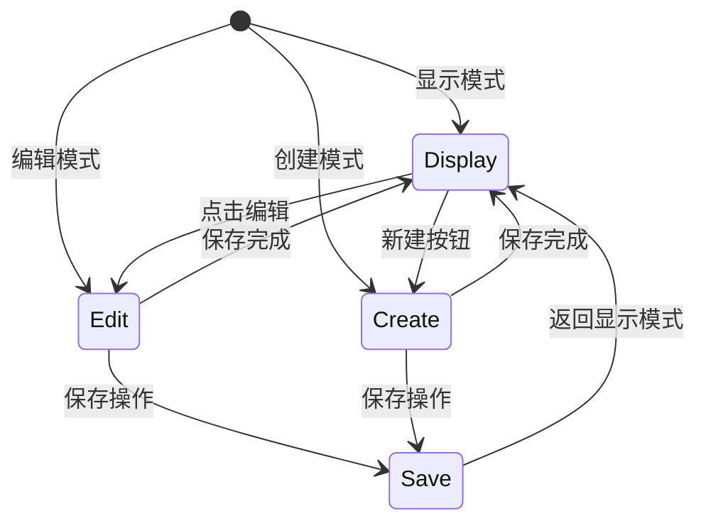
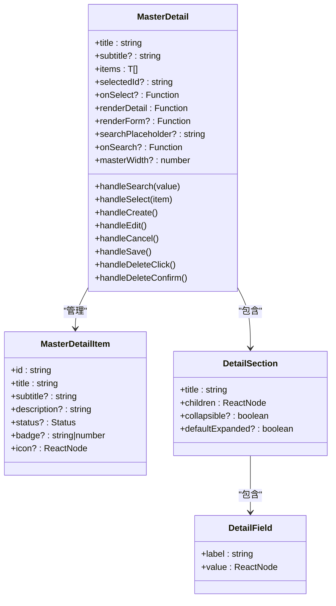
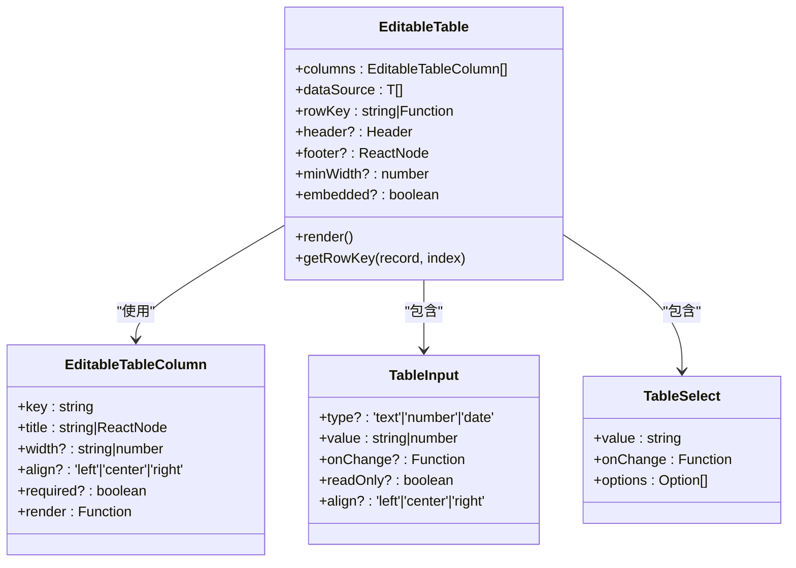
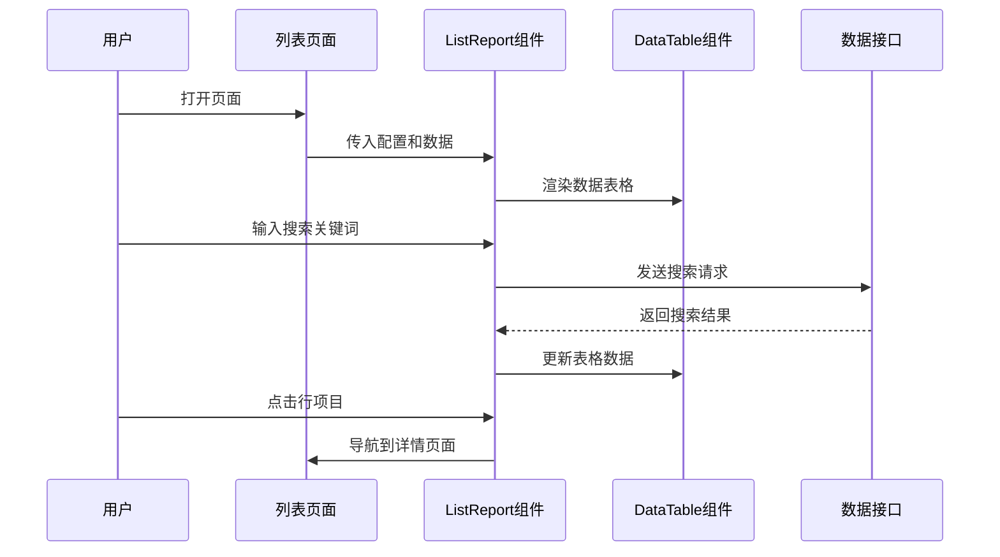
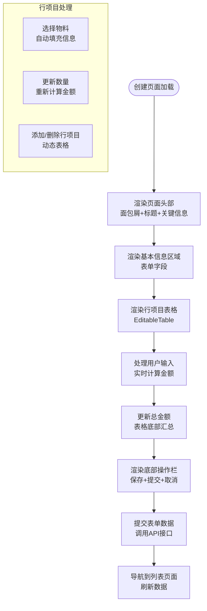

# 管理员界面示例

<cite>
**本文档引用的文件**
- [App.tsx](file://app/examples/admin/src/App.tsx)
- [main.tsx](file://app/examples/admin/src/main.tsx)
- [MenuLayout.tsx](file://app/examples/admin/src/layouts/MenuLayout.tsx)
- [TileLayout.tsx](file://app/examples/admin/src/layouts/TileLayout.tsx)
- [HomePage.tsx](file://app/examples/admin/src/pages/HomePage.tsx)
- [ShellBar.tsx](file://app/examples/admin/src/components/ShellBar.tsx)
- [MasterDetail/index.tsx](file://app/examples/admin/src/components/MasterDetail/index.tsx)
- [ListReport/index.tsx](file://app/examples/admin/src/components/ListReport/index.tsx)
- [ObjectPage/index.tsx](file://app/examples/admin/src/components/ObjectPage/index.tsx)
- [EditableTable/index.tsx](file://app/examples/admin/src/components/EditableTable/index.tsx)
- [ListPage.tsx (采购申请)](file://app/examples/admin/src/pages/purchase-requisitions/ListPage.tsx)
- [CreatePage.tsx (采购申请)](file://app/examples/admin/src/pages/purchase-requisitions/CreatePage.tsx)
- [ListPage.tsx (物料主数据)](file://app/examples/admin/src/pages/master-data/materials/ListPage.tsx)
- [ViewPage.tsx (物料主数据)](file://app/examples/admin/src/pages/master-data/materials/ViewPage.tsx)
- [index.ts](file://app/framework/admin-component/src/index.ts)
</cite>

## 目录
1. [简介](#简介)
2. [项目结构](#项目结构)
3. [核心组件](#核心组件)
4. [架构总览](#架构总览)
5. [详细组件分析](#详细组件分析)
6. [依赖关系分析](#依赖关系分析)
7. [性能考虑](#性能考虑)
8. [故障排除指南](#故障排除指南)
9. [结论](#结论)
10. [附录](#附录)

## 简介
本项目是一个基于 SAP Fiori 设计规范的复杂管理界面示例，展示了现代企业级管理系统的典型实现。项目采用 React + TypeScript 构建，结合自研的管理组件库，提供了菜单布局与磁贴布局两种门户模式，以及多种核心业务组件的完整实现。

该示例涵盖了完整的采购管理业务流程，包括采购申请、采购订单、收货管理、主数据维护等功能模块，体现了从列表报表到对象页面再到主从详情的完整业务闭环。

## 项目结构
项目采用清晰的分层架构设计，主要分为以下几个层次：

```mermaid
graph TB
subgraph "应用层"
App[App.tsx 应用入口]
Pages[页面组件]
Layouts[布局组件]
end
subgraph "组件层"
Business[业务组件]
Base[基础组件]
Utils[工具函数]
end
subgraph "框架层"
AdminComp[@aiko-boot/admin-component]
Shared[共享样式]
end
subgraph "数据层"
Mock[模拟数据]
API[API接口]
end
App --> Layouts
App --> Pages
Pages --> Business
Business --> Base
Base --> AdminComp
AdminComp --> Shared
Business --> Mock
Business --> API
```

**图表来源**
- [App.tsx](file://app/examples/admin/src/App.tsx#L1-L174)
- [index.ts](file://app/framework/admin-component/src/index.ts#L1-L38)

**章节来源**
- [App.tsx](file://app/examples/admin/src/App.tsx#L1-L174)
- [main.tsx](file://app/examples/admin/src/main.tsx#L1-L11)

## 核心组件
本项目的核心组件体系围绕 SAP Fiori 设计规范构建，主要包括以下几类：

### 布局组件
- **MenuLayout**: 传统菜单式布局，支持侧边栏导航和折叠功能
- **TileLayout**: 磁贴式门户布局，基于 SAP Fiori Launchpad 设计
- **ShellBar**: 顶部导航栏，集成搜索、通知、用户菜单等功能

### 业务组件
- **ListReport**: 列表报表组件，实现 SAP Fiori List Report Floorplan
- **ObjectPage**: 对象页面组件，支持显示、编辑、创建三种模式
- **MasterDetail**: 主从详情布局，左侧列表右侧详情的经典组合
- **EditableTable**: 表单内嵌可编辑表格，适用于行项目编辑场景

### 基础组件
- **Button/Dialog/Input/Select/Table/Form** 等通用 UI 组件
- **DataTable**: 高性能数据表格组件
- **StatusChip**: 状态标签组件
- **SearchFilterBar**: 搜索筛选条组件

**章节来源**
- [MenuLayout.tsx](file://app/examples/admin/src/layouts/MenuLayout.tsx#L1-L421)
- [TileLayout.tsx](file://app/examples/admin/src/layouts/TileLayout.tsx#L1-L454)
- [ShellBar.tsx](file://app/examples/admin/src/components/ShellBar.tsx#L1-L299)
- [ListReport/index.tsx](file://app/examples/admin/src/components/ListReport/index.tsx#L1-L398)
- [ObjectPage/index.tsx](file://app/examples/admin/src/components/ObjectPage/index.tsx#L1-L544)
- [MasterDetail/index.tsx](file://app/examples/admin/src/components/MasterDetail/index.tsx#L1-L498)
- [EditableTable/index.tsx](file://app/examples/admin/src/components/EditableTable/index.tsx#L1-L308)
- [index.ts](file://app/framework/admin-component/src/index.ts#L1-L38)

## 架构总览
项目采用模块化的架构设计，通过路由系统实现页面间的导航和状态管理。



**图表来源**
- [App.tsx](file://app/examples/admin/src/App.tsx#L72-L171)
- [MenuLayout.tsx](file://app/examples/admin/src/layouts/MenuLayout.tsx#L160-L418)
- [TileLayout.tsx](file://app/examples/admin/src/layouts/TileLayout.tsx#L200-L453)

**章节来源**
- [App.tsx](file://app/examples/admin/src/App.tsx#L72-L171)

## 详细组件分析

### 菜单布局组件 (MenuLayout)
MenuLayout 实现了传统的侧边栏导航布局，支持多级菜单展开和激活状态管理。



**图表来源**
- [MenuLayout.tsx](file://app/examples/admin/src/layouts/MenuLayout.tsx#L92-L158)
- [MenuLayout.tsx](file://app/examples/admin/src/layouts/MenuLayout.tsx#L160-L418)

**章节来源**
- [MenuLayout.tsx](file://app/examples/admin/src/layouts/MenuLayout.tsx#L1-L421)

### 磁贴布局组件 (TileLayout)
TileLayout 提供了企业门户风格的磁贴式布局，支持应用磁贴的分类管理和收藏功能。



**图表来源**
- [TileLayout.tsx](file://app/examples/admin/src/layouts/TileLayout.tsx#L200-L453)
- [ShellBar.tsx](file://app/examples/admin/src/components/ShellBar.tsx#L91-L299)

**章节来源**
- [TileLayout.tsx](file://app/examples/admin/src/layouts/TileLayout.tsx#L1-L454)

### 列表报表组件 (ListReport)
ListReport 组件实现了 SAP Fiori List Report 的完整设计，包含头部、工具栏、搜索筛选和数据表格。



**图表来源**
- [ListReport/index.tsx](file://app/examples/admin/src/components/ListReport/index.tsx#L73-L141)
- [ListReport/index.tsx](file://app/examples/admin/src/components/ListReport/index.tsx#L145-L392)

**章节来源**
- [ListReport/index.tsx](file://app/examples/admin/src/components/ListReport/index.tsx#L1-L398)

### 对象页面组件 (ObjectPage)
ObjectPage 组件支持显示、编辑、创建三种模式，是 SAP Fiori Object Page Floorplan 的完整实现。



**图表来源**
- [ObjectPage/index.tsx](file://app/examples/admin/src/components/ObjectPage/index.tsx#L52-L128)
- [ObjectPage/index.tsx](file://app/examples/admin/src/components/ObjectPage/index.tsx#L131-L494)

**章节来源**
- [ObjectPage/index.tsx](file://app/examples/admin/src/components/ObjectPage/index.tsx#L1-L544)

### 主从详情组件 (MasterDetail)
MasterDetail 组件实现了经典的左右布局，左侧为列表，右侧为详情，支持编辑模式切换。



**图表来源**
- [MasterDetail/index.tsx](file://app/examples/admin/src/components/MasterDetail/index.tsx#L13-L65)
- [MasterDetail/index.tsx](file://app/examples/admin/src/components/MasterDetail/index.tsx#L113-L355)

**章节来源**
- [MasterDetail/index.tsx](file://app/examples/admin/src/components/MasterDetail/index.tsx#L1-L498)

### 可编辑表格组件 (EditableTable)
EditableTable 是专门为表单内嵌场景设计的可编辑表格组件。



**图表来源**
- [EditableTable/index.tsx](file://app/examples/admin/src/components/EditableTable/index.tsx#L11-L51)
- [EditableTable/index.tsx](file://app/examples/admin/src/components/EditableTable/index.tsx#L54-L160)

**章节来源**
- [EditableTable/index.tsx](file://app/examples/admin/src/components/EditableTable/index.tsx#L1-L308)

### 业务页面示例

#### 采购申请列表页面
该页面展示了如何使用 ListReport 组件构建完整的列表管理界面。



**图表来源**
- [ListPage.tsx (采购申请)](file://app/examples/admin/src/pages/purchase-requisitions/ListPage.tsx#L71-L271)
- [ListReport/index.tsx](file://app/examples/admin/src/components/ListReport/index.tsx#L145-L392)

**章节来源**
- [ListPage.tsx (采购申请)](file://app/examples/admin/src/pages/purchase-requisitions/ListPage.tsx#L1-L271)

#### 采购申请创建页面
该页面展示了如何使用 ObjectPage 和 EditableTable 组件构建复杂的表单页面。



**图表来源**
- [CreatePage.tsx (采购申请)](file://app/examples/admin/src/pages/purchase-requisitions/CreatePage.tsx#L103-L567)
- [ObjectPage/index.tsx](file://app/examples/admin/src/components/ObjectPage/index.tsx#L131-L494)
- [EditableTable/index.tsx](file://app/examples/admin/src/components/EditableTable/index.tsx#L54-L160)

**章节来源**
- [CreatePage.tsx (采购申请)](file://app/examples/admin/src/pages/purchase-requisitions/CreatePage.tsx#L1-L567)

#### 物料主数据详情页面
该页面展示了如何使用 ObjectPage 组件构建复杂的详情页面。

**章节来源**
- [ViewPage.tsx (物料主数据)](file://app/examples/admin/src/pages/master-data/materials/ViewPage.tsx#L1-L283)

## 依赖关系分析

```mermaid
graph TB
subgraph "应用依赖"
React[React 18]
Router[React Router]
Tailwind[Tailwind CSS]
Lucide[Lucide Icons]
end
subgraph "组件库依赖"
AdminComponent[@aiko-boot/admin-component]
DataTable[DataTable组件]
StatusChip[StatusChip组件]
Form[表单组件]
end
subgraph "业务依赖"
PRPages[采购申请页面]
MaterialPages[物料页面]
HomePage[首页]
SettingsPage[设置页]
end
subgraph "布局依赖"
MenuLayout[菜单布局]
TileLayout[磁贴布局]
ShellBar[顶部导航]
end
PRPages --> ListReport
PRPages --> ObjectPage
MaterialPages --> ListReport
MaterialPages --> ObjectPage
HomePage --> ListReport
SettingsPage --> ObjectPage
ListReport --> DataTable
ObjectPage --> StatusChip
ObjectPage --> Form
MenuLayout --> ShellBar
TileLayout --> ShellBar
AdminComponent --> DataTable
AdminComponent --> StatusChip
AdminComponent --> Form
```

**图表来源**
- [App.tsx](file://app/examples/admin/src/App.tsx#L1-L174)
- [index.ts](file://app/framework/admin-component/src/index.ts#L1-L38)

**章节来源**
- [App.tsx](file://app/examples/admin/src/App.tsx#L1-L174)
- [index.ts](file://app/framework/admin-component/src/index.ts#L1-L38)

## 性能考虑
项目在性能方面采用了多项优化策略：

### 1. 布局切换优化
- 使用 `useMemo` 优化磁贴分类和搜索过滤逻辑
- 通过 `useEffect` 优化布局模式的本地存储同步

### 2. 组件渲染优化
- 列表页面使用虚拟滚动减少 DOM 节点数量
- 条件渲染避免不必要的组件重渲染
- 使用 `React.lazy` 和 `Suspense` 实现代码分割

### 3. 状态管理优化
- 局部状态管理减少全局状态更新
- 使用 `useCallback` 优化回调函数引用
- 防抖搜索功能避免频繁 API 调用

### 4. 样式优化
- Tailwind CSS 提供原子化样式，减少样式文件大小
- 动态样式计算避免重复的样式对象创建

## 故障排除指南

### 常见问题及解决方案

#### 1. 布局切换异常
**问题**: 布局模式切换后页面显示不正确
**解决方案**: 
- 检查 `localStorage` 中的布局模式存储
- 确认路由配置中的布局组件正确渲染
- 验证 CSS 样式是否正确加载

#### 2. 数据表格渲染问题
**问题**: DataTable 组件显示异常或性能问题
**解决方案**:
- 检查数据格式是否符合 DataTable 要求
- 确认列定义配置正确
- 优化大数据量时的虚拟滚动设置

#### 3. 表单验证错误
**问题**: 表单提交时出现验证错误
**解决方案**:
- 检查表单字段的 `required` 属性设置
- 确认必填字段的值不为空
- 验证自定义验证函数的逻辑

#### 4. 路由跳转问题
**问题**: 页面间跳转失败或参数丢失
**解决方案**:
- 检查路由配置中的路径参数设置
- 确认 `useNavigate` 的使用方式正确
- 验证路由守卫和权限控制逻辑

**章节来源**
- [MenuLayout.tsx](file://app/examples/admin/src/layouts/MenuLayout.tsx#L72-L86)
- [TileLayout.tsx](file://app/examples/admin/src/layouts/TileLayout.tsx#L200-L237)

## 结论
本项目成功展示了基于 SAP Fiori 设计规范的企业级管理界面实现，通过模块化的组件架构和完善的业务场景覆盖，为开发者提供了可复用的管理界面解决方案。

项目的主要优势包括：
- **设计规范**: 完整遵循 SAP Fiori 设计语言
- **组件复用**: 高度模块化的组件设计
- **业务覆盖**: 涵盖采购管理的完整业务流程
- **开发体验**: 清晰的代码结构和完善的类型定义
- **扩展性**: 易于扩展和定制的架构设计

通过本示例，开发者可以快速理解和应用现代企业管理界面的最佳实践，为实际项目开发提供有价值的参考。

## 附录

### 组件使用最佳实践

#### 1. 布局组件使用
- 根据业务场景选择合适的布局模式
- 合理设置布局切换的触发条件
- 注意移动端适配和响应式设计

#### 2. 业务组件使用
- ListReport 组件适合数据展示和批量操作
- ObjectPage 组件适合复杂的表单和详情页面
- MasterDetail 组件适合需要对比查看的场景
- EditableTable 组件适合行项目编辑场景

#### 3. 状态管理建议
- 使用局部状态管理简单数据
- 使用全局状态管理跨组件共享数据
- 合理使用 `useEffect` 处理副作用
- 注意状态更新的性能影响

#### 4. 数据绑定策略
- 表单数据使用受控组件模式
- 列表数据使用不可变更新策略
- 异步数据使用 loading 和 error 状态管理
- 缓存策略避免重复请求