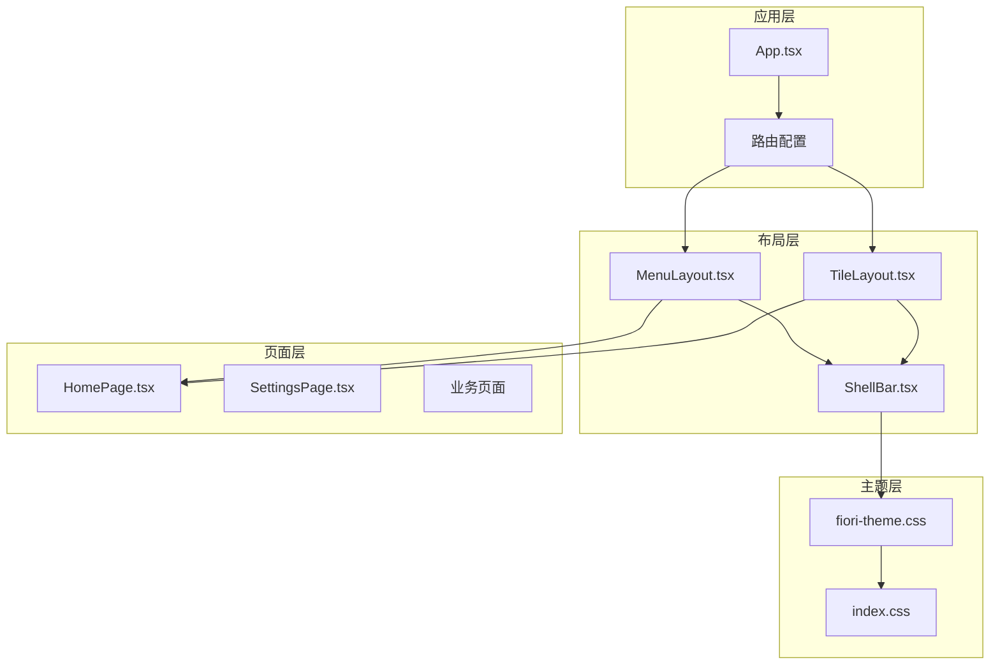
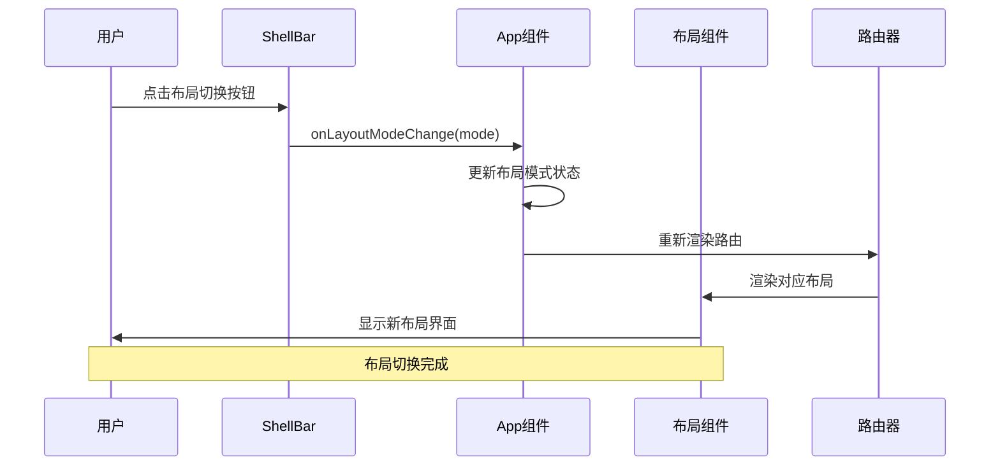
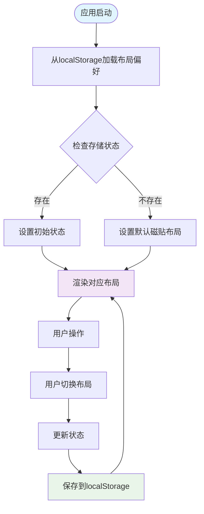
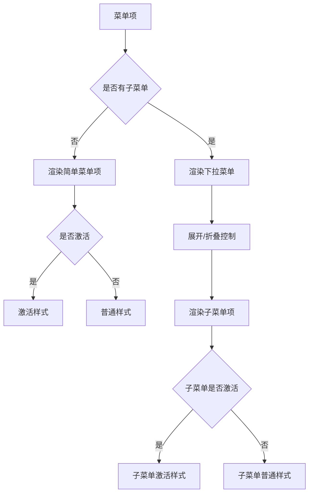
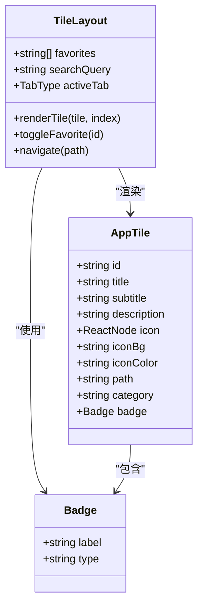
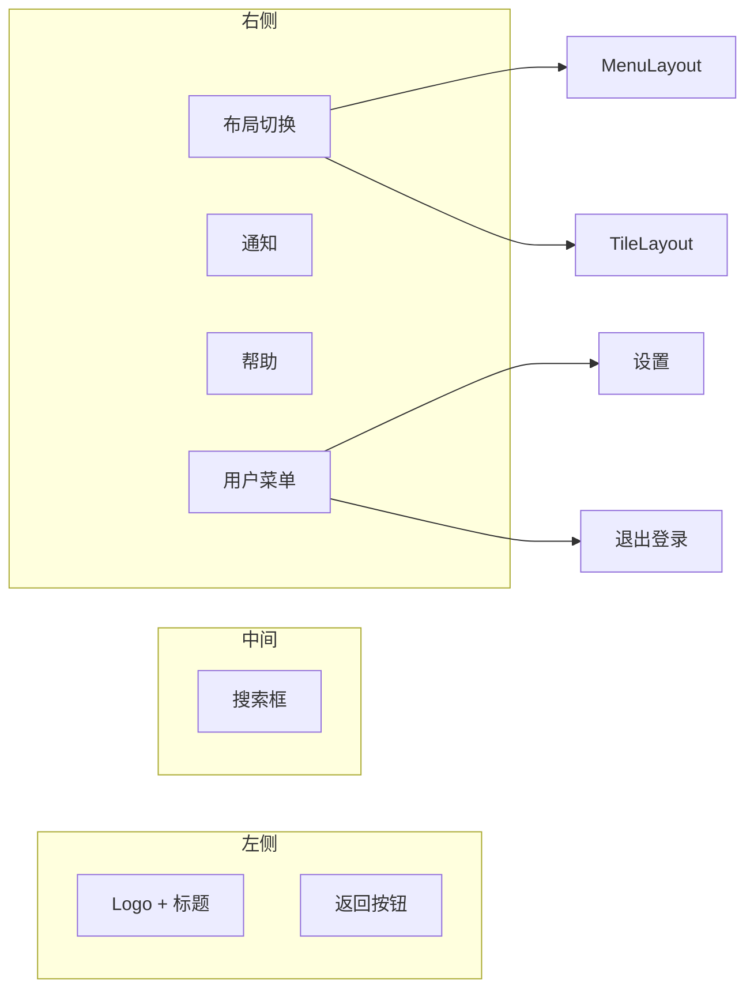

# 页面布局系统

<cite>
**本文档引用的文件**
- [MenuLayout.tsx](file://app/examples/admin/src/layouts/MenuLayout.tsx)
- [TileLayout.tsx](file://app/examples/admin/src/layouts/TileLayout.tsx)
- [App.tsx](file://app/examples/admin/src/App.tsx)
- [ShellBar.tsx](file://app/examples/admin/src/components/ShellBar.tsx)
- [HomePage.tsx](file://app/examples/admin/src/pages/HomePage.tsx)
- [SettingsPage.tsx](file://app/examples/admin/src/pages/SettingsPage.tsx)
- [ListPage.tsx](file://app/examples/admin/src/pages/purchase-requisitions/ListPage.tsx)
- [CreatePage.tsx](file://app/examples/admin/src/pages/purchase-requisitions/CreatePage.tsx)
- [fiori-theme.css](file://app/framework/admin-component/src/styles/fiori-theme.css)
- [index.css](file://app/examples/admin/src/index.css)
</cite>

## 目录
1. [简介](#简介)
2. [项目结构](#项目结构)
3. [核心组件](#核心组件)
4. [架构概览](#架构概览)
5. [详细组件分析](#详细组件分析)
6. [依赖关系分析](#依赖关系分析)
7. [性能考虑](#性能考虑)
8. [故障排除指南](#故障排除指南)
9. [结论](#结论)

## 简介

页面布局系统是基于 SAP Fiori 设计规范的企业级应用框架，提供了两种主要的布局模式：菜单布局（MenuLayout）和磁贴布局（TileLayout）。该系统旨在为企业用户提供现代化、智能化、标准化的界面体验，支持响应式设计和主题定制。

系统的核心设计理念包括：
- **一致性**：遵循 SAP Fiori 设计语言，确保用户体验的一致性
- **可扩展性**：模块化的组件设计，便于功能扩展和定制
- **易用性**：直观的布局切换机制和用户友好的交互设计
- **性能优化**：合理的状态管理和渲染优化策略

## 项目结构

页面布局系统采用分层架构设计，主要包含以下层次：



**图表来源**
- [App.tsx](file://app/examples/admin/src/App.tsx#L72-L171)
- [MenuLayout.tsx](file://app/examples/admin/src/layouts/MenuLayout.tsx#L160-L418)
- [TileLayout.tsx](file://app/examples/admin/src/layouts/TileLayout.tsx#L200-L451)

**章节来源**
- [App.tsx](file://app/examples/admin/src/App.tsx#L1-L174)
- [MenuLayout.tsx](file://app/examples/admin/src/layouts/MenuLayout.tsx#L1-L421)
- [TileLayout.tsx](file://app/examples/admin/src/layouts/TileLayout.tsx#L1-L454)

## 核心组件

### MenuLayout - 菜单式布局

MenuLayout 实现了传统的侧边栏导航布局，基于 SAP Fiori 的设计规范，提供丰富的交互功能和视觉效果。

#### 主要特性
- **响应式侧边栏**：支持展开/收起，适应不同屏幕尺寸
- **多级菜单**：支持嵌套菜单结构和动态展开
- **活动状态管理**：智能识别当前激活的菜单项
- **徽章系统**：支持菜单项徽章显示
- **Fiori 风格**：完全符合 SAP Fiori 设计语言

#### 关键接口
```typescript
interface MenuItem {
  id: string;
  label: string;
  icon?: React.ReactNode;
  path?: string;
  children?: MenuItem[];
  badge?: string | number;
  group?: string;
}
```

#### 状态管理
- `sidebarOpen`: 控制侧边栏展开状态
- `expandedItems`: 管理展开的菜单项集合
- `location`: 当前路由位置信息

**章节来源**
- [MenuLayout.tsx](file://app/examples/admin/src/layouts/MenuLayout.tsx#L92-L158)
- [MenuLayout.tsx](file://app/examples/admin/src/layouts/MenuLayout.tsx#L160-L183)

### TileLayout - 磁贴式布局

TileLayout 提供了企业级应用门户风格的磁贴式布局，灵感来源于 SAP Fiori Launchpad。

#### 主要特性
- **应用磁贴**：美观的应用入口磁贴，支持分类组织
- **收藏功能**：用户可以收藏常用应用
- **搜索功能**：支持应用名称和描述的搜索
- **标签页导航**：收藏夹、最近使用、所有应用三种视图
- **响应式网格**：自适应不同屏幕尺寸的网格布局

#### 关键接口
```typescript
interface AppTile {
  id: string;
  title: string;
  subtitle?: string;
  description?: string;
  icon: React.ReactNode;
  iconBg: string;
  iconColor: string;
  path: string;
  category: string;
  badge?: { label: string; type: 'new' | 'attention' };
}
```

#### 状态管理
- `favorites`: 用户收藏的应用列表
- `searchQuery`: 搜索查询条件
- `activeTab`: 当前激活的标签页

**章节来源**
- [TileLayout.tsx](file://app/examples/admin/src/layouts/TileLayout.tsx#L62-L73)
- [TileLayout.tsx](file://app/examples/admin/src/layouts/TileLayout.tsx#L200-L206)

### ShellBar - 顶部工具栏

ShellBar 是布局系统的顶部导航组件，提供统一的工具栏界面。

#### 主要功能
- **布局切换**：在菜单布局和磁贴布局之间切换
- **用户菜单**：用户信息和账户操作
- **通知系统**：系统通知和消息提醒
- **搜索功能**：全局应用搜索
- **响应式设计**：适配不同设备尺寸

**章节来源**
- [ShellBar.tsx](file://app/examples/admin/src/components/ShellBar.tsx#L78-L89)
- [ShellBar.tsx](file://app/examples/admin/src/components/ShellBar.tsx#L102-L295)

## 架构概览

页面布局系统采用组件化架构，通过 props 和状态管理实现布局切换和状态同步。



**图表来源**
- [ShellBar.tsx](file://app/examples/admin/src/components/ShellBar.tsx#L154-L179)
- [App.tsx](file://app/examples/admin/src/App.tsx#L84-L86)
- [App.tsx](file://app/examples/admin/src/App.tsx#L91-L167)

### 状态管理模式

系统采用集中式状态管理模式，通过 localStorage 实现布局偏好的持久化存储。



**图表来源**
- [App.tsx](file://app/examples/admin/src/App.tsx#L72-L82)
- [App.tsx](file://app/examples/admin/src/App.tsx#L84-L86)

**章节来源**
- [App.tsx](file://app/examples/admin/src/App.tsx#L72-L86)

## 详细组件分析

### MenuLayout 详细分析

MenuLayout 实现了一个功能完整的侧边栏导航系统，具有以下特点：

#### 菜单渲染机制



**图表来源**
- [MenuLayout.tsx](file://app/examples/admin/src/layouts/MenuLayout.tsx#L185-L319)

#### 菜单分组系统

MenuLayout 将菜单项按功能分组，提供清晰的导航结构：

| 分组 | 功能 | 包含菜单项 |
|------|------|------------|
| 主导航 | 基础功能 | 首页 |
| 业务模块 | 核心业务功能 | 采购申请、采购订单、收货管理、主数据 |
| 分析报表 | 数据分析功能 | 采购申请报表、采购订单报表 |
| 系统管理 | 系统设置功能 | 系统设置 |

**章节来源**
- [MenuLayout.tsx](file://app/examples/admin/src/layouts/MenuLayout.tsx#L321-L325)
- [MenuLayout.tsx](file://app/examples/admin/src/layouts/MenuLayout.tsx#L102-L154)

### TileLayout 详细分析

TileLayout 实现了磁贴式应用门户，具有以下核心功能：

#### 磁贴渲染系统



**图表来源**
- [TileLayout.tsx](file://app/examples/admin/src/layouts/TileLayout.tsx#L62-L73)
- [TileLayout.tsx](file://app/examples/admin/src/layouts/TileLayout.tsx#L200-L206)

#### 应用分类系统

TileLayout 将应用按业务领域分类，提供清晰的功能组织：

| 分类 | 应用数量 | 颜色主题 | 图标 |
|------|----------|----------|------|
| MM-采购 | 4个 | 蓝色系 | 购物车、包裹、卡车、数据库 |
| 主数据 | 2个 | 绿色系 | 数据库 |
| 报表分析 | 1个 | 粉红色系 | 图表 |
| 系统管理 | 1个 | 灰色系 | 设置 |

**章节来源**
- [TileLayout.tsx](file://app/examples/admin/src/layouts/TileLayout.tsx#L173-L194)
- [TileLayout.tsx](file://app/examples/admin/src/layouts/TileLayout.tsx#L75-L170)

### ShellBar 组件分析

ShellBar 提供了统一的顶部工具栏界面，支持多种交互功能：

#### 功能模块



**图表来源**
- [ShellBar.tsx](file://app/examples/admin/src/components/ShellBar.tsx#L105-L295)

**章节来源**
- [ShellBar.tsx](file://app/examples/admin/src/components/ShellBar.tsx#L154-L179)
- [ShellBar.tsx](file://app/examples/admin/src/components/ShellBar.tsx#L200-L292)

## 依赖关系分析

页面布局系统的依赖关系呈现清晰的层次结构：

```mermaid
graph TB
subgraph "外部依赖"
React[React 18+]
Router[React Router DOM]
Tailwind[Tailwind CSS]
Lucide[Lucide Icons]
end
subgraph "内部组件"
MenuLayout
TileLayout
ShellBar
HomePage
SettingsPage
end
subgraph "主题系统"
FioriTheme[Fiori Theme CSS]
IndexCSS[Index CSS]
end
subgraph "业务页面"
PurchaseReq[采购申请页面]
MasterData[主数据页面]
Reports[报表页面]
end
React --> MenuLayout
React --> TileLayout
React --> ShellBar
Router --> MenuLayout
Router --> TileLayout
Tailwind --> MenuLayout
Tailwind --> TileLayout
Tailwind --> ShellBar
Lucide --> MenuLayout
Lucide --> TileLayout
MenuLayout --> ShellBar
TileLayout --> ShellBar
MenuLayout --> HomePage
TileLayout --> HomePage
ShellBar --> FioriTheme
FioriTheme --> IndexCSS
MenuLayout --> PurchaseReq
TileLayout --> PurchaseReq
MenuLayout --> MasterData
TileLayout --> MasterData
MenuLayout --> Reports
TileLayout --> Reports
```



**图表来源**
- [MenuLayout.tsx](file://app/examples/admin/src/layouts/MenuLayout.tsx#L6-L9)
- [TileLayout.tsx](file://app/examples/admin/src/layouts/TileLayout.tsx#L8-L20)
- [ShellBar.tsx](file://app/examples/admin/src/components/ShellBar.tsx#L6-L8)

### 组件耦合度分析

系统采用松耦合设计，各组件之间的依赖关系清晰：

| 组件 | 直接依赖 | 间接依赖 | 耦合度 |
|------|----------|----------|--------|
| MenuLayout | ShellBar, React Router | Tailwind CSS, Lucide Icons | 低 |
| TileLayout | ShellBar, React Router | Tailwind CSS, Lucide Icons | 低 |
| ShellBar | React Router, Tailwind CSS | Lucide Icons | 中等 |
| App | MenuLayout, TileLayout | localStorage API | 中等 |

**章节来源**
- [App.tsx](file://app/examples/admin/src/App.tsx#L5-L8)
- [MenuLayout.tsx](file://app/examples/admin/src/layouts/MenuLayout.tsx#L6-L9)
- [TileLayout.tsx](file://app/examples/admin/src/layouts/TileLayout.tsx#L6-L20)

## 性能考虑

### 渲染优化策略

1. **条件渲染**：根据布局模式选择性渲染组件
2. **状态分离**：将布局相关的状态与业务状态分离
3. **记忆化计算**：使用 useMemo 优化磁贴分类计算
4. **懒加载**：页面内容按需加载

### 内存管理

- **状态清理**：组件卸载时清理不必要的状态
- **事件监听**：及时移除事件监听器
- **定时器清理**：避免内存泄漏

### 网络优化

- **图标优化**：使用 SVG 图标减少图片请求
- **字体优化**：预加载 SAP UI 72 字体
- **CSS 优化**：使用 Tailwind CSS 进行样式优化

## 故障排除指南

### 常见问题及解决方案

#### 布局切换失效

**问题描述**：点击布局切换按钮后界面不发生变化

**可能原因**：
1. 状态更新未触发重新渲染
2. localStorage 存储失败
3. 路由配置错误

**解决方案**：
1. 检查 `onLayoutModeChange` 函数是否正确传递
2. 验证 localStorage 权限设置
3. 确认路由配置中的布局组件正确

#### 菜单展开异常

**问题描述**：菜单项无法正常展开或折叠

**可能原因**：
1. `expandedItems` 状态管理错误
2. 菜单项 ID 冲突
3. 条件渲染逻辑错误

**解决方案**：
1. 检查菜单项 ID 的唯一性
2. 验证 `toggleExpand` 函数逻辑
3. 确认 `expandedItems` 状态初始化

#### 磁贴渲染问题

**问题描述**：磁贴显示异常或布局错乱

**可能原因**：
1. CSS 样式冲突
2. 磁贴数据格式错误
3. 响应式断点配置不当

**解决方案**：
1. 检查 Tailwind CSS 类名
2. 验证 `AppTile` 接口数据格式
3. 调整响应式断点设置

**章节来源**
- [App.tsx](file://app/examples/admin/src/App.tsx#L79-L82)
- [MenuLayout.tsx](file://app/examples/admin/src/layouts/MenuLayout.tsx#L165-L169)
- [TileLayout.tsx](file://app/examples/admin/src/layouts/TileLayout.tsx#L233-L237)

## 结论

页面布局系统成功实现了两种主要的布局模式，为用户提供了灵活且一致的界面体验。系统的主要优势包括：

### 技术优势
- **设计一致性**：完全遵循 SAP Fiori 设计规范
- **组件复用性**：模块化设计便于功能扩展
- **状态管理**：合理的状态分离和持久化策略
- **性能优化**：多种渲染和内存优化技术

### 用户体验优势
- **直观的布局切换**：一键切换不同的布局模式
- **响应式设计**：适配各种设备和屏幕尺寸
- **个性化定制**：支持用户偏好的持久化存储
- **快速导航**：高效的菜单和磁贴导航系统

### 扩展性设计
系统采用松耦合架构，便于添加新的布局模式和功能模块。开发者可以通过以下方式扩展系统：

1. **新增布局模式**：参考现有布局组件的实现模式
2. **自定义主题**：基于现有的 CSS 变量系统进行主题定制
3. **功能扩展**：通过插件化的方式添加新的业务功能

该布局系统为企业级应用开发提供了坚实的基础，能够满足复杂业务场景的需求，同时保持良好的用户体验和技术可维护性。