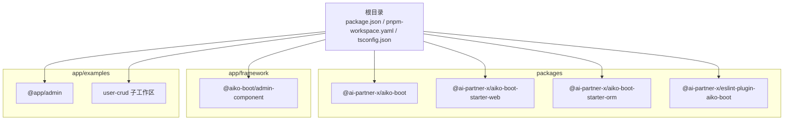
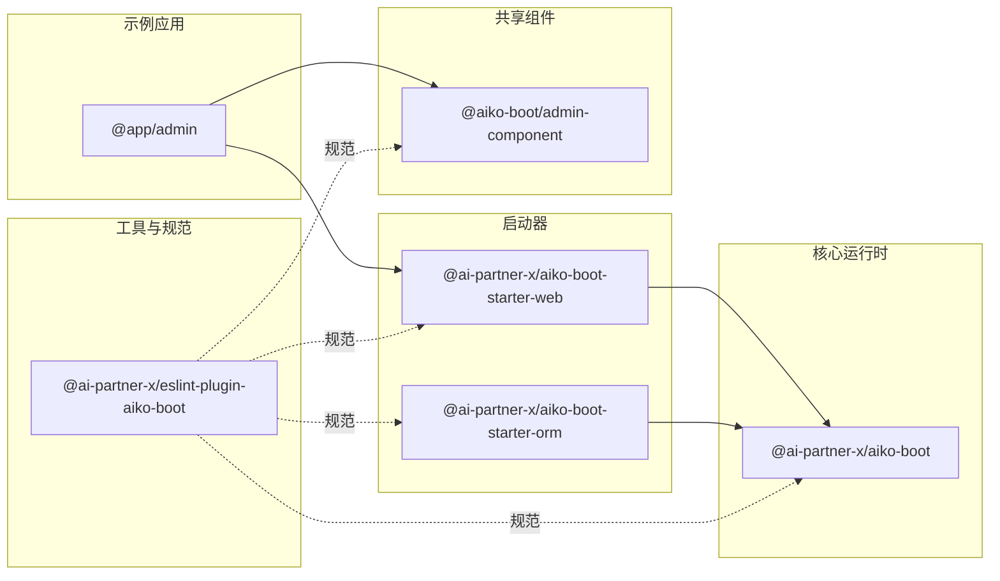
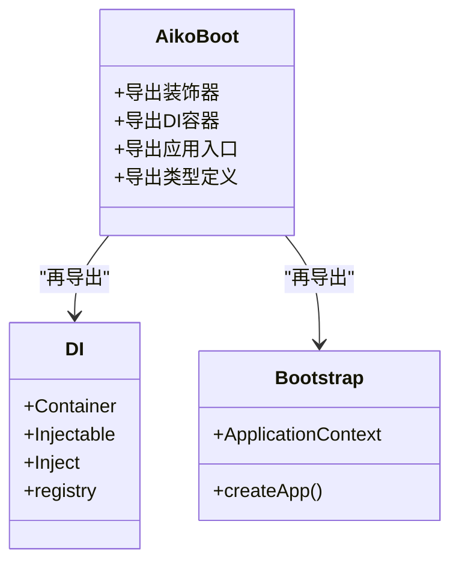
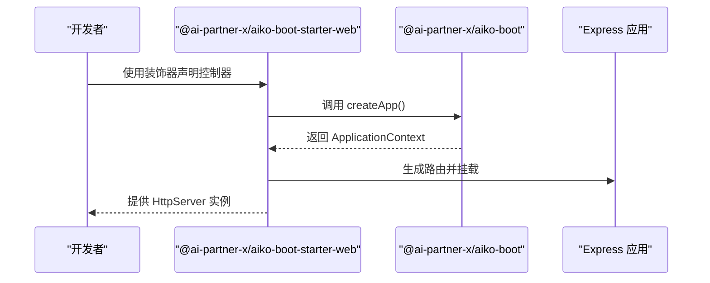
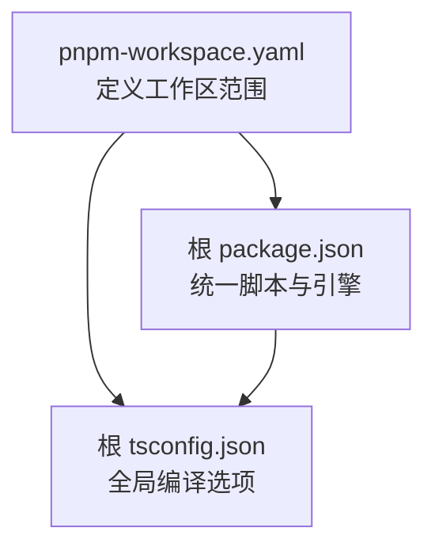

# Monorepo 管理

<cite>
**本文引用的文件**
- [package.json](file://package.json)
- [pnpm-workspace.yaml](file://pnpm-workspace.yaml)
- [tsconfig.json](file://tsconfig.json)
- [packages/aiko-boot/package.json](file://packages/aiko-boot/package.json)
- [packages/aiko-boot-starter-web/package.json](file://packages/aiko-boot-starter-web/package.json)
- [packages/aiko-boot-starter-orm/package.json](file://packages/aiko-boot-starter-orm/package.json)
- [packages/eslint-plugin-aiko-boot/package.json](file://packages/eslint-plugin-aiko-boot/package.json)
- [packages/aiko-boot-starter-web/tsconfig.json](file://packages/aiko-boot-starter-web/tsconfig.json)
- [app/framework/admin-component/package.json](file://app/framework/admin-component/package.json)
- [app/framework/admin-component/tsconfig.json](file://app/framework/admin-component/tsconfig.json)
- [app/examples/admin/package.json](file://app/examples/admin/package.json)
- [app/examples/admin/vite.config.ts](file://app/examples/admin/vite.config.ts)
- [app/examples/admin/tsconfig.app.json](file://app/examples/admin/tsconfig.app.json)
- [app/examples/user-crud/package.json](file://app/examples/user-crud/package.json)
- [app/examples/user-crud/pnpm-workspace.yaml](file://app/examples/user-crud/pnpm-workspace.yaml)
- [packages/aiko-boot/src/index.ts](file://packages/aiko-boot/src/index.ts)
- [packages/aiko-boot-starter-web/src/index.ts](file://packages/aiko-boot-starter-web/src/index.ts)
- [app/framework/admin-component/src/index.ts](file://app/framework/admin-component/src/index.ts)
</cite>

## 目录
1. [简介](#简介)
2. [项目结构](#项目结构)
3. [核心组件](#核心组件)
4. [架构总览](#架构总览)
5. [详细组件分析](#详细组件分析)
6. [依赖关系分析](#依赖关系分析)
7. [性能与构建优化](#性能与构建优化)
8. [开发环境配置与调试](#开发环境配置与调试)
9. [发布与版本管理最佳实践](#发布与版本管理最佳实践)
10. [故障排查指南](#故障排查指南)
11. [结论](#结论)

## 简介
本项目是一个基于 pnpm workspace 的多包管理仓库，围绕“Aiko Boot”全栈框架展开，涵盖核心运行时、Web 启动器、ORM 启动器、ESLint 插件以及前端示例应用与共享组件库。仓库通过统一的 TypeScript 配置与脚本约定，实现跨包的一致性与可维护性；同时提供示例工程演示如何在 Monorepo 中组织业务应用与共享组件。

## 项目结构
仓库采用分层与功能混合的组织方式：
- packages：核心包与启动器（运行时、Web、ORM、ESLint 插件）
- app/framework：共享组件与 UI 基础设施
- app/examples：示例应用与子工作区（admin 示例、user-crud 子仓库）
- 根级配置：pnpm 工作区、全局 tsconfig、根脚本与引擎约束

图表来源
- [pnpm-workspace.yaml](file://pnpm-workspace.yaml#L1-L6)
- [packages/aiko-boot/package.json](file://packages/aiko-boot/package.json#L1-L61)
- [packages/aiko-boot-starter-web/package.json](file://packages/aiko-boot-starter-web/package.json#L1-L60)
- [packages/aiko-boot-starter-orm/package.json](file://packages/aiko-boot-starter-orm/package.json#L1-L55)
- [packages/eslint-plugin-aiko-boot/package.json](file://packages/eslint-plugin-aiko-boot/package.json#L1-L45)
- [app/framework/admin-component/package.json](file://app/framework/admin-component/package.json#L1-L43)
- [app/examples/admin/package.json](file://app/examples/admin/package.json#L1-L31)
- [app/examples/user-crud/pnpm-workspace.yaml](file://app/examples/user-crud/pnpm-workspace.yaml#L1-L5)

章节来源
- [pnpm-workspace.yaml](file://pnpm-workspace.yaml#L1-L6)
- [package.json](file://package.json#L1-L32)
- [tsconfig.json](file://tsconfig.json#L1-L33)

## 核心组件
- 运行时核心（@ai-partner-x/aiko-boot）：提供依赖注入、装饰器、自动配置、生命周期事件等能力，并导出应用入口与上下文类型。
- Web 启动器（@ai-partner-x/aiko-boot-starter-web）：提供 Spring Boot 风格的 HTTP 装饰器、Express 路由自动生成、Feign 风格客户端与服务器配置。
- ORM 启动器（@ai-partner-x/aiko-boot-starter-orm）：提供与 MyBatis-Plus 兼容的装饰器与数据库访问能力，支持多种数据库适配。
- ESLint 插件（@ai-partner-x/eslint-plugin-aiko-boot）：强制 Java 风格的 TypeScript 编码规范，确保跨包一致性。
- 共享组件库（@aiko-boot/admin-component）：React 生态 UI 组件与工具集合，供示例应用复用。
- 示例应用（@app/admin）：Vite + React 的前端示例，依赖共享组件库与路由等生态。

章节来源
- [packages/aiko-boot/src/index.ts](file://packages/aiko-boot/src/index.ts#L1-L64)
- [packages/aiko-boot-starter-web/src/index.ts](file://packages/aiko-boot-starter-web/src/index.ts#L1-L73)
- [app/framework/admin-component/src/index.ts](file://app/framework/admin-component/src/index.ts#L1-L38)
- [packages/aiko-boot/package.json](file://packages/aiko-boot/package.json#L1-L61)
- [packages/aiko-boot-starter-web/package.json](file://packages/aiko-boot-starter-web/package.json#L1-L60)
- [packages/aiko-boot-starter-orm/package.json](file://packages/aiko-boot-starter-orm/package.json#L1-L55)
- [packages/eslint-plugin-aiko-boot/package.json](file://packages/eslint-plugin-aiko-boot/package.json#L1-L45)
- [app/framework/admin-component/package.json](file://app/framework/admin-component/package.json#L1-L43)
- [app/examples/admin/package.json](file://app/examples/admin/package.json#L1-L31)

## 架构总览
下图展示了 Monorepo 的包依赖与交互关系，强调核心运行时、Web/ORM 启动器、共享组件与示例应用之间的层次化依赖。

图表来源
- [packages/aiko-boot/package.json](file://packages/aiko-boot/package.json#L35-L44)
- [packages/aiko-boot-starter-web/package.json](file://packages/aiko-boot-starter-web/package.json#L32-L37)
- [packages/aiko-boot-starter-orm/package.json](file://packages/aiko-boot-starter-orm/package.json#L24-L29)
- [app/framework/admin-component/package.json](file://app/framework/admin-component/package.json#L19-L29)
- [app/examples/admin/package.json](file://app/examples/admin/package.json#L12-L18)
- [packages/eslint-plugin-aiko-boot/package.json](file://packages/eslint-plugin-aiko-boot/package.json#L28-L32)

## 详细组件分析

### 核心运行时（@ai-partner-x/aiko-boot）
- 职责：提供依赖注入容器、领域装饰器（组件/服务）、配置系统、自动配置、生命周期事件与异常处理等。
- 导出要点：类型定义、装饰器 API、DI 容器与应用入口 createApp。
- 版本与打包：使用 tsup 构建，产物通过 exports 字段暴露多入口，支持 peerDependencies 以降低重复安装。

图表来源
- [packages/aiko-boot/src/index.ts](file://packages/aiko-boot/src/index.ts#L19-L63)
- [packages/aiko-boot/package.json](file://packages/aiko-boot/package.json#L8-L25)

章节来源
- [packages/aiko-boot/src/index.ts](file://packages/aiko-boot/src/index.ts#L1-L64)
- [packages/aiko-boot/package.json](file://packages/aiko-boot/package.json#L1-L61)

### Web 启动器（@ai-partner-x/aiko-boot-starter-web）
- 职责：提供 HTTP 控制器装饰器、请求映射、Express 路由生成、API 客户端与服务器配置。
- 依赖关系：依赖核心运行时与 ORM 启动器，导出 createApp 以便快速搭建服务端。
- 构建与导出：使用 tsup，按需导出 express 路由与客户端。

图表来源
- [packages/aiko-boot-starter-web/src/index.ts](file://packages/aiko-boot-starter-web/src/index.ts#L39-L68)
- [packages/aiko-boot/package.json](file://packages/aiko-boot/package.json#L8-L25)
- [packages/aiko-boot-starter-web/package.json](file://packages/aiko-boot-starter-web/package.json#L32-L37)

章节来源
- [packages/aiko-boot-starter-web/src/index.ts](file://packages/aiko-boot-starter-web/src/index.ts#L1-L73)
- [packages/aiko-boot-starter-web/package.json](file://packages/aiko-boot-starter-web/package.json#L1-L60)

### ORM 启动器（@ai-partner-x/aiko-boot-starter-orm）
- 职责：提供与 MyBatis-Plus 兼容的装饰器与数据库访问能力，支持 better-sqlite3 与 pg 等后端。
- 依赖关系：依赖核心运行时与数据库驱动，作为 Web 启动器的配套模块。
- 可选依赖：通过 peerDependenciesMeta 标记可选数据库驱动。

章节来源
- [packages/aiko-boot-starter-orm/package.json](file://packages/aiko-boot-starter-orm/package.json#L1-L55)

### 共享组件库（@aiko-boot/admin-component）
- 职责：提供 React UI 组件与工具函数，配合 TailwindCSS 与 Radix UI 生态。
- 依赖关系：依赖 UI 生态库与 React，作为示例应用的共享基础。
- 开发模式：使用 tsup watch 模式进行开发，支持 lint。

章节来源
- [app/framework/admin-component/package.json](file://app/framework/admin-component/package.json#L1-L43)
- [app/framework/admin-component/tsconfig.json](file://app/framework/admin-component/tsconfig.json#L1-L15)
- [app/framework/admin-component/src/index.ts](file://app/framework/admin-component/src/index.ts#L1-L38)

### 示例应用（@app/admin）
- 职责：展示如何在 Vite + React 环境中集成共享组件库与 Web 启动器。
- 依赖关系：依赖共享组件库与路由生态，开发脚本直接调用 Vite。
- 配置要点：Vite 别名、PostCSS、TypeScript 构建信息缓存等。

章节来源
- [app/examples/admin/package.json](file://app/examples/admin/package.json#L1-L31)
- [app/examples/admin/vite.config.ts](file://app/examples/admin/vite.config.ts#L1-L16)
- [app/examples/admin/tsconfig.app.json](file://app/examples/admin/tsconfig.app.json#L1-L29)

### 用户 CRUD 示例子工作区（user-crud）
- 职责：演示如何在独立子工作区中复用根工作区与框架包，实现 API、管理端与移动端的并行开发。
- 依赖关系：通过 pnpm-workspace.yaml 将 packages 与 framework 包纳入管理。

章节来源
- [app/examples/user-crud/package.json](file://app/examples/user-crud/package.json#L1-L20)
- [app/examples/user-crud/pnpm-workspace.yaml](file://app/examples/user-crud/pnpm-workspace.yaml#L1-L5)

## 依赖关系分析
- 工作区范围：根工作区包含 packages、app/framework、app/examples 与 user-crud 子工作区。
- 包间依赖：Web 启动器依赖核心运行时与 ORM 启动器；示例应用依赖共享组件库与 Web 启动器；ESLint 插件对所有包施加编码规范。
- 版本与导出：核心包通过 exports 字段精确暴露入口，便于按需加载与 Tree Shaking。

图表来源
- [pnpm-workspace.yaml](file://pnpm-workspace.yaml#L1-L6)
- [package.json](file://package.json#L11-L18)
- [tsconfig.json](file://tsconfig.json#L2-L30)

章节来源
- [pnpm-workspace.yaml](file://pnpm-workspace.yaml#L1-L6)
- [package.json](file://package.json#L1-L32)
- [tsconfig.json](file://tsconfig.json#L1-L33)

## 性能与构建优化
- 并行构建：根脚本使用 pnpm -r --parallel dev 与 pnpm -r build，提升整体开发与构建效率。
- 分包构建：各包使用 tsup 独立构建，减少无关包的重新编译。
- 类型检查：提供 type-check 脚本，避免在构建阶段执行类型检查导致的阻塞。
- 构建缓存：示例应用启用 TypeScript 构建信息缓存，缩短增量编译时间。
- 依赖去重：通过 pnpm workspace 自动去重与链接，减少磁盘占用与安装时间。

章节来源
- [package.json](file://package.json#L11-L18)
- [app/examples/admin/tsconfig.app.json](file://app/examples/admin/tsconfig.app.json#L3-L4)

## 开发环境配置与调试
- 本地开发：使用 pnpm -r --parallel dev 启动所有包；示例应用使用 Vite 的热更新与别名配置。
- 调试配置：建议在 IDE 中为各包配置独立的调试任务，指向各自的入口或测试脚本。
- 本地链接：pnpm workspace 自动解析 workspace:* 依赖，无需手动 link；如需本地修改核心包，可在根目录执行安装后重新构建。
- ESLint/Prettier：根级规则与插件统一风格，确保跨包一致性。

章节来源
- [package.json](file://package.json#L11-L18)
- [app/examples/admin/vite.config.ts](file://app/examples/admin/vite.config.ts#L7-L11)
- [packages/eslint-plugin-aiko-boot/package.json](file://packages/eslint-plugin-aiko-boot/package.json#L1-L45)

## 发布与版本管理最佳实践
- 版本策略：统一在各包的 package.json 中维护版本号，保持与 Git 标签一致；建议采用语义化版本。
- 变更日志：为每个包维护 CHANGELOG 或使用工具自动生成；在根级 README 中汇总各包变更摘要。
- 自动化发布：结合 CI 在 PR 合并或打标签时触发发布流程，确保构建产物与导出字段正确。
- 导出字段：严格维护 exports 字段，确保消费者仅导入所需入口，避免破坏性变更影响使用者。
- peerDependencies：对 React、Express 等外部依赖使用 peerDependencies，降低重复安装与运行时冲突风险。

章节来源
- [packages/aiko-boot/package.json](file://packages/aiko-boot/package.json#L8-L25)
- [packages/aiko-boot-starter-web/package.json](file://packages/aiko-boot-starter-web/package.json#L8-L21)
- [packages/aiko-boot-starter-orm/package.json](file://packages/aiko-boot-starter-orm/package.json#L8-L16)
- [app/framework/admin-component/package.json](file://app/framework/admin-component/package.json#L8-L13)

## 故障排查指南
- 依赖解析失败：确认 pnpm-workspace.yaml 中的包路径是否正确，且包内 package.json 的 name 与路径匹配。
- 构建错误：检查各包的 tsconfig 是否继承根 tsconfig，避免 moduleResolution 不一致导致的解析问题。
- 热更新失效：确认 Vite 配置中的别名与类型声明路径正确，避免 IDE 与构建工具的路径差异。
- ESLint 报错：根据插件规则调整代码风格，必要时在包内添加 .eslintignore 排除特定文件。
- 并行构建卡顿：适当减少并行度或拆分任务，优先保证核心包的可用性。

章节来源
- [pnpm-workspace.yaml](file://pnpm-workspace.yaml#L1-L6)
- [tsconfig.json](file://tsconfig.json#L2-L6)
- [app/examples/admin/vite.config.ts](file://app/examples/admin/vite.config.ts#L7-L11)
- [packages/eslint-plugin-aiko-boot/package.json](file://packages/eslint-plugin-aiko-boot/package.json#L28-L32)

## 结论
本仓库通过 pnpm workspace 将核心运行时、启动器、共享组件与示例应用有机整合，形成一套可复用、可扩展的全栈开发体系。借助统一的 TypeScript 配置、严格的导出与依赖策略，以及并行化的构建与开发脚本，能够有效提升团队协作效率与项目长期可维护性。建议在后续迭代中完善自动化发布流程与变更日志管理，持续优化构建性能与开发体验。