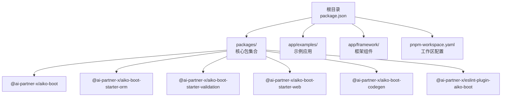
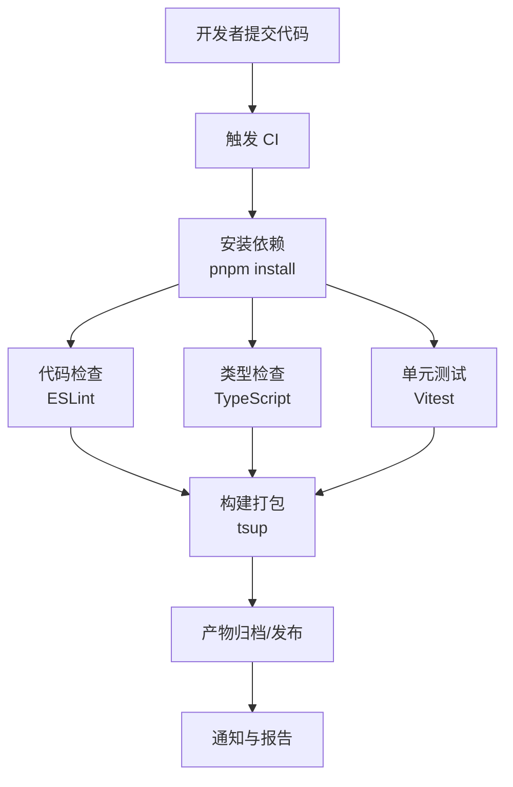
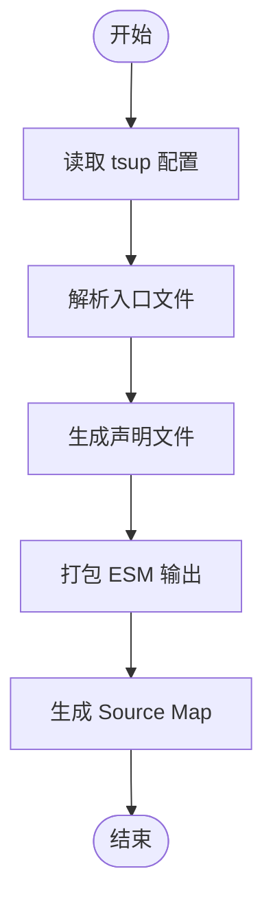
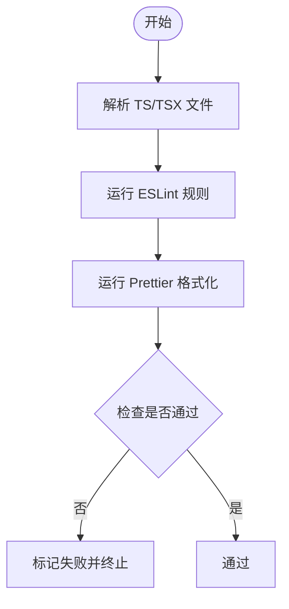
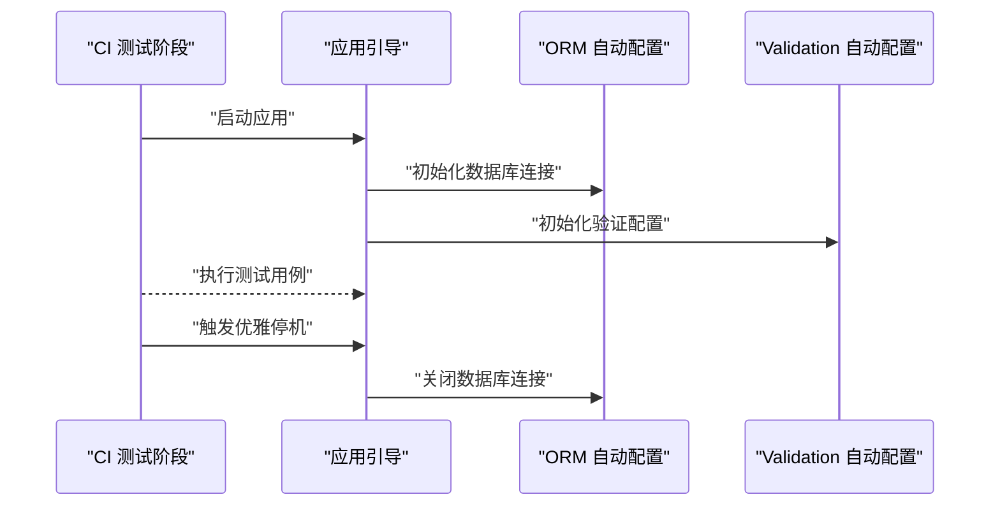
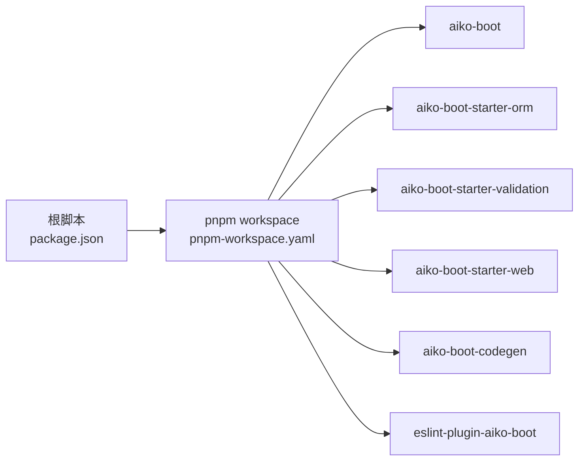

# CI/CD 流水线

<cite>
**本文引用的文件**
- [package.json](file://package.json)
- [pnpm-workspace.yaml](file://pnpm-workspace.yaml)
- [README.md](file://README.md)
- [.eslintrc.json](file://.eslintrc.json)
- [.prettierrc.json](file://.prettierrc.json)
- [tsconfig.json](file://tsconfig.json)
- [packages/aiko-boot/tsup.config.ts](file://packages/aiko-boot/tsup.config.ts)
- [packages/aiko-boot-starter-validation/tsup.config.ts](file://packages/aiko-boot-starter-validation/tsup.config.ts)
- [packages/aiko-boot-codegen/src/tsup-plugin.ts](file://packages/aiko-boot-codegen/src/tsup-plugin.ts)
- [packages/aiko-boot/src/boot/lifecycle.ts](file://packages/aiko-boot/src/boot/lifecycle.ts)
- [packages/aiko-boot-starter-orm/src/auto-configuration.ts](file://packages/aiko-boot-starter-orm/src/auto-configuration.ts)
- [packages/aiko-boot-starter-validation/src/auto-configuration.ts](file://packages/aiko-boot-starter-validation/src/auto-configuration.ts)
</cite>

## 目录
1. [简介](#简介)
2. [项目结构](#项目结构)
3. [核心组件](#核心组件)
4. [架构总览](#架构总览)
5. [详细组件分析](#详细组件分析)
6. [依赖关系分析](#依赖关系分析)
7. [性能考量](#性能考量)
8. [故障排查指南](#故障排查指南)
9. [结论](#结论)
10. [附录](#附录)

## 简介
本文件面向 CI/CD 流水线的配置与管理，结合仓库现有构建与测试配置，给出自动化构建、测试、打包与发布的实施建议。当前仓库已具备 monorepo 基础、统一的脚本入口、ESLint/Prettier 规范以及基于 tsup 的打包配置，可作为 CI/CD 的执行基础。

## 项目结构
仓库采用 pnpm workspace 的 monorepo 结构，顶层通过统一脚本驱动各子包的构建、测试与类型检查；同时提供示例应用与框架组件，便于在流水线中进行端到端验证。

图表来源
- [package.json](file://package.json#L11-L18)
- [pnpm-workspace.yaml](file://pnpm-workspace.yaml#L1-L6)

章节来源
- [package.json](file://package.json#L1-L32)
- [pnpm-workspace.yaml](file://pnpm-workspace.yaml#L1-L6)
- [README.md](file://README.md#L14-L33)

## 核心组件
- 统一脚本入口：通过根目录脚本统一触发各子包的构建、测试、类型检查与清理，便于在 CI 中复用。
- 规范工具链：ESLint + Prettier 提供静态检查与格式化；TypeScript 编译配置确保类型安全与构建一致性。
- 打包工具：各包使用 tsup 进行 ESM 打包，生成声明文件与 Source Map，便于发布与调试。
- 生命周期与自动配置：核心包提供生命周期事件与自动配置能力，可在 CI 中用于启动/停止阶段的钩子。

章节来源
- [package.json](file://package.json#L11-L18)
- [.eslintrc.json](file://.eslintrc.json#L1-L26)
- [.prettierrc.json](file://.prettierrc.json#L1-L10)
- [tsconfig.json](file://tsconfig.json#L1-L33)
- [packages/aiko-boot/tsup.config.ts](file://packages/aiko-boot/tsup.config.ts#L1-L17)
- [packages/aiko-boot-starter-validation/tsup.config.ts](file://packages/aiko-boot-starter-validation/tsup.config.ts#L1-L9)
- [packages/aiko-boot-codegen/src/tsup-plugin.ts](file://packages/aiko-boot-codegen/src/tsup-plugin.ts#L1-L23)

## 架构总览
下图展示 CI/CD 流水线的关键阶段与对应执行点，映射到仓库中的实际脚本与配置：

图表来源
- [package.json](file://package.json#L11-L18)
- [.eslintrc.json](file://.eslintrc.json#L1-L26)
- [tsconfig.json](file://tsconfig.json#L1-L33)

## 详细组件分析

### 构建与打包（tsup）
- 各包使用 tsup 进行 ESM 打包，生成声明文件与 Source Map，支持树摇与外部化依赖，适合发布到 npm。
- 建议在 CI 中固定 Node 版本与 pnpm 版本，确保构建一致性。

图表来源
- [packages/aiko-boot/tsup.config.ts](file://packages/aiko-boot/tsup.config.ts#L1-L17)
- [packages/aiko-boot-starter-validation/tsup.config.ts](file://packages/aiko-boot-starter-validation/tsup.config.ts#L1-L9)

章节来源
- [packages/aiko-boot/tsup.config.ts](file://packages/aiko-boot/tsup.config.ts#L1-L17)
- [packages/aiko-boot-starter-validation/tsup.config.ts](file://packages/aiko-boot-starter-validation/tsup.config.ts#L1-L9)
- [packages/aiko-boot-codegen/src/tsup-plugin.ts](file://packages/aiko-boot-codegen/src/tsup-plugin.ts#L1-L23)

### 代码检查（ESLint + Prettier）
- ESLint 配置启用推荐规则与 TypeScript 插件，对未使用变量、console 等进行约束。
- Prettier 统一格式风格，减少代码风格分歧。
- 建议在 CI 中将检查失败直接阻断流水线。

图表来源
- [.eslintrc.json](file://.eslintrc.json#L1-L26)
- [.prettierrc.json](file://.prettierrc.json#L1-L10)

章节来源
- [.eslintrc.json](file://.eslintrc.json#L1-L26)
- [.prettierrc.json](file://.prettierrc.json#L1-L10)

### 类型检查（TypeScript）
- 顶层 tsconfig 提供严格模式与装饰器支持，确保类型安全。
- 建议在 CI 中单独执行类型检查，避免与构建并行导致资源竞争。

章节来源
- [tsconfig.json](file://tsconfig.json#L1-L33)

### 单元测试（Vitest）
- 顶层 package.json 提供 test 脚本，可并行运行各包测试。
- 建议在 CI 中收集覆盖率报告并在阈值不达标时阻断。

章节来源
- [package.json](file://package.json#L14-L14)

### 生命周期与自动配置（核心包）
- 核心包提供生命周期事件与自动配置能力，可用于在 CI 中模拟启动/停止阶段的钩子。
- 建议在集成测试前触发应用初始化，在测试后触发优雅停机。

图表来源
- [packages/aiko-boot/src/boot/lifecycle.ts](file://packages/aiko-boot/src/boot/lifecycle.ts#L316-L364)
- [packages/aiko-boot-starter-orm/src/auto-configuration.ts](file://packages/aiko-boot-starter-orm/src/auto-configuration.ts#L67-L101)
- [packages/aiko-boot-starter-validation/src/auto-configuration.ts](file://packages/aiko-boot-starter-validation/src/auto-configuration.ts#L68-L100)

章节来源
- [packages/aiko-boot/src/boot/lifecycle.ts](file://packages/aiko-boot/src/boot/lifecycle.ts#L316-L364)
- [packages/aiko-boot-starter-orm/src/auto-configuration.ts](file://packages/aiko-boot-starter-orm/src/auto-configuration.ts#L67-L101)
- [packages/aiko-boot-starter-validation/src/auto-configuration.ts](file://packages/aiko-boot-starter-validation/src/auto-configuration.ts#L68-L100)

## 依赖关系分析
- 顶层脚本依赖 pnpm workspace 的包发现与并行执行能力，确保 monorepo 内部依赖的一致性。
- 各包的打包配置相互独立，但共享相同的工具链（tsup、TypeScript），降低维护成本。

图表来源
- [package.json](file://package.json#L11-L18)
- [pnpm-workspace.yaml](file://pnpm-workspace.yaml#L1-L6)

章节来源
- [package.json](file://package.json#L11-L18)
- [pnpm-workspace.yaml](file://pnpm-workspace.yaml#L1-L6)

## 性能考量
- 并行执行：根脚本提供并行开发与测试入口，建议在 CI 中充分利用 CPU 核心数，缩短流水线时长。
- 构建缓存：在 CI 缓存 pnpm store 与构建产物，减少重复安装与编译时间。
- 选择性检查：在 PR 场景仅运行受影响包的检查与测试，必要时引入变更检测工具。

## 故障排查指南
- 依赖安装失败：确认 Node 与 pnpm 版本满足要求，检查网络代理与 registry 配置。
- ESLint 失败：根据规则提示修复未使用变量、console 等问题；必要时在本地先运行检查。
- 类型检查失败：修正类型错误或暂时放宽规则，确保主干稳定后再收紧。
- 测试失败：优先修复单测用例与被测模块，关注跨平台差异与环境变量。
- 构建失败：核对 tsup 配置与入口文件，确保外部化依赖与声明文件生成正常。

章节来源
- [package.json](file://package.json#L7-L10)
- [.eslintrc.json](file://.eslintrc.json#L16-L20)
- [tsconfig.json](file://tsconfig.json#L23-L29)

## 结论
本仓库已具备完善的 monorepo 基础与工具链，可直接作为 CI/CD 的执行载体。建议在 CI 中统一安装依赖、执行代码检查、类型检查、单元测试与打包发布，并结合覆盖率与静态分析提升质量门禁。对于部署与发布，可按需扩展至多环境部署与蓝绿/金丝雀策略，配合监控与告警实现闭环运维。

## 附录
- 版本与发布建议：采用语义化版本控制，结合变更日志生成与发布分支管理，确保发布可追溯。
- 部署策略：多环境部署、蓝绿与金丝雀发布需结合具体平台与基础设施，建议以容器化与声明式配置为基础。
- 监控与告警：在 CI/CD 中集成构建状态通知与部署结果反馈，建立快速响应机制。